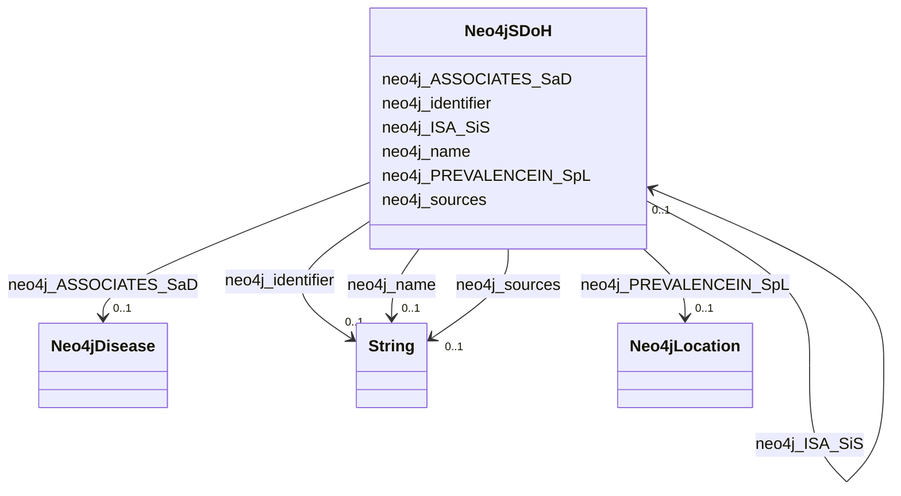

# Class: TODO -- what's a good name for this class (type)? (neo4j_SDoH)


_No type description provided_


URI: [neo4j:SDoH](neo4j://graph.schema#SDoH)





<!-- no inheritance hierarchy -->


## Slots

| Name | Cardinality and Range | Description | Inheritance |
| ---  | --- | --- | --- |
| [neo4j_identifier](../slots/neo4j_identifier.md) | 0..1 <br/> [xsd:string](xsd:string) | No slot description provided | direct |
| [neo4j_name](../slots/neo4j_name.md) | 0..1 <br/> [xsd:string](xsd:string) | No slot description provided | direct |
| [neo4j_ISA_SiS](../slots/neo4j_ISA_SiS.md) | 0..1 <br/> [Neo4jSDoH](../classes/Neo4jSDoH.md) | No slot description provided | direct |
| [neo4j_ASSOCIATES_SaD](../slots/neo4j_ASSOCIATES_SaD.md) | 0..1 <br/> [Neo4jDisease](../classes/Neo4jDisease.md) | No slot description provided | direct |
| [neo4j_sources](../slots/neo4j_sources.md) | 0..1 <br/> [xsd:string](xsd:string) | No slot description provided | direct |
| [neo4j_PREVALENCEIN_SpL](../slots/neo4j_PREVALENCEIN_SpL.md) | 0..1 <br/> [Neo4jLocation](../classes/Neo4jLocation.md) | No slot description provided | direct |


## Usages

| used by | used in | type | used |
| ---  | --- | --- | --- |
| [Neo4jSDoH](../classes/Neo4jSDoH.md) | [neo4j_ISA_SiS](../slots/neo4j_ISA_SiS.md) | range | [Neo4jSDoH](../classes/Neo4jSDoH.md) |


## Examples

| Value |
| --- |
| neo4j://graph.individuals#119274 |

## TODOs

* TODO -- Todos for this class go here
* or you can delete the todos
* if you think the class is perfect.

## Identifier and Mapping Information


### Schema Source


* from schema: spoke-kg


## Mappings

| Mapping Type | Mapped Value |
| ---  | ---  |
| self | neo4j:SDoH |
| native | spoke-kg/:Neo4jSDoH |


## LinkML Source

<!-- TODO: investigate https://stackoverflow.com/questions/37606292/how-to-create-tabbed-code-blocks-in-mkdocs-or-sphinx -->

### Direct

<details>
```yaml
name: neo4j_SDoH
description: No type description provided
title: TODO -- what's a good name for this class (type)?
todos:
- TODO -- Todos for this class go here
- or you can delete the todos
- if you think the class is perfect.
notes:
- Class with 1426 occurences.
examples:
- value: neo4j://graph.individuals#119274
from_schema: spoke-kg
rank: 1000
slots:
- neo4j_identifier
- neo4j_name
- neo4j_ISA_SiS
- neo4j_ASSOCIATES_SaD
- neo4j_sources
- neo4j_PREVALENCEIN_SpL
class_uri: neo4j:SDoH

```
</details>

### Induced

<details>
```yaml
name: neo4j_SDoH
description: No type description provided
title: TODO -- what's a good name for this class (type)?
todos:
- TODO -- Todos for this class go here
- or you can delete the todos
- if you think the class is perfect.
notes:
- Class with 1426 occurences.
examples:
- value: neo4j://graph.individuals#119274
from_schema: spoke-kg
rank: 1000
attributes:
  neo4j_identifier:
    name: neo4j_identifier
    description: No slot description provided
    todos:
    - TODO -- Todos for this slot go here
    - or you can delete the todos
    - if you think the class is perfect.
    comments:
    - 2 occurrences with subject type neo4j_Environment and object type string.
    - 1426 occurrences with subject type neo4j_SDoH and object type string.
    - 106067 occurrences with subject type neo4j_Location and object type string.
    - 180 occurrences with subject type neo4j_Disease and object type string.
    - 798 occurrences with subject type neo4j_Compound and object type string.
    - 321442 occurrences with subject type neo4j_Organism and object type string.
    examples:
    - value: neo4j://graph.individuals#105029 neo4j:identifier ENVO_01000405
    - value: neo4j://graph.individuals#119274 neo4j:identifier 158928002
    - value: neo4j://graph.individuals#123229 neo4j:identifier 049999985379
    - value: neo4j://graph.individuals#142359 neo4j:identifier DOID:3074
    - value: neo4j://graph.individuals#1961711 neo4j:identifier inchikey:NWXMGUDVXFXRIG-WESIUVDSSA-N
    - value: neo4j://graph.individuals#105042 neo4j:identifier 104102.36
    from_schema: spoke-kg
    rank: 1000
    slot_uri: neo4j:identifier
    alias: neo4j_identifier
    owner: neo4j_SDoH
    domain_of:
    - neo4j_Compound
    - neo4j_Disease
    - neo4j_Environment
    - neo4j_Location
    - neo4j_Organism
    - neo4j_SDoH
    range: string
  neo4j_name:
    name: neo4j_name
    description: No slot description provided
    todos:
    - TODO -- Todos for this slot go here
    - or you can delete the todos
    - if you think the class is perfect.
    comments:
    - 2 occurrences with subject type neo4j_Environment and object type string.
    - 1426 occurrences with subject type neo4j_SDoH and object type string.
    - 106067 occurrences with subject type neo4j_Location and object type string.
    - 180 occurrences with subject type neo4j_Disease and object type string.
    - 798 occurrences with subject type neo4j_Compound and object type string.
    - 321442 occurrences with subject type neo4j_Organism and object type string.
    examples:
    - value: neo4j://graph.individuals#105029 neo4j:name respirable suspended particulate
        matter
    - value: neo4j://graph.individuals#119274 neo4j:name Social scientist (occupation)
    - value: neo4j://graph.individuals#123229 neo4j:name Outside city limits
    - value: neo4j://graph.individuals#142359 neo4j:name giant cell glioblastoma
    - value: neo4j://graph.individuals#1961711 neo4j:name Tetracycline
    - value: neo4j://graph.individuals#105042 neo4j:name Acetobacter tropicalis strain
        DmPark25_167
    from_schema: spoke-kg
    rank: 1000
    slot_uri: neo4j:name
    alias: neo4j_name
    owner: neo4j_SDoH
    domain_of:
    - neo4j_Compound
    - neo4j_Disease
    - neo4j_Environment
    - neo4j_Location
    - neo4j_Organism
    - neo4j_SDoH
    range: string
  neo4j_ISA_SiS:
    name: neo4j_ISA_SiS
    description: No slot description provided
    todos:
    - TODO -- Todos for this slot go here
    - or you can delete the todos
    - if you think the class is perfect.
    comments:
    - 999 occurrences with subject type neo4j_SDoH and object type neo4j_SDoH.
    examples:
    - value: neo4j://graph.individuals#29697525 neo4j:ISA_SiS neo4j://graph.individuals#29589218
    from_schema: spoke-kg
    rank: 1000
    slot_uri: neo4j:ISA_SiS
    alias: neo4j_ISA_SiS
    owner: neo4j_SDoH
    domain_of:
    - neo4j_SDoH
    range: neo4j_SDoH
  neo4j_ASSOCIATES_SaD:
    name: neo4j_ASSOCIATES_SaD
    description: No slot description provided
    todos:
    - TODO -- Todos for this slot go here
    - or you can delete the todos
    - if you think the class is perfect.
    comments:
    - 39 occurrences with subject type neo4j_SDoH and object type neo4j_Disease.
    examples:
    - value: neo4j://graph.individuals#29589048 neo4j:ASSOCIATES_SaD neo4j://graph.individuals#152986
    from_schema: spoke-kg
    rank: 1000
    slot_uri: neo4j:ASSOCIATES_SaD
    alias: neo4j_ASSOCIATES_SaD
    owner: neo4j_SDoH
    domain_of:
    - neo4j_SDoH
    range: neo4j_Disease
  neo4j_sources:
    name: neo4j_sources
    description: No slot description provided
    todos:
    - TODO -- Todos for this slot go here
    - or you can delete the todos
    - if you think the class is perfect.
    comments:
    - 2 occurrences with subject type neo4j_Environment and object type string.
    - 1426 occurrences with subject type neo4j_SDoH and object type string.
    - 106067 occurrences with subject type neo4j_Location and object type string.
    - 3336 occurrences with subject type neo4j_Compound and object type string.
    - 321442 occurrences with subject type neo4j_Organism and object type string.
    examples:
    - value: neo4j://graph.individuals#105029 neo4j:sources Environment Ontology
    - value: neo4j://graph.individuals#119274 neo4j:sources SNOMED CT
    - value: neo4j://graph.individuals#123229 neo4j:sources UnitedStatesZipcode_database
    - value: neo4j://graph.individuals#1961711 neo4j:sources BioCyc
    - value: neo4j://graph.individuals#105042 neo4j:sources BV-BRC
    from_schema: spoke-kg
    rank: 1000
    slot_uri: neo4j:sources
    alias: neo4j_sources
    owner: neo4j_SDoH
    domain_of:
    - neo4j_Compound
    - neo4j_Environment
    - neo4j_Location
    - neo4j_Organism
    - neo4j_SDoH
    range: string
  neo4j_PREVALENCEIN_SpL:
    name: neo4j_PREVALENCEIN_SpL
    description: No slot description provided
    todos:
    - TODO -- Todos for this slot go here
    - or you can delete the todos
    - if you think the class is perfect.
    comments:
    - 2999117 occurrences with subject type neo4j_SDoH and object type neo4j_Location.
    examples:
    - value: neo4j://graph.individuals#29697526 neo4j:PREVALENCEIN_SpL neo4j://graph.individuals#29671883
    from_schema: spoke-kg
    rank: 1000
    slot_uri: neo4j:PREVALENCEIN_SpL
    alias: neo4j_PREVALENCEIN_SpL
    owner: neo4j_SDoH
    domain_of:
    - neo4j_SDoH
    range: neo4j_Location
class_uri: neo4j:SDoH

```
</details>