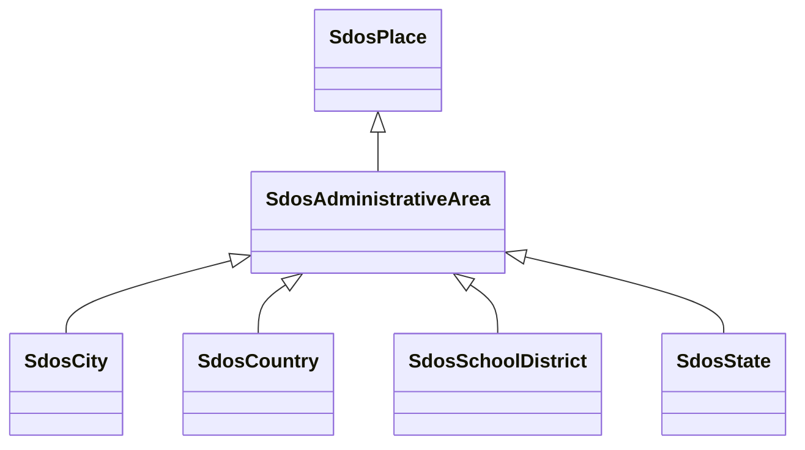

# Class: AdministrativeArea (sdos_AdministrativeArea)


_A geographical region, typically under the jurisdiction of a particular government._


This class occurs 113882 times.


URI: [sdos:AdministrativeArea](https://schema.org/AdministrativeArea)





## Inheritance
* [SdosThing](../classes/SdosThing.md)
    * [SdosPlace](../classes/SdosPlace.md)
        * **SdosAdministrativeArea**
            * [SdosCity](../classes/SdosCity.md)
            * [SdosCountry](../classes/SdosCountry.md)
            * [SdosSchoolDistrict](../classes/SdosSchoolDistrict.md)
            * [SdosState](../classes/SdosState.md)


## Slots

| Name | Cardinality and Range | Description | Inheritance | Occurrences |
| ---  | --- | --- | --- | --- |


## Usages

| used by | used in | type | used |
| ---  | --- | --- | --- |
| [HttpsPurl.orgOknFrinkKgSpokeSchemaSDoH](../classes/HttpsPurl.orgOknFrinkKgSpokeSchemaSDoH.md) | [https___purl.org_okn_frink_kg_spoke_schema_PREVALENCEIN_SpL](../slots/https___purl.org_okn_frink_kg_spoke_schema_PREVALENCEIN_SpL.md) | range | [SdosAdministrativeArea](../classes/SdosAdministrativeArea.md) |
| [HttpsW3id.orgBiolinkVocabChemicalEntity](../classes/HttpsW3id.orgBiolinkVocabChemicalEntity.md) | [https___purl.org_okn_frink_kg_spoke_schema_FOUNDIN_CfL](../slots/https___purl.org_okn_frink_kg_spoke_schema_FOUNDIN_CfL.md) | range | [SdosAdministrativeArea](../classes/SdosAdministrativeArea.md) |
| [HttpsW3id.orgBiolinkVocabDisease](../classes/HttpsW3id.orgBiolinkVocabDisease.md) | [https___purl.org_okn_frink_kg_spoke_schema_MORTALITY_DmL](../slots/https___purl.org_okn_frink_kg_spoke_schema_MORTALITY_DmL.md) | range | [SdosAdministrativeArea](../classes/SdosAdministrativeArea.md) |
| [HttpsW3id.orgBiolinkVocabDisease](../classes/HttpsW3id.orgBiolinkVocabDisease.md) | [https___purl.org_okn_frink_kg_spoke_schema_PREVALENCE_DpL](../slots/https___purl.org_okn_frink_kg_spoke_schema_PREVALENCE_DpL.md) | range | [SdosAdministrativeArea](../classes/SdosAdministrativeArea.md) |
| [HttpsW3id.orgBiolinkVocabEnvironmentalFeature](../classes/HttpsW3id.orgBiolinkVocabEnvironmentalFeature.md) | [https___purl.org_okn_frink_kg_spoke_schema_FOUNDIN_EfL](../slots/https___purl.org_okn_frink_kg_spoke_schema_FOUNDIN_EfL.md) | range | [SdosAdministrativeArea](../classes/SdosAdministrativeArea.md) |
| [HttpsW3id.orgBiolinkVocabOrganismTaxon](../classes/HttpsW3id.orgBiolinkVocabOrganismTaxon.md) | [https___purl.org_okn_frink_kg_spoke_schema_ISOLATEDIN_OiL](../slots/https___purl.org_okn_frink_kg_spoke_schema_ISOLATEDIN_OiL.md) | range | [SdosAdministrativeArea](../classes/SdosAdministrativeArea.md) |


## LinkML Source

<!-- TODO: investigate https://stackoverflow.com/questions/37606292/how-to-create-tabbed-code-blocks-in-mkdocs-or-sphinx -->

### Direct

<details>

```yaml
name: sdos_AdministrativeArea
description: A geographical region, typically under the jurisdiction of a particular
  government.
title: AdministrativeArea
from_schema: okns:sdo
is_a: sdos_Place
class_uri: sdos:AdministrativeArea

```
</details>

### Induced

<details>

```yaml
name: sdos_AdministrativeArea
description: A geographical region, typically under the jurisdiction of a particular
  government.
title: AdministrativeArea
from_schema: okns:sdo
is_a: sdos_Place
class_uri: sdos:AdministrativeArea

```
</details>