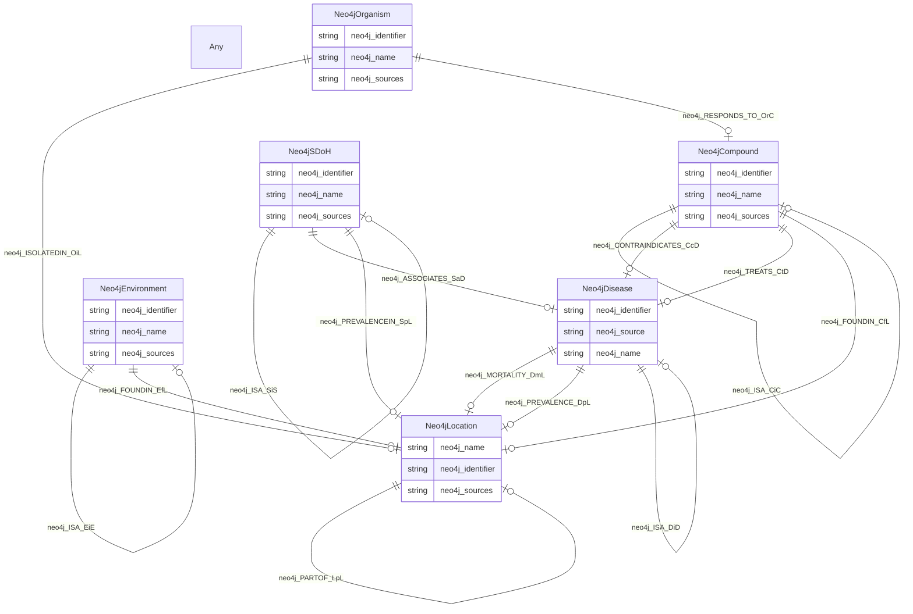

# TODO_Give_this_schema_a_name!

TODO -- tell the world what this schema describes.

URI: spoke-kg

Name: spoke-kg

## Schema Diagram

## Classes

| Class | Description |
| --- | --- |
| [Any](classes/Any.md) | None |
| [Neo4jCompound](classes/Neo4jCompound.md) | TODO -- tell the world what this class (type) describes. |
| [Neo4jDisease](classes/Neo4jDisease.md) | TODO -- tell the world what this class (type) describes. |
| [Neo4jEnvironment](classes/Neo4jEnvironment.md) | TODO -- tell the world what this class (type) describes. |
| [Neo4jLocation](classes/Neo4jLocation.md) | TODO -- tell the world what this class (type) describes. |
| [Neo4jOrganism](classes/Neo4jOrganism.md) | TODO -- tell the world what this class (type) describes. |
| [Neo4jSDoH](classes/Neo4jSDoH.md) | TODO -- tell the world what this class (type) describes. |

## Slots

| Slot | Description |
| --- | --- |
| [neo4j_ASSOCIATES_SaD](slots/neo4j_ASSOCIATES_SaD.md) | TODO -- tell the world what this slot (predicate) describes |
| [neo4j_CONTRAINDICATES_CcD](slots/neo4j_CONTRAINDICATES_CcD.md) | TODO -- tell the world what this slot (predicate) describes |
| [neo4j_FOUNDIN_CfL](slots/neo4j_FOUNDIN_CfL.md) | TODO -- tell the world what this slot (predicate) describes |
| [neo4j_FOUNDIN_EfL](slots/neo4j_FOUNDIN_EfL.md) | TODO -- tell the world what this slot (predicate) describes |
| [neo4j_HASROLE_ChC](slots/neo4j_HASROLE_ChC.md) | TODO -- tell the world what this slot (predicate) describes |
| [neo4j_identifier](slots/neo4j_identifier.md) | TODO -- tell the world what this slot (predicate) describes |
| [neo4j_INTERACTS_CiC](slots/neo4j_INTERACTS_CiC.md) | TODO -- tell the world what this slot (predicate) describes |
| [neo4j_ISA_CiC](slots/neo4j_ISA_CiC.md) | TODO -- tell the world what this slot (predicate) describes |
| [neo4j_ISA_DiD](slots/neo4j_ISA_DiD.md) | TODO -- tell the world what this slot (predicate) describes |
| [neo4j_ISA_EiE](slots/neo4j_ISA_EiE.md) | TODO -- tell the world what this slot (predicate) describes |
| [neo4j_ISA_SiS](slots/neo4j_ISA_SiS.md) | TODO -- tell the world what this slot (predicate) describes |
| [neo4j_ISOLATEDIN_OiL](slots/neo4j_ISOLATEDIN_OiL.md) | TODO -- tell the world what this slot (predicate) describes |
| [neo4j_MORTALITY_DmL](slots/neo4j_MORTALITY_DmL.md) | TODO -- tell the world what this slot (predicate) describes |
| [neo4j_name](slots/neo4j_name.md) | TODO -- tell the world what this slot (predicate) describes |
| [neo4j_PARTOF_CpC](slots/neo4j_PARTOF_CpC.md) | TODO -- tell the world what this slot (predicate) describes |
| [neo4j_PARTOF_LpL](slots/neo4j_PARTOF_LpL.md) | TODO -- tell the world what this slot (predicate) describes |
| [neo4j_PREVALENCE_DpL](slots/neo4j_PREVALENCE_DpL.md) | TODO -- tell the world what this slot (predicate) describes |
| [neo4j_PREVALENCEIN_SpL](slots/neo4j_PREVALENCEIN_SpL.md) | TODO -- tell the world what this slot (predicate) describes |
| [neo4j_RESEMBLES_DrD](slots/neo4j_RESEMBLES_DrD.md) | TODO -- tell the world what this slot (predicate) describes |
| [neo4j_RESPONDS_TO_OrC](slots/neo4j_RESPONDS_TO_OrC.md) | TODO -- tell the world what this slot (predicate) describes |
| [neo4j_source](slots/neo4j_source.md) | TODO -- tell the world what this slot (predicate) describes |
| [neo4j_sources](slots/neo4j_sources.md) | TODO -- tell the world what this slot (predicate) describes |
| [neo4j_TREATS_CtD](slots/neo4j_TREATS_CtD.md) | TODO -- tell the world what this slot (predicate) describes |

## Enumerations

| Enumeration | Description |
| --- | --- |

## Types

| Type | Description |
| --- | --- |

## Subsets

| Subset | Description |
| --- | --- |
