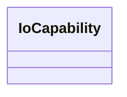

# Class: No class (entity type) name specified -- this class is noted as being in the domain or range of a slot in this graph but has not itself been defined. (io_Capability)


URI: [io:Capability](https://spec.industrialontologies.org/ontology/core/Core/Capability)





<!-- no inheritance hierarchy -->


## Slots

| Name | Cardinality and Range | Description | Inheritance | Occurrences |
| ---  | --- | --- | --- | --- |


## Usages

| used by | used in | type | used |
| ---  | --- | --- | --- |
| [SudoknAS9100Certificate](../classes/SudoknAS9100Certificate.md) | [sudokn_attestsTo](../slots/sudokn_attestsTo.md) | any_of[range] | [IoCapability](../classes/IoCapability.md) |
| [SudoknISO9000Certificate](../classes/SudoknISO9000Certificate.md) | [sudokn_attestsTo](../slots/sudokn_attestsTo.md) | any_of[range] | [IoCapability](../classes/IoCapability.md) |


## LinkML Source

<!-- TODO: investigate https://stackoverflow.com/questions/37606292/how-to-create-tabbed-code-blocks-in-mkdocs-or-sphinx -->

### Direct

<details>

```yaml
name: io_Capability
title: No class (entity type) name specified -- this class is noted as being in the
  domain or range of a slot in this graph but has not itself been defined.
from_schema: okns:sudokn-kg
rank: 1000
class_uri: io:Capability

```
</details>

### Induced

<details>

```yaml
name: io_Capability
title: No class (entity type) name specified -- this class is noted as being in the
  domain or range of a slot in this graph but has not itself been defined.
from_schema: okns:sudokn-kg
rank: 1000
class_uri: io:Capability

```
</details>