# Class: TODO -- what's a good name for this class (type)? (io_Manufacturer)


_No type description provided_


URI: [io:Manufacturer](https://spec.industrialontologies.org/ontology/core/Core/Manufacturer)

```mermaid
 classDiagram
    class IoManufacturer
    click IoManufacturer href "../IoManufacturer"
      IoManufacturer : rdfs_label
        
          
    
    
    IoManufacturer --> "0..1" String : rdfs_label
    click String href "../String"

        
      IoManufacturer : sudokn_hasCertificate
        
          
    
    
    IoManufacturer --> "0..1" Any : sudokn_hasCertificate
    click Any href "../Any"

        
      IoManufacturer : sudokn_hasMaterialCapability
        
          
    
    
    IoManufacturer --> "0..1" Any : sudokn_hasMaterialCapability
    click Any href "../Any"

        
      IoManufacturer : sudokn_hasNumberOfEmployees
        
          
    
    
    IoManufacturer --> "0..1" Any : sudokn_hasNumberOfEmployees
    click Any href "../Any"

        
      IoManufacturer : sudokn_hasOrganizationYearOfEstablishment
        
          
    
    
    IoManufacturer --> "0..1" String : sudokn_hasOrganizationYearOfEstablishment
    click String href "../String"

        
      IoManufacturer : sudokn_hasOwnershipStatusClassifier
        
          
    
    
    IoManufacturer --> "0..1" Any : sudokn_hasOwnershipStatusClassifier
    click Any href "../Any"

        
      IoManufacturer : sudokn_hasPostalAddress
        
          
    
    
    IoManufacturer --> "0..1" Any : sudokn_hasPostalAddress
    click Any href "../Any"

        
      IoManufacturer : sudokn_hasPrimaryNAICSClassifier
        
          
    
    
    IoManufacturer --> "0..1" Any : sudokn_hasPrimaryNAICSClassifier
    click Any href "../Any"

        
      IoManufacturer : sudokn_hasProcessCapability
        
          
    
    
    IoManufacturer --> "0..1" Any : sudokn_hasProcessCapability
    click Any href "../Any"

        
      IoManufacturer : sudokn_hasSecondaryNAICSClassifier
        
          
    
    
    IoManufacturer --> "0..1" SudoknNAICSClassifier : sudokn_hasSecondaryNAICSClassifier
    click SudoknNAICSClassifier href "../SudoknNAICSClassifier"

        
      IoManufacturer : sudokn_manufactures
        
          
    
    
    IoManufacturer --> "0..1" Any : sudokn_manufactures
    click Any href "../Any"

        
      IoManufacturer : sudokn_organizationLocatedIn
        
          
    
    
    IoManufacturer --> "0..1" SudoknGeospatialLocation : sudokn_organizationLocatedIn
    click SudoknGeospatialLocation href "../SudoknGeospatialLocation"

        
      IoManufacturer : sudokn_suppliesToIndustry
        
          
    
    
    IoManufacturer --> "0..1" Any : sudokn_suppliesToIndustry
    click Any href "../Any"

        
      
```





<!-- no inheritance hierarchy -->


## Slots

| Name | Cardinality and Range | Description | Inheritance |
| ---  | --- | --- | --- |
| [sudokn_hasPrimaryNAICSClassifier](../slots/sudokn_hasPrimaryNAICSClassifier.md) | 0..1 <br/> [SudoknNAICS332618](../classes/SudoknNAICS332618.md)&nbsp;or&nbsp;<br />[SudoknNAICS332612](../classes/SudoknNAICS332612.md)&nbsp;or&nbsp;<br />[SudoknNAICS332321](../classes/SudoknNAICS332321.md)&nbsp;or&nbsp;<br />[SudoknNAICS332115](../classes/SudoknNAICS332115.md)&nbsp;or&nbsp;<br />[SudoknNAICS332510](../classes/SudoknNAICS332510.md)&nbsp;or&nbsp;<br />[SudoknNAICS332919](../classes/SudoknNAICS332919.md)&nbsp;or&nbsp;<br />[SudoknNAICS332999](../classes/SudoknNAICS332999.md)&nbsp;or&nbsp;<br />[SudoknNAICS332992](../classes/SudoknNAICS332992.md)&nbsp;or&nbsp;<br />[SudoknNAICS332994](../classes/SudoknNAICS332994.md)&nbsp;or&nbsp;<br />[SudoknNAICS332997](../classes/SudoknNAICS332997.md)&nbsp;or&nbsp;<br />[SudoknNAICS332117](../classes/SudoknNAICS332117.md)&nbsp;or&nbsp;<br />[SudoknNAICS332995](../classes/SudoknNAICS332995.md)&nbsp;or&nbsp;<br />[SudoknNAICS332813](../classes/SudoknNAICS332813.md)&nbsp;or&nbsp;<br />[SudoknNAICS332211](../classes/SudoknNAICS332211.md)&nbsp;or&nbsp;<br />[SudoknNAICS332722](../classes/SudoknNAICS332722.md)&nbsp;or&nbsp;<br />[SudoknNAICS332721](../classes/SudoknNAICS332721.md)&nbsp;or&nbsp;<br />[SudoknNAICS332212](../classes/SudoknNAICS332212.md)&nbsp;or&nbsp;<br />[SudoknNAICS332311](../classes/SudoknNAICS332311.md)&nbsp;or&nbsp;<br />[SudoknNAICS332991](../classes/SudoknNAICS332991.md)&nbsp;or&nbsp;<br />[SudoknNAICS332913](../classes/SudoknNAICS332913.md)&nbsp;or&nbsp;<br />[SudoknNAICS332313](../classes/SudoknNAICS332313.md)&nbsp;or&nbsp;<br />[SudoknNAICS332213](../classes/SudoknNAICS332213.md)&nbsp;or&nbsp;<br />[SudoknNAICS332116](../classes/SudoknNAICS332116.md)&nbsp;or&nbsp;<br />[SudoknNAICS332410](../classes/SudoknNAICS332410.md)&nbsp;or&nbsp;<br />[SudoknNAICS332998](../classes/SudoknNAICS332998.md)&nbsp;or&nbsp;<br />[SudoknNAICS332811](../classes/SudoknNAICS332811.md)&nbsp;or&nbsp;<br />[SudoknNAICS332312](../classes/SudoknNAICS332312.md)&nbsp;or&nbsp;<br />[SudoknNAICS332431](../classes/SudoknNAICS332431.md)&nbsp;or&nbsp;<br />[SudoknNAICS332323](../classes/SudoknNAICS332323.md)&nbsp;or&nbsp;<br />[SudoknNAICS332214](../classes/SudoknNAICS332214.md)&nbsp;or&nbsp;<br />[SudoknNAICS332112](../classes/SudoknNAICS332112.md)&nbsp;or&nbsp;<br />[SudoknNAICSClassifier](../classes/SudoknNAICSClassifier.md)&nbsp;or&nbsp;<br />[SudoknNAICS332996](../classes/SudoknNAICS332996.md)&nbsp;or&nbsp;<br />[SudoknNAICS332611](../classes/SudoknNAICS332611.md)&nbsp;or&nbsp;<br />[SudoknNAICS332420](../classes/SudoknNAICS332420.md)&nbsp;or&nbsp;<br />[SudoknNAICS332912](../classes/SudoknNAICS332912.md)&nbsp;or&nbsp;<br />[SudoknNAICS332911](../classes/SudoknNAICS332911.md)&nbsp;or&nbsp;<br />[SudoknNAICS332114](../classes/SudoknNAICS332114.md)&nbsp;or&nbsp;<br />[SudoknNAICS332710](../classes/SudoknNAICS332710.md)&nbsp;or&nbsp;<br />[SudoknNAICS332812](../classes/SudoknNAICS332812.md)&nbsp;or&nbsp;<br />[SudoknNAICS332322](../classes/SudoknNAICS332322.md)&nbsp;or&nbsp;<br />[SudoknNAICS332439](../classes/SudoknNAICS332439.md)&nbsp;or&nbsp;<br />[SudoknNAICS332111](../classes/SudoknNAICS332111.md) | No slot description provided | direct |
| [sudokn_manufactures](../slots/sudokn_manufactures.md) | 0..1 <br/> [xsd:anyURI](http://www.w3.org/2001/XMLSchema#anyURI)&nbsp;or&nbsp;<br />[IoMaterialProduct](../classes/IoMaterialProduct.md) | No slot description provided | direct |
| [sudokn_hasCertificate](../slots/sudokn_hasCertificate.md) | 0..1 <br/> [SudoknISO9000](../classes/SudoknISO9000.md)&nbsp;or&nbsp;<br />[SudoknKOSHERApproved](../classes/SudoknKOSHERApproved.md)&nbsp;or&nbsp;<br />[SudoknISO14001](../classes/SudoknISO14001.md)&nbsp;or&nbsp;<br />[SudoknISO13485](../classes/SudoknISO13485.md)&nbsp;or&nbsp;<br />[SudoknAS9000Certificate](../classes/SudoknAS9000Certificate.md)&nbsp;or&nbsp;<br />[SudoknQS9000Certificate](../classes/SudoknQS9000Certificate.md)&nbsp;or&nbsp;<br />[SudoknNADCAPCertificate](../classes/SudoknNADCAPCertificate.md)&nbsp;or&nbsp;<br />[SudoknISO14001Certificate](../classes/SudoknISO14001Certificate.md)&nbsp;or&nbsp;<br />[SudoknISO9001](../classes/SudoknISO9001.md)&nbsp;or&nbsp;<br />[SudoknITARCertificate](../classes/SudoknITARCertificate.md)&nbsp;or&nbsp;<br />[SudoknISO9000Certificate](../classes/SudoknISO9000Certificate.md)&nbsp;or&nbsp;<br />[SudoknASME](../classes/SudoknASME.md)&nbsp;or&nbsp;<br />[SudoknHAACPCertificate](../classes/SudoknHAACPCertificate.md)&nbsp;or&nbsp;<br />[SudoknISO9001Certificate](../classes/SudoknISO9001Certificate.md)&nbsp;or&nbsp;<br />[SudoknIS-TS16949](../classes/SudoknIS-TS16949.md)&nbsp;or&nbsp;<br />[SudoknIATF16949Certificate](../classes/SudoknIATF16949Certificate.md)&nbsp;or&nbsp;<br />[SudoknAWSWelderCertificate](../classes/SudoknAWSWelderCertificate.md)&nbsp;or&nbsp;<br />[SudoknNADCAPAC7004](../classes/SudoknNADCAPAC7004.md)&nbsp;or&nbsp;<br />[SudoknISTS16949Certificate](../classes/SudoknISTS16949Certificate.md)&nbsp;or&nbsp;<br />[SudoknISO14000Certificate](../classes/SudoknISO14000Certificate.md)&nbsp;or&nbsp;<br />[SudoknBritishRetailConsortiumAccreditation](../classes/SudoknBritishRetailConsortiumAccreditation.md)&nbsp;or&nbsp;<br />[SudoknISOCertificate](../classes/SudoknISOCertificate.md)&nbsp;or&nbsp;<br />[SudoknASMECertificate](../classes/SudoknASMECertificate.md)&nbsp;or&nbsp;<br />[SudoknAS9102Certificate](../classes/SudoknAS9102Certificate.md)&nbsp;or&nbsp;<br />[SudoknBABACertificate](../classes/SudoknBABACertificate.md)&nbsp;or&nbsp;<br />[SudoknITARCompliant](../classes/SudoknITARCompliant.md)&nbsp;or&nbsp;<br />[SudoknAS9100](../classes/SudoknAS9100.md)&nbsp;or&nbsp;<br />[SudoknFDACertificate](../classes/SudoknFDACertificate.md)&nbsp;or&nbsp;<br />[SudoknFDAGMPCompliant](../classes/SudoknFDAGMPCompliant.md)&nbsp;or&nbsp;<br />[SudoknQS9000](../classes/SudoknQS9000.md)&nbsp;or&nbsp;<br />[SudoknISO13485Certificate](../classes/SudoknISO13485Certificate.md)&nbsp;or&nbsp;<br />[SudoknTI9000Certificate](../classes/SudoknTI9000Certificate.md)&nbsp;or&nbsp;<br />[SudoknAS9100Certificate](../classes/SudoknAS9100Certificate.md)&nbsp;or&nbsp;<br />[SudoknLEEDCertificate](../classes/SudoknLEEDCertificate.md)&nbsp;or&nbsp;<br />[xsd:anyURI](http://www.w3.org/2001/XMLSchema#anyURI) | No slot description provided | direct |
| [sudokn_hasProcessCapability](../slots/sudokn_hasProcessCapability.md) | 0..1 <br/> [SudoknLaserCuttingCapability](../classes/SudoknLaserCuttingCapability.md)&nbsp;or&nbsp;<br />[SudoknAssemblyCapability](../classes/SudoknAssemblyCapability.md)&nbsp;or&nbsp;<br />[SudoknLaserProcessingCapability](../classes/SudoknLaserProcessingCapability.md)&nbsp;or&nbsp;<br />[SudoknWaterjetCuttimgCapability](../classes/SudoknWaterjetCuttimgCapability.md)&nbsp;or&nbsp;<br />[SudoknPulsedElectrochemicalMachiningCapability](../classes/SudoknPulsedElectrochemicalMachiningCapability.md)&nbsp;or&nbsp;<br />[SudoknFixturingCapability](../classes/SudoknFixturingCapability.md)&nbsp;or&nbsp;<br />[SudoknCNCHorizontalTurningCapability](../classes/SudoknCNCHorizontalTurningCapability.md)&nbsp;or&nbsp;<br />[SudoknCarbonitridingCapability](../classes/SudoknCarbonitridingCapability.md)&nbsp;or&nbsp;<br />[SudoknSolderingCapability](../classes/SudoknSolderingCapability.md)&nbsp;or&nbsp;<br />[SudoknGearCuttingCapability](../classes/SudoknGearCuttingCapability.md)&nbsp;or&nbsp;<br />[SudoknElectronBeamWeldingCapability](../classes/SudoknElectronBeamWeldingCapability.md)&nbsp;or&nbsp;<br />[SudoknMachineBuildingCapability](../classes/SudoknMachineBuildingCapability.md)&nbsp;or&nbsp;<br />[SudoknPunchingCapability](../classes/SudoknPunchingCapability.md)&nbsp;or&nbsp;<br />[SudoknMetalStampingCapability](../classes/SudoknMetalStampingCapability.md)&nbsp;or&nbsp;<br />[SudoknFabricatingCapability](../classes/SudoknFabricatingCapability.md)&nbsp;or&nbsp;<br />[SudoknSmeltingCapability](../classes/SudoknSmeltingCapability.md)&nbsp;or&nbsp;<br />[SudoknDieCastingCapability](../classes/SudoknDieCastingCapability.md)&nbsp;or&nbsp;<br />[SudoknVerticalMillingCapability](../classes/SudoknVerticalMillingCapability.md)&nbsp;or&nbsp;<br />[SudoknDigitalPrintingCapability](../classes/SudoknDigitalPrintingCapability.md)&nbsp;or&nbsp;<br />[SudoknRivettingCapability](../classes/SudoknRivettingCapability.md)&nbsp;or&nbsp;<br />[SudoknPassivationCapability](../classes/SudoknPassivationCapability.md)&nbsp;or&nbsp;<br />[SudoknAcrylicFabricationCapability](../classes/SudoknAcrylicFabricationCapability.md)&nbsp;or&nbsp;<br />[SudoknFlameSprayingCapability](../classes/SudoknFlameSprayingCapability.md)&nbsp;or&nbsp;<br />[SudoknKnurlingCapability](../classes/SudoknKnurlingCapability.md)&nbsp;or&nbsp;<br />[SudoknWireFormingCapability](../classes/SudoknWireFormingCapability.md)&nbsp;or&nbsp;<br />[SudoknCNCMachiningCapability](../classes/SudoknCNCMachiningCapability.md)&nbsp;or&nbsp;<br />[SudoknGalvanizingCapability](../classes/SudoknGalvanizingCapability.md)&nbsp;or&nbsp;<br />[SudoknAssemblyCapibility](../classes/SudoknAssemblyCapibility.md)&nbsp;or&nbsp;<br />[SudoknWireHarnessAssemblyCapability](../classes/SudoknWireHarnessAssemblyCapability.md)&nbsp;or&nbsp;<br />[SudoknCastingCapability](../classes/SudoknCastingCapability.md)&nbsp;or&nbsp;<br />[SudoknCeramicMoldCastingCapability](../classes/SudoknCeramicMoldCastingCapability.md)&nbsp;or&nbsp;<br />[SudoknDieMakingCapability](../classes/SudoknDieMakingCapability.md)&nbsp;or&nbsp;<br />[SudoknMetalSpinningCapability](../classes/SudoknMetalSpinningCapability.md)&nbsp;or&nbsp;<br />[SudoknCNCCuttingCapability](../classes/SudoknCNCCuttingCapability.md)&nbsp;or&nbsp;<br />[SudoknVacuumCastingCapability](../classes/SudoknVacuumCastingCapability.md)&nbsp;or&nbsp;<br />[SudoknSilkScreeningCapability](../classes/SudoknSilkScreeningCapability.md)&nbsp;or&nbsp;<br />[SudoknChemicalCoatingCapability](../classes/SudoknChemicalCoatingCapability.md)&nbsp;or&nbsp;<br />[SudoknMoldMakingCapability](../classes/SudoknMoldMakingCapability.md)&nbsp;or&nbsp;<br />[SudoknPlasterMoldCastingCapability](../classes/SudoknPlasterMoldCastingCapability.md)&nbsp;or&nbsp;<br />[SudoknSheetMetalFormingCapability](../classes/SudoknSheetMetalFormingCapability.md)&nbsp;or&nbsp;<br />[SudoknChemicalCleaningCapability](../classes/SudoknChemicalCleaningCapability.md)&nbsp;or&nbsp;<br />[SudoknPhosphateCoatingCapability](../classes/SudoknPhosphateCoatingCapability.md)&nbsp;or&nbsp;<br />[SudoknRapidPrototypingCapability](../classes/SudoknRapidPrototypingCapability.md)&nbsp;or&nbsp;<br />[SudoknPolishingCapability](../classes/SudoknPolishingCapability.md)&nbsp;or&nbsp;<br />[SudoknVacuumHardeningCapability](../classes/SudoknVacuumHardeningCapability.md)&nbsp;or&nbsp;<br />[SudoknPrintingCapability](../classes/SudoknPrintingCapability.md)&nbsp;or&nbsp;<br />[SudoknSandCastingCapability](../classes/SudoknSandCastingCapability.md)&nbsp;or&nbsp;<br />[SudoknTubingCapability](../classes/SudoknTubingCapability.md)&nbsp;or&nbsp;<br />[SudoknElectroplatingCapability](../classes/SudoknElectroplatingCapability.md)&nbsp;or&nbsp;<br />[SudoknTubeBendingCapability](../classes/SudoknTubeBendingCapability.md)&nbsp;or&nbsp;<br />[SudoknKnittingCapability](../classes/SudoknKnittingCapability.md)&nbsp;or&nbsp;<br />[SudoknToolMakingCapability](../classes/SudoknToolMakingCapability.md)&nbsp;or&nbsp;<br />[SudoknNickelPlatingCapability](../classes/SudoknNickelPlatingCapability.md)&nbsp;or&nbsp;<br />[SudoknBrazingCapability](../classes/SudoknBrazingCapability.md)&nbsp;or&nbsp;<br />[xsd:anyURI](http://www.w3.org/2001/XMLSchema#anyURI)&nbsp;or&nbsp;<br />[SudoknCNCPressBrakeCapability](../classes/SudoknCNCPressBrakeCapability.md)&nbsp;or&nbsp;<br />[SudoknWireEDMCapability](../classes/SudoknWireEDMCapability.md)&nbsp;or&nbsp;<br />[SudoknSinkerEDMCapability](../classes/SudoknSinkerEDMCapability.md)&nbsp;or&nbsp;<br />[SudoknVacuumFormingCapability](../classes/SudoknVacuumFormingCapability.md)&nbsp;or&nbsp;<br />[SudoknElectropolishingCapability](../classes/SudoknElectropolishingCapability.md)&nbsp;or&nbsp;<br />[SudoknCustomFoamCuttingCapability](../classes/SudoknCustomFoamCuttingCapability.md)&nbsp;or&nbsp;<br />[Sudokn3DPrintingCapability](../classes/Sudokn3DPrintingCapability.md)&nbsp;or&nbsp;<br />[SudoknBendingCapability](../classes/SudoknBendingCapability.md)&nbsp;or&nbsp;<br />[SudoknCarburizingCapability](../classes/SudoknCarburizingCapability.md)&nbsp;or&nbsp;<br />[SudoknMillingCapability](../classes/SudoknMillingCapability.md)&nbsp;or&nbsp;<br />[SudoknCoatingCapability](../classes/SudoknCoatingCapability.md)&nbsp;or&nbsp;<br />[SudoknAddtiveManufacturingCapability](../classes/SudoknAddtiveManufacturingCapability.md)&nbsp;or&nbsp;<br />[SudoknWeldingCapability](../classes/SudoknWeldingCapability.md)&nbsp;or&nbsp;<br />[SudoknSinteringCapability](../classes/SudoknSinteringCapability.md)&nbsp;or&nbsp;<br />[SudoknMIGWeldinCapability](../classes/SudoknMIGWeldinCapability.md)&nbsp;or&nbsp;<br />[SudoknVacuumPackagingCapability](../classes/SudoknVacuumPackagingCapability.md)&nbsp;or&nbsp;<br />[SudoknPlasticMachiningCapability](../classes/SudoknPlasticMachiningCapability.md)&nbsp;or&nbsp;<br />[SudoknPressingCapability](../classes/SudoknPressingCapability.md)&nbsp;or&nbsp;<br />[SudoknSwissMachiningCapability](../classes/SudoknSwissMachiningCapability.md)&nbsp;or&nbsp;<br />[SudoknCNCLatheCapability](../classes/SudoknCNCLatheCapability.md)&nbsp;or&nbsp;<br />[SudoknTurningCapability](../classes/SudoknTurningCapability.md)&nbsp;or&nbsp;<br />[SudoknAbrasiveCleaningCapability](../classes/SudoknAbrasiveCleaningCapability.md)&nbsp;or&nbsp;<br />[SudoknFabricationCapability](../classes/SudoknFabricationCapability.md)&nbsp;or&nbsp;<br />[SudoknInvestmentCastingCapability](../classes/SudoknInvestmentCastingCapability.md)&nbsp;or&nbsp;<br />[SudoknEmbossingCapability](../classes/SudoknEmbossingCapability.md)&nbsp;or&nbsp;<br />[SudoknPackingCapability](../classes/SudoknPackingCapability.md)&nbsp;or&nbsp;<br />[SudoknShearingCapability](../classes/SudoknShearingCapability.md)&nbsp;or&nbsp;<br />[SudoknShrinkFittingCapability](../classes/SudoknShrinkFittingCapability.md)&nbsp;or&nbsp;<br />[SudoknLatheWorkCapability](../classes/SudoknLatheWorkCapability.md)&nbsp;or&nbsp;<br />[SudoknCNCWireBendingCapability](../classes/SudoknCNCWireBendingCapability.md)&nbsp;or&nbsp;<br />[SudoknChromateConversionCoatingCapability](../classes/SudoknChromateConversionCoatingCapability.md)&nbsp;or&nbsp;<br />[SudoknLiveToolingCapability](../classes/SudoknLiveToolingCapability.md)&nbsp;or&nbsp;<br />[SudoknMediaBlastingCapability](../classes/SudoknMediaBlastingCapability.md)&nbsp;or&nbsp;<br />[SudoknCNCMillingCapability](../classes/SudoknCNCMillingCapability.md)&nbsp;or&nbsp;<br />[SudoknPressBrakingCapability](../classes/SudoknPressBrakingCapability.md)&nbsp;or&nbsp;<br />[SudoknInstallationCapability](../classes/SudoknInstallationCapability.md)&nbsp;or&nbsp;<br />[SudoknDeepFreezingCapability](../classes/SudoknDeepFreezingCapability.md)&nbsp;or&nbsp;<br />[SudoknCNCFormingCapability](../classes/SudoknCNCFormingCapability.md)&nbsp;or&nbsp;<br />[SudoknRollingCapability](../classes/SudoknRollingCapability.md)&nbsp;or&nbsp;<br />[SudoknNotchingCapability](../classes/SudoknNotchingCapability.md)&nbsp;or&nbsp;<br />[SudoknPipingFabricationCapability](../classes/SudoknPipingFabricationCapability.md)&nbsp;or&nbsp;<br />[SudoknBoringCapability](../classes/SudoknBoringCapability.md)&nbsp;or&nbsp;<br />[SudoknWetPaintingCapability](../classes/SudoknWetPaintingCapability.md)&nbsp;or&nbsp;<br />[SudoknCentrifugalCastingCapability](../classes/SudoknCentrifugalCastingCapability.md)&nbsp;or&nbsp;<br />[SudoknMIGWeldingCapability](../classes/SudoknMIGWeldingCapability.md)&nbsp;or&nbsp;<br />[SudoknHardeningCapability](../classes/SudoknHardeningCapability.md)&nbsp;or&nbsp;<br />[SudoknRoboticWeldingCapability](../classes/SudoknRoboticWeldingCapability.md)&nbsp;or&nbsp;<br />[SudoknElectricalDischargeMachiningCapability](../classes/SudoknElectricalDischargeMachiningCapability.md)&nbsp;or&nbsp;<br />[SudoknTappingCapability](../classes/SudoknTappingCapability.md)&nbsp;or&nbsp;<br />[SudoknProductDesignCapability](../classes/SudoknProductDesignCapability.md)&nbsp;or&nbsp;<br />[Sudokn2-AxisCNCTurningCapability](../classes/Sudokn2-AxisCNCTurningCapability.md)&nbsp;or&nbsp;<br />[SudoknMetalFabricationCapability](../classes/SudoknMetalFabricationCapability.md)&nbsp;or&nbsp;<br />[SudoknWireBendingCapability](../classes/SudoknWireBendingCapability.md)&nbsp;or&nbsp;<br />[SudoknHoningCapability](../classes/SudoknHoningCapability.md)&nbsp;or&nbsp;<br />[SudoknExtrudingCapability](../classes/SudoknExtrudingCapability.md)&nbsp;or&nbsp;<br />[SudoknLaserEtchingCapability](../classes/SudoknLaserEtchingCapability.md)&nbsp;or&nbsp;<br />[SudoknCreepFeedGrindingCapability](../classes/SudoknCreepFeedGrindingCapability.md)&nbsp;or&nbsp;<br />[SudoknPlaningCapability](../classes/SudoknPlaningCapability.md)&nbsp;or&nbsp;<br />[SudoknShellMoldCastingCapability](../classes/SudoknShellMoldCastingCapability.md)&nbsp;or&nbsp;<br />[SudoknMetalworkingCapability](../classes/SudoknMetalworkingCapability.md)&nbsp;or&nbsp;<br />[SudoknPrototypingCapability](../classes/SudoknPrototypingCapability.md)&nbsp;or&nbsp;<br />[SudoknCNCPlasmaCuttingCapability](../classes/SudoknCNCPlasmaCuttingCapability.md)&nbsp;or&nbsp;<br />[SudoknWaterjetCuttingCapability](../classes/SudoknWaterjetCuttingCapability.md)&nbsp;or&nbsp;<br />[SudoknPlasmaCuttingCapability](../classes/SudoknPlasmaCuttingCapability.md)&nbsp;or&nbsp;<br />[SudoknElectolessNickelPlatingCapability](../classes/SudoknElectolessNickelPlatingCapability.md)&nbsp;or&nbsp;<br />[SudoknHotDipGalvanizingCapability](../classes/SudoknHotDipGalvanizingCapability.md)&nbsp;or&nbsp;<br />[SudoknElectrolessPlatingCapability](../classes/SudoknElectrolessPlatingCapability.md)&nbsp;or&nbsp;<br />[SudoknRAMEdmCapability](../classes/SudoknRAMEdmCapability.md)&nbsp;or&nbsp;<br />[SudoknChemicalProcessingCapability](../classes/SudoknChemicalProcessingCapability.md)&nbsp;or&nbsp;<br />[SudoknFiberOpticLaserCuttingCapability](../classes/SudoknFiberOpticLaserCuttingCapability.md)&nbsp;or&nbsp;<br />[SudoknCNCVerticalMillingCapability](../classes/SudoknCNCVerticalMillingCapability.md)&nbsp;or&nbsp;<br />[SudoknContinuousCastingCapability](../classes/SudoknContinuousCastingCapability.md)&nbsp;or&nbsp;<br />[SudoknMechanicalAssemblyCapability](../classes/SudoknMechanicalAssemblyCapability.md)&nbsp;or&nbsp;<br />[SudoknJoiningCapability](../classes/SudoknJoiningCapability.md)&nbsp;or&nbsp;<br />[SudoknCADCapability](../classes/SudoknCADCapability.md)&nbsp;or&nbsp;<br />[SudoknCenterlessGrindingCapability](../classes/SudoknCenterlessGrindingCapability.md)&nbsp;or&nbsp;<br />[SudoknCNCmillingCapability](../classes/SudoknCNCmillingCapability.md)&nbsp;or&nbsp;<br />[SudoknHeatTreatingCapability](../classes/SudoknHeatTreatingCapability.md)&nbsp;or&nbsp;<br />[SudoknElectrolessNickelPlatingCapability](../classes/SudoknElectrolessNickelPlatingCapability.md)&nbsp;or&nbsp;<br />[SudoknGrindingCapability](../classes/SudoknGrindingCapability.md)&nbsp;or&nbsp;<br />[SudoknPLCProgrammingCapability](../classes/SudoknPLCProgrammingCapability.md)&nbsp;or&nbsp;<br />[SudoknMoldingCapability](../classes/SudoknMoldingCapability.md)&nbsp;or&nbsp;<br />[SudoknDrawingCapability](../classes/SudoknDrawingCapability.md)&nbsp;or&nbsp;<br />[SudoknExtrusionCapability](../classes/SudoknExtrusionCapability.md)&nbsp;or&nbsp;<br />[SudoknEtchingCapability](../classes/SudoknEtchingCapability.md)&nbsp;or&nbsp;<br />[SudoknSwissTurningCapability](../classes/SudoknSwissTurningCapability.md)&nbsp;or&nbsp;<br />[SudoknScreenPrintingCapability](../classes/SudoknScreenPrintingCapability.md)&nbsp;or&nbsp;<br />[SudoknShapingCapability](../classes/SudoknShapingCapability.md)&nbsp;or&nbsp;<br />[SudoknPlasmaSprayingCapability](../classes/SudoknPlasmaSprayingCapability.md)&nbsp;or&nbsp;<br />[SudoknFinishingCapability](../classes/SudoknFinishingCapability.md)&nbsp;or&nbsp;<br />[SudoknPaintingCapability](../classes/SudoknPaintingCapability.md)&nbsp;or&nbsp;<br />[SudoknWiringCapability](../classes/SudoknWiringCapability.md)&nbsp;or&nbsp;<br />[SudoknPackagingCapability](../classes/SudoknPackagingCapability.md)&nbsp;or&nbsp;<br />[SudoknPlatingCapability](../classes/SudoknPlatingCapability.md)&nbsp;or&nbsp;<br />[SudoknPrototypeManufacturingCapability](../classes/SudoknPrototypeManufacturingCapability.md)&nbsp;or&nbsp;<br />[SudoknZincArcSprayCapability](../classes/SudoknZincArcSprayCapability.md)&nbsp;or&nbsp;<br />[SudoknVaporizedMetalCoatingCapability](../classes/SudoknVaporizedMetalCoatingCapability.md)&nbsp;or&nbsp;<br />[SudoknRivetingCapability](../classes/SudoknRivetingCapability.md)&nbsp;or&nbsp;<br />[SudoknRamEDMCapability](../classes/SudoknRamEDMCapability.md)&nbsp;or&nbsp;<br />[SudoknTurretPunchingCapability](../classes/SudoknTurretPunchingCapability.md)&nbsp;or&nbsp;<br />[SudoknTIGWeldingCapability](../classes/SudoknTIGWeldingCapability.md)&nbsp;or&nbsp;<br />[SudoknSheetMetalProcessingCapability](../classes/SudoknSheetMetalProcessingCapability.md)&nbsp;or&nbsp;<br />[SudoknSurfaceGrindingCapability](../classes/SudoknSurfaceGrindingCapability.md)&nbsp;or&nbsp;<br />[SudoknFasteningCapability](../classes/SudoknFasteningCapability.md)&nbsp;or&nbsp;<br />[SudoknReverseEngineeringCapability](../classes/SudoknReverseEngineeringCapability.md)&nbsp;or&nbsp;<br />[SudoknAdditiveManufacturingCapability](../classes/SudoknAdditiveManufacturingCapability.md)&nbsp;or&nbsp;<br />[SudoknDeepHoleDrillingCapability](../classes/SudoknDeepHoleDrillingCapability.md)&nbsp;or&nbsp;<br />[SudoknDeburringCapability](../classes/SudoknDeburringCapability.md)&nbsp;or&nbsp;<br />[SudoknOilGroovingCapability](../classes/SudoknOilGroovingCapability.md)&nbsp;or&nbsp;<br />[SudoknInductionHeatingCapability](../classes/SudoknInductionHeatingCapability.md)&nbsp;or&nbsp;<br />[SudoknForgingCapability](../classes/SudoknForgingCapability.md)&nbsp;or&nbsp;<br />[SudoknElectroPlatingCapability](../classes/SudoknElectroPlatingCapability.md)&nbsp;or&nbsp;<br />[SudoknSheetMetalFabricationCapability](../classes/SudoknSheetMetalFabricationCapability.md)&nbsp;or&nbsp;<br />[SudoknPowderCoatingCapability](../classes/SudoknPowderCoatingCapability.md)&nbsp;or&nbsp;<br />[SudoknCuttingCapability](../classes/SudoknCuttingCapability.md)&nbsp;or&nbsp;<br />[SudoknEDMCapability](../classes/SudoknEDMCapability.md)&nbsp;or&nbsp;<br />[SudoknAnnealingCapability](../classes/SudoknAnnealingCapability.md)&nbsp;or&nbsp;<br />[SudoknTubeFormingCapability](../classes/SudoknTubeFormingCapability.md)&nbsp;or&nbsp;<br />[SudoknSandBlastingCapability](../classes/SudoknSandBlastingCapability.md)&nbsp;or&nbsp;<br />[SudoknSurfaceFinishingCapability](../classes/SudoknSurfaceFinishingCapability.md)&nbsp;or&nbsp;<br />[SudoknNitridingCapability](../classes/SudoknNitridingCapability.md)&nbsp;or&nbsp;<br />[SudoknFormingCapability](../classes/SudoknFormingCapability.md)&nbsp;or&nbsp;<br />[SudoknOxy-FuelCuttingCapability](../classes/SudoknOxy-FuelCuttingCapability.md)&nbsp;or&nbsp;<br />[SudoknMechanicalJoiningCapability](../classes/SudoknMechanicalJoiningCapability.md)&nbsp;or&nbsp;<br />[SudoknKittingCapability](../classes/SudoknKittingCapability.md)&nbsp;or&nbsp;<br />[SudoknSanitaryWeldingCapability](../classes/SudoknSanitaryWeldingCapability.md)&nbsp;or&nbsp;<br />[SudoknCNCBendingCapability](../classes/SudoknCNCBendingCapability.md)&nbsp;or&nbsp;<br />[SudoknCerakoteCoatingCapability](../classes/SudoknCerakoteCoatingCapability.md)&nbsp;or&nbsp;<br />[SudoknReamingCapability](../classes/SudoknReamingCapability.md)&nbsp;or&nbsp;<br />[SudoknLiquidCoatingCapability](../classes/SudoknLiquidCoatingCapability.md)&nbsp;or&nbsp;<br />[SudoknHorizontalMillingCapability](../classes/SudoknHorizontalMillingCapability.md)&nbsp;or&nbsp;<br />[SudoknEngineeringDesignCapability](../classes/SudoknEngineeringDesignCapability.md)&nbsp;or&nbsp;<br />[SudoknStampingCapability](../classes/SudoknStampingCapability.md)&nbsp;or&nbsp;<br />[SudoknFixtureDesignCapability](../classes/SudoknFixtureDesignCapability.md)&nbsp;or&nbsp;<br />[SudoknWaterJetCuttingCapability](../classes/SudoknWaterJetCuttingCapability.md)&nbsp;or&nbsp;<br />[SudoknSewingCapability](../classes/SudoknSewingCapability.md)&nbsp;or&nbsp;<br />[SudoknPemInsertionCapability](../classes/SudoknPemInsertionCapability.md)&nbsp;or&nbsp;<br />[SudoknPermanentMoldCastingCapability](../classes/SudoknPermanentMoldCastingCapability.md)&nbsp;or&nbsp;<br />[SudoknSinkerEdmCapability](../classes/SudoknSinkerEdmCapability.md)&nbsp;or&nbsp;<br />[SudoknBrassBlackeningCapability](../classes/SudoknBrassBlackeningCapability.md)&nbsp;or&nbsp;<br />[SudoknBlackOxideCoatingCapability](../classes/SudoknBlackOxideCoatingCapability.md)&nbsp;or&nbsp;<br />[SudoknAnodizingCapability](../classes/SudoknAnodizingCapability.md)&nbsp;or&nbsp;<br />[SudoknFillingCapability](../classes/SudoknFillingCapability.md)&nbsp;or&nbsp;<br />[SudoknWoodWorkingCapability](../classes/SudoknWoodWorkingCapability.md)&nbsp;or&nbsp;<br />[SudoknMigWeldingCapability](../classes/SudoknMigWeldingCapability.md)&nbsp;or&nbsp;<br />[SudoknCNCGrindingCapability](../classes/SudoknCNCGrindingCapability.md)&nbsp;or&nbsp;<br />[SudoknWoodworkingCapability](../classes/SudoknWoodworkingCapability.md)&nbsp;or&nbsp;<br />[SudoknResistanceWeldingCapability](../classes/SudoknResistanceWeldingCapability.md)&nbsp;or&nbsp;<br />[SudoknEndFormingCapability](../classes/SudoknEndFormingCapability.md)&nbsp;or&nbsp;<br />[SudoknCNCLaserCuttingCapability](../classes/SudoknCNCLaserCuttingCapability.md)&nbsp;or&nbsp;<br />[SudoknPhysicalVaporDepositionCapability](../classes/SudoknPhysicalVaporDepositionCapability.md)&nbsp;or&nbsp;<br />[SudoknBroachingCapability](../classes/SudoknBroachingCapability.md)&nbsp;or&nbsp;<br />[SudoknCNCCylindricalGrindingCapability](../classes/SudoknCNCCylindricalGrindingCapability.md)&nbsp;or&nbsp;<br />[SudoknSurfacePreparationCapability](../classes/SudoknSurfacePreparationCapability.md)&nbsp;or&nbsp;<br />[SudoknPolycrystallineDiamondMachiningCapability](../classes/SudoknPolycrystallineDiamondMachiningCapability.md)&nbsp;or&nbsp;<br />[SudoknDrillingCapability](../classes/SudoknDrillingCapability.md)&nbsp;or&nbsp;<br />[SudoknSpinningCapability](../classes/SudoknSpinningCapability.md)&nbsp;or&nbsp;<br />[SudoknThermoformingCapability](../classes/SudoknThermoformingCapability.md)&nbsp;or&nbsp;<br />[SudoknCylindricalGrindingCapability](../classes/SudoknCylindricalGrindingCapability.md)&nbsp;or&nbsp;<br />[SudoknHarperizingCapability](../classes/SudoknHarperizingCapability.md)&nbsp;or&nbsp;<br />[SudoknLaserWeldingCapability](../classes/SudoknLaserWeldingCapability.md)&nbsp;or&nbsp;<br />[SudoknSpotWeldingCapability](../classes/SudoknSpotWeldingCapability.md)&nbsp;or&nbsp;<br />[SudoknCNCTurningCapability](../classes/SudoknCNCTurningCapability.md)&nbsp;or&nbsp;<br />[SudoknSteelManufacturingCapability](../classes/SudoknSteelManufacturingCapability.md)&nbsp;or&nbsp;<br />[SudoknMachiningCapability](../classes/SudoknMachiningCapability.md) | No slot description provided | direct |
| [sudokn_hasOrganizationYearOfEstablishment](../slots/sudokn_hasOrganizationYearOfEstablishment.md) | 0..1 <br/> [xsd:string](http://www.w3.org/2001/XMLSchema#string) | No slot description provided | direct |
| [sudokn_hasPostalAddress](../slots/sudokn_hasPostalAddress.md) | 0..1 <br/> [SudoknPostalAddress](../classes/SudoknPostalAddress.md)&nbsp;or&nbsp;<br />[SudoknUnitedStatesPostalCode](../classes/SudoknUnitedStatesPostalCode.md)&nbsp;or&nbsp;<br />[xsd:anyURI](http://www.w3.org/2001/XMLSchema#anyURI) | No slot description provided | direct |
| [sudokn_hasNumberOfEmployees](../slots/sudokn_hasNumberOfEmployees.md) | 0..1 <br/> [xsd:integer](http://www.w3.org/2001/XMLSchema#integer)&nbsp;or&nbsp;<br />[xsd:anyURI](http://www.w3.org/2001/XMLSchema#anyURI) | No slot description provided | direct |
| [rdfs_label](../slots/rdfs_label.md) | 0..1 <br/> [xsd:string](http://www.w3.org/2001/XMLSchema#string) | No slot description provided | direct |
| [sudokn_hasOwnershipStatusClassifier](../slots/sudokn_hasOwnershipStatusClassifier.md) | 0..1 <br/> [SudoknOwnershipStatusClassifier](../classes/SudoknOwnershipStatusClassifier.md)&nbsp;or&nbsp;<br />[xsd:anyURI](http://www.w3.org/2001/XMLSchema#anyURI) | No slot description provided | direct |
| [sudokn_hasMaterialCapability](../slots/sudokn_hasMaterialCapability.md) | 0..1 <br/> [SudoknWoodProcessingCapability](../classes/SudoknWoodProcessingCapability.md)&nbsp;or&nbsp;<br />[SudoknBronzeProcessingCapability](../classes/SudoknBronzeProcessingCapability.md)&nbsp;or&nbsp;<br />[SudoknPhosphorBronzeProcessingCapability](../classes/SudoknPhosphorBronzeProcessingCapability.md)&nbsp;or&nbsp;<br />[SudoknCarbonGraphiteProcessingCapability](../classes/SudoknCarbonGraphiteProcessingCapability.md)&nbsp;or&nbsp;<br />[SudoknDelrinProcessingCapability](../classes/SudoknDelrinProcessingCapability.md)&nbsp;or&nbsp;<br />[SudoknSteelProcessingCapability](../classes/SudoknSteelProcessingCapability.md)&nbsp;or&nbsp;<br />[SudoknInvarProcessingCapability](../classes/SudoknInvarProcessingCapability.md)&nbsp;or&nbsp;<br />[SudoknMetalProcessingCapability](../classes/SudoknMetalProcessingCapability.md)&nbsp;or&nbsp;<br />[SudoknTantalumProcessingCapability](../classes/SudoknTantalumProcessingCapability.md)&nbsp;or&nbsp;<br />[SudoknManMadeFiberProcessingCapability](../classes/SudoknManMadeFiberProcessingCapability.md)&nbsp;or&nbsp;<br />[SudoknBerylliumProcessingCapability](../classes/SudoknBerylliumProcessingCapability.md)&nbsp;or&nbsp;<br />[SudoknCeramicProcessingCapability](../classes/SudoknCeramicProcessingCapability.md)&nbsp;or&nbsp;<br />[SudoknTinProcessingCapability](../classes/SudoknTinProcessingCapability.md)&nbsp;or&nbsp;<br />[SudoknExoticMaterialProcessingCapability](../classes/SudoknExoticMaterialProcessingCapability.md)&nbsp;or&nbsp;<br />[SudoknPalladiumProcessingCapability](../classes/SudoknPalladiumProcessingCapability.md)&nbsp;or&nbsp;<br />[SudoknMagnesiumProcessingCapability](../classes/SudoknMagnesiumProcessingCapability.md)&nbsp;or&nbsp;<br />[SudoknDifficultToMachineMaterialsProcessingCapability](../classes/SudoknDifficultToMachineMaterialsProcessingCapability.md)&nbsp;or&nbsp;<br />[SudoknSpecialMaterialsProcessingCapability](../classes/SudoknSpecialMaterialsProcessingCapability.md)&nbsp;or&nbsp;<br />[SudoknChromiumProcessingCapability](../classes/SudoknChromiumProcessingCapability.md)&nbsp;or&nbsp;<br />[SudoknStainlessSteelProcessingCapability](../classes/SudoknStainlessSteelProcessingCapability.md)&nbsp;or&nbsp;<br />[SudoknSteelAlloyProcessingCapability](../classes/SudoknSteelAlloyProcessingCapability.md)&nbsp;or&nbsp;<br />[SudoknZincAlloyProcessingCapability](../classes/SudoknZincAlloyProcessingCapability.md)&nbsp;or&nbsp;<br />[SudoknPhosBronzeProcessingCapability](../classes/SudoknPhosBronzeProcessingCapability.md)&nbsp;or&nbsp;<br />[SudoknMolybdenumProcessingCapability](../classes/SudoknMolybdenumProcessingCapability.md)&nbsp;or&nbsp;<br />[SudoknZirconProcessingCapability](../classes/SudoknZirconProcessingCapability.md)&nbsp;or&nbsp;<br />[SudoknSilverProcessingCapability](../classes/SudoknSilverProcessingCapability.md)&nbsp;or&nbsp;<br />[SudoknFoamProcessingCapability](../classes/SudoknFoamProcessingCapability.md)&nbsp;or&nbsp;<br />[SudoknLowAlloySteelProcessingCapability](../classes/SudoknLowAlloySteelProcessingCapability.md)&nbsp;or&nbsp;<br />[SudoknCompositeProcessingCapability](../classes/SudoknCompositeProcessingCapability.md)&nbsp;or&nbsp;<br />[SudoknLexanProcessingCapability](../classes/SudoknLexanProcessingCapability.md)&nbsp;or&nbsp;<br />[SudoknTungstenProcessingCapability](../classes/SudoknTungstenProcessingCapability.md)&nbsp;or&nbsp;<br />[SudoknHighGradeAluminumProcessingCapability](../classes/SudoknHighGradeAluminumProcessingCapability.md)&nbsp;or&nbsp;<br />[SudoknGlassProcessingCapability](../classes/SudoknGlassProcessingCapability.md)&nbsp;or&nbsp;<br />[SudoknIronProcessingCapability](../classes/SudoknIronProcessingCapability.md)&nbsp;or&nbsp;<br />[SudoknBrassProcessingCapability](../classes/SudoknBrassProcessingCapability.md)&nbsp;or&nbsp;<br />[SudoknColdRolledSteelProcessingCapability](../classes/SudoknColdRolledSteelProcessingCapability.md)&nbsp;or&nbsp;<br />[SudoknRubberProcessingCapability](../classes/SudoknRubberProcessingCapability.md)&nbsp;or&nbsp;<br />[SudoknKovarProcessingCapability](../classes/SudoknKovarProcessingCapability.md)&nbsp;or&nbsp;<br />[SudoknChemicalsProcessingCapability](../classes/SudoknChemicalsProcessingCapability.md)&nbsp;or&nbsp;<br />[SudoknLeadProcessingCapability](../classes/SudoknLeadProcessingCapability.md)&nbsp;or&nbsp;<br />[SudoknNickelProcessingCapability](../classes/SudoknNickelProcessingCapability.md)&nbsp;or&nbsp;<br />[SudoknNylonProcessingCapability](../classes/SudoknNylonProcessingCapability.md)&nbsp;or&nbsp;<br />[SudoknPolycarbonateProcessingCapability](../classes/SudoknPolycarbonateProcessingCapability.md)&nbsp;or&nbsp;<br />[SudoknGoldProcessingCapability](../classes/SudoknGoldProcessingCapability.md)&nbsp;or&nbsp;<br />[SudoknNomexProcessingCapability](../classes/SudoknNomexProcessingCapability.md)&nbsp;or&nbsp;<br />[SudoknAluminumProcessingCapability](../classes/SudoknAluminumProcessingCapability.md)&nbsp;or&nbsp;<br />[SudoknCopperProcessingCapability](../classes/SudoknCopperProcessingCapability.md)&nbsp;or&nbsp;<br />[SudoknKaptonProcessingCapability](../classes/SudoknKaptonProcessingCapability.md)&nbsp;or&nbsp;<br />[SudoknPlasticProcessingCapability](../classes/SudoknPlasticProcessingCapability.md)&nbsp;or&nbsp;<br />[SudoknNaturalFiberProcessingCapability](../classes/SudoknNaturalFiberProcessingCapability.md)&nbsp;or&nbsp;<br />[SudoknTeflonProcessingCapability](../classes/SudoknTeflonProcessingCapability.md)&nbsp;or&nbsp;<br />[SudoknZincProcessingCapability](../classes/SudoknZincProcessingCapability.md)&nbsp;or&nbsp;<br />[SudoknHastelloyProcessingCapability](../classes/SudoknHastelloyProcessingCapability.md)&nbsp;or&nbsp;<br />[SudoknPlatinumProcessingCapability](../classes/SudoknPlatinumProcessingCapability.md)&nbsp;or&nbsp;<br />[SudoknPreciousMaterialProcessingCapability](../classes/SudoknPreciousMaterialProcessingCapability.md)&nbsp;or&nbsp;<br />[SudoknWaspaloyProcessingCapability](../classes/SudoknWaspaloyProcessingCapability.md)&nbsp;or&nbsp;<br />[SudoknAcetalProcessingCapability](../classes/SudoknAcetalProcessingCapability.md)&nbsp;or&nbsp;<br />[SudoknAlloySteelProcessingCapability](../classes/SudoknAlloySteelProcessingCapability.md)&nbsp;or&nbsp;<br />[SudoknUrethaneProcessingCapability](../classes/SudoknUrethaneProcessingCapability.md)&nbsp;or&nbsp;<br />[SudoknSiliconeProcessingCapability](../classes/SudoknSiliconeProcessingCapability.md)&nbsp;or&nbsp;<br />[SudoknCarbideProcessingCapability](../classes/SudoknCarbideProcessingCapability.md)&nbsp;or&nbsp;<br />[SudoknExtremelyHardMaterialProcessingCapability](../classes/SudoknExtremelyHardMaterialProcessingCapability.md)&nbsp;or&nbsp;<br />[SudoknTitaniumProcessingCapability](../classes/SudoknTitaniumProcessingCapability.md)&nbsp;or&nbsp;<br />[SudoknCobaltProcessingCapability](../classes/SudoknCobaltProcessingCapability.md)&nbsp;or&nbsp;<br />[SudoknGraphiteProcessingCapability](../classes/SudoknGraphiteProcessingCapability.md)&nbsp;or&nbsp;<br />[SudoknInconelProcessingCapability](../classes/SudoknInconelProcessingCapability.md)&nbsp;or&nbsp;<br />[xsd:anyURI](http://www.w3.org/2001/XMLSchema#anyURI) | No slot description provided | direct |
| [sudokn_suppliesToIndustry](../slots/sudokn_suppliesToIndustry.md) | 0..1 <br/> [SudoknHealthCareServicesIndustry](../classes/SudoknHealthCareServicesIndustry.md)&nbsp;or&nbsp;<br />[SudoknTextiles](../classes/SudoknTextiles.md)&nbsp;or&nbsp;<br />[SudoknSportsandLeisureIndustry](../classes/SudoknSportsandLeisureIndustry.md)&nbsp;or&nbsp;<br />[SudoknOffshoreWindIndustry](../classes/SudoknOffshoreWindIndustry.md)&nbsp;or&nbsp;<br />[SudoknUtilitiesIndustry](../classes/SudoknUtilitiesIndustry.md)&nbsp;or&nbsp;<br />[SudoknPaperIndustry](../classes/SudoknPaperIndustry.md)&nbsp;or&nbsp;<br />[SudoknElectronicAutomotiveInudstry](../classes/SudoknElectronicAutomotiveInudstry.md)&nbsp;or&nbsp;<br />[SudoknTransportationIndustry](../classes/SudoknTransportationIndustry.md)&nbsp;or&nbsp;<br />[SudoknMachinaryAndEquipmentIndustry](../classes/SudoknMachinaryAndEquipmentIndustry.md)&nbsp;or&nbsp;<br />[SudoknEducationalInstitutionsIndustry](../classes/SudoknEducationalInstitutionsIndustry.md)&nbsp;or&nbsp;<br />[SudoknProfessionalServicesIndustry](../classes/SudoknProfessionalServicesIndustry.md)&nbsp;or&nbsp;<br />[SudoknMetalProductionIndustry](../classes/SudoknMetalProductionIndustry.md)&nbsp;or&nbsp;<br />[SudoknOilAndGasIndustry](../classes/SudoknOilAndGasIndustry.md)&nbsp;or&nbsp;<br />[SudoknAgricultureIndustry](../classes/SudoknAgricultureIndustry.md)&nbsp;or&nbsp;<br />[SudoknFurnitureIndustry](../classes/SudoknFurnitureIndustry.md)&nbsp;or&nbsp;<br />[SudoknRecyclingIndustry](../classes/SudoknRecyclingIndustry.md)&nbsp;or&nbsp;<br />[SudoknAerospaceIndustry](../classes/SudoknAerospaceIndustry.md)&nbsp;or&nbsp;<br />[SudoknPaperandPaperboardProductsIndustry](../classes/SudoknPaperandPaperboardProductsIndustry.md)&nbsp;or&nbsp;<br />[SudoknIndustry](../classes/SudoknIndustry.md)&nbsp;or&nbsp;<br />[SudoknChemicalAndPetrochemicalIndustry](../classes/SudoknChemicalAndPetrochemicalIndustry.md)&nbsp;or&nbsp;<br />[SudoknPrintingAndInformationIndustry](../classes/SudoknPrintingAndInformationIndustry.md)&nbsp;or&nbsp;<br />[SudoknComputersandElectronicProductsIndustry](../classes/SudoknComputersandElectronicProductsIndustry.md)&nbsp;or&nbsp;<br />[SudoknRetailIndustry](../classes/SudoknRetailIndustry.md)&nbsp;or&nbsp;<br />[SudoknCommunicationandElectronicPowerUtilitiesIndustry](../classes/SudoknCommunicationandElectronicPowerUtilitiesIndustry.md)&nbsp;or&nbsp;<br />[SudoknWoodProductManufacturingIndustry](../classes/SudoknWoodProductManufacturingIndustry.md)&nbsp;or&nbsp;<br />[SudoknMetalsProductsIndustry](../classes/SudoknMetalsProductsIndustry.md)&nbsp;or&nbsp;<br />[SudoknWaterandSewerUtilitiesIndustry](../classes/SudoknWaterandSewerUtilitiesIndustry.md)&nbsp;or&nbsp;<br />[SudoknConsumerGoods](../classes/SudoknConsumerGoods.md)&nbsp;or&nbsp;<br />[SudoknGovermentIndustry](../classes/SudoknGovermentIndustry.md)&nbsp;or&nbsp;<br />[SudoknPlasticsandRubberProductsIndustry](../classes/SudoknPlasticsandRubberProductsIndustry.md)&nbsp;or&nbsp;<br />[SudoknConsumerGoodsIndustry](../classes/SudoknConsumerGoodsIndustry.md)&nbsp;or&nbsp;<br />[SudoknApparelIndustry](../classes/SudoknApparelIndustry.md)&nbsp;or&nbsp;<br />[SudoknHealthcareServicesIndustry](../classes/SudoknHealthcareServicesIndustry.md)&nbsp;or&nbsp;<br />[SudoknEducationIndustry](../classes/SudoknEducationIndustry.md)&nbsp;or&nbsp;<br />[SudoknMilitaryIndustry](../classes/SudoknMilitaryIndustry.md)&nbsp;or&nbsp;<br />[SudoknTextilesIndustry](../classes/SudoknTextilesIndustry.md)&nbsp;or&nbsp;<br />[SudoknIndustrialMachineryandEquipmentIndustry](../classes/SudoknIndustrialMachineryandEquipmentIndustry.md)&nbsp;or&nbsp;<br />[SudoknGovernmentIndustry](../classes/SudoknGovernmentIndustry.md)&nbsp;or&nbsp;<br />[SudoknElectronicProductIndustry](../classes/SudoknElectronicProductIndustry.md)&nbsp;or&nbsp;<br />[SudoknSportsAndLeisureIndustry](../classes/SudoknSportsAndLeisureIndustry.md)&nbsp;or&nbsp;<br />[SudoknRetailTradeIndustry](../classes/SudoknRetailTradeIndustry.md)&nbsp;or&nbsp;<br />[SudoknWarehousingAndStorageIndustry](../classes/SudoknWarehousingAndStorageIndustry.md)&nbsp;or&nbsp;<br />[SudoknPlasticAndRubberIndustry](../classes/SudoknPlasticAndRubberIndustry.md)&nbsp;or&nbsp;<br />[SudoknConstructionIndustry](../classes/SudoknConstructionIndustry.md)&nbsp;or&nbsp;<br />[SudoknFoodIndustry](../classes/SudoknFoodIndustry.md)&nbsp;or&nbsp;<br />[SudoknCommunicationIndustry](../classes/SudoknCommunicationIndustry.md)&nbsp;or&nbsp;<br />[SudoknMiningIndustry](../classes/SudoknMiningIndustry.md)&nbsp;or&nbsp;<br />[SudoknAutomotiveIndustry](../classes/SudoknAutomotiveIndustry.md)&nbsp;or&nbsp;<br />[SudoknElectricVehiclesIndustry](../classes/SudoknElectricVehiclesIndustry.md)&nbsp;or&nbsp;<br />[SudoknBusinessEquipmentIndustry](../classes/SudoknBusinessEquipmentIndustry.md)&nbsp;or&nbsp;<br />[xsd:anyURI](http://www.w3.org/2001/XMLSchema#anyURI) | No slot description provided | direct |
| [sudokn_organizationLocatedIn](../slots/sudokn_organizationLocatedIn.md) | 0..1 <br/> [SudoknGeospatialLocation](../classes/SudoknGeospatialLocation.md) | No slot description provided | direct |
| [sudokn_hasSecondaryNAICSClassifier](../slots/sudokn_hasSecondaryNAICSClassifier.md) | 0..1 <br/> [SudoknNAICSClassifier](../classes/SudoknNAICSClassifier.md) | No slot description provided | direct |


## Examples

| Value |
| --- |
| sudokn:/Manufacturer_1 |

## TODOs

* TODO -- Todos for this class go here
* or you can delete the todos
* if you think the class is perfect.

## Identifier and Mapping Information


### Schema Source


* from schema: sudokn-kg


## Mappings

| Mapping Type | Mapped Value |
| ---  | ---  |
| self | io:Manufacturer |
| native | sudokn-kg/:IoManufacturer |


## LinkML Source

<!-- TODO: investigate https://stackoverflow.com/questions/37606292/how-to-create-tabbed-code-blocks-in-mkdocs-or-sphinx -->

### Direct

<details>
```yaml
name: io_Manufacturer
description: No type description provided
title: TODO -- what's a good name for this class (type)?
todos:
- TODO -- Todos for this class go here
- or you can delete the todos
- if you think the class is perfect.
notes:
- Class with 11367 occurences.
examples:
- value: sudokn:/Manufacturer_1
from_schema: sudokn-kg
rank: 1000
slots:
- sudokn_hasPrimaryNAICSClassifier
- sudokn_manufactures
- sudokn_hasCertificate
- sudokn_hasProcessCapability
- sudokn_hasOrganizationYearOfEstablishment
- sudokn_hasPostalAddress
- sudokn_hasNumberOfEmployees
- rdfs_label
- sudokn_hasOwnershipStatusClassifier
- sudokn_hasMaterialCapability
- sudokn_suppliesToIndustry
- sudokn_organizationLocatedIn
- sudokn_hasSecondaryNAICSClassifier
class_uri: io:Manufacturer

```
</details>

### Induced

<details>
```yaml
name: io_Manufacturer
description: No type description provided
title: TODO -- what's a good name for this class (type)?
todos:
- TODO -- Todos for this class go here
- or you can delete the todos
- if you think the class is perfect.
notes:
- Class with 11367 occurences.
examples:
- value: sudokn:/Manufacturer_1
from_schema: sudokn-kg
rank: 1000
attributes:
  sudokn_hasPrimaryNAICSClassifier:
    name: sudokn_hasPrimaryNAICSClassifier
    description: No slot description provided
    todos:
    - TODO -- Todos for this slot go here
    - or you can delete the todos
    - if you think the class is perfect.
    comments:
    - 150 occurrences with subject type io_Manufacturer and object type sudokn_NAICS332996.
    - 49 occurrences with subject type io_Manufacturer and object type sudokn_NAICS332997.
    - 172 occurrences with subject type io_Manufacturer and object type sudokn_NAICS332812.
    - 202 occurrences with subject type io_Manufacturer and object type sudokn_NAICS332321.
    - 249 occurrences with subject type io_Manufacturer and object type sudokn_NAICS332312.
    - 579 occurrences with subject type io_Manufacturer and object type sudokn_NAICS332322.
    - 338 occurrences with subject type io_Manufacturer and object type sudokn_NAICS332813.
    - 69 occurrences with subject type io_Manufacturer and object type sudokn_NAICS332439.
    - 1745 occurrences with subject type io_Manufacturer and object type sudokn_NAICS332710.
    - 304 occurrences with subject type io_Manufacturer and object type sudokn_NAICSClassifier.
    - 223 occurrences with subject type io_Manufacturer and object type sudokn_NAICS332618.
    - 127 occurrences with subject type io_Manufacturer and object type sudokn_NAICS332323.
    - 121 occurrences with subject type io_Manufacturer and object type sudokn_NAICS332510.
    - 377 occurrences with subject type io_Manufacturer and object type sudokn_NAICS332116.
    - 556 occurrences with subject type io_Manufacturer and object type sudokn_NAICS332999.
    - 18 occurrences with subject type io_Manufacturer and object type sudokn_NAICS332998.
    - 69 occurrences with subject type io_Manufacturer and object type sudokn_NAICS332111.
    - 133 occurrences with subject type io_Manufacturer and object type sudokn_NAICS332311.
    - 143 occurrences with subject type io_Manufacturer and object type sudokn_NAICS332919.
    - 35 occurrences with subject type io_Manufacturer and object type sudokn_NAICS332721.
    - 92 occurrences with subject type io_Manufacturer and object type sudokn_NAICS332811.
    - 25 occurrences with subject type io_Manufacturer and object type sudokn_NAICS332214.
    - 15 occurrences with subject type io_Manufacturer and object type sudokn_NAICS332211.
    - 103 occurrences with subject type io_Manufacturer and object type sudokn_NAICS332212.
    - 102 occurrences with subject type io_Manufacturer and object type sudokn_NAICS332410.
    - 80 occurrences with subject type io_Manufacturer and object type sudokn_NAICS332912.
    - 87 occurrences with subject type io_Manufacturer and object type sudokn_NAICS332420.
    - 13 occurrences with subject type io_Manufacturer and object type sudokn_NAICS332117.
    - 11 occurrences with subject type io_Manufacturer and object type sudokn_NAICS332114.
    - 86 occurrences with subject type io_Manufacturer and object type sudokn_NAICS332911.
    - 114 occurrences with subject type io_Manufacturer and object type sudokn_NAICS332722.
    - 72 occurrences with subject type io_Manufacturer and object type sudokn_NAICS332611.
    - 42 occurrences with subject type io_Manufacturer and object type sudokn_NAICS332994.
    - 6 occurrences with subject type io_Manufacturer and object type sudokn_NAICS332313.
    - 16 occurrences with subject type io_Manufacturer and object type sudokn_NAICS332992.
    - 39 occurrences with subject type io_Manufacturer and object type sudokn_NAICS332991.
    - 16 occurrences with subject type io_Manufacturer and object type sudokn_NAICS332431.
    - 19 occurrences with subject type io_Manufacturer and object type sudokn_NAICS332213.
    - 9 occurrences with subject type io_Manufacturer and object type sudokn_NAICS332913.
    - 3 occurrences with subject type io_Manufacturer and object type sudokn_NAICS332612.
    - 3 occurrences with subject type io_Manufacturer and object type sudokn_NAICS332115.
    - 6 occurrences with subject type io_Manufacturer and object type sudokn_NAICS332112.
    - 6 occurrences with subject type io_Manufacturer and object type sudokn_NAICS332995.
    examples:
    - value: sudokn:ZURN-company-inst sudokn:hasPrimaryNAICSClassifier sudokn:naics-332996-inst
    - value: sudokn:WINONAPATTERN-company-inst sudokn:hasPrimaryNAICSClassifier sudokn:naics-332997-inst
    - value: sudokn:WRECOLOR-company-inst sudokn:hasPrimaryNAICSClassifier sudokn:naics-332812-inst
    - value: sudokn:YKKAP-company-inst sudokn:hasPrimaryNAICSClassifier sudokn:naics-332321-inst
    - value: sudokn:ZIMMERMAN-METALS-company-inst sudokn:hasPrimaryNAICSClassifier
        sudokn:naics-332312-inst
    - value: sudokn:ZPI-company-inst sudokn:hasPrimaryNAICSClassifier sudokn:naics-332322-inst
    - value: sudokn:WSSBINC-company-inst sudokn:hasPrimaryNAICSClassifier sudokn:naics-332813-inst
    - value: sudokn:WORLDWIDEFLIGHT-company-inst sudokn:hasPrimaryNAICSClassifier
        sudokn:naics-332439-inst
    - value: sudokn:ZLMACHFAB-company-inst sudokn:hasPrimaryNAICSClassifier sudokn:naics-332710-inst
    - value: sudokn:qualityproducts sudokn:hasPrimaryNAICSClassifier sudokn:NAICS-332000
    - value: sudokn:ZIMAIR-company-inst sudokn:hasPrimaryNAICSClassifier sudokn:naics-332618-inst
    - value: sudokn:YORKMETAL-company-inst sudokn:hasPrimaryNAICSClassifier sudokn:naics-332323-inst
    - value: sudokn:YOUNGDALE-company-inst sudokn:hasPrimaryNAICSClassifier sudokn:naics-332510-inst
    - value: sudokn:ZIPTOOL-company-inst sudokn:hasPrimaryNAICSClassifier sudokn:naics-332116-inst
    - value: sudokn:YOUNGERSMFG-company-inst sudokn:hasPrimaryNAICSClassifier sudokn:naics-332999-inst
    - value: sudokn:VANCEIND-company-inst sudokn:hasPrimaryNAICSClassifier sudokn:naics-332998-inst
    - value: sudokn:WYMAN-GORDON-company-inst sudokn:hasPrimaryNAICSClassifier sudokn:naics-332111-inst
    - value: sudokn:WHIRLWINDSTEEL-company-inst sudokn:hasPrimaryNAICSClassifier sudokn:naics-332311-inst
    - value: sudokn:ZURN-company-inst sudokn:hasPrimaryNAICSClassifier sudokn:naics-332919-inst
    - value: sudokn:VALCOCLEVE-company-inst sudokn:hasPrimaryNAICSClassifier sudokn:naics-332721-inst
    - value: sudokn:ZIONINDUCTION-company-inst sudokn:hasPrimaryNAICSClassifier sudokn:naics-332811-inst
    - value: sudokn:VITACRAFT-company-inst sudokn:hasPrimaryNAICSClassifier sudokn:naics-332214-inst
    - value: sudokn:SPYDERCO-company-inst sudokn:hasPrimaryNAICSClassifier sudokn:naics-332211-inst
    - value: sudokn:ZEELINE-company-inst sudokn:hasPrimaryNAICSClassifier sudokn:naics-332212-inst
    - value: sudokn:XCHANGER-company-inst sudokn:hasPrimaryNAICSClassifier sudokn:naics-332410-inst
    - value: sudokn:ZEROLEAK-company-inst sudokn:hasPrimaryNAICSClassifier sudokn:naics-332912-inst
    - value: sudokn:WINBCO-company-inst sudokn:hasPrimaryNAICSClassifier sudokn:naics-332420-inst
    - value: sudokn:WEBSTER-HOFF-company-inst sudokn:hasPrimaryNAICSClassifier sudokn:naics-332117-inst
    - value: sudokn:WILSONRAILING-company-inst sudokn:hasPrimaryNAICSClassifier sudokn:naics-332114-inst
    - value: sudokn:WOODFORDMFG-company-inst sudokn:hasPrimaryNAICSClassifier sudokn:naics-332911-inst
    - value: sudokn:ZEROFAST-company-inst sudokn:hasPrimaryNAICSClassifier sudokn:naics-332722-inst
    - value: sudokn:WOLVERINECOILSPRING-company-inst sudokn:hasPrimaryNAICSClassifier
        sudokn:naics-332611-inst
    - value: sudokn:WILSONCOMBAT-company-inst sudokn:hasPrimaryNAICSClassifier sudokn:naics-332994-inst
    - value: sudokn:WATKINSANDSONS-company-inst sudokn:hasPrimaryNAICSClassifier sudokn:naics-332313-inst
    - value: sudokn:ZEROBULLETS-company-inst sudokn:hasPrimaryNAICSClassifier sudokn:naics-332992-inst
    - value: sudokn:WELKERBEARING-company-inst sudokn:hasPrimaryNAICSClassifier sudokn:naics-332991-inst
    - value: sudokn:WASTEQUIP-company-inst sudokn:hasPrimaryNAICSClassifier sudokn:naics-332431-inst
    - value: sudokn:WORKBLADESINC-company-inst sudokn:hasPrimaryNAICSClassifier sudokn:naics-332213-inst
    - value: sudokn:WSFLAB-company-inst sudokn:hasPrimaryNAICSClassifier sudokn:naics-332913-inst
    - value: sudokn:ROCKFORDSPRING-company-inst sudokn:hasPrimaryNAICSClassifier sudokn:naics-332612-inst
    - value: sudokn:QUADROCORP-company-inst sudokn:hasPrimaryNAICSClassifier sudokn:naics-332115-inst
    - value: sudokn:VFORGE-company-inst sudokn:hasPrimaryNAICSClassifier sudokn:naics-332112-inst
    - value: sudokn:USMOLDERS-company-inst sudokn:hasPrimaryNAICSClassifier sudokn:naics-332995-inst
    from_schema: sudokn-kg
    rank: 1000
    slot_uri: sudokn:hasPrimaryNAICSClassifier
    alias: sudokn_hasPrimaryNAICSClassifier
    owner: io_Manufacturer
    domain_of:
    - io_Manufacturer
    range: Any
    any_of:
    - range: sudokn_NAICS332618
    - range: sudokn_NAICS332612
    - range: sudokn_NAICS332321
    - range: sudokn_NAICS332115
    - range: sudokn_NAICS332510
    - range: sudokn_NAICS332919
    - range: sudokn_NAICS332999
    - range: sudokn_NAICS332992
    - range: sudokn_NAICS332994
    - range: sudokn_NAICS332997
    - range: sudokn_NAICS332117
    - range: sudokn_NAICS332995
    - range: sudokn_NAICS332813
    - range: sudokn_NAICS332211
    - range: sudokn_NAICS332722
    - range: sudokn_NAICS332721
    - range: sudokn_NAICS332212
    - range: sudokn_NAICS332311
    - range: sudokn_NAICS332991
    - range: sudokn_NAICS332913
    - range: sudokn_NAICS332313
    - range: sudokn_NAICS332213
    - range: sudokn_NAICS332116
    - range: sudokn_NAICS332410
    - range: sudokn_NAICS332998
    - range: sudokn_NAICS332811
    - range: sudokn_NAICS332312
    - range: sudokn_NAICS332431
    - range: sudokn_NAICS332323
    - range: sudokn_NAICS332214
    - range: sudokn_NAICS332112
    - range: sudokn_NAICSClassifier
    - range: sudokn_NAICS332996
    - range: sudokn_NAICS332611
    - range: sudokn_NAICS332420
    - range: sudokn_NAICS332912
    - range: sudokn_NAICS332911
    - range: sudokn_NAICS332114
    - range: sudokn_NAICS332710
    - range: sudokn_NAICS332812
    - range: sudokn_NAICS332322
    - range: sudokn_NAICS332439
    - range: sudokn_NAICS332111
  sudokn_manufactures:
    name: sudokn_manufactures
    description: No slot description provided
    title: manufactures
    todos:
    - TODO -- Todos for this slot go here
    - or you can delete the todos
    - if you think the class is perfect.
    comments:
    - 71660 occurrences with subject type io_Manufacturer and object type io_MaterialProduct.
    examples:
    - value: sudokn:PTPMANUFACTURING-company-inst sudokn:manufactures sudokn:WaterTreatmentComponents-product
    from_schema: sudokn-kg
    rank: 1000
    domain: io_Organization
    slot_uri: sudokn:manufactures
    alias: sudokn_manufactures
    owner: io_Manufacturer
    domain_of:
    - io_Manufacturer
    range: Any
    any_of:
    - range: uri
    - range: io_MaterialProduct
  sudokn_hasCertificate:
    name: sudokn_hasCertificate
    description: No slot description provided
    title: has certificate
    todos:
    - TODO -- Todos for this slot go here
    - or you can delete the todos
    - if you think the class is perfect.
    comments:
    - 1 occurrences with subject type owl_NamedIndividual and object type sudokn_ISO9000Certificate.
    - 3466 occurrences with subject type io_Manufacturer and object type sudokn_ISO9001Certificate.
    - 330 occurrences with subject type io_Manufacturer and object type sudokn_IATF16949Certificate.
    - 1219 occurrences with subject type io_Manufacturer and object type sudokn_AS9100Certificate.
    - 326 occurrences with subject type io_Manufacturer and object type sudokn_ISO13485Certificate.
    - 127 occurrences with subject type io_Manufacturer and object type sudokn_ITARCertificate.
    - 467 occurrences with subject type io_Manufacturer and object type sudokn_NADCAPCertificate.
    - 321 occurrences with subject type io_Manufacturer and object type sudokn_ISO14001Certificate.
    - 804 occurrences with subject type io_Manufacturer and object type sudokn_ASMECertificate.
    - 31 occurrences with subject type io_Manufacturer and object type sudokn_ISO9000.
    - 12 occurrences with subject type io_Manufacturer and object type sudokn_ISO14000Certificate.
    - 5 occurrences with subject type io_Manufacturer and object type sudokn_FDACertificate.
    - 67 occurrences with subject type io_Manufacturer and object type sudokn_ISOCertificate.
    - 48 occurrences with subject type io_Manufacturer and object type sudokn_AWSWelderCertificate.
    - 5 occurrences with subject type io_Manufacturer and object type sudokn_AS9000Certificate.
    - 41 occurrences with subject type io_Manufacturer and object type sudokn_QS9000Certificate.
    - 82 occurrences with subject type io_Manufacturer and object type sudokn_ISO9001.
    - 20 occurrences with subject type io_Manufacturer and object type sudokn_AS9100.
    - 8 occurrences with subject type io_Manufacturer and object type sudokn_ITARCompliant.
    - 10 occurrences with subject type io_Manufacturer and object type sudokn_ASME.
    - 7 occurrences with subject type io_Manufacturer and object type sudokn_ISO14001.
    - 2 occurrences with subject type io_Manufacturer and object type sudokn_HAACPCertificate.
    - 9 occurrences with subject type io_Manufacturer and object type sudokn_AS9102Certificate.
    - 1 occurrences with subject type io_Manufacturer and object type sudokn_BritishRetailConsortiumAccreditation.
    - 3 occurrences with subject type io_Manufacturer and object type sudokn_BABACertificate.
    - 1 occurrences with subject type io_Manufacturer and object type sudokn_ISO13485.
    - 6 occurrences with subject type io_Manufacturer and object type sudokn_IS-TS16949.
    - 4 occurrences with subject type io_Manufacturer and object type sudokn_ISTS16949Certificate.
    - 1 occurrences with subject type io_Manufacturer and object type sudokn_QS9000.
    - 2 occurrences with subject type io_Manufacturer and object type sudokn_FDAGMPCompliant.
    - 1 occurrences with subject type io_Manufacturer and object type sudokn_LEEDCertificate.
    - 1 occurrences with subject type io_Manufacturer and object type sudokn_TI9000Certificate.
    - 1 occurrences with subject type io_Manufacturer and object type sudokn_KOSHERApproved.
    - 1 occurrences with subject type io_Manufacturer and object type sudokn_NADCAPAC7004.
    examples:
    - value: sudokn:/Manufacturer_1 sudokn:hasCertificate sudokn:/ISO-9000Certificate_1
    - value: sudokn:ZTECHPRECISION-company-inst sudokn:hasCertificate sudokn:ZTECHPRECISION-ISO9001Certificate
    - value: sudokn:ZIONINDUCTION-company-inst sudokn:hasCertificate sudokn:ZIONINDUCTION-IATF16949Certificate
    - value: sudokn:ZTECHPRECISION-company-inst sudokn:hasCertificate sudokn:ZTECHPRECISION-AS9100Certificate
    - value: sudokn:ZOBER-company-inst sudokn:hasCertificate sudokn:ZOBER-ISO13485Certificate
    - value: sudokn:WLSSTAMPING-company-inst sudokn:hasCertificate sudokn:WLSSTAMPING-ITARCertificate
    - value: sudokn:YOUNGENGINEERS-company-inst sudokn:hasCertificate sudokn:YOUNGENGINEERS-NADCAPCertificate
    - value: sudokn:YOMURA-company-inst sudokn:hasCertificate sudokn:YOMURA-ISO14001Certificate
    - value: sudokn:ZIMMERMAN-METALS-company-inst sudokn:hasCertificate sudokn:ZIMMERMAN-METALS-ASMECertificate
    - value: sudokn:qualityproducts sudokn:hasCertificate sudokn:qualityproducts-ISO9000
    - value: sudokn:STRONGWELL-company-inst sudokn:hasCertificate sudokn:STRONGWELL-ISO14000Certificate
    - value: sudokn:ULTRAMC-company-inst sudokn:hasCertificate sudokn:ULTRAMC-FDACertificate
    - value: sudokn:WHAUT-company-inst sudokn:hasCertificate sudokn:WHAUT-ISOCertificate
    - value: sudokn:WAITESPECIALTY-company-inst sudokn:hasCertificate sudokn:WAITESPECIALTY-AWSWelderCertificate
    - value: sudokn:STEELFORGE-company-inst sudokn:hasCertificate sudokn:STEELFORGE-AS9000Certificate
    - value: sudokn:TPCSALES-company-inst sudokn:hasCertificate sudokn:TPCSALES-QS9000Certificate
    - value: sudokn:Zarges sudokn:hasCertificate sudokn:Zarges-ISO9001
    - value: sudokn:qualityproducts sudokn:hasCertificate sudokn:qualityproducts-AS9100
    - value: sudokn:Zarges sudokn:hasCertificate sudokn:Zarges-ITARCompliant
    - value: sudokn:TheRobertsCompany sudokn:hasCertificate sudokn:TheRobertsCompany-ASME
    - value: sudokn:ThermalMetaltreating sudokn:hasCertificate sudokn:ThermalMetaltreating-ISO14001
    - value: sudokn:FLUIDENERGYPE-company-inst sudokn:hasCertificate sudokn:FLUIDENERGYPE-HAACPCertificate
    - value: sudokn:ULTRATECHINC-company-inst sudokn:hasCertificate sudokn:ULTRATECHINC-AS9102Certificate
    - value: sudokn:ContainerProductsCorporation sudokn:hasCertificate sudokn:ContainerProductsCorporation-BritishRetailConsortiumAccreditation
    - value: sudokn:GPK-FARGO-company-inst sudokn:hasCertificate sudokn:GPK-FARGO-BABACertificate
    - value: sudokn:DynamicMachiningxManufacturing sudokn:hasCertificate sudokn:DynamicMachiningxManufacturing-ISO13485
    - value: sudokn:TubeSpecialtiesCo sudokn:hasCertificate sudokn:TubeSpecialtiesCo-IS-TS16949
    - value: sudokn:PONTIACCOIL-company-inst sudokn:hasCertificate sudokn:PONTIACCOIL-ISTS16949Certificate
    - value: sudokn:GammaTechnologies sudokn:hasCertificate sudokn:GammaTechnologies-QS9000
    - value: sudokn:SinnovaTek sudokn:hasCertificate sudokn:SinnovaTek-FDAGMPCompliant
    - value: sudokn:MKTFASTENING-company-inst sudokn:hasCertificate sudokn:MKTFASTENING-LEEDCertificate
    - value: sudokn:SANMINA-company-inst sudokn:hasCertificate sudokn:SANMINA-TI9000Certificate
    - value: sudokn:SinnovaTek sudokn:hasCertificate sudokn:SinnovaTek-KOSHERApproved
    - value: sudokn:TEAMAndrews sudokn:hasCertificate sudokn:TEAMAndrews-NADCAPAC7004
    from_schema: sudokn-kg
    rank: 1000
    domain: io_Organization
    slot_uri: sudokn:hasCertificate
    alias: sudokn_hasCertificate
    owner: io_Manufacturer
    domain_of:
    - io_Manufacturer
    - owl_NamedIndividual
    range: Any
    any_of:
    - range: sudokn_ISO9000
    - range: sudokn_KOSHERApproved
    - range: sudokn_ISO14001
    - range: sudokn_ISO13485
    - range: sudokn_AS9000Certificate
    - range: sudokn_QS9000Certificate
    - range: sudokn_NADCAPCertificate
    - range: sudokn_ISO14001Certificate
    - range: sudokn_ISO9001
    - range: sudokn_ITARCertificate
    - range: sudokn_ISO9000Certificate
    - range: sudokn_ASME
    - range: sudokn_HAACPCertificate
    - range: sudokn_ISO9001Certificate
    - range: sudokn_IS-TS16949
    - range: sudokn_IATF16949Certificate
    - range: sudokn_AWSWelderCertificate
    - range: sudokn_NADCAPAC7004
    - range: sudokn_ISTS16949Certificate
    - range: sudokn_ISO14000Certificate
    - range: sudokn_BritishRetailConsortiumAccreditation
    - range: sudokn_ISOCertificate
    - range: sudokn_ASMECertificate
    - range: sudokn_AS9102Certificate
    - range: sudokn_BABACertificate
    - range: sudokn_ITARCompliant
    - range: sudokn_AS9100
    - range: sudokn_FDACertificate
    - range: sudokn_FDAGMPCompliant
    - range: sudokn_QS9000
    - range: sudokn_ISO13485Certificate
    - range: sudokn_TI9000Certificate
    - range: sudokn_AS9100Certificate
    - range: sudokn_LEEDCertificate
    - range: uri
  sudokn_hasProcessCapability:
    name: sudokn_hasProcessCapability
    description: No slot description provided
    title: has process capability
    todos:
    - TODO -- Todos for this slot go here
    - or you can delete the todos
    - if you think the class is perfect.
    comments:
    - 1 occurrences with subject type owl_NamedIndividual and object type sudokn_AssemblyCapibility.
    - 1 occurrences with subject type owl_NamedIndividual and object type sudokn_FinishingCapability.
    - 1 occurrences with subject type owl_NamedIndividual and object type sudokn_MachiningCapability.
    - 1427 occurrences with subject type io_Manufacturer and object type sudokn_CNCMachiningCapability.
    - 2518 occurrences with subject type io_Manufacturer and object type sudokn_FabricatingCapability.
    - 1614 occurrences with subject type io_Manufacturer and object type sudokn_FinishingCapability.
    - 1802 occurrences with subject type io_Manufacturer and object type sudokn_FormingCapability.
    - 3493 occurrences with subject type io_Manufacturer and object type sudokn_MachiningCapability.
    - 2931 occurrences with subject type io_Manufacturer and object type sudokn_AssemblyCapability.
    - 1449 occurrences with subject type io_Manufacturer and object type sudokn_DrawingCapability.
    - 1114 occurrences with subject type io_Manufacturer and object type sudokn_EDMCapability.
    - 581 occurrences with subject type io_Manufacturer and object type sudokn_LaserCuttingCapability.
    - 1216 occurrences with subject type io_Manufacturer and object type sudokn_StampingCapability.
    - 2700 occurrences with subject type io_Manufacturer and object type sudokn_WeldingCapability.
    - 644 occurrences with subject type io_Manufacturer and object type sudokn_WireEDMCapability.
    - 945 occurrences with subject type io_Manufacturer and object type sudokn_BendingCapability.
    - 857 occurrences with subject type io_Manufacturer and object type sudokn_BoringCapability.
    - 1195 occurrences with subject type io_Manufacturer and object type sudokn_CastingCapability.
    - 197 occurrences with subject type io_Manufacturer and object type sudokn_ElectricalDischargeMachiningCapability.
    - 2311 occurrences with subject type io_Manufacturer and object type sudokn_MillingCapability.
    - 1765 occurrences with subject type io_Manufacturer and object type sudokn_PackingCapability.
    - 533 occurrences with subject type io_Manufacturer and object type sudokn_TubingCapability.
    - 373 occurrences with subject type io_Manufacturer and object type sudokn_WaterjetCuttingCapability.
    - 659 occurrences with subject type io_Manufacturer and object type sudokn_AnodizingCapability.
    - 1105 occurrences with subject type io_Manufacturer and object type sudokn_CNCMillingCapability.
    - 1361 occurrences with subject type io_Manufacturer and object type sudokn_DrillingCapability.
    - 1339 occurrences with subject type io_Manufacturer and object type sudokn_ElectroPlatingCapability.
    - 487 occurrences with subject type io_Manufacturer and object type sudokn_EtchingCapability.
    - 1654 occurrences with subject type io_Manufacturer and object type sudokn_GrindingCapability.
    - 2077 occurrences with subject type io_Manufacturer and object type sudokn_TurningCapability.
    - 209 occurrences with subject type io_Manufacturer and object type sudokn_AdditiveManufacturingCapability.
    - 337 occurrences with subject type io_Manufacturer and object type sudokn_AddtiveManufacturingCapability.
    - 220 occurrences with subject type io_Manufacturer and object type sudokn_DieCastingCapability.
    - 602 occurrences with subject type io_Manufacturer and object type sudokn_ExtrudingCapability.
    - 83 occurrences with subject type io_Manufacturer and object type sudokn_InvestmentCastingCapability.
    - 278 occurrences with subject type io_Manufacturer and object type sudokn_ReamingCapability.
    - 504 occurrences with subject type io_Manufacturer and object type sudokn_ShapingCapability.
    - 28 occurrences with subject type io_Manufacturer and object type sudokn_SheetMetalProcessingCapability.
    - 56 occurrences with subject type io_Manufacturer and object type sudokn_SinteringCapability.
    - 16 occurrences with subject type io_Manufacturer and object type sudokn_VacuumCastingCapability.
    - 256 occurrences with subject type io_Manufacturer and object type sudokn_RapidPrototypingCapability.
    - 228 occurrences with subject type io_Manufacturer and object type sudokn_BlackOxideCoatingCapability.
    - 17 occurrences with subject type io_Manufacturer and object type sudokn_CentrifugalCastingCapability.
    - 69 occurrences with subject type io_Manufacturer and object type sudokn_EmbossingCapability.
    - 72 occurrences with subject type io_Manufacturer and object type sudokn_GalvanizingCapability.
    - 10 occurrences with subject type io_Manufacturer and object type sudokn_PermanentMoldCastingCapability.
    - 1744 occurrences with subject type io_Manufacturer and object type sudokn_CoatingCapability.
    - 679 occurrences with subject type io_Manufacturer and object type sudokn_PowderCoatingCapability.
    - 550 occurrences with subject type io_Manufacturer and object type sudokn_SurfacePreparationCapability.
    - 437 occurrences with subject type io_Manufacturer and object type sudokn_VerticalMillingCapability.
    - 923 occurrences with subject type io_Manufacturer and object type sudokn_HeatTreatingCapability.
    - 609 occurrences with subject type io_Manufacturer and object type sudokn_ForgingCapability.
    - 644 occurrences with subject type io_Manufacturer and object type sudokn_MoldingCapability.
    - 287 occurrences with subject type io_Manufacturer and object type sudokn_LiveToolingCapability.
    - 109 occurrences with subject type io_Manufacturer and object type sudokn_NotchingCapability.
    - 605 occurrences with subject type io_Manufacturer and object type sudokn_RollingCapability.
    - 81 occurrences with subject type io_Manufacturer and object type sudokn_LaserEtchingCapability.
    - 121 occurrences with subject type io_Manufacturer and object type sudokn_FabricationCapability.
    - 235 occurrences with subject type io_Manufacturer and object type sudokn_PlasmaCuttingCapability.
    - 340 occurrences with subject type io_Manufacturer and object type sudokn_SandBlastingCapability.
    - 460 occurrences with subject type io_Manufacturer and object type sudokn_HoningCapability.
    - 148 occurrences with subject type io_Manufacturer and object type sudokn_SinkerEDMCapability.
    - 860 occurrences with subject type io_Manufacturer and object type sudokn_TappingCapability.
    - 456 occurrences with subject type io_Manufacturer and object type sudokn_PolishingCapability.
    - 64 occurrences with subject type io_Manufacturer and object type sudokn_KnurlingCapability.
    - 9 occurrences with subject type io_Manufacturer and object type sudokn_AbrasiveCleaningCapability.
    - 194 occurrences with subject type io_Manufacturer and object type sudokn_ChemicalProcessingCapability.
    - 437 occurrences with subject type io_Manufacturer and object type sudokn_JoiningCapability.
    - 280 occurrences with subject type io_Manufacturer and object type sudokn_PassivationCapability.
    - 76 occurrences with subject type io_Manufacturer and object type sudokn_SurfaceFinishingCapability.
    - 181 occurrences with subject type io_Manufacturer and object type sudokn_HorizontalMillingCapability.
    - 70 occurrences with subject type io_Manufacturer and object type sudokn_PolycrystallineDiamondMachiningCapability.
    - 147 occurrences with subject type io_Manufacturer and object type sudokn_BrazingCapability.
    - 28 occurrences with subject type io_Manufacturer and object type sudokn_RamEDMCapability.
    - 269 occurrences with subject type io_Manufacturer and object type sudokn_HardeningCapability.
    - 81 occurrences with subject type io_Manufacturer and object type sudokn_DeepHoleDrillingCapability.
    - 99 occurrences with subject type io_Manufacturer and object type sudokn_AnnealingCapability.
    - 271 occurrences with subject type io_Manufacturer and object type sudokn_SolderingCapability.
    - 86 occurrences with subject type io_Manufacturer and object type sudokn_DeburringCapability.
    - 81 occurrences with subject type io_Manufacturer and object type sudokn_CarburizingCapability.
    - 8 occurrences with subject type io_Manufacturer and object type sudokn_CreepFeedGrindingCapability.
    - 139 occurrences with subject type io_Manufacturer and object type sudokn_ChromateConversionCoatingCapability.
    - 10 occurrences with subject type io_Manufacturer and object type sudokn_PhysicalVaporDepositionCapability.
    - 214 occurrences with subject type io_Manufacturer and object type sudokn_ElectrolessNickelPlatingCapability.
    - 45 occurrences with subject type io_Manufacturer and object type sudokn_NitridingCapability.
    - 38 occurrences with subject type io_Manufacturer and object type sudokn_SpinningCapability.
    - 61 occurrences with subject type io_Manufacturer and object type sudokn_ElectropolishingCapability.
    - 23 occurrences with subject type io_Manufacturer and object type sudokn_WireHarnessAssemblyCapability.
    - 13 occurrences with subject type io_Manufacturer and object type sudokn_VaporizedMetalCoatingCapability.
    - 27 occurrences with subject type io_Manufacturer and object type sudokn_Oxy-FuelCuttingCapability.
    - 1 occurrences with subject type io_Manufacturer and object type sudokn_LaserProcessingCapability.
    - 17 occurrences with subject type io_Manufacturer and object type sudokn_PlaningCapability.
    - 1 occurrences with subject type io_Manufacturer and object type sudokn_PlasmaSprayingCapability.
    - 19 occurrences with subject type io_Manufacturer and object type sudokn_CuttingCapability.
    - 6 occurrences with subject type io_Manufacturer and object type sudokn_FlameSprayingCapability.
    - 16 occurrences with subject type io_Manufacturer and object type sudokn_CNCTurningCapability.
    - 6 occurrences with subject type io_Manufacturer and object type sudokn_ElectronBeamWeldingCapability.
    - 1 occurrences with subject type io_Manufacturer and object type sudokn_ScreenPrintingCapability.
    - 1 occurrences with subject type io_Manufacturer and object type sudokn_WetPaintingCapability.
    - 28 occurrences with subject type io_Manufacturer and object type sudokn_EngineeringDesignCapability.
    - 1 occurrences with subject type io_Manufacturer and object type sudokn_ElectolessNickelPlatingCapability.
    - 1 occurrences with subject type io_Manufacturer and object type sudokn_NickelPlatingCapability.
    - 2 occurrences with subject type io_Manufacturer and object type sudokn_PlatingCapability.
    - 6 occurrences with subject type io_Manufacturer and object type sudokn_DieMakingCapability.
    - 8 occurrences with subject type io_Manufacturer and object type sudokn_MoldMakingCapability.
    - 2 occurrences with subject type io_Manufacturer and object type sudokn_RivetingCapability.
    - 6 occurrences with subject type io_Manufacturer and object type sudokn_ToolMakingCapability.
    - 1 occurrences with subject type io_Manufacturer and object type sudokn_PLCProgrammingCapability.
    - 1 occurrences with subject type io_Manufacturer and object type sudokn_ContinuousCastingCapability.
    - 7 occurrences with subject type io_Manufacturer and object type sudokn_PunchingCapability.
    - 1 occurrences with subject type io_Manufacturer and object type sudokn_SmeltingCapability.
    - 1 occurrences with subject type io_Manufacturer and object type sudokn_DeepFreezingCapability.
    - 1 occurrences with subject type io_Manufacturer and object type sudokn_VacuumHardeningCapability.
    - 13 occurrences with subject type io_Manufacturer and object type sudokn_ShearingCapability.
    - 1 occurrences with subject type io_Manufacturer and object type sudokn_PrototypingCapability.
    - 12 occurrences with subject type io_Manufacturer and object type sudokn_WoodWorkingCapability.
    - 43 occurrences with subject type io_Manufacturer and object type sudokn_CarbonitridingCapability.
    - 9 occurrences with subject type io_Manufacturer and object type sudokn_ShrinkFittingCapability.
    - 3 occurrences with subject type io_Manufacturer and object type sudokn_MechanicalJoiningCapability.
    - 1 occurrences with subject type io_Manufacturer and object type sudokn_OilGroovingCapability.
    - 1 occurrences with subject type io_Manufacturer and object type sudokn_PressBrakingCapability.
    - 2 occurrences with subject type io_Manufacturer and object type sudokn_RoboticWeldingCapability.
    - 2 occurrences with subject type io_Manufacturer and object type sudokn_GearCuttingCapability.
    - 6 occurrences with subject type io_Manufacturer and object type sudokn_MetalFabricationCapability.
    - 1 occurrences with subject type io_Manufacturer and object type sudokn_CNCmillingCapability.
    - 5 occurrences with subject type io_Manufacturer and object type sudokn_SheetMetalFabricationCapability.
    - 1 occurrences with subject type io_Manufacturer and object type sudokn_PrintingCapability.
    - 1 occurrences with subject type io_Manufacturer and object type sudokn_LatheWorkCapability.
    - 1 occurrences with subject type io_Manufacturer and object type sudokn_MechanicalAssemblyCapability.
    - 1 occurrences with subject type io_Manufacturer and object type sudokn_BrassBlackeningCapability.
    - 1 occurrences with subject type io_Manufacturer and object type sudokn_MetalSpinningCapability.
    - 1 occurrences with subject type io_Manufacturer and object type sudokn_KnittingCapability.
    - 1 occurrences with subject type io_Manufacturer and object type sudokn_2-AxisCNCTurningCapability.
    - 3 occurrences with subject type io_Manufacturer and object type sudokn_TIGWeldingCapability.
    - 1 occurrences with subject type io_Manufacturer and object type sudokn_CNCPlasmaCuttingCapability.
    - 6 occurrences with subject type io_Manufacturer and object type sudokn_PressingCapability.
    - 1 occurrences with subject type io_Manufacturer and object type sudokn_VacuumFormingCapability.
    - 19 occurrences with subject type io_Manufacturer and object type sudokn_SwissMachiningCapability.
    - 1 occurrences with subject type io_Manufacturer and object type sudokn_ThermoformingCapability.
    - 2 occurrences with subject type io_Manufacturer and object type sudokn_ShellMoldCastingCapability.
    - 2 occurrences with subject type io_Manufacturer and object type sudokn_InstallationCapability.
    - 2 occurrences with subject type io_Manufacturer and object type sudokn_KittingCapability.
    - 1 occurrences with subject type io_Manufacturer and object type sudokn_CNCPressBrakeCapability.
    - 1 occurrences with subject type io_Manufacturer and object type sudokn_SteelManufacturingCapability.
    - 1 occurrences with subject type io_Manufacturer and object type sudokn_TurretPunchingCapability.
    - 4 occurrences with subject type io_Manufacturer and object type sudokn_SandCastingCapability.
    - 1 occurrences with subject type io_Manufacturer and object type sudokn_CenterlessGrindingCapability.
    - 3 occurrences with subject type io_Manufacturer and object type sudokn_PaintingCapability.
    - 1 occurrences with subject type io_Manufacturer and object type sudokn_WiringCapability.
    - 1 occurrences with subject type io_Manufacturer and object type sudokn_PlasterMoldCastingCapability.
    - 1 occurrences with subject type io_Manufacturer and object type sudokn_FasteningCapability.
    - 2 occurrences with subject type io_Manufacturer and object type sudokn_MetalStampingCapability.
    - 1 occurrences with subject type io_Manufacturer and object type sudokn_SinkerEdmCapability.
    - 1 occurrences with subject type io_Manufacturer and object type sudokn_FillingCapability.
    - 3 occurrences with subject type io_Manufacturer and object type sudokn_PackagingCapability.
    - 1 occurrences with subject type io_Manufacturer and object type sudokn_CNCCylindricalGrindingCapability.
    - 1 occurrences with subject type io_Manufacturer and object type sudokn_EndFormingCapability.
    - 1 occurrences with subject type io_Manufacturer and object type sudokn_DigitalPrintingCapability.
    - 1 occurrences with subject type io_Manufacturer and object type sudokn_SwissTurningCapability.
    - 1 occurrences with subject type io_Manufacturer and object type sudokn_PipingFabricationCapability.
    - 2 occurrences with subject type io_Manufacturer and object type sudokn_HarperizingCapability.
    - 1 occurrences with subject type io_Manufacturer and object type sudokn_BroachingCapability.
    - 2 occurrences with subject type io_Manufacturer and object type sudokn_WaterJetCuttingCapability.
    - 1 occurrences with subject type io_Manufacturer and object type sudokn_PrototypeManufacturingCapability.
    - 1 occurrences with subject type io_Manufacturer and object type sudokn_MIGWeldinCapability.
    - 3 occurrences with subject type io_Manufacturer and object type sudokn_SpotWeldingCapability.
    - 2 occurrences with subject type io_Manufacturer and object type sudokn_MIGWeldingCapability.
    - 3 occurrences with subject type io_Manufacturer and object type sudokn_CADCapability.
    - 1 occurrences with subject type io_Manufacturer and object type sudokn_CeramicMoldCastingCapability.
    - 1 occurrences with subject type io_Manufacturer and object type sudokn_CNCBendingCapability.
    - 1 occurrences with subject type io_Manufacturer and object type sudokn_WaterjetCuttimgCapability.
    - 1 occurrences with subject type io_Manufacturer and object type sudokn_LiquidCoatingCapability.
    - 2 occurrences with subject type io_Manufacturer and object type sudokn_VacuumPackagingCapability.
    - 1 occurrences with subject type io_Manufacturer and object type sudokn_ChemicalCoatingCapability.
    - 1 occurrences with subject type io_Manufacturer and object type sudokn_CNCCuttingCapability.
    - 1 occurrences with subject type io_Manufacturer and object type sudokn_SewingCapability.
    - 2 occurrences with subject type io_Manufacturer and object type sudokn_SheetMetalFormingCapability.
    - 1 occurrences with subject type io_Manufacturer and object type sudokn_CNCFormingCapability.
    - 1 occurrences with subject type io_Manufacturer and object type sudokn_ProductDesignCapability.
    - 1 occurrences with subject type io_Manufacturer and object type sudokn_RivettingCapability.
    - 1 occurrences with subject type io_Manufacturer and object type sudokn_SilkScreeningCapability.
    - 1 occurrences with subject type io_Manufacturer and object type sudokn_CNCWireBendingCapability.
    - 3 occurrences with subject type io_Manufacturer and object type sudokn_WireBendingCapability.
    - 1 occurrences with subject type io_Manufacturer and object type sudokn_WireFormingCapability.
    - 2 occurrences with subject type io_Manufacturer and object type sudokn_ReverseEngineeringCapability.
    - 1 occurrences with subject type io_Manufacturer and object type sudokn_FixtureDesignCapability.
    - 1 occurrences with subject type io_Manufacturer and object type sudokn_FixturingCapability.
    - 1 occurrences with subject type io_Manufacturer and object type sudokn_PemInsertionCapability.
    - 1 occurrences with subject type io_Manufacturer and object type sudokn_CNCGrindingCapability.
    - 1 occurrences with subject type io_Manufacturer and object type sudokn_ExtrusionCapability.
    - 1 occurrences with subject type io_Manufacturer and object type sudokn_SanitaryWeldingCapability.
    - 1 occurrences with subject type io_Manufacturer and object type sudokn_CNCHorizontalTurningCapability.
    - 1 occurrences with subject type io_Manufacturer and object type sudokn_CNCLaserCuttingCapability.
    - 1 occurrences with subject type io_Manufacturer and object type sudokn_CNCVerticalMillingCapability.
    - 3 occurrences with subject type io_Manufacturer and object type sudokn_ElectroplatingCapability.
    - 1 occurrences with subject type io_Manufacturer and object type sudokn_TubeBendingCapability.
    - 1 occurrences with subject type io_Manufacturer and object type sudokn_MediaBlastingCapability.
    - 1 occurrences with subject type io_Manufacturer and object type sudokn_MigWeldingCapability.
    - 1 occurrences with subject type io_Manufacturer and object type sudokn_ResistanceWeldingCapability.
    - 1 occurrences with subject type io_Manufacturer and object type sudokn_InductionHeatingCapability.
    - 1 occurrences with subject type io_Manufacturer and object type sudokn_PhosphateCoatingCapability.
    - 1 occurrences with subject type io_Manufacturer and object type sudokn_CerakoteCoatingCapability.
    - 1 occurrences with subject type io_Manufacturer and object type sudokn_TubeFormingCapability.
    - 2 occurrences with subject type io_Manufacturer and object type sudokn_SurfaceGrindingCapability.
    - 1 occurrences with subject type io_Manufacturer and object type sudokn_CylindricalGrindingCapability.
    - 1 occurrences with subject type io_Manufacturer and object type sudokn_PulsedElectrochemicalMachiningCapability.
    - 1 occurrences with subject type io_Manufacturer and object type sudokn_CNCLatheCapability.
    - 1 occurrences with subject type io_Manufacturer and object type sudokn_FiberOpticLaserCuttingCapability.
    - 1 occurrences with subject type io_Manufacturer and object type sudokn_ZincArcSprayCapability.
    - 1 occurrences with subject type io_Manufacturer and object type sudokn_PlasticMachiningCapability.
    - 1 occurrences with subject type io_Manufacturer and object type sudokn_MachineBuildingCapability.
    - 1 occurrences with subject type io_Manufacturer and object type sudokn_ChemicalCleaningCapability.
    - 1 occurrences with subject type io_Manufacturer and object type sudokn_ElectrolessPlatingCapability.
    - 1 occurrences with subject type io_Manufacturer and object type sudokn_HotDipGalvanizingCapability.
    - 1 occurrences with subject type io_Manufacturer and object type sudokn_LaserWeldingCapability.
    - 1 occurrences with subject type io_Manufacturer and object type sudokn_RAMEdmCapability.
    - 1 occurrences with subject type io_Manufacturer and object type sudokn_CustomFoamCuttingCapability.
    - 1 occurrences with subject type io_Manufacturer and object type sudokn_3DPrintingCapability.
    - 1 occurrences with subject type io_Manufacturer and object type sudokn_AcrylicFabricationCapability.
    - 1 occurrences with subject type io_Manufacturer and object type sudokn_MetalworkingCapability.
    - 1 occurrences with subject type io_Manufacturer and object type sudokn_WoodworkingCapability.
    examples:
    - value: sudokn:/Manufacturer_1 sudokn:hasProcessCapability sudokn:/AssemblyCapability_1
    - value: sudokn:/Manufacturer_1 sudokn:hasProcessCapability sudokn:/FinishingCapability_1
    - value: sudokn:/Manufacturer_1 sudokn:hasProcessCapability sudokn:/MachiningCapability_1
    - value: sudokn:ZTECHPRECISION-company-inst sudokn:hasProcessCapability sudokn:ZTECHPRECISION-CNCMachiningCapability-inst
    - value: sudokn:ZYMACHINING-company-inst sudokn:hasProcessCapability sudokn:ZYMACHINING-FabricatingCapability-inst
    - value: sudokn:ZTECHPRECISION-company-inst sudokn:hasProcessCapability sudokn:ZTECHPRECISION-FinishingCapability-inst
    - value: sudokn:ZYMACHINING-company-inst sudokn:hasProcessCapability sudokn:ZYMACHINING-FormingCapability-inst
    - value: sudokn:ZYMACHINING-company-inst sudokn:hasProcessCapability sudokn:ZYMACHINING-MachiningCapability-inst
    - value: sudokn:ZTECHPRECISION-company-inst sudokn:hasProcessCapability sudokn:ZTECHPRECISION-AssemblyCapability-inst
    - value: sudokn:ZOBER-company-inst sudokn:hasProcessCapability sudokn:ZOBER-DrawingCapability-inst
    - value: sudokn:ZTECHPRECISION-company-inst sudokn:hasProcessCapability sudokn:ZTECHPRECISION-EDMCapability-inst
    - value: sudokn:ZPI-company-inst sudokn:hasProcessCapability sudokn:ZPI-LaserCuttingCapability-inst
    - value: sudokn:ZOBER-company-inst sudokn:hasProcessCapability sudokn:ZOBER-StampingCapability-inst
    - value: sudokn:ZYMACHINING-company-inst sudokn:hasProcessCapability sudokn:ZYMACHINING-WeldingCapability-inst
    - value: sudokn:ZTECHPRECISION-company-inst sudokn:hasProcessCapability sudokn:ZTECHPRECISION-WireEDMCapability-inst
    - value: sudokn:ZPI-company-inst sudokn:hasProcessCapability sudokn:ZPI-BendingCapability-inst
    - value: sudokn:ZIERDEN-company-inst sudokn:hasProcessCapability sudokn:ZIERDEN-BoringCapability-inst
    - value: sudokn:ZLMACHFAB-company-inst sudokn:hasProcessCapability sudokn:ZLMACHFAB-CastingCapability-inst
    - value: sudokn:YAMPAPRECISION-company-inst sudokn:hasProcessCapability sudokn:YAMPAPRECISION-ElectricalDischargeMachiningCapability-inst
    - value: sudokn:ZTECHPRECISION-company-inst sudokn:hasProcessCapability sudokn:ZTECHPRECISION-MillingCapability-inst
    - value: sudokn:ZPCI-company-inst sudokn:hasProcessCapability sudokn:ZPCI-PackingCapability-inst
    - value: sudokn:ZLMACHFAB-company-inst sudokn:hasProcessCapability sudokn:ZLMACHFAB-TubingCapability-inst
    - value: sudokn:ZORICHIND-company-inst sudokn:hasProcessCapability sudokn:ZORICHIND-WaterjetCuttingCapability-inst
    - value: sudokn:ZTECHPRECISION-company-inst sudokn:hasProcessCapability sudokn:ZTECHPRECISION-AnodizingCapability-inst
    - value: sudokn:ZTECHPRECISION-company-inst sudokn:hasProcessCapability sudokn:ZTECHPRECISION-CNCMillingCapability-inst
    - value: sudokn:ZTECHPRECISION-company-inst sudokn:hasProcessCapability sudokn:ZTECHPRECISION-DrillingCapability-inst
    - value: sudokn:ZTECHPRECISION-company-inst sudokn:hasProcessCapability sudokn:ZTECHPRECISION-ElectroPlatingCapability-inst
    - value: sudokn:ZPI-company-inst sudokn:hasProcessCapability sudokn:ZPI-EtchingCapability-inst
    - value: sudokn:qualityproducts sudokn:hasProcessCapability sudokn:qualityproducts-Grinding
    - value: sudokn:ZTECHPRECISION-company-inst sudokn:hasProcessCapability sudokn:ZTECHPRECISION-TurningCapability-inst
    - value: sudokn:XOMETRY-company-inst sudokn:hasProcessCapability sudokn:XOMETRY-AdditiveManufacturingCapability-inst
    - value: sudokn:YOMURA-company-inst sudokn:hasProcessCapability sudokn:YOMURA-AddtiveManufacturingCapability-inst
    - value: sudokn:YOMURA-company-inst sudokn:hasProcessCapability sudokn:YOMURA-DieCastingCapability-inst
    - value: sudokn:ZPI-company-inst sudokn:hasProcessCapability sudokn:ZPI-ExtrudingCapability-inst
    - value: sudokn:WINNSPEEDLOCK-company-inst sudokn:hasProcessCapability sudokn:WINNSPEEDLOCK-InvestmentCastingCapability-inst
    - value: sudokn:ZPCI-company-inst sudokn:hasProcessCapability sudokn:ZPCI-ReamingCapability-inst
    - value: sudokn:YOH-company-inst sudokn:hasProcessCapability sudokn:YOH-ShapingCapability-inst
    - value: sudokn:USINAGELAURENTIDES-company-inst sudokn:hasProcessCapability sudokn:USINAGELAURENTIDES-SheetMetalProcessingCapability-inst
    - value: sudokn:XCENTRICMOLD-company-inst sudokn:hasProcessCapability sudokn:XCENTRICMOLD-SinteringCapability-inst
    - value: sudokn:VEM-TOOLING-company-inst sudokn:hasProcessCapability sudokn:VEM-TOOLING-VacuumCastingCapability-inst
    - value: sudokn:YOMURA-company-inst sudokn:hasProcessCapability sudokn:YOMURA-RapidPrototypingCapability-inst
    - value: sudokn:ZLMACHFAB-company-inst sudokn:hasProcessCapability sudokn:ZLMACHFAB-BlackOxideCoatingCapability-inst
    - value: sudokn:WMIUSA-company-inst sudokn:hasProcessCapability sudokn:WMIUSA-CentrifugalCastingCapability-inst
    - value: sudokn:WORTHCO-company-inst sudokn:hasProcessCapability sudokn:WORTHCO-EmbossingCapability-inst
    - value: sudokn:ZPI-company-inst sudokn:hasProcessCapability sudokn:ZPI-GalvanizingCapability-inst
    - value: sudokn:TRACEAMATIC-company-inst sudokn:hasProcessCapability sudokn:TRACEAMATIC-PermanentMoldCastingCapability-inst
    - value: sudokn:ZPI-company-inst sudokn:hasProcessCapability sudokn:ZPI-CoatingCapability-inst
    - value: sudokn:ZPI-company-inst sudokn:hasProcessCapability sudokn:ZPI-PowderCoatingCapability-inst
    - value: sudokn:YELP-company-inst sudokn:hasProcessCapability sudokn:YELP-SurfacePreparationCapability-inst
    - value: sudokn:ZOBER-company-inst sudokn:hasProcessCapability sudokn:ZOBER-VerticalMillingCapability-inst
    - value: sudokn:ZionIndustries sudokn:hasProcessCapability sudokn:ZionIndustries-HeatTreating
    - value: sudokn:ZLMACHFAB-company-inst sudokn:hasProcessCapability sudokn:ZLMACHFAB-ForgingCapability-inst
    - value: sudokn:Zarges sudokn:hasProcessCapability sudokn:Zarges-Molding
    - value: sudokn:ZHT-company-inst sudokn:hasProcessCapability sudokn:ZHT-LiveToolingCapability-inst
    - value: sudokn:WSJ-company-inst sudokn:hasProcessCapability sudokn:WSJ-NotchingCapability-inst
    - value: sudokn:ZIP-CUT-company-inst sudokn:hasProcessCapability sudokn:ZIP-CUT-RollingCapability-inst
    - value: sudokn:WI-ENGRAVING-company-inst sudokn:hasProcessCapability sudokn:WI-ENGRAVING-LaserEtchingCapability-inst
    - value: sudokn:qualityproducts sudokn:hasProcessCapability sudokn:qualityproducts-Fabrication
    - value: sudokn:ZORICHIND-company-inst sudokn:hasProcessCapability sudokn:ZORICHIND-PlasmaCuttingCapability-inst
    - value: sudokn:WYMOREINC-company-inst sudokn:hasProcessCapability sudokn:WYMOREINC-SandBlastingCapability-inst
    - value: sudokn:ZEROTOLMFG-company-inst sudokn:hasProcessCapability sudokn:ZEROTOLMFG-HoningCapability-inst
    - value: sudokn:ZTECHPRECISION-company-inst sudokn:hasProcessCapability sudokn:ZTECHPRECISION-SinkerEDMCapability-inst
    - value: sudokn:ZOBER-company-inst sudokn:hasProcessCapability sudokn:ZOBER-TappingCapability-inst
    - value: sudokn:ZPI-company-inst sudokn:hasProcessCapability sudokn:ZPI-PolishingCapability-inst
    - value: sudokn:XCENTRICMOLD-company-inst sudokn:hasProcessCapability sudokn:XCENTRICMOLD-KnurlingCapability-inst
    - value: sudokn:TURNER-INDUSTRIES-company-inst sudokn:hasProcessCapability sudokn:TURNER-INDUSTRIES-AbrasiveCleaningCapability-inst
    - value: sudokn:ZEROTOLMFG-company-inst sudokn:hasProcessCapability sudokn:ZEROTOLMFG-ChemicalProcessingCapability-inst
    - value: sudokn:WSOULE-company-inst sudokn:hasProcessCapability sudokn:WSOULE-JoiningCapability-inst
    - value: sudokn:WSOULE-company-inst sudokn:hasProcessCapability sudokn:WSOULE-PassivationCapability-inst
    - value: sudokn:WEST-TECH-company-inst sudokn:hasProcessCapability sudokn:WEST-TECH-SurfaceFinishingCapability-inst
    - value: sudokn:YOUNGBERGINDUSTRIES-company-inst sudokn:hasProcessCapability sudokn:YOUNGBERGINDUSTRIES-HorizontalMillingCapability-inst
    - value: sudokn:XACTEDM-company-inst sudokn:hasProcessCapability sudokn:XACTEDM-PolycrystallineDiamondMachiningCapability-inst
    - value: sudokn:ZIONINDUCTION-company-inst sudokn:hasProcessCapability sudokn:ZIONINDUCTION-BrazingCapability-inst
    - value: sudokn:WZTOOL-company-inst sudokn:hasProcessCapability sudokn:WZTOOL-RamEDMCapability-inst
    - value: sudokn:ZIONINDUCTION-company-inst sudokn:hasProcessCapability sudokn:ZIONINDUCTION-HardeningCapability-inst
    - value: sudokn:XLIONLINE-company-inst sudokn:hasProcessCapability sudokn:XLIONLINE-DeepHoleDrillingCapability-inst
    - value: sudokn:WYATTSERVICES-company-inst sudokn:hasProcessCapability sudokn:WYATTSERVICES-AnnealingCapability-inst
    - value: sudokn:ZOBER-company-inst sudokn:hasProcessCapability sudokn:ZOBER-SolderingCapability-inst
    - value: sudokn:ZTECHPRECISION-company-inst sudokn:hasProcessCapability sudokn:ZTECHPRECISION-DeburringCapability-inst
    - value: sudokn:WYATTSERVICES-company-inst sudokn:hasProcessCapability sudokn:WYATTSERVICES-CarburizingCapability-inst
    - value: sudokn:WALTZBROS-company-inst sudokn:hasProcessCapability sudokn:WALTZBROS-CreepFeedGrindingCapability-inst
    - value: sudokn:WINONAPOWDER-company-inst sudokn:hasProcessCapability sudokn:WINONAPOWDER-ChromateConversionCoatingCapability-inst
    - value: sudokn:TCICOATINGS-company-inst sudokn:hasProcessCapability sudokn:TCICOATINGS-PhysicalVaporDepositionCapability-inst
    - value: sudokn:WOLVERINEPLATING-company-inst sudokn:hasProcessCapability sudokn:WOLVERINEPLATING-ElectrolessNickelPlatingCapability-inst
    - value: sudokn:WYATTSERVICES-company-inst sudokn:hasProcessCapability sudokn:WYATTSERVICES-NitridingCapability-inst
    - value: sudokn:VOLLRATHMANUFACTURING-company-inst sudokn:hasProcessCapability
        sudokn:VOLLRATHMANUFACTURING-SpinningCapability-inst
    - value: sudokn:WORLD-WIDE-MFG-company-inst sudokn:hasProcessCapability sudokn:WORLD-WIDE-MFG-ElectropolishingCapability-inst
    - value: sudokn:TTQUALITY-company-inst sudokn:hasProcessCapability sudokn:TTQUALITY-WireHarnessAssemblyCapability-inst
    - value: sudokn:TTH-company-inst sudokn:hasProcessCapability sudokn:TTH-VaporizedMetalCoatingCapability-inst
    - value: sudokn:WELDALLMFG-company-inst sudokn:hasProcessCapability sudokn:WELDALLMFG-Oxy-FuelCuttingCapability-inst
    - value: sudokn:ALCOMETALFABRICATORS sudokn:hasProcessCapability sudokn:ALCOMETALFABRICATORS-LaserProcessing
    - value: sudokn:VALCOPRECISION-company-inst sudokn:hasProcessCapability sudokn:VALCOPRECISION-PlaningCapability-inst
    - value: sudokn:APSMATERIALS-company-inst sudokn:hasProcessCapability sudokn:APSMATERIALS-PlasmaSprayingCapability-inst
    - value: sudokn:WELDALLMFG-company-inst sudokn:hasProcessCapability sudokn:WELDALLMFG-CuttingCapability-inst
    - value: sudokn:STC-SMC-company-inst sudokn:hasProcessCapability sudokn:STC-SMC-FlameSprayingCapability-inst
    - value: sudokn:WirtzWireEDM sudokn:hasProcessCapability sudokn:WirtzWireEDM-CNCTurning
    - value: sudokn:STADCO-company-inst sudokn:hasProcessCapability sudokn:STADCO-ElectronBeamWeldingCapability-inst
    - value: sudokn:Accu-Fab sudokn:hasProcessCapability sudokn:Accu-Fab-ScreenPrinting
    - value: sudokn:Accu-Fab sudokn:hasProcessCapability sudokn:Accu-Fab-WetPainting
    - value: sudokn:applerock sudokn:hasProcessCapability sudokn:applerock-EngineeringDesign
    - value: sudokn:AlliedMetalFinishing sudokn:hasProcessCapability sudokn:AlliedMetalFinishing-ElectolessNickelPlating
    - value: sudokn:AlliedMetalFinishing sudokn:hasProcessCapability sudokn:AlliedMetalFinishing-NickelPlating
    - value: sudokn:Forma-FabMetals sudokn:hasProcessCapability sudokn:Forma-FabMetals-Plating
    - value: sudokn:VoxelInnovations sudokn:hasProcessCapability sudokn:VoxelInnovations-DieMaking
    - value: sudokn:VoxelInnovations sudokn:hasProcessCapability sudokn:VoxelInnovations-MoldMaking
    - value: sudokn:RoyalDevelopmentMetalStamping sudokn:hasProcessCapability sudokn:RoyalDevelopmentMetalStamping-Riveting
    - value: sudokn:VoxelInnovations sudokn:hasProcessCapability sudokn:VoxelInnovations-ToolMaking
    - value: sudokn:Alotech sudokn:hasProcessCapability sudokn:Alotech-PLCProgramming
    - value: sudokn:Aludisc sudokn:hasProcessCapability sudokn:Aludisc-ContinuousCasting
    - value: sudokn:USADutch sudokn:hasProcessCapability sudokn:USADutch-Punching
    - value: sudokn:Aludisc sudokn:hasProcessCapability sudokn:Aludisc-Smelting
    - value: sudokn:AmericanMetalTreating sudokn:hasProcessCapability sudokn:AmericanMetalTreating-DeepFreezing
    - value: sudokn:AmericanMetalTreating sudokn:hasProcessCapability sudokn:AmericanMetalTreating-VacuumHardening
    - value: sudokn:TobeManufacturing sudokn:hasProcessCapability sudokn:TobeManufacturing-Shearing
    - value: sudokn:B+EManufacturingCo sudokn:hasProcessCapability sudokn:B+EManufacturingCo-Prototyping
    - value: sudokn:THERMA-company-inst sudokn:hasProcessCapability sudokn:THERMA-WoodWorkingCapability-inst
    - value: sudokn:WEISSIND-company-inst sudokn:hasProcessCapability sudokn:WEISSIND-CarbonitridingCapability-inst
    - value: sudokn:TWINCOMFG-company-inst sudokn:hasProcessCapability sudokn:TWINCOMFG-ShrinkFittingCapability-inst
    - value: sudokn:JBSTAMPING-company-inst sudokn:hasProcessCapability sudokn:JBSTAMPING-MechanicalJoiningCapability-inst
    - value: sudokn:BUSCHPRECISION-company-inst sudokn:hasProcessCapability sudokn:BUSCHPRECISION-OilGroovingCapability-inst
    - value: sudokn:BarnesMetalCrafters sudokn:hasProcessCapability sudokn:BarnesMetalCrafters-PressBraking
    - value: sudokn:NanCapVentureOne sudokn:hasProcessCapability sudokn:NanCapVentureOne-RoboticWelding
    - value: sudokn:Ketchie sudokn:hasProcessCapability sudokn:Ketchie-GearCutting
    - value: sudokn:TriangleStainless sudokn:hasProcessCapability sudokn:TriangleStainless-MetalFabrication
    - value: sudokn:CAndHTooling sudokn:hasProcessCapability sudokn:CAndHTooling-CNCmilling
    - value: sudokn:TruAtlanticManufacturing sudokn:hasProcessCapability sudokn:TruAtlanticManufacturing-SheetMetalFabrication
    - value: sudokn:CargoControlUSA sudokn:hasProcessCapability sudokn:CargoControlUSA-Printing
    - value: sudokn:CarolinaPrecisionMachining sudokn:hasProcessCapability sudokn:CarolinaPrecisionMachining-LatheWork
    - value: sudokn:CarverMachineWorks sudokn:hasProcessCapability sudokn:CarverMachineWorks-MechanicalAssembly
    - value: sudokn:ClaroLux sudokn:hasProcessCapability sudokn:ClaroLux-BrassBlackening
    - value: sudokn:ClaroLux sudokn:hasProcessCapability sudokn:ClaroLux-MetalSpinning
    - value: sudokn:CommonPartsGrouping sudokn:hasProcessCapability sudokn:CommonPartsGrouping-Knitting
    - value: sudokn:ComposiMoFabrication sudokn:hasProcessCapability sudokn:ComposiMoFabrication-2-AxisCNCTurning
    - value: sudokn:LlewellynMetalFabricators sudokn:hasProcessCapability sudokn:LlewellynMetalFabricators-TIGWelding
    - value: sudokn:CovingtonIronWorks sudokn:hasProcessCapability sudokn:CovingtonIronWorks-CNCPlasmaCutting
    - value: sudokn:WatersBrothersContractors sudokn:hasProcessCapability sudokn:WatersBrothersContractors-Pressing
    - value: sudokn:DDMManufacturing sudokn:hasProcessCapability sudokn:DDMManufacturing-VacuumForming
    - value: sudokn:TAMSHELL-company-inst sudokn:hasProcessCapability sudokn:TAMSHELL-SwissMachiningCapability-inst
    - value: sudokn:DouglasFabricationandMachine sudokn:hasProcessCapability sudokn:DouglasFabricationandMachine-Thermoforming
    - value: sudokn:INDIMET-company-inst sudokn:hasProcessCapability sudokn:INDIMET-ShellMoldCastingCapability-inst
    - value: sudokn:K-Industries sudokn:hasProcessCapability sudokn:K-Industries-Installation
    - value: sudokn:QMFMetalAndElectronicSolutions sudokn:hasProcessCapability sudokn:QMFMetalAndElectronicSolutions-Kitting
    - value: sudokn:FarrisFabAndMachining sudokn:hasProcessCapability sudokn:FarrisFabAndMachining-CNCPressBrake
    - value: sudokn:ForgedCustomMetalFabrication sudokn:hasProcessCapability sudokn:ForgedCustomMetalFabrication-SteelManufacturing
    - value: sudokn:Forma-FabMetals sudokn:hasProcessCapability sudokn:Forma-FabMetals-TurretPunching
    - value: sudokn:PROTCAST-company-inst sudokn:hasProcessCapability sudokn:PROTCAST-SandCastingCapability-inst
    - value: sudokn:GaryJYountsMachineCo sudokn:hasProcessCapability sudokn:GaryJYountsMachineCo-CenterlessGrinding
    - value: sudokn:Zarges sudokn:hasProcessCapability sudokn:Zarges-Painting
    - value: sudokn:GrowlerManufacturingandEngineering sudokn:hasProcessCapability
        sudokn:GrowlerManufacturingandEngineering-Wiring
    - value: sudokn:HARMONYCASTINGS-company-inst sudokn:hasProcessCapability sudokn:HARMONYCASTINGS-PlasterMoldCastingCapability-inst
    - value: sudokn:HEICOFASTENERS sudokn:hasProcessCapability sudokn:HEICOFASTENERS-Fastening
    - value: sudokn:ParkerIndustries sudokn:hasProcessCapability sudokn:ParkerIndustries-MetalStamping
    - value: sudokn:HighlandToolandGauge sudokn:hasProcessCapability sudokn:HighlandToolandGauge-SinkerEdm
    - value: sudokn:HorizonTool sudokn:hasProcessCapability sudokn:HorizonTool-Filling
    - value: sudokn:WatersManufacturedProducts sudokn:hasProcessCapability sudokn:WatersManufacturedProducts-Packaging
    - value: sudokn:IndTool sudokn:hasProcessCapability sudokn:IndTool-CNCCylindricalGrinding
    - value: sudokn:IndTool sudokn:hasProcessCapability sudokn:IndTool-EndForming
    - value: sudokn:JKS sudokn:hasProcessCapability sudokn:JKS-DigitalPrinting
    - value: sudokn:JMCToolAndMachine sudokn:hasProcessCapability sudokn:JMCToolAndMachine-SwissTurning
    - value: sudokn:K-Industries sudokn:hasProcessCapability sudokn:K-Industries-PipingFabrication
    - value: sudokn:THELINDGRENGROUP-company-inst sudokn:hasProcessCapability sudokn:THELINDGRENGROUP-HarperizingCapability-inst
    - value: sudokn:Ketchie sudokn:hasProcessCapability sudokn:Ketchie-Broaching
    - value: sudokn:WatersBrothersContractors sudokn:hasProcessCapability sudokn:WatersBrothersContractors-WaterJetCutting
    - value: sudokn:LeonardFabricationandDesign sudokn:hasProcessCapability sudokn:LeonardFabricationandDesign-PrototypeManufacturing
    - value: sudokn:LiquidProcessSystems sudokn:hasProcessCapability sudokn:LiquidProcessSystems-MIGWeldin
    - value: sudokn:StratfordFabricating sudokn:hasProcessCapability sudokn:StratfordFabricating-SpotWelding
    - value: sudokn:StratfordFabricating sudokn:hasProcessCapability sudokn:StratfordFabricating-MIGWelding
    - value: sudokn:VanWelder sudokn:hasProcessCapability sudokn:VanWelder-CAD
    - value: sudokn:MODERNALUMINUM-company-inst sudokn:hasProcessCapability sudokn:MODERNALUMINUM-CeramicMoldCastingCapability-inst
    - value: sudokn:MechanicalSpecialty sudokn:hasProcessCapability sudokn:MechanicalSpecialty-CNCBending
    - value: sudokn:MechanicalSpecialty sudokn:hasProcessCapability sudokn:MechanicalSpecialty-WaterjetCuttimg
    - value: sudokn:MetalMasters sudokn:hasProcessCapability sudokn:MetalMasters-LiquidCoating
    - value: sudokn:PNCONLINE-company-inst sudokn:hasProcessCapability sudokn:PNCONLINE-VacuumPackagingCapability-inst
    - value: sudokn:OXWELL-company-inst sudokn:hasProcessCapability sudokn:OXWELL-ChemicalCoatingCapability-inst
    - value: sudokn:PREMCorp sudokn:hasProcessCapability sudokn:PREMCorp-CNCCutting
    - value: sudokn:PREMCorp sudokn:hasProcessCapability sudokn:PREMCorp-Sewing
    - value: sudokn:TriangleStainless sudokn:hasProcessCapability sudokn:TriangleStainless-SheetMetalForming
    - value: sudokn:PerformanceMachineAndFab sudokn:hasProcessCapability sudokn:PerformanceMachineAndFab-CNCForming
    - value: sudokn:PerformanceMachineAndFab sudokn:hasProcessCapability sudokn:PerformanceMachineAndFab-ProductDesign
    - value: sudokn:PrecisionSteelWorks sudokn:hasProcessCapability sudokn:PrecisionSteelWorks-Rivetting
    - value: sudokn:QMFMetalAndElectronicSolutions sudokn:hasProcessCapability sudokn:QMFMetalAndElectronicSolutions-SilkScreening
    - value: sudokn:RedTailGroup sudokn:hasProcessCapability sudokn:RedTailGroup-CNCWireBending
    - value: sudokn:SPRINGWORKSUTAH-company-inst sudokn:hasProcessCapability sudokn:SPRINGWORKSUTAH-WireBendingCapability-inst
    - value: sudokn:RedTailGroup sudokn:hasProcessCapability sudokn:RedTailGroup-WireForming
    - value: sudokn:WDLeeandCompany sudokn:hasProcessCapability sudokn:WDLeeandCompany-ReverseEngineering
    - value: sudokn:RoebuckPrecisionMachine sudokn:hasProcessCapability sudokn:RoebuckPrecisionMachine-FixtureDesign
    - value: sudokn:RoyalDevelopmentMetalStamping sudokn:hasProcessCapability sudokn:RoyalDevelopmentMetalStamping-Fixturing
    - value: sudokn:RoyalDevelopmentMetalStamping sudokn:hasProcessCapability sudokn:RoyalDevelopmentMetalStamping-PemInsertion
    - value: sudokn:SEITechnologies sudokn:hasProcessCapability sudokn:SEITechnologies-CNCGrinding
    - value: sudokn:SignandAwningSystems sudokn:hasProcessCapability sudokn:SignandAwningSystems-Extrusion
    - value: sudokn:SinnovaTek sudokn:hasProcessCapability sudokn:SinnovaTek-SanitaryWelding
    - value: sudokn:SurryLogistix sudokn:hasProcessCapability sudokn:SurryLogistix-CNCHorizontalTurning
    - value: sudokn:SurryLogistix sudokn:hasProcessCapability sudokn:SurryLogistix-CNCLaserCutting
    - value: sudokn:SurryLogistix sudokn:hasProcessCapability sudokn:SurryLogistix-CNCVerticalMilling
    - value: sudokn:WintervilleMachineWorks sudokn:hasProcessCapability sudokn:WintervilleMachineWorks-Electroplating
    - value: sudokn:Tampco sudokn:hasProcessCapability sudokn:Tampco-TubeBending
    - value: sudokn:TarheelPowderCoating sudokn:hasProcessCapability sudokn:TarheelPowderCoating-MediaBlasting
    - value: sudokn:Technibilt sudokn:hasProcessCapability sudokn:Technibilt-MigWelding
    - value: sudokn:Technibilt sudokn:hasProcessCapability sudokn:Technibilt-ResistanceWelding
    - value: sudokn:TheCouncilToolCompany sudokn:hasProcessCapability sudokn:TheCouncilToolCompany-InductionHeating
    - value: sudokn:ThermalMetaltreating sudokn:hasProcessCapability sudokn:ThermalMetaltreating-PhosphateCoating
    - value: sudokn:TriangleCoatings sudokn:hasProcessCapability sudokn:TriangleCoatings-CerakoteCoating
    - value: sudokn:TubeSpecialtiesCo sudokn:hasProcessCapability sudokn:TubeSpecialtiesCo-TubeForming
    - value: sudokn:Voigt-AbernathyUniversalMachineDivision sudokn:hasProcessCapability
        sudokn:Voigt-AbernathyUniversalMachineDivision-SurfaceGrinding
    - value: sudokn:Voigt-AbernathyUniversalMachineDivision sudokn:hasProcessCapability
        sudokn:Voigt-AbernathyUniversalMachineDivision-CylindricalGrinding
    - value: sudokn:VoxelInnovations sudokn:hasProcessCapability sudokn:VoxelInnovations-PulsedElectrochemicalMachining
    - value: sudokn:WDLeeandCompany sudokn:hasProcessCapability sudokn:WDLeeandCompany-CNCLathe
    - value: sudokn:WatersBrothersContractors sudokn:hasProcessCapability sudokn:WatersBrothersContractors-FiberOpticLaserCutting
    - value: sudokn:WeathersMfg sudokn:hasProcessCapability sudokn:WeathersMfg-ZincArcSpray
    - value: sudokn:WestSideIndustries sudokn:hasProcessCapability sudokn:WestSideIndustries-PlasticMachining
    - value: sudokn:WilliamsMachineandTools sudokn:hasProcessCapability sudokn:WilliamsMachineandTools-MachineBuilding
    - value: sudokn:WilliamsPlatingCompany sudokn:hasProcessCapability sudokn:WilliamsPlatingCompany-ChemicalCleaning
    - value: sudokn:WilliamsPlatingCompany sudokn:hasProcessCapability sudokn:WilliamsPlatingCompany-ElectrolessPlating
    - value: sudokn:Wire-Bond sudokn:hasProcessCapability sudokn:Wire-Bond-HotDipGalvanizing
    - value: sudokn:WirtzWireEDM sudokn:hasProcessCapability sudokn:WirtzWireEDM-LaserWelding
    - value: sudokn:WirtzWireEDM sudokn:hasProcessCapability sudokn:WirtzWireEDM-RAMEdm
    - value: sudokn:Zarges sudokn:hasProcessCapability sudokn:Zarges-CustomFoamCutting
    - value: sudokn:applerock sudokn:hasProcessCapability sudokn:applerock-3DPrinting
    - value: sudokn:applerock sudokn:hasProcessCapability sudokn:applerock-AcrylicFabrication
    - value: sudokn:applerock sudokn:hasProcessCapability sudokn:applerock-Metalworking
    - value: sudokn:applerock sudokn:hasProcessCapability sudokn:applerock-Woodworking
    from_schema: sudokn-kg
    rank: 1000
    domain: io_Organization
    slot_uri: sudokn:hasProcessCapability
    alias: sudokn_hasProcessCapability
    owner: io_Manufacturer
    domain_of:
    - io_Manufacturer
    - owl_NamedIndividual
    range: Any
    any_of:
    - range: sudokn_LaserCuttingCapability
    - range: sudokn_AssemblyCapability
    - range: sudokn_LaserProcessingCapability
    - range: sudokn_WaterjetCuttimgCapability
    - range: sudokn_PulsedElectrochemicalMachiningCapability
    - range: sudokn_FixturingCapability
    - range: sudokn_CNCHorizontalTurningCapability
    - range: sudokn_CarbonitridingCapability
    - range: sudokn_SolderingCapability
    - range: sudokn_GearCuttingCapability
    - range: sudokn_ElectronBeamWeldingCapability
    - range: sudokn_MachineBuildingCapability
    - range: sudokn_PunchingCapability
    - range: sudokn_MetalStampingCapability
    - range: sudokn_FabricatingCapability
    - range: sudokn_SmeltingCapability
    - range: sudokn_DieCastingCapability
    - range: sudokn_VerticalMillingCapability
    - range: sudokn_DigitalPrintingCapability
    - range: sudokn_RivettingCapability
    - range: sudokn_PassivationCapability
    - range: sudokn_AcrylicFabricationCapability
    - range: sudokn_FlameSprayingCapability
    - range: sudokn_KnurlingCapability
    - range: sudokn_WireFormingCapability
    - range: sudokn_CNCMachiningCapability
    - range: sudokn_GalvanizingCapability
    - range: sudokn_AssemblyCapibility
    - range: sudokn_WireHarnessAssemblyCapability
    - range: sudokn_CastingCapability
    - range: sudokn_CeramicMoldCastingCapability
    - range: sudokn_DieMakingCapability
    - range: sudokn_MetalSpinningCapability
    - range: sudokn_CNCCuttingCapability
    - range: sudokn_VacuumCastingCapability
    - range: sudokn_SilkScreeningCapability
    - range: sudokn_ChemicalCoatingCapability
    - range: sudokn_MoldMakingCapability
    - range: sudokn_PlasterMoldCastingCapability
    - range: sudokn_SheetMetalFormingCapability
    - range: sudokn_ChemicalCleaningCapability
    - range: sudokn_PhosphateCoatingCapability
    - range: sudokn_RapidPrototypingCapability
    - range: sudokn_PolishingCapability
    - range: sudokn_VacuumHardeningCapability
    - range: sudokn_PrintingCapability
    - range: sudokn_SandCastingCapability
    - range: sudokn_TubingCapability
    - range: sudokn_ElectroplatingCapability
    - range: sudokn_TubeBendingCapability
    - range: sudokn_KnittingCapability
    - range: sudokn_ToolMakingCapability
    - range: sudokn_NickelPlatingCapability
    - range: sudokn_BrazingCapability
    - range: uri
    - range: sudokn_CNCPressBrakeCapability
    - range: sudokn_WireEDMCapability
    - range: sudokn_SinkerEDMCapability
    - range: sudokn_VacuumFormingCapability
    - range: sudokn_ElectropolishingCapability
    - range: sudokn_CustomFoamCuttingCapability
    - range: sudokn_3DPrintingCapability
    - range: sudokn_BendingCapability
    - range: sudokn_CarburizingCapability
    - range: sudokn_MillingCapability
    - range: sudokn_CoatingCapability
    - range: sudokn_AddtiveManufacturingCapability
    - range: sudokn_WeldingCapability
    - range: sudokn_SinteringCapability
    - range: sudokn_MIGWeldinCapability
    - range: sudokn_VacuumPackagingCapability
    - range: sudokn_PlasticMachiningCapability
    - range: sudokn_PressingCapability
    - range: sudokn_SwissMachiningCapability
    - range: sudokn_CNCLatheCapability
    - range: sudokn_TurningCapability
    - range: sudokn_AbrasiveCleaningCapability
    - range: sudokn_FabricationCapability
    - range: sudokn_InvestmentCastingCapability
    - range: sudokn_EmbossingCapability
    - range: sudokn_PackingCapability
    - range: sudokn_ShearingCapability
    - range: sudokn_ShrinkFittingCapability
    - range: sudokn_LatheWorkCapability
    - range: sudokn_CNCWireBendingCapability
    - range: sudokn_ChromateConversionCoatingCapability
    - range: sudokn_LiveToolingCapability
    - range: sudokn_MediaBlastingCapability
    - range: sudokn_CNCMillingCapability
    - range: sudokn_PressBrakingCapability
    - range: sudokn_InstallationCapability
    - range: sudokn_DeepFreezingCapability
    - range: sudokn_CNCFormingCapability
    - range: sudokn_RollingCapability
    - range: sudokn_NotchingCapability
    - range: sudokn_PipingFabricationCapability
    - range: sudokn_BoringCapability
    - range: sudokn_WetPaintingCapability
    - range: sudokn_CentrifugalCastingCapability
    - range: sudokn_MIGWeldingCapability
    - range: sudokn_HardeningCapability
    - range: sudokn_RoboticWeldingCapability
    - range: sudokn_ElectricalDischargeMachiningCapability
    - range: sudokn_TappingCapability
    - range: sudokn_ProductDesignCapability
    - range: sudokn_2-AxisCNCTurningCapability
    - range: sudokn_MetalFabricationCapability
    - range: sudokn_WireBendingCapability
    - range: sudokn_HoningCapability
    - range: sudokn_ExtrudingCapability
    - range: sudokn_LaserEtchingCapability
    - range: sudokn_CreepFeedGrindingCapability
    - range: sudokn_PlaningCapability
    - range: sudokn_ShellMoldCastingCapability
    - range: sudokn_MetalworkingCapability
    - range: sudokn_PrototypingCapability
    - range: sudokn_CNCPlasmaCuttingCapability
    - range: sudokn_WaterjetCuttingCapability
    - range: sudokn_PlasmaCuttingCapability
    - range: sudokn_ElectolessNickelPlatingCapability
    - range: sudokn_HotDipGalvanizingCapability
    - range: sudokn_ElectrolessPlatingCapability
    - range: sudokn_RAMEdmCapability
    - range: sudokn_ChemicalProcessingCapability
    - range: sudokn_FiberOpticLaserCuttingCapability
    - range: sudokn_CNCVerticalMillingCapability
    - range: sudokn_ContinuousCastingCapability
    - range: sudokn_MechanicalAssemblyCapability
    - range: sudokn_JoiningCapability
    - range: sudokn_CADCapability
    - range: sudokn_CenterlessGrindingCapability
    - range: sudokn_CNCmillingCapability
    - range: sudokn_HeatTreatingCapability
    - range: sudokn_ElectrolessNickelPlatingCapability
    - range: sudokn_GrindingCapability
    - range: sudokn_PLCProgrammingCapability
    - range: sudokn_MoldingCapability
    - range: sudokn_DrawingCapability
    - range: sudokn_ExtrusionCapability
    - range: sudokn_EtchingCapability
    - range: sudokn_SwissTurningCapability
    - range: sudokn_ScreenPrintingCapability
    - range: sudokn_ShapingCapability
    - range: sudokn_PlasmaSprayingCapability
    - range: sudokn_FinishingCapability
    - range: sudokn_PaintingCapability
    - range: sudokn_WiringCapability
    - range: sudokn_PackagingCapability
    - range: sudokn_PlatingCapability
    - range: sudokn_PrototypeManufacturingCapability
    - range: sudokn_ZincArcSprayCapability
    - range: sudokn_VaporizedMetalCoatingCapability
    - range: sudokn_RivetingCapability
    - range: sudokn_RamEDMCapability
    - range: sudokn_TurretPunchingCapability
    - range: sudokn_TIGWeldingCapability
    - range: sudokn_SheetMetalProcessingCapability
    - range: sudokn_SurfaceGrindingCapability
    - range: sudokn_FasteningCapability
    - range: sudokn_ReverseEngineeringCapability
    - range: sudokn_AdditiveManufacturingCapability
    - range: sudokn_DeepHoleDrillingCapability
    - range: sudokn_DeburringCapability
    - range: sudokn_OilGroovingCapability
    - range: sudokn_InductionHeatingCapability
    - range: sudokn_ForgingCapability
    - range: sudokn_ElectroPlatingCapability
    - range: sudokn_SheetMetalFabricationCapability
    - range: sudokn_PowderCoatingCapability
    - range: sudokn_CuttingCapability
    - range: sudokn_EDMCapability
    - range: sudokn_AnnealingCapability
    - range: sudokn_TubeFormingCapability
    - range: sudokn_SandBlastingCapability
    - range: sudokn_SurfaceFinishingCapability
    - range: sudokn_NitridingCapability
    - range: sudokn_FormingCapability
    - range: sudokn_Oxy-FuelCuttingCapability
    - range: sudokn_MechanicalJoiningCapability
    - range: sudokn_KittingCapability
    - range: sudokn_SanitaryWeldingCapability
    - range: sudokn_CNCBendingCapability
    - range: sudokn_CerakoteCoatingCapability
    - range: sudokn_ReamingCapability
    - range: sudokn_LiquidCoatingCapability
    - range: sudokn_HorizontalMillingCapability
    - range: sudokn_EngineeringDesignCapability
    - range: sudokn_StampingCapability
    - range: sudokn_FixtureDesignCapability
    - range: sudokn_WaterJetCuttingCapability
    - range: sudokn_SewingCapability
    - range: sudokn_PemInsertionCapability
    - range: sudokn_PermanentMoldCastingCapability
    - range: sudokn_SinkerEdmCapability
    - range: sudokn_BrassBlackeningCapability
    - range: sudokn_BlackOxideCoatingCapability
    - range: sudokn_AnodizingCapability
    - range: sudokn_FillingCapability
    - range: sudokn_WoodWorkingCapability
    - range: sudokn_MigWeldingCapability
    - range: sudokn_CNCGrindingCapability
    - range: sudokn_WoodworkingCapability
    - range: sudokn_ResistanceWeldingCapability
    - range: sudokn_EndFormingCapability
    - range: sudokn_CNCLaserCuttingCapability
    - range: sudokn_PhysicalVaporDepositionCapability
    - range: sudokn_BroachingCapability
    - range: sudokn_CNCCylindricalGrindingCapability
    - range: sudokn_SurfacePreparationCapability
    - range: sudokn_PolycrystallineDiamondMachiningCapability
    - range: sudokn_DrillingCapability
    - range: sudokn_SpinningCapability
    - range: sudokn_ThermoformingCapability
    - range: sudokn_CylindricalGrindingCapability
    - range: sudokn_HarperizingCapability
    - range: sudokn_LaserWeldingCapability
    - range: sudokn_SpotWeldingCapability
    - range: sudokn_CNCTurningCapability
    - range: sudokn_SteelManufacturingCapability
    - range: sudokn_MachiningCapability
  sudokn_hasOrganizationYearOfEstablishment:
    name: sudokn_hasOrganizationYearOfEstablishment
    description: No slot description provided
    todos:
    - TODO -- Todos for this slot go here
    - or you can delete the todos
    - if you think the class is perfect.
    comments:
    - 280 occurrences with subject type io_Manufacturer and object type string.
    examples:
    - value: sudokn:A-LineCorporation sudokn:hasOrganizationYearOfEstablishment 1995
    from_schema: sudokn-kg
    rank: 1000
    slot_uri: sudokn:hasOrganizationYearOfEstablishment
    alias: sudokn_hasOrganizationYearOfEstablishment
    owner: io_Manufacturer
    domain_of:
    - io_Manufacturer
    range: string
  sudokn_hasPostalAddress:
    name: sudokn_hasPostalAddress
    description: No slot description provided
    title: has postal address
    todos:
    - TODO -- Todos for this slot go here
    - or you can delete the todos
    - if you think the class is perfect.
    comments:
    - 6948 occurrences with subject type sudokn_GeospatialLocation and object type
      sudokn_PostalAddress.
    - 2414 occurrences with subject type sudokn_GeospatialLocation and object type
      uri.
    - 1 occurrences with subject type owl_NamedIndividual and object type sudokn_UnitedStatesPostalCode.
    - 11366 occurrences with subject type io_Manufacturer and object type sudokn_PostalAddress.
    examples:
    - value: sudokn:ZURN-site-SANFORD-27330 sudokn:hasPostalAddress sudokn:ZURN-site-SANFORD-27330-postal-address
    - value: sudokn:4FELDCO-site-DESPLAINES-60018 sudokn:hasPostalAddress sudokn:4FELDCO-site-DESPLAINES-60018-postal-address
    - value: sudokn:/Manufacturer_1 sudokn:hasPostalAddress sudokn:/UnitedStatesPostalCode_1
    - value: sudokn:qualityproducts sudokn:hasPostalAddress sudokn:qualityproducts-PostalAddress
    from_schema: sudokn-kg
    rank: 1000
    slot_uri: sudokn:hasPostalAddress
    alias: sudokn_hasPostalAddress
    owner: io_Manufacturer
    domain_of:
    - io_Manufacturer
    - owl_NamedIndividual
    - sudokn_GeospatialLocation
    subproperty_of: io_denotedBy
    range: Any
    any_of:
    - range: sudokn_PostalAddress
    - range: sudokn_UnitedStatesPostalCode
    - range: uri
  sudokn_hasNumberOfEmployees:
    name: sudokn_hasNumberOfEmployees
    description: No slot description provided
    todos:
    - TODO -- Todos for this slot go here
    - or you can delete the todos
    - if you think the class is perfect.
    comments:
    - 6931 occurrences with subject type io_Manufacturer and object type integer.
    examples:
    - value: sudokn:101PIPE-company-inst sudokn:hasNumberOfEmployees 50
    from_schema: sudokn-kg
    rank: 1000
    domain: io_Organization
    slot_uri: sudokn:hasNumberOfEmployees
    alias: sudokn_hasNumberOfEmployees
    owner: io_Manufacturer
    domain_of:
    - io_Manufacturer
    range: Any
    any_of:
    - range: integer
    - range: uri
  rdfs_label:
    name: rdfs_label
    description: No slot description provided
    todos:
    - TODO -- Todos for this slot go here
    - or you can delete the todos
    - if you think the class is perfect.
    comments:
    - 2994 occurrences with subject type sudokn_City and object type string.
    - 1 occurrences with subject type sudokn_Industry and object type string.
    - 1754 occurrences with subject type sudokn_BronzeProcessingCapability and object
      type string.
    - 2866 occurrences with subject type sudokn_GlassProcessingCapability and object
      type string.
    - 472 occurrences with subject type sudokn_GraphiteProcessingCapability and object
      type string.
    - 5903 occurrences with subject type sudokn_IronProcessingCapability and object
      type string.
    - 1830 occurrences with subject type sudokn_RubberProcessingCapability and object
      type string.
    - 4795 occurrences with subject type sudokn_StainlessSteelProcessingCapability
      and object type string.
    - 7200 occurrences with subject type sudokn_SteelProcessingCapability and object
      type string.
    - 1065 occurrences with subject type sudokn_FoamProcessingCapability and object
      type string.
    - 3466 occurrences with subject type sudokn_ISO9001Certificate and object type
      string.
    - 4159 occurrences with subject type sudokn_PlasticProcessingCapability and object
      type string.
    - 1427 occurrences with subject type sudokn_CNCMachiningCapability and object
      type string.
    - 2784 occurrences with subject type sudokn_CopperProcessingCapability and object
      type string.
    - 2518 occurrences with subject type sudokn_FabricatingCapability and object type
      string.
    - 1614 occurrences with subject type sudokn_FinishingCapability and object type
      string.
    - 1802 occurrences with subject type sudokn_FormingCapability and object type
      string.
    - 3508 occurrences with subject type sudokn_MachiningCapability and object type
      string.
    - 6560 occurrences with subject type sudokn_MetalProcessingCapability and object
      type string.
    - 2918 occurrences with subject type sudokn_WoodProcessingCapability and object
      type string.
    - 2931 occurrences with subject type sudokn_AssemblyCapability and object type
      string.
    - 1449 occurrences with subject type sudokn_DrawingCapability and object type
      string.
    - 1114 occurrences with subject type sudokn_EDMCapability and object type string.
    - 330 occurrences with subject type sudokn_IATF16949Certificate and object type
      string.
    - 581 occurrences with subject type sudokn_LaserCuttingCapability and object type
      string.
    - 1216 occurrences with subject type sudokn_StampingCapability and object type
      string.
    - 2700 occurrences with subject type sudokn_WeldingCapability and object type
      string.
    - 644 occurrences with subject type sudokn_WireEDMCapability and object type string.
    - 129 occurrences with subject type sudokn_State and object type string.
    - 5646 occurrences with subject type sudokn_AluminumProcessingCapability and object
      type string.
    - 2484 occurrences with subject type sudokn_LeadProcessingCapability and object
      type string.
    - 1039 occurrences with subject type sudokn_UrethaneProcessingCapability and object
      type string.
    - 1219 occurrences with subject type sudokn_AS9100Certificate and object type
      string.
    - 1051 occurrences with subject type sudokn_CeramicProcessingCapability and object
      type string.
    - 289 occurrences with subject type sudokn_DelrinProcessingCapability and object
      type string.
    - 1177 occurrences with subject type sudokn_NylonProcessingCapability and object
      type string.
    - 693 occurrences with subject type sudokn_PolycarbonateProcessingCapability and
      object type string.
    - 538 occurrences with subject type sudokn_TeflonProcessingCapability and object
      type string.
    - 1266 occurrences with subject type sudokn_ZincProcessingCapability and object
      type string.
    - 825 occurrences with subject type sudokn_AlloySteelProcessingCapability and
      object type string.
    - 945 occurrences with subject type sudokn_BendingCapability and object type string.
    - 857 occurrences with subject type sudokn_BoringCapability and object type string.
    - 1195 occurrences with subject type sudokn_CastingCapability and object type
      string.
    - 197 occurrences with subject type sudokn_ElectricalDischargeMachiningCapability
      and object type string.
    - 2311 occurrences with subject type sudokn_MillingCapability and object type
      string.
    - 1765 occurrences with subject type sudokn_PackingCapability and object type
      string.
    - 690 occurrences with subject type sudokn_SiliconeProcessingCapability and object
      type string.
    - 365 occurrences with subject type sudokn_SteelAlloyProcessingCapability and
      object type string.
    - 533 occurrences with subject type sudokn_TubingCapability and object type string.
    - 373 occurrences with subject type sudokn_WaterjetCuttingCapability and object
      type string.
    - 659 occurrences with subject type sudokn_AnodizingCapability and object type
      string.
    - 1105 occurrences with subject type sudokn_CNCMillingCapability and object type
      string.
    - 1196 occurrences with subject type sudokn_CompositeProcessingCapability and
      object type string.
    - 1361 occurrences with subject type sudokn_DrillingCapability and object type
      string.
    - 1339 occurrences with subject type sudokn_ElectroPlatingCapability and object
      type string.
    - 487 occurrences with subject type sudokn_EtchingCapability and object type string.
    - 1654 occurrences with subject type sudokn_GrindingCapability and object type
      string.
    - 225 occurrences with subject type sudokn_PlatinumProcessingCapability and object
      type string.
    - 2077 occurrences with subject type sudokn_TurningCapability and object type
      string.
    - 209 occurrences with subject type sudokn_AdditiveManufacturingCapability and
      object type string.
    - 337 occurrences with subject type sudokn_AddtiveManufacturingCapability and
      object type string.
    - 1344 occurrences with subject type sudokn_ChemicalsProcessingCapability and
      object type string.
    - 303 occurrences with subject type sudokn_CobaltProcessingCapability and object
      type string.
    - 220 occurrences with subject type sudokn_DieCastingCapability and object type
      string.
    - 602 occurrences with subject type sudokn_ExtrudingCapability and object type
      string.
    - 326 occurrences with subject type sudokn_ISO13485Certificate and object type
      string.
    - 83 occurrences with subject type sudokn_InvestmentCastingCapability and object
      type string.
    - 1603 occurrences with subject type sudokn_NickelProcessingCapability and object
      type string.
    - 278 occurrences with subject type sudokn_ReamingCapability and object type string.
    - 504 occurrences with subject type sudokn_ShapingCapability and object type string.
    - 28 occurrences with subject type sudokn_SheetMetalProcessingCapability and object
      type string.
    - 56 occurrences with subject type sudokn_SinteringCapability and object type
      string.
    - 16 occurrences with subject type sudokn_VacuumCastingCapability and object type
      string.
    - 906 occurrences with subject type sudokn_InconelProcessingCapability and object
      type string.
    - 256 occurrences with subject type sudokn_RapidPrototypingCapability and object
      type string.
    - 1349 occurrences with subject type sudokn_TitaniumProcessingCapability and object
      type string.
    - 820 occurrences with subject type sudokn_TungstenProcessingCapability and object
      type string.
    - 362 occurrences with subject type sudokn_AcetalProcessingCapability and object
      type string.
    - 360 occurrences with subject type sudokn_BerylliumProcessingCapability and object
      type string.
    - 228 occurrences with subject type sudokn_BlackOxideCoatingCapability and object
      type string.
    - 2596 occurrences with subject type sudokn_BrassProcessingCapability and object
      type string.
    - 17 occurrences with subject type sudokn_CentrifugalCastingCapability and object
      type string.
    - 69 occurrences with subject type sudokn_EmbossingCapability and object type
      string.
    - 72 occurrences with subject type sudokn_GalvanizingCapability and object type
      string.
    - 461 occurrences with subject type sudokn_LexanProcessingCapability and object
      type string.
    - 382 occurrences with subject type sudokn_MolybdenumProcessingCapability and
      object type string.
    - 10 occurrences with subject type sudokn_PermanentMoldCastingCapability and object
      type string.
    - 1744 occurrences with subject type sudokn_CoatingCapability and object type
      string.
    - 679 occurrences with subject type sudokn_PowderCoatingCapability and object
      type string.
    - 550 occurrences with subject type sudokn_SurfacePreparationCapability and object
      type string.
    - 1251 occurrences with subject type sudokn_SilverProcessingCapability and object
      type string.
    - 437 occurrences with subject type sudokn_VerticalMillingCapability and object
      type string.
    - 923 occurrences with subject type sudokn_HeatTreatingCapability and object type
      string.
    - 786 occurrences with subject type sudokn_CarbideProcessingCapability and object
      type string.
    - 127 occurrences with subject type sudokn_ITARCertificate and object type string.
    - 1302 occurrences with subject type sudokn_GoldProcessingCapability and object
      type string.
    - 609 occurrences with subject type sudokn_ForgingCapability and object type string.
    - 644 occurrences with subject type sudokn_MoldingCapability and object type string.
    - 287 occurrences with subject type sudokn_LiveToolingCapability and object type
      string.
    - 109 occurrences with subject type sudokn_NotchingCapability and object type
      string.
    - 605 occurrences with subject type sudokn_RollingCapability and object type string.
    - 417 occurrences with subject type sudokn_TinProcessingCapability and object
      type string.
    - 81 occurrences with subject type sudokn_LaserEtchingCapability and object type
      string.
    - 121 occurrences with subject type sudokn_FabricationCapability and object type
      string.
    - 235 occurrences with subject type sudokn_PlasmaCuttingCapability and object
      type string.
    - 340 occurrences with subject type sudokn_SandBlastingCapability and object type
      string.
    - 551 occurrences with subject type sudokn_ChromiumProcessingCapability and object
      type string.
    - 460 occurrences with subject type sudokn_HoningCapability and object type string.
    - 219 occurrences with subject type sudokn_InvarProcessingCapability and object
      type string.
    - 197 occurrences with subject type sudokn_KovarProcessingCapability and object
      type string.
    - 419 occurrences with subject type sudokn_MagnesiumProcessingCapability and object
      type string.
    - 148 occurrences with subject type sudokn_SinkerEDMCapability and object type
      string.
    - 234 occurrences with subject type sudokn_TantalumProcessingCapability and object
      type string.
    - 860 occurrences with subject type sudokn_TappingCapability and object type string.
    - 66 occurrences with subject type sudokn_WaspaloyProcessingCapability and object
      type string.
    - 456 occurrences with subject type sudokn_PolishingCapability and object type
      string.
    - 64 occurrences with subject type sudokn_KnurlingCapability and object type string.
    - 9 occurrences with subject type sudokn_AbrasiveCleaningCapability and object
      type string.
    - 194 occurrences with subject type sudokn_ChemicalProcessingCapability and object
      type string.
    - 437 occurrences with subject type sudokn_JoiningCapability and object type string.
    - 467 occurrences with subject type sudokn_NADCAPCertificate and object type string.
    - 280 occurrences with subject type sudokn_PassivationCapability and object type
      string.
    - 76 occurrences with subject type sudokn_SurfaceFinishingCapability and object
      type string.
    - 321 occurrences with subject type sudokn_ISO14001Certificate and object type
      string.
    - 804 occurrences with subject type sudokn_ASMECertificate and object type string.
    - 181 occurrences with subject type sudokn_HorizontalMillingCapability and object
      type string.
    - 70 occurrences with subject type sudokn_PolycrystallineDiamondMachiningCapability
      and object type string.
    - 321 occurrences with subject type sudokn_HastelloyProcessingCapability and object
      type string.
    - 317 occurrences with subject type sudokn_ExoticMaterialProcessingCapability
      and object type string.
    - 78 occurrences with subject type sudokn_PalladiumProcessingCapability and object
      type string.
    - 31 occurrences with subject type sudokn_ISO9000 and object type string.
    - 147 occurrences with subject type sudokn_BrazingCapability and object type string.
    - 28 occurrences with subject type sudokn_RamEDMCapability and object type string.
    - 80 occurrences with subject type sudokn_ZincAlloyProcessingCapability and object
      type string.
    - 269 occurrences with subject type sudokn_HardeningCapability and object type
      string.
    - 81 occurrences with subject type sudokn_DeepHoleDrillingCapability and object
      type string.
    - 99 occurrences with subject type sudokn_AnnealingCapability and object type
      string.
    - 12 occurrences with subject type sudokn_ISO14000Certificate and object type
      string.
    - 271 occurrences with subject type sudokn_SolderingCapability and object type
      string.
    - 240 occurrences with subject type sudokn_ZirconProcessingCapability and object
      type string.
    - 71 occurrences with subject type sudokn_SpecialMaterialsProcessingCapability
      and object type string.
    - 86 occurrences with subject type sudokn_DeburringCapability and object type
      string.
    - 81 occurrences with subject type sudokn_CarburizingCapability and object type
      string.
    - 8 occurrences with subject type sudokn_CreepFeedGrindingCapability and object
      type string.
    - 120 occurrences with subject type sudokn_LowAlloySteelProcessingCapability and
      object type string.
    - 139 occurrences with subject type sudokn_ChromateConversionCoatingCapability
      and object type string.
    - 10 occurrences with subject type sudokn_PhysicalVaporDepositionCapability and
      object type string.
    - 252 occurrences with subject type sudokn_ColdRolledSteelProcessingCapability
      and object type string.
    - 214 occurrences with subject type sudokn_ElectrolessNickelPlatingCapability
      and object type string.
    - 45 occurrences with subject type sudokn_NitridingCapability and object type
      string.
    - 5 occurrences with subject type sudokn_FDACertificate and object type string.
    - 58 occurrences with subject type sudokn_NomexProcessingCapability and object
      type string.
    - 38 occurrences with subject type sudokn_SpinningCapability and object type string.
    - 61 occurrences with subject type sudokn_ElectropolishingCapability and object
      type string.
    - 67 occurrences with subject type sudokn_ISOCertificate and object type string.
    - 23 occurrences with subject type sudokn_WireHarnessAssemblyCapability and object
      type string.
    - 13 occurrences with subject type sudokn_VaporizedMetalCoatingCapability and
      object type string.
    - 48 occurrences with subject type sudokn_AWSWelderCertificate and object type
      string.
    - 5 occurrences with subject type sudokn_AS9000Certificate and object type string.
    - 28 occurrences with subject type sudokn_DifficultToMachineMaterialsProcessingCapability
      and object type string.
    - 44836 occurrences with subject type io_MaterialProduct and object type string.
    - 41 occurrences with subject type sudokn_QS9000Certificate and object type string.
    - 27 occurrences with subject type sudokn_Oxy-FuelCuttingCapability and object
      type string.
    - 1 occurrences with subject type sudokn_LaserProcessingCapability and object
      type string.
    - 32 occurrences with subject type sudokn_KaptonProcessingCapability and object
      type string.
    - 5 occurrences with subject type sudokn_HighGradeAluminumProcessingCapability
      and object type string.
    - 6 occurrences with subject type sudokn_PreciousMaterialProcessingCapability
      and object type string.
    - 17 occurrences with subject type sudokn_PlaningCapability and object type string.
    - 1 occurrences with subject type sudokn_PlasmaSprayingCapability and object type
      string.
    - 19 occurrences with subject type sudokn_CuttingCapability and object type string.
    - 12 occurrences with subject type sudokn_ExtremelyHardMaterialProcessingCapability
      and object type string.
    - 6 occurrences with subject type sudokn_FlameSprayingCapability and object type
      string.
    - 16 occurrences with subject type sudokn_CNCTurningCapability and object type
      string.
    - 6 occurrences with subject type sudokn_ElectronBeamWeldingCapability and object
      type string.
    - 82 occurrences with subject type sudokn_ISO9001 and object type string.
    - 1 occurrences with subject type sudokn_ScreenPrintingCapability and object type
      string.
    - 1 occurrences with subject type sudokn_WetPaintingCapability and object type
      string.
    - 20 occurrences with subject type sudokn_AS9100 and object type string.
    - 8 occurrences with subject type sudokn_ITARCompliant and object type string.
    - 1 occurrences with subject type sudokn_AerospaceIndustry and object type string.
    - 2 occurrences with subject type sudokn_AgricultureIndustry and object type string.
    - 28 occurrences with subject type sudokn_EngineeringDesignCapability and object
      type string.
    - 1 occurrences with subject type sudokn_ElectolessNickelPlatingCapability and
      object type string.
    - 1 occurrences with subject type sudokn_NickelPlatingCapability and object type
      string.
    - 2 occurrences with subject type sudokn_PlatingCapability and object type string.
    - 6 occurrences with subject type sudokn_DieMakingCapability and object type string.
    - 8 occurrences with subject type sudokn_MoldMakingCapability and object type
      string.
    - 2 occurrences with subject type sudokn_RivetingCapability and object type string.
    - 6 occurrences with subject type sudokn_ToolMakingCapability and object type
      string.
    - 1 occurrences with subject type sudokn_PLCProgrammingCapability and object type
      string.
    - 1 occurrences with subject type sudokn_ContinuousCastingCapability and object
      type string.
    - 7 occurrences with subject type sudokn_PunchingCapability and object type string.
    - 1 occurrences with subject type sudokn_SmeltingCapability and object type string.
    - 10 occurrences with subject type sudokn_ASME and object type string.
    - 1 occurrences with subject type sudokn_DeepFreezingCapability and object type
      string.
    - 1 occurrences with subject type sudokn_VacuumHardeningCapability and object
      type string.
    - 7 occurrences with subject type sudokn_ISO14001 and object type string.
    - 13 occurrences with subject type sudokn_ShearingCapability and object type string.
    - 2 occurrences with subject type sudokn_AutomotiveIndustry and object type string.
    - 1 occurrences with subject type sudokn_PrototypingCapability and object type
      string.
    - 12 occurrences with subject type sudokn_WoodWorkingCapability and object type
      string.
    - 15 occurrences with subject type sudokn_NaturalFiberProcessingCapability and
      object type string.
    - 43 occurrences with subject type sudokn_CarbonitridingCapability and object
      type string.
    - 9 occurrences with subject type sudokn_ShrinkFittingCapability and object type
      string.
    - 3 occurrences with subject type sudokn_MechanicalJoiningCapability and object
      type string.
    - 1 occurrences with subject type sudokn_OilGroovingCapability and object type
      string.
    - 1 occurrences with subject type sudokn_PressBrakingCapability and object type
      string.
    - 2 occurrences with subject type sudokn_RoboticWeldingCapability and object type
      string.
    - 2 occurrences with subject type sudokn_GearCuttingCapability and object type
      string.
    - 6 occurrences with subject type sudokn_MetalFabricationCapability and object
      type string.
    - 2 occurrences with subject type sudokn_BusinessEquipmentIndustry and object
      type string.
    - 12 occurrences with subject type sudokn_PhosBronzeProcessingCapability and object
      type string.
    - 13 occurrences with subject type sudokn_CarbonGraphiteProcessingCapability and
      object type string.
    - 1 occurrences with subject type sudokn_CNCmillingCapability and object type
      string.
    - 5 occurrences with subject type sudokn_SheetMetalFabricationCapability and object
      type string.
    - 2 occurrences with subject type sudokn_HAACPCertificate and object type string.
    - 9 occurrences with subject type sudokn_AS9102Certificate and object type string.
    - 2 occurrences with subject type sudokn_ManMadeFiberProcessingCapability and
      object type string.
    - 1 occurrences with subject type sudokn_PrintingCapability and object type string.
    - 1 occurrences with subject type sudokn_LatheWorkCapability and object type string.
    - 1 occurrences with subject type sudokn_MechanicalAssemblyCapability and object
      type string.
    - 1 occurrences with subject type sudokn_BrassBlackeningCapability and object
      type string.
    - 1 occurrences with subject type sudokn_MetalSpinningCapability and object type
      string.
    - 1 occurrences with subject type sudokn_KnittingCapability and object type string.
    - 2 occurrences with subject type sudokn_CommunicationIndustry and object type
      string.
    - 1 occurrences with subject type sudokn_CommunicationandElectronicPowerUtilitiesIndustry
      and object type string.
    - 1 occurrences with subject type sudokn_2-AxisCNCTurningCapability and object
      type string.
    - 3 occurrences with subject type sudokn_TIGWeldingCapability and object type
      string.
    - 1 occurrences with subject type sudokn_ComputersandElectronicProductsIndustry
      and object type string.
    - 2 occurrences with subject type sudokn_ConstructionIndustry and object type
      string.
    - 1 occurrences with subject type sudokn_ConsumerGoodsIndustry and object type
      string.
    - 1 occurrences with subject type sudokn_BritishRetailConsortiumAccreditation
      and object type string.
    - 1 occurrences with subject type sudokn_CNCPlasmaCuttingCapability and object
      type string.
    - 3 occurrences with subject type sudokn_BABACertificate and object type string.
    - 6 occurrences with subject type sudokn_PressingCapability and object type string.
    - 1 occurrences with subject type sudokn_VacuumFormingCapability and object type
      string.
    - 19 occurrences with subject type sudokn_SwissMachiningCapability and object
      type string.
    - 1 occurrences with subject type sudokn_ThermoformingCapability and object type
      string.
    - 1 occurrences with subject type sudokn_ISO13485 and object type string.
    - 2 occurrences with subject type sudokn_ShellMoldCastingCapability and object
      type string.
    - 1 occurrences with subject type sudokn_EducationalInstitutionsIndustry and object
      type string.
    - 1 occurrences with subject type sudokn_ElectricVehiclesIndustry and object type
      string.
    - 2 occurrences with subject type sudokn_InstallationCapability and object type
      string.
    - 6 occurrences with subject type sudokn_IS-TS16949 and object type string.
    - 4 occurrences with subject type sudokn_ISTS16949Certificate and object type
      string.
    - 2 occurrences with subject type sudokn_KittingCapability and object type string.
    - 1 occurrences with subject type sudokn_CNCPressBrakeCapability and object type
      string.
    - 2 occurrences with subject type sudokn_FoodIndustry and object type string.
    - 1 occurrences with subject type sudokn_SteelManufacturingCapability and object
      type string.
    - 1 occurrences with subject type sudokn_TurretPunchingCapability and object type
      string.
    - 2 occurrences with subject type sudokn_FurnitureIndustry and object type string.
    - 4 occurrences with subject type sudokn_SandCastingCapability and object type
      string.
    - 1 occurrences with subject type sudokn_QS9000 and object type string.
    - 1 occurrences with subject type sudokn_CenterlessGrindingCapability and object
      type string.
    - 2 occurrences with subject type sudokn_GovernmentIndustry and object type string.
    - 3 occurrences with subject type sudokn_PaintingCapability and object type string.
    - 1 occurrences with subject type sudokn_WiringCapability and object type string.
    - 1 occurrences with subject type sudokn_PlasterMoldCastingCapability and object
      type string.
    - 1 occurrences with subject type sudokn_FasteningCapability and object type string.
    - 1 occurrences with subject type sudokn_HealthCareServicesIndustry and object
      type string.
    - 2 occurrences with subject type sudokn_MetalStampingCapability and object type
      string.
    - 1 occurrences with subject type sudokn_SinkerEdmCapability and object type string.
    - 1 occurrences with subject type sudokn_FillingCapability and object type string.
    - 3 occurrences with subject type sudokn_PackagingCapability and object type string.
    - 1 occurrences with subject type sudokn_CNCCylindricalGrindingCapability and
      object type string.
    - 1 occurrences with subject type sudokn_EndFormingCapability and object type
      string.
    - 1 occurrences with subject type sudokn_IndustrialMachineryandEquipmentIndustry
      and object type string.
    - 2 occurrences with subject type sudokn_FDAGMPCompliant and object type string.
    - 1 occurrences with subject type sudokn_DigitalPrintingCapability and object
      type string.
    - 1 occurrences with subject type sudokn_SwissTurningCapability and object type
      string.
    - 1 occurrences with subject type sudokn_PipingFabricationCapability and object
      type string.
    - 2 occurrences with subject type sudokn_HarperizingCapability and object type
      string.
    - 1 occurrences with subject type sudokn_BroachingCapability and object type string.
    - 2 occurrences with subject type sudokn_WaterJetCuttingCapability and object
      type string.
    - 1 occurrences with subject type sudokn_PrototypeManufacturingCapability and
      object type string.
    - 1 occurrences with subject type sudokn_MIGWeldinCapability and object type string.
    - 3 occurrences with subject type sudokn_SpotWeldingCapability and object type
      string.
    - 2 occurrences with subject type sudokn_MIGWeldingCapability and object type
      string.
    - 3 occurrences with subject type sudokn_CADCapability and object type string.
    - 1 occurrences with subject type sudokn_PhosphorBronzeProcessingCapability and
      object type string.
    - 1 occurrences with subject type sudokn_LEEDCertificate and object type string.
    - 1 occurrences with subject type sudokn_CeramicMoldCastingCapability and object
      type string.
    - 1 occurrences with subject type sudokn_CNCBendingCapability and object type
      string.
    - 1 occurrences with subject type sudokn_WaterjetCuttimgCapability and object
      type string.
    - 1 occurrences with subject type sudokn_LiquidCoatingCapability and object type
      string.
    - 1 occurrences with subject type sudokn_MetalsProductsIndustry and object type
      string.
    - 2 occurrences with subject type sudokn_MilitaryIndustry and object type string.
    - 2 occurrences with subject type sudokn_MiningIndustry and object type string.
    - 4 occurrences with subject type sudokn_OwnershipStatusClassifier and object
      type string.
    - 2 occurrences with subject type sudokn_VacuumPackagingCapability and object
      type string.
    - 1 occurrences with subject type sudokn_ChemicalCoatingCapability and object
      type string.
    - 3 occurrences with subject type sudokn_OffshoreWindIndustry and object type
      string.
    - 1 occurrences with subject type sudokn_CNCCuttingCapability and object type
      string.
    - 1 occurrences with subject type sudokn_SewingCapability and object type string.
    - 1 occurrences with subject type sudokn_PaperandPaperboardProductsIndustry and
      object type string.
    - 2 occurrences with subject type sudokn_SheetMetalFormingCapability and object
      type string.
    - 1 occurrences with subject type sudokn_CNCFormingCapability and object type
      string.
    - 1 occurrences with subject type sudokn_ProductDesignCapability and object type
      string.
    - 1 occurrences with subject type sudokn_PlasticsandRubberProductsIndustry and
      object type string.
    - 1 occurrences with subject type sudokn_RivettingCapability and object type string.
    - 2 occurrences with subject type sudokn_ProfessionalServicesIndustry and object
      type string.
    - 1 occurrences with subject type sudokn_SilkScreeningCapability and object type
      string.
    - 2 occurrences with subject type sudokn_RecyclingIndustry and object type string.
    - 1 occurrences with subject type sudokn_CNCWireBendingCapability and object type
      string.
    - 3 occurrences with subject type sudokn_WireBendingCapability and object type
      string.
    - 1 occurrences with subject type sudokn_WireFormingCapability and object type
      string.
    - 1 occurrences with subject type sudokn_RetailTradeIndustry and object type string.
    - 2 occurrences with subject type sudokn_ReverseEngineeringCapability and object
      type string.
    - 1 occurrences with subject type sudokn_FixtureDesignCapability and object type
      string.
    - 1 occurrences with subject type sudokn_FixturingCapability and object type string.
    - 1 occurrences with subject type sudokn_PemInsertionCapability and object type
      string.
    - 1 occurrences with subject type sudokn_TI9000Certificate and object type string.
    - 1 occurrences with subject type sudokn_CNCGrindingCapability and object type
      string.
    - 1 occurrences with subject type sudokn_ExtrusionCapability and object type string.
    - 1 occurrences with subject type sudokn_KOSHERApproved and object type string.
    - 1 occurrences with subject type sudokn_SanitaryWeldingCapability and object
      type string.
    - 1 occurrences with subject type sudokn_SportsandLeisureIndustry and object type
      string.
    - 1 occurrences with subject type sudokn_CNCHorizontalTurningCapability and object
      type string.
    - 1 occurrences with subject type sudokn_CNCLaserCuttingCapability and object
      type string.
    - 1 occurrences with subject type sudokn_CNCVerticalMillingCapability and object
      type string.
    - 3 occurrences with subject type sudokn_ElectroplatingCapability and object type
      string.
    - 1 occurrences with subject type sudokn_NADCAPAC7004 and object type string.
    - 1 occurrences with subject type sudokn_TubeBendingCapability and object type
      string.
    - 1 occurrences with subject type sudokn_MediaBlastingCapability and object type
      string.
    - 1 occurrences with subject type sudokn_MigWeldingCapability and object type
      string.
    - 1 occurrences with subject type sudokn_ResistanceWeldingCapability and object
      type string.
    - 2 occurrences with subject type sudokn_TextilesIndustry and object type string.
    - 1 occurrences with subject type sudokn_InductionHeatingCapability and object
      type string.
    - 1 occurrences with subject type sudokn_PhosphateCoatingCapability and object
      type string.
    - 2 occurrences with subject type sudokn_TransportationIndustry and object type
      string.
    - 1 occurrences with subject type sudokn_CerakoteCoatingCapability and object
      type string.
    - 1 occurrences with subject type sudokn_TubeFormingCapability and object type
      string.
    - 2 occurrences with subject type sudokn_SurfaceGrindingCapability and object
      type string.
    - 1 occurrences with subject type sudokn_CylindricalGrindingCapability and object
      type string.
    - 1 occurrences with subject type sudokn_PulsedElectrochemicalMachiningCapability
      and object type string.
    - 1 occurrences with subject type sudokn_CNCLatheCapability and object type string.
    - 1 occurrences with subject type sudokn_WaterandSewerUtilitiesIndustry and object
      type string.
    - 1 occurrences with subject type sudokn_FiberOpticLaserCuttingCapability and
      object type string.
    - 1 occurrences with subject type sudokn_ZincArcSprayCapability and object type
      string.
    - 1 occurrences with subject type sudokn_PlasticMachiningCapability and object
      type string.
    - 1 occurrences with subject type sudokn_MachineBuildingCapability and object
      type string.
    - 1 occurrences with subject type sudokn_ChemicalCleaningCapability and object
      type string.
    - 1 occurrences with subject type sudokn_ElectrolessPlatingCapability and object
      type string.
    - 1 occurrences with subject type sudokn_HotDipGalvanizingCapability and object
      type string.
    - 1 occurrences with subject type sudokn_LaserWeldingCapability and object type
      string.
    - 1 occurrences with subject type sudokn_RAMEdmCapability and object type string.
    - 1 occurrences with subject type sudokn_CustomFoamCuttingCapability and object
      type string.
    - 1 occurrences with subject type sudokn_ApparelIndustry and object type string.
    - 1 occurrences with subject type sudokn_3DPrintingCapability and object type
      string.
    - 1 occurrences with subject type sudokn_AcrylicFabricationCapability and object
      type string.
    - 1 occurrences with subject type sudokn_MetalworkingCapability and object type
      string.
    - 1 occurrences with subject type sudokn_WoodworkingCapability and object type
      string.
    - 1 occurrences with subject type sudokn_ChemicalAndPetrochemicalIndustry and
      object type string.
    - 1 occurrences with subject type sudokn_ConsumerGoods and object type string.
    - 1 occurrences with subject type sudokn_EducationIndustry and object type string.
    - 1 occurrences with subject type sudokn_ElectronicAutomotiveInudstry and object
      type string.
    - 1 occurrences with subject type sudokn_ElectronicProductIndustry and object
      type string.
    - 1 occurrences with subject type sudokn_GovermentIndustry and object type string.
    - 1 occurrences with subject type sudokn_HealthcareServicesIndustry and object
      type string.
    - 1 occurrences with subject type sudokn_MachinaryAndEquipmentIndustry and object
      type string.
    - 1 occurrences with subject type sudokn_MetalProductionIndustry and object type
      string.
    - 1 occurrences with subject type sudokn_OilAndGasIndustry and object type string.
    - 1 occurrences with subject type sudokn_PaperIndustry and object type string.
    - 1 occurrences with subject type sudokn_PlasticAndRubberIndustry and object type
      string.
    - 1 occurrences with subject type sudokn_PrintingAndInformationIndustry and object
      type string.
    - 1 occurrences with subject type sudokn_RetailIndustry and object type string.
    - 1 occurrences with subject type sudokn_SportsAndLeisureIndustry and object type
      string.
    - 1 occurrences with subject type sudokn_Textiles and object type string.
    - 1 occurrences with subject type sudokn_UtilitiesIndustry and object type string.
    - 1 occurrences with subject type sudokn_WarehousingAndStorageIndustry and object
      type string.
    - 1 occurrences with subject type sudokn_WoodProductManufacturingIndustry and
      object type string.
    - 11813 occurrences with subject type io_Manufacturer and object type string.
    examples:
    - value: sudokn:(NO%20CITY)-City rdfs:label (NO CITY)
    - value: 'sudokn:-Industry rdfs:label '
    - value: sudokn:101PIPE-Bronze-inst rdfs:label Bronze
    - value: sudokn:101PIPE-Glass-inst rdfs:label Glass
    - value: sudokn:101PIPE-Graphite-inst rdfs:label Graphite
    - value: sudokn:101PIPE-Iron-inst rdfs:label Iron
    - value: sudokn:101PIPE-Rubber-inst rdfs:label Rubber
    - value: sudokn:101PIPE-StainlessSteel-inst rdfs:label Stainless Steel
    - value: sudokn:101PIPE-Steel-inst rdfs:label Steel
    - value: sudokn:149401-US-Foam-inst rdfs:label Foam
    - value: sudokn:149401-US-ISO9001Certificate rdfs:label ISO 9001 Certificate
    - value: sudokn:149401-US-Plastic-inst rdfs:label Plastic
    - value: sudokn:1776FABRICATION-CNCMachiningCapability-inst rdfs:label CNC Machining
        Capability
    - value: sudokn:1776FABRICATION-Copper-inst rdfs:label Copper
    - value: sudokn:1776FABRICATION-FabricatingCapability-inst rdfs:label Fabricating
        Capability
    - value: sudokn:1776FABRICATION-FinishingCapability-inst rdfs:label Finishing
        Capability
    - value: sudokn:1776FABRICATION-FormingCapability-inst rdfs:label Forming Capability
    - value: sudokn:1776FABRICATION-MachiningCapability-inst rdfs:label Machining
        Capability
    - value: sudokn:1776FABRICATION-Metal-inst rdfs:label Metal
    - value: sudokn:1776FABRICATION-Wood-inst rdfs:label Wood
    - value: sudokn:1DIETECH-AssemblyCapability-inst rdfs:label Assembly Capability
    - value: sudokn:1DIETECH-DrawingCapability-inst rdfs:label Drawing Capability
    - value: sudokn:1DIETECH-EDMCapability-inst rdfs:label EDM Capability
    - value: sudokn:1DIETECH-IATF16949Certificate rdfs:label IATF 16949 Certificate
    - value: sudokn:1DIETECH-LaserCuttingCapability-inst rdfs:label Laser Cutting
        Capability
    - value: sudokn:1DIETECH-StampingCapability-inst rdfs:label Stamping Capability
    - value: sudokn:1DIETECH-WeldingCapability-inst rdfs:label Welding Capability
    - value: sudokn:1DIETECH-WireEDMCapability-inst rdfs:label Wire EDM Capability
    - value: sudokn:28054-State rdfs:label 28054
    - value: sudokn:2RIVERSUPPLY-Aluminum-inst rdfs:label Aluminum
    - value: sudokn:2RIVERSUPPLY-Lead-inst rdfs:label  Lead
    - value: sudokn:3-DTECHNICALSERVICES-Urethane-inst rdfs:label Urethane
    - value: sudokn:3D-CAM-AS9100Certificate rdfs:label AS 9100 Certificate
    - value: sudokn:3D-CAM-Ceramic-inst rdfs:label Ceramic
    - value: sudokn:3D-CAM-Delrin-inst rdfs:label Delrin
    - value: sudokn:3D-CAM-Nylon-inst rdfs:label Nylon
    - value: sudokn:3D-CAM-Polycarbonate-inst rdfs:label Polycarbonate
    - value: sudokn:3D-CAM-Teflon-inst rdfs:label Teflon
    - value: sudokn:3D-CAM-Zinc-inst rdfs:label Zinc
    - value: sudokn:3DIMENSIONAL-AlloySteel-inst rdfs:label Alloy Steel
    - value: sudokn:3DIMENSIONAL-BendingCapability-inst rdfs:label Bending Capability
    - value: sudokn:3DIMENSIONAL-BoringCapability-inst rdfs:label Boring Capability
    - value: sudokn:3DIMENSIONAL-CastingCapability-inst rdfs:label Casting Capability
    - value: sudokn:3DIMENSIONAL-ElectricalDischargeMachiningCapability-inst rdfs:label
        Electrical Discharge Machining Capability
    - value: sudokn:3DIMENSIONAL-MillingCapability-inst rdfs:label Milling Capability
    - value: sudokn:3DIMENSIONAL-PackingCapability-inst rdfs:label Packing Capability
    - value: sudokn:3DIMENSIONAL-Silicone-inst rdfs:label Silicone
    - value: sudokn:3DIMENSIONAL-SteelAlloy-inst rdfs:label Steel Alloy
    - value: sudokn:3DIMENSIONAL-TubingCapability-inst rdfs:label Tubing Capability
    - value: sudokn:3DIMENSIONAL-WaterjetCuttingCapability-inst rdfs:label Waterjet
        Cutting Capability
    - value: sudokn:3DMACH-AnodizingCapability-inst rdfs:label Anodizing Capability
    - value: sudokn:3DMACH-CNCMillingCapability-inst rdfs:label CNC Milling Capability
    - value: sudokn:3DMACH-Composite-inst rdfs:label Composite
    - value: sudokn:3DMACH-DrillingCapability-inst rdfs:label Drilling Capability
    - value: sudokn:3DMACH-ElectroPlatingCapability-inst rdfs:label Electro Plating
        Capability
    - value: sudokn:3DMACH-EtchingCapability-inst rdfs:label Etching Capability
    - value: sudokn:3DMACH-GrindingCapability-inst rdfs:label Grinding Capability
    - value: sudokn:3DMACH-Platinum-inst rdfs:label Platinum
    - value: sudokn:3DMACH-TurningCapability-inst rdfs:label Turning Capability
    - value: sudokn:3DSYSTEMS-AdditiveManufacturingCapability-inst rdfs:label Additive
        Manufacturing Capability
    - value: sudokn:3DSYSTEMS-AddtiveManufacturingCapability-inst rdfs:label Addtive
        Manufacturing Capability
    - value: sudokn:3DSYSTEMS-Chemicals-inst rdfs:label Chemicals
    - value: sudokn:3DSYSTEMS-Cobalt-inst rdfs:label Cobalt
    - value: sudokn:3DSYSTEMS-DieCastingCapability-inst rdfs:label Die Casting Capability
    - value: 'sudokn:3DSYSTEMS-ExtrudingCapability-inst rdfs:label Extruding Capability '
    - value: sudokn:3DSYSTEMS-ISO13485Certificate rdfs:label ISO 13485 Certificate
    - value: sudokn:3DSYSTEMS-InvestmentCastingCapability-inst rdfs:label Investment
        Casting Capability
    - value: sudokn:3DSYSTEMS-Nickel-inst rdfs:label Nickel
    - value: sudokn:3DSYSTEMS-ReamingCapability-inst rdfs:label Reaming Capability
    - value: sudokn:3DSYSTEMS-ShapingCapability-inst rdfs:label Shaping Capability
    - value: sudokn:3DSYSTEMS-SheetMetalProcessingCapability-inst rdfs:label Sheet
        Metal Processing Capability
    - value: sudokn:3DSYSTEMS-SinteringCapability-inst rdfs:label Sintering Capability
    - value: sudokn:3DSYSTEMS-VacuumCastingCapability-inst rdfs:label Vacuum Casting
        Capability
    - value: sudokn:3DXINDUSTRIES-Inconel-inst rdfs:label Inconel
    - value: sudokn:3DXINDUSTRIES-RapidPrototypingCapability-inst rdfs:label Rapid
        Prototyping Capability
    - value: sudokn:3DXINDUSTRIES-Titanium-inst rdfs:label Titanium
    - value: sudokn:3DXINDUSTRIES-Tungsten-inst rdfs:label Tungsten
    - value: sudokn:3ERP-Acetal-inst rdfs:label Acetal
    - value: sudokn:3ERP-Beryllium-inst rdfs:label Beryllium
    - value: sudokn:3ERP-BlackOxideCoatingCapability-inst rdfs:label Black Oxide Coating
        Capability
    - value: sudokn:3ERP-Brass-inst rdfs:label Brass
    - value: sudokn:3ERP-CentrifugalCastingCapability-inst rdfs:label Centrifugal
        Casting Capability
    - value: sudokn:3ERP-EmbossingCapability-inst rdfs:label Embossing Capability
    - value: sudokn:3ERP-GalvanizingCapability-inst rdfs:label Galvanizing Capability
    - value: sudokn:3ERP-Lexan-inst rdfs:label Lexan
    - value: sudokn:3ERP-Molybdenum-inst rdfs:label Molybdenum
    - value: sudokn:3ERP-PermanentMoldCastingCapability-inst rdfs:label Permanent
        Mold Casting Capability
    - value: sudokn:3PINDUSTRIES-CoatingCapability-inst rdfs:label Coating Capability
    - value: sudokn:3PINDUSTRIES-PowderCoatingCapability-inst rdfs:label Powder Coating
        Capability
    - value: sudokn:3PINDUSTRIES-SurfacePreparationCapability-inst rdfs:label Surface
        Preparation Capability
    - value: sudokn:4FELDCO-Silver-inst rdfs:label Silver
    - value: sudokn:4JOMAR-VerticalMillingCapability-inst rdfs:label Vertical Milling
        Capability
    - value: sudokn:4MPROTOTYPE-HeatTreatingCapability-inst rdfs:label Heat Treating
        Capability
    - value: sudokn:4PEABODY-Carbide-inst rdfs:label Carbide
    - value: sudokn:5HFAB-ITARCertificate rdfs:label ITAR Certificate
    - value: sudokn:800GOLD-Gold-inst rdfs:label Gold
    - value: sudokn:889GLOBALSOLUTIONS-ForgingCapability-inst rdfs:label Forging Capability
    - value: sudokn:889GLOBALSOLUTIONS-MoldingCapability-inst rdfs:label Molding Capability
    - value: sudokn:A-1PRECISION-LiveToolingCapability-inst rdfs:label Live Tooling
        Capability
    - value: sudokn:A-1SHEETMETAL-NotchingCapability-inst rdfs:label Notching Capability
    - value: sudokn:A-1SHEETMETAL-RollingCapability-inst rdfs:label Rolling Capability
    - value: sudokn:A-AMERICANCOMPANIES-Tin-inst rdfs:label  Tin
    - value: sudokn:A-I-CORP-LaserEtchingCapability-inst rdfs:label Laser Etching
        Capability
    - value: sudokn:A-LineCorporation-Fabrication rdfs:label Fabrication
    - value: sudokn:A-M-W-PlasmaCuttingCapability-inst rdfs:label Plasma Cutting Capability
    - value: sudokn:A-M-W-SandBlastingCapability-inst rdfs:label Sand Blasting Capability
    - value: sudokn:A1JAYS-Chromium-inst rdfs:label Chromium
    - value: sudokn:A1JAYS-HoningCapability-inst rdfs:label Honing Capability
    - value: sudokn:A1JAYS-Invar-inst rdfs:label Invar
    - value: sudokn:A1JAYS-Kovar-inst rdfs:label Kovar
    - value: sudokn:A1JAYS-Magnesium-inst rdfs:label Magnesium
    - value: sudokn:A1JAYS-SinkerEDMCapability-inst rdfs:label Sinker EDM Capability
    - value: sudokn:A1JAYS-Tantalum-inst rdfs:label Tantalum
    - value: sudokn:A1JAYS-TappingCapability-inst rdfs:label Tapping Capability
    - value: sudokn:A1MACHINING-Waspaloy-inst rdfs:label Waspaloy
    - value: sudokn:A1POLISHING-PolishingCapability-inst rdfs:label Polishing Capability
    - value: sudokn:AAAIND-KnurlingCapability-inst rdfs:label Knurling Capability
    - value: sudokn:AAAPLATING-AbrasiveCleaningCapability-inst rdfs:label Abrasive
        Cleaning Capability
    - value: sudokn:AAAPLATING-ChemicalProcessingCapability-inst rdfs:label Chemical
        Processing Capability
    - value: sudokn:AAAPLATING-JoiningCapability-inst rdfs:label Joining Capability
    - value: sudokn:AAAPLATING-NADCAPCertificate rdfs:label NADCAP Certificate
    - value: sudokn:AAAPLATING-PassivationCapability-inst rdfs:label Passivation Capability
    - value: sudokn:AAAPLATING-SurfaceFinishingCapability-inst rdfs:label Surface
        Finishing Capability
    - value: sudokn:AAASE-ISO14001Certificate rdfs:label ISO 14001 Certificate
    - value: sudokn:AAATECH-ASMECertificate rdfs:label ASME Certificate
    - value: sudokn:AAE-MFG-HorizontalMillingCapability-inst rdfs:label Horizontal
        Milling Capability
    - value: sudokn:AAE-MFG-PolycrystallineDiamondMachiningCapability-inst rdfs:label
        Polycrystalline Diamond Machining Capability
    - value: sudokn:AAGROUP-Hastelloy-inst rdfs:label Hastelloy
    - value: sudokn:AAMACH-ExoticMaterial-inst rdfs:label Exotic Material
    - value: sudokn:AARONMANUFACTURING-Palladium-inst rdfs:label Palladium
    - value: sudokn:AAndGMachining-ISO9000 rdfs:label ISO9000
    - value: sudokn:ABBCOINC-BrazingCapability-inst rdfs:label Brazing Capability
    - value: sudokn:ABBOTT-TOOL-RamEDMCapability-inst rdfs:label RamEDM Capability
    - value: sudokn:ABC-ALUMINUM-ZincAlloy-inst rdfs:label Zinc Alloy
    - value: sudokn:ABERDEENTECH-HardeningCapability-inst rdfs:label Hardening Capability
    - value: sudokn:ABETECMANUFACTURING-DeepHoleDrillingCapability-inst rdfs:label
        Deep Hole Drilling Capability
    - value: sudokn:ABIFOUNDRY-AnnealingCapability-inst rdfs:label Annealing Capability
    - value: sudokn:ABIFOUNDRY-ISO14000Certificate rdfs:label ISO 14000 Certificate
    - value: sudokn:ABILITYENGINEERING-SolderingCapability-inst rdfs:label Soldering
        Capability
    - value: sudokn:ABILITYENGINEERING-Zircon-inst rdfs:label Zircon
    - value: sudokn:ABILITYMETAL-SpecialMaterials-inst rdfs:label Special Materials
    - value: sudokn:ABLEBAR-DeburringCapability-inst rdfs:label Deburring Capability
    - value: sudokn:ABLPRODUCTS-CarburizingCapability-inst rdfs:label Carburizing
        Capability
    - value: sudokn:ABRASIVE-FORM-CreepFeedGrindingCapability-inst rdfs:label Creep
        Feed Grinding Capability
    - value: sudokn:ACADEMYPETROLEUM-LowAlloySteel-inst rdfs:label Low Alloy Steel
    - value: sudokn:ACCENTMETAL-ChromateConversionCoatingCapability-inst rdfs:label
        Chromate Conversion Coating Capability
    - value: sudokn:ACCESSOPTICS-PhysicalVaporDepositionCapability-inst rdfs:label
        Physical Vapor Deposition Capability
    - value: sudokn:ACCRAFAB-ColdRolledSteel-inst rdfs:label Cold Rolled Steel
    - value: sudokn:ACCRAFAB-ElectrolessNickelPlatingCapability-inst rdfs:label Electroless
        Nickel Plating Capability
    - value: sudokn:ACCURATESTEELTREATING-NitridingCapability-inst rdfs:label Nitriding
        Capability
    - value: sudokn:ACIMEDICAL-FDACertificate rdfs:label FDA Certificate
    - value: sudokn:ACMANUFACTURING-Nomex-inst rdfs:label Nomex
    - value: sudokn:ACMEMETALSPINNING-SpinningCapability-inst rdfs:label Spinning
        Capability
    - value: sudokn:ACMESDI-ElectropolishingCapability-inst rdfs:label Electropolishing
        Capability
    - value: sudokn:ACRYLICART-ISOCertificate rdfs:label ISO Certificate
    - value: sudokn:ADCURAMFG-WireHarnessAssemblyCapability-inst rdfs:label Wire Harness
        Assembly Capability
    - value: sudokn:ADDITIVEMANUFACTURINGLLC-VaporizedMetalCoatingCapability-inst
        rdfs:label Vaporized Metal Coating Capability
    - value: sudokn:ADVANTAINDUSTRIES-AWSWelderCertificate rdfs:label AWS Welder Certificate
    - value: sudokn:AEROSPACECOMPONENTS-AS9000Certificate rdfs:label AS 9000 Certificate
    - value: sudokn:AEROSPACECOMPONENTS-DifficultToMachineMaterials-inst rdfs:label
        Difficult To Machine Materials
    - value: sudokn:AEquipment-product rdfs:label A Equipment
    - value: sudokn:AGMAUTOMATION-QS9000Certificate rdfs:label QS 9000 Certificate
    - value: 'sudokn:ALABAMAPLATE-Oxy-FuelCuttingCapability-inst rdfs:label Oxy-Fuel
        Cutting Capability '
    - value: sudokn:ALCOMETALFABRICATORS-LaserProcessing rdfs:label LaserProcessing
    - value: sudokn:ALTINC-Kapton-inst rdfs:label Kapton
    - value: sudokn:ALUMA-HighGradeAluminum-inst rdfs:label High Grade Aluminum
    - value: sudokn:AMERICANLASERINC-PreciousMaterial-inst rdfs:label Precious Material
    - value: sudokn:APPALACHIANCAST-PlaningCapability-inst rdfs:label Planing Capability
    - value: sudokn:APSMATERIALS-PlasmaSprayingCapability-inst rdfs:label Plasma Spraying
        Capability
    - value: sudokn:AQUAJETSERVICES-CuttingCapability-inst rdfs:label Cutting Capability
    - value: sudokn:ARMORCONTRACT-ExtremelyHardMaterial-inst rdfs:label Extremely
        Hard Material
    - value: sudokn:ASTROMECHANICS-FlameSprayingCapability-inst rdfs:label Flame Spraying
        Capability
    - value: sudokn:ATSMachineSafetySolutions-CNCTurning rdfs:label CNCTurning
    - value: sudokn:AWS-ElectronBeamWeldingCapability-inst rdfs:label Electron Beam
        Welding Capability
    - value: sudokn:Accu-Fab-ISO9001 rdfs:label ISO9001
    - value: sudokn:Accu-Fab-ScreenPrinting rdfs:label ScreenPrinting
    - value: sudokn:Accu-Fab-WetPainting rdfs:label WetPainting
    - value: sudokn:Accu-Tool-AS9100 rdfs:label AS9100
    - value: sudokn:Accu-Tool-ITARCompliant rdfs:label ITARCompliant
    - value: sudokn:Aerospace-Industry rdfs:label Aerospace
    - value: sudokn:Agriculture-Industry rdfs:label Agriculture
    - value: sudokn:AirSystemComponentsTitus-EngineeringDesign rdfs:label EngineeringDesign
    - value: sudokn:AlliedMetalFinishing-ElectolessNickelPlating rdfs:label ElectolessNickelPlating
    - value: sudokn:AlliedMetalFinishing-NickelPlating rdfs:label NickelPlating
    - value: sudokn:AlliedMetalFinishing-Plating rdfs:label Plating
    - value: sudokn:AllredMetalStampingWorks-DieMaking rdfs:label DieMaking
    - value: sudokn:AllredMetalStampingWorks-MoldMaking rdfs:label MoldMaking
    - value: sudokn:AllredMetalStampingWorks-Riveting rdfs:label Riveting
    - value: sudokn:AllredMetalStampingWorks-ToolMaking rdfs:label ToolMaking
    - value: sudokn:Alotech-PLCProgramming rdfs:label PLCProgramming
    - value: sudokn:Aludisc-ContinuousCasting rdfs:label ContinuousCasting
    - value: sudokn:Aludisc-Punching rdfs:label Punching
    - value: sudokn:Aludisc-Smelting rdfs:label Smelting
    - value: sudokn:AmericanHammer-ASME rdfs:label ASME
    - value: sudokn:AmericanMetalTreating-DeepFreezing rdfs:label DeepFreezing
    - value: sudokn:AmericanMetalTreating-VacuumHardening rdfs:label VacuumHardening
    - value: sudokn:ArcelorMittalPiedmont-ISO14001 rdfs:label ISO14001
    - value: sudokn:ArcelorMittalPiedmont-Shearing rdfs:label Shearing
    - value: sudokn:Automotive-Industry rdfs:label Automotive
    - value: sudokn:B+EManufacturingCo-Prototyping rdfs:label Prototyping
    - value: sudokn:BCTINT-WoodWorkingCapability-inst rdfs:label Wood Working Capability
    - value: sudokn:BDCUSTOMMFG-NaturalFiber-inst rdfs:label Natural Fiber
    - value: sudokn:BLUEWATERTHERMAL-CarbonitridingCapability-inst rdfs:label Carbonitriding
        Capability
    - value: sudokn:BRODEURMACHINE-ShrinkFittingCapability-inst rdfs:label Shrink
        Fitting Capability
    - value: sudokn:BROWNINDUSTRIES-MechanicalJoiningCapability-inst rdfs:label Mechanical
        Joining Capability
    - value: sudokn:BUSCHPRECISION-OilGroovingCapability-inst rdfs:label Oil Grooving
        Capability
    - value: sudokn:BarnesMetalCrafters-PressBraking rdfs:label PressBraking
    - value: sudokn:BarnesMetalCrafters-RoboticWelding rdfs:label RoboticWelding
    - value: sudokn:BrintleMachineWorks-GearCutting rdfs:label GearCutting
    - value: sudokn:BroadsightSystems-MetalFabrication rdfs:label MetalFabrication
    - value: sudokn:BusinessEquipment-Industry rdfs:label Business Equipment
    - value: sudokn:CAR-ENG-PhosBronze-inst rdfs:label Phos Bronze
    - value: sudokn:CARBONFIBERGLASS-CarbonGraphite-inst rdfs:label Carbon Graphite
    - value: sudokn:CAndHTooling-CNCmilling rdfs:label CNCmilling
    - value: sudokn:CMSToolAndDie-SheetMetalFabrication rdfs:label SheetMetalFabrication
    - value: sudokn:CMTC-HAACPCertificate rdfs:label HAACP Certificate
    - value: sudokn:COINING-AS9102Certificate rdfs:label AS 9102 Certificate
    - value: sudokn:CargoControlUSA-ManMadeFiber-cap rdfs:label ManMadeFiber Processing
        Capability
    - value: sudokn:CargoControlUSA-Printing rdfs:label Printing
    - value: sudokn:CarolinaPrecisionMachining-LatheWork rdfs:label LatheWork
    - value: sudokn:CarverMachineWorks-MechanicalAssembly rdfs:label MechanicalAssembly
    - value: sudokn:ClaroLux-BrassBlackening rdfs:label BrassBlackening
    - value: sudokn:ClaroLux-MetalSpinning rdfs:label MetalSpinning
    - value: sudokn:CommonPartsGrouping-Knitting rdfs:label Knitting
    - value: sudokn:Communication-Industry rdfs:label Communication
    - value: sudokn:CommunicationandElectronicPowerUtilities-Industry rdfs:label Communication
        and Electronic Power Utilities
    - value: sudokn:ComposiMoFabrication-2-AxisCNCTurning rdfs:label 2-AxisCNCTurning
    - value: sudokn:ComposiMoFabrication-TIGWelding rdfs:label TIGWelding
    - value: sudokn:ComputersandElectronicProducts-Industry rdfs:label Computers and
        Electronic Products
    - value: sudokn:Construction-Industry rdfs:label Construction
    - value: sudokn:ConsumerGoods-Industry rdfs:label Consumer Goods
    - value: sudokn:ContainerProductsCorporation-BritishRetailConsortiumAccreditation
        rdfs:label BritishRetailConsortiumAccreditation
    - value: sudokn:CovingtonIronWorks-CNCPlasmaCutting rdfs:label CNCPlasmaCutting
    - value: sudokn:DAYTONSUPERIOR-BABACertificate rdfs:label BABA Certificate
    - value: sudokn:DDMManufacturing-Pressing rdfs:label Pressing
    - value: sudokn:DDMManufacturing-VacuumForming rdfs:label VacuumForming
    - value: sudokn:DPMACHINING-SwissMachiningCapability-inst rdfs:label Swiss Machining
        Capability
    - value: sudokn:DouglasFabricationandMachine-Thermoforming rdfs:label Thermoforming
    - value: sudokn:DynamicMachiningxManufacturing-ISO13485 rdfs:label ISO13485
    - value: sudokn:EAGLEALLOY-ShellMoldCastingCapability-inst rdfs:label Shell Mold
        Casting Capability
    - value: sudokn:EducationalInstitutions-Industry rdfs:label Educational Institutions
    - value: sudokn:ElectricVehicles-Industry rdfs:label Electric Vehicles
    - value: sudokn:EnvironmentalAirSystems-Installation rdfs:label Installation
    - value: sudokn:FCCNorthCarolina-IS-TS16949 rdfs:label IS-TS16949
    - value: sudokn:FEINTOOL-ISTS16949Certificate rdfs:label ISTS 16949 Certificate
    - value: sudokn:FalconFasteningSolutions-Kitting rdfs:label Kitting
    - value: sudokn:FarrisFabAndMachining-CNCPressBrake rdfs:label CNCPressBrake
    - value: sudokn:Food-Industry rdfs:label Food
    - value: sudokn:ForgedCustomMetalFabrication-SteelManufacturing rdfs:label SteelManufacturing
    - value: sudokn:Forma-FabMetals-TurretPunching rdfs:label TurretPunching
    - value: sudokn:Furniture-Industry rdfs:label Furniture
    - value: sudokn:GENFOUNDRY-SandCastingCapability-inst rdfs:label Sand Casting
        Capability
    - value: sudokn:GammaTechnologies-QS9000 rdfs:label QS9000
    - value: sudokn:GaryJYountsMachineCo-CenterlessGrinding rdfs:label CenterlessGrinding
    - value: sudokn:Government-Industry rdfs:label Government
    - value: sudokn:GrowlerManufacturingandEngineering-Painting rdfs:label Painting
    - value: sudokn:GrowlerManufacturingandEngineering-Wiring rdfs:label Wiring
    - value: sudokn:HARMONYCASTINGS-PlasterMoldCastingCapability-inst rdfs:label Plaster
        Mold Casting Capability
    - value: sudokn:HEICOFASTENERS-Fastening rdfs:label Fastening
    - value: sudokn:HealthCareServices-Industry rdfs:label Health Care Services
    - value: sudokn:HermanReevesSheetMetal-MetalStamping rdfs:label MetalStamping
    - value: sudokn:HighlandToolandGauge-SinkerEdm rdfs:label SinkerEdm
    - value: sudokn:HorizonTool-Filling rdfs:label Filling
    - value: sudokn:HorizonTool-Packaging rdfs:label Packaging
    - value: sudokn:IndTool-CNCCylindricalGrinding rdfs:label CNCCylindricalGrinding
    - value: sudokn:IndTool-EndForming rdfs:label EndForming
    - value: sudokn:IndustrialMachineryandEquipment-Industry rdfs:label Industrial
        Machinery and Equipment
    - value: sudokn:IntelligentImplantSystems-FDAGMPCompliant rdfs:label FDAGMPCompliant
    - value: sudokn:JKS-DigitalPrinting rdfs:label DigitalPrinting
    - value: sudokn:JMCToolAndMachine-SwissTurning rdfs:label SwissTurning
    - value: sudokn:K-Industries-PipingFabrication rdfs:label PipingFabrication
    - value: sudokn:KVFCOMPANY-HarperizingCapability-inst rdfs:label Harperizing Capability
    - value: sudokn:Ketchie-Broaching rdfs:label Broaching
    - value: sudokn:LaserPrecisionCutting-WaterJetCutting rdfs:label WaterJetCutting
    - value: sudokn:LeonardFabricationandDesign-PrototypeManufacturing rdfs:label
        PrototypeManufacturing
    - value: sudokn:LiquidProcessSystems-MIGWeldin rdfs:label MIGWeldin
    - value: sudokn:LiquidProcessSystems-SpotWelding rdfs:label SpotWelding
    - value: sudokn:LlewellynMetalFabricators-MIGWelding rdfs:label MIGWelding
    - value: sudokn:M2PerformanceSolutions-CAD rdfs:label CAD
    - value: sudokn:METALKRAFTPM-PhosphorBronze-inst rdfs:label Phosphor Bronze
    - value: sudokn:MKTFASTENING-LEEDCertificate rdfs:label LEED Certificate
    - value: sudokn:MODERNALUMINUM-CeramicMoldCastingCapability-inst rdfs:label Ceramic
        Mold Casting Capability
    - value: sudokn:MechanicalSpecialty-CNCBending rdfs:label CNCBending
    - value: sudokn:MechanicalSpecialty-WaterjetCuttimg rdfs:label WaterjetCuttimg
    - value: sudokn:MetalMasters-LiquidCoating rdfs:label LiquidCoating
    - value: sudokn:MetalsProducts-Industry rdfs:label Metals Products
    - value: sudokn:Military-Industry rdfs:label Military
    - value: sudokn:Mining-Industry rdfs:label Mining
    - value: sudokn:MinorityOwned rdfs:label Minority Owned
    - value: sudokn:NEWHORIZONMACHINE-VacuumPackagingCapability-inst rdfs:label Vacuum
        Packaging Capability
    - value: sudokn:OXWELL-ChemicalCoatingCapability-inst rdfs:label Chemical Coating
        Capability
    - value: sudokn:OffshoreWind-Industry rdfs:label Offshore Wind
    - value: sudokn:PREMCorp-CNCCutting rdfs:label CNCCutting
    - value: sudokn:PREMCorp-Sewing rdfs:label Sewing
    - value: sudokn:PaperandPaperboardProducts-Industry rdfs:label Paper and Paperboard
        Products
    - value: sudokn:ParkerIndustries-SheetMetalForming rdfs:label SheetMetalForming
    - value: sudokn:PerformanceMachineAndFab-CNCForming rdfs:label CNCForming
    - value: sudokn:PerformanceMachineAndFab-ProductDesign rdfs:label ProductDesign
    - value: sudokn:PlasticsandRubberProducts-Industry rdfs:label Plastics and Rubber
        Products
    - value: sudokn:PrecisionSteelWorks-Rivetting rdfs:label Rivetting
    - value: sudokn:ProfessionalServices-Industry rdfs:label Professional Services
    - value: sudokn:QMFMetalAndElectronicSolutions-SilkScreening rdfs:label SilkScreening
    - value: sudokn:Recycling-Industry rdfs:label Recycling
    - value: sudokn:RedTailGroup-CNCWireBending rdfs:label CNCWireBending
    - value: sudokn:RedTailGroup-WireBending rdfs:label WireBending
    - value: sudokn:RedTailGroup-WireForming rdfs:label WireForming
    - value: sudokn:RetailTrade-Industry rdfs:label Retail Trade
    - value: sudokn:ReverseFunctionalPrototypingandManufacturing-ReverseEngineering
        rdfs:label ReverseEngineering
    - value: sudokn:RoebuckPrecisionMachine-FixtureDesign rdfs:label FixtureDesign
    - value: sudokn:RoyalDevelopmentMetalStamping-Fixturing rdfs:label Fixturing
    - value: sudokn:RoyalDevelopmentMetalStamping-PemInsertion rdfs:label PemInsertion
    - value: sudokn:SANMINA-TI9000Certificate rdfs:label TI 9000 Certificate
    - value: sudokn:SEITechnologies-CNCGrinding rdfs:label CNCGrinding
    - value: sudokn:SignandAwningSystems-Extrusion rdfs:label Extrusion
    - value: sudokn:SinnovaTek-KOSHERApproved rdfs:label KOSHERApproved
    - value: sudokn:SinnovaTek-SanitaryWelding rdfs:label SanitaryWelding
    - value: sudokn:SportsandLeisure-Industry rdfs:label Sports and Leisure
    - value: sudokn:SurryLogistix-CNCHorizontalTurning rdfs:label CNCHorizontalTurning
    - value: sudokn:SurryLogistix-CNCLaserCutting rdfs:label CNCLaserCutting
    - value: sudokn:SurryLogistix-CNCVerticalMilling rdfs:label CNCVerticalMilling
    - value: sudokn:Surtronics-Electroplating rdfs:label Electroplating
    - value: sudokn:TEAMAndrews-NADCAPAC7004 rdfs:label NADCAPAC7004
    - value: sudokn:Tampco-TubeBending rdfs:label TubeBending
    - value: sudokn:TarheelPowderCoating-MediaBlasting rdfs:label MediaBlasting
    - value: sudokn:Technibilt-MigWelding rdfs:label MigWelding
    - value: sudokn:Technibilt-ResistanceWelding rdfs:label ResistanceWelding
    - value: sudokn:Textiles-Industry rdfs:label Textiles
    - value: sudokn:TheCouncilToolCompany-InductionHeating rdfs:label InductionHeating
    - value: sudokn:ThermalMetaltreating-PhosphateCoating rdfs:label PhosphateCoating
    - value: sudokn:Transportation-Industry rdfs:label Transportation
    - value: sudokn:TriangleCoatings-CerakoteCoating rdfs:label CerakoteCoating
    - value: sudokn:TubeSpecialtiesCo-TubeForming rdfs:label TubeForming
    - value: sudokn:UnitedMachineAndMetalFab-SurfaceGrinding rdfs:label SurfaceGrinding
    - value: sudokn:Voigt-AbernathyUniversalMachineDivision-CylindricalGrinding rdfs:label
        CylindricalGrinding
    - value: sudokn:VoxelInnovations-PulsedElectrochemicalMachining rdfs:label PulsedElectrochemicalMachining
    - value: sudokn:WDLeeandCompany-CNCLathe rdfs:label CNCLathe
    - value: sudokn:WaterandSewerUtilities-Industry rdfs:label Water and Sewer Utilities
    - value: sudokn:WatersBrothersContractors-FiberOpticLaserCutting rdfs:label FiberOpticLaserCutting
    - value: sudokn:WeathersMfg-ZincArcSpray rdfs:label ZincArcSpray
    - value: sudokn:WestSideIndustries-PlasticMachining rdfs:label PlasticMachining
    - value: sudokn:WilliamsMachineandTools-MachineBuilding rdfs:label MachineBuilding
    - value: sudokn:WilliamsPlatingCompany-ChemicalCleaning rdfs:label ChemicalCleaning
    - value: sudokn:WilliamsPlatingCompany-ElectrolessPlating rdfs:label ElectrolessPlating
    - value: sudokn:Wire-Bond-HotDipGalvanizing rdfs:label HotDipGalvanizing
    - value: sudokn:WirtzWireEDM-LaserWelding rdfs:label LaserWelding
    - value: sudokn:WirtzWireEDM-RAMEdm rdfs:label RAMEdm
    - value: sudokn:Zarges-CustomFoamCutting rdfs:label CustomFoamCutting
    - value: sudokn:apparelindustry-inst rdfs:label Apparel Industry
    - value: sudokn:applerock-3DPrinting rdfs:label 3DPrinting
    - value: sudokn:applerock-AcrylicFabrication rdfs:label AcrylicFabrication
    - value: sudokn:applerock-Metalworking rdfs:label Metalworking
    - value: sudokn:applerock-Woodworking rdfs:label Woodworking
    - value: sudokn:chemicalandpetrochemicalindustry-inst rdfs:label Chemical And
        Petrochemical Industry
    - value: sudokn:consumergoods-inst rdfs:label Consumer Goods
    - value: sudokn:educationindustry-inst rdfs:label Education Industry
    - value: sudokn:electronicautomotiveinudstry-inst rdfs:label Electronic Automotive
        Inudstry
    - value: sudokn:electronicproductindustry-inst rdfs:label Electronic Product Industry
    - value: sudokn:govermentindustry-inst rdfs:label Goverment Industry
    - value: sudokn:healthcareservicesindustry-inst rdfs:label Healthcare Services
        Industry
    - value: sudokn:machinaryandequipmentindustry-inst rdfs:label Machinary And Equipment
        Industry
    - value: sudokn:metalproductionindustry-inst rdfs:label Metal Production Industry
    - value: sudokn:oilandgasindustry-inst rdfs:label Oil And Gas Industry
    - value: sudokn:paperindustry-inst rdfs:label Paper Industry
    - value: sudokn:plasticandrubberindustry-inst rdfs:label Plastic And Rubber Industry
    - value: sudokn:printingandinformationindustry-inst rdfs:label Printing And Information
        Industry
    - value: sudokn:retailindustry-inst rdfs:label Retail Industry
    - value: sudokn:sportsandleisureindustry-inst rdfs:label Sports And Leisure Industry
    - value: sudokn:textiles-inst rdfs:label Textiles
    - value: sudokn:utilitiesindustry-inst rdfs:label Utilities Industry
    - value: sudokn:warehousingandstorageindustry-inst rdfs:label Warehousing And
        Storage Industry
    - value: sudokn:woodproductmanufacturingindustry-inst rdfs:label Wood Product
        Manufacturing Industry
    - value: sudokn:101PIPE-company-inst rdfs:label 101 VERTICAL FABRICATION, INC.
    from_schema: sudokn-kg
    rank: 1000
    slot_uri: rdfs:label
    alias: rdfs_label
    owner: io_Manufacturer
    domain_of:
    - io_Manufacturer
    - io_MaterialProduct
    - sudokn_2-AxisCNCTurningCapability
    - sudokn_3DPrintingCapability
    - sudokn_AS9000Certificate
    - sudokn_AS9100
    - sudokn_AS9100Certificate
    - sudokn_AS9102Certificate
    - sudokn_ASME
    - sudokn_ASMECertificate
    - sudokn_AWSWelderCertificate
    - sudokn_AbrasiveCleaningCapability
    - sudokn_AcetalProcessingCapability
    - sudokn_AcrylicFabricationCapability
    - sudokn_AdditiveManufacturingCapability
    - sudokn_AddtiveManufacturingCapability
    - sudokn_AerospaceIndustry
    - sudokn_AgricultureIndustry
    - sudokn_AlloySteelProcessingCapability
    - sudokn_AluminumProcessingCapability
    - sudokn_AnnealingCapability
    - sudokn_AnodizingCapability
    - sudokn_ApparelIndustry
    - sudokn_AssemblyCapability
    - sudokn_AutomotiveIndustry
    - sudokn_BABACertificate
    - sudokn_BendingCapability
    - sudokn_BerylliumProcessingCapability
    - sudokn_BlackOxideCoatingCapability
    - sudokn_BoringCapability
    - sudokn_BrassBlackeningCapability
    - sudokn_BrassProcessingCapability
    - sudokn_BrazingCapability
    - sudokn_BritishRetailConsortiumAccreditation
    - sudokn_BroachingCapability
    - sudokn_BronzeProcessingCapability
    - sudokn_BusinessEquipmentIndustry
    - sudokn_CADCapability
    - sudokn_CNCBendingCapability
    - sudokn_CNCCuttingCapability
    - sudokn_CNCCylindricalGrindingCapability
    - sudokn_CNCFormingCapability
    - sudokn_CNCGrindingCapability
    - sudokn_CNCHorizontalTurningCapability
    - sudokn_CNCLaserCuttingCapability
    - sudokn_CNCLatheCapability
    - sudokn_CNCMachiningCapability
    - sudokn_CNCMillingCapability
    - sudokn_CNCPlasmaCuttingCapability
    - sudokn_CNCPressBrakeCapability
    - sudokn_CNCTurningCapability
    - sudokn_CNCVerticalMillingCapability
    - sudokn_CNCWireBendingCapability
    - sudokn_CNCmillingCapability
    - sudokn_CarbideProcessingCapability
    - sudokn_CarbonGraphiteProcessingCapability
    - sudokn_CarbonitridingCapability
    - sudokn_CarburizingCapability
    - sudokn_CastingCapability
    - sudokn_CenterlessGrindingCapability
    - sudokn_CentrifugalCastingCapability
    - sudokn_CerakoteCoatingCapability
    - sudokn_CeramicMoldCastingCapability
    - sudokn_CeramicProcessingCapability
    - sudokn_ChemicalAndPetrochemicalIndustry
    - sudokn_ChemicalCleaningCapability
    - sudokn_ChemicalCoatingCapability
    - sudokn_ChemicalProcessingCapability
    - sudokn_ChemicalsProcessingCapability
    - sudokn_ChromateConversionCoatingCapability
    - sudokn_ChromiumProcessingCapability
    - sudokn_City
    - sudokn_CoatingCapability
    - sudokn_CobaltProcessingCapability
    - sudokn_ColdRolledSteelProcessingCapability
    - sudokn_CommunicationIndustry
    - sudokn_CommunicationandElectronicPowerUtilitiesIndustry
    - sudokn_CompositeProcessingCapability
    - sudokn_ComputersandElectronicProductsIndustry
    - sudokn_ConstructionIndustry
    - sudokn_ConsumerGoods
    - sudokn_ConsumerGoodsIndustry
    - sudokn_ContinuousCastingCapability
    - sudokn_CopperProcessingCapability
    - sudokn_CreepFeedGrindingCapability
    - sudokn_CustomFoamCuttingCapability
    - sudokn_CuttingCapability
    - sudokn_CylindricalGrindingCapability
    - sudokn_DeburringCapability
    - sudokn_DeepFreezingCapability
    - sudokn_DeepHoleDrillingCapability
    - sudokn_DelrinProcessingCapability
    - sudokn_DieCastingCapability
    - sudokn_DieMakingCapability
    - sudokn_DifficultToMachineMaterialsProcessingCapability
    - sudokn_DigitalPrintingCapability
    - sudokn_DrawingCapability
    - sudokn_DrillingCapability
    - sudokn_EDMCapability
    - sudokn_EducationIndustry
    - sudokn_EducationalInstitutionsIndustry
    - sudokn_ElectolessNickelPlatingCapability
    - sudokn_ElectricVehiclesIndustry
    - sudokn_ElectricalDischargeMachiningCapability
    - sudokn_ElectroPlatingCapability
    - sudokn_ElectrolessNickelPlatingCapability
    - sudokn_ElectrolessPlatingCapability
    - sudokn_ElectronBeamWeldingCapability
    - sudokn_ElectronicAutomotiveInudstry
    - sudokn_ElectronicProductIndustry
    - sudokn_ElectroplatingCapability
    - sudokn_ElectropolishingCapability
    - sudokn_EmbossingCapability
    - sudokn_EndFormingCapability
    - sudokn_EngineeringDesignCapability
    - sudokn_EtchingCapability
    - sudokn_ExoticMaterialProcessingCapability
    - sudokn_ExtremelyHardMaterialProcessingCapability
    - sudokn_ExtrudingCapability
    - sudokn_ExtrusionCapability
    - sudokn_FDACertificate
    - sudokn_FDAGMPCompliant
    - sudokn_FabricatingCapability
    - sudokn_FabricationCapability
    - sudokn_FasteningCapability
    - sudokn_FiberOpticLaserCuttingCapability
    - sudokn_FillingCapability
    - sudokn_FinishingCapability
    - sudokn_FixtureDesignCapability
    - sudokn_FixturingCapability
    - sudokn_FlameSprayingCapability
    - sudokn_FoamProcessingCapability
    - sudokn_FoodIndustry
    - sudokn_ForgingCapability
    - sudokn_FormingCapability
    - sudokn_FurnitureIndustry
    - sudokn_GalvanizingCapability
    - sudokn_GearCuttingCapability
    - sudokn_GlassProcessingCapability
    - sudokn_GoldProcessingCapability
    - sudokn_GovermentIndustry
    - sudokn_GovernmentIndustry
    - sudokn_GraphiteProcessingCapability
    - sudokn_GrindingCapability
    - sudokn_HAACPCertificate
    - sudokn_HardeningCapability
    - sudokn_HarperizingCapability
    - sudokn_HastelloyProcessingCapability
    - sudokn_HealthCareServicesIndustry
    - sudokn_HealthcareServicesIndustry
    - sudokn_HeatTreatingCapability
    - sudokn_HighGradeAluminumProcessingCapability
    - sudokn_HoningCapability
    - sudokn_HorizontalMillingCapability
    - sudokn_HotDipGalvanizingCapability
    - sudokn_IATF16949Certificate
    - sudokn_IS-TS16949
    - sudokn_ISO13485
    - sudokn_ISO13485Certificate
    - sudokn_ISO14000Certificate
    - sudokn_ISO14001
    - sudokn_ISO14001Certificate
    - sudokn_ISO9000
    - sudokn_ISO9001
    - sudokn_ISO9001Certificate
    - sudokn_ISOCertificate
    - sudokn_ISTS16949Certificate
    - sudokn_ITARCertificate
    - sudokn_ITARCompliant
    - sudokn_InconelProcessingCapability
    - sudokn_InductionHeatingCapability
    - sudokn_IndustrialMachineryandEquipmentIndustry
    - sudokn_Industry
    - sudokn_InstallationCapability
    - sudokn_InvarProcessingCapability
    - sudokn_InvestmentCastingCapability
    - sudokn_IronProcessingCapability
    - sudokn_JoiningCapability
    - sudokn_KOSHERApproved
    - sudokn_KaptonProcessingCapability
    - sudokn_KittingCapability
    - sudokn_KnittingCapability
    - sudokn_KnurlingCapability
    - sudokn_KovarProcessingCapability
    - sudokn_LEEDCertificate
    - sudokn_LaserCuttingCapability
    - sudokn_LaserEtchingCapability
    - sudokn_LaserProcessingCapability
    - sudokn_LaserWeldingCapability
    - sudokn_LatheWorkCapability
    - sudokn_LeadProcessingCapability
    - sudokn_LexanProcessingCapability
    - sudokn_LiquidCoatingCapability
    - sudokn_LiveToolingCapability
    - sudokn_LowAlloySteelProcessingCapability
    - sudokn_MIGWeldinCapability
    - sudokn_MIGWeldingCapability
    - sudokn_MachinaryAndEquipmentIndustry
    - sudokn_MachineBuildingCapability
    - sudokn_MachiningCapability
    - sudokn_MagnesiumProcessingCapability
    - sudokn_ManMadeFiberProcessingCapability
    - sudokn_MechanicalAssemblyCapability
    - sudokn_MechanicalJoiningCapability
    - sudokn_MediaBlastingCapability
    - sudokn_MetalFabricationCapability
    - sudokn_MetalProcessingCapability
    - sudokn_MetalProductionIndustry
    - sudokn_MetalSpinningCapability
    - sudokn_MetalStampingCapability
    - sudokn_MetalsProductsIndustry
    - sudokn_MetalworkingCapability
    - sudokn_MigWeldingCapability
    - sudokn_MilitaryIndustry
    - sudokn_MillingCapability
    - sudokn_MiningIndustry
    - sudokn_MoldMakingCapability
    - sudokn_MoldingCapability
    - sudokn_MolybdenumProcessingCapability
    - sudokn_NADCAPAC7004
    - sudokn_NADCAPCertificate
    - sudokn_NaturalFiberProcessingCapability
    - sudokn_NickelPlatingCapability
    - sudokn_NickelProcessingCapability
    - sudokn_NitridingCapability
    - sudokn_NomexProcessingCapability
    - sudokn_NotchingCapability
    - sudokn_NylonProcessingCapability
    - sudokn_OffshoreWindIndustry
    - sudokn_OilAndGasIndustry
    - sudokn_OilGroovingCapability
    - sudokn_OwnershipStatusClassifier
    - sudokn_Oxy-FuelCuttingCapability
    - sudokn_PLCProgrammingCapability
    - sudokn_PackagingCapability
    - sudokn_PackingCapability
    - sudokn_PaintingCapability
    - sudokn_PalladiumProcessingCapability
    - sudokn_PaperIndustry
    - sudokn_PaperandPaperboardProductsIndustry
    - sudokn_PassivationCapability
    - sudokn_PemInsertionCapability
    - sudokn_PermanentMoldCastingCapability
    - sudokn_PhosBronzeProcessingCapability
    - sudokn_PhosphateCoatingCapability
    - sudokn_PhosphorBronzeProcessingCapability
    - sudokn_PhysicalVaporDepositionCapability
    - sudokn_PipingFabricationCapability
    - sudokn_PlaningCapability
    - sudokn_PlasmaCuttingCapability
    - sudokn_PlasmaSprayingCapability
    - sudokn_PlasterMoldCastingCapability
    - sudokn_PlasticAndRubberIndustry
    - sudokn_PlasticMachiningCapability
    - sudokn_PlasticProcessingCapability
    - sudokn_PlasticsandRubberProductsIndustry
    - sudokn_PlatingCapability
    - sudokn_PlatinumProcessingCapability
    - sudokn_PolishingCapability
    - sudokn_PolycarbonateProcessingCapability
    - sudokn_PolycrystallineDiamondMachiningCapability
    - sudokn_PowderCoatingCapability
    - sudokn_PreciousMaterialProcessingCapability
    - sudokn_PressBrakingCapability
    - sudokn_PressingCapability
    - sudokn_PrintingAndInformationIndustry
    - sudokn_PrintingCapability
    - sudokn_ProductDesignCapability
    - sudokn_ProfessionalServicesIndustry
    - sudokn_PrototypeManufacturingCapability
    - sudokn_PrototypingCapability
    - sudokn_PulsedElectrochemicalMachiningCapability
    - sudokn_PunchingCapability
    - sudokn_QS9000
    - sudokn_QS9000Certificate
    - sudokn_RAMEdmCapability
    - sudokn_RamEDMCapability
    - sudokn_RapidPrototypingCapability
    - sudokn_ReamingCapability
    - sudokn_RecyclingIndustry
    - sudokn_ResistanceWeldingCapability
    - sudokn_RetailIndustry
    - sudokn_RetailTradeIndustry
    - sudokn_ReverseEngineeringCapability
    - sudokn_RivetingCapability
    - sudokn_RivettingCapability
    - sudokn_RoboticWeldingCapability
    - sudokn_RollingCapability
    - sudokn_RubberProcessingCapability
    - sudokn_SandBlastingCapability
    - sudokn_SandCastingCapability
    - sudokn_SanitaryWeldingCapability
    - sudokn_ScreenPrintingCapability
    - sudokn_SewingCapability
    - sudokn_ShapingCapability
    - sudokn_ShearingCapability
    - sudokn_SheetMetalFabricationCapability
    - sudokn_SheetMetalFormingCapability
    - sudokn_SheetMetalProcessingCapability
    - sudokn_ShellMoldCastingCapability
    - sudokn_ShrinkFittingCapability
    - sudokn_SiliconeProcessingCapability
    - sudokn_SilkScreeningCapability
    - sudokn_SilverProcessingCapability
    - sudokn_SinkerEDMCapability
    - sudokn_SinkerEdmCapability
    - sudokn_SinteringCapability
    - sudokn_SmeltingCapability
    - sudokn_SolderingCapability
    - sudokn_SpecialMaterialsProcessingCapability
    - sudokn_SpinningCapability
    - sudokn_SportsAndLeisureIndustry
    - sudokn_SportsandLeisureIndustry
    - sudokn_SpotWeldingCapability
    - sudokn_StainlessSteelProcessingCapability
    - sudokn_StampingCapability
    - sudokn_State
    - sudokn_SteelAlloyProcessingCapability
    - sudokn_SteelManufacturingCapability
    - sudokn_SteelProcessingCapability
    - sudokn_SurfaceFinishingCapability
    - sudokn_SurfaceGrindingCapability
    - sudokn_SurfacePreparationCapability
    - sudokn_SwissMachiningCapability
    - sudokn_SwissTurningCapability
    - sudokn_TI9000Certificate
    - sudokn_TIGWeldingCapability
    - sudokn_TantalumProcessingCapability
    - sudokn_TappingCapability
    - sudokn_TeflonProcessingCapability
    - sudokn_Textiles
    - sudokn_TextilesIndustry
    - sudokn_ThermoformingCapability
    - sudokn_TinProcessingCapability
    - sudokn_TitaniumProcessingCapability
    - sudokn_ToolMakingCapability
    - sudokn_TransportationIndustry
    - sudokn_TubeBendingCapability
    - sudokn_TubeFormingCapability
    - sudokn_TubingCapability
    - sudokn_TungstenProcessingCapability
    - sudokn_TurningCapability
    - sudokn_TurretPunchingCapability
    - sudokn_UrethaneProcessingCapability
    - sudokn_UtilitiesIndustry
    - sudokn_VacuumCastingCapability
    - sudokn_VacuumFormingCapability
    - sudokn_VacuumHardeningCapability
    - sudokn_VacuumPackagingCapability
    - sudokn_VaporizedMetalCoatingCapability
    - sudokn_VerticalMillingCapability
    - sudokn_WarehousingAndStorageIndustry
    - sudokn_WaspaloyProcessingCapability
    - sudokn_WaterJetCuttingCapability
    - sudokn_WaterandSewerUtilitiesIndustry
    - sudokn_WaterjetCuttimgCapability
    - sudokn_WaterjetCuttingCapability
    - sudokn_WeldingCapability
    - sudokn_WetPaintingCapability
    - sudokn_WireBendingCapability
    - sudokn_WireEDMCapability
    - sudokn_WireFormingCapability
    - sudokn_WireHarnessAssemblyCapability
    - sudokn_WiringCapability
    - sudokn_WoodProcessingCapability
    - sudokn_WoodProductManufacturingIndustry
    - sudokn_WoodWorkingCapability
    - sudokn_WoodworkingCapability
    - sudokn_ZincAlloyProcessingCapability
    - sudokn_ZincArcSprayCapability
    - sudokn_ZincProcessingCapability
    - sudokn_ZirconProcessingCapability
    range: string
  sudokn_hasOwnershipStatusClassifier:
    name: sudokn_hasOwnershipStatusClassifier
    description: No slot description provided
    title: has ownership status classifier
    todos:
    - TODO -- Todos for this slot go here
    - or you can delete the todos
    - if you think the class is perfect.
    comments:
    - 1 occurrences with subject type owl_NamedIndividual and object type sudokn_OwnershipStatusClassifier.
    - 1119 occurrences with subject type io_Manufacturer and object type sudokn_OwnershipStatusClassifier.
    examples:
    - value: sudokn:/Manufacturer_1 sudokn:hasOwnershipStatusClassifier sudokn:VeteranOwned
    - value: sudokn:applerock sudokn:hasOwnershipStatusClassifier sudokn:WomanOwned
    from_schema: sudokn-kg
    rank: 1000
    domain: io_Organization
    slot_uri: sudokn:hasOwnershipStatusClassifier
    alias: sudokn_hasOwnershipStatusClassifier
    owner: io_Manufacturer
    domain_of:
    - io_Manufacturer
    - owl_NamedIndividual
    range: Any
    any_of:
    - range: sudokn_OwnershipStatusClassifier
    - range: uri
  sudokn_hasMaterialCapability:
    name: sudokn_hasMaterialCapability
    description: No slot description provided
    title: has material capability
    todos:
    - TODO -- Todos for this slot go here
    - or you can delete the todos
    - if you think the class is perfect.
    comments:
    - 1 occurrences with subject type owl_NamedIndividual and object type sudokn_AluminumProcessingCapability.
    - 1 occurrences with subject type owl_NamedIndividual and object type sudokn_StainlessSteelProcessingCapability.
    - 1754 occurrences with subject type io_Manufacturer and object type sudokn_BronzeProcessingCapability.
    - 2866 occurrences with subject type io_Manufacturer and object type sudokn_GlassProcessingCapability.
    - 472 occurrences with subject type io_Manufacturer and object type sudokn_GraphiteProcessingCapability.
    - 5903 occurrences with subject type io_Manufacturer and object type sudokn_IronProcessingCapability.
    - 1830 occurrences with subject type io_Manufacturer and object type sudokn_RubberProcessingCapability.
    - 4795 occurrences with subject type io_Manufacturer and object type sudokn_StainlessSteelProcessingCapability.
    - 7200 occurrences with subject type io_Manufacturer and object type sudokn_SteelProcessingCapability.
    - 1065 occurrences with subject type io_Manufacturer and object type sudokn_FoamProcessingCapability.
    - 4159 occurrences with subject type io_Manufacturer and object type sudokn_PlasticProcessingCapability.
    - 2784 occurrences with subject type io_Manufacturer and object type sudokn_CopperProcessingCapability.
    - 6560 occurrences with subject type io_Manufacturer and object type sudokn_MetalProcessingCapability.
    - 2918 occurrences with subject type io_Manufacturer and object type sudokn_WoodProcessingCapability.
    - 5646 occurrences with subject type io_Manufacturer and object type sudokn_AluminumProcessingCapability.
    - 2484 occurrences with subject type io_Manufacturer and object type sudokn_LeadProcessingCapability.
    - 1039 occurrences with subject type io_Manufacturer and object type sudokn_UrethaneProcessingCapability.
    - 1051 occurrences with subject type io_Manufacturer and object type sudokn_CeramicProcessingCapability.
    - 289 occurrences with subject type io_Manufacturer and object type sudokn_DelrinProcessingCapability.
    - 1177 occurrences with subject type io_Manufacturer and object type sudokn_NylonProcessingCapability.
    - 693 occurrences with subject type io_Manufacturer and object type sudokn_PolycarbonateProcessingCapability.
    - 538 occurrences with subject type io_Manufacturer and object type sudokn_TeflonProcessingCapability.
    - 1266 occurrences with subject type io_Manufacturer and object type sudokn_ZincProcessingCapability.
    - 825 occurrences with subject type io_Manufacturer and object type sudokn_AlloySteelProcessingCapability.
    - 690 occurrences with subject type io_Manufacturer and object type sudokn_SiliconeProcessingCapability.
    - 365 occurrences with subject type io_Manufacturer and object type sudokn_SteelAlloyProcessingCapability.
    - 1196 occurrences with subject type io_Manufacturer and object type sudokn_CompositeProcessingCapability.
    - 225 occurrences with subject type io_Manufacturer and object type sudokn_PlatinumProcessingCapability.
    - 1344 occurrences with subject type io_Manufacturer and object type sudokn_ChemicalsProcessingCapability.
    - 303 occurrences with subject type io_Manufacturer and object type sudokn_CobaltProcessingCapability.
    - 1603 occurrences with subject type io_Manufacturer and object type sudokn_NickelProcessingCapability.
    - 906 occurrences with subject type io_Manufacturer and object type sudokn_InconelProcessingCapability.
    - 1349 occurrences with subject type io_Manufacturer and object type sudokn_TitaniumProcessingCapability.
    - 820 occurrences with subject type io_Manufacturer and object type sudokn_TungstenProcessingCapability.
    - 362 occurrences with subject type io_Manufacturer and object type sudokn_AcetalProcessingCapability.
    - 360 occurrences with subject type io_Manufacturer and object type sudokn_BerylliumProcessingCapability.
    - 2596 occurrences with subject type io_Manufacturer and object type sudokn_BrassProcessingCapability.
    - 461 occurrences with subject type io_Manufacturer and object type sudokn_LexanProcessingCapability.
    - 382 occurrences with subject type io_Manufacturer and object type sudokn_MolybdenumProcessingCapability.
    - 1251 occurrences with subject type io_Manufacturer and object type sudokn_SilverProcessingCapability.
    - 786 occurrences with subject type io_Manufacturer and object type sudokn_CarbideProcessingCapability.
    - 1302 occurrences with subject type io_Manufacturer and object type sudokn_GoldProcessingCapability.
    - 417 occurrences with subject type io_Manufacturer and object type sudokn_TinProcessingCapability.
    - 551 occurrences with subject type io_Manufacturer and object type sudokn_ChromiumProcessingCapability.
    - 219 occurrences with subject type io_Manufacturer and object type sudokn_InvarProcessingCapability.
    - 197 occurrences with subject type io_Manufacturer and object type sudokn_KovarProcessingCapability.
    - 419 occurrences with subject type io_Manufacturer and object type sudokn_MagnesiumProcessingCapability.
    - 234 occurrences with subject type io_Manufacturer and object type sudokn_TantalumProcessingCapability.
    - 66 occurrences with subject type io_Manufacturer and object type sudokn_WaspaloyProcessingCapability.
    - 321 occurrences with subject type io_Manufacturer and object type sudokn_HastelloyProcessingCapability.
    - 317 occurrences with subject type io_Manufacturer and object type sudokn_ExoticMaterialProcessingCapability.
    - 78 occurrences with subject type io_Manufacturer and object type sudokn_PalladiumProcessingCapability.
    - 80 occurrences with subject type io_Manufacturer and object type sudokn_ZincAlloyProcessingCapability.
    - 240 occurrences with subject type io_Manufacturer and object type sudokn_ZirconProcessingCapability.
    - 71 occurrences with subject type io_Manufacturer and object type sudokn_SpecialMaterialsProcessingCapability.
    - 120 occurrences with subject type io_Manufacturer and object type sudokn_LowAlloySteelProcessingCapability.
    - 252 occurrences with subject type io_Manufacturer and object type sudokn_ColdRolledSteelProcessingCapability.
    - 58 occurrences with subject type io_Manufacturer and object type sudokn_NomexProcessingCapability.
    - 28 occurrences with subject type io_Manufacturer and object type sudokn_DifficultToMachineMaterialsProcessingCapability.
    - 32 occurrences with subject type io_Manufacturer and object type sudokn_KaptonProcessingCapability.
    - 5 occurrences with subject type io_Manufacturer and object type sudokn_HighGradeAluminumProcessingCapability.
    - 6 occurrences with subject type io_Manufacturer and object type sudokn_PreciousMaterialProcessingCapability.
    - 12 occurrences with subject type io_Manufacturer and object type sudokn_ExtremelyHardMaterialProcessingCapability.
    - 15 occurrences with subject type io_Manufacturer and object type sudokn_NaturalFiberProcessingCapability.
    - 12 occurrences with subject type io_Manufacturer and object type sudokn_PhosBronzeProcessingCapability.
    - 13 occurrences with subject type io_Manufacturer and object type sudokn_CarbonGraphiteProcessingCapability.
    - 2 occurrences with subject type io_Manufacturer and object type sudokn_ManMadeFiberProcessingCapability.
    - 1 occurrences with subject type io_Manufacturer and object type sudokn_PhosphorBronzeProcessingCapability.
    examples:
    - value: sudokn:/Manufacturer_1 sudokn:hasMaterialCapability sudokn:/AluminumProcessingCapability_1
    - value: sudokn:/Manufacturer_1 sudokn:hasMaterialCapability sudokn:/StainlessSteelProcessingCapability_1
    - value: sudokn:ZTECHPRECISION-company-inst sudokn:hasMaterialCapability sudokn:ZTECHPRECISION-Bronze-inst
    - value: sudokn:ZTECHPRECISION-company-inst sudokn:hasMaterialCapability sudokn:ZTECHPRECISION-Glass-inst
    - value: sudokn:ZTECHPRECISION-company-inst sudokn:hasMaterialCapability sudokn:ZTECHPRECISION-Graphite-inst
    - value: sudokn:ZPI-company-inst sudokn:hasMaterialCapability sudokn:ZPI-Iron-inst
    - value: sudokn:ZOBER-company-inst sudokn:hasMaterialCapability sudokn:ZOBER-Rubber-inst
    - value: sudokn:ZTECHPRECISION-company-inst sudokn:hasMaterialCapability sudokn:ZTECHPRECISION-StainlessSteel-inst
    - value: sudokn:carportsnshedscom sudokn:hasMaterialCapability sudokn:carportsnshedscom-Steel-cap
    - value: sudokn:Zarges sudokn:hasMaterialCapability sudokn:Zarges-Foam-cap
    - value: sudokn:Zarges sudokn:hasMaterialCapability sudokn:Zarges-Plastic-cap
    - value: sudokn:ZOBER-company-inst sudokn:hasMaterialCapability sudokn:ZOBER-Copper-inst
    - value: sudokn:ZYMACHINING-company-inst sudokn:hasMaterialCapability sudokn:ZYMACHINING-Metal-inst
    - value: sudokn:applerock sudokn:hasMaterialCapability sudokn:applerock-Wood-cap
    - value: sudokn:applerock sudokn:hasMaterialCapability sudokn:applerock-Aluminum-cap
    - value: sudokn:ZOBER-company-inst sudokn:hasMaterialCapability sudokn:ZOBER-Lead-inst
    - value: sudokn:ZIP-CORVETTE-company-inst sudokn:hasMaterialCapability sudokn:ZIP-CORVETTE-Urethane-inst
    - value: sudokn:ZURN-company-inst sudokn:hasMaterialCapability sudokn:ZURN-Ceramic-inst
    - value: sudokn:ZTECHPRECISION-company-inst sudokn:hasMaterialCapability sudokn:ZTECHPRECISION-Delrin-inst
    - value: sudokn:ZIRCONPLASTICS-company-inst sudokn:hasMaterialCapability sudokn:ZIRCONPLASTICS-Nylon-inst
    - value: sudokn:ZTECHPRECISION-company-inst sudokn:hasMaterialCapability sudokn:ZTECHPRECISION-Polycarbonate-inst
    - value: sudokn:ZIMMERMAN-METALS-company-inst sudokn:hasMaterialCapability sudokn:ZIMMERMAN-METALS-Teflon-inst
    - value: sudokn:ZPI-company-inst sudokn:hasMaterialCapability sudokn:ZPI-Zinc-inst
    - value: sudokn:ZIONINDUCTION-company-inst sudokn:hasMaterialCapability sudokn:ZIONINDUCTION-AlloySteel-inst
    - value: sudokn:ZIP-CORVETTE-company-inst sudokn:hasMaterialCapability sudokn:ZIP-CORVETTE-Silicone-inst
    - value: sudokn:WOVENMETAL-company-inst sudokn:hasMaterialCapability sudokn:WOVENMETAL-SteelAlloy-inst
    - value: sudokn:applerock sudokn:hasMaterialCapability sudokn:applerock-Composite-cap
    - value: sudokn:ZIP-CORVETTE-company-inst sudokn:hasMaterialCapability sudokn:ZIP-CORVETTE-Platinum-inst
    - value: sudokn:ZIPPIA-company-inst sudokn:hasMaterialCapability sudokn:ZIPPIA-Chemicals-inst
    - value: sudokn:YS-INC-company-inst sudokn:hasMaterialCapability sudokn:YS-INC-Cobalt-inst
    - value: sudokn:ZTECHPRECISION-company-inst sudokn:hasMaterialCapability sudokn:ZTECHPRECISION-Nickel-inst
    - value: sudokn:ZTECHPRECISION-company-inst sudokn:hasMaterialCapability sudokn:ZTECHPRECISION-Inconel-inst
    - value: sudokn:ZALAMACHINE-company-inst sudokn:hasMaterialCapability sudokn:ZALAMACHINE-Titanium-inst
    - value: sudokn:ZEPHYRENG-company-inst sudokn:hasMaterialCapability sudokn:ZEPHYRENG-Tungsten-inst
    - value: sudokn:ZTECHPRECISION-company-inst sudokn:hasMaterialCapability sudokn:ZTECHPRECISION-Acetal-inst
    - value: sudokn:WYOMINGMACHINE-company-inst sudokn:hasMaterialCapability sudokn:WYOMINGMACHINE-Beryllium-inst
    - value: sudokn:ZTECHPRECISION-company-inst sudokn:hasMaterialCapability sudokn:ZTECHPRECISION-Brass-inst
    - value: sudokn:ZIPPIA-company-inst sudokn:hasMaterialCapability sudokn:ZIPPIA-Lexan-inst
    - value: sudokn:XACTEDM-company-inst sudokn:hasMaterialCapability sudokn:XACTEDM-Molybdenum-inst
    - value: sudokn:ZIPPIA-company-inst sudokn:hasMaterialCapability sudokn:ZIPPIA-Silver-inst
    - value: sudokn:ZTECHPRECISION-company-inst sudokn:hasMaterialCapability sudokn:ZTECHPRECISION-Carbide-inst
    - value: sudokn:ZPCI-company-inst sudokn:hasMaterialCapability sudokn:ZPCI-Gold-inst
    - value: sudokn:ZIP-CORVETTE-company-inst sudokn:hasMaterialCapability sudokn:ZIP-CORVETTE-Tin-inst
    - value: sudokn:WORTHCO-company-inst sudokn:hasMaterialCapability sudokn:WORTHCO-Chromium-inst
    - value: sudokn:XACTEDM-company-inst sudokn:hasMaterialCapability sudokn:XACTEDM-Invar-inst
    - value: sudokn:XACTEDM-company-inst sudokn:hasMaterialCapability sudokn:XACTEDM-Kovar-inst
    - value: sudokn:ZDMETALPRODUCTS-company-inst sudokn:hasMaterialCapability sudokn:ZDMETALPRODUCTS-Magnesium-inst
    - value: sudokn:XACTEDM-company-inst sudokn:hasMaterialCapability sudokn:XACTEDM-Tantalum-inst
    - value: sudokn:WYMAN-GORDON-company-inst sudokn:hasMaterialCapability sudokn:WYMAN-GORDON-Waspaloy-inst
    - value: sudokn:ZALAMACHINE-company-inst sudokn:hasMaterialCapability sudokn:ZALAMACHINE-Hastelloy-inst
    - value: sudokn:ZALAMACHINE-company-inst sudokn:hasMaterialCapability sudokn:ZALAMACHINE-ExoticMaterial-inst
    - value: sudokn:VICKERSENG-company-inst sudokn:hasMaterialCapability sudokn:VICKERSENG-Palladium-inst
    - value: sudokn:Wire-Bond sudokn:hasMaterialCapability sudokn:Wire-Bond-ZincAlloy-cap
    - value: sudokn:ZIRCONPLASTICS-company-inst sudokn:hasMaterialCapability sudokn:ZIRCONPLASTICS-Zircon-inst
    - value: sudokn:XCENTRICMOLD-company-inst sudokn:hasMaterialCapability sudokn:XCENTRICMOLD-SpecialMaterials-inst
    - value: sudokn:WOIHOUSTON-company-inst sudokn:hasMaterialCapability sudokn:WOIHOUSTON-LowAlloySteel-inst
    - value: sudokn:ZEPHYRENG-company-inst sudokn:hasMaterialCapability sudokn:ZEPHYRENG-ColdRolledSteel-inst
    - value: sudokn:ZIPPIA-company-inst sudokn:hasMaterialCapability sudokn:ZIPPIA-Nomex-inst
    - value: sudokn:XACTEDM-company-inst sudokn:hasMaterialCapability sudokn:XACTEDM-DifficultToMachineMaterials-inst
    - value: sudokn:THINMETALPARTS-company-inst sudokn:hasMaterialCapability sudokn:THINMETALPARTS-Kapton-inst
    - value: sudokn:VLINEIND-company-inst sudokn:hasMaterialCapability sudokn:VLINEIND-HighGradeAluminum-inst
    - value: sudokn:SUPERIOR-IND-company-inst sudokn:hasMaterialCapability sudokn:SUPERIOR-IND-PreciousMaterial-inst
    - value: sudokn:YAMPAPRECISION-company-inst sudokn:hasMaterialCapability sudokn:YAMPAPRECISION-ExtremelyHardMaterial-inst
    - value: sudokn:SHAPECORP-company-inst sudokn:hasMaterialCapability sudokn:SHAPECORP-NaturalFiber-inst
    - value: sudokn:WASHERWERKS-company-inst sudokn:hasMaterialCapability sudokn:WASHERWERKS-PhosBronze-inst
    - value: sudokn:VOTAW-company-inst sudokn:hasMaterialCapability sudokn:VOTAW-CarbonGraphite-inst
    - value: sudokn:PREMCorp sudokn:hasMaterialCapability sudokn:PREMCorp-ManMadeFiber-cap
    - value: sudokn:METALKRAFTPM-company-inst sudokn:hasMaterialCapability sudokn:METALKRAFTPM-PhosphorBronze-inst
    from_schema: sudokn-kg
    rank: 1000
    domain: io_Organization
    slot_uri: sudokn:hasMaterialCapability
    alias: sudokn_hasMaterialCapability
    owner: io_Manufacturer
    domain_of:
    - io_Manufacturer
    - owl_NamedIndividual
    range: Any
    any_of:
    - range: sudokn_WoodProcessingCapability
    - range: sudokn_BronzeProcessingCapability
    - range: sudokn_PhosphorBronzeProcessingCapability
    - range: sudokn_CarbonGraphiteProcessingCapability
    - range: sudokn_DelrinProcessingCapability
    - range: sudokn_SteelProcessingCapability
    - range: sudokn_InvarProcessingCapability
    - range: sudokn_MetalProcessingCapability
    - range: sudokn_TantalumProcessingCapability
    - range: sudokn_ManMadeFiberProcessingCapability
    - range: sudokn_BerylliumProcessingCapability
    - range: sudokn_CeramicProcessingCapability
    - range: sudokn_TinProcessingCapability
    - range: sudokn_ExoticMaterialProcessingCapability
    - range: sudokn_PalladiumProcessingCapability
    - range: sudokn_MagnesiumProcessingCapability
    - range: sudokn_DifficultToMachineMaterialsProcessingCapability
    - range: sudokn_SpecialMaterialsProcessingCapability
    - range: sudokn_ChromiumProcessingCapability
    - range: sudokn_StainlessSteelProcessingCapability
    - range: sudokn_SteelAlloyProcessingCapability
    - range: sudokn_ZincAlloyProcessingCapability
    - range: sudokn_PhosBronzeProcessingCapability
    - range: sudokn_MolybdenumProcessingCapability
    - range: sudokn_ZirconProcessingCapability
    - range: sudokn_SilverProcessingCapability
    - range: sudokn_FoamProcessingCapability
    - range: sudokn_LowAlloySteelProcessingCapability
    - range: sudokn_CompositeProcessingCapability
    - range: sudokn_LexanProcessingCapability
    - range: sudokn_TungstenProcessingCapability
    - range: sudokn_HighGradeAluminumProcessingCapability
    - range: sudokn_GlassProcessingCapability
    - range: sudokn_IronProcessingCapability
    - range: sudokn_BrassProcessingCapability
    - range: sudokn_ColdRolledSteelProcessingCapability
    - range: sudokn_RubberProcessingCapability
    - range: sudokn_KovarProcessingCapability
    - range: sudokn_ChemicalsProcessingCapability
    - range: sudokn_LeadProcessingCapability
    - range: sudokn_NickelProcessingCapability
    - range: sudokn_NylonProcessingCapability
    - range: sudokn_PolycarbonateProcessingCapability
    - range: sudokn_GoldProcessingCapability
    - range: sudokn_NomexProcessingCapability
    - range: sudokn_AluminumProcessingCapability
    - range: sudokn_CopperProcessingCapability
    - range: sudokn_KaptonProcessingCapability
    - range: sudokn_PlasticProcessingCapability
    - range: sudokn_NaturalFiberProcessingCapability
    - range: sudokn_TeflonProcessingCapability
    - range: sudokn_ZincProcessingCapability
    - range: sudokn_HastelloyProcessingCapability
    - range: sudokn_PlatinumProcessingCapability
    - range: sudokn_PreciousMaterialProcessingCapability
    - range: sudokn_WaspaloyProcessingCapability
    - range: sudokn_AcetalProcessingCapability
    - range: sudokn_AlloySteelProcessingCapability
    - range: sudokn_UrethaneProcessingCapability
    - range: sudokn_SiliconeProcessingCapability
    - range: sudokn_CarbideProcessingCapability
    - range: sudokn_ExtremelyHardMaterialProcessingCapability
    - range: sudokn_TitaniumProcessingCapability
    - range: sudokn_CobaltProcessingCapability
    - range: sudokn_GraphiteProcessingCapability
    - range: sudokn_InconelProcessingCapability
    - range: uri
  sudokn_suppliesToIndustry:
    name: sudokn_suppliesToIndustry
    description: No slot description provided
    title: supplies to industry
    todos:
    - TODO -- Todos for this slot go here
    - or you can delete the todos
    - if you think the class is perfect.
    comments:
    - 1 occurrences with subject type owl_NamedIndividual and object type sudokn_AerospaceIndustry.
    - 2228 occurrences with subject type io_Manufacturer and object type sudokn_TransportationIndustry.
    - 2916 occurrences with subject type io_Manufacturer and object type sudokn_AutomotiveIndustry.
    - 1001 occurrences with subject type io_Manufacturer and object type sudokn_FurnitureIndustry.
    - 3873 occurrences with subject type io_Manufacturer and object type sudokn_ConstructionIndustry.
    - 2314 occurrences with subject type io_Manufacturer and object type sudokn_FoodIndustry.
    - 2603 occurrences with subject type io_Manufacturer and object type sudokn_GovernmentIndustry.
    - 2774 occurrences with subject type io_Manufacturer and object type sudokn_MilitaryIndustry.
    - 248 occurrences with subject type io_Manufacturer and object type sudokn_UtilitiesIndustry.
    - 1910 occurrences with subject type io_Manufacturer and object type sudokn_MiningIndustry.
    - 372 occurrences with subject type io_Manufacturer and object type sudokn_ConsumerGoods.
    - 527 occurrences with subject type io_Manufacturer and object type sudokn_HealthcareServicesIndustry.
    - 398 occurrences with subject type io_Manufacturer and object type sudokn_ProfessionalServicesIndustry.
    - 342 occurrences with subject type io_Manufacturer and object type sudokn_SportsAndLeisureIndustry.
    - 1208 occurrences with subject type io_Manufacturer and object type sudokn_CommunicationIndustry.
    - 671 occurrences with subject type io_Manufacturer and object type sudokn_RecyclingIndustry.
    - 121 occurrences with subject type io_Manufacturer and object type sudokn_ElectronicProductIndustry.
    - 1293 occurrences with subject type io_Manufacturer and object type sudokn_AgricultureIndustry.
    - 226 occurrences with subject type io_Manufacturer and object type sudokn_TextilesIndustry.
    - 525 occurrences with subject type io_Manufacturer and object type sudokn_ChemicalAndPetrochemicalIndustry.
    - 14 occurrences with subject type io_Manufacturer and object type sudokn_HealthCareServicesIndustry.
    - 90 occurrences with subject type io_Manufacturer and object type sudokn_IndustrialMachineryandEquipmentIndustry.
    - 157 occurrences with subject type io_Manufacturer and object type sudokn_ApparelIndustry.
    - 40 occurrences with subject type io_Manufacturer and object type sudokn_AerospaceIndustry.
    - 63 occurrences with subject type io_Manufacturer and object type sudokn_MachinaryAndEquipmentIndustry.
    - 79 occurrences with subject type io_Manufacturer and object type sudokn_EducationIndustry.
    - 127 occurrences with subject type io_Manufacturer and object type sudokn_ElectronicAutomotiveInudstry.
    - 9 occurrences with subject type io_Manufacturer and object type sudokn_WarehousingAndStorageIndustry.
    - 20 occurrences with subject type io_Manufacturer and object type sudokn_CommunicationandElectronicPowerUtilitiesIndustry.
    - 36 occurrences with subject type io_Manufacturer and object type sudokn_MetalProductionIndustry.
    - 60 occurrences with subject type io_Manufacturer and object type sudokn_MetalsProductsIndustry.
    - 10 occurrences with subject type io_Manufacturer and object type sudokn_ComputersandElectronicProductsIndustry.
    - 4 occurrences with subject type io_Manufacturer and object type sudokn_ElectricVehiclesIndustry.
    - 5 occurrences with subject type io_Manufacturer and object type sudokn_WaterandSewerUtilitiesIndustry.
    - 23 occurrences with subject type io_Manufacturer and object type sudokn_ConsumerGoodsIndustry.
    - 7 occurrences with subject type io_Manufacturer and object type sudokn_PlasticsandRubberProductsIndustry.
    - 24 occurrences with subject type io_Manufacturer and object type sudokn_OffshoreWindIndustry.
    - 10 occurrences with subject type io_Manufacturer and object type sudokn_RetailTradeIndustry.
    - 12 occurrences with subject type io_Manufacturer and object type sudokn_Textiles.
    - 16 occurrences with subject type io_Manufacturer and object type sudokn_SportsandLeisureIndustry.
    - 3 occurrences with subject type io_Manufacturer and object type sudokn_RetailIndustry.
    - 14 occurrences with subject type io_Manufacturer and object type sudokn_PaperIndustry.
    - 3 occurrences with subject type io_Manufacturer and object type sudokn_OilAndGasIndustry.
    - 4 occurrences with subject type io_Manufacturer and object type sudokn_WoodProductManufacturingIndustry.
    - 14 occurrences with subject type io_Manufacturer and object type sudokn_BusinessEquipmentIndustry.
    - 8 occurrences with subject type io_Manufacturer and object type sudokn_PaperandPaperboardProductsIndustry.
    - 3 occurrences with subject type io_Manufacturer and object type sudokn_PlasticAndRubberIndustry.
    - 2 occurrences with subject type io_Manufacturer and object type sudokn_EducationalInstitutionsIndustry.
    - 1 occurrences with subject type io_Manufacturer and object type sudokn_PrintingAndInformationIndustry.
    - 1 occurrences with subject type io_Manufacturer and object type sudokn_GovermentIndustry.
    - 1 occurrences with subject type io_Manufacturer and object type sudokn_Industry.
    examples:
    - value: sudokn:/Manufacturer_1 sudokn:suppliesToIndustry sudokn:/AerospaceIndustry_1
    - value: sudokn:ZPI-company-inst sudokn:suppliesToIndustry sudokn:transportationindustry-inst
    - value: sudokn:ZIP-CORVETTE-company-inst sudokn:suppliesToIndustry sudokn:automotiveindustry-inst
    - value: sudokn:ZPI-company-inst sudokn:suppliesToIndustry sudokn:furnitureindustry-inst
    - value: sudokn:ZYMACHINING-company-inst sudokn:suppliesToIndustry sudokn:constructionindustry-inst
    - value: sudokn:ZLMACHFAB-company-inst sudokn:suppliesToIndustry sudokn:foodindustry-inst
    - value: sudokn:ZOBER-company-inst sudokn:suppliesToIndustry sudokn:governmentindustry-inst
    - value: sudokn:Zarges sudokn:suppliesToIndustry sudokn:Military-Industry
    - value: sudokn:WYLERINDUSTRIAL-company-inst sudokn:suppliesToIndustry sudokn:utilitiesindustry-inst
    - value: sudokn:ZYMACHINING-company-inst sudokn:suppliesToIndustry sudokn:miningindustry-inst
    - value: sudokn:ZIRCONPLASTICS-company-inst sudokn:suppliesToIndustry sudokn:consumergoods-inst
    - value: sudokn:ZIMMERMAN-METALS-company-inst sudokn:suppliesToIndustry sudokn:healthcareservicesindustry-inst
    - value: sudokn:ZIPPIA-company-inst sudokn:suppliesToIndustry sudokn:professionalservicesindustry-inst
    - value: sudokn:ZIRCONPLASTICS-company-inst sudokn:suppliesToIndustry sudokn:sportsandleisureindustry-inst
    - value: sudokn:Zarges sudokn:suppliesToIndustry sudokn:Communication-Industry
    - value: sudokn:ZEROLEAK-company-inst sudokn:suppliesToIndustry sudokn:recyclingindustry-inst
    - value: sudokn:WRICO-NET-company-inst sudokn:suppliesToIndustry sudokn:electronicproductindustry-inst
    - value: sudokn:ZPI-company-inst sudokn:suppliesToIndustry sudokn:agricultureindustry-inst
    - value: sudokn:WSJ-company-inst sudokn:suppliesToIndustry sudokn:textilesindustry-inst
    - value: sudokn:YS-INC-company-inst sudokn:suppliesToIndustry sudokn:chemicalandpetrochemicalindustry-inst
    - value: sudokn:applerock sudokn:suppliesToIndustry sudokn:HealthCareServices-Industry
    - value: sudokn:Wysong sudokn:suppliesToIndustry sudokn:IndustrialMachineryandEquipment-Industry
    - value: sudokn:YHM-company-inst sudokn:suppliesToIndustry sudokn:apparelindustry-inst
    - value: sudokn:WorthProducts sudokn:suppliesToIndustry sudokn:Aerospace-Industry
    - value: sudokn:WYOMINGMACHINE-company-inst sudokn:suppliesToIndustry sudokn:machinaryandequipmentindustry-inst
    - value: sudokn:WONDOOR-company-inst sudokn:suppliesToIndustry sudokn:educationindustry-inst
    - value: sudokn:XOMETRY-company-inst sudokn:suppliesToIndustry sudokn:electronicautomotiveinudstry-inst
    - value: sudokn:TEX-FIN-company-inst sudokn:suppliesToIndustry sudokn:warehousingandstorageindustry-inst
    - value: sudokn:WricoStampingofNC sudokn:suppliesToIndustry sudokn:CommunicationandElectronicPowerUtilities-Industry
    - value: sudokn:UTILITYMETALS-company-inst sudokn:suppliesToIndustry sudokn:metalproductionindustry-inst
    - value: sudokn:carportsnshedscom sudokn:suppliesToIndustry sudokn:MetalsProducts-Industry
    - value: sudokn:WilliamsMachineandTools sudokn:suppliesToIndustry sudokn:ComputersandElectronicProducts-Industry
    - value: sudokn:SEITechnologies sudokn:suppliesToIndustry sudokn:ElectricVehicles-Industry
    - value: sudokn:WDLeeandCompany sudokn:suppliesToIndustry sudokn:WaterandSewerUtilities-Industry
    - value: sudokn:WorthProducts sudokn:suppliesToIndustry sudokn:ConsumerGoods-Industry
    - value: sudokn:StainlessValveCo sudokn:suppliesToIndustry sudokn:PlasticsandRubberProducts-Industry
    - value: sudokn:TarRiverIndustrialServices sudokn:suppliesToIndustry sudokn:OffshoreWind-Industry
    - value: sudokn:WatersManufacturedProducts sudokn:suppliesToIndustry sudokn:RetailTrade-Industry
    - value: sudokn:VPEI-company-inst sudokn:suppliesToIndustry sudokn:textiles-inst
    - value: sudokn:Zarges sudokn:suppliesToIndustry sudokn:SportsandLeisure-Industry
    - value: sudokn:RICHLANDINDUSTRIES-company-inst sudokn:suppliesToIndustry sudokn:retailindustry-inst
    - value: sudokn:XCHANGER-company-inst sudokn:suppliesToIndustry sudokn:paperindustry-inst
    - value: sudokn:TRISTATEPLASTICS-company-inst sudokn:suppliesToIndustry sudokn:oilandgasindustry-inst
    - value: sudokn:RICHLANDINDUSTRIES-company-inst sudokn:suppliesToIndustry sudokn:woodproductmanufacturingindustry-inst
    - value: sudokn:URETHANESERVICES-company-inst sudokn:suppliesToIndustry sudokn:businessequipmentindustry-inst
    - value: sudokn:Voigt-AbernathyUniversalMachineDivision sudokn:suppliesToIndustry
        sudokn:PaperandPaperboardProducts-Industry
    - value: sudokn:REDWOODPLASTICS-company-inst sudokn:suppliesToIndustry sudokn:plasticandrubberindustry-inst
    - value: sudokn:TurnerEquipmentCo sudokn:suppliesToIndustry sudokn:EducationalInstitutions-Industry
    - value: sudokn:SERPAPACKAGING-company-inst sudokn:suppliesToIndustry sudokn:printingandinformationindustry-inst
    - value: sudokn:SICCODE-company-inst sudokn:suppliesToIndustry sudokn:govermentindustry-inst
    - value: sudokn:SignandAwningSystems sudokn:suppliesToIndustry sudokn:-Industry
    from_schema: sudokn-kg
    rank: 1000
    domain: io_Organization
    slot_uri: sudokn:suppliesToIndustry
    alias: sudokn_suppliesToIndustry
    owner: io_Manufacturer
    domain_of:
    - io_Manufacturer
    - owl_NamedIndividual
    range: Any
    any_of:
    - range: sudokn_HealthCareServicesIndustry
    - range: sudokn_Textiles
    - range: sudokn_SportsandLeisureIndustry
    - range: sudokn_OffshoreWindIndustry
    - range: sudokn_UtilitiesIndustry
    - range: sudokn_PaperIndustry
    - range: sudokn_ElectronicAutomotiveInudstry
    - range: sudokn_TransportationIndustry
    - range: sudokn_MachinaryAndEquipmentIndustry
    - range: sudokn_EducationalInstitutionsIndustry
    - range: sudokn_ProfessionalServicesIndustry
    - range: sudokn_MetalProductionIndustry
    - range: sudokn_OilAndGasIndustry
    - range: sudokn_AgricultureIndustry
    - range: sudokn_FurnitureIndustry
    - range: sudokn_RecyclingIndustry
    - range: sudokn_AerospaceIndustry
    - range: sudokn_PaperandPaperboardProductsIndustry
    - range: sudokn_Industry
    - range: sudokn_ChemicalAndPetrochemicalIndustry
    - range: sudokn_PrintingAndInformationIndustry
    - range: sudokn_ComputersandElectronicProductsIndustry
    - range: sudokn_RetailIndustry
    - range: sudokn_CommunicationandElectronicPowerUtilitiesIndustry
    - range: sudokn_WoodProductManufacturingIndustry
    - range: sudokn_MetalsProductsIndustry
    - range: sudokn_WaterandSewerUtilitiesIndustry
    - range: sudokn_ConsumerGoods
    - range: sudokn_GovermentIndustry
    - range: sudokn_PlasticsandRubberProductsIndustry
    - range: sudokn_ConsumerGoodsIndustry
    - range: sudokn_ApparelIndustry
    - range: sudokn_HealthcareServicesIndustry
    - range: sudokn_EducationIndustry
    - range: sudokn_MilitaryIndustry
    - range: sudokn_TextilesIndustry
    - range: sudokn_IndustrialMachineryandEquipmentIndustry
    - range: sudokn_GovernmentIndustry
    - range: sudokn_ElectronicProductIndustry
    - range: sudokn_SportsAndLeisureIndustry
    - range: sudokn_RetailTradeIndustry
    - range: sudokn_WarehousingAndStorageIndustry
    - range: sudokn_PlasticAndRubberIndustry
    - range: sudokn_ConstructionIndustry
    - range: sudokn_FoodIndustry
    - range: sudokn_CommunicationIndustry
    - range: sudokn_MiningIndustry
    - range: sudokn_AutomotiveIndustry
    - range: sudokn_ElectricVehiclesIndustry
    - range: sudokn_BusinessEquipmentIndustry
    - range: uri
  sudokn_organizationLocatedIn:
    name: sudokn_organizationLocatedIn
    description: No slot description provided
    todos:
    - TODO -- Todos for this slot go here
    - or you can delete the todos
    - if you think the class is perfect.
    comments:
    - 20728 occurrences with subject type io_Manufacturer and object type sudokn_GeospatialLocation.
    examples:
    - value: sudokn:qualityproducts sudokn:organizationLocatedIn sudokn:qualityproducts-Site
    from_schema: sudokn-kg
    rank: 1000
    slot_uri: sudokn:organizationLocatedIn
    alias: sudokn_organizationLocatedIn
    owner: io_Manufacturer
    domain_of:
    - io_Manufacturer
    range: sudokn_GeospatialLocation
  sudokn_hasSecondaryNAICSClassifier:
    name: sudokn_hasSecondaryNAICSClassifier
    description: No slot description provided
    todos:
    - TODO -- Todos for this slot go here
    - or you can delete the todos
    - if you think the class is perfect.
    comments:
    - 112 occurrences with subject type io_Manufacturer and object type sudokn_NAICSClassifier.
    examples:
    - value: sudokn:carportsnshedscom sudokn:hasSecondaryNAICSClassifier sudokn:NAICS-332
    from_schema: sudokn-kg
    rank: 1000
    slot_uri: sudokn:hasSecondaryNAICSClassifier
    alias: sudokn_hasSecondaryNAICSClassifier
    owner: io_Manufacturer
    domain_of:
    - io_Manufacturer
    range: sudokn_NAICSClassifier
class_uri: io:Manufacturer

```
</details>