# Class: IoManufacturer


This class occurs 11367 times.


URI: [io:Manufacturer](https://spec.industrialontologies.org/ontology/core/Core/Manufacturer)

```mermaid
 classDiagram
    class IoManufacturer
    click IoManufacturer href "../IoManufacturer"
      IoManufacturer : rdfs_label
        
          
    
    
    IoManufacturer --> "0..1" Any : rdfs_label
    click Any href "../Any"

        
      IoManufacturer : sudokn_hasCertificate
        
          
    
    
    IoManufacturer --> "0..1" Any : sudokn_hasCertificate
    click Any href "../Any"

        
      IoManufacturer : sudokn_hasEmailAddress
        
          
    
    
    IoManufacturer --> "0..1" Any : sudokn_hasEmailAddress
    click Any href "../Any"

        
      IoManufacturer : sudokn_hasManagementCapability
        
          
    
    
    IoManufacturer --> "0..1" Any : sudokn_hasManagementCapability
    click Any href "../Any"

        
      IoManufacturer : sudokn_hasMaterialCapability
        
          
    
    
    IoManufacturer --> "0..1" Any : sudokn_hasMaterialCapability
    click Any href "../Any"

        
      IoManufacturer : sudokn_hasNAICSClassifier
        
          
    
    
    IoManufacturer --> "0..1" Any : sudokn_hasNAICSClassifier
    click Any href "../Any"

        
      IoManufacturer : sudokn_hasName
        
          
    
    
    IoManufacturer --> "0..1" Any : sudokn_hasName
    click Any href "../Any"

        
      IoManufacturer : sudokn_hasNumberOfEmployees
        
          
    
    
    IoManufacturer --> "0..1" Int32 : sudokn_hasNumberOfEmployees
    click Int32 href "../Int32"

        
      IoManufacturer : sudokn_hasOrganizationYearOfEstablishment
        
          
    
    
    IoManufacturer --> "0..1" String : sudokn_hasOrganizationYearOfEstablishment
    click String href "../String"

        
      IoManufacturer : sudokn_hasOwnershipStatusClassifier
        
          
    
    
    IoManufacturer --> "0..1" Any : sudokn_hasOwnershipStatusClassifier
    click Any href "../Any"

        
      IoManufacturer : sudokn_hasPostalAddress
        
          
    
    
    IoManufacturer --> "0..1" Any : sudokn_hasPostalAddress
    click Any href "../Any"

        
      IoManufacturer : sudokn_hasPrimaryNAICSClassifier
        
          
    
    
    IoManufacturer --> "0..1" Any : sudokn_hasPrimaryNAICSClassifier
    click Any href "../Any"

        
      IoManufacturer : sudokn_hasProcessCapability
        
          
    
    
    IoManufacturer --> "0..1" Any : sudokn_hasProcessCapability
    click Any href "../Any"

        
      IoManufacturer : sudokn_hasSecondaryNAICSClassifier
        
          
    
    
    IoManufacturer --> "0..1" SudoknNAICSClassifier : sudokn_hasSecondaryNAICSClassifier
    click SudoknNAICSClassifier href "../SudoknNAICSClassifier"

        
      IoManufacturer : sudokn_hasWebAddress
        
          
    
    
    IoManufacturer --> "0..1" Any : sudokn_hasWebAddress
    click Any href "../Any"

        
      IoManufacturer : sudokn_manufactures
        
          
    
    
    IoManufacturer --> "0..1" IoMaterialProduct : sudokn_manufactures
    click IoMaterialProduct href "../IoMaterialProduct"

        
      IoManufacturer : sudokn_organizationLocatedIn
        
          
    
    
    IoManufacturer --> "0..1" SudoknGeospatialLocation : sudokn_organizationLocatedIn
    click SudoknGeospatialLocation href "../SudoknGeospatialLocation"

        
      IoManufacturer : sudokn_suppliesToIndustry
        
          
    
    
    IoManufacturer --> "0..1" Any : sudokn_suppliesToIndustry
    click Any href "../Any"

        
      
```





<!-- no inheritance hierarchy -->


## Slots

| Name | Cardinality and Range | Description | Inheritance | Occurrences |
| ---  | --- | --- | --- | --- |
| [sudokn_organizationLocatedIn](../slots/sudokn_organizationLocatedIn.md) | 0..1 <br/> [SudoknGeospatialLocation](../classes/SudoknGeospatialLocation.md) |  <br/>  | direct | 20728 |
| [sudokn_hasPrimaryNAICSClassifier](../slots/sudokn_hasPrimaryNAICSClassifier.md) | 0..1 <br/> [SudoknNAICS332612](../classes/SudoknNAICS332612.md)&nbsp;or&nbsp;<br />[SudoknNAICS332722](../classes/SudoknNAICS332722.md)&nbsp;or&nbsp;<br />[SudoknNAICS332813](../classes/SudoknNAICS332813.md)&nbsp;or&nbsp;<br />[SudoknNAICS332811](../classes/SudoknNAICS332811.md)&nbsp;or&nbsp;<br />[SudoknNAICS332311](../classes/SudoknNAICS332311.md)&nbsp;or&nbsp;<br />[SudoknNAICS332115](../classes/SudoknNAICS332115.md)&nbsp;or&nbsp;<br />[SudoknNAICS332812](../classes/SudoknNAICS332812.md)&nbsp;or&nbsp;<br />[SudoknNAICS332611](../classes/SudoknNAICS332611.md)&nbsp;or&nbsp;<br />[SudoknNAICS332995](../classes/SudoknNAICS332995.md)&nbsp;or&nbsp;<br />[SudoknNAICS332312](../classes/SudoknNAICS332312.md)&nbsp;or&nbsp;<br />[SudoknNAICS332212](../classes/SudoknNAICS332212.md)&nbsp;or&nbsp;<br />[SudoknNAICS332112](../classes/SudoknNAICS332112.md)&nbsp;or&nbsp;<br />[SudoknNAICS332919](../classes/SudoknNAICS332919.md)&nbsp;or&nbsp;<br />[SudoknNAICS332211](../classes/SudoknNAICS332211.md)&nbsp;or&nbsp;<br />[SudoknNAICS332323](../classes/SudoknNAICS332323.md)&nbsp;or&nbsp;<br />[SudoknNAICS332913](../classes/SudoknNAICS332913.md)&nbsp;or&nbsp;<br />[SudoknNAICS332410](../classes/SudoknNAICS332410.md)&nbsp;or&nbsp;<br />[SudoknNAICS332997](../classes/SudoknNAICS332997.md)&nbsp;or&nbsp;<br />[SudoknNAICS332991](../classes/SudoknNAICS332991.md)&nbsp;or&nbsp;<br />[SudoknNAICS332116](../classes/SudoknNAICS332116.md)&nbsp;or&nbsp;<br />[SudoknNAICS332510](../classes/SudoknNAICS332510.md)&nbsp;or&nbsp;<br />[SudoknNAICS332420](../classes/SudoknNAICS332420.md)&nbsp;or&nbsp;<br />[SudoknNAICS332213](../classes/SudoknNAICS332213.md)&nbsp;or&nbsp;<br />[SudoknNAICS332999](../classes/SudoknNAICS332999.md)&nbsp;or&nbsp;<br />[SudoknNAICS332111](../classes/SudoknNAICS332111.md)&nbsp;or&nbsp;<br />[SudoknNAICS332313](../classes/SudoknNAICS332313.md)&nbsp;or&nbsp;<br />[SudoknNAICS332996](../classes/SudoknNAICS332996.md)&nbsp;or&nbsp;<br />[SudoknNAICS332992](../classes/SudoknNAICS332992.md)&nbsp;or&nbsp;<br />[SudoknNAICS332721](../classes/SudoknNAICS332721.md)&nbsp;or&nbsp;<br />[SudoknNAICSClassifier](../classes/SudoknNAICSClassifier.md)&nbsp;or&nbsp;<br />[SudoknNAICS332214](../classes/SudoknNAICS332214.md)&nbsp;or&nbsp;<br />[SudoknNAICS332117](../classes/SudoknNAICS332117.md)&nbsp;or&nbsp;<br />[SudoknNAICS332994](../classes/SudoknNAICS332994.md)&nbsp;or&nbsp;<br />[SudoknNAICS332912](../classes/SudoknNAICS332912.md)&nbsp;or&nbsp;<br />[SudoknNAICS332322](../classes/SudoknNAICS332322.md)&nbsp;or&nbsp;<br />[SudoknNAICS332998](../classes/SudoknNAICS332998.md)&nbsp;or&nbsp;<br />[SudoknNAICS332710](../classes/SudoknNAICS332710.md)&nbsp;or&nbsp;<br />[SudoknNAICS332114](../classes/SudoknNAICS332114.md)&nbsp;or&nbsp;<br />[SudoknNAICS332911](../classes/SudoknNAICS332911.md)&nbsp;or&nbsp;<br />[SudoknNAICS332321](../classes/SudoknNAICS332321.md)&nbsp;or&nbsp;<br />[SudoknNAICS332618](../classes/SudoknNAICS332618.md)&nbsp;or&nbsp;<br />[SudoknNAICS332439](../classes/SudoknNAICS332439.md)&nbsp;or&nbsp;<br />[SudoknNAICS332431](../classes/SudoknNAICS332431.md) |  <br/>  | direct | 6624 |
| [sudokn_hasOrganizationYearOfEstablishment](../slots/sudokn_hasOrganizationYearOfEstablishment.md) | 0..1 <br/> [xsd:string](http://www.w3.org/2001/XMLSchema#string) |  <br/>  | direct | 280 |
| [sudokn_hasOwnershipStatusClassifier](../slots/sudokn_hasOwnershipStatusClassifier.md) | 0..1 <br/> [SudoknOwnershipStatusClassifier](../classes/SudoknOwnershipStatusClassifier.md)&nbsp;or&nbsp;<br />[OwlClass](../classes/OwlClass.md)&nbsp;or&nbsp;<br />[OwlNamedIndividual](../classes/OwlNamedIndividual.md) |  <br/>  | direct | 3192 |
| [sudokn_hasCertificate](../slots/sudokn_hasCertificate.md) | 0..1 <br/> [SudoknISO13485Certificate](../classes/SudoknISO13485Certificate.md)&nbsp;or&nbsp;<br />[SudoknISO14000Certificate](../classes/SudoknISO14000Certificate.md)&nbsp;or&nbsp;<br />[SudoknASMECertificate](../classes/SudoknASMECertificate.md)&nbsp;or&nbsp;<br />[SudoknKOSHERApproved](../classes/SudoknKOSHERApproved.md)&nbsp;or&nbsp;<br />[SudoknFDAGMPCompliant](../classes/SudoknFDAGMPCompliant.md)&nbsp;or&nbsp;<br />[SudoknISO14001](../classes/SudoknISO14001.md)&nbsp;or&nbsp;<br />[OwlNamedIndividual](../classes/OwlNamedIndividual.md)&nbsp;or&nbsp;<br />[SudoknAWSWelderCertificate](../classes/SudoknAWSWelderCertificate.md)&nbsp;or&nbsp;<br />[SudoknISO9001](../classes/SudoknISO9001.md)&nbsp;or&nbsp;<br />[SudoknISOCertificate](../classes/SudoknISOCertificate.md)&nbsp;or&nbsp;<br />[SudoknNADCAPAC7004](../classes/SudoknNADCAPAC7004.md)&nbsp;or&nbsp;<br />[SudoknLEEDCertificate](../classes/SudoknLEEDCertificate.md)&nbsp;or&nbsp;<br />[SudoknISTS16949Certificate](../classes/SudoknISTS16949Certificate.md)&nbsp;or&nbsp;<br />[SudoknISO9001Certificate](../classes/SudoknISO9001Certificate.md)&nbsp;or&nbsp;<br />[SudoknNADCAPCertificate](../classes/SudoknNADCAPCertificate.md)&nbsp;or&nbsp;<br />[SudoknAS9100Certificate](../classes/SudoknAS9100Certificate.md)&nbsp;or&nbsp;<br />[SudoknISO13485](../classes/SudoknISO13485.md)&nbsp;or&nbsp;<br />[SudoknISO14001Certificate](../classes/SudoknISO14001Certificate.md)&nbsp;or&nbsp;<br />[SudoknFDACertificate](../classes/SudoknFDACertificate.md)&nbsp;or&nbsp;<br />[SudoknCertificate](../classes/SudoknCertificate.md)&nbsp;or&nbsp;<br />[SudoknASME](../classes/SudoknASME.md)&nbsp;or&nbsp;<br />[SudoknIS-TS16949](../classes/SudoknIS-TS16949.md)&nbsp;or&nbsp;<br />[SudoknIATF16949Certificate](../classes/SudoknIATF16949Certificate.md)&nbsp;or&nbsp;<br />[SudoknITARCertificate](../classes/SudoknITARCertificate.md)&nbsp;or&nbsp;<br />[SudoknBABACertificate](../classes/SudoknBABACertificate.md)&nbsp;or&nbsp;<br />[SudoknQS9000](../classes/SudoknQS9000.md)&nbsp;or&nbsp;<br />[SudoknITARCompliant](../classes/SudoknITARCompliant.md)&nbsp;or&nbsp;<br />[SudoknAS9102Certificate](../classes/SudoknAS9102Certificate.md)&nbsp;or&nbsp;<br />[SudoknBritishRetailConsortiumAccreditation](../classes/SudoknBritishRetailConsortiumAccreditation.md)&nbsp;or&nbsp;<br />[SudoknQS9000Certificate](../classes/SudoknQS9000Certificate.md)&nbsp;or&nbsp;<br />[SudoknAS9000Certificate](../classes/SudoknAS9000Certificate.md)&nbsp;or&nbsp;<br />[SudoknISO9000Certificate](../classes/SudoknISO9000Certificate.md)&nbsp;or&nbsp;<br />[SudoknTI9000Certificate](../classes/SudoknTI9000Certificate.md)&nbsp;or&nbsp;<br />[SudoknAS9100](../classes/SudoknAS9100.md)&nbsp;or&nbsp;<br />[SudoknHAACPCertificate](../classes/SudoknHAACPCertificate.md)&nbsp;or&nbsp;<br />[SudoknISO9000](../classes/SudoknISO9000.md) |  <br/>  | direct | 7431 |
| [sudokn_manufactures](../slots/sudokn_manufactures.md) | 0..1 <br/> [IoMaterialProduct](../classes/IoMaterialProduct.md) |  <br/>  | direct | 71660 |
| [sudokn_hasManagementCapability](../slots/sudokn_hasManagementCapability.md) | 0..1 <br/> [OwlNamedIndividual](../classes/OwlNamedIndividual.md)&nbsp;or&nbsp;<br />[SudoknQualityManagementCapability](../classes/SudoknQualityManagementCapability.md) |  <br/>  | direct | 2 |
| [sudokn_hasMaterialCapability](../slots/sudokn_hasMaterialCapability.md) | 0..1 <br/> [SudoknCeramicProcessingCapability](../classes/SudoknCeramicProcessingCapability.md)&nbsp;or&nbsp;<br />[SudoknMetalProcessingCapability](../classes/SudoknMetalProcessingCapability.md)&nbsp;or&nbsp;<br />[SudoknCobaltProcessingCapability](../classes/SudoknCobaltProcessingCapability.md)&nbsp;or&nbsp;<br />[SudoknWaspaloyProcessingCapability](../classes/SudoknWaspaloyProcessingCapability.md)&nbsp;or&nbsp;<br />[SudoknExtremelyHardMaterialProcessingCapability](../classes/SudoknExtremelyHardMaterialProcessingCapability.md)&nbsp;or&nbsp;<br />[SudoknDifficultToMachineMaterialsProcessingCapability](../classes/SudoknDifficultToMachineMaterialsProcessingCapability.md)&nbsp;or&nbsp;<br />[SudoknPhosBronzeProcessingCapability](../classes/SudoknPhosBronzeProcessingCapability.md)&nbsp;or&nbsp;<br />[SudoknPolycarbonateProcessingCapability](../classes/SudoknPolycarbonateProcessingCapability.md)&nbsp;or&nbsp;<br />[SudoknStainlessSteelProcessingCapability](../classes/SudoknStainlessSteelProcessingCapability.md)&nbsp;or&nbsp;<br />[SudoknTungstenProcessingCapability](../classes/SudoknTungstenProcessingCapability.md)&nbsp;or&nbsp;<br />[SudoknSpecialMaterialsProcessingCapability](../classes/SudoknSpecialMaterialsProcessingCapability.md)&nbsp;or&nbsp;<br />[SudoknZincProcessingCapability](../classes/SudoknZincProcessingCapability.md)&nbsp;or&nbsp;<br />[SudoknZirconProcessingCapability](../classes/SudoknZirconProcessingCapability.md)&nbsp;or&nbsp;<br />[OwlNamedIndividual](../classes/OwlNamedIndividual.md)&nbsp;or&nbsp;<br />[SudoknGraphiteProcessingCapability](../classes/SudoknGraphiteProcessingCapability.md)&nbsp;or&nbsp;<br />[SudoknPlasticProcessingCapability](../classes/SudoknPlasticProcessingCapability.md)&nbsp;or&nbsp;<br />[SudoknColdRolledSteelProcessingCapability](../classes/SudoknColdRolledSteelProcessingCapability.md)&nbsp;or&nbsp;<br />[SudoknManMadeFiberProcessingCapability](../classes/SudoknManMadeFiberProcessingCapability.md)&nbsp;or&nbsp;<br />[SudoknNaturalFiberProcessingCapability](../classes/SudoknNaturalFiberProcessingCapability.md)&nbsp;or&nbsp;<br />[SudoknBronzeProcessingCapability](../classes/SudoknBronzeProcessingCapability.md)&nbsp;or&nbsp;<br />[SudoknCopperProcessingCapability](../classes/SudoknCopperProcessingCapability.md)&nbsp;or&nbsp;<br />[SudoknBerylliumProcessingCapability](../classes/SudoknBerylliumProcessingCapability.md)&nbsp;or&nbsp;<br />[SudoknNomexProcessingCapability](../classes/SudoknNomexProcessingCapability.md)&nbsp;or&nbsp;<br />[SudoknTitaniumProcessingCapability](../classes/SudoknTitaniumProcessingCapability.md)&nbsp;or&nbsp;<br />[SudoknLexanProcessingCapability](../classes/SudoknLexanProcessingCapability.md)&nbsp;or&nbsp;<br />[SudoknExoticMaterialProcessingCapability](../classes/SudoknExoticMaterialProcessingCapability.md)&nbsp;or&nbsp;<br />[SudoknNylonProcessingCapability](../classes/SudoknNylonProcessingCapability.md)&nbsp;or&nbsp;<br />[SudoknAcetalProcessingCapability](../classes/SudoknAcetalProcessingCapability.md)&nbsp;or&nbsp;<br />[SudoknDelrinProcessingCapability](../classes/SudoknDelrinProcessingCapability.md)&nbsp;or&nbsp;<br />[SudoknZincAlloyProcessingCapability](../classes/SudoknZincAlloyProcessingCapability.md)&nbsp;or&nbsp;<br />[SudoknSiliconeProcessingCapability](../classes/SudoknSiliconeProcessingCapability.md)&nbsp;or&nbsp;<br />[SudoknLowAlloySteelProcessingCapability](../classes/SudoknLowAlloySteelProcessingCapability.md)&nbsp;or&nbsp;<br />[SudoknKaptonProcessingCapability](../classes/SudoknKaptonProcessingCapability.md)&nbsp;or&nbsp;<br />[SudoknInvarProcessingCapability](../classes/SudoknInvarProcessingCapability.md)&nbsp;or&nbsp;<br />[SudoknHighGradeAluminumProcessingCapability](../classes/SudoknHighGradeAluminumProcessingCapability.md)&nbsp;or&nbsp;<br />[SudoknGoldProcessingCapability](../classes/SudoknGoldProcessingCapability.md)&nbsp;or&nbsp;<br />[SudoknSteelProcessingCapability](../classes/SudoknSteelProcessingCapability.md)&nbsp;or&nbsp;<br />[SudoknAluminumProcessingCapability](../classes/SudoknAluminumProcessingCapability.md)&nbsp;or&nbsp;<br />[SudoknHastelloyProcessingCapability](../classes/SudoknHastelloyProcessingCapability.md)&nbsp;or&nbsp;<br />[SudoknRubberProcessingCapability](../classes/SudoknRubberProcessingCapability.md)&nbsp;or&nbsp;<br />[SudoknTeflonProcessingCapability](../classes/SudoknTeflonProcessingCapability.md)&nbsp;or&nbsp;<br />[SudoknPlatinumProcessingCapability](../classes/SudoknPlatinumProcessingCapability.md)&nbsp;or&nbsp;<br />[SudoknAlloySteelProcessingCapability](../classes/SudoknAlloySteelProcessingCapability.md)&nbsp;or&nbsp;<br />[SudoknLeadProcessingCapability](../classes/SudoknLeadProcessingCapability.md)&nbsp;or&nbsp;<br />[SudoknNickelProcessingCapability](../classes/SudoknNickelProcessingCapability.md)&nbsp;or&nbsp;<br />[SudoknPhosphorBronzeProcessingCapability](../classes/SudoknPhosphorBronzeProcessingCapability.md)&nbsp;or&nbsp;<br />[SudoknBrassProcessingCapability](../classes/SudoknBrassProcessingCapability.md)&nbsp;or&nbsp;<br />[SudoknTantalumProcessingCapability](../classes/SudoknTantalumProcessingCapability.md)&nbsp;or&nbsp;<br />[SudoknTinProcessingCapability](../classes/SudoknTinProcessingCapability.md)&nbsp;or&nbsp;<br />[SudoknGlassProcessingCapability](../classes/SudoknGlassProcessingCapability.md)&nbsp;or&nbsp;<br />[SudoknMagnesiumProcessingCapability](../classes/SudoknMagnesiumProcessingCapability.md)&nbsp;or&nbsp;<br />[SudoknFoamProcessingCapability](../classes/SudoknFoamProcessingCapability.md)&nbsp;or&nbsp;<br />[SudoknCarbonGraphiteProcessingCapability](../classes/SudoknCarbonGraphiteProcessingCapability.md)&nbsp;or&nbsp;<br />[SudoknMolybdenumProcessingCapability](../classes/SudoknMolybdenumProcessingCapability.md)&nbsp;or&nbsp;<br />[SudoknIronProcessingCapability](../classes/SudoknIronProcessingCapability.md)&nbsp;or&nbsp;<br />[SudoknUrethaneProcessingCapability](../classes/SudoknUrethaneProcessingCapability.md)&nbsp;or&nbsp;<br />[SudoknSilverProcessingCapability](../classes/SudoknSilverProcessingCapability.md)&nbsp;or&nbsp;<br />[SudoknChemicalsProcessingCapability](../classes/SudoknChemicalsProcessingCapability.md)&nbsp;or&nbsp;<br />[SudoknMaterialProcessingCapability](../classes/SudoknMaterialProcessingCapability.md)&nbsp;or&nbsp;<br />[SudoknPalladiumProcessingCapability](../classes/SudoknPalladiumProcessingCapability.md)&nbsp;or&nbsp;<br />[SudoknKovarProcessingCapability](../classes/SudoknKovarProcessingCapability.md)&nbsp;or&nbsp;<br />[SudoknCarbideProcessingCapability](../classes/SudoknCarbideProcessingCapability.md)&nbsp;or&nbsp;<br />[SudoknWoodProcessingCapability](../classes/SudoknWoodProcessingCapability.md)&nbsp;or&nbsp;<br />[SudoknInconelProcessingCapability](../classes/SudoknInconelProcessingCapability.md)&nbsp;or&nbsp;<br />[SudoknCompositeProcessingCapability](../classes/SudoknCompositeProcessingCapability.md)&nbsp;or&nbsp;<br />[SudoknChromiumProcessingCapability](../classes/SudoknChromiumProcessingCapability.md)&nbsp;or&nbsp;<br />[SudoknPreciousMaterialProcessingCapability](../classes/SudoknPreciousMaterialProcessingCapability.md)&nbsp;or&nbsp;<br />[SudoknSteelAlloyProcessingCapability](../classes/SudoknSteelAlloyProcessingCapability.md) |  <br/>  | direct | 77385 |
| [sudokn_hasEmailAddress](../slots/sudokn_hasEmailAddress.md) | 0..1 <br/> [OwlNamedIndividual](../classes/OwlNamedIndividual.md)&nbsp;or&nbsp;<br />[SudoknEmailAddress](../classes/SudoknEmailAddress.md) |  <br/>  | direct | 2 |
| [sudokn_hasPostalAddress](../slots/sudokn_hasPostalAddress.md) | 0..1 <br/> [SudoknPostalAddress](../classes/SudoknPostalAddress.md)&nbsp;or&nbsp;<br />[OwlNamedIndividual](../classes/OwlNamedIndividual.md)&nbsp;or&nbsp;<br />[SudoknUSPostalCode](../classes/SudoknUSPostalCode.md)&nbsp;or&nbsp;<br />[xsd:anyURI](http://www.w3.org/2001/XMLSchema#anyURI) |  <br/>  | direct | 11368 |
| [sudokn_suppliesToIndustry](../slots/sudokn_suppliesToIndustry.md) | 0..1 <br/> [SudoknUtilitiesIndustry](../classes/SudoknUtilitiesIndustry.md)&nbsp;or&nbsp;<br />[SudoknMiningIndustry](../classes/SudoknMiningIndustry.md)&nbsp;or&nbsp;<br />[SudoknPaperIndustry](../classes/SudoknPaperIndustry.md)&nbsp;or&nbsp;<br />[SudoknPlasticsandRubberProductsIndustry](../classes/SudoknPlasticsandRubberProductsIndustry.md)&nbsp;or&nbsp;<br />[SudoknWaterandSewerUtilitiesIndustry](../classes/SudoknWaterandSewerUtilitiesIndustry.md)&nbsp;or&nbsp;<br />[SudoknMetalsProductsIndustry](../classes/SudoknMetalsProductsIndustry.md)&nbsp;or&nbsp;<br />[SudoknTextiles](../classes/SudoknTextiles.md)&nbsp;or&nbsp;<br />[SudoknGovernmentIndustry](../classes/SudoknGovernmentIndustry.md)&nbsp;or&nbsp;<br />[SudoknConsumerGoodsIndustry](../classes/SudoknConsumerGoodsIndustry.md)&nbsp;or&nbsp;<br />[SudoknConsumerGoods](../classes/SudoknConsumerGoods.md)&nbsp;or&nbsp;<br />[SudoknEducationalInstitutionsIndustry](../classes/SudoknEducationalInstitutionsIndustry.md)&nbsp;or&nbsp;<br />[SudoknConstructionIndustry](../classes/SudoknConstructionIndustry.md)&nbsp;or&nbsp;<br />[SudoknComputersandElectronicProductsIndustry](../classes/SudoknComputersandElectronicProductsIndustry.md)&nbsp;or&nbsp;<br />[OwlNamedIndividual](../classes/OwlNamedIndividual.md)&nbsp;or&nbsp;<br />[SudoknApparelIndustry](../classes/SudoknApparelIndustry.md)&nbsp;or&nbsp;<br />[SudoknMetalProductionIndustry](../classes/SudoknMetalProductionIndustry.md)&nbsp;or&nbsp;<br />[SudoknEducationIndustry](../classes/SudoknEducationIndustry.md)&nbsp;or&nbsp;<br />[SudoknOffshoreWindIndustry](../classes/SudoknOffshoreWindIndustry.md)&nbsp;or&nbsp;<br />[SudoknFurnitureIndustry](../classes/SudoknFurnitureIndustry.md)&nbsp;or&nbsp;<br />[SudoknElectricVehiclesIndustry](../classes/SudoknElectricVehiclesIndustry.md)&nbsp;or&nbsp;<br />[SudoknGovermentIndustry](../classes/SudoknGovermentIndustry.md)&nbsp;or&nbsp;<br />[SudoknPlasticAndRubberIndustry](../classes/SudoknPlasticAndRubberIndustry.md)&nbsp;or&nbsp;<br />[SudoknSportsAndLeisureIndustry](../classes/SudoknSportsAndLeisureIndustry.md)&nbsp;or&nbsp;<br />[SudoknAerospaceIndustry](../classes/SudoknAerospaceIndustry.md)&nbsp;or&nbsp;<br />[SudoknWarehousingAndStorageIndustry](../classes/SudoknWarehousingAndStorageIndustry.md)&nbsp;or&nbsp;<br />[IoscIndustry](../classes/IoscIndustry.md)&nbsp;or&nbsp;<br />[SudoknHealthCareServicesIndustry](../classes/SudoknHealthCareServicesIndustry.md)&nbsp;or&nbsp;<br />[SudoknRetailIndustry](../classes/SudoknRetailIndustry.md)&nbsp;or&nbsp;<br />[SudoknWoodProductManufacturingIndustry](../classes/SudoknWoodProductManufacturingIndustry.md)&nbsp;or&nbsp;<br />[SudoknPrintingAndInformationIndustry](../classes/SudoknPrintingAndInformationIndustry.md)&nbsp;or&nbsp;<br />[SudoknMilitaryIndustry](../classes/SudoknMilitaryIndustry.md)&nbsp;or&nbsp;<br />[SudoknElectronicProductIndustry](../classes/SudoknElectronicProductIndustry.md)&nbsp;or&nbsp;<br />[SudoknAutomotiveIndustry](../classes/SudoknAutomotiveIndustry.md)&nbsp;or&nbsp;<br />[SudoknChemicalAndPetrochemicalIndustry](../classes/SudoknChemicalAndPetrochemicalIndustry.md)&nbsp;or&nbsp;<br />[SudoknTextilesIndustry](../classes/SudoknTextilesIndustry.md)&nbsp;or&nbsp;<br />[SudoknMachinaryAndEquipmentIndustry](../classes/SudoknMachinaryAndEquipmentIndustry.md)&nbsp;or&nbsp;<br />[SudoknIndustry](../classes/SudoknIndustry.md)&nbsp;or&nbsp;<br />[SudoknFoodIndustry](../classes/SudoknFoodIndustry.md)&nbsp;or&nbsp;<br />[SudoknRecyclingIndustry](../classes/SudoknRecyclingIndustry.md)&nbsp;or&nbsp;<br />[SudoknProfessionalServicesIndustry](../classes/SudoknProfessionalServicesIndustry.md)&nbsp;or&nbsp;<br />[SudoknIndustrialMachineryandEquipmentIndustry](../classes/SudoknIndustrialMachineryandEquipmentIndustry.md)&nbsp;or&nbsp;<br />[SudoknTransportationIndustry](../classes/SudoknTransportationIndustry.md)&nbsp;or&nbsp;<br />[SudoknCommunicationIndustry](../classes/SudoknCommunicationIndustry.md)&nbsp;or&nbsp;<br />[SudoknHealthcareServicesIndustry](../classes/SudoknHealthcareServicesIndustry.md)&nbsp;or&nbsp;<br />[SudoknBusinessEquipmentIndustry](../classes/SudoknBusinessEquipmentIndustry.md)&nbsp;or&nbsp;<br />[SudoknElectronicAutomotiveInudstry](../classes/SudoknElectronicAutomotiveInudstry.md)&nbsp;or&nbsp;<br />[SudoknPaperandPaperboardProductsIndustry](../classes/SudoknPaperandPaperboardProductsIndustry.md)&nbsp;or&nbsp;<br />[SudoknSportsandLeisureIndustry](../classes/SudoknSportsandLeisureIndustry.md)&nbsp;or&nbsp;<br />[SudoknOilAndGasIndustry](../classes/SudoknOilAndGasIndustry.md)&nbsp;or&nbsp;<br />[SudoknCommunicationandElectronicPowerUtilitiesIndustry](../classes/SudoknCommunicationandElectronicPowerUtilitiesIndustry.md)&nbsp;or&nbsp;<br />[SudoknAgricultureIndustry](../classes/SudoknAgricultureIndustry.md)&nbsp;or&nbsp;<br />[SudoknRetailTradeIndustry](../classes/SudoknRetailTradeIndustry.md) |  <br/>  | direct | 26412 |
| [sudokn_hasName](../slots/sudokn_hasName.md) | 0..1 <br/> [OwlNamedIndividual](../classes/OwlNamedIndividual.md)&nbsp;or&nbsp;<br />[SudoknOrganizationName](../classes/SudoknOrganizationName.md) |  <br/>  | direct | 2 |
| [sudokn_hasSecondaryNAICSClassifier](../slots/sudokn_hasSecondaryNAICSClassifier.md) | 0..1 <br/> [SudoknNAICSClassifier](../classes/SudoknNAICSClassifier.md) |  <br/>  | direct | 112 |
| [sudokn_hasNumberOfEmployees](../slots/sudokn_hasNumberOfEmployees.md) | 0..1 <br/> [Int32](../types/Int32.md) |  <br/>  | direct | 6931 |
| [sudokn_hasNAICSClassifier](../slots/sudokn_hasNAICSClassifier.md) | 0..1 <br/> [OwlNamedIndividual](../classes/OwlNamedIndividual.md)&nbsp;or&nbsp;<br />[SudoknNAICSClassifier](../classes/SudoknNAICSClassifier.md) |  <br/>  | direct | 2 |
| [rdfs_label](../slots/rdfs_label.md) | 0..1 <br/> [RdfsLiteral](../classes/RdfsLiteral.md)&nbsp;or&nbsp;<br />[xsd:string](http://www.w3.org/2001/XMLSchema#string) | A human-readable name for the subject <br/>  | direct | 11813 |
| [sudokn_hasWebAddress](../slots/sudokn_hasWebAddress.md) | 0..1 <br/> [OwlNamedIndividual](../classes/OwlNamedIndividual.md)&nbsp;or&nbsp;<br />[SudoknWebAddress](../classes/SudoknWebAddress.md) |  <br/>  | direct | 2 |
| [sudokn_hasProcessCapability](../slots/sudokn_hasProcessCapability.md) | 0..1 <br/> [SudoknReverseEngineeringCapability](../classes/SudoknReverseEngineeringCapability.md)&nbsp;or&nbsp;<br />[SudoknCNCPlasmaCuttingCapability](../classes/SudoknCNCPlasmaCuttingCapability.md)&nbsp;or&nbsp;<br />[SudoknSewingCapability](../classes/SudoknSewingCapability.md)&nbsp;or&nbsp;<br />[SudoknPressBrakingCapability](../classes/SudoknPressBrakingCapability.md)&nbsp;or&nbsp;<br />[SudoknForgingCapability](../classes/SudoknForgingCapability.md)&nbsp;or&nbsp;<br />[SudoknExtrudingCapability](../classes/SudoknExtrudingCapability.md)&nbsp;or&nbsp;<br />[SudoknSwissMachiningCapability](../classes/SudoknSwissMachiningCapability.md)&nbsp;or&nbsp;<br />[SudoknCylindricalGrindingCapability](../classes/SudoknCylindricalGrindingCapability.md)&nbsp;or&nbsp;<br />[SudoknChromateConversionCoatingCapability](../classes/SudoknChromateConversionCoatingCapability.md)&nbsp;or&nbsp;<br />[SudoknCNCFormingCapability](../classes/SudoknCNCFormingCapability.md)&nbsp;or&nbsp;<br />[SudoknTubingCapability](../classes/SudoknTubingCapability.md)&nbsp;or&nbsp;<br />[SudoknWiringCapability](../classes/SudoknWiringCapability.md)&nbsp;or&nbsp;<br />[SudoknElectrolessPlatingCapability](../classes/SudoknElectrolessPlatingCapability.md)&nbsp;or&nbsp;<br />[SudoknFixtureDesignCapability](../classes/SudoknFixtureDesignCapability.md)&nbsp;or&nbsp;<br />[SudoknSpinningCapability](../classes/SudoknSpinningCapability.md)&nbsp;or&nbsp;<br />[SudoknMechanicalJoiningCapability](../classes/SudoknMechanicalJoiningCapability.md)&nbsp;or&nbsp;<br />[SudoknOilGroovingCapability](../classes/SudoknOilGroovingCapability.md)&nbsp;or&nbsp;<br />[SudoknPlaningCapability](../classes/SudoknPlaningCapability.md)&nbsp;or&nbsp;<br />[SudoknBendingCapability](../classes/SudoknBendingCapability.md)&nbsp;or&nbsp;<br />[SudoknSurfacePreparationCapability](../classes/SudoknSurfacePreparationCapability.md)&nbsp;or&nbsp;<br />[SudoknCNCMachiningCapability](../classes/SudoknCNCMachiningCapability.md)&nbsp;or&nbsp;<br />[SudoknDrillingCapability](../classes/SudoknDrillingCapability.md)&nbsp;or&nbsp;<br />[SudoknElectrolessNickelPlatingCapability](../classes/SudoknElectrolessNickelPlatingCapability.md)&nbsp;or&nbsp;<br />[SudoknPunchingCapability](../classes/SudoknPunchingCapability.md)&nbsp;or&nbsp;<br />[SudoknMigWeldingCapability](../classes/SudoknMigWeldingCapability.md)&nbsp;or&nbsp;<br />[SudoknCuttingCapability](../classes/SudoknCuttingCapability.md)&nbsp;or&nbsp;<br />[SudoknCeramicMoldCastingCapability](../classes/SudoknCeramicMoldCastingCapability.md)&nbsp;or&nbsp;<br />[Sudokn3DPrintingCapability](../classes/Sudokn3DPrintingCapability.md)&nbsp;or&nbsp;<br />[SudoknDeepFreezingCapability](../classes/SudoknDeepFreezingCapability.md)&nbsp;or&nbsp;<br />[SudoknFiberOpticLaserCuttingCapability](../classes/SudoknFiberOpticLaserCuttingCapability.md)&nbsp;or&nbsp;<br />[SudoknVaporizedMetalCoatingCapability](../classes/SudoknVaporizedMetalCoatingCapability.md)&nbsp;or&nbsp;<br />[SudoknPressingCapability](../classes/SudoknPressingCapability.md)&nbsp;or&nbsp;<br />[SudoknFillingCapability](../classes/SudoknFillingCapability.md)&nbsp;or&nbsp;<br />[SudoknVacuumFormingCapability](../classes/SudoknVacuumFormingCapability.md)&nbsp;or&nbsp;<br />[SudoknToolMakingCapability](../classes/SudoknToolMakingCapability.md)&nbsp;or&nbsp;<br />[SudoknKittingCapability](../classes/SudoknKittingCapability.md)&nbsp;or&nbsp;<br />[SudoknSinkerEdmCapability](../classes/SudoknSinkerEdmCapability.md)&nbsp;or&nbsp;<br />[SudoknEndFormingCapability](../classes/SudoknEndFormingCapability.md)&nbsp;or&nbsp;<br />[SudoknKnittingCapability](../classes/SudoknKnittingCapability.md)&nbsp;or&nbsp;<br />[SudoknCenterlessGrindingCapability](../classes/SudoknCenterlessGrindingCapability.md)&nbsp;or&nbsp;<br />[SudoknTurningCapability](../classes/SudoknTurningCapability.md)&nbsp;or&nbsp;<br />[SudoknManufacturingProcessCapability](../classes/SudoknManufacturingProcessCapability.md)&nbsp;or&nbsp;<br />[SudoknDrawingCapability](../classes/SudoknDrawingCapability.md)&nbsp;or&nbsp;<br />[SudoknLaserCuttingCapability](../classes/SudoknLaserCuttingCapability.md)&nbsp;or&nbsp;<br />[SudoknPassivationCapability](../classes/SudoknPassivationCapability.md)&nbsp;or&nbsp;<br />[SudoknContinuousCastingCapability](../classes/SudoknContinuousCastingCapability.md)&nbsp;or&nbsp;<br />[SudoknInductionHeatingCapability](../classes/SudoknInductionHeatingCapability.md)&nbsp;or&nbsp;<br />[SudoknMachineBuildingCapability](../classes/SudoknMachineBuildingCapability.md)&nbsp;or&nbsp;<br />[SudoknHotDipGalvanizingCapability](../classes/SudoknHotDipGalvanizingCapability.md)&nbsp;or&nbsp;<br />[SudoknCNCCylindricalGrindingCapability](../classes/SudoknCNCCylindricalGrindingCapability.md)&nbsp;or&nbsp;<br />[SudoknSinteringCapability](../classes/SudoknSinteringCapability.md)&nbsp;or&nbsp;<br />[SudoknChemicalProcessingCapability](../classes/SudoknChemicalProcessingCapability.md)&nbsp;or&nbsp;<br />[SudoknInstallationCapability](../classes/SudoknInstallationCapability.md)&nbsp;or&nbsp;<br />[SudoknBroachingCapability](../classes/SudoknBroachingCapability.md)&nbsp;or&nbsp;<br />[SudoknDeburringCapability](../classes/SudoknDeburringCapability.md)&nbsp;or&nbsp;<br />[SudoknWireFormingCapability](../classes/SudoknWireFormingCapability.md)&nbsp;or&nbsp;<br />[SudoknPlasmaSprayingCapability](../classes/SudoknPlasmaSprayingCapability.md)&nbsp;or&nbsp;<br />[SudoknAssemblyCapability](../classes/SudoknAssemblyCapability.md)&nbsp;or&nbsp;<br />[SudoknCNCLaserCuttingCapability](../classes/SudoknCNCLaserCuttingCapability.md)&nbsp;or&nbsp;<br />[SudoknBrazingCapability](../classes/SudoknBrazingCapability.md)&nbsp;or&nbsp;<br />[SudoknGearCuttingCapability](../classes/SudoknGearCuttingCapability.md)&nbsp;or&nbsp;<br />[SudoknCoatingCapability](../classes/SudoknCoatingCapability.md)&nbsp;or&nbsp;<br />[OwlNamedIndividual](../classes/OwlNamedIndividual.md)&nbsp;or&nbsp;<br />[SudoknHoningCapability](../classes/SudoknHoningCapability.md)&nbsp;or&nbsp;<br />[SudoknSwissTurningCapability](../classes/SudoknSwissTurningCapability.md)&nbsp;or&nbsp;<br />[SudoknTubeFormingCapability](../classes/SudoknTubeFormingCapability.md)&nbsp;or&nbsp;<br />[SudoknPrototypeManufacturingCapability](../classes/SudoknPrototypeManufacturingCapability.md)&nbsp;or&nbsp;<br />[SudoknMIGWeldingCapability](../classes/SudoknMIGWeldingCapability.md)&nbsp;or&nbsp;<br />[SudoknGrindingCapability](../classes/SudoknGrindingCapability.md)&nbsp;or&nbsp;<br />[SudoknTIGWeldingCapability](../classes/SudoknTIGWeldingCapability.md)&nbsp;or&nbsp;<br />[SudoknCNCBendingCapability](../classes/SudoknCNCBendingCapability.md)&nbsp;or&nbsp;<br />[SudoknZincArcSprayCapability](../classes/SudoknZincArcSprayCapability.md)&nbsp;or&nbsp;<br />[SudoknCNCTurningCapability](../classes/SudoknCNCTurningCapability.md)&nbsp;or&nbsp;<br />[SudoknFabricationCapability](../classes/SudoknFabricationCapability.md)&nbsp;or&nbsp;<br />[SudoknMetalSpinningCapability](../classes/SudoknMetalSpinningCapability.md)&nbsp;or&nbsp;<br />[SudoknVacuumCastingCapability](../classes/SudoknVacuumCastingCapability.md)&nbsp;or&nbsp;<br />[SudoknRapidPrototypingCapability](../classes/SudoknRapidPrototypingCapability.md)&nbsp;or&nbsp;<br />[SudoknMIGWeldinCapability](../classes/SudoknMIGWeldinCapability.md)&nbsp;or&nbsp;<br />[SudoknCNCCuttingCapability](../classes/SudoknCNCCuttingCapability.md)&nbsp;or&nbsp;<br />[SudoknCNCGrindingCapability](../classes/SudoknCNCGrindingCapability.md)&nbsp;or&nbsp;<br />[SudoknFinishingCapability](../classes/SudoknFinishingCapability.md)&nbsp;or&nbsp;<br />[SudoknSheetMetalProcessingCapability](../classes/SudoknSheetMetalProcessingCapability.md)&nbsp;or&nbsp;<br />[SudoknLaserEtchingCapability](../classes/SudoknLaserEtchingCapability.md)&nbsp;or&nbsp;<br />[SudoknSheetMetalFabricationCapability](../classes/SudoknSheetMetalFabricationCapability.md)&nbsp;or&nbsp;<br />[SudoknElectricalDischargeMachiningCapability](../classes/SudoknElectricalDischargeMachiningCapability.md)&nbsp;or&nbsp;<br />[SudoknMillingCapability](../classes/SudoknMillingCapability.md)&nbsp;or&nbsp;<br />[SudoknAnodizingCapability](../classes/SudoknAnodizingCapability.md)&nbsp;or&nbsp;<br />[SudoknOxy-FuelCuttingCapability](../classes/SudoknOxy-FuelCuttingCapability.md)&nbsp;or&nbsp;<br />[SudoknRollingCapability](../classes/SudoknRollingCapability.md)&nbsp;or&nbsp;<br />[SudoknCastingCapability](../classes/SudoknCastingCapability.md)&nbsp;or&nbsp;<br />[SudoknPermanentMoldCastingCapability](../classes/SudoknPermanentMoldCastingCapability.md)&nbsp;or&nbsp;<br />[SudoknElectronBeamWeldingCapability](../classes/SudoknElectronBeamWeldingCapability.md)&nbsp;or&nbsp;<br />[SudoknElectroplatingCapability](../classes/SudoknElectroplatingCapability.md)&nbsp;or&nbsp;<br />[SudoknThermoformingCapability](../classes/SudoknThermoformingCapability.md)&nbsp;or&nbsp;<br />[SudoknCarburizingCapability](../classes/SudoknCarburizingCapability.md)&nbsp;or&nbsp;<br />[SudoknLaserProcessingCapability](../classes/SudoknLaserProcessingCapability.md)&nbsp;or&nbsp;<br />[SudoknProductDesignCapability](../classes/SudoknProductDesignCapability.md)&nbsp;or&nbsp;<br />[SudoknHardeningCapability](../classes/SudoknHardeningCapability.md)&nbsp;or&nbsp;<br />[SudoknPrintingCapability](../classes/SudoknPrintingCapability.md)&nbsp;or&nbsp;<br />[SudoknMetalStampingCapability](../classes/SudoknMetalStampingCapability.md)&nbsp;or&nbsp;<br />[SudoknWetPaintingCapability](../classes/SudoknWetPaintingCapability.md)&nbsp;or&nbsp;<br />[SudoknBrassBlackeningCapability](../classes/SudoknBrassBlackeningCapability.md)&nbsp;or&nbsp;<br />[SudoknPackagingCapability](../classes/SudoknPackagingCapability.md)&nbsp;or&nbsp;<br />[SudoknEngineeringDesignCapability](../classes/SudoknEngineeringDesignCapability.md)&nbsp;or&nbsp;<br />[SudoknShearingCapability](../classes/SudoknShearingCapability.md)&nbsp;or&nbsp;<br />[SudoknAddtiveManufacturingCapability](../classes/SudoknAddtiveManufacturingCapability.md)&nbsp;or&nbsp;<br />[SudoknStampingCapability](../classes/SudoknStampingCapability.md)&nbsp;or&nbsp;<br />[SudoknFasteningCapability](../classes/SudoknFasteningCapability.md)&nbsp;or&nbsp;<br />[SudoknRivetingCapability](../classes/SudoknRivetingCapability.md)&nbsp;or&nbsp;<br />[SudoknHorizontalMillingCapability](../classes/SudoknHorizontalMillingCapability.md)&nbsp;or&nbsp;<br />[SudoknCerakoteCoatingCapability](../classes/SudoknCerakoteCoatingCapability.md)&nbsp;or&nbsp;<br />[SudoknSanitaryWeldingCapability](../classes/SudoknSanitaryWeldingCapability.md)&nbsp;or&nbsp;<br />[SudoknSolderingCapability](../classes/SudoknSolderingCapability.md)&nbsp;or&nbsp;<br />[SudoknLatheWorkCapability](../classes/SudoknLatheWorkCapability.md)&nbsp;or&nbsp;<br />[SudoknSilkScreeningCapability](../classes/SudoknSilkScreeningCapability.md)&nbsp;or&nbsp;<br />[SudoknAnnealingCapability](../classes/SudoknAnnealingCapability.md)&nbsp;or&nbsp;<br />[SudoknPLCProgrammingCapability](../classes/SudoknPLCProgrammingCapability.md)&nbsp;or&nbsp;<br />[SudoknRoboticWeldingCapability](../classes/SudoknRoboticWeldingCapability.md)&nbsp;or&nbsp;<br />[SudoknHeatTreatingCapability](../classes/SudoknHeatTreatingCapability.md)&nbsp;or&nbsp;<br />[SudoknAbrasiveCleaningCapability](../classes/SudoknAbrasiveCleaningCapability.md)&nbsp;or&nbsp;<br />[SudoknPaintingCapability](../classes/SudoknPaintingCapability.md)&nbsp;or&nbsp;<br />[SudoknFormingCapability](../classes/SudoknFormingCapability.md)&nbsp;or&nbsp;<br />[SudoknElectropolishingCapability](../classes/SudoknElectropolishingCapability.md)&nbsp;or&nbsp;<br />[SudoknSandBlastingCapability](../classes/SudoknSandBlastingCapability.md)&nbsp;or&nbsp;<br />[SudoknWireEDMCapability](../classes/SudoknWireEDMCapability.md)&nbsp;or&nbsp;<br />[SudoknFabricatingCapability](../classes/SudoknFabricatingCapability.md)&nbsp;or&nbsp;<br />[SudoknCADCapability](../classes/SudoknCADCapability.md)&nbsp;or&nbsp;<br />[SudoknMetalFabricationCapability](../classes/SudoknMetalFabricationCapability.md)&nbsp;or&nbsp;<br />[SudoknWaterjetCuttimgCapability](../classes/SudoknWaterjetCuttimgCapability.md)&nbsp;or&nbsp;<br />[SudoknEmbossingCapability](../classes/SudoknEmbossingCapability.md)&nbsp;or&nbsp;<br />[SudoknCNCmillingCapability](../classes/SudoknCNCmillingCapability.md)&nbsp;or&nbsp;<br />[SudoknInvestmentCastingCapability](../classes/SudoknInvestmentCastingCapability.md)&nbsp;or&nbsp;<br />[SudoknTurretPunchingCapability](../classes/SudoknTurretPunchingCapability.md)&nbsp;or&nbsp;<br />[SudoknChemicalCoatingCapability](../classes/SudoknChemicalCoatingCapability.md)&nbsp;or&nbsp;<br />[SudoknCNCHorizontalTurningCapability](../classes/SudoknCNCHorizontalTurningCapability.md)&nbsp;or&nbsp;<br />[SudoknPolishingCapability](../classes/SudoknPolishingCapability.md)&nbsp;or&nbsp;<br />[SudoknSandCastingCapability](../classes/SudoknSandCastingCapability.md)&nbsp;or&nbsp;<br />[SudoknSinkerEDMCapability](../classes/SudoknSinkerEDMCapability.md)&nbsp;or&nbsp;<br />[SudoknCNCPressBrakeCapability](../classes/SudoknCNCPressBrakeCapability.md)&nbsp;or&nbsp;<br />[SudoknPipingFabricationCapability](../classes/SudoknPipingFabricationCapability.md)&nbsp;or&nbsp;<br />[SudoknVacuumPackagingCapability](../classes/SudoknVacuumPackagingCapability.md)&nbsp;or&nbsp;<br />[SudoknSpotWeldingCapability](../classes/SudoknSpotWeldingCapability.md)&nbsp;or&nbsp;<br />[SudoknPlasticMachiningCapability](../classes/SudoknPlasticMachiningCapability.md)&nbsp;or&nbsp;<br />[SudoknPlasmaCuttingCapability](../classes/SudoknPlasmaCuttingCapability.md)&nbsp;or&nbsp;<br />[SudoknLiveToolingCapability](../classes/SudoknLiveToolingCapability.md)&nbsp;or&nbsp;<br />[SudoknMachiningCapability](../classes/SudoknMachiningCapability.md)&nbsp;or&nbsp;<br />[SudoknWaterjetCuttingCapability](../classes/SudoknWaterjetCuttingCapability.md)&nbsp;or&nbsp;<br />[SudoknBoringCapability](../classes/SudoknBoringCapability.md)&nbsp;or&nbsp;<br />[SudoknRamEDMCapability](../classes/SudoknRamEDMCapability.md)&nbsp;or&nbsp;<br />[SudoknMechanicalAssemblyCapability](../classes/SudoknMechanicalAssemblyCapability.md)&nbsp;or&nbsp;<br />[SudoknCentrifugalCastingCapability](../classes/SudoknCentrifugalCastingCapability.md)&nbsp;or&nbsp;<br />[SudoknAcrylicFabricationCapability](../classes/SudoknAcrylicFabricationCapability.md)&nbsp;or&nbsp;<br />[SudoknPlatingCapability](../classes/SudoknPlatingCapability.md)&nbsp;or&nbsp;<br />[SudoknSmeltingCapability](../classes/SudoknSmeltingCapability.md)&nbsp;or&nbsp;<br />[SudoknCNCLatheCapability](../classes/SudoknCNCLatheCapability.md)&nbsp;or&nbsp;<br />[SudoknPulsedElectrochemicalMachiningCapability](../classes/SudoknPulsedElectrochemicalMachiningCapability.md)&nbsp;or&nbsp;<br />[SudoknChemicalCleaningCapability](../classes/SudoknChemicalCleaningCapability.md)&nbsp;or&nbsp;<br />[SudoknScreenPrintingCapability](../classes/SudoknScreenPrintingCapability.md)&nbsp;or&nbsp;<br />[SudoknAdditiveManufacturingCapability](../classes/SudoknAdditiveManufacturingCapability.md)&nbsp;or&nbsp;<br />[SudoknExtrusionCapability](../classes/SudoknExtrusionCapability.md)&nbsp;or&nbsp;<br />[SudoknMediaBlastingCapability](../classes/SudoknMediaBlastingCapability.md)&nbsp;or&nbsp;<br />[SudoknSteelManufacturingCapability](../classes/SudoknSteelManufacturingCapability.md)&nbsp;or&nbsp;<br />[SudoknJoiningCapability](../classes/SudoknJoiningCapability.md)&nbsp;or&nbsp;<br />[SudoknPowderCoatingCapability](../classes/SudoknPowderCoatingCapability.md)&nbsp;or&nbsp;<br />[SudoknDeepHoleDrillingCapability](../classes/SudoknDeepHoleDrillingCapability.md)&nbsp;or&nbsp;<br />[SudoknNitridingCapability](../classes/SudoknNitridingCapability.md)&nbsp;or&nbsp;<br />[SudoknSheetMetalFormingCapability](../classes/SudoknSheetMetalFormingCapability.md)&nbsp;or&nbsp;<br />[SudoknMetalworkingCapability](../classes/SudoknMetalworkingCapability.md)&nbsp;or&nbsp;<br />[SudoknBlackOxideCoatingCapability](../classes/SudoknBlackOxideCoatingCapability.md)&nbsp;or&nbsp;<br />[SudoknNotchingCapability](../classes/SudoknNotchingCapability.md)&nbsp;or&nbsp;<br />[SudoknElectroPlatingCapability](../classes/SudoknElectroPlatingCapability.md)&nbsp;or&nbsp;<br />[SudoknPrototypingCapability](../classes/SudoknPrototypingCapability.md)&nbsp;or&nbsp;<br />[SudoknSurfaceGrindingCapability](../classes/SudoknSurfaceGrindingCapability.md)&nbsp;or&nbsp;<br />[SudoknFixturingCapability](../classes/SudoknFixturingCapability.md)&nbsp;or&nbsp;<br />[SudoknGalvanizingCapability](../classes/SudoknGalvanizingCapability.md)&nbsp;or&nbsp;<br />[SudoknTubeBendingCapability](../classes/SudoknTubeBendingCapability.md)&nbsp;or&nbsp;<br />[SudoknResistanceWeldingCapability](../classes/SudoknResistanceWeldingCapability.md)&nbsp;or&nbsp;<br />[SudoknEDMCapability](../classes/SudoknEDMCapability.md)&nbsp;or&nbsp;<br />[SudoknCNCVerticalMillingCapability](../classes/SudoknCNCVerticalMillingCapability.md)&nbsp;or&nbsp;<br />[SudoknMoldingCapability](../classes/SudoknMoldingCapability.md)&nbsp;or&nbsp;<br />[SudoknShellMoldCastingCapability](../classes/SudoknShellMoldCastingCapability.md)&nbsp;or&nbsp;<br />[SudoknPackingCapability](../classes/SudoknPackingCapability.md)&nbsp;or&nbsp;<br />[SudoknVacuumHardeningCapability](../classes/SudoknVacuumHardeningCapability.md)&nbsp;or&nbsp;<br />[SudoknCNCMillingCapability](../classes/SudoknCNCMillingCapability.md)&nbsp;or&nbsp;<br />[SudoknWoodworkingCapability](../classes/SudoknWoodworkingCapability.md)&nbsp;or&nbsp;<br />[SudoknRAMEdmCapability](../classes/SudoknRAMEdmCapability.md)&nbsp;or&nbsp;<br />[SudoknHarperizingCapability](../classes/SudoknHarperizingCapability.md)&nbsp;or&nbsp;<br />[SudoknSurfaceFinishingCapability](../classes/SudoknSurfaceFinishingCapability.md)&nbsp;or&nbsp;<br />[SudoknShapingCapability](../classes/SudoknShapingCapability.md)&nbsp;or&nbsp;<br />[SudoknPhysicalVaporDepositionCapability](../classes/SudoknPhysicalVaporDepositionCapability.md)&nbsp;or&nbsp;<br />[SudoknCarbonitridingCapability](../classes/SudoknCarbonitridingCapability.md)&nbsp;or&nbsp;<br />[SudoknNickelPlatingCapability](../classes/SudoknNickelPlatingCapability.md)&nbsp;or&nbsp;<br />[SudoknMoldMakingCapability](../classes/SudoknMoldMakingCapability.md)&nbsp;or&nbsp;<br />[SudoknPlasterMoldCastingCapability](../classes/SudoknPlasterMoldCastingCapability.md)&nbsp;or&nbsp;<br />[SudoknLaserWeldingCapability](../classes/SudoknLaserWeldingCapability.md)&nbsp;or&nbsp;<br />[SudoknCNCWireBendingCapability](../classes/SudoknCNCWireBendingCapability.md)&nbsp;or&nbsp;<br />[SudoknEtchingCapability](../classes/SudoknEtchingCapability.md)&nbsp;or&nbsp;<br />[SudoknKnurlingCapability](../classes/SudoknKnurlingCapability.md)&nbsp;or&nbsp;<br />[SudoknPhosphateCoatingCapability](../classes/SudoknPhosphateCoatingCapability.md)&nbsp;or&nbsp;<br />[Sudokn2-AxisCNCTurningCapability](../classes/Sudokn2-AxisCNCTurningCapability.md)&nbsp;or&nbsp;<br />[SudoknLiquidCoatingCapability](../classes/SudoknLiquidCoatingCapability.md)&nbsp;or&nbsp;<br />[SudoknFlameSprayingCapability](../classes/SudoknFlameSprayingCapability.md)&nbsp;or&nbsp;<br />[SudoknWaterJetCuttingCapability](../classes/SudoknWaterJetCuttingCapability.md)&nbsp;or&nbsp;<br />[SudoknElectolessNickelPlatingCapability](../classes/SudoknElectolessNickelPlatingCapability.md)&nbsp;or&nbsp;<br />[SudoknPolycrystallineDiamondMachiningCapability](../classes/SudoknPolycrystallineDiamondMachiningCapability.md)&nbsp;or&nbsp;<br />[SudoknRivettingCapability](../classes/SudoknRivettingCapability.md)&nbsp;or&nbsp;<br />[SudoknPemInsertionCapability](../classes/SudoknPemInsertionCapability.md)&nbsp;or&nbsp;<br />[SudoknCustomFoamCuttingCapability](../classes/SudoknCustomFoamCuttingCapability.md)&nbsp;or&nbsp;<br />[SudoknTappingCapability](../classes/SudoknTappingCapability.md)&nbsp;or&nbsp;<br />[SudoknWireHarnessAssemblyCapability](../classes/SudoknWireHarnessAssemblyCapability.md)&nbsp;or&nbsp;<br />[SudoknDieCastingCapability](../classes/SudoknDieCastingCapability.md)&nbsp;or&nbsp;<br />[SudoknWoodWorkingCapability](../classes/SudoknWoodWorkingCapability.md)&nbsp;or&nbsp;<br />[SudoknReamingCapability](../classes/SudoknReamingCapability.md)&nbsp;or&nbsp;<br />[SudoknShrinkFittingCapability](../classes/SudoknShrinkFittingCapability.md)&nbsp;or&nbsp;<br />[SudoknCreepFeedGrindingCapability](../classes/SudoknCreepFeedGrindingCapability.md)&nbsp;or&nbsp;<br />[SudoknWireBendingCapability](../classes/SudoknWireBendingCapability.md)&nbsp;or&nbsp;<br />[SudoknWeldingCapability](../classes/SudoknWeldingCapability.md)&nbsp;or&nbsp;<br />[SudoknDigitalPrintingCapability](../classes/SudoknDigitalPrintingCapability.md)&nbsp;or&nbsp;<br />[SudoknVerticalMillingCapability](../classes/SudoknVerticalMillingCapability.md)&nbsp;or&nbsp;<br />[SudoknDieMakingCapability](../classes/SudoknDieMakingCapability.md) |  <br/>  | direct | 53956 |


## LinkML Source

<!-- TODO: investigate https://stackoverflow.com/questions/37606292/how-to-create-tabbed-code-blocks-in-mkdocs-or-sphinx -->

### Direct

<details>

```yaml
name: io_Manufacturer
from_schema: okns:sudokn-kg
rank: 1000
slots:
- sudokn_organizationLocatedIn
- sudokn_hasPrimaryNAICSClassifier
- sudokn_hasOrganizationYearOfEstablishment
- sudokn_hasOwnershipStatusClassifier
- sudokn_hasCertificate
- sudokn_manufactures
- sudokn_hasManagementCapability
- sudokn_hasMaterialCapability
- sudokn_hasEmailAddress
- sudokn_hasPostalAddress
- sudokn_suppliesToIndustry
- sudokn_hasName
- sudokn_hasSecondaryNAICSClassifier
- sudokn_hasNumberOfEmployees
- sudokn_hasNAICSClassifier
- rdfs_label
- sudokn_hasWebAddress
- sudokn_hasProcessCapability
class_uri: io:Manufacturer

```
</details>

### Induced

<details>

```yaml
name: io_Manufacturer
from_schema: okns:sudokn-kg
rank: 1000
attributes:
  sudokn_organizationLocatedIn:
    name: sudokn_organizationLocatedIn
    from_schema: okns:sudokn-kg
    rank: 1000
    slot_uri: sudokn:organizationLocatedIn
    alias: sudokn_organizationLocatedIn
    owner: io_Manufacturer
    domain_of:
    - io_Manufacturer
    range: sudokn_GeospatialLocation
  sudokn_hasPrimaryNAICSClassifier:
    name: sudokn_hasPrimaryNAICSClassifier
    title: has primary NAICS classifier
    from_schema: okns:sudokn-kg
    rank: 1000
    domain: io_Organization
    slot_uri: sudokn:hasPrimaryNAICSClassifier
    alias: sudokn_hasPrimaryNAICSClassifier
    owner: io_Manufacturer
    domain_of:
    - io_Manufacturer
    subproperty_of: sudokn_hasNAICSClassifier
    range: Any
    any_of:
    - range: sudokn_NAICS332612
    - range: sudokn_NAICS332722
    - range: sudokn_NAICS332813
    - range: sudokn_NAICS332811
    - range: sudokn_NAICS332311
    - range: sudokn_NAICS332115
    - range: sudokn_NAICS332812
    - range: sudokn_NAICS332611
    - range: sudokn_NAICS332995
    - range: sudokn_NAICS332312
    - range: sudokn_NAICS332212
    - range: sudokn_NAICS332112
    - range: sudokn_NAICS332919
    - range: sudokn_NAICS332211
    - range: sudokn_NAICS332323
    - range: sudokn_NAICS332913
    - range: sudokn_NAICS332410
    - range: sudokn_NAICS332997
    - range: sudokn_NAICS332991
    - range: sudokn_NAICS332116
    - range: sudokn_NAICS332510
    - range: sudokn_NAICS332420
    - range: sudokn_NAICS332213
    - range: sudokn_NAICS332999
    - range: sudokn_NAICS332111
    - range: sudokn_NAICS332313
    - range: sudokn_NAICS332996
    - range: sudokn_NAICS332992
    - range: sudokn_NAICS332721
    - range: sudokn_NAICSClassifier
    - range: sudokn_NAICS332214
    - range: sudokn_NAICS332117
    - range: sudokn_NAICS332994
    - range: sudokn_NAICS332912
    - range: sudokn_NAICS332322
    - range: sudokn_NAICS332998
    - range: sudokn_NAICS332710
    - range: sudokn_NAICS332114
    - range: sudokn_NAICS332911
    - range: sudokn_NAICS332321
    - range: sudokn_NAICS332618
    - range: sudokn_NAICS332439
    - range: sudokn_NAICS332431
  sudokn_hasOrganizationYearOfEstablishment:
    name: sudokn_hasOrganizationYearOfEstablishment
    from_schema: okns:sudokn-kg
    rank: 1000
    slot_uri: sudokn:hasOrganizationYearOfEstablishment
    alias: sudokn_hasOrganizationYearOfEstablishment
    owner: io_Manufacturer
    domain_of:
    - io_Manufacturer
    range: string
  sudokn_hasOwnershipStatusClassifier:
    name: sudokn_hasOwnershipStatusClassifier
    title: has ownership status classifier
    from_schema: okns:sudokn-kg
    rank: 1000
    domain: io_Organization
    slot_uri: sudokn:hasOwnershipStatusClassifier
    alias: sudokn_hasOwnershipStatusClassifier
    owner: io_Manufacturer
    domain_of:
    - io_Manufacturer
    range: Any
    any_of:
    - range: sudokn_OwnershipStatusClassifier
    - range: owl_Class
    - range: owl_NamedIndividual
  sudokn_hasCertificate:
    name: sudokn_hasCertificate
    title: has certificate
    from_schema: okns:sudokn-kg
    rank: 1000
    domain: io_Organization
    slot_uri: sudokn:hasCertificate
    alias: sudokn_hasCertificate
    owner: io_Manufacturer
    domain_of:
    - io_Manufacturer
    range: Any
    any_of:
    - range: sudokn_ISO13485Certificate
    - range: sudokn_ISO14000Certificate
    - range: sudokn_ASMECertificate
    - range: sudokn_KOSHERApproved
    - range: sudokn_FDAGMPCompliant
    - range: sudokn_ISO14001
    - range: owl_NamedIndividual
    - range: sudokn_AWSWelderCertificate
    - range: sudokn_ISO9001
    - range: sudokn_ISOCertificate
    - range: sudokn_NADCAPAC7004
    - range: sudokn_LEEDCertificate
    - range: sudokn_ISTS16949Certificate
    - range: sudokn_ISO9001Certificate
    - range: sudokn_NADCAPCertificate
    - range: sudokn_AS9100Certificate
    - range: sudokn_ISO13485
    - range: sudokn_ISO14001Certificate
    - range: sudokn_FDACertificate
    - range: sudokn_Certificate
    - range: sudokn_ASME
    - range: sudokn_IS-TS16949
    - range: sudokn_IATF16949Certificate
    - range: sudokn_ITARCertificate
    - range: sudokn_BABACertificate
    - range: sudokn_QS9000
    - range: sudokn_ITARCompliant
    - range: sudokn_AS9102Certificate
    - range: sudokn_BritishRetailConsortiumAccreditation
    - range: sudokn_QS9000Certificate
    - range: sudokn_AS9000Certificate
    - range: sudokn_ISO9000Certificate
    - range: sudokn_TI9000Certificate
    - range: sudokn_AS9100
    - range: sudokn_HAACPCertificate
    - range: sudokn_ISO9000
  sudokn_manufactures:
    name: sudokn_manufactures
    title: manufactures
    from_schema: okns:sudokn-kg
    rank: 1000
    domain: io_Organization
    slot_uri: sudokn:manufactures
    alias: sudokn_manufactures
    owner: io_Manufacturer
    domain_of:
    - io_Manufacturer
    range: io_MaterialProduct
  sudokn_hasManagementCapability:
    name: sudokn_hasManagementCapability
    title: has management capability
    from_schema: okns:sudokn-kg
    rank: 1000
    domain: io_Organization
    slot_uri: sudokn:hasManagementCapability
    alias: sudokn_hasManagementCapability
    owner: io_Manufacturer
    domain_of:
    - io_Manufacturer
    range: Any
    any_of:
    - range: owl_NamedIndividual
    - range: sudokn_QualityManagementCapability
  sudokn_hasMaterialCapability:
    name: sudokn_hasMaterialCapability
    title: has material capability
    from_schema: okns:sudokn-kg
    rank: 1000
    domain: io_Organization
    slot_uri: sudokn:hasMaterialCapability
    alias: sudokn_hasMaterialCapability
    owner: io_Manufacturer
    domain_of:
    - io_Manufacturer
    range: Any
    any_of:
    - range: sudokn_CeramicProcessingCapability
    - range: sudokn_MetalProcessingCapability
    - range: sudokn_CobaltProcessingCapability
    - range: sudokn_WaspaloyProcessingCapability
    - range: sudokn_ExtremelyHardMaterialProcessingCapability
    - range: sudokn_DifficultToMachineMaterialsProcessingCapability
    - range: sudokn_PhosBronzeProcessingCapability
    - range: sudokn_PolycarbonateProcessingCapability
    - range: sudokn_StainlessSteelProcessingCapability
    - range: sudokn_TungstenProcessingCapability
    - range: sudokn_SpecialMaterialsProcessingCapability
    - range: sudokn_ZincProcessingCapability
    - range: sudokn_ZirconProcessingCapability
    - range: owl_NamedIndividual
    - range: sudokn_GraphiteProcessingCapability
    - range: sudokn_PlasticProcessingCapability
    - range: sudokn_ColdRolledSteelProcessingCapability
    - range: sudokn_ManMadeFiberProcessingCapability
    - range: sudokn_NaturalFiberProcessingCapability
    - range: sudokn_BronzeProcessingCapability
    - range: sudokn_CopperProcessingCapability
    - range: sudokn_BerylliumProcessingCapability
    - range: sudokn_NomexProcessingCapability
    - range: sudokn_TitaniumProcessingCapability
    - range: sudokn_LexanProcessingCapability
    - range: sudokn_ExoticMaterialProcessingCapability
    - range: sudokn_NylonProcessingCapability
    - range: sudokn_AcetalProcessingCapability
    - range: sudokn_DelrinProcessingCapability
    - range: sudokn_ZincAlloyProcessingCapability
    - range: sudokn_SiliconeProcessingCapability
    - range: sudokn_LowAlloySteelProcessingCapability
    - range: sudokn_KaptonProcessingCapability
    - range: sudokn_InvarProcessingCapability
    - range: sudokn_HighGradeAluminumProcessingCapability
    - range: sudokn_GoldProcessingCapability
    - range: sudokn_SteelProcessingCapability
    - range: sudokn_AluminumProcessingCapability
    - range: sudokn_HastelloyProcessingCapability
    - range: sudokn_RubberProcessingCapability
    - range: sudokn_TeflonProcessingCapability
    - range: sudokn_PlatinumProcessingCapability
    - range: sudokn_AlloySteelProcessingCapability
    - range: sudokn_LeadProcessingCapability
    - range: sudokn_NickelProcessingCapability
    - range: sudokn_PhosphorBronzeProcessingCapability
    - range: sudokn_BrassProcessingCapability
    - range: sudokn_TantalumProcessingCapability
    - range: sudokn_TinProcessingCapability
    - range: sudokn_GlassProcessingCapability
    - range: sudokn_MagnesiumProcessingCapability
    - range: sudokn_FoamProcessingCapability
    - range: sudokn_CarbonGraphiteProcessingCapability
    - range: sudokn_MolybdenumProcessingCapability
    - range: sudokn_IronProcessingCapability
    - range: sudokn_UrethaneProcessingCapability
    - range: sudokn_SilverProcessingCapability
    - range: sudokn_ChemicalsProcessingCapability
    - range: sudokn_MaterialProcessingCapability
    - range: sudokn_PalladiumProcessingCapability
    - range: sudokn_KovarProcessingCapability
    - range: sudokn_CarbideProcessingCapability
    - range: sudokn_WoodProcessingCapability
    - range: sudokn_InconelProcessingCapability
    - range: sudokn_CompositeProcessingCapability
    - range: sudokn_ChromiumProcessingCapability
    - range: sudokn_PreciousMaterialProcessingCapability
    - range: sudokn_SteelAlloyProcessingCapability
  sudokn_hasEmailAddress:
    name: sudokn_hasEmailAddress
    title: has email address
    from_schema: okns:sudokn-kg
    rank: 1000
    domain: io_Organization
    slot_uri: sudokn:hasEmailAddress
    alias: sudokn_hasEmailAddress
    owner: io_Manufacturer
    domain_of:
    - io_Manufacturer
    range: Any
    any_of:
    - range: owl_NamedIndividual
    - range: sudokn_EmailAddress
  sudokn_hasPostalAddress:
    name: sudokn_hasPostalAddress
    title: has postal address
    from_schema: okns:sudokn-kg
    rank: 1000
    slot_uri: sudokn:hasPostalAddress
    alias: sudokn_hasPostalAddress
    owner: io_Manufacturer
    domain_of:
    - io_Manufacturer
    - sudokn_GeospatialLocation
    subproperty_of: io_denotedBy
    range: Any
    any_of:
    - range: sudokn_PostalAddress
    - range: owl_NamedIndividual
    - range: sudokn_USPostalCode
    - range: uri
  sudokn_suppliesToIndustry:
    name: sudokn_suppliesToIndustry
    title: supplies to industry
    from_schema: okns:sudokn-kg
    rank: 1000
    domain: io_Organization
    slot_uri: sudokn:suppliesToIndustry
    alias: sudokn_suppliesToIndustry
    owner: io_Manufacturer
    domain_of:
    - io_Manufacturer
    range: Any
    any_of:
    - range: sudokn_UtilitiesIndustry
    - range: sudokn_MiningIndustry
    - range: sudokn_PaperIndustry
    - range: sudokn_PlasticsandRubberProductsIndustry
    - range: sudokn_WaterandSewerUtilitiesIndustry
    - range: sudokn_MetalsProductsIndustry
    - range: sudokn_Textiles
    - range: sudokn_GovernmentIndustry
    - range: sudokn_ConsumerGoodsIndustry
    - range: sudokn_ConsumerGoods
    - range: sudokn_EducationalInstitutionsIndustry
    - range: sudokn_ConstructionIndustry
    - range: sudokn_ComputersandElectronicProductsIndustry
    - range: owl_NamedIndividual
    - range: sudokn_ApparelIndustry
    - range: sudokn_MetalProductionIndustry
    - range: sudokn_EducationIndustry
    - range: sudokn_OffshoreWindIndustry
    - range: sudokn_FurnitureIndustry
    - range: sudokn_ElectricVehiclesIndustry
    - range: sudokn_GovermentIndustry
    - range: sudokn_PlasticAndRubberIndustry
    - range: sudokn_SportsAndLeisureIndustry
    - range: sudokn_AerospaceIndustry
    - range: sudokn_WarehousingAndStorageIndustry
    - range: iosc_Industry
    - range: sudokn_HealthCareServicesIndustry
    - range: sudokn_RetailIndustry
    - range: sudokn_WoodProductManufacturingIndustry
    - range: sudokn_PrintingAndInformationIndustry
    - range: sudokn_MilitaryIndustry
    - range: sudokn_ElectronicProductIndustry
    - range: sudokn_AutomotiveIndustry
    - range: sudokn_ChemicalAndPetrochemicalIndustry
    - range: sudokn_TextilesIndustry
    - range: sudokn_MachinaryAndEquipmentIndustry
    - range: sudokn_Industry
    - range: sudokn_FoodIndustry
    - range: sudokn_RecyclingIndustry
    - range: sudokn_ProfessionalServicesIndustry
    - range: sudokn_IndustrialMachineryandEquipmentIndustry
    - range: sudokn_TransportationIndustry
    - range: sudokn_CommunicationIndustry
    - range: sudokn_HealthcareServicesIndustry
    - range: sudokn_BusinessEquipmentIndustry
    - range: sudokn_ElectronicAutomotiveInudstry
    - range: sudokn_PaperandPaperboardProductsIndustry
    - range: sudokn_SportsandLeisureIndustry
    - range: sudokn_OilAndGasIndustry
    - range: sudokn_CommunicationandElectronicPowerUtilitiesIndustry
    - range: sudokn_AgricultureIndustry
    - range: sudokn_RetailTradeIndustry
  sudokn_hasName:
    name: sudokn_hasName
    title: has name
    from_schema: okns:sudokn-kg
    rank: 1000
    slot_uri: sudokn:hasName
    alias: sudokn_hasName
    owner: io_Manufacturer
    domain_of:
    - io_Manufacturer
    subproperty_of: io_denotedBy
    range: Any
    any_of:
    - range: owl_NamedIndividual
    - range: sudokn_OrganizationName
  sudokn_hasSecondaryNAICSClassifier:
    name: sudokn_hasSecondaryNAICSClassifier
    from_schema: okns:sudokn-kg
    rank: 1000
    slot_uri: sudokn:hasSecondaryNAICSClassifier
    alias: sudokn_hasSecondaryNAICSClassifier
    owner: io_Manufacturer
    domain_of:
    - io_Manufacturer
    range: sudokn_NAICSClassifier
  sudokn_hasNumberOfEmployees:
    name: sudokn_hasNumberOfEmployees
    from_schema: okns:sudokn-kg
    rank: 1000
    domain: io_Organization
    slot_uri: sudokn:hasNumberOfEmployees
    alias: sudokn_hasNumberOfEmployees
    owner: io_Manufacturer
    domain_of:
    - io_Manufacturer
    range: int32
  sudokn_hasNAICSClassifier:
    name: sudokn_hasNAICSClassifier
    title: has NAICS classifier
    from_schema: okns:sudokn-kg
    rank: 1000
    domain: io_Organization
    slot_uri: sudokn:hasNAICSClassifier
    alias: sudokn_hasNAICSClassifier
    owner: io_Manufacturer
    domain_of:
    - io_Manufacturer
    range: Any
    any_of:
    - range: owl_NamedIndividual
    - range: sudokn_NAICSClassifier
  rdfs_label:
    name: rdfs_label
    description: A human-readable name for the subject.
    title: label
    from_schema: okns:owl-rdf-rdfs
    source: http://www.w3.org/2000/01/rdf-schema#
    domain: rdfs_Resource
    slot_uri: rdfs:label
    alias: rdfs_label
    owner: io_Manufacturer
    domain_of:
    - rdf_List
    - rdfs_Datatype
    - io_Manufacturer
    - io_MaterialProduct
    - sudokn_2-AxisCNCTurningCapability
    - sudokn_3DPrintingCapability
    - sudokn_AS9000Certificate
    - sudokn_AS9100
    - sudokn_AS9100Certificate
    - sudokn_AS9102Certificate
    - sudokn_ASME
    - sudokn_ASMECertificate
    - sudokn_AWSWelderCertificate
    - sudokn_AbrasiveCleaningCapability
    - sudokn_AcetalProcessingCapability
    - sudokn_AcrylicFabricationCapability
    - sudokn_AdditiveManufacturingCapability
    - sudokn_AddtiveManufacturingCapability
    - sudokn_AerospaceIndustry
    - sudokn_AgricultureIndustry
    - sudokn_AlloySteelProcessingCapability
    - sudokn_AluminumProcessingCapability
    - sudokn_AnnealingCapability
    - sudokn_AnodizingCapability
    - sudokn_ApparelIndustry
    - sudokn_AssemblyCapability
    - sudokn_AutomotiveIndustry
    - sudokn_BABACertificate
    - sudokn_BendingCapability
    - sudokn_BerylliumProcessingCapability
    - sudokn_BlackOxideCoatingCapability
    - sudokn_BoringCapability
    - sudokn_BrassBlackeningCapability
    - sudokn_BrassProcessingCapability
    - sudokn_BrazingCapability
    - sudokn_BritishRetailConsortiumAccreditation
    - sudokn_BroachingCapability
    - sudokn_BronzeProcessingCapability
    - sudokn_BusinessEquipmentIndustry
    - sudokn_CADCapability
    - sudokn_CNCBendingCapability
    - sudokn_CNCCuttingCapability
    - sudokn_CNCCylindricalGrindingCapability
    - sudokn_CNCFormingCapability
    - sudokn_CNCGrindingCapability
    - sudokn_CNCHorizontalTurningCapability
    - sudokn_CNCLaserCuttingCapability
    - sudokn_CNCLatheCapability
    - sudokn_CNCMachiningCapability
    - sudokn_CNCMillingCapability
    - sudokn_CNCPlasmaCuttingCapability
    - sudokn_CNCPressBrakeCapability
    - sudokn_CNCTurningCapability
    - sudokn_CNCVerticalMillingCapability
    - sudokn_CNCWireBendingCapability
    - sudokn_CNCmillingCapability
    - sudokn_CarbideProcessingCapability
    - sudokn_CarbonGraphiteProcessingCapability
    - sudokn_CarbonitridingCapability
    - sudokn_CarburizingCapability
    - sudokn_CastingCapability
    - sudokn_CenterlessGrindingCapability
    - sudokn_CentrifugalCastingCapability
    - sudokn_CerakoteCoatingCapability
    - sudokn_CeramicMoldCastingCapability
    - sudokn_CeramicProcessingCapability
    - sudokn_ChemicalAndPetrochemicalIndustry
    - sudokn_ChemicalCleaningCapability
    - sudokn_ChemicalCoatingCapability
    - sudokn_ChemicalProcessingCapability
    - sudokn_ChemicalsProcessingCapability
    - sudokn_ChromateConversionCoatingCapability
    - sudokn_ChromiumProcessingCapability
    - sudokn_City
    - sudokn_CoatingCapability
    - sudokn_CobaltProcessingCapability
    - sudokn_ColdRolledSteelProcessingCapability
    - sudokn_CommunicationIndustry
    - sudokn_CommunicationandElectronicPowerUtilitiesIndustry
    - sudokn_CompositeProcessingCapability
    - sudokn_ComputersandElectronicProductsIndustry
    - sudokn_ConstructionIndustry
    - sudokn_ConsumerGoods
    - sudokn_ConsumerGoodsIndustry
    - sudokn_ContinuousCastingCapability
    - sudokn_CopperProcessingCapability
    - sudokn_CreepFeedGrindingCapability
    - sudokn_CustomFoamCuttingCapability
    - sudokn_CuttingCapability
    - sudokn_CylindricalGrindingCapability
    - sudokn_DeburringCapability
    - sudokn_DeepFreezingCapability
    - sudokn_DeepHoleDrillingCapability
    - sudokn_DelrinProcessingCapability
    - sudokn_DieCastingCapability
    - sudokn_DieMakingCapability
    - sudokn_DifficultToMachineMaterialsProcessingCapability
    - sudokn_DigitalPrintingCapability
    - sudokn_DrawingCapability
    - sudokn_DrillingCapability
    - sudokn_EDMCapability
    - sudokn_EducationIndustry
    - sudokn_EducationalInstitutionsIndustry
    - sudokn_ElectolessNickelPlatingCapability
    - sudokn_ElectricVehiclesIndustry
    - sudokn_ElectricalDischargeMachiningCapability
    - sudokn_ElectroPlatingCapability
    - sudokn_ElectrolessNickelPlatingCapability
    - sudokn_ElectrolessPlatingCapability
    - sudokn_ElectronBeamWeldingCapability
    - sudokn_ElectronicAutomotiveInudstry
    - sudokn_ElectronicProductIndustry
    - sudokn_ElectroplatingCapability
    - sudokn_ElectropolishingCapability
    - sudokn_EmbossingCapability
    - sudokn_EndFormingCapability
    - sudokn_EngineeringDesignCapability
    - sudokn_EtchingCapability
    - sudokn_ExoticMaterialProcessingCapability
    - sudokn_ExtremelyHardMaterialProcessingCapability
    - sudokn_ExtrudingCapability
    - sudokn_ExtrusionCapability
    - sudokn_FDACertificate
    - sudokn_FDAGMPCompliant
    - sudokn_FabricatingCapability
    - sudokn_FabricationCapability
    - sudokn_FasteningCapability
    - sudokn_FiberOpticLaserCuttingCapability
    - sudokn_FillingCapability
    - sudokn_FinishingCapability
    - sudokn_FixtureDesignCapability
    - sudokn_FixturingCapability
    - sudokn_FlameSprayingCapability
    - sudokn_FoamProcessingCapability
    - sudokn_FoodIndustry
    - sudokn_ForgingCapability
    - sudokn_FormingCapability
    - sudokn_FurnitureIndustry
    - sudokn_GalvanizingCapability
    - sudokn_GearCuttingCapability
    - sudokn_GlassProcessingCapability
    - sudokn_GoldProcessingCapability
    - sudokn_GovermentIndustry
    - sudokn_GovernmentIndustry
    - sudokn_GraphiteProcessingCapability
    - sudokn_GrindingCapability
    - sudokn_HAACPCertificate
    - sudokn_HardeningCapability
    - sudokn_HarperizingCapability
    - sudokn_HastelloyProcessingCapability
    - sudokn_HealthCareServicesIndustry
    - sudokn_HealthcareServicesIndustry
    - sudokn_HeatTreatingCapability
    - sudokn_HighGradeAluminumProcessingCapability
    - sudokn_HoningCapability
    - sudokn_HorizontalMillingCapability
    - sudokn_HotDipGalvanizingCapability
    - sudokn_IATF16949Certificate
    - sudokn_IS-TS16949
    - sudokn_ISO13485
    - sudokn_ISO13485Certificate
    - sudokn_ISO14000Certificate
    - sudokn_ISO14001
    - sudokn_ISO14001Certificate
    - sudokn_ISO9000
    - sudokn_ISO9001
    - sudokn_ISO9001Certificate
    - sudokn_ISOCertificate
    - sudokn_ISTS16949Certificate
    - sudokn_ITARCertificate
    - sudokn_ITARCompliant
    - sudokn_InconelProcessingCapability
    - sudokn_InductionHeatingCapability
    - sudokn_IndustrialMachineryandEquipmentIndustry
    - sudokn_Industry
    - sudokn_InstallationCapability
    - sudokn_InvarProcessingCapability
    - sudokn_InvestmentCastingCapability
    - sudokn_IronProcessingCapability
    - sudokn_JoiningCapability
    - sudokn_KOSHERApproved
    - sudokn_KaptonProcessingCapability
    - sudokn_KittingCapability
    - sudokn_KnittingCapability
    - sudokn_KnurlingCapability
    - sudokn_KovarProcessingCapability
    - sudokn_LEEDCertificate
    - sudokn_LaserCuttingCapability
    - sudokn_LaserEtchingCapability
    - sudokn_LaserProcessingCapability
    - sudokn_LaserWeldingCapability
    - sudokn_LatheWorkCapability
    - sudokn_LeadProcessingCapability
    - sudokn_LexanProcessingCapability
    - sudokn_LiquidCoatingCapability
    - sudokn_LiveToolingCapability
    - sudokn_LowAlloySteelProcessingCapability
    - sudokn_MIGWeldinCapability
    - sudokn_MIGWeldingCapability
    - sudokn_MachinaryAndEquipmentIndustry
    - sudokn_MachineBuildingCapability
    - sudokn_MachiningCapability
    - sudokn_MagnesiumProcessingCapability
    - sudokn_ManMadeFiberProcessingCapability
    - sudokn_MechanicalAssemblyCapability
    - sudokn_MechanicalJoiningCapability
    - sudokn_MediaBlastingCapability
    - sudokn_MetalFabricationCapability
    - sudokn_MetalProcessingCapability
    - sudokn_MetalProductionIndustry
    - sudokn_MetalSpinningCapability
    - sudokn_MetalStampingCapability
    - sudokn_MetalsProductsIndustry
    - sudokn_MetalworkingCapability
    - sudokn_MigWeldingCapability
    - sudokn_MilitaryIndustry
    - sudokn_MillingCapability
    - sudokn_MiningIndustry
    - sudokn_MoldMakingCapability
    - sudokn_MoldingCapability
    - sudokn_MolybdenumProcessingCapability
    - sudokn_NADCAPAC7004
    - sudokn_NADCAPCertificate
    - sudokn_NaturalFiberProcessingCapability
    - sudokn_NickelPlatingCapability
    - sudokn_NickelProcessingCapability
    - sudokn_NitridingCapability
    - sudokn_NomexProcessingCapability
    - sudokn_NotchingCapability
    - sudokn_NylonProcessingCapability
    - sudokn_OffshoreWindIndustry
    - sudokn_OilAndGasIndustry
    - sudokn_OilGroovingCapability
    - sudokn_OwnershipStatusClassifier
    - sudokn_Oxy-FuelCuttingCapability
    - sudokn_PLCProgrammingCapability
    - sudokn_PackagingCapability
    - sudokn_PackingCapability
    - sudokn_PaintingCapability
    - sudokn_PalladiumProcessingCapability
    - sudokn_PaperIndustry
    - sudokn_PaperandPaperboardProductsIndustry
    - sudokn_PassivationCapability
    - sudokn_PemInsertionCapability
    - sudokn_PermanentMoldCastingCapability
    - sudokn_PhosBronzeProcessingCapability
    - sudokn_PhosphateCoatingCapability
    - sudokn_PhosphorBronzeProcessingCapability
    - sudokn_PhysicalVaporDepositionCapability
    - sudokn_PipingFabricationCapability
    - sudokn_PlaningCapability
    - sudokn_PlasmaCuttingCapability
    - sudokn_PlasmaSprayingCapability
    - sudokn_PlasterMoldCastingCapability
    - sudokn_PlasticAndRubberIndustry
    - sudokn_PlasticMachiningCapability
    - sudokn_PlasticProcessingCapability
    - sudokn_PlasticsandRubberProductsIndustry
    - sudokn_PlatingCapability
    - sudokn_PlatinumProcessingCapability
    - sudokn_PolishingCapability
    - sudokn_PolycarbonateProcessingCapability
    - sudokn_PolycrystallineDiamondMachiningCapability
    - sudokn_PowderCoatingCapability
    - sudokn_PreciousMaterialProcessingCapability
    - sudokn_PressBrakingCapability
    - sudokn_PressingCapability
    - sudokn_PrintingAndInformationIndustry
    - sudokn_PrintingCapability
    - sudokn_ProductDesignCapability
    - sudokn_ProfessionalServicesIndustry
    - sudokn_PrototypeManufacturingCapability
    - sudokn_PrototypingCapability
    - sudokn_PulsedElectrochemicalMachiningCapability
    - sudokn_PunchingCapability
    - sudokn_QS9000
    - sudokn_QS9000Certificate
    - sudokn_RAMEdmCapability
    - sudokn_RamEDMCapability
    - sudokn_RapidPrototypingCapability
    - sudokn_ReamingCapability
    - sudokn_RecyclingIndustry
    - sudokn_ResistanceWeldingCapability
    - sudokn_RetailIndustry
    - sudokn_RetailTradeIndustry
    - sudokn_ReverseEngineeringCapability
    - sudokn_RivetingCapability
    - sudokn_RivettingCapability
    - sudokn_RoboticWeldingCapability
    - sudokn_RollingCapability
    - sudokn_RubberProcessingCapability
    - sudokn_SandBlastingCapability
    - sudokn_SandCastingCapability
    - sudokn_SanitaryWeldingCapability
    - sudokn_ScreenPrintingCapability
    - sudokn_SewingCapability
    - sudokn_ShapingCapability
    - sudokn_ShearingCapability
    - sudokn_SheetMetalFabricationCapability
    - sudokn_SheetMetalFormingCapability
    - sudokn_SheetMetalProcessingCapability
    - sudokn_ShellMoldCastingCapability
    - sudokn_ShrinkFittingCapability
    - sudokn_SiliconeProcessingCapability
    - sudokn_SilkScreeningCapability
    - sudokn_SilverProcessingCapability
    - sudokn_SinkerEDMCapability
    - sudokn_SinkerEdmCapability
    - sudokn_SinteringCapability
    - sudokn_SmeltingCapability
    - sudokn_SolderingCapability
    - sudokn_SpecialMaterialsProcessingCapability
    - sudokn_SpinningCapability
    - sudokn_SportsAndLeisureIndustry
    - sudokn_SportsandLeisureIndustry
    - sudokn_SpotWeldingCapability
    - sudokn_StainlessSteelProcessingCapability
    - sudokn_StampingCapability
    - sudokn_State
    - sudokn_SteelAlloyProcessingCapability
    - sudokn_SteelManufacturingCapability
    - sudokn_SteelProcessingCapability
    - sudokn_SurfaceFinishingCapability
    - sudokn_SurfaceGrindingCapability
    - sudokn_SurfacePreparationCapability
    - sudokn_SwissMachiningCapability
    - sudokn_SwissTurningCapability
    - sudokn_TI9000Certificate
    - sudokn_TIGWeldingCapability
    - sudokn_TantalumProcessingCapability
    - sudokn_TappingCapability
    - sudokn_TeflonProcessingCapability
    - sudokn_Textiles
    - sudokn_TextilesIndustry
    - sudokn_ThermoformingCapability
    - sudokn_TinProcessingCapability
    - sudokn_TitaniumProcessingCapability
    - sudokn_ToolMakingCapability
    - sudokn_TransportationIndustry
    - sudokn_TubeBendingCapability
    - sudokn_TubeFormingCapability
    - sudokn_TubingCapability
    - sudokn_TungstenProcessingCapability
    - sudokn_TurningCapability
    - sudokn_TurretPunchingCapability
    - sudokn_UrethaneProcessingCapability
    - sudokn_UtilitiesIndustry
    - sudokn_VacuumCastingCapability
    - sudokn_VacuumFormingCapability
    - sudokn_VacuumHardeningCapability
    - sudokn_VacuumPackagingCapability
    - sudokn_VaporizedMetalCoatingCapability
    - sudokn_VerticalMillingCapability
    - sudokn_WarehousingAndStorageIndustry
    - sudokn_WaspaloyProcessingCapability
    - sudokn_WaterJetCuttingCapability
    - sudokn_WaterandSewerUtilitiesIndustry
    - sudokn_WaterjetCuttimgCapability
    - sudokn_WaterjetCuttingCapability
    - sudokn_WeldingCapability
    - sudokn_WetPaintingCapability
    - sudokn_WireBendingCapability
    - sudokn_WireEDMCapability
    - sudokn_WireFormingCapability
    - sudokn_WireHarnessAssemblyCapability
    - sudokn_WiringCapability
    - sudokn_WoodProcessingCapability
    - sudokn_WoodProductManufacturingIndustry
    - sudokn_WoodWorkingCapability
    - sudokn_WoodworkingCapability
    - sudokn_ZincAlloyProcessingCapability
    - sudokn_ZincArcSprayCapability
    - sudokn_ZincProcessingCapability
    - sudokn_ZirconProcessingCapability
    range: Any
    any_of:
    - range: rdfs_Literal
    - range: string
  sudokn_hasWebAddress:
    name: sudokn_hasWebAddress
    title: has web address
    from_schema: okns:sudokn-kg
    rank: 1000
    domain: io_Organization
    slot_uri: sudokn:hasWebAddress
    alias: sudokn_hasWebAddress
    owner: io_Manufacturer
    domain_of:
    - io_Manufacturer
    range: Any
    any_of:
    - range: owl_NamedIndividual
    - range: sudokn_WebAddress
  sudokn_hasProcessCapability:
    name: sudokn_hasProcessCapability
    title: has process capability
    from_schema: okns:sudokn-kg
    rank: 1000
    domain: io_Organization
    slot_uri: sudokn:hasProcessCapability
    alias: sudokn_hasProcessCapability
    owner: io_Manufacturer
    domain_of:
    - io_Manufacturer
    range: Any
    any_of:
    - range: sudokn_ReverseEngineeringCapability
    - range: sudokn_CNCPlasmaCuttingCapability
    - range: sudokn_SewingCapability
    - range: sudokn_PressBrakingCapability
    - range: sudokn_ForgingCapability
    - range: sudokn_ExtrudingCapability
    - range: sudokn_SwissMachiningCapability
    - range: sudokn_CylindricalGrindingCapability
    - range: sudokn_ChromateConversionCoatingCapability
    - range: sudokn_CNCFormingCapability
    - range: sudokn_TubingCapability
    - range: sudokn_WiringCapability
    - range: sudokn_ElectrolessPlatingCapability
    - range: sudokn_FixtureDesignCapability
    - range: sudokn_SpinningCapability
    - range: sudokn_MechanicalJoiningCapability
    - range: sudokn_OilGroovingCapability
    - range: sudokn_PlaningCapability
    - range: sudokn_BendingCapability
    - range: sudokn_SurfacePreparationCapability
    - range: sudokn_CNCMachiningCapability
    - range: sudokn_DrillingCapability
    - range: sudokn_ElectrolessNickelPlatingCapability
    - range: sudokn_PunchingCapability
    - range: sudokn_MigWeldingCapability
    - range: sudokn_CuttingCapability
    - range: sudokn_CeramicMoldCastingCapability
    - range: sudokn_3DPrintingCapability
    - range: sudokn_DeepFreezingCapability
    - range: sudokn_FiberOpticLaserCuttingCapability
    - range: sudokn_VaporizedMetalCoatingCapability
    - range: sudokn_PressingCapability
    - range: sudokn_FillingCapability
    - range: sudokn_VacuumFormingCapability
    - range: sudokn_ToolMakingCapability
    - range: sudokn_KittingCapability
    - range: sudokn_SinkerEdmCapability
    - range: sudokn_EndFormingCapability
    - range: sudokn_KnittingCapability
    - range: sudokn_CenterlessGrindingCapability
    - range: sudokn_TurningCapability
    - range: sudokn_ManufacturingProcessCapability
    - range: sudokn_DrawingCapability
    - range: sudokn_LaserCuttingCapability
    - range: sudokn_PassivationCapability
    - range: sudokn_ContinuousCastingCapability
    - range: sudokn_InductionHeatingCapability
    - range: sudokn_MachineBuildingCapability
    - range: sudokn_HotDipGalvanizingCapability
    - range: sudokn_CNCCylindricalGrindingCapability
    - range: sudokn_SinteringCapability
    - range: sudokn_ChemicalProcessingCapability
    - range: sudokn_InstallationCapability
    - range: sudokn_BroachingCapability
    - range: sudokn_DeburringCapability
    - range: sudokn_WireFormingCapability
    - range: sudokn_PlasmaSprayingCapability
    - range: sudokn_AssemblyCapability
    - range: sudokn_CNCLaserCuttingCapability
    - range: sudokn_BrazingCapability
    - range: sudokn_GearCuttingCapability
    - range: sudokn_CoatingCapability
    - range: owl_NamedIndividual
    - range: sudokn_HoningCapability
    - range: sudokn_SwissTurningCapability
    - range: sudokn_TubeFormingCapability
    - range: sudokn_PrototypeManufacturingCapability
    - range: sudokn_MIGWeldingCapability
    - range: sudokn_GrindingCapability
    - range: sudokn_TIGWeldingCapability
    - range: sudokn_CNCBendingCapability
    - range: sudokn_ZincArcSprayCapability
    - range: sudokn_CNCTurningCapability
    - range: sudokn_FabricationCapability
    - range: sudokn_MetalSpinningCapability
    - range: sudokn_VacuumCastingCapability
    - range: sudokn_RapidPrototypingCapability
    - range: sudokn_MIGWeldinCapability
    - range: sudokn_CNCCuttingCapability
    - range: sudokn_CNCGrindingCapability
    - range: sudokn_FinishingCapability
    - range: sudokn_SheetMetalProcessingCapability
    - range: sudokn_LaserEtchingCapability
    - range: sudokn_SheetMetalFabricationCapability
    - range: sudokn_ElectricalDischargeMachiningCapability
    - range: sudokn_MillingCapability
    - range: sudokn_AnodizingCapability
    - range: sudokn_Oxy-FuelCuttingCapability
    - range: sudokn_RollingCapability
    - range: sudokn_CastingCapability
    - range: sudokn_PermanentMoldCastingCapability
    - range: sudokn_ElectronBeamWeldingCapability
    - range: sudokn_ElectroplatingCapability
    - range: sudokn_ThermoformingCapability
    - range: sudokn_CarburizingCapability
    - range: sudokn_LaserProcessingCapability
    - range: sudokn_ProductDesignCapability
    - range: sudokn_HardeningCapability
    - range: sudokn_PrintingCapability
    - range: sudokn_MetalStampingCapability
    - range: sudokn_WetPaintingCapability
    - range: sudokn_BrassBlackeningCapability
    - range: sudokn_PackagingCapability
    - range: sudokn_EngineeringDesignCapability
    - range: sudokn_ShearingCapability
    - range: sudokn_AddtiveManufacturingCapability
    - range: sudokn_StampingCapability
    - range: sudokn_FasteningCapability
    - range: sudokn_RivetingCapability
    - range: sudokn_HorizontalMillingCapability
    - range: sudokn_CerakoteCoatingCapability
    - range: sudokn_SanitaryWeldingCapability
    - range: sudokn_SolderingCapability
    - range: sudokn_LatheWorkCapability
    - range: sudokn_SilkScreeningCapability
    - range: sudokn_AnnealingCapability
    - range: sudokn_PLCProgrammingCapability
    - range: sudokn_RoboticWeldingCapability
    - range: sudokn_HeatTreatingCapability
    - range: sudokn_AbrasiveCleaningCapability
    - range: sudokn_PaintingCapability
    - range: sudokn_FormingCapability
    - range: sudokn_ElectropolishingCapability
    - range: sudokn_SandBlastingCapability
    - range: sudokn_WireEDMCapability
    - range: sudokn_FabricatingCapability
    - range: sudokn_CADCapability
    - range: sudokn_MetalFabricationCapability
    - range: sudokn_WaterjetCuttimgCapability
    - range: sudokn_EmbossingCapability
    - range: sudokn_CNCmillingCapability
    - range: sudokn_InvestmentCastingCapability
    - range: sudokn_TurretPunchingCapability
    - range: sudokn_ChemicalCoatingCapability
    - range: sudokn_CNCHorizontalTurningCapability
    - range: sudokn_PolishingCapability
    - range: sudokn_SandCastingCapability
    - range: sudokn_SinkerEDMCapability
    - range: sudokn_CNCPressBrakeCapability
    - range: sudokn_PipingFabricationCapability
    - range: sudokn_VacuumPackagingCapability
    - range: sudokn_SpotWeldingCapability
    - range: sudokn_PlasticMachiningCapability
    - range: sudokn_PlasmaCuttingCapability
    - range: sudokn_LiveToolingCapability
    - range: sudokn_MachiningCapability
    - range: sudokn_WaterjetCuttingCapability
    - range: sudokn_BoringCapability
    - range: sudokn_RamEDMCapability
    - range: sudokn_MechanicalAssemblyCapability
    - range: sudokn_CentrifugalCastingCapability
    - range: sudokn_AcrylicFabricationCapability
    - range: sudokn_PlatingCapability
    - range: sudokn_SmeltingCapability
    - range: sudokn_CNCLatheCapability
    - range: sudokn_PulsedElectrochemicalMachiningCapability
    - range: sudokn_ChemicalCleaningCapability
    - range: sudokn_ScreenPrintingCapability
    - range: sudokn_AdditiveManufacturingCapability
    - range: sudokn_ExtrusionCapability
    - range: sudokn_MediaBlastingCapability
    - range: sudokn_SteelManufacturingCapability
    - range: sudokn_JoiningCapability
    - range: sudokn_PowderCoatingCapability
    - range: sudokn_DeepHoleDrillingCapability
    - range: sudokn_NitridingCapability
    - range: sudokn_SheetMetalFormingCapability
    - range: sudokn_MetalworkingCapability
    - range: sudokn_BlackOxideCoatingCapability
    - range: sudokn_NotchingCapability
    - range: sudokn_ElectroPlatingCapability
    - range: sudokn_PrototypingCapability
    - range: sudokn_SurfaceGrindingCapability
    - range: sudokn_FixturingCapability
    - range: sudokn_GalvanizingCapability
    - range: sudokn_TubeBendingCapability
    - range: sudokn_ResistanceWeldingCapability
    - range: sudokn_EDMCapability
    - range: sudokn_CNCVerticalMillingCapability
    - range: sudokn_MoldingCapability
    - range: sudokn_ShellMoldCastingCapability
    - range: sudokn_PackingCapability
    - range: sudokn_VacuumHardeningCapability
    - range: sudokn_CNCMillingCapability
    - range: sudokn_WoodworkingCapability
    - range: sudokn_RAMEdmCapability
    - range: sudokn_HarperizingCapability
    - range: sudokn_SurfaceFinishingCapability
    - range: sudokn_ShapingCapability
    - range: sudokn_PhysicalVaporDepositionCapability
    - range: sudokn_CarbonitridingCapability
    - range: sudokn_NickelPlatingCapability
    - range: sudokn_MoldMakingCapability
    - range: sudokn_PlasterMoldCastingCapability
    - range: sudokn_LaserWeldingCapability
    - range: sudokn_CNCWireBendingCapability
    - range: sudokn_EtchingCapability
    - range: sudokn_KnurlingCapability
    - range: sudokn_PhosphateCoatingCapability
    - range: sudokn_2-AxisCNCTurningCapability
    - range: sudokn_LiquidCoatingCapability
    - range: sudokn_FlameSprayingCapability
    - range: sudokn_WaterJetCuttingCapability
    - range: sudokn_ElectolessNickelPlatingCapability
    - range: sudokn_PolycrystallineDiamondMachiningCapability
    - range: sudokn_RivettingCapability
    - range: sudokn_PemInsertionCapability
    - range: sudokn_CustomFoamCuttingCapability
    - range: sudokn_TappingCapability
    - range: sudokn_WireHarnessAssemblyCapability
    - range: sudokn_DieCastingCapability
    - range: sudokn_WoodWorkingCapability
    - range: sudokn_ReamingCapability
    - range: sudokn_ShrinkFittingCapability
    - range: sudokn_CreepFeedGrindingCapability
    - range: sudokn_WireBendingCapability
    - range: sudokn_WeldingCapability
    - range: sudokn_DigitalPrintingCapability
    - range: sudokn_VerticalMillingCapability
    - range: sudokn_DieMakingCapability
class_uri: io:Manufacturer

```
</details>