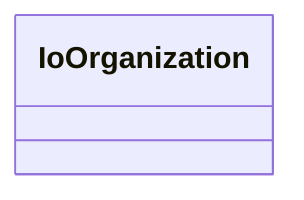

# Class: No class (entity type) name specified -- this class is noted as being in the domain or range of a slot in this graph but has not itself been defined. (io_Organization)


URI: [io:Organization](https://spec.industrialontologies.org/ontology/core/Core/Organization)





<!-- no inheritance hierarchy -->


## Slots

| Name | Cardinality and Range | Description | Inheritance | Occurrences |
| ---  | --- | --- | --- | --- |


## Usages

| used by | used in | type | used |
| ---  | --- | --- | --- |
| [IoManufacturer](../classes/IoManufacturer.md) | [sudokn_hasPrimaryNAICSClassifier](../slots/sudokn_hasPrimaryNAICSClassifier.md) | domain | [IoOrganization](../classes/IoOrganization.md) |
| [IoManufacturer](../classes/IoManufacturer.md) | [sudokn_hasOwnershipStatusClassifier](../slots/sudokn_hasOwnershipStatusClassifier.md) | domain | [IoOrganization](../classes/IoOrganization.md) |
| [IoManufacturer](../classes/IoManufacturer.md) | [sudokn_hasCertificate](../slots/sudokn_hasCertificate.md) | domain | [IoOrganization](../classes/IoOrganization.md) |
| [IoManufacturer](../classes/IoManufacturer.md) | [sudokn_manufactures](../slots/sudokn_manufactures.md) | domain | [IoOrganization](../classes/IoOrganization.md) |
| [IoManufacturer](../classes/IoManufacturer.md) | [sudokn_hasManagementCapability](../slots/sudokn_hasManagementCapability.md) | domain | [IoOrganization](../classes/IoOrganization.md) |
| [IoManufacturer](../classes/IoManufacturer.md) | [sudokn_hasMaterialCapability](../slots/sudokn_hasMaterialCapability.md) | domain | [IoOrganization](../classes/IoOrganization.md) |
| [IoManufacturer](../classes/IoManufacturer.md) | [sudokn_hasEmailAddress](../slots/sudokn_hasEmailAddress.md) | domain | [IoOrganization](../classes/IoOrganization.md) |
| [IoManufacturer](../classes/IoManufacturer.md) | [sudokn_suppliesToIndustry](../slots/sudokn_suppliesToIndustry.md) | domain | [IoOrganization](../classes/IoOrganization.md) |
| [IoManufacturer](../classes/IoManufacturer.md) | [sudokn_hasNumberOfEmployees](../slots/sudokn_hasNumberOfEmployees.md) | domain | [IoOrganization](../classes/IoOrganization.md) |
| [IoManufacturer](../classes/IoManufacturer.md) | [sudokn_hasNAICSClassifier](../slots/sudokn_hasNAICSClassifier.md) | domain | [IoOrganization](../classes/IoOrganization.md) |
| [IoManufacturer](../classes/IoManufacturer.md) | [sudokn_hasWebAddress](../slots/sudokn_hasWebAddress.md) | domain | [IoOrganization](../classes/IoOrganization.md) |
| [IoManufacturer](../classes/IoManufacturer.md) | [sudokn_hasProcessCapability](../slots/sudokn_hasProcessCapability.md) | domain | [IoOrganization](../classes/IoOrganization.md) |


## LinkML Source

<!-- TODO: investigate https://stackoverflow.com/questions/37606292/how-to-create-tabbed-code-blocks-in-mkdocs-or-sphinx -->

### Direct

<details>

```yaml
name: io_Organization
title: No class (entity type) name specified -- this class is noted as being in the
  domain or range of a slot in this graph but has not itself been defined.
from_schema: okns:sudokn-kg
rank: 1000
class_uri: io:Organization

```
</details>

### Induced

<details>

```yaml
name: io_Organization
title: No class (entity type) name specified -- this class is noted as being in the
  domain or range of a slot in this graph but has not itself been defined.
from_schema: okns:sudokn-kg
rank: 1000
class_uri: io:Organization

```
</details>