# Class: No class (entity type) name specified -- this class is noted as a superclass of another class in this graph but has not itself been defined. (io_PhysicalLocationIdentifier)


URI: [io:PhysicalLocationIdentifier](https://spec.industrialontologies.org/ontology/core/Core/PhysicalLocationIdentifier)

```mermaid
 classDiagram
    class IoPhysicalLocationIdentifier
    click IoPhysicalLocationIdentifier href "../IoPhysicalLocationIdentifier"
      IoPhysicalLocationIdentifier <|-- SudoknBuildingNumber
        click SudoknBuildingNumber href "../SudoknBuildingNumber"
      IoPhysicalLocationIdentifier <|-- SudoknCityOfAddress
        click SudoknCityOfAddress href "../SudoknCityOfAddress"
      IoPhysicalLocationIdentifier <|-- SudoknCountryOfAddress
        click SudoknCountryOfAddress href "../SudoknCountryOfAddress"
      IoPhysicalLocationIdentifier <|-- SudoknPostalAddress
        click SudoknPostalAddress href "../SudoknPostalAddress"
      IoPhysicalLocationIdentifier <|-- SudoknStateOfAddress
        click SudoknStateOfAddress href "../SudoknStateOfAddress"
      IoPhysicalLocationIdentifier <|-- SudoknStreetAddress
        click SudoknStreetAddress href "../SudoknStreetAddress"
      IoPhysicalLocationIdentifier <|-- SudoknTwoDimensionalCartesianSpatialCoordinateDatum
        click SudoknTwoDimensionalCartesianSpatialCoordinateDatum href "../SudoknTwoDimensionalCartesianSpatialCoordinateDatum"
      IoPhysicalLocationIdentifier <|-- SudoknUSPostalCode
        click SudoknUSPostalCode href "../SudoknUSPostalCode"
      
      
```





## Inheritance
* **IoPhysicalLocationIdentifier**
    * [SudoknBuildingNumber](../classes/SudoknBuildingNumber.md)
    * [SudoknCityOfAddress](../classes/SudoknCityOfAddress.md)
    * [SudoknCountryOfAddress](../classes/SudoknCountryOfAddress.md)
    * [SudoknPostalAddress](../classes/SudoknPostalAddress.md)
    * [SudoknStateOfAddress](../classes/SudoknStateOfAddress.md)
    * [SudoknStreetAddress](../classes/SudoknStreetAddress.md)
    * [SudoknTwoDimensionalCartesianSpatialCoordinateDatum](../classes/SudoknTwoDimensionalCartesianSpatialCoordinateDatum.md)
    * [SudoknUSPostalCode](../classes/SudoknUSPostalCode.md)


## Slots

| Name | Cardinality and Range | Description | Inheritance | Occurrences |
| ---  | --- | --- | --- | --- |


## LinkML Source

<!-- TODO: investigate https://stackoverflow.com/questions/37606292/how-to-create-tabbed-code-blocks-in-mkdocs-or-sphinx -->

### Direct

<details>

```yaml
name: io_PhysicalLocationIdentifier
title: No class (entity type) name specified -- this class is noted as a superclass
  of another class in this graph but has not itself been defined.
from_schema: okns:sudokn-kg
rank: 1000
class_uri: io:PhysicalLocationIdentifier

```
</details>

### Induced

<details>

```yaml
name: io_PhysicalLocationIdentifier
title: No class (entity type) name specified -- this class is noted as a superclass
  of another class in this graph but has not itself been defined.
from_schema: okns:sudokn-kg
rank: 1000
class_uri: io:PhysicalLocationIdentifier

```
</details>