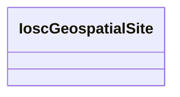

# Class: No class (entity type) name specified -- this class is noted as being in the domain or range of a slot in this graph but has not itself been defined. (iosc_GeospatialSite)


URI: [iosc:GeospatialSite](https://spec.industrialontologies.org/ontology/supplychain/SupplyChain/GeospatialSite)





<!-- no inheritance hierarchy -->


## Slots

| Name | Cardinality and Range | Description | Inheritance | Occurrences |
| ---  | --- | --- | --- | --- |


## Usages

| used by | used in | type | used |
| ---  | --- | --- | --- |
| [SudoknCity](../classes/SudoknCity.md) | [sudokn_locatedInState](../slots/sudokn_locatedInState.md) | domain | [IoscGeospatialSite](../classes/IoscGeospatialSite.md) |
| [SudoknGeospatialLocation](../classes/SudoknGeospatialLocation.md) | [sudokn_locatedInCity](../slots/sudokn_locatedInCity.md) | domain | [IoscGeospatialSite](../classes/IoscGeospatialSite.md) |


## LinkML Source

<!-- TODO: investigate https://stackoverflow.com/questions/37606292/how-to-create-tabbed-code-blocks-in-mkdocs-or-sphinx -->

### Direct

<details>

```yaml
name: iosc_GeospatialSite
title: No class (entity type) name specified -- this class is noted as being in the
  domain or range of a slot in this graph but has not itself been defined.
from_schema: okns:sudokn-kg
rank: 1000
class_uri: iosc:GeospatialSite

```
</details>

### Induced

<details>

```yaml
name: iosc_GeospatialSite
title: No class (entity type) name specified -- this class is noted as being in the
  domain or range of a slot in this graph but has not itself been defined.
from_schema: okns:sudokn-kg
rank: 1000
class_uri: iosc:GeospatialSite

```
</details>