# Class: No class (type) name specified -- this class is noted as a superclass of another class in this graph but has not itself been defined. (iosc_Industry)


_No class (type) description specified_


This class occurs 0 times.


URI: [iosc:Industry](https://spec.industrialontologies.org/ontology/supplychain/SupplyChain/Industry)

```mermaid
 classDiagram
    class IoscIndustry
    click IoscIndustry href "../IoscIndustry"
      IoscIndustry <|-- SudoknAerospaceIndustry
        click SudoknAerospaceIndustry href "../SudoknAerospaceIndustry"
      IoscIndustry <|-- SudoknAgricultureIndustry
        click SudoknAgricultureIndustry href "../SudoknAgricultureIndustry"
      IoscIndustry <|-- SudoknApparelIndustry
        click SudoknApparelIndustry href "../SudoknApparelIndustry"
      IoscIndustry <|-- SudoknAutomotiveIndustry
        click SudoknAutomotiveIndustry href "../SudoknAutomotiveIndustry"
      IoscIndustry <|-- SudoknBusinessEquipmentIndustry
        click SudoknBusinessEquipmentIndustry href "../SudoknBusinessEquipmentIndustry"
      IoscIndustry <|-- SudoknCommunicationsIndustry
        click SudoknCommunicationsIndustry href "../SudoknCommunicationsIndustry"
      IoscIndustry <|-- SudoknConstructionIndustry
        click SudoknConstructionIndustry href "../SudoknConstructionIndustry"
      IoscIndustry <|-- SudoknConsumerGoodsIndustry
        click SudoknConsumerGoodsIndustry href "../SudoknConsumerGoodsIndustry"
      IoscIndustry <|-- SudoknEducationIndustry
        click SudoknEducationIndustry href "../SudoknEducationIndustry"
      IoscIndustry <|-- SudoknElectronicProductIndustry
        click SudoknElectronicProductIndustry href "../SudoknElectronicProductIndustry"
      IoscIndustry <|-- SudoknFoodIndustry
        click SudoknFoodIndustry href "../SudoknFoodIndustry"
      IoscIndustry <|-- SudoknFurnitureIndustry
        click SudoknFurnitureIndustry href "../SudoknFurnitureIndustry"
      IoscIndustry <|-- SudoknGovernmentIndustry
        click SudoknGovernmentIndustry href "../SudoknGovernmentIndustry"
      IoscIndustry <|-- SudoknHealthcareServices
        click SudoknHealthcareServices href "../SudoknHealthcareServices"
      IoscIndustry <|-- SudoknMachinaryAndEquipmentIndustry
        click SudoknMachinaryAndEquipmentIndustry href "../SudoknMachinaryAndEquipmentIndustry"
      IoscIndustry <|-- SudoknMetalProductsIndustry
        click SudoknMetalProductsIndustry href "../SudoknMetalProductsIndustry"
      IoscIndustry <|-- SudoknMilitaryIndustry
        click SudoknMilitaryIndustry href "../SudoknMilitaryIndustry"
      IoscIndustry <|-- SudoknMiningIndustry
        click SudoknMiningIndustry href "../SudoknMiningIndustry"
      IoscIndustry <|-- SudoknOffshoreWindIndustry
        click SudoknOffshoreWindIndustry href "../SudoknOffshoreWindIndustry"
      IoscIndustry <|-- SudoknPaperIndustry
        click SudoknPaperIndustry href "../SudoknPaperIndustry"
      IoscIndustry <|-- SudoknPlasticAndRubberIndustry
        click SudoknPlasticAndRubberIndustry href "../SudoknPlasticAndRubberIndustry"
      IoscIndustry <|-- SudoknPrintingAndInformationIndustry
        click SudoknPrintingAndInformationIndustry href "../SudoknPrintingAndInformationIndustry"
      IoscIndustry <|-- SudoknProfessionalServices
        click SudoknProfessionalServices href "../SudoknProfessionalServices"
      IoscIndustry <|-- SudoknRecyclingIndustry
        click SudoknRecyclingIndustry href "../SudoknRecyclingIndustry"
      IoscIndustry <|-- SudoknRetailIndustry
        click SudoknRetailIndustry href "../SudoknRetailIndustry"
      IoscIndustry <|-- SudoknSportsAndLeisureIndustry
        click SudoknSportsAndLeisureIndustry href "../SudoknSportsAndLeisureIndustry"
      IoscIndustry <|-- SudoknTextilesIndustry
        click SudoknTextilesIndustry href "../SudoknTextilesIndustry"
      IoscIndustry <|-- SudoknTransportationIndustry
        click SudoknTransportationIndustry href "../SudoknTransportationIndustry"
      IoscIndustry <|-- SudoknUtilitiesIndustry
        click SudoknUtilitiesIndustry href "../SudoknUtilitiesIndustry"
      
      
```





## Inheritance
* **IoscIndustry**
    * [SudoknAerospaceIndustry](../classes/SudoknAerospaceIndustry.md)
    * [SudoknAgricultureIndustry](../classes/SudoknAgricultureIndustry.md)
    * [SudoknApparelIndustry](../classes/SudoknApparelIndustry.md)
    * [SudoknAutomotiveIndustry](../classes/SudoknAutomotiveIndustry.md)
    * [SudoknBusinessEquipmentIndustry](../classes/SudoknBusinessEquipmentIndustry.md)
    * [SudoknCommunicationsIndustry](../classes/SudoknCommunicationsIndustry.md)
    * [SudoknConstructionIndustry](../classes/SudoknConstructionIndustry.md)
    * [SudoknConsumerGoodsIndustry](../classes/SudoknConsumerGoodsIndustry.md)
    * [SudoknEducationIndustry](../classes/SudoknEducationIndustry.md)
    * [SudoknElectronicProductIndustry](../classes/SudoknElectronicProductIndustry.md)
    * [SudoknFoodIndustry](../classes/SudoknFoodIndustry.md)
    * [SudoknFurnitureIndustry](../classes/SudoknFurnitureIndustry.md)
    * [SudoknGovernmentIndustry](../classes/SudoknGovernmentIndustry.md)
    * [SudoknHealthcareServices](../classes/SudoknHealthcareServices.md)
    * [SudoknMachinaryAndEquipmentIndustry](../classes/SudoknMachinaryAndEquipmentIndustry.md)
    * [SudoknMetalProductsIndustry](../classes/SudoknMetalProductsIndustry.md)
    * [SudoknMilitaryIndustry](../classes/SudoknMilitaryIndustry.md)
    * [SudoknMiningIndustry](../classes/SudoknMiningIndustry.md)
    * [SudoknOffshoreWindIndustry](../classes/SudoknOffshoreWindIndustry.md)
    * [SudoknPaperIndustry](../classes/SudoknPaperIndustry.md)
    * [SudoknPlasticAndRubberIndustry](../classes/SudoknPlasticAndRubberIndustry.md)
    * [SudoknPrintingAndInformationIndustry](../classes/SudoknPrintingAndInformationIndustry.md)
    * [SudoknProfessionalServices](../classes/SudoknProfessionalServices.md)
    * [SudoknRecyclingIndustry](../classes/SudoknRecyclingIndustry.md)
    * [SudoknRetailIndustry](../classes/SudoknRetailIndustry.md)
    * [SudoknSportsAndLeisureIndustry](../classes/SudoknSportsAndLeisureIndustry.md)
    * [SudoknTextilesIndustry](../classes/SudoknTextilesIndustry.md)
    * [SudoknTransportationIndustry](../classes/SudoknTransportationIndustry.md)
    * [SudoknUtilitiesIndustry](../classes/SudoknUtilitiesIndustry.md)


## Slots

| Name | Cardinality and Range | Description | Inheritance | Occurrences |
| ---  | --- | --- | --- | --- |


## LinkML Source

<!-- TODO: investigate https://stackoverflow.com/questions/37606292/how-to-create-tabbed-code-blocks-in-mkdocs-or-sphinx -->

### Direct

<details>

```yaml
name: iosc_Industry
conforms_to: No schema conformance document specified
annotations:
  count:
    tag: count
    value: 0
description: No class (type) description specified
title: No class (type) name specified -- this class is noted as a superclass of another
  class in this graph but has not itself been defined.
from_schema: sudokn-kg
rank: 1000
class_uri: iosc:Industry

```
</details>

### Induced

<details>

```yaml
name: iosc_Industry
conforms_to: No schema conformance document specified
annotations:
  count:
    tag: count
    value: 0
description: No class (type) description specified
title: No class (type) name specified -- this class is noted as a superclass of another
  class in this graph but has not itself been defined.
from_schema: sudokn-kg
rank: 1000
class_uri: iosc:Industry

```
</details>