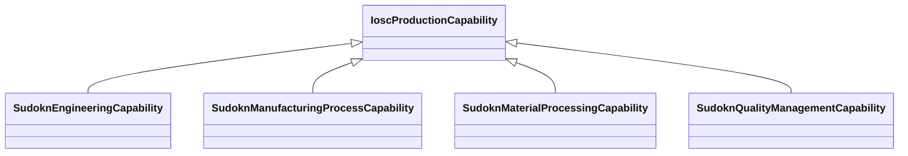

# Class: No class (type) name specified -- this class is noted as a superclass of another class in this graph but has not itself been defined. (iosc_ProductionCapability)


_No class (type) description specified_


This class occurs 0 times.


URI: [iosc:ProductionCapability](https://spec.industrialontologies.org/ontology/supplychain/SupplyChain/ProductionCapability)





## Inheritance
* **IoscProductionCapability**
    * [SudoknEngineeringCapability](../classes/SudoknEngineeringCapability.md)
    * [SudoknManufacturingProcessCapability](../classes/SudoknManufacturingProcessCapability.md)
    * [SudoknMaterialProcessingCapability](../classes/SudoknMaterialProcessingCapability.md)
    * [SudoknQualityManagementCapability](../classes/SudoknQualityManagementCapability.md)


## Slots

| Name | Cardinality and Range | Description | Inheritance | Occurrences |
| ---  | --- | --- | --- | --- |


## LinkML Source

<!-- TODO: investigate https://stackoverflow.com/questions/37606292/how-to-create-tabbed-code-blocks-in-mkdocs-or-sphinx -->

### Direct

<details>

```yaml
name: iosc_ProductionCapability
conforms_to: No schema conformance document specified
annotations:
  count:
    tag: count
    value: 0
description: No class (type) description specified
title: No class (type) name specified -- this class is noted as a superclass of another
  class in this graph but has not itself been defined.
from_schema: sudokn-kg
rank: 1000
class_uri: iosc:ProductionCapability

```
</details>

### Induced

<details>

```yaml
name: iosc_ProductionCapability
conforms_to: No schema conformance document specified
annotations:
  count:
    tag: count
    value: 0
description: No class (type) description specified
title: No class (type) name specified -- this class is noted as a superclass of another
  class in this graph but has not itself been defined.
from_schema: sudokn-kg
rank: 1000
class_uri: iosc:ProductionCapability

```
</details>