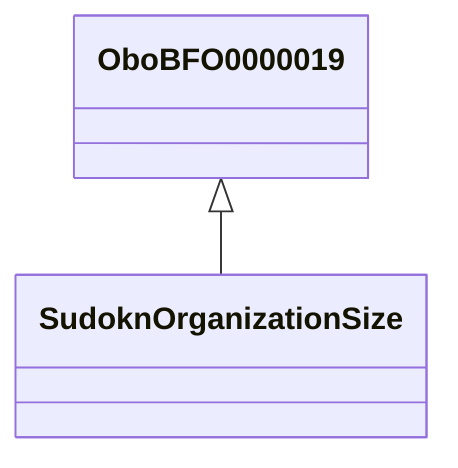

# Class: No class (entity type) name specified -- this class is noted as a superclass of another class in this graph but has not itself been defined. (obo_BFO_0000019)


URI: [obo:BFO_0000019](http://purl.obolibrary.org/obo/BFO_0000019)





## Inheritance
* **OboBFO0000019**
    * [SudoknOrganizationSize](../classes/SudoknOrganizationSize.md)


## Slots

| Name | Cardinality and Range | Description | Inheritance | Occurrences |
| ---  | --- | --- | --- | --- |


## LinkML Source

<!-- TODO: investigate https://stackoverflow.com/questions/37606292/how-to-create-tabbed-code-blocks-in-mkdocs-or-sphinx -->

### Direct

<details>

```yaml
name: obo_BFO_0000019
title: No class (entity type) name specified -- this class is noted as a superclass
  of another class in this graph but has not itself been defined.
from_schema: okns:sudokn-kg
rank: 1000
class_uri: obo:BFO_0000019

```
</details>

### Induced

<details>

```yaml
name: obo_BFO_0000019
title: No class (entity type) name specified -- this class is noted as a superclass
  of another class in this graph but has not itself been defined.
from_schema: okns:sudokn-kg
rank: 1000
class_uri: obo:BFO_0000019

```
</details>