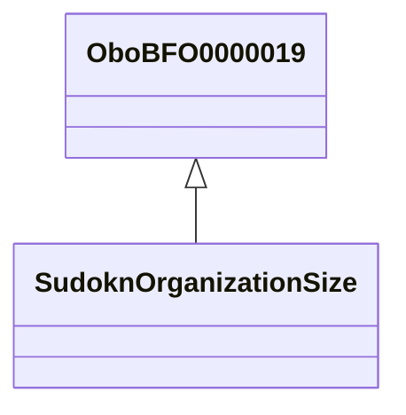

# Class: TODO -- this class is noted as a superclass of another class in this graph but has not itself been defined. (obo_BFO_0000019)


_No type description provided_


URI: [obo:BFO_0000019](http://purl.obolibrary.org/obo/BFO_0000019)





## Inheritance
* **OboBFO0000019**
    * [SudoknOrganizationSize](../classes/SudoknOrganizationSize.md)


## Slots

| Name | Cardinality and Range | Description | Inheritance |
| ---  | --- | --- | --- |


## TODOs

* TODO -- Todos for this class go here
* or you can delete the todos
* if you think the class is perfect.

## Identifier and Mapping Information


### Schema Source


* from schema: sudokn-kg


## Mappings

| Mapping Type | Mapped Value |
| ---  | ---  |
| self | obo:BFO_0000019 |
| native | sudokn-kg/:OboBFO0000019 |


## LinkML Source

<!-- TODO: investigate https://stackoverflow.com/questions/37606292/how-to-create-tabbed-code-blocks-in-mkdocs-or-sphinx -->

### Direct

<details>
```yaml
name: obo_BFO_0000019
description: No type description provided
title: TODO -- this class is noted as a superclass of another class in this graph
  but has not itself been defined.
todos:
- TODO -- Todos for this class go here
- or you can delete the todos
- if you think the class is perfect.
notes:
- Class with 0 occurences.
from_schema: sudokn-kg
rank: 1000
class_uri: obo:BFO_0000019

```
</details>

### Induced

<details>
```yaml
name: obo_BFO_0000019
description: No type description provided
title: TODO -- this class is noted as a superclass of another class in this graph
  but has not itself been defined.
todos:
- TODO -- Todos for this class go here
- or you can delete the todos
- if you think the class is perfect.
notes:
- Class with 0 occurences.
from_schema: sudokn-kg
rank: 1000
class_uri: obo:BFO_0000019

```
</details>