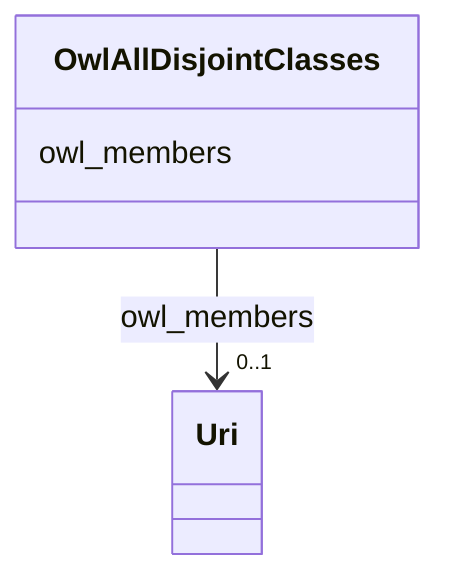

# Class: No class (type) name specified (owl_AllDisjointClasses)


_No class (type) description specified_


This class occurs 14 times.


URI: [owl:AllDisjointClasses](http://www.w3.org/2002/07/owl#AllDisjointClasses)





<!-- no inheritance hierarchy -->


## Slots

| Name | Cardinality and Range | Description | Inheritance | Occurrences |
| ---  | --- | --- | --- | --- |
| [owl_members](../slots/owl_members.md) | 0..1 <br/> [xsd:anyURI](http://www.w3.org/2001/XMLSchema#anyURI) | No slot (predicate) description specified <br/>  | direct | 14 |


## LinkML Source

<!-- TODO: investigate https://stackoverflow.com/questions/37606292/how-to-create-tabbed-code-blocks-in-mkdocs-or-sphinx -->

### Direct

<details>

```yaml
name: owl_AllDisjointClasses
conforms_to: No schema conformance document specified
annotations:
  count:
    tag: count
    value: 14
description: No class (type) description specified
title: No class (type) name specified
from_schema: sudokn-kg
rank: 1000
slots:
- owl_members
slot_usage:
  owl_members:
    name: owl_members
    annotations:
      uri:
        tag: uri
        value: 14
class_uri: owl:AllDisjointClasses

```
</details>

### Induced

<details>

```yaml
name: owl_AllDisjointClasses
conforms_to: No schema conformance document specified
annotations:
  count:
    tag: count
    value: 14
description: No class (type) description specified
title: No class (type) name specified
from_schema: sudokn-kg
rank: 1000
slot_usage:
  owl_members:
    name: owl_members
    annotations:
      uri:
        tag: uri
        value: 14
attributes:
  owl_members:
    name: owl_members
    annotations:
      uri:
        tag: uri
        value: 14
    description: No slot (predicate) description specified
    examples:
    - object:
        example_object: _:b1
        example_object_type: uri
        example_predicate: owl:members
        example_subject: _:b0
        example_subject_type: owl_AllDisjointClasses
    from_schema: sudokn-kg
    rank: 1000
    slot_uri: owl:members
    alias: owl_members
    owner: owl_AllDisjointClasses
    domain_of:
    - owl_AllDisjointClasses
    range: uri
class_uri: owl:AllDisjointClasses

```
</details>