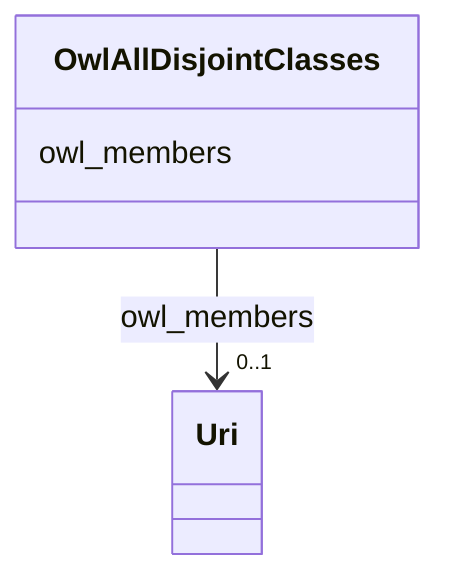

# Class: TODO -- what's a good name for this class (type)? (owl_AllDisjointClasses)


_TODO -- tell the world what this class (type) describes._


URI: [owl:AllDisjointClasses](http://www.w3.org/2002/07/owl#AllDisjointClasses)





<!-- no inheritance hierarchy -->


## Slots

| Name | Cardinality and Range | Description | Inheritance |
| ---  | --- | --- | --- |
| [owl_members](../slots/owl_members.md) | 0..1 <br/> [xsd:anyURI](http://www.w3.org/2001/XMLSchema#anyURI) | TODO -- tell the world what this slot (predicate) describes | direct |


## Examples

| Value |
| --- |
| _:b0 |

## TODOs

* TODO -- Todos for this class go here
* or you can delete the todos
* if you think the class is perfect.

## Identifier and Mapping Information


### Schema Source


* from schema: sudokn-kg


## Mappings

| Mapping Type | Mapped Value |
| ---  | ---  |
| self | owl:AllDisjointClasses |
| native | sudokn-kg/:OwlAllDisjointClasses |


## LinkML Source

<!-- TODO: investigate https://stackoverflow.com/questions/37606292/how-to-create-tabbed-code-blocks-in-mkdocs-or-sphinx -->

### Direct

<details>
```yaml
name: owl_AllDisjointClasses
description: TODO -- tell the world what this class (type) describes.
title: TODO -- what's a good name for this class (type)?
todos:
- TODO -- Todos for this class go here
- or you can delete the todos
- if you think the class is perfect.
notes:
- Class with 14 occurences.
examples:
- value: _:b0
from_schema: sudokn-kg
slots:
- owl_members
class_uri: owl:AllDisjointClasses

```
</details>

### Induced

<details>
```yaml
name: owl_AllDisjointClasses
description: TODO -- tell the world what this class (type) describes.
title: TODO -- what's a good name for this class (type)?
todos:
- TODO -- Todos for this class go here
- or you can delete the todos
- if you think the class is perfect.
notes:
- Class with 14 occurences.
examples:
- value: _:b0
from_schema: sudokn-kg
attributes:
  owl_members:
    name: owl_members
    description: TODO -- tell the world what this slot (predicate) describes.
    todos:
    - TODO -- Todos for this slot go here
    - or you can delete the todos
    - if you think the class is perfect.
    comments:
    - 14 occurrences with subject type owl_AllDisjointClasses and object type uri.
    examples:
    - value: _:b0 owl:members _:b1
    from_schema: sudokn-kg
    rank: 1000
    slot_uri: owl:members
    alias: owl_members
    owner: owl_AllDisjointClasses
    domain_of:
    - owl_AllDisjointClasses
    range: uri
class_uri: owl:AllDisjointClasses

```
</details>