# Class: TODO -- what's a good name for this class (type)? (owl_NamedIndividual)


_TODO -- tell the world what this class (type) describes._


URI: [owl:NamedIndividual](http://www.w3.org/2002/07/owl#NamedIndividual)

```mermaid
 classDiagram
    class OwlNamedIndividual
    click OwlNamedIndividual href "../OwlNamedIndividual"
      OwlNamedIndividual : sudokn_hasCertificate
        
          
    
    
    OwlNamedIndividual --> "0..1" Any : sudokn_hasCertificate
    click Any href "../Any"

        
      OwlNamedIndividual : sudokn_hasEmailAddress
        
          
    
    
    OwlNamedIndividual --> "0..1" Any : sudokn_hasEmailAddress
    click Any href "../Any"

        
      OwlNamedIndividual : sudokn_hasManagementCapability
        
          
    
    
    OwlNamedIndividual --> "0..1" Any : sudokn_hasManagementCapability
    click Any href "../Any"

        
      OwlNamedIndividual : sudokn_hasMaterialCapability
        
          
    
    
    OwlNamedIndividual --> "0..1" Any : sudokn_hasMaterialCapability
    click Any href "../Any"

        
      OwlNamedIndividual : sudokn_hasNAICSClassifier
        
          
    
    
    OwlNamedIndividual --> "0..1" Any : sudokn_hasNAICSClassifier
    click Any href "../Any"

        
      OwlNamedIndividual : sudokn_hasName
        
          
    
    
    OwlNamedIndividual --> "0..1" SudoknOrganizationName : sudokn_hasName
    click SudoknOrganizationName href "../SudoknOrganizationName"

        
      OwlNamedIndividual : sudokn_hasOwnershipStatusClassifier
        
          
    
    
    OwlNamedIndividual --> "0..1" Any : sudokn_hasOwnershipStatusClassifier
    click Any href "../Any"

        
      OwlNamedIndividual : sudokn_hasPostalAddress
        
          
    
    
    OwlNamedIndividual --> "0..1" Any : sudokn_hasPostalAddress
    click Any href "../Any"

        
      OwlNamedIndividual : sudokn_hasProcessCapability
        
          
    
    
    OwlNamedIndividual --> "0..1" Any : sudokn_hasProcessCapability
    click Any href "../Any"

        
      OwlNamedIndividual : sudokn_hasWebAddress
        
          
    
    
    OwlNamedIndividual --> "0..1" Any : sudokn_hasWebAddress
    click Any href "../Any"

        
      OwlNamedIndividual : sudokn_suppliesToIndustry
        
          
    
    
    OwlNamedIndividual --> "0..1" Any : sudokn_suppliesToIndustry
    click Any href "../Any"

        
      
```





<!-- no inheritance hierarchy -->


## Slots

| Name | Cardinality and Range | Description | Inheritance |
| ---  | --- | --- | --- |
| [sudokn_hasCertificate](../slots/sudokn_hasCertificate.md) | 0..1 <br/> [Any](../classes/Any.md)&nbsp;or&nbsp;<br />[SudoknISO9000](../classes/SudoknISO9000.md)&nbsp;or&nbsp;<br />[SudoknKOSHERApproved](../classes/SudoknKOSHERApproved.md)&nbsp;or&nbsp;<br />[SudoknISO14001](../classes/SudoknISO14001.md)&nbsp;or&nbsp;<br />[SudoknISO13485](../classes/SudoknISO13485.md)&nbsp;or&nbsp;<br />[SudoknAS9000Certificate](../classes/SudoknAS9000Certificate.md)&nbsp;or&nbsp;<br />[SudoknQS9000Certificate](../classes/SudoknQS9000Certificate.md)&nbsp;or&nbsp;<br />[SudoknNADCAPCertificate](../classes/SudoknNADCAPCertificate.md)&nbsp;or&nbsp;<br />[SudoknISO14001Certificate](../classes/SudoknISO14001Certificate.md)&nbsp;or&nbsp;<br />[SudoknISO9001](../classes/SudoknISO9001.md)&nbsp;or&nbsp;<br />[SudoknITARCertificate](../classes/SudoknITARCertificate.md)&nbsp;or&nbsp;<br />[SudoknISO9000Certificate](../classes/SudoknISO9000Certificate.md)&nbsp;or&nbsp;<br />[SudoknASME](../classes/SudoknASME.md)&nbsp;or&nbsp;<br />[SudoknHAACPCertificate](../classes/SudoknHAACPCertificate.md)&nbsp;or&nbsp;<br />[SudoknISO9001Certificate](../classes/SudoknISO9001Certificate.md)&nbsp;or&nbsp;<br />[SudoknIS-TS16949](../classes/SudoknIS-TS16949.md)&nbsp;or&nbsp;<br />[SudoknIATF16949Certificate](../classes/SudoknIATF16949Certificate.md)&nbsp;or&nbsp;<br />[SudoknAWSWelderCertificate](../classes/SudoknAWSWelderCertificate.md)&nbsp;or&nbsp;<br />[SudoknNADCAPAC7004](../classes/SudoknNADCAPAC7004.md)&nbsp;or&nbsp;<br />[SudoknISTS16949Certificate](../classes/SudoknISTS16949Certificate.md)&nbsp;or&nbsp;<br />[SudoknISO14000Certificate](../classes/SudoknISO14000Certificate.md)&nbsp;or&nbsp;<br />[SudoknBritishRetailConsortiumAccreditation](../classes/SudoknBritishRetailConsortiumAccreditation.md)&nbsp;or&nbsp;<br />[SudoknISOCertificate](../classes/SudoknISOCertificate.md)&nbsp;or&nbsp;<br />[SudoknASMECertificate](../classes/SudoknASMECertificate.md)&nbsp;or&nbsp;<br />[SudoknAS9102Certificate](../classes/SudoknAS9102Certificate.md)&nbsp;or&nbsp;<br />[SudoknBABACertificate](../classes/SudoknBABACertificate.md)&nbsp;or&nbsp;<br />[SudoknITARCompliant](../classes/SudoknITARCompliant.md)&nbsp;or&nbsp;<br />[SudoknAS9100](../classes/SudoknAS9100.md)&nbsp;or&nbsp;<br />[SudoknFDACertificate](../classes/SudoknFDACertificate.md)&nbsp;or&nbsp;<br />[SudoknFDAGMPCompliant](../classes/SudoknFDAGMPCompliant.md)&nbsp;or&nbsp;<br />[SudoknQS9000](../classes/SudoknQS9000.md)&nbsp;or&nbsp;<br />[SudoknISO13485Certificate](../classes/SudoknISO13485Certificate.md)&nbsp;or&nbsp;<br />[SudoknTI9000Certificate](../classes/SudoknTI9000Certificate.md)&nbsp;or&nbsp;<br />[SudoknAS9100Certificate](../classes/SudoknAS9100Certificate.md)&nbsp;or&nbsp;<br />[SudoknLEEDCertificate](../classes/SudoknLEEDCertificate.md)&nbsp;or&nbsp;<br />[xsd:anyURI](http://www.w3.org/2001/XMLSchema#anyURI) | TODO -- tell the world what this slot (predicate) describes | direct |
| [sudokn_hasProcessCapability](../slots/sudokn_hasProcessCapability.md) | 0..1 <br/> [Any](../classes/Any.md)&nbsp;or&nbsp;<br />[SudoknLaserCuttingCapability](../classes/SudoknLaserCuttingCapability.md)&nbsp;or&nbsp;<br />[SudoknAssemblyCapability](../classes/SudoknAssemblyCapability.md)&nbsp;or&nbsp;<br />[SudoknLaserProcessingCapability](../classes/SudoknLaserProcessingCapability.md)&nbsp;or&nbsp;<br />[SudoknWaterjetCuttimgCapability](../classes/SudoknWaterjetCuttimgCapability.md)&nbsp;or&nbsp;<br />[SudoknPulsedElectrochemicalMachiningCapability](../classes/SudoknPulsedElectrochemicalMachiningCapability.md)&nbsp;or&nbsp;<br />[SudoknFixturingCapability](../classes/SudoknFixturingCapability.md)&nbsp;or&nbsp;<br />[SudoknCNCHorizontalTurningCapability](../classes/SudoknCNCHorizontalTurningCapability.md)&nbsp;or&nbsp;<br />[SudoknCarbonitridingCapability](../classes/SudoknCarbonitridingCapability.md)&nbsp;or&nbsp;<br />[SudoknSolderingCapability](../classes/SudoknSolderingCapability.md)&nbsp;or&nbsp;<br />[SudoknGearCuttingCapability](../classes/SudoknGearCuttingCapability.md)&nbsp;or&nbsp;<br />[SudoknElectronBeamWeldingCapability](../classes/SudoknElectronBeamWeldingCapability.md)&nbsp;or&nbsp;<br />[SudoknMachineBuildingCapability](../classes/SudoknMachineBuildingCapability.md)&nbsp;or&nbsp;<br />[SudoknPunchingCapability](../classes/SudoknPunchingCapability.md)&nbsp;or&nbsp;<br />[SudoknMetalStampingCapability](../classes/SudoknMetalStampingCapability.md)&nbsp;or&nbsp;<br />[SudoknFabricatingCapability](../classes/SudoknFabricatingCapability.md)&nbsp;or&nbsp;<br />[SudoknSmeltingCapability](../classes/SudoknSmeltingCapability.md)&nbsp;or&nbsp;<br />[SudoknDieCastingCapability](../classes/SudoknDieCastingCapability.md)&nbsp;or&nbsp;<br />[SudoknVerticalMillingCapability](../classes/SudoknVerticalMillingCapability.md)&nbsp;or&nbsp;<br />[SudoknDigitalPrintingCapability](../classes/SudoknDigitalPrintingCapability.md)&nbsp;or&nbsp;<br />[SudoknRivettingCapability](../classes/SudoknRivettingCapability.md)&nbsp;or&nbsp;<br />[SudoknPassivationCapability](../classes/SudoknPassivationCapability.md)&nbsp;or&nbsp;<br />[SudoknAcrylicFabricationCapability](../classes/SudoknAcrylicFabricationCapability.md)&nbsp;or&nbsp;<br />[SudoknFlameSprayingCapability](../classes/SudoknFlameSprayingCapability.md)&nbsp;or&nbsp;<br />[SudoknKnurlingCapability](../classes/SudoknKnurlingCapability.md)&nbsp;or&nbsp;<br />[SudoknWireFormingCapability](../classes/SudoknWireFormingCapability.md)&nbsp;or&nbsp;<br />[SudoknCNCMachiningCapability](../classes/SudoknCNCMachiningCapability.md)&nbsp;or&nbsp;<br />[SudoknGalvanizingCapability](../classes/SudoknGalvanizingCapability.md)&nbsp;or&nbsp;<br />[SudoknAssemblyCapibility](../classes/SudoknAssemblyCapibility.md)&nbsp;or&nbsp;<br />[SudoknWireHarnessAssemblyCapability](../classes/SudoknWireHarnessAssemblyCapability.md)&nbsp;or&nbsp;<br />[SudoknCastingCapability](../classes/SudoknCastingCapability.md)&nbsp;or&nbsp;<br />[SudoknCeramicMoldCastingCapability](../classes/SudoknCeramicMoldCastingCapability.md)&nbsp;or&nbsp;<br />[SudoknDieMakingCapability](../classes/SudoknDieMakingCapability.md)&nbsp;or&nbsp;<br />[SudoknMetalSpinningCapability](../classes/SudoknMetalSpinningCapability.md)&nbsp;or&nbsp;<br />[SudoknCNCCuttingCapability](../classes/SudoknCNCCuttingCapability.md)&nbsp;or&nbsp;<br />[SudoknVacuumCastingCapability](../classes/SudoknVacuumCastingCapability.md)&nbsp;or&nbsp;<br />[SudoknSilkScreeningCapability](../classes/SudoknSilkScreeningCapability.md)&nbsp;or&nbsp;<br />[SudoknChemicalCoatingCapability](../classes/SudoknChemicalCoatingCapability.md)&nbsp;or&nbsp;<br />[SudoknMoldMakingCapability](../classes/SudoknMoldMakingCapability.md)&nbsp;or&nbsp;<br />[SudoknPlasterMoldCastingCapability](../classes/SudoknPlasterMoldCastingCapability.md)&nbsp;or&nbsp;<br />[SudoknSheetMetalFormingCapability](../classes/SudoknSheetMetalFormingCapability.md)&nbsp;or&nbsp;<br />[SudoknChemicalCleaningCapability](../classes/SudoknChemicalCleaningCapability.md)&nbsp;or&nbsp;<br />[SudoknPhosphateCoatingCapability](../classes/SudoknPhosphateCoatingCapability.md)&nbsp;or&nbsp;<br />[SudoknRapidPrototypingCapability](../classes/SudoknRapidPrototypingCapability.md)&nbsp;or&nbsp;<br />[SudoknPolishingCapability](../classes/SudoknPolishingCapability.md)&nbsp;or&nbsp;<br />[SudoknVacuumHardeningCapability](../classes/SudoknVacuumHardeningCapability.md)&nbsp;or&nbsp;<br />[SudoknPrintingCapability](../classes/SudoknPrintingCapability.md)&nbsp;or&nbsp;<br />[SudoknSandCastingCapability](../classes/SudoknSandCastingCapability.md)&nbsp;or&nbsp;<br />[SudoknTubingCapability](../classes/SudoknTubingCapability.md)&nbsp;or&nbsp;<br />[SudoknElectroplatingCapability](../classes/SudoknElectroplatingCapability.md)&nbsp;or&nbsp;<br />[SudoknTubeBendingCapability](../classes/SudoknTubeBendingCapability.md)&nbsp;or&nbsp;<br />[SudoknKnittingCapability](../classes/SudoknKnittingCapability.md)&nbsp;or&nbsp;<br />[SudoknToolMakingCapability](../classes/SudoknToolMakingCapability.md)&nbsp;or&nbsp;<br />[SudoknNickelPlatingCapability](../classes/SudoknNickelPlatingCapability.md)&nbsp;or&nbsp;<br />[SudoknBrazingCapability](../classes/SudoknBrazingCapability.md)&nbsp;or&nbsp;<br />[xsd:anyURI](http://www.w3.org/2001/XMLSchema#anyURI)&nbsp;or&nbsp;<br />[SudoknCNCPressBrakeCapability](../classes/SudoknCNCPressBrakeCapability.md)&nbsp;or&nbsp;<br />[SudoknWireEDMCapability](../classes/SudoknWireEDMCapability.md)&nbsp;or&nbsp;<br />[SudoknSinkerEDMCapability](../classes/SudoknSinkerEDMCapability.md)&nbsp;or&nbsp;<br />[SudoknVacuumFormingCapability](../classes/SudoknVacuumFormingCapability.md)&nbsp;or&nbsp;<br />[SudoknElectropolishingCapability](../classes/SudoknElectropolishingCapability.md)&nbsp;or&nbsp;<br />[SudoknCustomFoamCuttingCapability](../classes/SudoknCustomFoamCuttingCapability.md)&nbsp;or&nbsp;<br />[Sudokn3DPrintingCapability](../classes/Sudokn3DPrintingCapability.md)&nbsp;or&nbsp;<br />[SudoknBendingCapability](../classes/SudoknBendingCapability.md)&nbsp;or&nbsp;<br />[SudoknCarburizingCapability](../classes/SudoknCarburizingCapability.md)&nbsp;or&nbsp;<br />[SudoknMillingCapability](../classes/SudoknMillingCapability.md)&nbsp;or&nbsp;<br />[SudoknCoatingCapability](../classes/SudoknCoatingCapability.md)&nbsp;or&nbsp;<br />[SudoknAddtiveManufacturingCapability](../classes/SudoknAddtiveManufacturingCapability.md)&nbsp;or&nbsp;<br />[SudoknWeldingCapability](../classes/SudoknWeldingCapability.md)&nbsp;or&nbsp;<br />[SudoknSinteringCapability](../classes/SudoknSinteringCapability.md)&nbsp;or&nbsp;<br />[SudoknMIGWeldinCapability](../classes/SudoknMIGWeldinCapability.md)&nbsp;or&nbsp;<br />[SudoknVacuumPackagingCapability](../classes/SudoknVacuumPackagingCapability.md)&nbsp;or&nbsp;<br />[SudoknPlasticMachiningCapability](../classes/SudoknPlasticMachiningCapability.md)&nbsp;or&nbsp;<br />[SudoknPressingCapability](../classes/SudoknPressingCapability.md)&nbsp;or&nbsp;<br />[SudoknSwissMachiningCapability](../classes/SudoknSwissMachiningCapability.md)&nbsp;or&nbsp;<br />[SudoknCNCLatheCapability](../classes/SudoknCNCLatheCapability.md)&nbsp;or&nbsp;<br />[SudoknTurningCapability](../classes/SudoknTurningCapability.md)&nbsp;or&nbsp;<br />[SudoknAbrasiveCleaningCapability](../classes/SudoknAbrasiveCleaningCapability.md)&nbsp;or&nbsp;<br />[SudoknFabricationCapability](../classes/SudoknFabricationCapability.md)&nbsp;or&nbsp;<br />[SudoknInvestmentCastingCapability](../classes/SudoknInvestmentCastingCapability.md)&nbsp;or&nbsp;<br />[SudoknEmbossingCapability](../classes/SudoknEmbossingCapability.md)&nbsp;or&nbsp;<br />[SudoknPackingCapability](../classes/SudoknPackingCapability.md)&nbsp;or&nbsp;<br />[SudoknShearingCapability](../classes/SudoknShearingCapability.md)&nbsp;or&nbsp;<br />[SudoknShrinkFittingCapability](../classes/SudoknShrinkFittingCapability.md)&nbsp;or&nbsp;<br />[SudoknLatheWorkCapability](../classes/SudoknLatheWorkCapability.md)&nbsp;or&nbsp;<br />[SudoknCNCWireBendingCapability](../classes/SudoknCNCWireBendingCapability.md)&nbsp;or&nbsp;<br />[SudoknChromateConversionCoatingCapability](../classes/SudoknChromateConversionCoatingCapability.md)&nbsp;or&nbsp;<br />[SudoknLiveToolingCapability](../classes/SudoknLiveToolingCapability.md)&nbsp;or&nbsp;<br />[SudoknMediaBlastingCapability](../classes/SudoknMediaBlastingCapability.md)&nbsp;or&nbsp;<br />[SudoknCNCMillingCapability](../classes/SudoknCNCMillingCapability.md)&nbsp;or&nbsp;<br />[SudoknPressBrakingCapability](../classes/SudoknPressBrakingCapability.md)&nbsp;or&nbsp;<br />[SudoknInstallationCapability](../classes/SudoknInstallationCapability.md)&nbsp;or&nbsp;<br />[SudoknDeepFreezingCapability](../classes/SudoknDeepFreezingCapability.md)&nbsp;or&nbsp;<br />[SudoknCNCFormingCapability](../classes/SudoknCNCFormingCapability.md)&nbsp;or&nbsp;<br />[SudoknRollingCapability](../classes/SudoknRollingCapability.md)&nbsp;or&nbsp;<br />[SudoknNotchingCapability](../classes/SudoknNotchingCapability.md)&nbsp;or&nbsp;<br />[SudoknPipingFabricationCapability](../classes/SudoknPipingFabricationCapability.md)&nbsp;or&nbsp;<br />[SudoknBoringCapability](../classes/SudoknBoringCapability.md)&nbsp;or&nbsp;<br />[SudoknWetPaintingCapability](../classes/SudoknWetPaintingCapability.md)&nbsp;or&nbsp;<br />[SudoknCentrifugalCastingCapability](../classes/SudoknCentrifugalCastingCapability.md)&nbsp;or&nbsp;<br />[SudoknMIGWeldingCapability](../classes/SudoknMIGWeldingCapability.md)&nbsp;or&nbsp;<br />[SudoknHardeningCapability](../classes/SudoknHardeningCapability.md)&nbsp;or&nbsp;<br />[SudoknRoboticWeldingCapability](../classes/SudoknRoboticWeldingCapability.md)&nbsp;or&nbsp;<br />[SudoknElectricalDischargeMachiningCapability](../classes/SudoknElectricalDischargeMachiningCapability.md)&nbsp;or&nbsp;<br />[SudoknTappingCapability](../classes/SudoknTappingCapability.md)&nbsp;or&nbsp;<br />[SudoknProductDesignCapability](../classes/SudoknProductDesignCapability.md)&nbsp;or&nbsp;<br />[Sudokn2-AxisCNCTurningCapability](../classes/Sudokn2-AxisCNCTurningCapability.md)&nbsp;or&nbsp;<br />[SudoknMetalFabricationCapability](../classes/SudoknMetalFabricationCapability.md)&nbsp;or&nbsp;<br />[SudoknWireBendingCapability](../classes/SudoknWireBendingCapability.md)&nbsp;or&nbsp;<br />[SudoknHoningCapability](../classes/SudoknHoningCapability.md)&nbsp;or&nbsp;<br />[SudoknExtrudingCapability](../classes/SudoknExtrudingCapability.md)&nbsp;or&nbsp;<br />[SudoknLaserEtchingCapability](../classes/SudoknLaserEtchingCapability.md)&nbsp;or&nbsp;<br />[SudoknCreepFeedGrindingCapability](../classes/SudoknCreepFeedGrindingCapability.md)&nbsp;or&nbsp;<br />[SudoknPlaningCapability](../classes/SudoknPlaningCapability.md)&nbsp;or&nbsp;<br />[SudoknShellMoldCastingCapability](../classes/SudoknShellMoldCastingCapability.md)&nbsp;or&nbsp;<br />[SudoknMetalworkingCapability](../classes/SudoknMetalworkingCapability.md)&nbsp;or&nbsp;<br />[SudoknPrototypingCapability](../classes/SudoknPrototypingCapability.md)&nbsp;or&nbsp;<br />[SudoknCNCPlasmaCuttingCapability](../classes/SudoknCNCPlasmaCuttingCapability.md)&nbsp;or&nbsp;<br />[SudoknWaterjetCuttingCapability](../classes/SudoknWaterjetCuttingCapability.md)&nbsp;or&nbsp;<br />[SudoknPlasmaCuttingCapability](../classes/SudoknPlasmaCuttingCapability.md)&nbsp;or&nbsp;<br />[SudoknElectolessNickelPlatingCapability](../classes/SudoknElectolessNickelPlatingCapability.md)&nbsp;or&nbsp;<br />[SudoknHotDipGalvanizingCapability](../classes/SudoknHotDipGalvanizingCapability.md)&nbsp;or&nbsp;<br />[SudoknElectrolessPlatingCapability](../classes/SudoknElectrolessPlatingCapability.md)&nbsp;or&nbsp;<br />[SudoknRAMEdmCapability](../classes/SudoknRAMEdmCapability.md)&nbsp;or&nbsp;<br />[SudoknChemicalProcessingCapability](../classes/SudoknChemicalProcessingCapability.md)&nbsp;or&nbsp;<br />[SudoknFiberOpticLaserCuttingCapability](../classes/SudoknFiberOpticLaserCuttingCapability.md)&nbsp;or&nbsp;<br />[SudoknCNCVerticalMillingCapability](../classes/SudoknCNCVerticalMillingCapability.md)&nbsp;or&nbsp;<br />[SudoknContinuousCastingCapability](../classes/SudoknContinuousCastingCapability.md)&nbsp;or&nbsp;<br />[SudoknMechanicalAssemblyCapability](../classes/SudoknMechanicalAssemblyCapability.md)&nbsp;or&nbsp;<br />[SudoknJoiningCapability](../classes/SudoknJoiningCapability.md)&nbsp;or&nbsp;<br />[SudoknCADCapability](../classes/SudoknCADCapability.md)&nbsp;or&nbsp;<br />[SudoknCenterlessGrindingCapability](../classes/SudoknCenterlessGrindingCapability.md)&nbsp;or&nbsp;<br />[SudoknCNCmillingCapability](../classes/SudoknCNCmillingCapability.md)&nbsp;or&nbsp;<br />[SudoknHeatTreatingCapability](../classes/SudoknHeatTreatingCapability.md)&nbsp;or&nbsp;<br />[SudoknElectrolessNickelPlatingCapability](../classes/SudoknElectrolessNickelPlatingCapability.md)&nbsp;or&nbsp;<br />[SudoknGrindingCapability](../classes/SudoknGrindingCapability.md)&nbsp;or&nbsp;<br />[SudoknPLCProgrammingCapability](../classes/SudoknPLCProgrammingCapability.md)&nbsp;or&nbsp;<br />[SudoknMoldingCapability](../classes/SudoknMoldingCapability.md)&nbsp;or&nbsp;<br />[SudoknDrawingCapability](../classes/SudoknDrawingCapability.md)&nbsp;or&nbsp;<br />[SudoknExtrusionCapability](../classes/SudoknExtrusionCapability.md)&nbsp;or&nbsp;<br />[SudoknEtchingCapability](../classes/SudoknEtchingCapability.md)&nbsp;or&nbsp;<br />[SudoknSwissTurningCapability](../classes/SudoknSwissTurningCapability.md)&nbsp;or&nbsp;<br />[SudoknScreenPrintingCapability](../classes/SudoknScreenPrintingCapability.md)&nbsp;or&nbsp;<br />[SudoknShapingCapability](../classes/SudoknShapingCapability.md)&nbsp;or&nbsp;<br />[SudoknPlasmaSprayingCapability](../classes/SudoknPlasmaSprayingCapability.md)&nbsp;or&nbsp;<br />[SudoknFinishingCapability](../classes/SudoknFinishingCapability.md)&nbsp;or&nbsp;<br />[SudoknPaintingCapability](../classes/SudoknPaintingCapability.md)&nbsp;or&nbsp;<br />[SudoknWiringCapability](../classes/SudoknWiringCapability.md)&nbsp;or&nbsp;<br />[SudoknPackagingCapability](../classes/SudoknPackagingCapability.md)&nbsp;or&nbsp;<br />[SudoknPlatingCapability](../classes/SudoknPlatingCapability.md)&nbsp;or&nbsp;<br />[SudoknPrototypeManufacturingCapability](../classes/SudoknPrototypeManufacturingCapability.md)&nbsp;or&nbsp;<br />[SudoknZincArcSprayCapability](../classes/SudoknZincArcSprayCapability.md)&nbsp;or&nbsp;<br />[SudoknVaporizedMetalCoatingCapability](../classes/SudoknVaporizedMetalCoatingCapability.md)&nbsp;or&nbsp;<br />[SudoknRivetingCapability](../classes/SudoknRivetingCapability.md)&nbsp;or&nbsp;<br />[SudoknRamEDMCapability](../classes/SudoknRamEDMCapability.md)&nbsp;or&nbsp;<br />[SudoknTurretPunchingCapability](../classes/SudoknTurretPunchingCapability.md)&nbsp;or&nbsp;<br />[SudoknTIGWeldingCapability](../classes/SudoknTIGWeldingCapability.md)&nbsp;or&nbsp;<br />[SudoknSheetMetalProcessingCapability](../classes/SudoknSheetMetalProcessingCapability.md)&nbsp;or&nbsp;<br />[SudoknSurfaceGrindingCapability](../classes/SudoknSurfaceGrindingCapability.md)&nbsp;or&nbsp;<br />[SudoknFasteningCapability](../classes/SudoknFasteningCapability.md)&nbsp;or&nbsp;<br />[SudoknReverseEngineeringCapability](../classes/SudoknReverseEngineeringCapability.md)&nbsp;or&nbsp;<br />[SudoknAdditiveManufacturingCapability](../classes/SudoknAdditiveManufacturingCapability.md)&nbsp;or&nbsp;<br />[SudoknDeepHoleDrillingCapability](../classes/SudoknDeepHoleDrillingCapability.md)&nbsp;or&nbsp;<br />[SudoknDeburringCapability](../classes/SudoknDeburringCapability.md)&nbsp;or&nbsp;<br />[SudoknOilGroovingCapability](../classes/SudoknOilGroovingCapability.md)&nbsp;or&nbsp;<br />[SudoknInductionHeatingCapability](../classes/SudoknInductionHeatingCapability.md)&nbsp;or&nbsp;<br />[SudoknForgingCapability](../classes/SudoknForgingCapability.md)&nbsp;or&nbsp;<br />[SudoknElectroPlatingCapability](../classes/SudoknElectroPlatingCapability.md)&nbsp;or&nbsp;<br />[SudoknSheetMetalFabricationCapability](../classes/SudoknSheetMetalFabricationCapability.md)&nbsp;or&nbsp;<br />[SudoknPowderCoatingCapability](../classes/SudoknPowderCoatingCapability.md)&nbsp;or&nbsp;<br />[SudoknCuttingCapability](../classes/SudoknCuttingCapability.md)&nbsp;or&nbsp;<br />[SudoknEDMCapability](../classes/SudoknEDMCapability.md)&nbsp;or&nbsp;<br />[SudoknAnnealingCapability](../classes/SudoknAnnealingCapability.md)&nbsp;or&nbsp;<br />[SudoknTubeFormingCapability](../classes/SudoknTubeFormingCapability.md)&nbsp;or&nbsp;<br />[SudoknSandBlastingCapability](../classes/SudoknSandBlastingCapability.md)&nbsp;or&nbsp;<br />[SudoknSurfaceFinishingCapability](../classes/SudoknSurfaceFinishingCapability.md)&nbsp;or&nbsp;<br />[SudoknNitridingCapability](../classes/SudoknNitridingCapability.md)&nbsp;or&nbsp;<br />[SudoknFormingCapability](../classes/SudoknFormingCapability.md)&nbsp;or&nbsp;<br />[SudoknOxy-FuelCuttingCapability](../classes/SudoknOxy-FuelCuttingCapability.md)&nbsp;or&nbsp;<br />[SudoknMechanicalJoiningCapability](../classes/SudoknMechanicalJoiningCapability.md)&nbsp;or&nbsp;<br />[SudoknKittingCapability](../classes/SudoknKittingCapability.md)&nbsp;or&nbsp;<br />[SudoknSanitaryWeldingCapability](../classes/SudoknSanitaryWeldingCapability.md)&nbsp;or&nbsp;<br />[SudoknCNCBendingCapability](../classes/SudoknCNCBendingCapability.md)&nbsp;or&nbsp;<br />[SudoknCerakoteCoatingCapability](../classes/SudoknCerakoteCoatingCapability.md)&nbsp;or&nbsp;<br />[SudoknReamingCapability](../classes/SudoknReamingCapability.md)&nbsp;or&nbsp;<br />[SudoknLiquidCoatingCapability](../classes/SudoknLiquidCoatingCapability.md)&nbsp;or&nbsp;<br />[SudoknHorizontalMillingCapability](../classes/SudoknHorizontalMillingCapability.md)&nbsp;or&nbsp;<br />[SudoknEngineeringDesignCapability](../classes/SudoknEngineeringDesignCapability.md)&nbsp;or&nbsp;<br />[SudoknStampingCapability](../classes/SudoknStampingCapability.md)&nbsp;or&nbsp;<br />[SudoknFixtureDesignCapability](../classes/SudoknFixtureDesignCapability.md)&nbsp;or&nbsp;<br />[SudoknWaterJetCuttingCapability](../classes/SudoknWaterJetCuttingCapability.md)&nbsp;or&nbsp;<br />[SudoknSewingCapability](../classes/SudoknSewingCapability.md)&nbsp;or&nbsp;<br />[SudoknPemInsertionCapability](../classes/SudoknPemInsertionCapability.md)&nbsp;or&nbsp;<br />[SudoknPermanentMoldCastingCapability](../classes/SudoknPermanentMoldCastingCapability.md)&nbsp;or&nbsp;<br />[SudoknSinkerEdmCapability](../classes/SudoknSinkerEdmCapability.md)&nbsp;or&nbsp;<br />[SudoknBrassBlackeningCapability](../classes/SudoknBrassBlackeningCapability.md)&nbsp;or&nbsp;<br />[SudoknBlackOxideCoatingCapability](../classes/SudoknBlackOxideCoatingCapability.md)&nbsp;or&nbsp;<br />[SudoknAnodizingCapability](../classes/SudoknAnodizingCapability.md)&nbsp;or&nbsp;<br />[SudoknFillingCapability](../classes/SudoknFillingCapability.md)&nbsp;or&nbsp;<br />[SudoknWoodWorkingCapability](../classes/SudoknWoodWorkingCapability.md)&nbsp;or&nbsp;<br />[SudoknMigWeldingCapability](../classes/SudoknMigWeldingCapability.md)&nbsp;or&nbsp;<br />[SudoknCNCGrindingCapability](../classes/SudoknCNCGrindingCapability.md)&nbsp;or&nbsp;<br />[SudoknWoodworkingCapability](../classes/SudoknWoodworkingCapability.md)&nbsp;or&nbsp;<br />[SudoknResistanceWeldingCapability](../classes/SudoknResistanceWeldingCapability.md)&nbsp;or&nbsp;<br />[SudoknEndFormingCapability](../classes/SudoknEndFormingCapability.md)&nbsp;or&nbsp;<br />[SudoknCNCLaserCuttingCapability](../classes/SudoknCNCLaserCuttingCapability.md)&nbsp;or&nbsp;<br />[SudoknPhysicalVaporDepositionCapability](../classes/SudoknPhysicalVaporDepositionCapability.md)&nbsp;or&nbsp;<br />[SudoknBroachingCapability](../classes/SudoknBroachingCapability.md)&nbsp;or&nbsp;<br />[SudoknCNCCylindricalGrindingCapability](../classes/SudoknCNCCylindricalGrindingCapability.md)&nbsp;or&nbsp;<br />[SudoknSurfacePreparationCapability](../classes/SudoknSurfacePreparationCapability.md)&nbsp;or&nbsp;<br />[SudoknPolycrystallineDiamondMachiningCapability](../classes/SudoknPolycrystallineDiamondMachiningCapability.md)&nbsp;or&nbsp;<br />[SudoknDrillingCapability](../classes/SudoknDrillingCapability.md)&nbsp;or&nbsp;<br />[SudoknSpinningCapability](../classes/SudoknSpinningCapability.md)&nbsp;or&nbsp;<br />[SudoknThermoformingCapability](../classes/SudoknThermoformingCapability.md)&nbsp;or&nbsp;<br />[SudoknCylindricalGrindingCapability](../classes/SudoknCylindricalGrindingCapability.md)&nbsp;or&nbsp;<br />[SudoknHarperizingCapability](../classes/SudoknHarperizingCapability.md)&nbsp;or&nbsp;<br />[SudoknLaserWeldingCapability](../classes/SudoknLaserWeldingCapability.md)&nbsp;or&nbsp;<br />[SudoknSpotWeldingCapability](../classes/SudoknSpotWeldingCapability.md)&nbsp;or&nbsp;<br />[SudoknCNCTurningCapability](../classes/SudoknCNCTurningCapability.md)&nbsp;or&nbsp;<br />[SudoknSteelManufacturingCapability](../classes/SudoknSteelManufacturingCapability.md)&nbsp;or&nbsp;<br />[SudoknMachiningCapability](../classes/SudoknMachiningCapability.md) | TODO -- tell the world what this slot (predicate) describes | direct |
| [sudokn_hasPostalAddress](../slots/sudokn_hasPostalAddress.md) | 0..1 <br/> [Any](../classes/Any.md)&nbsp;or&nbsp;<br />[SudoknPostalAddress](../classes/SudoknPostalAddress.md)&nbsp;or&nbsp;<br />[SudoknUnitedStatesPostalCode](../classes/SudoknUnitedStatesPostalCode.md)&nbsp;or&nbsp;<br />[xsd:anyURI](http://www.w3.org/2001/XMLSchema#anyURI) | TODO -- tell the world what this slot (predicate) describes | direct |
| [sudokn_hasName](../slots/sudokn_hasName.md) | 0..1 <br/> [SudoknOrganizationName](../classes/SudoknOrganizationName.md) | TODO -- tell the world what this slot (predicate) describes | direct |
| [sudokn_hasWebAddress](../slots/sudokn_hasWebAddress.md) | 0..1 <br/> [Any](../classes/Any.md)&nbsp;or&nbsp;<br />[SudoknWebAddress](../classes/SudoknWebAddress.md)&nbsp;or&nbsp;<br />[xsd:anyURI](http://www.w3.org/2001/XMLSchema#anyURI) | TODO -- tell the world what this slot (predicate) describes | direct |
| [sudokn_hasOwnershipStatusClassifier](../slots/sudokn_hasOwnershipStatusClassifier.md) | 0..1 <br/> [Any](../classes/Any.md)&nbsp;or&nbsp;<br />[SudoknOwnershipStatusClassifier](../classes/SudoknOwnershipStatusClassifier.md)&nbsp;or&nbsp;<br />[xsd:anyURI](http://www.w3.org/2001/XMLSchema#anyURI) | TODO -- tell the world what this slot (predicate) describes | direct |
| [sudokn_hasMaterialCapability](../slots/sudokn_hasMaterialCapability.md) | 0..1 <br/> [Any](../classes/Any.md)&nbsp;or&nbsp;<br />[SudoknWoodProcessingCapability](../classes/SudoknWoodProcessingCapability.md)&nbsp;or&nbsp;<br />[SudoknBronzeProcessingCapability](../classes/SudoknBronzeProcessingCapability.md)&nbsp;or&nbsp;<br />[SudoknPhosphorBronzeProcessingCapability](../classes/SudoknPhosphorBronzeProcessingCapability.md)&nbsp;or&nbsp;<br />[SudoknCarbonGraphiteProcessingCapability](../classes/SudoknCarbonGraphiteProcessingCapability.md)&nbsp;or&nbsp;<br />[SudoknDelrinProcessingCapability](../classes/SudoknDelrinProcessingCapability.md)&nbsp;or&nbsp;<br />[SudoknSteelProcessingCapability](../classes/SudoknSteelProcessingCapability.md)&nbsp;or&nbsp;<br />[SudoknInvarProcessingCapability](../classes/SudoknInvarProcessingCapability.md)&nbsp;or&nbsp;<br />[SudoknMetalProcessingCapability](../classes/SudoknMetalProcessingCapability.md)&nbsp;or&nbsp;<br />[SudoknTantalumProcessingCapability](../classes/SudoknTantalumProcessingCapability.md)&nbsp;or&nbsp;<br />[SudoknManMadeFiberProcessingCapability](../classes/SudoknManMadeFiberProcessingCapability.md)&nbsp;or&nbsp;<br />[SudoknBerylliumProcessingCapability](../classes/SudoknBerylliumProcessingCapability.md)&nbsp;or&nbsp;<br />[SudoknCeramicProcessingCapability](../classes/SudoknCeramicProcessingCapability.md)&nbsp;or&nbsp;<br />[SudoknTinProcessingCapability](../classes/SudoknTinProcessingCapability.md)&nbsp;or&nbsp;<br />[SudoknExoticMaterialProcessingCapability](../classes/SudoknExoticMaterialProcessingCapability.md)&nbsp;or&nbsp;<br />[SudoknPalladiumProcessingCapability](../classes/SudoknPalladiumProcessingCapability.md)&nbsp;or&nbsp;<br />[SudoknMagnesiumProcessingCapability](../classes/SudoknMagnesiumProcessingCapability.md)&nbsp;or&nbsp;<br />[SudoknDifficultToMachineMaterialsProcessingCapability](../classes/SudoknDifficultToMachineMaterialsProcessingCapability.md)&nbsp;or&nbsp;<br />[SudoknSpecialMaterialsProcessingCapability](../classes/SudoknSpecialMaterialsProcessingCapability.md)&nbsp;or&nbsp;<br />[SudoknChromiumProcessingCapability](../classes/SudoknChromiumProcessingCapability.md)&nbsp;or&nbsp;<br />[SudoknStainlessSteelProcessingCapability](../classes/SudoknStainlessSteelProcessingCapability.md)&nbsp;or&nbsp;<br />[SudoknSteelAlloyProcessingCapability](../classes/SudoknSteelAlloyProcessingCapability.md)&nbsp;or&nbsp;<br />[SudoknZincAlloyProcessingCapability](../classes/SudoknZincAlloyProcessingCapability.md)&nbsp;or&nbsp;<br />[SudoknPhosBronzeProcessingCapability](../classes/SudoknPhosBronzeProcessingCapability.md)&nbsp;or&nbsp;<br />[SudoknMolybdenumProcessingCapability](../classes/SudoknMolybdenumProcessingCapability.md)&nbsp;or&nbsp;<br />[SudoknZirconProcessingCapability](../classes/SudoknZirconProcessingCapability.md)&nbsp;or&nbsp;<br />[SudoknSilverProcessingCapability](../classes/SudoknSilverProcessingCapability.md)&nbsp;or&nbsp;<br />[SudoknFoamProcessingCapability](../classes/SudoknFoamProcessingCapability.md)&nbsp;or&nbsp;<br />[SudoknLowAlloySteelProcessingCapability](../classes/SudoknLowAlloySteelProcessingCapability.md)&nbsp;or&nbsp;<br />[SudoknCompositeProcessingCapability](../classes/SudoknCompositeProcessingCapability.md)&nbsp;or&nbsp;<br />[SudoknLexanProcessingCapability](../classes/SudoknLexanProcessingCapability.md)&nbsp;or&nbsp;<br />[SudoknTungstenProcessingCapability](../classes/SudoknTungstenProcessingCapability.md)&nbsp;or&nbsp;<br />[SudoknHighGradeAluminumProcessingCapability](../classes/SudoknHighGradeAluminumProcessingCapability.md)&nbsp;or&nbsp;<br />[SudoknGlassProcessingCapability](../classes/SudoknGlassProcessingCapability.md)&nbsp;or&nbsp;<br />[SudoknIronProcessingCapability](../classes/SudoknIronProcessingCapability.md)&nbsp;or&nbsp;<br />[SudoknBrassProcessingCapability](../classes/SudoknBrassProcessingCapability.md)&nbsp;or&nbsp;<br />[SudoknColdRolledSteelProcessingCapability](../classes/SudoknColdRolledSteelProcessingCapability.md)&nbsp;or&nbsp;<br />[SudoknRubberProcessingCapability](../classes/SudoknRubberProcessingCapability.md)&nbsp;or&nbsp;<br />[SudoknKovarProcessingCapability](../classes/SudoknKovarProcessingCapability.md)&nbsp;or&nbsp;<br />[SudoknChemicalsProcessingCapability](../classes/SudoknChemicalsProcessingCapability.md)&nbsp;or&nbsp;<br />[SudoknLeadProcessingCapability](../classes/SudoknLeadProcessingCapability.md)&nbsp;or&nbsp;<br />[SudoknNickelProcessingCapability](../classes/SudoknNickelProcessingCapability.md)&nbsp;or&nbsp;<br />[SudoknNylonProcessingCapability](../classes/SudoknNylonProcessingCapability.md)&nbsp;or&nbsp;<br />[SudoknPolycarbonateProcessingCapability](../classes/SudoknPolycarbonateProcessingCapability.md)&nbsp;or&nbsp;<br />[SudoknGoldProcessingCapability](../classes/SudoknGoldProcessingCapability.md)&nbsp;or&nbsp;<br />[SudoknNomexProcessingCapability](../classes/SudoknNomexProcessingCapability.md)&nbsp;or&nbsp;<br />[SudoknAluminumProcessingCapability](../classes/SudoknAluminumProcessingCapability.md)&nbsp;or&nbsp;<br />[SudoknCopperProcessingCapability](../classes/SudoknCopperProcessingCapability.md)&nbsp;or&nbsp;<br />[SudoknKaptonProcessingCapability](../classes/SudoknKaptonProcessingCapability.md)&nbsp;or&nbsp;<br />[SudoknPlasticProcessingCapability](../classes/SudoknPlasticProcessingCapability.md)&nbsp;or&nbsp;<br />[SudoknNaturalFiberProcessingCapability](../classes/SudoknNaturalFiberProcessingCapability.md)&nbsp;or&nbsp;<br />[SudoknTeflonProcessingCapability](../classes/SudoknTeflonProcessingCapability.md)&nbsp;or&nbsp;<br />[SudoknZincProcessingCapability](../classes/SudoknZincProcessingCapability.md)&nbsp;or&nbsp;<br />[SudoknHastelloyProcessingCapability](../classes/SudoknHastelloyProcessingCapability.md)&nbsp;or&nbsp;<br />[SudoknPlatinumProcessingCapability](../classes/SudoknPlatinumProcessingCapability.md)&nbsp;or&nbsp;<br />[SudoknPreciousMaterialProcessingCapability](../classes/SudoknPreciousMaterialProcessingCapability.md)&nbsp;or&nbsp;<br />[SudoknWaspaloyProcessingCapability](../classes/SudoknWaspaloyProcessingCapability.md)&nbsp;or&nbsp;<br />[SudoknAcetalProcessingCapability](../classes/SudoknAcetalProcessingCapability.md)&nbsp;or&nbsp;<br />[SudoknAlloySteelProcessingCapability](../classes/SudoknAlloySteelProcessingCapability.md)&nbsp;or&nbsp;<br />[SudoknUrethaneProcessingCapability](../classes/SudoknUrethaneProcessingCapability.md)&nbsp;or&nbsp;<br />[SudoknSiliconeProcessingCapability](../classes/SudoknSiliconeProcessingCapability.md)&nbsp;or&nbsp;<br />[SudoknCarbideProcessingCapability](../classes/SudoknCarbideProcessingCapability.md)&nbsp;or&nbsp;<br />[SudoknExtremelyHardMaterialProcessingCapability](../classes/SudoknExtremelyHardMaterialProcessingCapability.md)&nbsp;or&nbsp;<br />[SudoknTitaniumProcessingCapability](../classes/SudoknTitaniumProcessingCapability.md)&nbsp;or&nbsp;<br />[SudoknCobaltProcessingCapability](../classes/SudoknCobaltProcessingCapability.md)&nbsp;or&nbsp;<br />[SudoknGraphiteProcessingCapability](../classes/SudoknGraphiteProcessingCapability.md)&nbsp;or&nbsp;<br />[SudoknInconelProcessingCapability](../classes/SudoknInconelProcessingCapability.md)&nbsp;or&nbsp;<br />[xsd:anyURI](http://www.w3.org/2001/XMLSchema#anyURI) | TODO -- tell the world what this slot (predicate) describes | direct |
| [sudokn_hasManagementCapability](../slots/sudokn_hasManagementCapability.md) | 0..1 <br/> [Any](../classes/Any.md)&nbsp;or&nbsp;<br />[SudoknQualityManagementCapability](../classes/SudoknQualityManagementCapability.md)&nbsp;or&nbsp;<br />[xsd:anyURI](http://www.w3.org/2001/XMLSchema#anyURI) | TODO -- tell the world what this slot (predicate) describes | direct |
| [sudokn_suppliesToIndustry](../slots/sudokn_suppliesToIndustry.md) | 0..1 <br/> [Any](../classes/Any.md)&nbsp;or&nbsp;<br />[SudoknHealthCareServicesIndustry](../classes/SudoknHealthCareServicesIndustry.md)&nbsp;or&nbsp;<br />[SudoknTextiles](../classes/SudoknTextiles.md)&nbsp;or&nbsp;<br />[SudoknSportsandLeisureIndustry](../classes/SudoknSportsandLeisureIndustry.md)&nbsp;or&nbsp;<br />[SudoknOffshoreWindIndustry](../classes/SudoknOffshoreWindIndustry.md)&nbsp;or&nbsp;<br />[SudoknUtilitiesIndustry](../classes/SudoknUtilitiesIndustry.md)&nbsp;or&nbsp;<br />[SudoknPaperIndustry](../classes/SudoknPaperIndustry.md)&nbsp;or&nbsp;<br />[SudoknElectronicAutomotiveInudstry](../classes/SudoknElectronicAutomotiveInudstry.md)&nbsp;or&nbsp;<br />[SudoknTransportationIndustry](../classes/SudoknTransportationIndustry.md)&nbsp;or&nbsp;<br />[SudoknMachinaryAndEquipmentIndustry](../classes/SudoknMachinaryAndEquipmentIndustry.md)&nbsp;or&nbsp;<br />[SudoknEducationalInstitutionsIndustry](../classes/SudoknEducationalInstitutionsIndustry.md)&nbsp;or&nbsp;<br />[SudoknProfessionalServicesIndustry](../classes/SudoknProfessionalServicesIndustry.md)&nbsp;or&nbsp;<br />[SudoknMetalProductionIndustry](../classes/SudoknMetalProductionIndustry.md)&nbsp;or&nbsp;<br />[SudoknOilAndGasIndustry](../classes/SudoknOilAndGasIndustry.md)&nbsp;or&nbsp;<br />[SudoknAgricultureIndustry](../classes/SudoknAgricultureIndustry.md)&nbsp;or&nbsp;<br />[SudoknFurnitureIndustry](../classes/SudoknFurnitureIndustry.md)&nbsp;or&nbsp;<br />[SudoknRecyclingIndustry](../classes/SudoknRecyclingIndustry.md)&nbsp;or&nbsp;<br />[SudoknAerospaceIndustry](../classes/SudoknAerospaceIndustry.md)&nbsp;or&nbsp;<br />[SudoknPaperandPaperboardProductsIndustry](../classes/SudoknPaperandPaperboardProductsIndustry.md)&nbsp;or&nbsp;<br />[SudoknIndustry](../classes/SudoknIndustry.md)&nbsp;or&nbsp;<br />[SudoknChemicalAndPetrochemicalIndustry](../classes/SudoknChemicalAndPetrochemicalIndustry.md)&nbsp;or&nbsp;<br />[SudoknPrintingAndInformationIndustry](../classes/SudoknPrintingAndInformationIndustry.md)&nbsp;or&nbsp;<br />[SudoknComputersandElectronicProductsIndustry](../classes/SudoknComputersandElectronicProductsIndustry.md)&nbsp;or&nbsp;<br />[SudoknRetailIndustry](../classes/SudoknRetailIndustry.md)&nbsp;or&nbsp;<br />[SudoknCommunicationandElectronicPowerUtilitiesIndustry](../classes/SudoknCommunicationandElectronicPowerUtilitiesIndustry.md)&nbsp;or&nbsp;<br />[SudoknWoodProductManufacturingIndustry](../classes/SudoknWoodProductManufacturingIndustry.md)&nbsp;or&nbsp;<br />[SudoknMetalsProductsIndustry](../classes/SudoknMetalsProductsIndustry.md)&nbsp;or&nbsp;<br />[SudoknWaterandSewerUtilitiesIndustry](../classes/SudoknWaterandSewerUtilitiesIndustry.md)&nbsp;or&nbsp;<br />[SudoknConsumerGoods](../classes/SudoknConsumerGoods.md)&nbsp;or&nbsp;<br />[SudoknGovermentIndustry](../classes/SudoknGovermentIndustry.md)&nbsp;or&nbsp;<br />[SudoknPlasticsandRubberProductsIndustry](../classes/SudoknPlasticsandRubberProductsIndustry.md)&nbsp;or&nbsp;<br />[SudoknConsumerGoodsIndustry](../classes/SudoknConsumerGoodsIndustry.md)&nbsp;or&nbsp;<br />[SudoknApparelIndustry](../classes/SudoknApparelIndustry.md)&nbsp;or&nbsp;<br />[SudoknHealthcareServicesIndustry](../classes/SudoknHealthcareServicesIndustry.md)&nbsp;or&nbsp;<br />[SudoknEducationIndustry](../classes/SudoknEducationIndustry.md)&nbsp;or&nbsp;<br />[SudoknMilitaryIndustry](../classes/SudoknMilitaryIndustry.md)&nbsp;or&nbsp;<br />[SudoknTextilesIndustry](../classes/SudoknTextilesIndustry.md)&nbsp;or&nbsp;<br />[SudoknIndustrialMachineryandEquipmentIndustry](../classes/SudoknIndustrialMachineryandEquipmentIndustry.md)&nbsp;or&nbsp;<br />[SudoknGovernmentIndustry](../classes/SudoknGovernmentIndustry.md)&nbsp;or&nbsp;<br />[SudoknElectronicProductIndustry](../classes/SudoknElectronicProductIndustry.md)&nbsp;or&nbsp;<br />[SudoknSportsAndLeisureIndustry](../classes/SudoknSportsAndLeisureIndustry.md)&nbsp;or&nbsp;<br />[SudoknRetailTradeIndustry](../classes/SudoknRetailTradeIndustry.md)&nbsp;or&nbsp;<br />[SudoknWarehousingAndStorageIndustry](../classes/SudoknWarehousingAndStorageIndustry.md)&nbsp;or&nbsp;<br />[SudoknPlasticAndRubberIndustry](../classes/SudoknPlasticAndRubberIndustry.md)&nbsp;or&nbsp;<br />[SudoknConstructionIndustry](../classes/SudoknConstructionIndustry.md)&nbsp;or&nbsp;<br />[SudoknFoodIndustry](../classes/SudoknFoodIndustry.md)&nbsp;or&nbsp;<br />[SudoknCommunicationIndustry](../classes/SudoknCommunicationIndustry.md)&nbsp;or&nbsp;<br />[SudoknMiningIndustry](../classes/SudoknMiningIndustry.md)&nbsp;or&nbsp;<br />[SudoknAutomotiveIndustry](../classes/SudoknAutomotiveIndustry.md)&nbsp;or&nbsp;<br />[SudoknElectricVehiclesIndustry](../classes/SudoknElectricVehiclesIndustry.md)&nbsp;or&nbsp;<br />[SudoknBusinessEquipmentIndustry](../classes/SudoknBusinessEquipmentIndustry.md)&nbsp;or&nbsp;<br />[xsd:anyURI](http://www.w3.org/2001/XMLSchema#anyURI) | TODO -- tell the world what this slot (predicate) describes | direct |
| [sudokn_hasNAICSClassifier](../slots/sudokn_hasNAICSClassifier.md) | 0..1 <br/> [Any](../classes/Any.md)&nbsp;or&nbsp;<br />[SudoknNAICSClassifier](../classes/SudoknNAICSClassifier.md)&nbsp;or&nbsp;<br />[xsd:anyURI](http://www.w3.org/2001/XMLSchema#anyURI) | TODO -- tell the world what this slot (predicate) describes | direct |
| [sudokn_hasEmailAddress](../slots/sudokn_hasEmailAddress.md) | 0..1 <br/> [Any](../classes/Any.md)&nbsp;or&nbsp;<br />[SudoknEmailAddress](../classes/SudoknEmailAddress.md)&nbsp;or&nbsp;<br />[xsd:anyURI](http://www.w3.org/2001/XMLSchema#anyURI) | TODO -- tell the world what this slot (predicate) describes | direct |


## Examples

| Value |
| --- |
| sudokn:/AerospaceIndustry_1 |

## TODOs

* TODO -- Todos for this class go here
* or you can delete the todos
* if you think the class is perfect.

## Identifier and Mapping Information


### Schema Source


* from schema: sudokn-kg


## Mappings

| Mapping Type | Mapped Value |
| ---  | ---  |
| self | owl:NamedIndividual |
| native | sudokn-kg/:OwlNamedIndividual |


## LinkML Source

<!-- TODO: investigate https://stackoverflow.com/questions/37606292/how-to-create-tabbed-code-blocks-in-mkdocs-or-sphinx -->

### Direct

<details>
```yaml
name: owl_NamedIndividual
description: TODO -- tell the world what this class (type) describes.
title: TODO -- what's a good name for this class (type)?
todos:
- TODO -- Todos for this class go here
- or you can delete the todos
- if you think the class is perfect.
notes:
- Class with 29 occurences.
examples:
- value: sudokn:/AerospaceIndustry_1
from_schema: sudokn-kg
slots:
- sudokn_hasCertificate
- sudokn_hasProcessCapability
- sudokn_hasPostalAddress
- sudokn_hasName
- sudokn_hasWebAddress
- sudokn_hasOwnershipStatusClassifier
- sudokn_hasMaterialCapability
- sudokn_hasManagementCapability
- sudokn_suppliesToIndustry
- sudokn_hasNAICSClassifier
- sudokn_hasEmailAddress
class_uri: owl:NamedIndividual

```
</details>

### Induced

<details>
```yaml
name: owl_NamedIndividual
description: TODO -- tell the world what this class (type) describes.
title: TODO -- what's a good name for this class (type)?
todos:
- TODO -- Todos for this class go here
- or you can delete the todos
- if you think the class is perfect.
notes:
- Class with 29 occurences.
examples:
- value: sudokn:/AerospaceIndustry_1
from_schema: sudokn-kg
attributes:
  sudokn_hasCertificate:
    name: sudokn_hasCertificate
    description: TODO -- tell the world what this slot (predicate) describes.
    title: has certificate
    todos:
    - TODO -- Todos for this slot go here
    - or you can delete the todos
    - if you think the class is perfect.
    comments:
    - 1 occurrences with subject type owl_NamedIndividual and object type sudokn_ISO9000Certificate.
    - 3466 occurrences with subject type io_Manufacturer and object type sudokn_ISO9001Certificate.
    - 330 occurrences with subject type io_Manufacturer and object type sudokn_IATF16949Certificate.
    - 1219 occurrences with subject type io_Manufacturer and object type sudokn_AS9100Certificate.
    - 326 occurrences with subject type io_Manufacturer and object type sudokn_ISO13485Certificate.
    - 127 occurrences with subject type io_Manufacturer and object type sudokn_ITARCertificate.
    - 467 occurrences with subject type io_Manufacturer and object type sudokn_NADCAPCertificate.
    - 321 occurrences with subject type io_Manufacturer and object type sudokn_ISO14001Certificate.
    - 804 occurrences with subject type io_Manufacturer and object type sudokn_ASMECertificate.
    - 31 occurrences with subject type io_Manufacturer and object type sudokn_ISO9000.
    - 12 occurrences with subject type io_Manufacturer and object type sudokn_ISO14000Certificate.
    - 5 occurrences with subject type io_Manufacturer and object type sudokn_FDACertificate.
    - 67 occurrences with subject type io_Manufacturer and object type sudokn_ISOCertificate.
    - 48 occurrences with subject type io_Manufacturer and object type sudokn_AWSWelderCertificate.
    - 5 occurrences with subject type io_Manufacturer and object type sudokn_AS9000Certificate.
    - 41 occurrences with subject type io_Manufacturer and object type sudokn_QS9000Certificate.
    - 82 occurrences with subject type io_Manufacturer and object type sudokn_ISO9001.
    - 20 occurrences with subject type io_Manufacturer and object type sudokn_AS9100.
    - 8 occurrences with subject type io_Manufacturer and object type sudokn_ITARCompliant.
    - 10 occurrences with subject type io_Manufacturer and object type sudokn_ASME.
    - 7 occurrences with subject type io_Manufacturer and object type sudokn_ISO14001.
    - 2 occurrences with subject type io_Manufacturer and object type sudokn_HAACPCertificate.
    - 9 occurrences with subject type io_Manufacturer and object type sudokn_AS9102Certificate.
    - 1 occurrences with subject type io_Manufacturer and object type sudokn_BritishRetailConsortiumAccreditation.
    - 3 occurrences with subject type io_Manufacturer and object type sudokn_BABACertificate.
    - 1 occurrences with subject type io_Manufacturer and object type sudokn_ISO13485.
    - 6 occurrences with subject type io_Manufacturer and object type sudokn_IS-TS16949.
    - 4 occurrences with subject type io_Manufacturer and object type sudokn_ISTS16949Certificate.
    - 1 occurrences with subject type io_Manufacturer and object type sudokn_QS9000.
    - 2 occurrences with subject type io_Manufacturer and object type sudokn_FDAGMPCompliant.
    - 1 occurrences with subject type io_Manufacturer and object type sudokn_LEEDCertificate.
    - 1 occurrences with subject type io_Manufacturer and object type sudokn_TI9000Certificate.
    - 1 occurrences with subject type io_Manufacturer and object type sudokn_KOSHERApproved.
    - 1 occurrences with subject type io_Manufacturer and object type sudokn_NADCAPAC7004.
    examples:
    - value: sudokn:/Manufacturer_1 sudokn:hasCertificate sudokn:/ISO-9000Certificate_1
    - value: sudokn:ZTECHPRECISION-company-inst sudokn:hasCertificate sudokn:ZTECHPRECISION-ISO9001Certificate
    - value: sudokn:ZIONINDUCTION-company-inst sudokn:hasCertificate sudokn:ZIONINDUCTION-IATF16949Certificate
    - value: sudokn:ZTECHPRECISION-company-inst sudokn:hasCertificate sudokn:ZTECHPRECISION-AS9100Certificate
    - value: sudokn:ZOBER-company-inst sudokn:hasCertificate sudokn:ZOBER-ISO13485Certificate
    - value: sudokn:WLSSTAMPING-company-inst sudokn:hasCertificate sudokn:WLSSTAMPING-ITARCertificate
    - value: sudokn:YOUNGENGINEERS-company-inst sudokn:hasCertificate sudokn:YOUNGENGINEERS-NADCAPCertificate
    - value: sudokn:YOMURA-company-inst sudokn:hasCertificate sudokn:YOMURA-ISO14001Certificate
    - value: sudokn:ZIMMERMAN-METALS-company-inst sudokn:hasCertificate sudokn:ZIMMERMAN-METALS-ASMECertificate
    - value: sudokn:qualityproducts sudokn:hasCertificate sudokn:qualityproducts-ISO9000
    - value: sudokn:STRONGWELL-company-inst sudokn:hasCertificate sudokn:STRONGWELL-ISO14000Certificate
    - value: sudokn:ULTRAMC-company-inst sudokn:hasCertificate sudokn:ULTRAMC-FDACertificate
    - value: sudokn:WHAUT-company-inst sudokn:hasCertificate sudokn:WHAUT-ISOCertificate
    - value: sudokn:WAITESPECIALTY-company-inst sudokn:hasCertificate sudokn:WAITESPECIALTY-AWSWelderCertificate
    - value: sudokn:STEELFORGE-company-inst sudokn:hasCertificate sudokn:STEELFORGE-AS9000Certificate
    - value: sudokn:TPCSALES-company-inst sudokn:hasCertificate sudokn:TPCSALES-QS9000Certificate
    - value: sudokn:Zarges sudokn:hasCertificate sudokn:Zarges-ISO9001
    - value: sudokn:qualityproducts sudokn:hasCertificate sudokn:qualityproducts-AS9100
    - value: sudokn:Zarges sudokn:hasCertificate sudokn:Zarges-ITARCompliant
    - value: sudokn:TheRobertsCompany sudokn:hasCertificate sudokn:TheRobertsCompany-ASME
    - value: sudokn:ThermalMetaltreating sudokn:hasCertificate sudokn:ThermalMetaltreating-ISO14001
    - value: sudokn:FLUIDENERGYPE-company-inst sudokn:hasCertificate sudokn:FLUIDENERGYPE-HAACPCertificate
    - value: sudokn:ULTRATECHINC-company-inst sudokn:hasCertificate sudokn:ULTRATECHINC-AS9102Certificate
    - value: sudokn:ContainerProductsCorporation sudokn:hasCertificate sudokn:ContainerProductsCorporation-BritishRetailConsortiumAccreditation
    - value: sudokn:GPK-FARGO-company-inst sudokn:hasCertificate sudokn:GPK-FARGO-BABACertificate
    - value: sudokn:DynamicMachiningxManufacturing sudokn:hasCertificate sudokn:DynamicMachiningxManufacturing-ISO13485
    - value: sudokn:TubeSpecialtiesCo sudokn:hasCertificate sudokn:TubeSpecialtiesCo-IS-TS16949
    - value: sudokn:PONTIACCOIL-company-inst sudokn:hasCertificate sudokn:PONTIACCOIL-ISTS16949Certificate
    - value: sudokn:GammaTechnologies sudokn:hasCertificate sudokn:GammaTechnologies-QS9000
    - value: sudokn:SinnovaTek sudokn:hasCertificate sudokn:SinnovaTek-FDAGMPCompliant
    - value: sudokn:MKTFASTENING-company-inst sudokn:hasCertificate sudokn:MKTFASTENING-LEEDCertificate
    - value: sudokn:SANMINA-company-inst sudokn:hasCertificate sudokn:SANMINA-TI9000Certificate
    - value: sudokn:SinnovaTek sudokn:hasCertificate sudokn:SinnovaTek-KOSHERApproved
    - value: sudokn:TEAMAndrews sudokn:hasCertificate sudokn:TEAMAndrews-NADCAPAC7004
    from_schema: sudokn-kg
    rank: 1000
    domain: io_Organization
    slot_uri: sudokn:hasCertificate
    alias: sudokn_hasCertificate
    owner: owl_NamedIndividual
    domain_of:
    - io_Manufacturer
    - owl_NamedIndividual
    range: Any
    any_of:
    - range: sudokn_ISO9000
    - range: sudokn_KOSHERApproved
    - range: sudokn_ISO14001
    - range: sudokn_ISO13485
    - range: sudokn_AS9000Certificate
    - range: sudokn_QS9000Certificate
    - range: sudokn_NADCAPCertificate
    - range: sudokn_ISO14001Certificate
    - range: sudokn_ISO9001
    - range: sudokn_ITARCertificate
    - range: sudokn_ISO9000Certificate
    - range: sudokn_ASME
    - range: sudokn_HAACPCertificate
    - range: sudokn_ISO9001Certificate
    - range: sudokn_IS-TS16949
    - range: sudokn_IATF16949Certificate
    - range: sudokn_AWSWelderCertificate
    - range: sudokn_NADCAPAC7004
    - range: sudokn_ISTS16949Certificate
    - range: sudokn_ISO14000Certificate
    - range: sudokn_BritishRetailConsortiumAccreditation
    - range: sudokn_ISOCertificate
    - range: sudokn_ASMECertificate
    - range: sudokn_AS9102Certificate
    - range: sudokn_BABACertificate
    - range: sudokn_ITARCompliant
    - range: sudokn_AS9100
    - range: sudokn_FDACertificate
    - range: sudokn_FDAGMPCompliant
    - range: sudokn_QS9000
    - range: sudokn_ISO13485Certificate
    - range: sudokn_TI9000Certificate
    - range: sudokn_AS9100Certificate
    - range: sudokn_LEEDCertificate
    - range: uri
  sudokn_hasProcessCapability:
    name: sudokn_hasProcessCapability
    description: TODO -- tell the world what this slot (predicate) describes.
    title: has process capability
    todos:
    - TODO -- Todos for this slot go here
    - or you can delete the todos
    - if you think the class is perfect.
    comments:
    - 1 occurrences with subject type owl_NamedIndividual and object type sudokn_AssemblyCapibility.
    - 1 occurrences with subject type owl_NamedIndividual and object type sudokn_FinishingCapability.
    - 1 occurrences with subject type owl_NamedIndividual and object type sudokn_MachiningCapability.
    - 1427 occurrences with subject type io_Manufacturer and object type sudokn_CNCMachiningCapability.
    - 2518 occurrences with subject type io_Manufacturer and object type sudokn_FabricatingCapability.
    - 1614 occurrences with subject type io_Manufacturer and object type sudokn_FinishingCapability.
    - 1802 occurrences with subject type io_Manufacturer and object type sudokn_FormingCapability.
    - 3493 occurrences with subject type io_Manufacturer and object type sudokn_MachiningCapability.
    - 2931 occurrences with subject type io_Manufacturer and object type sudokn_AssemblyCapability.
    - 1449 occurrences with subject type io_Manufacturer and object type sudokn_DrawingCapability.
    - 1114 occurrences with subject type io_Manufacturer and object type sudokn_EDMCapability.
    - 581 occurrences with subject type io_Manufacturer and object type sudokn_LaserCuttingCapability.
    - 1216 occurrences with subject type io_Manufacturer and object type sudokn_StampingCapability.
    - 2700 occurrences with subject type io_Manufacturer and object type sudokn_WeldingCapability.
    - 644 occurrences with subject type io_Manufacturer and object type sudokn_WireEDMCapability.
    - 945 occurrences with subject type io_Manufacturer and object type sudokn_BendingCapability.
    - 857 occurrences with subject type io_Manufacturer and object type sudokn_BoringCapability.
    - 1195 occurrences with subject type io_Manufacturer and object type sudokn_CastingCapability.
    - 197 occurrences with subject type io_Manufacturer and object type sudokn_ElectricalDischargeMachiningCapability.
    - 2311 occurrences with subject type io_Manufacturer and object type sudokn_MillingCapability.
    - 1765 occurrences with subject type io_Manufacturer and object type sudokn_PackingCapability.
    - 533 occurrences with subject type io_Manufacturer and object type sudokn_TubingCapability.
    - 373 occurrences with subject type io_Manufacturer and object type sudokn_WaterjetCuttingCapability.
    - 659 occurrences with subject type io_Manufacturer and object type sudokn_AnodizingCapability.
    - 1105 occurrences with subject type io_Manufacturer and object type sudokn_CNCMillingCapability.
    - 1361 occurrences with subject type io_Manufacturer and object type sudokn_DrillingCapability.
    - 1339 occurrences with subject type io_Manufacturer and object type sudokn_ElectroPlatingCapability.
    - 487 occurrences with subject type io_Manufacturer and object type sudokn_EtchingCapability.
    - 1654 occurrences with subject type io_Manufacturer and object type sudokn_GrindingCapability.
    - 2077 occurrences with subject type io_Manufacturer and object type sudokn_TurningCapability.
    - 209 occurrences with subject type io_Manufacturer and object type sudokn_AdditiveManufacturingCapability.
    - 337 occurrences with subject type io_Manufacturer and object type sudokn_AddtiveManufacturingCapability.
    - 220 occurrences with subject type io_Manufacturer and object type sudokn_DieCastingCapability.
    - 602 occurrences with subject type io_Manufacturer and object type sudokn_ExtrudingCapability.
    - 83 occurrences with subject type io_Manufacturer and object type sudokn_InvestmentCastingCapability.
    - 278 occurrences with subject type io_Manufacturer and object type sudokn_ReamingCapability.
    - 504 occurrences with subject type io_Manufacturer and object type sudokn_ShapingCapability.
    - 28 occurrences with subject type io_Manufacturer and object type sudokn_SheetMetalProcessingCapability.
    - 56 occurrences with subject type io_Manufacturer and object type sudokn_SinteringCapability.
    - 16 occurrences with subject type io_Manufacturer and object type sudokn_VacuumCastingCapability.
    - 256 occurrences with subject type io_Manufacturer and object type sudokn_RapidPrototypingCapability.
    - 228 occurrences with subject type io_Manufacturer and object type sudokn_BlackOxideCoatingCapability.
    - 17 occurrences with subject type io_Manufacturer and object type sudokn_CentrifugalCastingCapability.
    - 69 occurrences with subject type io_Manufacturer and object type sudokn_EmbossingCapability.
    - 72 occurrences with subject type io_Manufacturer and object type sudokn_GalvanizingCapability.
    - 10 occurrences with subject type io_Manufacturer and object type sudokn_PermanentMoldCastingCapability.
    - 1744 occurrences with subject type io_Manufacturer and object type sudokn_CoatingCapability.
    - 679 occurrences with subject type io_Manufacturer and object type sudokn_PowderCoatingCapability.
    - 550 occurrences with subject type io_Manufacturer and object type sudokn_SurfacePreparationCapability.
    - 437 occurrences with subject type io_Manufacturer and object type sudokn_VerticalMillingCapability.
    - 923 occurrences with subject type io_Manufacturer and object type sudokn_HeatTreatingCapability.
    - 609 occurrences with subject type io_Manufacturer and object type sudokn_ForgingCapability.
    - 644 occurrences with subject type io_Manufacturer and object type sudokn_MoldingCapability.
    - 287 occurrences with subject type io_Manufacturer and object type sudokn_LiveToolingCapability.
    - 109 occurrences with subject type io_Manufacturer and object type sudokn_NotchingCapability.
    - 605 occurrences with subject type io_Manufacturer and object type sudokn_RollingCapability.
    - 81 occurrences with subject type io_Manufacturer and object type sudokn_LaserEtchingCapability.
    - 121 occurrences with subject type io_Manufacturer and object type sudokn_FabricationCapability.
    - 235 occurrences with subject type io_Manufacturer and object type sudokn_PlasmaCuttingCapability.
    - 340 occurrences with subject type io_Manufacturer and object type sudokn_SandBlastingCapability.
    - 460 occurrences with subject type io_Manufacturer and object type sudokn_HoningCapability.
    - 148 occurrences with subject type io_Manufacturer and object type sudokn_SinkerEDMCapability.
    - 860 occurrences with subject type io_Manufacturer and object type sudokn_TappingCapability.
    - 456 occurrences with subject type io_Manufacturer and object type sudokn_PolishingCapability.
    - 64 occurrences with subject type io_Manufacturer and object type sudokn_KnurlingCapability.
    - 9 occurrences with subject type io_Manufacturer and object type sudokn_AbrasiveCleaningCapability.
    - 194 occurrences with subject type io_Manufacturer and object type sudokn_ChemicalProcessingCapability.
    - 437 occurrences with subject type io_Manufacturer and object type sudokn_JoiningCapability.
    - 280 occurrences with subject type io_Manufacturer and object type sudokn_PassivationCapability.
    - 76 occurrences with subject type io_Manufacturer and object type sudokn_SurfaceFinishingCapability.
    - 181 occurrences with subject type io_Manufacturer and object type sudokn_HorizontalMillingCapability.
    - 70 occurrences with subject type io_Manufacturer and object type sudokn_PolycrystallineDiamondMachiningCapability.
    - 147 occurrences with subject type io_Manufacturer and object type sudokn_BrazingCapability.
    - 28 occurrences with subject type io_Manufacturer and object type sudokn_RamEDMCapability.
    - 269 occurrences with subject type io_Manufacturer and object type sudokn_HardeningCapability.
    - 81 occurrences with subject type io_Manufacturer and object type sudokn_DeepHoleDrillingCapability.
    - 99 occurrences with subject type io_Manufacturer and object type sudokn_AnnealingCapability.
    - 271 occurrences with subject type io_Manufacturer and object type sudokn_SolderingCapability.
    - 86 occurrences with subject type io_Manufacturer and object type sudokn_DeburringCapability.
    - 81 occurrences with subject type io_Manufacturer and object type sudokn_CarburizingCapability.
    - 8 occurrences with subject type io_Manufacturer and object type sudokn_CreepFeedGrindingCapability.
    - 139 occurrences with subject type io_Manufacturer and object type sudokn_ChromateConversionCoatingCapability.
    - 10 occurrences with subject type io_Manufacturer and object type sudokn_PhysicalVaporDepositionCapability.
    - 214 occurrences with subject type io_Manufacturer and object type sudokn_ElectrolessNickelPlatingCapability.
    - 45 occurrences with subject type io_Manufacturer and object type sudokn_NitridingCapability.
    - 38 occurrences with subject type io_Manufacturer and object type sudokn_SpinningCapability.
    - 61 occurrences with subject type io_Manufacturer and object type sudokn_ElectropolishingCapability.
    - 23 occurrences with subject type io_Manufacturer and object type sudokn_WireHarnessAssemblyCapability.
    - 13 occurrences with subject type io_Manufacturer and object type sudokn_VaporizedMetalCoatingCapability.
    - 27 occurrences with subject type io_Manufacturer and object type sudokn_Oxy-FuelCuttingCapability.
    - 1 occurrences with subject type io_Manufacturer and object type sudokn_LaserProcessingCapability.
    - 17 occurrences with subject type io_Manufacturer and object type sudokn_PlaningCapability.
    - 1 occurrences with subject type io_Manufacturer and object type sudokn_PlasmaSprayingCapability.
    - 19 occurrences with subject type io_Manufacturer and object type sudokn_CuttingCapability.
    - 6 occurrences with subject type io_Manufacturer and object type sudokn_FlameSprayingCapability.
    - 16 occurrences with subject type io_Manufacturer and object type sudokn_CNCTurningCapability.
    - 6 occurrences with subject type io_Manufacturer and object type sudokn_ElectronBeamWeldingCapability.
    - 1 occurrences with subject type io_Manufacturer and object type sudokn_ScreenPrintingCapability.
    - 1 occurrences with subject type io_Manufacturer and object type sudokn_WetPaintingCapability.
    - 28 occurrences with subject type io_Manufacturer and object type sudokn_EngineeringDesignCapability.
    - 1 occurrences with subject type io_Manufacturer and object type sudokn_ElectolessNickelPlatingCapability.
    - 1 occurrences with subject type io_Manufacturer and object type sudokn_NickelPlatingCapability.
    - 2 occurrences with subject type io_Manufacturer and object type sudokn_PlatingCapability.
    - 6 occurrences with subject type io_Manufacturer and object type sudokn_DieMakingCapability.
    - 8 occurrences with subject type io_Manufacturer and object type sudokn_MoldMakingCapability.
    - 2 occurrences with subject type io_Manufacturer and object type sudokn_RivetingCapability.
    - 6 occurrences with subject type io_Manufacturer and object type sudokn_ToolMakingCapability.
    - 1 occurrences with subject type io_Manufacturer and object type sudokn_PLCProgrammingCapability.
    - 1 occurrences with subject type io_Manufacturer and object type sudokn_ContinuousCastingCapability.
    - 7 occurrences with subject type io_Manufacturer and object type sudokn_PunchingCapability.
    - 1 occurrences with subject type io_Manufacturer and object type sudokn_SmeltingCapability.
    - 1 occurrences with subject type io_Manufacturer and object type sudokn_DeepFreezingCapability.
    - 1 occurrences with subject type io_Manufacturer and object type sudokn_VacuumHardeningCapability.
    - 13 occurrences with subject type io_Manufacturer and object type sudokn_ShearingCapability.
    - 1 occurrences with subject type io_Manufacturer and object type sudokn_PrototypingCapability.
    - 12 occurrences with subject type io_Manufacturer and object type sudokn_WoodWorkingCapability.
    - 43 occurrences with subject type io_Manufacturer and object type sudokn_CarbonitridingCapability.
    - 9 occurrences with subject type io_Manufacturer and object type sudokn_ShrinkFittingCapability.
    - 3 occurrences with subject type io_Manufacturer and object type sudokn_MechanicalJoiningCapability.
    - 1 occurrences with subject type io_Manufacturer and object type sudokn_OilGroovingCapability.
    - 1 occurrences with subject type io_Manufacturer and object type sudokn_PressBrakingCapability.
    - 2 occurrences with subject type io_Manufacturer and object type sudokn_RoboticWeldingCapability.
    - 2 occurrences with subject type io_Manufacturer and object type sudokn_GearCuttingCapability.
    - 6 occurrences with subject type io_Manufacturer and object type sudokn_MetalFabricationCapability.
    - 1 occurrences with subject type io_Manufacturer and object type sudokn_CNCmillingCapability.
    - 5 occurrences with subject type io_Manufacturer and object type sudokn_SheetMetalFabricationCapability.
    - 1 occurrences with subject type io_Manufacturer and object type sudokn_PrintingCapability.
    - 1 occurrences with subject type io_Manufacturer and object type sudokn_LatheWorkCapability.
    - 1 occurrences with subject type io_Manufacturer and object type sudokn_MechanicalAssemblyCapability.
    - 1 occurrences with subject type io_Manufacturer and object type sudokn_BrassBlackeningCapability.
    - 1 occurrences with subject type io_Manufacturer and object type sudokn_MetalSpinningCapability.
    - 1 occurrences with subject type io_Manufacturer and object type sudokn_KnittingCapability.
    - 1 occurrences with subject type io_Manufacturer and object type sudokn_2-AxisCNCTurningCapability.
    - 3 occurrences with subject type io_Manufacturer and object type sudokn_TIGWeldingCapability.
    - 1 occurrences with subject type io_Manufacturer and object type sudokn_CNCPlasmaCuttingCapability.
    - 6 occurrences with subject type io_Manufacturer and object type sudokn_PressingCapability.
    - 1 occurrences with subject type io_Manufacturer and object type sudokn_VacuumFormingCapability.
    - 19 occurrences with subject type io_Manufacturer and object type sudokn_SwissMachiningCapability.
    - 1 occurrences with subject type io_Manufacturer and object type sudokn_ThermoformingCapability.
    - 2 occurrences with subject type io_Manufacturer and object type sudokn_ShellMoldCastingCapability.
    - 2 occurrences with subject type io_Manufacturer and object type sudokn_InstallationCapability.
    - 2 occurrences with subject type io_Manufacturer and object type sudokn_KittingCapability.
    - 1 occurrences with subject type io_Manufacturer and object type sudokn_CNCPressBrakeCapability.
    - 1 occurrences with subject type io_Manufacturer and object type sudokn_SteelManufacturingCapability.
    - 1 occurrences with subject type io_Manufacturer and object type sudokn_TurretPunchingCapability.
    - 4 occurrences with subject type io_Manufacturer and object type sudokn_SandCastingCapability.
    - 1 occurrences with subject type io_Manufacturer and object type sudokn_CenterlessGrindingCapability.
    - 3 occurrences with subject type io_Manufacturer and object type sudokn_PaintingCapability.
    - 1 occurrences with subject type io_Manufacturer and object type sudokn_WiringCapability.
    - 1 occurrences with subject type io_Manufacturer and object type sudokn_PlasterMoldCastingCapability.
    - 1 occurrences with subject type io_Manufacturer and object type sudokn_FasteningCapability.
    - 2 occurrences with subject type io_Manufacturer and object type sudokn_MetalStampingCapability.
    - 1 occurrences with subject type io_Manufacturer and object type sudokn_SinkerEdmCapability.
    - 1 occurrences with subject type io_Manufacturer and object type sudokn_FillingCapability.
    - 3 occurrences with subject type io_Manufacturer and object type sudokn_PackagingCapability.
    - 1 occurrences with subject type io_Manufacturer and object type sudokn_CNCCylindricalGrindingCapability.
    - 1 occurrences with subject type io_Manufacturer and object type sudokn_EndFormingCapability.
    - 1 occurrences with subject type io_Manufacturer and object type sudokn_DigitalPrintingCapability.
    - 1 occurrences with subject type io_Manufacturer and object type sudokn_SwissTurningCapability.
    - 1 occurrences with subject type io_Manufacturer and object type sudokn_PipingFabricationCapability.
    - 2 occurrences with subject type io_Manufacturer and object type sudokn_HarperizingCapability.
    - 1 occurrences with subject type io_Manufacturer and object type sudokn_BroachingCapability.
    - 2 occurrences with subject type io_Manufacturer and object type sudokn_WaterJetCuttingCapability.
    - 1 occurrences with subject type io_Manufacturer and object type sudokn_PrototypeManufacturingCapability.
    - 1 occurrences with subject type io_Manufacturer and object type sudokn_MIGWeldinCapability.
    - 3 occurrences with subject type io_Manufacturer and object type sudokn_SpotWeldingCapability.
    - 2 occurrences with subject type io_Manufacturer and object type sudokn_MIGWeldingCapability.
    - 3 occurrences with subject type io_Manufacturer and object type sudokn_CADCapability.
    - 1 occurrences with subject type io_Manufacturer and object type sudokn_CeramicMoldCastingCapability.
    - 1 occurrences with subject type io_Manufacturer and object type sudokn_CNCBendingCapability.
    - 1 occurrences with subject type io_Manufacturer and object type sudokn_WaterjetCuttimgCapability.
    - 1 occurrences with subject type io_Manufacturer and object type sudokn_LiquidCoatingCapability.
    - 2 occurrences with subject type io_Manufacturer and object type sudokn_VacuumPackagingCapability.
    - 1 occurrences with subject type io_Manufacturer and object type sudokn_ChemicalCoatingCapability.
    - 1 occurrences with subject type io_Manufacturer and object type sudokn_CNCCuttingCapability.
    - 1 occurrences with subject type io_Manufacturer and object type sudokn_SewingCapability.
    - 2 occurrences with subject type io_Manufacturer and object type sudokn_SheetMetalFormingCapability.
    - 1 occurrences with subject type io_Manufacturer and object type sudokn_CNCFormingCapability.
    - 1 occurrences with subject type io_Manufacturer and object type sudokn_ProductDesignCapability.
    - 1 occurrences with subject type io_Manufacturer and object type sudokn_RivettingCapability.
    - 1 occurrences with subject type io_Manufacturer and object type sudokn_SilkScreeningCapability.
    - 1 occurrences with subject type io_Manufacturer and object type sudokn_CNCWireBendingCapability.
    - 3 occurrences with subject type io_Manufacturer and object type sudokn_WireBendingCapability.
    - 1 occurrences with subject type io_Manufacturer and object type sudokn_WireFormingCapability.
    - 2 occurrences with subject type io_Manufacturer and object type sudokn_ReverseEngineeringCapability.
    - 1 occurrences with subject type io_Manufacturer and object type sudokn_FixtureDesignCapability.
    - 1 occurrences with subject type io_Manufacturer and object type sudokn_FixturingCapability.
    - 1 occurrences with subject type io_Manufacturer and object type sudokn_PemInsertionCapability.
    - 1 occurrences with subject type io_Manufacturer and object type sudokn_CNCGrindingCapability.
    - 1 occurrences with subject type io_Manufacturer and object type sudokn_ExtrusionCapability.
    - 1 occurrences with subject type io_Manufacturer and object type sudokn_SanitaryWeldingCapability.
    - 1 occurrences with subject type io_Manufacturer and object type sudokn_CNCHorizontalTurningCapability.
    - 1 occurrences with subject type io_Manufacturer and object type sudokn_CNCLaserCuttingCapability.
    - 1 occurrences with subject type io_Manufacturer and object type sudokn_CNCVerticalMillingCapability.
    - 3 occurrences with subject type io_Manufacturer and object type sudokn_ElectroplatingCapability.
    - 1 occurrences with subject type io_Manufacturer and object type sudokn_TubeBendingCapability.
    - 1 occurrences with subject type io_Manufacturer and object type sudokn_MediaBlastingCapability.
    - 1 occurrences with subject type io_Manufacturer and object type sudokn_MigWeldingCapability.
    - 1 occurrences with subject type io_Manufacturer and object type sudokn_ResistanceWeldingCapability.
    - 1 occurrences with subject type io_Manufacturer and object type sudokn_InductionHeatingCapability.
    - 1 occurrences with subject type io_Manufacturer and object type sudokn_PhosphateCoatingCapability.
    - 1 occurrences with subject type io_Manufacturer and object type sudokn_CerakoteCoatingCapability.
    - 1 occurrences with subject type io_Manufacturer and object type sudokn_TubeFormingCapability.
    - 2 occurrences with subject type io_Manufacturer and object type sudokn_SurfaceGrindingCapability.
    - 1 occurrences with subject type io_Manufacturer and object type sudokn_CylindricalGrindingCapability.
    - 1 occurrences with subject type io_Manufacturer and object type sudokn_PulsedElectrochemicalMachiningCapability.
    - 1 occurrences with subject type io_Manufacturer and object type sudokn_CNCLatheCapability.
    - 1 occurrences with subject type io_Manufacturer and object type sudokn_FiberOpticLaserCuttingCapability.
    - 1 occurrences with subject type io_Manufacturer and object type sudokn_ZincArcSprayCapability.
    - 1 occurrences with subject type io_Manufacturer and object type sudokn_PlasticMachiningCapability.
    - 1 occurrences with subject type io_Manufacturer and object type sudokn_MachineBuildingCapability.
    - 1 occurrences with subject type io_Manufacturer and object type sudokn_ChemicalCleaningCapability.
    - 1 occurrences with subject type io_Manufacturer and object type sudokn_ElectrolessPlatingCapability.
    - 1 occurrences with subject type io_Manufacturer and object type sudokn_HotDipGalvanizingCapability.
    - 1 occurrences with subject type io_Manufacturer and object type sudokn_LaserWeldingCapability.
    - 1 occurrences with subject type io_Manufacturer and object type sudokn_RAMEdmCapability.
    - 1 occurrences with subject type io_Manufacturer and object type sudokn_CustomFoamCuttingCapability.
    - 1 occurrences with subject type io_Manufacturer and object type sudokn_3DPrintingCapability.
    - 1 occurrences with subject type io_Manufacturer and object type sudokn_AcrylicFabricationCapability.
    - 1 occurrences with subject type io_Manufacturer and object type sudokn_MetalworkingCapability.
    - 1 occurrences with subject type io_Manufacturer and object type sudokn_WoodworkingCapability.
    examples:
    - value: sudokn:/Manufacturer_1 sudokn:hasProcessCapability sudokn:/AssemblyCapability_1
    - value: sudokn:/Manufacturer_1 sudokn:hasProcessCapability sudokn:/FinishingCapability_1
    - value: sudokn:/Manufacturer_1 sudokn:hasProcessCapability sudokn:/MachiningCapability_1
    - value: sudokn:ZTECHPRECISION-company-inst sudokn:hasProcessCapability sudokn:ZTECHPRECISION-CNCMachiningCapability-inst
    - value: sudokn:ZYMACHINING-company-inst sudokn:hasProcessCapability sudokn:ZYMACHINING-FabricatingCapability-inst
    - value: sudokn:ZTECHPRECISION-company-inst sudokn:hasProcessCapability sudokn:ZTECHPRECISION-FinishingCapability-inst
    - value: sudokn:ZYMACHINING-company-inst sudokn:hasProcessCapability sudokn:ZYMACHINING-FormingCapability-inst
    - value: sudokn:ZYMACHINING-company-inst sudokn:hasProcessCapability sudokn:ZYMACHINING-MachiningCapability-inst
    - value: sudokn:ZTECHPRECISION-company-inst sudokn:hasProcessCapability sudokn:ZTECHPRECISION-AssemblyCapability-inst
    - value: sudokn:ZOBER-company-inst sudokn:hasProcessCapability sudokn:ZOBER-DrawingCapability-inst
    - value: sudokn:ZTECHPRECISION-company-inst sudokn:hasProcessCapability sudokn:ZTECHPRECISION-EDMCapability-inst
    - value: sudokn:ZPI-company-inst sudokn:hasProcessCapability sudokn:ZPI-LaserCuttingCapability-inst
    - value: sudokn:ZOBER-company-inst sudokn:hasProcessCapability sudokn:ZOBER-StampingCapability-inst
    - value: sudokn:ZYMACHINING-company-inst sudokn:hasProcessCapability sudokn:ZYMACHINING-WeldingCapability-inst
    - value: sudokn:ZTECHPRECISION-company-inst sudokn:hasProcessCapability sudokn:ZTECHPRECISION-WireEDMCapability-inst
    - value: sudokn:ZPI-company-inst sudokn:hasProcessCapability sudokn:ZPI-BendingCapability-inst
    - value: sudokn:ZIERDEN-company-inst sudokn:hasProcessCapability sudokn:ZIERDEN-BoringCapability-inst
    - value: sudokn:ZLMACHFAB-company-inst sudokn:hasProcessCapability sudokn:ZLMACHFAB-CastingCapability-inst
    - value: sudokn:YAMPAPRECISION-company-inst sudokn:hasProcessCapability sudokn:YAMPAPRECISION-ElectricalDischargeMachiningCapability-inst
    - value: sudokn:ZTECHPRECISION-company-inst sudokn:hasProcessCapability sudokn:ZTECHPRECISION-MillingCapability-inst
    - value: sudokn:ZPCI-company-inst sudokn:hasProcessCapability sudokn:ZPCI-PackingCapability-inst
    - value: sudokn:ZLMACHFAB-company-inst sudokn:hasProcessCapability sudokn:ZLMACHFAB-TubingCapability-inst
    - value: sudokn:ZORICHIND-company-inst sudokn:hasProcessCapability sudokn:ZORICHIND-WaterjetCuttingCapability-inst
    - value: sudokn:ZTECHPRECISION-company-inst sudokn:hasProcessCapability sudokn:ZTECHPRECISION-AnodizingCapability-inst
    - value: sudokn:ZTECHPRECISION-company-inst sudokn:hasProcessCapability sudokn:ZTECHPRECISION-CNCMillingCapability-inst
    - value: sudokn:ZTECHPRECISION-company-inst sudokn:hasProcessCapability sudokn:ZTECHPRECISION-DrillingCapability-inst
    - value: sudokn:ZTECHPRECISION-company-inst sudokn:hasProcessCapability sudokn:ZTECHPRECISION-ElectroPlatingCapability-inst
    - value: sudokn:ZPI-company-inst sudokn:hasProcessCapability sudokn:ZPI-EtchingCapability-inst
    - value: sudokn:qualityproducts sudokn:hasProcessCapability sudokn:qualityproducts-Grinding
    - value: sudokn:ZTECHPRECISION-company-inst sudokn:hasProcessCapability sudokn:ZTECHPRECISION-TurningCapability-inst
    - value: sudokn:XOMETRY-company-inst sudokn:hasProcessCapability sudokn:XOMETRY-AdditiveManufacturingCapability-inst
    - value: sudokn:YOMURA-company-inst sudokn:hasProcessCapability sudokn:YOMURA-AddtiveManufacturingCapability-inst
    - value: sudokn:YOMURA-company-inst sudokn:hasProcessCapability sudokn:YOMURA-DieCastingCapability-inst
    - value: sudokn:ZPI-company-inst sudokn:hasProcessCapability sudokn:ZPI-ExtrudingCapability-inst
    - value: sudokn:WINNSPEEDLOCK-company-inst sudokn:hasProcessCapability sudokn:WINNSPEEDLOCK-InvestmentCastingCapability-inst
    - value: sudokn:ZPCI-company-inst sudokn:hasProcessCapability sudokn:ZPCI-ReamingCapability-inst
    - value: sudokn:YOH-company-inst sudokn:hasProcessCapability sudokn:YOH-ShapingCapability-inst
    - value: sudokn:USINAGELAURENTIDES-company-inst sudokn:hasProcessCapability sudokn:USINAGELAURENTIDES-SheetMetalProcessingCapability-inst
    - value: sudokn:XCENTRICMOLD-company-inst sudokn:hasProcessCapability sudokn:XCENTRICMOLD-SinteringCapability-inst
    - value: sudokn:VEM-TOOLING-company-inst sudokn:hasProcessCapability sudokn:VEM-TOOLING-VacuumCastingCapability-inst
    - value: sudokn:YOMURA-company-inst sudokn:hasProcessCapability sudokn:YOMURA-RapidPrototypingCapability-inst
    - value: sudokn:ZLMACHFAB-company-inst sudokn:hasProcessCapability sudokn:ZLMACHFAB-BlackOxideCoatingCapability-inst
    - value: sudokn:WMIUSA-company-inst sudokn:hasProcessCapability sudokn:WMIUSA-CentrifugalCastingCapability-inst
    - value: sudokn:WORTHCO-company-inst sudokn:hasProcessCapability sudokn:WORTHCO-EmbossingCapability-inst
    - value: sudokn:ZPI-company-inst sudokn:hasProcessCapability sudokn:ZPI-GalvanizingCapability-inst
    - value: sudokn:TRACEAMATIC-company-inst sudokn:hasProcessCapability sudokn:TRACEAMATIC-PermanentMoldCastingCapability-inst
    - value: sudokn:ZPI-company-inst sudokn:hasProcessCapability sudokn:ZPI-CoatingCapability-inst
    - value: sudokn:ZPI-company-inst sudokn:hasProcessCapability sudokn:ZPI-PowderCoatingCapability-inst
    - value: sudokn:YELP-company-inst sudokn:hasProcessCapability sudokn:YELP-SurfacePreparationCapability-inst
    - value: sudokn:ZOBER-company-inst sudokn:hasProcessCapability sudokn:ZOBER-VerticalMillingCapability-inst
    - value: sudokn:ZionIndustries sudokn:hasProcessCapability sudokn:ZionIndustries-HeatTreating
    - value: sudokn:ZLMACHFAB-company-inst sudokn:hasProcessCapability sudokn:ZLMACHFAB-ForgingCapability-inst
    - value: sudokn:Zarges sudokn:hasProcessCapability sudokn:Zarges-Molding
    - value: sudokn:ZHT-company-inst sudokn:hasProcessCapability sudokn:ZHT-LiveToolingCapability-inst
    - value: sudokn:WSJ-company-inst sudokn:hasProcessCapability sudokn:WSJ-NotchingCapability-inst
    - value: sudokn:ZIP-CUT-company-inst sudokn:hasProcessCapability sudokn:ZIP-CUT-RollingCapability-inst
    - value: sudokn:WI-ENGRAVING-company-inst sudokn:hasProcessCapability sudokn:WI-ENGRAVING-LaserEtchingCapability-inst
    - value: sudokn:qualityproducts sudokn:hasProcessCapability sudokn:qualityproducts-Fabrication
    - value: sudokn:ZORICHIND-company-inst sudokn:hasProcessCapability sudokn:ZORICHIND-PlasmaCuttingCapability-inst
    - value: sudokn:WYMOREINC-company-inst sudokn:hasProcessCapability sudokn:WYMOREINC-SandBlastingCapability-inst
    - value: sudokn:ZEROTOLMFG-company-inst sudokn:hasProcessCapability sudokn:ZEROTOLMFG-HoningCapability-inst
    - value: sudokn:ZTECHPRECISION-company-inst sudokn:hasProcessCapability sudokn:ZTECHPRECISION-SinkerEDMCapability-inst
    - value: sudokn:ZOBER-company-inst sudokn:hasProcessCapability sudokn:ZOBER-TappingCapability-inst
    - value: sudokn:ZPI-company-inst sudokn:hasProcessCapability sudokn:ZPI-PolishingCapability-inst
    - value: sudokn:XCENTRICMOLD-company-inst sudokn:hasProcessCapability sudokn:XCENTRICMOLD-KnurlingCapability-inst
    - value: sudokn:TURNER-INDUSTRIES-company-inst sudokn:hasProcessCapability sudokn:TURNER-INDUSTRIES-AbrasiveCleaningCapability-inst
    - value: sudokn:ZEROTOLMFG-company-inst sudokn:hasProcessCapability sudokn:ZEROTOLMFG-ChemicalProcessingCapability-inst
    - value: sudokn:WSOULE-company-inst sudokn:hasProcessCapability sudokn:WSOULE-JoiningCapability-inst
    - value: sudokn:WSOULE-company-inst sudokn:hasProcessCapability sudokn:WSOULE-PassivationCapability-inst
    - value: sudokn:WEST-TECH-company-inst sudokn:hasProcessCapability sudokn:WEST-TECH-SurfaceFinishingCapability-inst
    - value: sudokn:YOUNGBERGINDUSTRIES-company-inst sudokn:hasProcessCapability sudokn:YOUNGBERGINDUSTRIES-HorizontalMillingCapability-inst
    - value: sudokn:XACTEDM-company-inst sudokn:hasProcessCapability sudokn:XACTEDM-PolycrystallineDiamondMachiningCapability-inst
    - value: sudokn:ZIONINDUCTION-company-inst sudokn:hasProcessCapability sudokn:ZIONINDUCTION-BrazingCapability-inst
    - value: sudokn:WZTOOL-company-inst sudokn:hasProcessCapability sudokn:WZTOOL-RamEDMCapability-inst
    - value: sudokn:ZIONINDUCTION-company-inst sudokn:hasProcessCapability sudokn:ZIONINDUCTION-HardeningCapability-inst
    - value: sudokn:XLIONLINE-company-inst sudokn:hasProcessCapability sudokn:XLIONLINE-DeepHoleDrillingCapability-inst
    - value: sudokn:WYATTSERVICES-company-inst sudokn:hasProcessCapability sudokn:WYATTSERVICES-AnnealingCapability-inst
    - value: sudokn:ZOBER-company-inst sudokn:hasProcessCapability sudokn:ZOBER-SolderingCapability-inst
    - value: sudokn:ZTECHPRECISION-company-inst sudokn:hasProcessCapability sudokn:ZTECHPRECISION-DeburringCapability-inst
    - value: sudokn:WYATTSERVICES-company-inst sudokn:hasProcessCapability sudokn:WYATTSERVICES-CarburizingCapability-inst
    - value: sudokn:WALTZBROS-company-inst sudokn:hasProcessCapability sudokn:WALTZBROS-CreepFeedGrindingCapability-inst
    - value: sudokn:WINONAPOWDER-company-inst sudokn:hasProcessCapability sudokn:WINONAPOWDER-ChromateConversionCoatingCapability-inst
    - value: sudokn:TCICOATINGS-company-inst sudokn:hasProcessCapability sudokn:TCICOATINGS-PhysicalVaporDepositionCapability-inst
    - value: sudokn:WOLVERINEPLATING-company-inst sudokn:hasProcessCapability sudokn:WOLVERINEPLATING-ElectrolessNickelPlatingCapability-inst
    - value: sudokn:WYATTSERVICES-company-inst sudokn:hasProcessCapability sudokn:WYATTSERVICES-NitridingCapability-inst
    - value: sudokn:VOLLRATHMANUFACTURING-company-inst sudokn:hasProcessCapability
        sudokn:VOLLRATHMANUFACTURING-SpinningCapability-inst
    - value: sudokn:WORLD-WIDE-MFG-company-inst sudokn:hasProcessCapability sudokn:WORLD-WIDE-MFG-ElectropolishingCapability-inst
    - value: sudokn:TTQUALITY-company-inst sudokn:hasProcessCapability sudokn:TTQUALITY-WireHarnessAssemblyCapability-inst
    - value: sudokn:TTH-company-inst sudokn:hasProcessCapability sudokn:TTH-VaporizedMetalCoatingCapability-inst
    - value: sudokn:WELDALLMFG-company-inst sudokn:hasProcessCapability sudokn:WELDALLMFG-Oxy-FuelCuttingCapability-inst
    - value: sudokn:ALCOMETALFABRICATORS sudokn:hasProcessCapability sudokn:ALCOMETALFABRICATORS-LaserProcessing
    - value: sudokn:VALCOPRECISION-company-inst sudokn:hasProcessCapability sudokn:VALCOPRECISION-PlaningCapability-inst
    - value: sudokn:APSMATERIALS-company-inst sudokn:hasProcessCapability sudokn:APSMATERIALS-PlasmaSprayingCapability-inst
    - value: sudokn:WELDALLMFG-company-inst sudokn:hasProcessCapability sudokn:WELDALLMFG-CuttingCapability-inst
    - value: sudokn:STC-SMC-company-inst sudokn:hasProcessCapability sudokn:STC-SMC-FlameSprayingCapability-inst
    - value: sudokn:WirtzWireEDM sudokn:hasProcessCapability sudokn:WirtzWireEDM-CNCTurning
    - value: sudokn:STADCO-company-inst sudokn:hasProcessCapability sudokn:STADCO-ElectronBeamWeldingCapability-inst
    - value: sudokn:Accu-Fab sudokn:hasProcessCapability sudokn:Accu-Fab-ScreenPrinting
    - value: sudokn:Accu-Fab sudokn:hasProcessCapability sudokn:Accu-Fab-WetPainting
    - value: sudokn:applerock sudokn:hasProcessCapability sudokn:applerock-EngineeringDesign
    - value: sudokn:AlliedMetalFinishing sudokn:hasProcessCapability sudokn:AlliedMetalFinishing-ElectolessNickelPlating
    - value: sudokn:AlliedMetalFinishing sudokn:hasProcessCapability sudokn:AlliedMetalFinishing-NickelPlating
    - value: sudokn:Forma-FabMetals sudokn:hasProcessCapability sudokn:Forma-FabMetals-Plating
    - value: sudokn:VoxelInnovations sudokn:hasProcessCapability sudokn:VoxelInnovations-DieMaking
    - value: sudokn:VoxelInnovations sudokn:hasProcessCapability sudokn:VoxelInnovations-MoldMaking
    - value: sudokn:RoyalDevelopmentMetalStamping sudokn:hasProcessCapability sudokn:RoyalDevelopmentMetalStamping-Riveting
    - value: sudokn:VoxelInnovations sudokn:hasProcessCapability sudokn:VoxelInnovations-ToolMaking
    - value: sudokn:Alotech sudokn:hasProcessCapability sudokn:Alotech-PLCProgramming
    - value: sudokn:Aludisc sudokn:hasProcessCapability sudokn:Aludisc-ContinuousCasting
    - value: sudokn:USADutch sudokn:hasProcessCapability sudokn:USADutch-Punching
    - value: sudokn:Aludisc sudokn:hasProcessCapability sudokn:Aludisc-Smelting
    - value: sudokn:AmericanMetalTreating sudokn:hasProcessCapability sudokn:AmericanMetalTreating-DeepFreezing
    - value: sudokn:AmericanMetalTreating sudokn:hasProcessCapability sudokn:AmericanMetalTreating-VacuumHardening
    - value: sudokn:TobeManufacturing sudokn:hasProcessCapability sudokn:TobeManufacturing-Shearing
    - value: sudokn:B+EManufacturingCo sudokn:hasProcessCapability sudokn:B+EManufacturingCo-Prototyping
    - value: sudokn:THERMA-company-inst sudokn:hasProcessCapability sudokn:THERMA-WoodWorkingCapability-inst
    - value: sudokn:WEISSIND-company-inst sudokn:hasProcessCapability sudokn:WEISSIND-CarbonitridingCapability-inst
    - value: sudokn:TWINCOMFG-company-inst sudokn:hasProcessCapability sudokn:TWINCOMFG-ShrinkFittingCapability-inst
    - value: sudokn:JBSTAMPING-company-inst sudokn:hasProcessCapability sudokn:JBSTAMPING-MechanicalJoiningCapability-inst
    - value: sudokn:BUSCHPRECISION-company-inst sudokn:hasProcessCapability sudokn:BUSCHPRECISION-OilGroovingCapability-inst
    - value: sudokn:BarnesMetalCrafters sudokn:hasProcessCapability sudokn:BarnesMetalCrafters-PressBraking
    - value: sudokn:NanCapVentureOne sudokn:hasProcessCapability sudokn:NanCapVentureOne-RoboticWelding
    - value: sudokn:Ketchie sudokn:hasProcessCapability sudokn:Ketchie-GearCutting
    - value: sudokn:TriangleStainless sudokn:hasProcessCapability sudokn:TriangleStainless-MetalFabrication
    - value: sudokn:CAndHTooling sudokn:hasProcessCapability sudokn:CAndHTooling-CNCmilling
    - value: sudokn:TruAtlanticManufacturing sudokn:hasProcessCapability sudokn:TruAtlanticManufacturing-SheetMetalFabrication
    - value: sudokn:CargoControlUSA sudokn:hasProcessCapability sudokn:CargoControlUSA-Printing
    - value: sudokn:CarolinaPrecisionMachining sudokn:hasProcessCapability sudokn:CarolinaPrecisionMachining-LatheWork
    - value: sudokn:CarverMachineWorks sudokn:hasProcessCapability sudokn:CarverMachineWorks-MechanicalAssembly
    - value: sudokn:ClaroLux sudokn:hasProcessCapability sudokn:ClaroLux-BrassBlackening
    - value: sudokn:ClaroLux sudokn:hasProcessCapability sudokn:ClaroLux-MetalSpinning
    - value: sudokn:CommonPartsGrouping sudokn:hasProcessCapability sudokn:CommonPartsGrouping-Knitting
    - value: sudokn:ComposiMoFabrication sudokn:hasProcessCapability sudokn:ComposiMoFabrication-2-AxisCNCTurning
    - value: sudokn:LlewellynMetalFabricators sudokn:hasProcessCapability sudokn:LlewellynMetalFabricators-TIGWelding
    - value: sudokn:CovingtonIronWorks sudokn:hasProcessCapability sudokn:CovingtonIronWorks-CNCPlasmaCutting
    - value: sudokn:WatersBrothersContractors sudokn:hasProcessCapability sudokn:WatersBrothersContractors-Pressing
    - value: sudokn:DDMManufacturing sudokn:hasProcessCapability sudokn:DDMManufacturing-VacuumForming
    - value: sudokn:TAMSHELL-company-inst sudokn:hasProcessCapability sudokn:TAMSHELL-SwissMachiningCapability-inst
    - value: sudokn:DouglasFabricationandMachine sudokn:hasProcessCapability sudokn:DouglasFabricationandMachine-Thermoforming
    - value: sudokn:INDIMET-company-inst sudokn:hasProcessCapability sudokn:INDIMET-ShellMoldCastingCapability-inst
    - value: sudokn:K-Industries sudokn:hasProcessCapability sudokn:K-Industries-Installation
    - value: sudokn:QMFMetalAndElectronicSolutions sudokn:hasProcessCapability sudokn:QMFMetalAndElectronicSolutions-Kitting
    - value: sudokn:FarrisFabAndMachining sudokn:hasProcessCapability sudokn:FarrisFabAndMachining-CNCPressBrake
    - value: sudokn:ForgedCustomMetalFabrication sudokn:hasProcessCapability sudokn:ForgedCustomMetalFabrication-SteelManufacturing
    - value: sudokn:Forma-FabMetals sudokn:hasProcessCapability sudokn:Forma-FabMetals-TurretPunching
    - value: sudokn:PROTCAST-company-inst sudokn:hasProcessCapability sudokn:PROTCAST-SandCastingCapability-inst
    - value: sudokn:GaryJYountsMachineCo sudokn:hasProcessCapability sudokn:GaryJYountsMachineCo-CenterlessGrinding
    - value: sudokn:Zarges sudokn:hasProcessCapability sudokn:Zarges-Painting
    - value: sudokn:GrowlerManufacturingandEngineering sudokn:hasProcessCapability
        sudokn:GrowlerManufacturingandEngineering-Wiring
    - value: sudokn:HARMONYCASTINGS-company-inst sudokn:hasProcessCapability sudokn:HARMONYCASTINGS-PlasterMoldCastingCapability-inst
    - value: sudokn:HEICOFASTENERS sudokn:hasProcessCapability sudokn:HEICOFASTENERS-Fastening
    - value: sudokn:ParkerIndustries sudokn:hasProcessCapability sudokn:ParkerIndustries-MetalStamping
    - value: sudokn:HighlandToolandGauge sudokn:hasProcessCapability sudokn:HighlandToolandGauge-SinkerEdm
    - value: sudokn:HorizonTool sudokn:hasProcessCapability sudokn:HorizonTool-Filling
    - value: sudokn:WatersManufacturedProducts sudokn:hasProcessCapability sudokn:WatersManufacturedProducts-Packaging
    - value: sudokn:IndTool sudokn:hasProcessCapability sudokn:IndTool-CNCCylindricalGrinding
    - value: sudokn:IndTool sudokn:hasProcessCapability sudokn:IndTool-EndForming
    - value: sudokn:JKS sudokn:hasProcessCapability sudokn:JKS-DigitalPrinting
    - value: sudokn:JMCToolAndMachine sudokn:hasProcessCapability sudokn:JMCToolAndMachine-SwissTurning
    - value: sudokn:K-Industries sudokn:hasProcessCapability sudokn:K-Industries-PipingFabrication
    - value: sudokn:THELINDGRENGROUP-company-inst sudokn:hasProcessCapability sudokn:THELINDGRENGROUP-HarperizingCapability-inst
    - value: sudokn:Ketchie sudokn:hasProcessCapability sudokn:Ketchie-Broaching
    - value: sudokn:WatersBrothersContractors sudokn:hasProcessCapability sudokn:WatersBrothersContractors-WaterJetCutting
    - value: sudokn:LeonardFabricationandDesign sudokn:hasProcessCapability sudokn:LeonardFabricationandDesign-PrototypeManufacturing
    - value: sudokn:LiquidProcessSystems sudokn:hasProcessCapability sudokn:LiquidProcessSystems-MIGWeldin
    - value: sudokn:StratfordFabricating sudokn:hasProcessCapability sudokn:StratfordFabricating-SpotWelding
    - value: sudokn:StratfordFabricating sudokn:hasProcessCapability sudokn:StratfordFabricating-MIGWelding
    - value: sudokn:VanWelder sudokn:hasProcessCapability sudokn:VanWelder-CAD
    - value: sudokn:MODERNALUMINUM-company-inst sudokn:hasProcessCapability sudokn:MODERNALUMINUM-CeramicMoldCastingCapability-inst
    - value: sudokn:MechanicalSpecialty sudokn:hasProcessCapability sudokn:MechanicalSpecialty-CNCBending
    - value: sudokn:MechanicalSpecialty sudokn:hasProcessCapability sudokn:MechanicalSpecialty-WaterjetCuttimg
    - value: sudokn:MetalMasters sudokn:hasProcessCapability sudokn:MetalMasters-LiquidCoating
    - value: sudokn:PNCONLINE-company-inst sudokn:hasProcessCapability sudokn:PNCONLINE-VacuumPackagingCapability-inst
    - value: sudokn:OXWELL-company-inst sudokn:hasProcessCapability sudokn:OXWELL-ChemicalCoatingCapability-inst
    - value: sudokn:PREMCorp sudokn:hasProcessCapability sudokn:PREMCorp-CNCCutting
    - value: sudokn:PREMCorp sudokn:hasProcessCapability sudokn:PREMCorp-Sewing
    - value: sudokn:TriangleStainless sudokn:hasProcessCapability sudokn:TriangleStainless-SheetMetalForming
    - value: sudokn:PerformanceMachineAndFab sudokn:hasProcessCapability sudokn:PerformanceMachineAndFab-CNCForming
    - value: sudokn:PerformanceMachineAndFab sudokn:hasProcessCapability sudokn:PerformanceMachineAndFab-ProductDesign
    - value: sudokn:PrecisionSteelWorks sudokn:hasProcessCapability sudokn:PrecisionSteelWorks-Rivetting
    - value: sudokn:QMFMetalAndElectronicSolutions sudokn:hasProcessCapability sudokn:QMFMetalAndElectronicSolutions-SilkScreening
    - value: sudokn:RedTailGroup sudokn:hasProcessCapability sudokn:RedTailGroup-CNCWireBending
    - value: sudokn:SPRINGWORKSUTAH-company-inst sudokn:hasProcessCapability sudokn:SPRINGWORKSUTAH-WireBendingCapability-inst
    - value: sudokn:RedTailGroup sudokn:hasProcessCapability sudokn:RedTailGroup-WireForming
    - value: sudokn:WDLeeandCompany sudokn:hasProcessCapability sudokn:WDLeeandCompany-ReverseEngineering
    - value: sudokn:RoebuckPrecisionMachine sudokn:hasProcessCapability sudokn:RoebuckPrecisionMachine-FixtureDesign
    - value: sudokn:RoyalDevelopmentMetalStamping sudokn:hasProcessCapability sudokn:RoyalDevelopmentMetalStamping-Fixturing
    - value: sudokn:RoyalDevelopmentMetalStamping sudokn:hasProcessCapability sudokn:RoyalDevelopmentMetalStamping-PemInsertion
    - value: sudokn:SEITechnologies sudokn:hasProcessCapability sudokn:SEITechnologies-CNCGrinding
    - value: sudokn:SignandAwningSystems sudokn:hasProcessCapability sudokn:SignandAwningSystems-Extrusion
    - value: sudokn:SinnovaTek sudokn:hasProcessCapability sudokn:SinnovaTek-SanitaryWelding
    - value: sudokn:SurryLogistix sudokn:hasProcessCapability sudokn:SurryLogistix-CNCHorizontalTurning
    - value: sudokn:SurryLogistix sudokn:hasProcessCapability sudokn:SurryLogistix-CNCLaserCutting
    - value: sudokn:SurryLogistix sudokn:hasProcessCapability sudokn:SurryLogistix-CNCVerticalMilling
    - value: sudokn:WintervilleMachineWorks sudokn:hasProcessCapability sudokn:WintervilleMachineWorks-Electroplating
    - value: sudokn:Tampco sudokn:hasProcessCapability sudokn:Tampco-TubeBending
    - value: sudokn:TarheelPowderCoating sudokn:hasProcessCapability sudokn:TarheelPowderCoating-MediaBlasting
    - value: sudokn:Technibilt sudokn:hasProcessCapability sudokn:Technibilt-MigWelding
    - value: sudokn:Technibilt sudokn:hasProcessCapability sudokn:Technibilt-ResistanceWelding
    - value: sudokn:TheCouncilToolCompany sudokn:hasProcessCapability sudokn:TheCouncilToolCompany-InductionHeating
    - value: sudokn:ThermalMetaltreating sudokn:hasProcessCapability sudokn:ThermalMetaltreating-PhosphateCoating
    - value: sudokn:TriangleCoatings sudokn:hasProcessCapability sudokn:TriangleCoatings-CerakoteCoating
    - value: sudokn:TubeSpecialtiesCo sudokn:hasProcessCapability sudokn:TubeSpecialtiesCo-TubeForming
    - value: sudokn:Voigt-AbernathyUniversalMachineDivision sudokn:hasProcessCapability
        sudokn:Voigt-AbernathyUniversalMachineDivision-SurfaceGrinding
    - value: sudokn:Voigt-AbernathyUniversalMachineDivision sudokn:hasProcessCapability
        sudokn:Voigt-AbernathyUniversalMachineDivision-CylindricalGrinding
    - value: sudokn:VoxelInnovations sudokn:hasProcessCapability sudokn:VoxelInnovations-PulsedElectrochemicalMachining
    - value: sudokn:WDLeeandCompany sudokn:hasProcessCapability sudokn:WDLeeandCompany-CNCLathe
    - value: sudokn:WatersBrothersContractors sudokn:hasProcessCapability sudokn:WatersBrothersContractors-FiberOpticLaserCutting
    - value: sudokn:WeathersMfg sudokn:hasProcessCapability sudokn:WeathersMfg-ZincArcSpray
    - value: sudokn:WestSideIndustries sudokn:hasProcessCapability sudokn:WestSideIndustries-PlasticMachining
    - value: sudokn:WilliamsMachineandTools sudokn:hasProcessCapability sudokn:WilliamsMachineandTools-MachineBuilding
    - value: sudokn:WilliamsPlatingCompany sudokn:hasProcessCapability sudokn:WilliamsPlatingCompany-ChemicalCleaning
    - value: sudokn:WilliamsPlatingCompany sudokn:hasProcessCapability sudokn:WilliamsPlatingCompany-ElectrolessPlating
    - value: sudokn:Wire-Bond sudokn:hasProcessCapability sudokn:Wire-Bond-HotDipGalvanizing
    - value: sudokn:WirtzWireEDM sudokn:hasProcessCapability sudokn:WirtzWireEDM-LaserWelding
    - value: sudokn:WirtzWireEDM sudokn:hasProcessCapability sudokn:WirtzWireEDM-RAMEdm
    - value: sudokn:Zarges sudokn:hasProcessCapability sudokn:Zarges-CustomFoamCutting
    - value: sudokn:applerock sudokn:hasProcessCapability sudokn:applerock-3DPrinting
    - value: sudokn:applerock sudokn:hasProcessCapability sudokn:applerock-AcrylicFabrication
    - value: sudokn:applerock sudokn:hasProcessCapability sudokn:applerock-Metalworking
    - value: sudokn:applerock sudokn:hasProcessCapability sudokn:applerock-Woodworking
    from_schema: sudokn-kg
    rank: 1000
    domain: io_Organization
    slot_uri: sudokn:hasProcessCapability
    alias: sudokn_hasProcessCapability
    owner: owl_NamedIndividual
    domain_of:
    - io_Manufacturer
    - owl_NamedIndividual
    range: Any
    any_of:
    - range: sudokn_LaserCuttingCapability
    - range: sudokn_AssemblyCapability
    - range: sudokn_LaserProcessingCapability
    - range: sudokn_WaterjetCuttimgCapability
    - range: sudokn_PulsedElectrochemicalMachiningCapability
    - range: sudokn_FixturingCapability
    - range: sudokn_CNCHorizontalTurningCapability
    - range: sudokn_CarbonitridingCapability
    - range: sudokn_SolderingCapability
    - range: sudokn_GearCuttingCapability
    - range: sudokn_ElectronBeamWeldingCapability
    - range: sudokn_MachineBuildingCapability
    - range: sudokn_PunchingCapability
    - range: sudokn_MetalStampingCapability
    - range: sudokn_FabricatingCapability
    - range: sudokn_SmeltingCapability
    - range: sudokn_DieCastingCapability
    - range: sudokn_VerticalMillingCapability
    - range: sudokn_DigitalPrintingCapability
    - range: sudokn_RivettingCapability
    - range: sudokn_PassivationCapability
    - range: sudokn_AcrylicFabricationCapability
    - range: sudokn_FlameSprayingCapability
    - range: sudokn_KnurlingCapability
    - range: sudokn_WireFormingCapability
    - range: sudokn_CNCMachiningCapability
    - range: sudokn_GalvanizingCapability
    - range: sudokn_AssemblyCapibility
    - range: sudokn_WireHarnessAssemblyCapability
    - range: sudokn_CastingCapability
    - range: sudokn_CeramicMoldCastingCapability
    - range: sudokn_DieMakingCapability
    - range: sudokn_MetalSpinningCapability
    - range: sudokn_CNCCuttingCapability
    - range: sudokn_VacuumCastingCapability
    - range: sudokn_SilkScreeningCapability
    - range: sudokn_ChemicalCoatingCapability
    - range: sudokn_MoldMakingCapability
    - range: sudokn_PlasterMoldCastingCapability
    - range: sudokn_SheetMetalFormingCapability
    - range: sudokn_ChemicalCleaningCapability
    - range: sudokn_PhosphateCoatingCapability
    - range: sudokn_RapidPrototypingCapability
    - range: sudokn_PolishingCapability
    - range: sudokn_VacuumHardeningCapability
    - range: sudokn_PrintingCapability
    - range: sudokn_SandCastingCapability
    - range: sudokn_TubingCapability
    - range: sudokn_ElectroplatingCapability
    - range: sudokn_TubeBendingCapability
    - range: sudokn_KnittingCapability
    - range: sudokn_ToolMakingCapability
    - range: sudokn_NickelPlatingCapability
    - range: sudokn_BrazingCapability
    - range: uri
    - range: sudokn_CNCPressBrakeCapability
    - range: sudokn_WireEDMCapability
    - range: sudokn_SinkerEDMCapability
    - range: sudokn_VacuumFormingCapability
    - range: sudokn_ElectropolishingCapability
    - range: sudokn_CustomFoamCuttingCapability
    - range: sudokn_3DPrintingCapability
    - range: sudokn_BendingCapability
    - range: sudokn_CarburizingCapability
    - range: sudokn_MillingCapability
    - range: sudokn_CoatingCapability
    - range: sudokn_AddtiveManufacturingCapability
    - range: sudokn_WeldingCapability
    - range: sudokn_SinteringCapability
    - range: sudokn_MIGWeldinCapability
    - range: sudokn_VacuumPackagingCapability
    - range: sudokn_PlasticMachiningCapability
    - range: sudokn_PressingCapability
    - range: sudokn_SwissMachiningCapability
    - range: sudokn_CNCLatheCapability
    - range: sudokn_TurningCapability
    - range: sudokn_AbrasiveCleaningCapability
    - range: sudokn_FabricationCapability
    - range: sudokn_InvestmentCastingCapability
    - range: sudokn_EmbossingCapability
    - range: sudokn_PackingCapability
    - range: sudokn_ShearingCapability
    - range: sudokn_ShrinkFittingCapability
    - range: sudokn_LatheWorkCapability
    - range: sudokn_CNCWireBendingCapability
    - range: sudokn_ChromateConversionCoatingCapability
    - range: sudokn_LiveToolingCapability
    - range: sudokn_MediaBlastingCapability
    - range: sudokn_CNCMillingCapability
    - range: sudokn_PressBrakingCapability
    - range: sudokn_InstallationCapability
    - range: sudokn_DeepFreezingCapability
    - range: sudokn_CNCFormingCapability
    - range: sudokn_RollingCapability
    - range: sudokn_NotchingCapability
    - range: sudokn_PipingFabricationCapability
    - range: sudokn_BoringCapability
    - range: sudokn_WetPaintingCapability
    - range: sudokn_CentrifugalCastingCapability
    - range: sudokn_MIGWeldingCapability
    - range: sudokn_HardeningCapability
    - range: sudokn_RoboticWeldingCapability
    - range: sudokn_ElectricalDischargeMachiningCapability
    - range: sudokn_TappingCapability
    - range: sudokn_ProductDesignCapability
    - range: sudokn_2-AxisCNCTurningCapability
    - range: sudokn_MetalFabricationCapability
    - range: sudokn_WireBendingCapability
    - range: sudokn_HoningCapability
    - range: sudokn_ExtrudingCapability
    - range: sudokn_LaserEtchingCapability
    - range: sudokn_CreepFeedGrindingCapability
    - range: sudokn_PlaningCapability
    - range: sudokn_ShellMoldCastingCapability
    - range: sudokn_MetalworkingCapability
    - range: sudokn_PrototypingCapability
    - range: sudokn_CNCPlasmaCuttingCapability
    - range: sudokn_WaterjetCuttingCapability
    - range: sudokn_PlasmaCuttingCapability
    - range: sudokn_ElectolessNickelPlatingCapability
    - range: sudokn_HotDipGalvanizingCapability
    - range: sudokn_ElectrolessPlatingCapability
    - range: sudokn_RAMEdmCapability
    - range: sudokn_ChemicalProcessingCapability
    - range: sudokn_FiberOpticLaserCuttingCapability
    - range: sudokn_CNCVerticalMillingCapability
    - range: sudokn_ContinuousCastingCapability
    - range: sudokn_MechanicalAssemblyCapability
    - range: sudokn_JoiningCapability
    - range: sudokn_CADCapability
    - range: sudokn_CenterlessGrindingCapability
    - range: sudokn_CNCmillingCapability
    - range: sudokn_HeatTreatingCapability
    - range: sudokn_ElectrolessNickelPlatingCapability
    - range: sudokn_GrindingCapability
    - range: sudokn_PLCProgrammingCapability
    - range: sudokn_MoldingCapability
    - range: sudokn_DrawingCapability
    - range: sudokn_ExtrusionCapability
    - range: sudokn_EtchingCapability
    - range: sudokn_SwissTurningCapability
    - range: sudokn_ScreenPrintingCapability
    - range: sudokn_ShapingCapability
    - range: sudokn_PlasmaSprayingCapability
    - range: sudokn_FinishingCapability
    - range: sudokn_PaintingCapability
    - range: sudokn_WiringCapability
    - range: sudokn_PackagingCapability
    - range: sudokn_PlatingCapability
    - range: sudokn_PrototypeManufacturingCapability
    - range: sudokn_ZincArcSprayCapability
    - range: sudokn_VaporizedMetalCoatingCapability
    - range: sudokn_RivetingCapability
    - range: sudokn_RamEDMCapability
    - range: sudokn_TurretPunchingCapability
    - range: sudokn_TIGWeldingCapability
    - range: sudokn_SheetMetalProcessingCapability
    - range: sudokn_SurfaceGrindingCapability
    - range: sudokn_FasteningCapability
    - range: sudokn_ReverseEngineeringCapability
    - range: sudokn_AdditiveManufacturingCapability
    - range: sudokn_DeepHoleDrillingCapability
    - range: sudokn_DeburringCapability
    - range: sudokn_OilGroovingCapability
    - range: sudokn_InductionHeatingCapability
    - range: sudokn_ForgingCapability
    - range: sudokn_ElectroPlatingCapability
    - range: sudokn_SheetMetalFabricationCapability
    - range: sudokn_PowderCoatingCapability
    - range: sudokn_CuttingCapability
    - range: sudokn_EDMCapability
    - range: sudokn_AnnealingCapability
    - range: sudokn_TubeFormingCapability
    - range: sudokn_SandBlastingCapability
    - range: sudokn_SurfaceFinishingCapability
    - range: sudokn_NitridingCapability
    - range: sudokn_FormingCapability
    - range: sudokn_Oxy-FuelCuttingCapability
    - range: sudokn_MechanicalJoiningCapability
    - range: sudokn_KittingCapability
    - range: sudokn_SanitaryWeldingCapability
    - range: sudokn_CNCBendingCapability
    - range: sudokn_CerakoteCoatingCapability
    - range: sudokn_ReamingCapability
    - range: sudokn_LiquidCoatingCapability
    - range: sudokn_HorizontalMillingCapability
    - range: sudokn_EngineeringDesignCapability
    - range: sudokn_StampingCapability
    - range: sudokn_FixtureDesignCapability
    - range: sudokn_WaterJetCuttingCapability
    - range: sudokn_SewingCapability
    - range: sudokn_PemInsertionCapability
    - range: sudokn_PermanentMoldCastingCapability
    - range: sudokn_SinkerEdmCapability
    - range: sudokn_BrassBlackeningCapability
    - range: sudokn_BlackOxideCoatingCapability
    - range: sudokn_AnodizingCapability
    - range: sudokn_FillingCapability
    - range: sudokn_WoodWorkingCapability
    - range: sudokn_MigWeldingCapability
    - range: sudokn_CNCGrindingCapability
    - range: sudokn_WoodworkingCapability
    - range: sudokn_ResistanceWeldingCapability
    - range: sudokn_EndFormingCapability
    - range: sudokn_CNCLaserCuttingCapability
    - range: sudokn_PhysicalVaporDepositionCapability
    - range: sudokn_BroachingCapability
    - range: sudokn_CNCCylindricalGrindingCapability
    - range: sudokn_SurfacePreparationCapability
    - range: sudokn_PolycrystallineDiamondMachiningCapability
    - range: sudokn_DrillingCapability
    - range: sudokn_SpinningCapability
    - range: sudokn_ThermoformingCapability
    - range: sudokn_CylindricalGrindingCapability
    - range: sudokn_HarperizingCapability
    - range: sudokn_LaserWeldingCapability
    - range: sudokn_SpotWeldingCapability
    - range: sudokn_CNCTurningCapability
    - range: sudokn_SteelManufacturingCapability
    - range: sudokn_MachiningCapability
  sudokn_hasPostalAddress:
    name: sudokn_hasPostalAddress
    description: TODO -- tell the world what this slot (predicate) describes.
    title: has postal address
    todos:
    - TODO -- Todos for this slot go here
    - or you can delete the todos
    - if you think the class is perfect.
    comments:
    - 6948 occurrences with subject type sudokn_GeospatialLocation and object type
      sudokn_PostalAddress.
    - 2414 occurrences with subject type sudokn_GeospatialLocation and object type
      uri.
    - 1 occurrences with subject type owl_NamedIndividual and object type sudokn_UnitedStatesPostalCode.
    - 11366 occurrences with subject type io_Manufacturer and object type sudokn_PostalAddress.
    examples:
    - value: sudokn:ZURN-site-SANFORD-27330 sudokn:hasPostalAddress sudokn:ZURN-site-SANFORD-27330-postal-address
    - value: sudokn:4FELDCO-site-DESPLAINES-60018 sudokn:hasPostalAddress sudokn:4FELDCO-site-DESPLAINES-60018-postal-address
    - value: sudokn:/Manufacturer_1 sudokn:hasPostalAddress sudokn:/UnitedStatesPostalCode_1
    - value: sudokn:qualityproducts sudokn:hasPostalAddress sudokn:qualityproducts-PostalAddress
    from_schema: sudokn-kg
    rank: 1000
    slot_uri: sudokn:hasPostalAddress
    alias: sudokn_hasPostalAddress
    owner: owl_NamedIndividual
    domain_of:
    - io_Manufacturer
    - owl_NamedIndividual
    - sudokn_GeospatialLocation
    subproperty_of: io_denotedBy
    range: Any
    any_of:
    - range: sudokn_PostalAddress
    - range: sudokn_UnitedStatesPostalCode
    - range: uri
  sudokn_hasName:
    name: sudokn_hasName
    description: TODO -- tell the world what this slot (predicate) describes.
    title: has name
    todos:
    - TODO -- Todos for this slot go here
    - or you can delete the todos
    - if you think the class is perfect.
    comments:
    - 1 occurrences with subject type owl_NamedIndividual and object type sudokn_OrganizationName.
    examples:
    - value: sudokn:/Manufacturer_1 sudokn:hasName sudokn:/OrganizationName_1
    from_schema: sudokn-kg
    rank: 1000
    slot_uri: sudokn:hasName
    alias: sudokn_hasName
    owner: owl_NamedIndividual
    domain_of:
    - owl_NamedIndividual
    subproperty_of: io_denotedBy
    range: sudokn_OrganizationName
  sudokn_hasWebAddress:
    name: sudokn_hasWebAddress
    description: TODO -- tell the world what this slot (predicate) describes.
    title: has web address
    todos:
    - TODO -- Todos for this slot go here
    - or you can delete the todos
    - if you think the class is perfect.
    comments:
    - 1 occurrences with subject type owl_NamedIndividual and object type sudokn_WebAddress.
    examples:
    - value: sudokn:/Manufacturer_1 sudokn:hasWebAddress sudokn:/WebAddress_1
    from_schema: sudokn-kg
    rank: 1000
    domain: io_Organization
    slot_uri: sudokn:hasWebAddress
    alias: sudokn_hasWebAddress
    owner: owl_NamedIndividual
    domain_of:
    - owl_NamedIndividual
    range: Any
    any_of:
    - range: sudokn_WebAddress
    - range: uri
  sudokn_hasOwnershipStatusClassifier:
    name: sudokn_hasOwnershipStatusClassifier
    description: TODO -- tell the world what this slot (predicate) describes.
    title: has ownership status classifier
    todos:
    - TODO -- Todos for this slot go here
    - or you can delete the todos
    - if you think the class is perfect.
    comments:
    - 1 occurrences with subject type owl_NamedIndividual and object type sudokn_OwnershipStatusClassifier.
    - 1119 occurrences with subject type io_Manufacturer and object type sudokn_OwnershipStatusClassifier.
    examples:
    - value: sudokn:/Manufacturer_1 sudokn:hasOwnershipStatusClassifier sudokn:VeteranOwned
    - value: sudokn:applerock sudokn:hasOwnershipStatusClassifier sudokn:WomanOwned
    from_schema: sudokn-kg
    rank: 1000
    domain: io_Organization
    slot_uri: sudokn:hasOwnershipStatusClassifier
    alias: sudokn_hasOwnershipStatusClassifier
    owner: owl_NamedIndividual
    domain_of:
    - io_Manufacturer
    - owl_NamedIndividual
    range: Any
    any_of:
    - range: sudokn_OwnershipStatusClassifier
    - range: uri
  sudokn_hasMaterialCapability:
    name: sudokn_hasMaterialCapability
    description: TODO -- tell the world what this slot (predicate) describes.
    title: has material capability
    todos:
    - TODO -- Todos for this slot go here
    - or you can delete the todos
    - if you think the class is perfect.
    comments:
    - 1 occurrences with subject type owl_NamedIndividual and object type sudokn_AluminumProcessingCapability.
    - 1 occurrences with subject type owl_NamedIndividual and object type sudokn_StainlessSteelProcessingCapability.
    - 1754 occurrences with subject type io_Manufacturer and object type sudokn_BronzeProcessingCapability.
    - 2866 occurrences with subject type io_Manufacturer and object type sudokn_GlassProcessingCapability.
    - 472 occurrences with subject type io_Manufacturer and object type sudokn_GraphiteProcessingCapability.
    - 5903 occurrences with subject type io_Manufacturer and object type sudokn_IronProcessingCapability.
    - 1830 occurrences with subject type io_Manufacturer and object type sudokn_RubberProcessingCapability.
    - 4795 occurrences with subject type io_Manufacturer and object type sudokn_StainlessSteelProcessingCapability.
    - 7200 occurrences with subject type io_Manufacturer and object type sudokn_SteelProcessingCapability.
    - 1065 occurrences with subject type io_Manufacturer and object type sudokn_FoamProcessingCapability.
    - 4159 occurrences with subject type io_Manufacturer and object type sudokn_PlasticProcessingCapability.
    - 2784 occurrences with subject type io_Manufacturer and object type sudokn_CopperProcessingCapability.
    - 6560 occurrences with subject type io_Manufacturer and object type sudokn_MetalProcessingCapability.
    - 2918 occurrences with subject type io_Manufacturer and object type sudokn_WoodProcessingCapability.
    - 5646 occurrences with subject type io_Manufacturer and object type sudokn_AluminumProcessingCapability.
    - 2484 occurrences with subject type io_Manufacturer and object type sudokn_LeadProcessingCapability.
    - 1039 occurrences with subject type io_Manufacturer and object type sudokn_UrethaneProcessingCapability.
    - 1051 occurrences with subject type io_Manufacturer and object type sudokn_CeramicProcessingCapability.
    - 289 occurrences with subject type io_Manufacturer and object type sudokn_DelrinProcessingCapability.
    - 1177 occurrences with subject type io_Manufacturer and object type sudokn_NylonProcessingCapability.
    - 693 occurrences with subject type io_Manufacturer and object type sudokn_PolycarbonateProcessingCapability.
    - 538 occurrences with subject type io_Manufacturer and object type sudokn_TeflonProcessingCapability.
    - 1266 occurrences with subject type io_Manufacturer and object type sudokn_ZincProcessingCapability.
    - 825 occurrences with subject type io_Manufacturer and object type sudokn_AlloySteelProcessingCapability.
    - 690 occurrences with subject type io_Manufacturer and object type sudokn_SiliconeProcessingCapability.
    - 365 occurrences with subject type io_Manufacturer and object type sudokn_SteelAlloyProcessingCapability.
    - 1196 occurrences with subject type io_Manufacturer and object type sudokn_CompositeProcessingCapability.
    - 225 occurrences with subject type io_Manufacturer and object type sudokn_PlatinumProcessingCapability.
    - 1344 occurrences with subject type io_Manufacturer and object type sudokn_ChemicalsProcessingCapability.
    - 303 occurrences with subject type io_Manufacturer and object type sudokn_CobaltProcessingCapability.
    - 1603 occurrences with subject type io_Manufacturer and object type sudokn_NickelProcessingCapability.
    - 906 occurrences with subject type io_Manufacturer and object type sudokn_InconelProcessingCapability.
    - 1349 occurrences with subject type io_Manufacturer and object type sudokn_TitaniumProcessingCapability.
    - 820 occurrences with subject type io_Manufacturer and object type sudokn_TungstenProcessingCapability.
    - 362 occurrences with subject type io_Manufacturer and object type sudokn_AcetalProcessingCapability.
    - 360 occurrences with subject type io_Manufacturer and object type sudokn_BerylliumProcessingCapability.
    - 2596 occurrences with subject type io_Manufacturer and object type sudokn_BrassProcessingCapability.
    - 461 occurrences with subject type io_Manufacturer and object type sudokn_LexanProcessingCapability.
    - 382 occurrences with subject type io_Manufacturer and object type sudokn_MolybdenumProcessingCapability.
    - 1251 occurrences with subject type io_Manufacturer and object type sudokn_SilverProcessingCapability.
    - 786 occurrences with subject type io_Manufacturer and object type sudokn_CarbideProcessingCapability.
    - 1302 occurrences with subject type io_Manufacturer and object type sudokn_GoldProcessingCapability.
    - 417 occurrences with subject type io_Manufacturer and object type sudokn_TinProcessingCapability.
    - 551 occurrences with subject type io_Manufacturer and object type sudokn_ChromiumProcessingCapability.
    - 219 occurrences with subject type io_Manufacturer and object type sudokn_InvarProcessingCapability.
    - 197 occurrences with subject type io_Manufacturer and object type sudokn_KovarProcessingCapability.
    - 419 occurrences with subject type io_Manufacturer and object type sudokn_MagnesiumProcessingCapability.
    - 234 occurrences with subject type io_Manufacturer and object type sudokn_TantalumProcessingCapability.
    - 66 occurrences with subject type io_Manufacturer and object type sudokn_WaspaloyProcessingCapability.
    - 321 occurrences with subject type io_Manufacturer and object type sudokn_HastelloyProcessingCapability.
    - 317 occurrences with subject type io_Manufacturer and object type sudokn_ExoticMaterialProcessingCapability.
    - 78 occurrences with subject type io_Manufacturer and object type sudokn_PalladiumProcessingCapability.
    - 80 occurrences with subject type io_Manufacturer and object type sudokn_ZincAlloyProcessingCapability.
    - 240 occurrences with subject type io_Manufacturer and object type sudokn_ZirconProcessingCapability.
    - 71 occurrences with subject type io_Manufacturer and object type sudokn_SpecialMaterialsProcessingCapability.
    - 120 occurrences with subject type io_Manufacturer and object type sudokn_LowAlloySteelProcessingCapability.
    - 252 occurrences with subject type io_Manufacturer and object type sudokn_ColdRolledSteelProcessingCapability.
    - 58 occurrences with subject type io_Manufacturer and object type sudokn_NomexProcessingCapability.
    - 28 occurrences with subject type io_Manufacturer and object type sudokn_DifficultToMachineMaterialsProcessingCapability.
    - 32 occurrences with subject type io_Manufacturer and object type sudokn_KaptonProcessingCapability.
    - 5 occurrences with subject type io_Manufacturer and object type sudokn_HighGradeAluminumProcessingCapability.
    - 6 occurrences with subject type io_Manufacturer and object type sudokn_PreciousMaterialProcessingCapability.
    - 12 occurrences with subject type io_Manufacturer and object type sudokn_ExtremelyHardMaterialProcessingCapability.
    - 15 occurrences with subject type io_Manufacturer and object type sudokn_NaturalFiberProcessingCapability.
    - 12 occurrences with subject type io_Manufacturer and object type sudokn_PhosBronzeProcessingCapability.
    - 13 occurrences with subject type io_Manufacturer and object type sudokn_CarbonGraphiteProcessingCapability.
    - 2 occurrences with subject type io_Manufacturer and object type sudokn_ManMadeFiberProcessingCapability.
    - 1 occurrences with subject type io_Manufacturer and object type sudokn_PhosphorBronzeProcessingCapability.
    examples:
    - value: sudokn:/Manufacturer_1 sudokn:hasMaterialCapability sudokn:/AluminumProcessingCapability_1
    - value: sudokn:/Manufacturer_1 sudokn:hasMaterialCapability sudokn:/StainlessSteelProcessingCapability_1
    - value: sudokn:ZTECHPRECISION-company-inst sudokn:hasMaterialCapability sudokn:ZTECHPRECISION-Bronze-inst
    - value: sudokn:ZTECHPRECISION-company-inst sudokn:hasMaterialCapability sudokn:ZTECHPRECISION-Glass-inst
    - value: sudokn:ZTECHPRECISION-company-inst sudokn:hasMaterialCapability sudokn:ZTECHPRECISION-Graphite-inst
    - value: sudokn:ZPI-company-inst sudokn:hasMaterialCapability sudokn:ZPI-Iron-inst
    - value: sudokn:ZOBER-company-inst sudokn:hasMaterialCapability sudokn:ZOBER-Rubber-inst
    - value: sudokn:ZTECHPRECISION-company-inst sudokn:hasMaterialCapability sudokn:ZTECHPRECISION-StainlessSteel-inst
    - value: sudokn:carportsnshedscom sudokn:hasMaterialCapability sudokn:carportsnshedscom-Steel-cap
    - value: sudokn:Zarges sudokn:hasMaterialCapability sudokn:Zarges-Foam-cap
    - value: sudokn:Zarges sudokn:hasMaterialCapability sudokn:Zarges-Plastic-cap
    - value: sudokn:ZOBER-company-inst sudokn:hasMaterialCapability sudokn:ZOBER-Copper-inst
    - value: sudokn:ZYMACHINING-company-inst sudokn:hasMaterialCapability sudokn:ZYMACHINING-Metal-inst
    - value: sudokn:applerock sudokn:hasMaterialCapability sudokn:applerock-Wood-cap
    - value: sudokn:applerock sudokn:hasMaterialCapability sudokn:applerock-Aluminum-cap
    - value: sudokn:ZOBER-company-inst sudokn:hasMaterialCapability sudokn:ZOBER-Lead-inst
    - value: sudokn:ZIP-CORVETTE-company-inst sudokn:hasMaterialCapability sudokn:ZIP-CORVETTE-Urethane-inst
    - value: sudokn:ZURN-company-inst sudokn:hasMaterialCapability sudokn:ZURN-Ceramic-inst
    - value: sudokn:ZTECHPRECISION-company-inst sudokn:hasMaterialCapability sudokn:ZTECHPRECISION-Delrin-inst
    - value: sudokn:ZIRCONPLASTICS-company-inst sudokn:hasMaterialCapability sudokn:ZIRCONPLASTICS-Nylon-inst
    - value: sudokn:ZTECHPRECISION-company-inst sudokn:hasMaterialCapability sudokn:ZTECHPRECISION-Polycarbonate-inst
    - value: sudokn:ZIMMERMAN-METALS-company-inst sudokn:hasMaterialCapability sudokn:ZIMMERMAN-METALS-Teflon-inst
    - value: sudokn:ZPI-company-inst sudokn:hasMaterialCapability sudokn:ZPI-Zinc-inst
    - value: sudokn:ZIONINDUCTION-company-inst sudokn:hasMaterialCapability sudokn:ZIONINDUCTION-AlloySteel-inst
    - value: sudokn:ZIP-CORVETTE-company-inst sudokn:hasMaterialCapability sudokn:ZIP-CORVETTE-Silicone-inst
    - value: sudokn:WOVENMETAL-company-inst sudokn:hasMaterialCapability sudokn:WOVENMETAL-SteelAlloy-inst
    - value: sudokn:applerock sudokn:hasMaterialCapability sudokn:applerock-Composite-cap
    - value: sudokn:ZIP-CORVETTE-company-inst sudokn:hasMaterialCapability sudokn:ZIP-CORVETTE-Platinum-inst
    - value: sudokn:ZIPPIA-company-inst sudokn:hasMaterialCapability sudokn:ZIPPIA-Chemicals-inst
    - value: sudokn:YS-INC-company-inst sudokn:hasMaterialCapability sudokn:YS-INC-Cobalt-inst
    - value: sudokn:ZTECHPRECISION-company-inst sudokn:hasMaterialCapability sudokn:ZTECHPRECISION-Nickel-inst
    - value: sudokn:ZTECHPRECISION-company-inst sudokn:hasMaterialCapability sudokn:ZTECHPRECISION-Inconel-inst
    - value: sudokn:ZALAMACHINE-company-inst sudokn:hasMaterialCapability sudokn:ZALAMACHINE-Titanium-inst
    - value: sudokn:ZEPHYRENG-company-inst sudokn:hasMaterialCapability sudokn:ZEPHYRENG-Tungsten-inst
    - value: sudokn:ZTECHPRECISION-company-inst sudokn:hasMaterialCapability sudokn:ZTECHPRECISION-Acetal-inst
    - value: sudokn:WYOMINGMACHINE-company-inst sudokn:hasMaterialCapability sudokn:WYOMINGMACHINE-Beryllium-inst
    - value: sudokn:ZTECHPRECISION-company-inst sudokn:hasMaterialCapability sudokn:ZTECHPRECISION-Brass-inst
    - value: sudokn:ZIPPIA-company-inst sudokn:hasMaterialCapability sudokn:ZIPPIA-Lexan-inst
    - value: sudokn:XACTEDM-company-inst sudokn:hasMaterialCapability sudokn:XACTEDM-Molybdenum-inst
    - value: sudokn:ZIPPIA-company-inst sudokn:hasMaterialCapability sudokn:ZIPPIA-Silver-inst
    - value: sudokn:ZTECHPRECISION-company-inst sudokn:hasMaterialCapability sudokn:ZTECHPRECISION-Carbide-inst
    - value: sudokn:ZPCI-company-inst sudokn:hasMaterialCapability sudokn:ZPCI-Gold-inst
    - value: sudokn:ZIP-CORVETTE-company-inst sudokn:hasMaterialCapability sudokn:ZIP-CORVETTE-Tin-inst
    - value: sudokn:WORTHCO-company-inst sudokn:hasMaterialCapability sudokn:WORTHCO-Chromium-inst
    - value: sudokn:XACTEDM-company-inst sudokn:hasMaterialCapability sudokn:XACTEDM-Invar-inst
    - value: sudokn:XACTEDM-company-inst sudokn:hasMaterialCapability sudokn:XACTEDM-Kovar-inst
    - value: sudokn:ZDMETALPRODUCTS-company-inst sudokn:hasMaterialCapability sudokn:ZDMETALPRODUCTS-Magnesium-inst
    - value: sudokn:XACTEDM-company-inst sudokn:hasMaterialCapability sudokn:XACTEDM-Tantalum-inst
    - value: sudokn:WYMAN-GORDON-company-inst sudokn:hasMaterialCapability sudokn:WYMAN-GORDON-Waspaloy-inst
    - value: sudokn:ZALAMACHINE-company-inst sudokn:hasMaterialCapability sudokn:ZALAMACHINE-Hastelloy-inst
    - value: sudokn:ZALAMACHINE-company-inst sudokn:hasMaterialCapability sudokn:ZALAMACHINE-ExoticMaterial-inst
    - value: sudokn:VICKERSENG-company-inst sudokn:hasMaterialCapability sudokn:VICKERSENG-Palladium-inst
    - value: sudokn:Wire-Bond sudokn:hasMaterialCapability sudokn:Wire-Bond-ZincAlloy-cap
    - value: sudokn:ZIRCONPLASTICS-company-inst sudokn:hasMaterialCapability sudokn:ZIRCONPLASTICS-Zircon-inst
    - value: sudokn:XCENTRICMOLD-company-inst sudokn:hasMaterialCapability sudokn:XCENTRICMOLD-SpecialMaterials-inst
    - value: sudokn:WOIHOUSTON-company-inst sudokn:hasMaterialCapability sudokn:WOIHOUSTON-LowAlloySteel-inst
    - value: sudokn:ZEPHYRENG-company-inst sudokn:hasMaterialCapability sudokn:ZEPHYRENG-ColdRolledSteel-inst
    - value: sudokn:ZIPPIA-company-inst sudokn:hasMaterialCapability sudokn:ZIPPIA-Nomex-inst
    - value: sudokn:XACTEDM-company-inst sudokn:hasMaterialCapability sudokn:XACTEDM-DifficultToMachineMaterials-inst
    - value: sudokn:THINMETALPARTS-company-inst sudokn:hasMaterialCapability sudokn:THINMETALPARTS-Kapton-inst
    - value: sudokn:VLINEIND-company-inst sudokn:hasMaterialCapability sudokn:VLINEIND-HighGradeAluminum-inst
    - value: sudokn:SUPERIOR-IND-company-inst sudokn:hasMaterialCapability sudokn:SUPERIOR-IND-PreciousMaterial-inst
    - value: sudokn:YAMPAPRECISION-company-inst sudokn:hasMaterialCapability sudokn:YAMPAPRECISION-ExtremelyHardMaterial-inst
    - value: sudokn:SHAPECORP-company-inst sudokn:hasMaterialCapability sudokn:SHAPECORP-NaturalFiber-inst
    - value: sudokn:WASHERWERKS-company-inst sudokn:hasMaterialCapability sudokn:WASHERWERKS-PhosBronze-inst
    - value: sudokn:VOTAW-company-inst sudokn:hasMaterialCapability sudokn:VOTAW-CarbonGraphite-inst
    - value: sudokn:PREMCorp sudokn:hasMaterialCapability sudokn:PREMCorp-ManMadeFiber-cap
    - value: sudokn:METALKRAFTPM-company-inst sudokn:hasMaterialCapability sudokn:METALKRAFTPM-PhosphorBronze-inst
    from_schema: sudokn-kg
    rank: 1000
    domain: io_Organization
    slot_uri: sudokn:hasMaterialCapability
    alias: sudokn_hasMaterialCapability
    owner: owl_NamedIndividual
    domain_of:
    - io_Manufacturer
    - owl_NamedIndividual
    range: Any
    any_of:
    - range: sudokn_WoodProcessingCapability
    - range: sudokn_BronzeProcessingCapability
    - range: sudokn_PhosphorBronzeProcessingCapability
    - range: sudokn_CarbonGraphiteProcessingCapability
    - range: sudokn_DelrinProcessingCapability
    - range: sudokn_SteelProcessingCapability
    - range: sudokn_InvarProcessingCapability
    - range: sudokn_MetalProcessingCapability
    - range: sudokn_TantalumProcessingCapability
    - range: sudokn_ManMadeFiberProcessingCapability
    - range: sudokn_BerylliumProcessingCapability
    - range: sudokn_CeramicProcessingCapability
    - range: sudokn_TinProcessingCapability
    - range: sudokn_ExoticMaterialProcessingCapability
    - range: sudokn_PalladiumProcessingCapability
    - range: sudokn_MagnesiumProcessingCapability
    - range: sudokn_DifficultToMachineMaterialsProcessingCapability
    - range: sudokn_SpecialMaterialsProcessingCapability
    - range: sudokn_ChromiumProcessingCapability
    - range: sudokn_StainlessSteelProcessingCapability
    - range: sudokn_SteelAlloyProcessingCapability
    - range: sudokn_ZincAlloyProcessingCapability
    - range: sudokn_PhosBronzeProcessingCapability
    - range: sudokn_MolybdenumProcessingCapability
    - range: sudokn_ZirconProcessingCapability
    - range: sudokn_SilverProcessingCapability
    - range: sudokn_FoamProcessingCapability
    - range: sudokn_LowAlloySteelProcessingCapability
    - range: sudokn_CompositeProcessingCapability
    - range: sudokn_LexanProcessingCapability
    - range: sudokn_TungstenProcessingCapability
    - range: sudokn_HighGradeAluminumProcessingCapability
    - range: sudokn_GlassProcessingCapability
    - range: sudokn_IronProcessingCapability
    - range: sudokn_BrassProcessingCapability
    - range: sudokn_ColdRolledSteelProcessingCapability
    - range: sudokn_RubberProcessingCapability
    - range: sudokn_KovarProcessingCapability
    - range: sudokn_ChemicalsProcessingCapability
    - range: sudokn_LeadProcessingCapability
    - range: sudokn_NickelProcessingCapability
    - range: sudokn_NylonProcessingCapability
    - range: sudokn_PolycarbonateProcessingCapability
    - range: sudokn_GoldProcessingCapability
    - range: sudokn_NomexProcessingCapability
    - range: sudokn_AluminumProcessingCapability
    - range: sudokn_CopperProcessingCapability
    - range: sudokn_KaptonProcessingCapability
    - range: sudokn_PlasticProcessingCapability
    - range: sudokn_NaturalFiberProcessingCapability
    - range: sudokn_TeflonProcessingCapability
    - range: sudokn_ZincProcessingCapability
    - range: sudokn_HastelloyProcessingCapability
    - range: sudokn_PlatinumProcessingCapability
    - range: sudokn_PreciousMaterialProcessingCapability
    - range: sudokn_WaspaloyProcessingCapability
    - range: sudokn_AcetalProcessingCapability
    - range: sudokn_AlloySteelProcessingCapability
    - range: sudokn_UrethaneProcessingCapability
    - range: sudokn_SiliconeProcessingCapability
    - range: sudokn_CarbideProcessingCapability
    - range: sudokn_ExtremelyHardMaterialProcessingCapability
    - range: sudokn_TitaniumProcessingCapability
    - range: sudokn_CobaltProcessingCapability
    - range: sudokn_GraphiteProcessingCapability
    - range: sudokn_InconelProcessingCapability
    - range: uri
  sudokn_hasManagementCapability:
    name: sudokn_hasManagementCapability
    description: TODO -- tell the world what this slot (predicate) describes.
    title: has management capability
    todos:
    - TODO -- Todos for this slot go here
    - or you can delete the todos
    - if you think the class is perfect.
    comments:
    - 1 occurrences with subject type owl_NamedIndividual and object type sudokn_QualityManagementCapability.
    examples:
    - value: sudokn:/Manufacturer_1 sudokn:hasManagementCapability sudokn:/QualityManagementCapabiliy_1
    from_schema: sudokn-kg
    rank: 1000
    domain: io_Organization
    slot_uri: sudokn:hasManagementCapability
    alias: sudokn_hasManagementCapability
    owner: owl_NamedIndividual
    domain_of:
    - owl_NamedIndividual
    range: Any
    any_of:
    - range: sudokn_QualityManagementCapability
    - range: uri
  sudokn_suppliesToIndustry:
    name: sudokn_suppliesToIndustry
    description: TODO -- tell the world what this slot (predicate) describes.
    title: supplies to industry
    todos:
    - TODO -- Todos for this slot go here
    - or you can delete the todos
    - if you think the class is perfect.
    comments:
    - 1 occurrences with subject type owl_NamedIndividual and object type sudokn_AerospaceIndustry.
    - 2228 occurrences with subject type io_Manufacturer and object type sudokn_TransportationIndustry.
    - 2916 occurrences with subject type io_Manufacturer and object type sudokn_AutomotiveIndustry.
    - 1001 occurrences with subject type io_Manufacturer and object type sudokn_FurnitureIndustry.
    - 3873 occurrences with subject type io_Manufacturer and object type sudokn_ConstructionIndustry.
    - 2314 occurrences with subject type io_Manufacturer and object type sudokn_FoodIndustry.
    - 2603 occurrences with subject type io_Manufacturer and object type sudokn_GovernmentIndustry.
    - 2774 occurrences with subject type io_Manufacturer and object type sudokn_MilitaryIndustry.
    - 248 occurrences with subject type io_Manufacturer and object type sudokn_UtilitiesIndustry.
    - 1910 occurrences with subject type io_Manufacturer and object type sudokn_MiningIndustry.
    - 372 occurrences with subject type io_Manufacturer and object type sudokn_ConsumerGoods.
    - 527 occurrences with subject type io_Manufacturer and object type sudokn_HealthcareServicesIndustry.
    - 398 occurrences with subject type io_Manufacturer and object type sudokn_ProfessionalServicesIndustry.
    - 342 occurrences with subject type io_Manufacturer and object type sudokn_SportsAndLeisureIndustry.
    - 1208 occurrences with subject type io_Manufacturer and object type sudokn_CommunicationIndustry.
    - 671 occurrences with subject type io_Manufacturer and object type sudokn_RecyclingIndustry.
    - 121 occurrences with subject type io_Manufacturer and object type sudokn_ElectronicProductIndustry.
    - 1293 occurrences with subject type io_Manufacturer and object type sudokn_AgricultureIndustry.
    - 226 occurrences with subject type io_Manufacturer and object type sudokn_TextilesIndustry.
    - 525 occurrences with subject type io_Manufacturer and object type sudokn_ChemicalAndPetrochemicalIndustry.
    - 14 occurrences with subject type io_Manufacturer and object type sudokn_HealthCareServicesIndustry.
    - 90 occurrences with subject type io_Manufacturer and object type sudokn_IndustrialMachineryandEquipmentIndustry.
    - 157 occurrences with subject type io_Manufacturer and object type sudokn_ApparelIndustry.
    - 40 occurrences with subject type io_Manufacturer and object type sudokn_AerospaceIndustry.
    - 63 occurrences with subject type io_Manufacturer and object type sudokn_MachinaryAndEquipmentIndustry.
    - 79 occurrences with subject type io_Manufacturer and object type sudokn_EducationIndustry.
    - 127 occurrences with subject type io_Manufacturer and object type sudokn_ElectronicAutomotiveInudstry.
    - 9 occurrences with subject type io_Manufacturer and object type sudokn_WarehousingAndStorageIndustry.
    - 20 occurrences with subject type io_Manufacturer and object type sudokn_CommunicationandElectronicPowerUtilitiesIndustry.
    - 36 occurrences with subject type io_Manufacturer and object type sudokn_MetalProductionIndustry.
    - 60 occurrences with subject type io_Manufacturer and object type sudokn_MetalsProductsIndustry.
    - 10 occurrences with subject type io_Manufacturer and object type sudokn_ComputersandElectronicProductsIndustry.
    - 4 occurrences with subject type io_Manufacturer and object type sudokn_ElectricVehiclesIndustry.
    - 5 occurrences with subject type io_Manufacturer and object type sudokn_WaterandSewerUtilitiesIndustry.
    - 23 occurrences with subject type io_Manufacturer and object type sudokn_ConsumerGoodsIndustry.
    - 7 occurrences with subject type io_Manufacturer and object type sudokn_PlasticsandRubberProductsIndustry.
    - 24 occurrences with subject type io_Manufacturer and object type sudokn_OffshoreWindIndustry.
    - 10 occurrences with subject type io_Manufacturer and object type sudokn_RetailTradeIndustry.
    - 12 occurrences with subject type io_Manufacturer and object type sudokn_Textiles.
    - 16 occurrences with subject type io_Manufacturer and object type sudokn_SportsandLeisureIndustry.
    - 3 occurrences with subject type io_Manufacturer and object type sudokn_RetailIndustry.
    - 14 occurrences with subject type io_Manufacturer and object type sudokn_PaperIndustry.
    - 3 occurrences with subject type io_Manufacturer and object type sudokn_OilAndGasIndustry.
    - 4 occurrences with subject type io_Manufacturer and object type sudokn_WoodProductManufacturingIndustry.
    - 14 occurrences with subject type io_Manufacturer and object type sudokn_BusinessEquipmentIndustry.
    - 8 occurrences with subject type io_Manufacturer and object type sudokn_PaperandPaperboardProductsIndustry.
    - 3 occurrences with subject type io_Manufacturer and object type sudokn_PlasticAndRubberIndustry.
    - 2 occurrences with subject type io_Manufacturer and object type sudokn_EducationalInstitutionsIndustry.
    - 1 occurrences with subject type io_Manufacturer and object type sudokn_PrintingAndInformationIndustry.
    - 1 occurrences with subject type io_Manufacturer and object type sudokn_GovermentIndustry.
    - 1 occurrences with subject type io_Manufacturer and object type sudokn_Industry.
    examples:
    - value: sudokn:/Manufacturer_1 sudokn:suppliesToIndustry sudokn:/AerospaceIndustry_1
    - value: sudokn:ZPI-company-inst sudokn:suppliesToIndustry sudokn:transportationindustry-inst
    - value: sudokn:ZIP-CORVETTE-company-inst sudokn:suppliesToIndustry sudokn:automotiveindustry-inst
    - value: sudokn:ZPI-company-inst sudokn:suppliesToIndustry sudokn:furnitureindustry-inst
    - value: sudokn:ZYMACHINING-company-inst sudokn:suppliesToIndustry sudokn:constructionindustry-inst
    - value: sudokn:ZLMACHFAB-company-inst sudokn:suppliesToIndustry sudokn:foodindustry-inst
    - value: sudokn:ZOBER-company-inst sudokn:suppliesToIndustry sudokn:governmentindustry-inst
    - value: sudokn:Zarges sudokn:suppliesToIndustry sudokn:Military-Industry
    - value: sudokn:WYLERINDUSTRIAL-company-inst sudokn:suppliesToIndustry sudokn:utilitiesindustry-inst
    - value: sudokn:ZYMACHINING-company-inst sudokn:suppliesToIndustry sudokn:miningindustry-inst
    - value: sudokn:ZIRCONPLASTICS-company-inst sudokn:suppliesToIndustry sudokn:consumergoods-inst
    - value: sudokn:ZIMMERMAN-METALS-company-inst sudokn:suppliesToIndustry sudokn:healthcareservicesindustry-inst
    - value: sudokn:ZIPPIA-company-inst sudokn:suppliesToIndustry sudokn:professionalservicesindustry-inst
    - value: sudokn:ZIRCONPLASTICS-company-inst sudokn:suppliesToIndustry sudokn:sportsandleisureindustry-inst
    - value: sudokn:Zarges sudokn:suppliesToIndustry sudokn:Communication-Industry
    - value: sudokn:ZEROLEAK-company-inst sudokn:suppliesToIndustry sudokn:recyclingindustry-inst
    - value: sudokn:WRICO-NET-company-inst sudokn:suppliesToIndustry sudokn:electronicproductindustry-inst
    - value: sudokn:ZPI-company-inst sudokn:suppliesToIndustry sudokn:agricultureindustry-inst
    - value: sudokn:WSJ-company-inst sudokn:suppliesToIndustry sudokn:textilesindustry-inst
    - value: sudokn:YS-INC-company-inst sudokn:suppliesToIndustry sudokn:chemicalandpetrochemicalindustry-inst
    - value: sudokn:applerock sudokn:suppliesToIndustry sudokn:HealthCareServices-Industry
    - value: sudokn:Wysong sudokn:suppliesToIndustry sudokn:IndustrialMachineryandEquipment-Industry
    - value: sudokn:YHM-company-inst sudokn:suppliesToIndustry sudokn:apparelindustry-inst
    - value: sudokn:WorthProducts sudokn:suppliesToIndustry sudokn:Aerospace-Industry
    - value: sudokn:WYOMINGMACHINE-company-inst sudokn:suppliesToIndustry sudokn:machinaryandequipmentindustry-inst
    - value: sudokn:WONDOOR-company-inst sudokn:suppliesToIndustry sudokn:educationindustry-inst
    - value: sudokn:XOMETRY-company-inst sudokn:suppliesToIndustry sudokn:electronicautomotiveinudstry-inst
    - value: sudokn:TEX-FIN-company-inst sudokn:suppliesToIndustry sudokn:warehousingandstorageindustry-inst
    - value: sudokn:WricoStampingofNC sudokn:suppliesToIndustry sudokn:CommunicationandElectronicPowerUtilities-Industry
    - value: sudokn:UTILITYMETALS-company-inst sudokn:suppliesToIndustry sudokn:metalproductionindustry-inst
    - value: sudokn:carportsnshedscom sudokn:suppliesToIndustry sudokn:MetalsProducts-Industry
    - value: sudokn:WilliamsMachineandTools sudokn:suppliesToIndustry sudokn:ComputersandElectronicProducts-Industry
    - value: sudokn:SEITechnologies sudokn:suppliesToIndustry sudokn:ElectricVehicles-Industry
    - value: sudokn:WDLeeandCompany sudokn:suppliesToIndustry sudokn:WaterandSewerUtilities-Industry
    - value: sudokn:WorthProducts sudokn:suppliesToIndustry sudokn:ConsumerGoods-Industry
    - value: sudokn:StainlessValveCo sudokn:suppliesToIndustry sudokn:PlasticsandRubberProducts-Industry
    - value: sudokn:TarRiverIndustrialServices sudokn:suppliesToIndustry sudokn:OffshoreWind-Industry
    - value: sudokn:WatersManufacturedProducts sudokn:suppliesToIndustry sudokn:RetailTrade-Industry
    - value: sudokn:VPEI-company-inst sudokn:suppliesToIndustry sudokn:textiles-inst
    - value: sudokn:Zarges sudokn:suppliesToIndustry sudokn:SportsandLeisure-Industry
    - value: sudokn:RICHLANDINDUSTRIES-company-inst sudokn:suppliesToIndustry sudokn:retailindustry-inst
    - value: sudokn:XCHANGER-company-inst sudokn:suppliesToIndustry sudokn:paperindustry-inst
    - value: sudokn:TRISTATEPLASTICS-company-inst sudokn:suppliesToIndustry sudokn:oilandgasindustry-inst
    - value: sudokn:RICHLANDINDUSTRIES-company-inst sudokn:suppliesToIndustry sudokn:woodproductmanufacturingindustry-inst
    - value: sudokn:URETHANESERVICES-company-inst sudokn:suppliesToIndustry sudokn:businessequipmentindustry-inst
    - value: sudokn:Voigt-AbernathyUniversalMachineDivision sudokn:suppliesToIndustry
        sudokn:PaperandPaperboardProducts-Industry
    - value: sudokn:REDWOODPLASTICS-company-inst sudokn:suppliesToIndustry sudokn:plasticandrubberindustry-inst
    - value: sudokn:TurnerEquipmentCo sudokn:suppliesToIndustry sudokn:EducationalInstitutions-Industry
    - value: sudokn:SERPAPACKAGING-company-inst sudokn:suppliesToIndustry sudokn:printingandinformationindustry-inst
    - value: sudokn:SICCODE-company-inst sudokn:suppliesToIndustry sudokn:govermentindustry-inst
    - value: sudokn:SignandAwningSystems sudokn:suppliesToIndustry sudokn:-Industry
    from_schema: sudokn-kg
    rank: 1000
    domain: io_Organization
    slot_uri: sudokn:suppliesToIndustry
    alias: sudokn_suppliesToIndustry
    owner: owl_NamedIndividual
    domain_of:
    - io_Manufacturer
    - owl_NamedIndividual
    range: Any
    any_of:
    - range: sudokn_HealthCareServicesIndustry
    - range: sudokn_Textiles
    - range: sudokn_SportsandLeisureIndustry
    - range: sudokn_OffshoreWindIndustry
    - range: sudokn_UtilitiesIndustry
    - range: sudokn_PaperIndustry
    - range: sudokn_ElectronicAutomotiveInudstry
    - range: sudokn_TransportationIndustry
    - range: sudokn_MachinaryAndEquipmentIndustry
    - range: sudokn_EducationalInstitutionsIndustry
    - range: sudokn_ProfessionalServicesIndustry
    - range: sudokn_MetalProductionIndustry
    - range: sudokn_OilAndGasIndustry
    - range: sudokn_AgricultureIndustry
    - range: sudokn_FurnitureIndustry
    - range: sudokn_RecyclingIndustry
    - range: sudokn_AerospaceIndustry
    - range: sudokn_PaperandPaperboardProductsIndustry
    - range: sudokn_Industry
    - range: sudokn_ChemicalAndPetrochemicalIndustry
    - range: sudokn_PrintingAndInformationIndustry
    - range: sudokn_ComputersandElectronicProductsIndustry
    - range: sudokn_RetailIndustry
    - range: sudokn_CommunicationandElectronicPowerUtilitiesIndustry
    - range: sudokn_WoodProductManufacturingIndustry
    - range: sudokn_MetalsProductsIndustry
    - range: sudokn_WaterandSewerUtilitiesIndustry
    - range: sudokn_ConsumerGoods
    - range: sudokn_GovermentIndustry
    - range: sudokn_PlasticsandRubberProductsIndustry
    - range: sudokn_ConsumerGoodsIndustry
    - range: sudokn_ApparelIndustry
    - range: sudokn_HealthcareServicesIndustry
    - range: sudokn_EducationIndustry
    - range: sudokn_MilitaryIndustry
    - range: sudokn_TextilesIndustry
    - range: sudokn_IndustrialMachineryandEquipmentIndustry
    - range: sudokn_GovernmentIndustry
    - range: sudokn_ElectronicProductIndustry
    - range: sudokn_SportsAndLeisureIndustry
    - range: sudokn_RetailTradeIndustry
    - range: sudokn_WarehousingAndStorageIndustry
    - range: sudokn_PlasticAndRubberIndustry
    - range: sudokn_ConstructionIndustry
    - range: sudokn_FoodIndustry
    - range: sudokn_CommunicationIndustry
    - range: sudokn_MiningIndustry
    - range: sudokn_AutomotiveIndustry
    - range: sudokn_ElectricVehiclesIndustry
    - range: sudokn_BusinessEquipmentIndustry
    - range: uri
  sudokn_hasNAICSClassifier:
    name: sudokn_hasNAICSClassifier
    description: TODO -- tell the world what this slot (predicate) describes.
    title: has NAICS classifier
    todos:
    - TODO -- Todos for this slot go here
    - or you can delete the todos
    - if you think the class is perfect.
    comments:
    - 1 occurrences with subject type owl_NamedIndividual and object type sudokn_NAICSClassifier.
    examples:
    - value: sudokn:/Manufacturer_1 sudokn:hasNAICSClassifier sudokn:/NAICSClassifier_1
    from_schema: sudokn-kg
    rank: 1000
    domain: io_Organization
    slot_uri: sudokn:hasNAICSClassifier
    alias: sudokn_hasNAICSClassifier
    owner: owl_NamedIndividual
    domain_of:
    - owl_NamedIndividual
    range: Any
    any_of:
    - range: sudokn_NAICSClassifier
    - range: uri
  sudokn_hasEmailAddress:
    name: sudokn_hasEmailAddress
    description: TODO -- tell the world what this slot (predicate) describes.
    title: has email address
    todos:
    - TODO -- Todos for this slot go here
    - or you can delete the todos
    - if you think the class is perfect.
    comments:
    - 1 occurrences with subject type owl_NamedIndividual and object type sudokn_EmailAddress.
    examples:
    - value: sudokn:/Manufacturer_1 sudokn:hasEmailAddress sudokn:/EmailAddress_1
    from_schema: sudokn-kg
    rank: 1000
    domain: io_Organization
    slot_uri: sudokn:hasEmailAddress
    alias: sudokn_hasEmailAddress
    owner: owl_NamedIndividual
    domain_of:
    - owl_NamedIndividual
    range: Any
    any_of:
    - range: sudokn_EmailAddress
    - range: uri
class_uri: owl:NamedIndividual

```
</details>