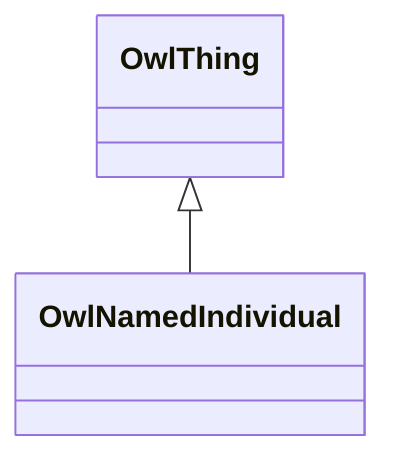

# Class: NamedIndividual (owl_NamedIndividual)


_The class of named individuals._


This class occurs 27 times.


URI: [owl:NamedIndividual](http://www.w3.org/2002/07/owl#NamedIndividual)





## Inheritance
* [OwlThing](../classes/OwlThing.md)
    * **OwlNamedIndividual**


## Slots

| Name | Cardinality and Range | Description | Inheritance | Occurrences |
| ---  | --- | --- | --- | --- |


## Usages

| used by | used in | type | used |
| ---  | --- | --- | --- |
| [IoManufacturer](../classes/IoManufacturer.md) | [sudokn_hasOwnershipStatusClassifier](../slots/sudokn_hasOwnershipStatusClassifier.md) | any_of[range] | [OwlNamedIndividual](../classes/OwlNamedIndividual.md) |
| [IoManufacturer](../classes/IoManufacturer.md) | [sudokn_hasCertificate](../slots/sudokn_hasCertificate.md) | any_of[range] | [OwlNamedIndividual](../classes/OwlNamedIndividual.md) |
| [IoManufacturer](../classes/IoManufacturer.md) | [sudokn_hasManagementCapability](../slots/sudokn_hasManagementCapability.md) | any_of[range] | [OwlNamedIndividual](../classes/OwlNamedIndividual.md) |
| [IoManufacturer](../classes/IoManufacturer.md) | [sudokn_hasMaterialCapability](../slots/sudokn_hasMaterialCapability.md) | any_of[range] | [OwlNamedIndividual](../classes/OwlNamedIndividual.md) |
| [IoManufacturer](../classes/IoManufacturer.md) | [sudokn_hasEmailAddress](../slots/sudokn_hasEmailAddress.md) | any_of[range] | [OwlNamedIndividual](../classes/OwlNamedIndividual.md) |
| [IoManufacturer](../classes/IoManufacturer.md) | [sudokn_hasPostalAddress](../slots/sudokn_hasPostalAddress.md) | any_of[range] | [OwlNamedIndividual](../classes/OwlNamedIndividual.md) |
| [IoManufacturer](../classes/IoManufacturer.md) | [sudokn_suppliesToIndustry](../slots/sudokn_suppliesToIndustry.md) | any_of[range] | [OwlNamedIndividual](../classes/OwlNamedIndividual.md) |
| [IoManufacturer](../classes/IoManufacturer.md) | [sudokn_hasName](../slots/sudokn_hasName.md) | any_of[range] | [OwlNamedIndividual](../classes/OwlNamedIndividual.md) |
| [IoManufacturer](../classes/IoManufacturer.md) | [sudokn_hasNAICSClassifier](../slots/sudokn_hasNAICSClassifier.md) | any_of[range] | [OwlNamedIndividual](../classes/OwlNamedIndividual.md) |
| [IoManufacturer](../classes/IoManufacturer.md) | [sudokn_hasWebAddress](../slots/sudokn_hasWebAddress.md) | any_of[range] | [OwlNamedIndividual](../classes/OwlNamedIndividual.md) |
| [IoManufacturer](../classes/IoManufacturer.md) | [sudokn_hasProcessCapability](../slots/sudokn_hasProcessCapability.md) | any_of[range] | [OwlNamedIndividual](../classes/OwlNamedIndividual.md) |
| [SudoknAS9100Certificate](../classes/SudoknAS9100Certificate.md) | [sudokn_attestsTo](../slots/sudokn_attestsTo.md) | any_of[range] | [OwlNamedIndividual](../classes/OwlNamedIndividual.md) |
| [SudoknGeospatialLocation](../classes/SudoknGeospatialLocation.md) | [sudokn_hasPostalAddress](../slots/sudokn_hasPostalAddress.md) | any_of[range] | [OwlNamedIndividual](../classes/OwlNamedIndividual.md) |
| [SudoknISO9000Certificate](../classes/SudoknISO9000Certificate.md) | [sudokn_attestsTo](../slots/sudokn_attestsTo.md) | any_of[range] | [OwlNamedIndividual](../classes/OwlNamedIndividual.md) |


## LinkML Source

<!-- TODO: investigate https://stackoverflow.com/questions/37606292/how-to-create-tabbed-code-blocks-in-mkdocs-or-sphinx -->

### Direct

<details>

```yaml
name: owl_NamedIndividual
description: The class of named individuals.
title: NamedIndividual
from_schema: okns:owl-rdf-rdfs
source: http://www.w3.org/2002/07/owl#
is_a: owl_Thing
class_uri: owl:NamedIndividual

```
</details>

### Induced

<details>

```yaml
name: owl_NamedIndividual
description: The class of named individuals.
title: NamedIndividual
from_schema: okns:owl-rdf-rdfs
source: http://www.w3.org/2002/07/owl#
is_a: owl_Thing
class_uri: owl:NamedIndividual

```
</details>