# Class: No class (type) name specified (owl_NamedIndividual)


_No class (type) description specified_


This class occurs 29 times.


URI: [owl:NamedIndividual](http://www.w3.org/2002/07/owl#NamedIndividual)

```mermaid
 classDiagram
    class OwlNamedIndividual
    click OwlNamedIndividual href "../OwlNamedIndividual"
      OwlNamedIndividual : rdfs_label
        
          
    
    
    OwlNamedIndividual --> "0..1" String : rdfs_label
    click String href "../String"

        
      OwlNamedIndividual : skos_altLabel
        
          
    
    
    OwlNamedIndividual --> "0..1" String : skos_altLabel
    click String href "../String"

        
      OwlNamedIndividual : sudokn_attestsTo
        
          
    
    
    OwlNamedIndividual --> "0..1" Any : sudokn_attestsTo
    click Any href "../Any"

        
      OwlNamedIndividual : sudokn_hasCertificate
        
          
    
    
    OwlNamedIndividual --> "0..1" Any : sudokn_hasCertificate
    click Any href "../Any"

        
      OwlNamedIndividual : sudokn_hasEmailAddress
        
          
    
    
    OwlNamedIndividual --> "0..1" Any : sudokn_hasEmailAddress
    click Any href "../Any"

        
      OwlNamedIndividual : sudokn_hasManagementCapability
        
          
    
    
    OwlNamedIndividual --> "0..1" Any : sudokn_hasManagementCapability
    click Any href "../Any"

        
      OwlNamedIndividual : sudokn_hasMaterialCapability
        
          
    
    
    OwlNamedIndividual --> "0..1" Any : sudokn_hasMaterialCapability
    click Any href "../Any"

        
      OwlNamedIndividual : sudokn_hasNAICSClassifier
        
          
    
    
    OwlNamedIndividual --> "0..1" Any : sudokn_hasNAICSClassifier
    click Any href "../Any"

        
      OwlNamedIndividual : sudokn_hasName
        
          
    
    
    OwlNamedIndividual --> "0..1" Any : sudokn_hasName
    click Any href "../Any"

        
      OwlNamedIndividual : sudokn_hasOwnershipStatusClassifier
        
          
    
    
    OwlNamedIndividual --> "0..1" Any : sudokn_hasOwnershipStatusClassifier
    click Any href "../Any"

        
      OwlNamedIndividual : sudokn_hasPostalAddress
        
          
    
    
    OwlNamedIndividual --> "0..1" Any : sudokn_hasPostalAddress
    click Any href "../Any"

        
      OwlNamedIndividual : sudokn_hasProcessCapability
        
          
    
    
    OwlNamedIndividual --> "0..1" Any : sudokn_hasProcessCapability
    click Any href "../Any"

        
      OwlNamedIndividual : sudokn_hasWebAddress
        
          
    
    
    OwlNamedIndividual --> "0..1" Any : sudokn_hasWebAddress
    click Any href "../Any"

        
      OwlNamedIndividual : sudokn_suppliesToIndustry
        
          
    
    
    OwlNamedIndividual --> "0..1" Any : sudokn_suppliesToIndustry
    click Any href "../Any"

        
      
```





<!-- no inheritance hierarchy -->


## Slots

| Name | Cardinality and Range | Description | Inheritance | Occurrences |
| ---  | --- | --- | --- | --- |
| [sudokn_hasManagementCapability](../slots/sudokn_hasManagementCapability.md) | 0..1 <br/> [OwlNamedIndividual](../classes/OwlNamedIndividual.md)&nbsp;or&nbsp;<br />[xsd:anyURI](http://www.w3.org/2001/XMLSchema#anyURI)&nbsp;or&nbsp;<br />[SudoknQualityManagementCapability](../classes/SudoknQualityManagementCapability.md) | No slot (predicate) description specified <br/>  | direct | 2 |
| [sudokn_hasName](../slots/sudokn_hasName.md) | 0..1 <br/> [OwlNamedIndividual](../classes/OwlNamedIndividual.md)&nbsp;or&nbsp;<br />[SudoknOrganizationName](../classes/SudoknOrganizationName.md) | No slot (predicate) description specified <br/>  | direct | 2 |
| [sudokn_hasWebAddress](../slots/sudokn_hasWebAddress.md) | 0..1 <br/> [OwlNamedIndividual](../classes/OwlNamedIndividual.md)&nbsp;or&nbsp;<br />[SudoknWebAddress](../classes/SudoknWebAddress.md)&nbsp;or&nbsp;<br />[xsd:anyURI](http://www.w3.org/2001/XMLSchema#anyURI) | No slot (predicate) description specified <br/>  | direct | 2 |
| [sudokn_hasEmailAddress](../slots/sudokn_hasEmailAddress.md) | 0..1 <br/> [OwlNamedIndividual](../classes/OwlNamedIndividual.md)&nbsp;or&nbsp;<br />[xsd:anyURI](http://www.w3.org/2001/XMLSchema#anyURI)&nbsp;or&nbsp;<br />[SudoknEmailAddress](../classes/SudoknEmailAddress.md) | No slot (predicate) description specified <br/>  | direct | 2 |
| [sudokn_hasProcessCapability](../slots/sudokn_hasProcessCapability.md) | 0..1 <br/> [SudoknCenterlessGrindingCapability](../classes/SudoknCenterlessGrindingCapability.md)&nbsp;or&nbsp;<br />[SudoknElectronBeamWeldingCapability](../classes/SudoknElectronBeamWeldingCapability.md)&nbsp;or&nbsp;<br />[SudoknLiveToolingCapability](../classes/SudoknLiveToolingCapability.md)&nbsp;or&nbsp;<br />[SudoknInductionHeatingCapability](../classes/SudoknInductionHeatingCapability.md)&nbsp;or&nbsp;<br />[SudoknRoboticWeldingCapability](../classes/SudoknRoboticWeldingCapability.md)&nbsp;or&nbsp;<br />[SudoknDeepFreezingCapability](../classes/SudoknDeepFreezingCapability.md)&nbsp;or&nbsp;<br />[SudoknLaserCuttingCapability](../classes/SudoknLaserCuttingCapability.md)&nbsp;or&nbsp;<br />[SudoknRamEDMCapability](../classes/SudoknRamEDMCapability.md)&nbsp;or&nbsp;<br />[SudoknCNCCuttingCapability](../classes/SudoknCNCCuttingCapability.md)&nbsp;or&nbsp;<br />[SudoknCNCTurningCapability](../classes/SudoknCNCTurningCapability.md)&nbsp;or&nbsp;<br />[SudoknAssemblyCapibility](../classes/SudoknAssemblyCapibility.md)&nbsp;or&nbsp;<br />[SudoknPLCProgrammingCapability](../classes/SudoknPLCProgrammingCapability.md)&nbsp;or&nbsp;<br />[SudoknElectolessNickelPlatingCapability](../classes/SudoknElectolessNickelPlatingCapability.md)&nbsp;or&nbsp;<br />[SudoknHoningCapability](../classes/SudoknHoningCapability.md)&nbsp;or&nbsp;<br />[SudoknPlasticMachiningCapability](../classes/SudoknPlasticMachiningCapability.md)&nbsp;or&nbsp;<br />[SudoknEDMCapability](../classes/SudoknEDMCapability.md)&nbsp;or&nbsp;<br />[SudoknCNCmillingCapability](../classes/SudoknCNCmillingCapability.md)&nbsp;or&nbsp;<br />[SudoknLatheWorkCapability](../classes/SudoknLatheWorkCapability.md)&nbsp;or&nbsp;<br />[SudoknPulsedElectrochemicalMachiningCapability](../classes/SudoknPulsedElectrochemicalMachiningCapability.md)&nbsp;or&nbsp;<br />[SudoknCNCVerticalMillingCapability](../classes/SudoknCNCVerticalMillingCapability.md)&nbsp;or&nbsp;<br />[SudoknTubingCapability](../classes/SudoknTubingCapability.md)&nbsp;or&nbsp;<br />[SudoknSwissMachiningCapability](../classes/SudoknSwissMachiningCapability.md)&nbsp;or&nbsp;<br />[SudoknNickelPlatingCapability](../classes/SudoknNickelPlatingCapability.md)&nbsp;or&nbsp;<br />[SudoknVacuumFormingCapability](../classes/SudoknVacuumFormingCapability.md)&nbsp;or&nbsp;<br />[SudoknPlasmaSprayingCapability](../classes/SudoknPlasmaSprayingCapability.md)&nbsp;or&nbsp;<br />[SudoknRivettingCapability](../classes/SudoknRivettingCapability.md)&nbsp;or&nbsp;<br />[SudoknSanitaryWeldingCapability](../classes/SudoknSanitaryWeldingCapability.md)&nbsp;or&nbsp;<br />[SudoknZincArcSprayCapability](../classes/SudoknZincArcSprayCapability.md)&nbsp;or&nbsp;<br />[SudoknMoldingCapability](../classes/SudoknMoldingCapability.md)&nbsp;or&nbsp;<br />[SudoknCNCMillingCapability](../classes/SudoknCNCMillingCapability.md)&nbsp;or&nbsp;<br />[SudoknWaterjetCuttimgCapability](../classes/SudoknWaterjetCuttimgCapability.md)&nbsp;or&nbsp;<br />[SudoknSheetMetalFormingCapability](../classes/SudoknSheetMetalFormingCapability.md)&nbsp;or&nbsp;<br />[SudoknMachineBuildingCapability](../classes/SudoknMachineBuildingCapability.md)&nbsp;or&nbsp;<br />[SudoknEndFormingCapability](../classes/SudoknEndFormingCapability.md)&nbsp;or&nbsp;<br />[SudoknSandBlastingCapability](../classes/SudoknSandBlastingCapability.md)&nbsp;or&nbsp;<br />[SudoknSmeltingCapability](../classes/SudoknSmeltingCapability.md)&nbsp;or&nbsp;<br />[SudoknGrindingCapability](../classes/SudoknGrindingCapability.md)&nbsp;or&nbsp;<br />[SudoknDieCastingCapability](../classes/SudoknDieCastingCapability.md)&nbsp;or&nbsp;<br />[SudoknMediaBlastingCapability](../classes/SudoknMediaBlastingCapability.md)&nbsp;or&nbsp;<br />[SudoknWaterjetCuttingCapability](../classes/SudoknWaterjetCuttingCapability.md)&nbsp;or&nbsp;<br />[SudoknCylindricalGrindingCapability](../classes/SudoknCylindricalGrindingCapability.md)&nbsp;or&nbsp;<br />[SudoknWireFormingCapability](../classes/SudoknWireFormingCapability.md)&nbsp;or&nbsp;<br />[SudoknFixtureDesignCapability](../classes/SudoknFixtureDesignCapability.md)&nbsp;or&nbsp;<br />[SudoknElectricalDischargeMachiningCapability](../classes/SudoknElectricalDischargeMachiningCapability.md)&nbsp;or&nbsp;<br />[SudoknCustomFoamCuttingCapability](../classes/SudoknCustomFoamCuttingCapability.md)&nbsp;or&nbsp;<br />[SudoknWireEDMCapability](../classes/SudoknWireEDMCapability.md)&nbsp;or&nbsp;<br />[SudoknFixturingCapability](../classes/SudoknFixturingCapability.md)&nbsp;or&nbsp;<br />[SudoknHardeningCapability](../classes/SudoknHardeningCapability.md)&nbsp;or&nbsp;<br />[Sudokn3DPrintingCapability](../classes/Sudokn3DPrintingCapability.md)&nbsp;or&nbsp;<br />[SudoknPackagingCapability](../classes/SudoknPackagingCapability.md)&nbsp;or&nbsp;<br />[SudoknReverseEngineeringCapability](../classes/SudoknReverseEngineeringCapability.md)&nbsp;or&nbsp;<br />[SudoknKnittingCapability](../classes/SudoknKnittingCapability.md)&nbsp;or&nbsp;<br />[SudoknWaterJetCuttingCapability](../classes/SudoknWaterJetCuttingCapability.md)&nbsp;or&nbsp;<br />[SudoknRollingCapability](../classes/SudoknRollingCapability.md)&nbsp;or&nbsp;<br />[SudoknExtrusionCapability](../classes/SudoknExtrusionCapability.md)&nbsp;or&nbsp;<br />[SudoknAssemblyCapability](../classes/SudoknAssemblyCapability.md)&nbsp;or&nbsp;<br />[SudoknMechanicalJoiningCapability](../classes/SudoknMechanicalJoiningCapability.md)&nbsp;or&nbsp;<br />[SudoknNotchingCapability](../classes/SudoknNotchingCapability.md)&nbsp;or&nbsp;<br />[SudoknBroachingCapability](../classes/SudoknBroachingCapability.md)&nbsp;or&nbsp;<br />[SudoknFormingCapability](../classes/SudoknFormingCapability.md)&nbsp;or&nbsp;<br />[SudoknNitridingCapability](../classes/SudoknNitridingCapability.md)&nbsp;or&nbsp;<br />[SudoknGalvanizingCapability](../classes/SudoknGalvanizingCapability.md)&nbsp;or&nbsp;<br />[SudoknMetalStampingCapability](../classes/SudoknMetalStampingCapability.md)&nbsp;or&nbsp;<br />[SudoknCarburizingCapability](../classes/SudoknCarburizingCapability.md)&nbsp;or&nbsp;<br />[SudoknFabricatingCapability](../classes/SudoknFabricatingCapability.md)&nbsp;or&nbsp;<br />[SudoknMetalFabricationCapability](../classes/SudoknMetalFabricationCapability.md)&nbsp;or&nbsp;<br />[SudoknCNCLaserCuttingCapability](../classes/SudoknCNCLaserCuttingCapability.md)&nbsp;or&nbsp;<br />[SudoknMIGWeldingCapability](../classes/SudoknMIGWeldingCapability.md)&nbsp;or&nbsp;<br />[SudoknPemInsertionCapability](../classes/SudoknPemInsertionCapability.md)&nbsp;or&nbsp;<br />[SudoknElectropolishingCapability](../classes/SudoknElectropolishingCapability.md)&nbsp;or&nbsp;<br />[SudoknAnnealingCapability](../classes/SudoknAnnealingCapability.md)&nbsp;or&nbsp;<br />[SudoknLaserProcessingCapability](../classes/SudoknLaserProcessingCapability.md)&nbsp;or&nbsp;<br />[SudoknEtchingCapability](../classes/SudoknEtchingCapability.md)&nbsp;or&nbsp;<br />[SudoknPaintingCapability](../classes/SudoknPaintingCapability.md)&nbsp;or&nbsp;<br />[SudoknVacuumPackagingCapability](../classes/SudoknVacuumPackagingCapability.md)&nbsp;or&nbsp;<br />[SudoknMillingCapability](../classes/SudoknMillingCapability.md)&nbsp;or&nbsp;<br />[SudoknScreenPrintingCapability](../classes/SudoknScreenPrintingCapability.md)&nbsp;or&nbsp;<br />[SudoknContinuousCastingCapability](../classes/SudoknContinuousCastingCapability.md)&nbsp;or&nbsp;<br />[SudoknVacuumCastingCapability](../classes/SudoknVacuumCastingCapability.md)&nbsp;or&nbsp;<br />[SudoknThermoformingCapability](../classes/SudoknThermoformingCapability.md)&nbsp;or&nbsp;<br />[SudoknCNCLatheCapability](../classes/SudoknCNCLatheCapability.md)&nbsp;or&nbsp;<br />[SudoknCoatingCapability](../classes/SudoknCoatingCapability.md)&nbsp;or&nbsp;<br />[SudoknWoodworkingCapability](../classes/SudoknWoodworkingCapability.md)&nbsp;or&nbsp;<br />[SudoknCADCapability](../classes/SudoknCADCapability.md)&nbsp;or&nbsp;<br />[SudoknChemicalProcessingCapability](../classes/SudoknChemicalProcessingCapability.md)&nbsp;or&nbsp;<br />[SudoknSurfaceFinishingCapability](../classes/SudoknSurfaceFinishingCapability.md)&nbsp;or&nbsp;<br />[SudoknMetalworkingCapability](../classes/SudoknMetalworkingCapability.md)&nbsp;or&nbsp;<br />[SudoknSurfacePreparationCapability](../classes/SudoknSurfacePreparationCapability.md)&nbsp;or&nbsp;<br />[SudoknPunchingCapability](../classes/SudoknPunchingCapability.md)&nbsp;or&nbsp;<br />[SudoknCNCPressBrakeCapability](../classes/SudoknCNCPressBrakeCapability.md)&nbsp;or&nbsp;<br />[SudoknTappingCapability](../classes/SudoknTappingCapability.md)&nbsp;or&nbsp;<br />[SudoknWiringCapability](../classes/SudoknWiringCapability.md)&nbsp;or&nbsp;<br />[SudoknPackingCapability](../classes/SudoknPackingCapability.md)&nbsp;or&nbsp;<br />[SudoknCreepFeedGrindingCapability](../classes/SudoknCreepFeedGrindingCapability.md)&nbsp;or&nbsp;<br />[SudoknToolMakingCapability](../classes/SudoknToolMakingCapability.md)&nbsp;or&nbsp;<br />[SudoknCNCMachiningCapability](../classes/SudoknCNCMachiningCapability.md)&nbsp;or&nbsp;<br />[SudoknMachiningCapability](../classes/SudoknMachiningCapability.md)&nbsp;or&nbsp;<br />[Sudokn2-AxisCNCTurningCapability](../classes/Sudokn2-AxisCNCTurningCapability.md)&nbsp;or&nbsp;<br />[SudoknPhosphateCoatingCapability](../classes/SudoknPhosphateCoatingCapability.md)&nbsp;or&nbsp;<br />[SudoknAddtiveManufacturingCapability](../classes/SudoknAddtiveManufacturingCapability.md)&nbsp;or&nbsp;<br />[SudoknExtrudingCapability](../classes/SudoknExtrudingCapability.md)&nbsp;or&nbsp;<br />[SudoknCNCCylindricalGrindingCapability](../classes/SudoknCNCCylindricalGrindingCapability.md)&nbsp;or&nbsp;<br />[SudoknPlatingCapability](../classes/SudoknPlatingCapability.md)&nbsp;or&nbsp;<br />[SudoknResistanceWeldingCapability](../classes/SudoknResistanceWeldingCapability.md)&nbsp;or&nbsp;<br />[SudoknTurningCapability](../classes/SudoknTurningCapability.md)&nbsp;or&nbsp;<br />[SudoknKittingCapability](../classes/SudoknKittingCapability.md)&nbsp;or&nbsp;<br />[SudoknTubeFormingCapability](../classes/SudoknTubeFormingCapability.md)&nbsp;or&nbsp;<br />[SudoknStampingCapability](../classes/SudoknStampingCapability.md)&nbsp;or&nbsp;<br />[SudoknWetPaintingCapability](../classes/SudoknWetPaintingCapability.md)&nbsp;or&nbsp;<br />[SudoknFinishingCapability](../classes/SudoknFinishingCapability.md)&nbsp;or&nbsp;<br />[SudoknInvestmentCastingCapability](../classes/SudoknInvestmentCastingCapability.md)&nbsp;or&nbsp;<br />[SudoknPolishingCapability](../classes/SudoknPolishingCapability.md)&nbsp;or&nbsp;<br />[SudoknVacuumHardeningCapability](../classes/SudoknVacuumHardeningCapability.md)&nbsp;or&nbsp;<br />[SudoknRAMEdmCapability](../classes/SudoknRAMEdmCapability.md)&nbsp;or&nbsp;<br />[SudoknSteelManufacturingCapability](../classes/SudoknSteelManufacturingCapability.md)&nbsp;or&nbsp;<br />[SudoknEmbossingCapability](../classes/SudoknEmbossingCapability.md)&nbsp;or&nbsp;<br />[SudoknDrawingCapability](../classes/SudoknDrawingCapability.md)&nbsp;or&nbsp;<br />[SudoknPassivationCapability](../classes/SudoknPassivationCapability.md)&nbsp;or&nbsp;<br />[SudoknCNCGrindingCapability](../classes/SudoknCNCGrindingCapability.md)&nbsp;or&nbsp;<br />[SudoknLaserWeldingCapability](../classes/SudoknLaserWeldingCapability.md)&nbsp;or&nbsp;<br />[SudoknCerakoteCoatingCapability](../classes/SudoknCerakoteCoatingCapability.md)&nbsp;or&nbsp;<br />[SudoknPrintingCapability](../classes/SudoknPrintingCapability.md)&nbsp;or&nbsp;<br />[SudoknBendingCapability](../classes/SudoknBendingCapability.md)&nbsp;or&nbsp;<br />[SudoknHarperizingCapability](../classes/SudoknHarperizingCapability.md)&nbsp;or&nbsp;<br />[SudoknForgingCapability](../classes/SudoknForgingCapability.md)&nbsp;or&nbsp;<br />[SudoknRivetingCapability](../classes/SudoknRivetingCapability.md)&nbsp;or&nbsp;<br />[SudoknRapidPrototypingCapability](../classes/SudoknRapidPrototypingCapability.md)&nbsp;or&nbsp;<br />[SudoknProductDesignCapability](../classes/SudoknProductDesignCapability.md)&nbsp;or&nbsp;<br />[SudoknPipingFabricationCapability](../classes/SudoknPipingFabricationCapability.md)&nbsp;or&nbsp;<br />[SudoknSwissTurningCapability](../classes/SudoknSwissTurningCapability.md)&nbsp;or&nbsp;<br />[SudoknBrassBlackeningCapability](../classes/SudoknBrassBlackeningCapability.md)&nbsp;or&nbsp;<br />[SudoknHeatTreatingCapability](../classes/SudoknHeatTreatingCapability.md)&nbsp;or&nbsp;<br />[SudoknChemicalCoatingCapability](../classes/SudoknChemicalCoatingCapability.md)&nbsp;or&nbsp;<br />[SudoknWireBendingCapability](../classes/SudoknWireBendingCapability.md)&nbsp;or&nbsp;<br />[SudoknSinteringCapability](../classes/SudoknSinteringCapability.md)&nbsp;or&nbsp;<br />[SudoknPressingCapability](../classes/SudoknPressingCapability.md)&nbsp;or&nbsp;<br />[SudoknBrazingCapability](../classes/SudoknBrazingCapability.md)&nbsp;or&nbsp;<br />[SudoknSolderingCapability](../classes/SudoknSolderingCapability.md)&nbsp;or&nbsp;<br />[SudoknFlameSprayingCapability](../classes/SudoknFlameSprayingCapability.md)&nbsp;or&nbsp;<br />[SudoknPressBrakingCapability](../classes/SudoknPressBrakingCapability.md)&nbsp;or&nbsp;<br />[SudoknWeldingCapability](../classes/SudoknWeldingCapability.md)&nbsp;or&nbsp;<br />[SudoknFasteningCapability](../classes/SudoknFasteningCapability.md)&nbsp;or&nbsp;<br />[SudoknCentrifugalCastingCapability](../classes/SudoknCentrifugalCastingCapability.md)&nbsp;or&nbsp;<br />[SudoknCuttingCapability](../classes/SudoknCuttingCapability.md)&nbsp;or&nbsp;<br />[SudoknSilkScreeningCapability](../classes/SudoknSilkScreeningCapability.md)&nbsp;or&nbsp;<br />[SudoknCNCWireBendingCapability](../classes/SudoknCNCWireBendingCapability.md)&nbsp;or&nbsp;<br />[SudoknMigWeldingCapability](../classes/SudoknMigWeldingCapability.md)&nbsp;or&nbsp;<br />[SudoknShearingCapability](../classes/SudoknShearingCapability.md)&nbsp;or&nbsp;<br />[SudoknSewingCapability](../classes/SudoknSewingCapability.md)&nbsp;or&nbsp;<br />[SudoknEngineeringDesignCapability](../classes/SudoknEngineeringDesignCapability.md)&nbsp;or&nbsp;<br />[SudoknVerticalMillingCapability](../classes/SudoknVerticalMillingCapability.md)&nbsp;or&nbsp;<br />[SudoknWireHarnessAssemblyCapability](../classes/SudoknWireHarnessAssemblyCapability.md)&nbsp;or&nbsp;<br />[SudoknMetalSpinningCapability](../classes/SudoknMetalSpinningCapability.md)&nbsp;or&nbsp;<br />[OwlNamedIndividual](../classes/OwlNamedIndividual.md)&nbsp;or&nbsp;<br />[SudoknCeramicMoldCastingCapability](../classes/SudoknCeramicMoldCastingCapability.md)&nbsp;or&nbsp;<br />[SudoknAdditiveManufacturingCapability](../classes/SudoknAdditiveManufacturingCapability.md)&nbsp;or&nbsp;<br />[SudoknSandCastingCapability](../classes/SudoknSandCastingCapability.md)&nbsp;or&nbsp;<br />[SudoknWoodWorkingCapability](../classes/SudoknWoodWorkingCapability.md)&nbsp;or&nbsp;<br />[SudoknInstallationCapability](../classes/SudoknInstallationCapability.md)&nbsp;or&nbsp;<br />[SudoknSpotWeldingCapability](../classes/SudoknSpotWeldingCapability.md)&nbsp;or&nbsp;<br />[SudoknChromateConversionCoatingCapability](../classes/SudoknChromateConversionCoatingCapability.md)&nbsp;or&nbsp;<br />[SudoknMoldMakingCapability](../classes/SudoknMoldMakingCapability.md)&nbsp;or&nbsp;<br />[SudoknPhysicalVaporDepositionCapability](../classes/SudoknPhysicalVaporDepositionCapability.md)&nbsp;or&nbsp;<br />[SudoknElectrolessNickelPlatingCapability](../classes/SudoknElectrolessNickelPlatingCapability.md)&nbsp;or&nbsp;<br />[SudoknElectrolessPlatingCapability](../classes/SudoknElectrolessPlatingCapability.md)&nbsp;or&nbsp;<br />[SudoknHorizontalMillingCapability](../classes/SudoknHorizontalMillingCapability.md)&nbsp;or&nbsp;<br />[SudoknMechanicalAssemblyCapability](../classes/SudoknMechanicalAssemblyCapability.md)&nbsp;or&nbsp;<br />[SudoknDieMakingCapability](../classes/SudoknDieMakingCapability.md)&nbsp;or&nbsp;<br />[SudoknPrototypeManufacturingCapability](../classes/SudoknPrototypeManufacturingCapability.md)&nbsp;or&nbsp;<br />[SudoknPlasmaCuttingCapability](../classes/SudoknPlasmaCuttingCapability.md)&nbsp;or&nbsp;<br />[SudoknCarbonitridingCapability](../classes/SudoknCarbonitridingCapability.md)&nbsp;or&nbsp;<br />[SudoknOxy-FuelCuttingCapability](../classes/SudoknOxy-FuelCuttingCapability.md)&nbsp;or&nbsp;<br />[SudoknDigitalPrintingCapability](../classes/SudoknDigitalPrintingCapability.md)&nbsp;or&nbsp;<br />[SudoknDrillingCapability](../classes/SudoknDrillingCapability.md)&nbsp;or&nbsp;<br />[SudoknCNCPlasmaCuttingCapability](../classes/SudoknCNCPlasmaCuttingCapability.md)&nbsp;or&nbsp;<br />[SudoknDeepHoleDrillingCapability](../classes/SudoknDeepHoleDrillingCapability.md)&nbsp;or&nbsp;<br />[SudoknHotDipGalvanizingCapability](../classes/SudoknHotDipGalvanizingCapability.md)&nbsp;or&nbsp;<br />[SudoknAbrasiveCleaningCapability](../classes/SudoknAbrasiveCleaningCapability.md)&nbsp;or&nbsp;<br />[SudoknDeburringCapability](../classes/SudoknDeburringCapability.md)&nbsp;or&nbsp;<br />[SudoknSpinningCapability](../classes/SudoknSpinningCapability.md)&nbsp;or&nbsp;<br />[SudoknLiquidCoatingCapability](../classes/SudoknLiquidCoatingCapability.md)&nbsp;or&nbsp;<br />[SudoknAnodizingCapability](../classes/SudoknAnodizingCapability.md)&nbsp;or&nbsp;<br />[SudoknAcrylicFabricationCapability](../classes/SudoknAcrylicFabricationCapability.md)&nbsp;or&nbsp;<br />[SudoknPolycrystallineDiamondMachiningCapability](../classes/SudoknPolycrystallineDiamondMachiningCapability.md)&nbsp;or&nbsp;<br />[SudoknPlaningCapability](../classes/SudoknPlaningCapability.md)&nbsp;or&nbsp;<br />[SudoknVaporizedMetalCoatingCapability](../classes/SudoknVaporizedMetalCoatingCapability.md)&nbsp;or&nbsp;<br />[SudoknBlackOxideCoatingCapability](../classes/SudoknBlackOxideCoatingCapability.md)&nbsp;or&nbsp;<br />[SudoknReamingCapability](../classes/SudoknReamingCapability.md)&nbsp;or&nbsp;<br />[SudoknMIGWeldinCapability](../classes/SudoknMIGWeldinCapability.md)&nbsp;or&nbsp;<br />[SudoknSurfaceGrindingCapability](../classes/SudoknSurfaceGrindingCapability.md)&nbsp;or&nbsp;<br />[SudoknBoringCapability](../classes/SudoknBoringCapability.md)&nbsp;or&nbsp;<br />[SudoknCastingCapability](../classes/SudoknCastingCapability.md)&nbsp;or&nbsp;<br />[SudoknSheetMetalProcessingCapability](../classes/SudoknSheetMetalProcessingCapability.md)&nbsp;or&nbsp;<br />[SudoknShrinkFittingCapability](../classes/SudoknShrinkFittingCapability.md)&nbsp;or&nbsp;<br />[SudoknTIGWeldingCapability](../classes/SudoknTIGWeldingCapability.md)&nbsp;or&nbsp;<br />[SudoknSinkerEdmCapability](../classes/SudoknSinkerEdmCapability.md)&nbsp;or&nbsp;<br />[SudoknShapingCapability](../classes/SudoknShapingCapability.md)&nbsp;or&nbsp;<br />[SudoknKnurlingCapability](../classes/SudoknKnurlingCapability.md)&nbsp;or&nbsp;<br />[SudoknElectroplatingCapability](../classes/SudoknElectroplatingCapability.md)&nbsp;or&nbsp;<br />[SudoknElectroPlatingCapability](../classes/SudoknElectroPlatingCapability.md)&nbsp;or&nbsp;<br />[SudoknPowderCoatingCapability](../classes/SudoknPowderCoatingCapability.md)&nbsp;or&nbsp;<br />[SudoknSheetMetalFabricationCapability](../classes/SudoknSheetMetalFabricationCapability.md)&nbsp;or&nbsp;<br />[SudoknFillingCapability](../classes/SudoknFillingCapability.md)&nbsp;or&nbsp;<br />[SudoknTurretPunchingCapability](../classes/SudoknTurretPunchingCapability.md)&nbsp;or&nbsp;<br />[SudoknOilGroovingCapability](../classes/SudoknOilGroovingCapability.md)&nbsp;or&nbsp;<br />[SudoknTubeBendingCapability](../classes/SudoknTubeBendingCapability.md)&nbsp;or&nbsp;<br />[SudoknCNCFormingCapability](../classes/SudoknCNCFormingCapability.md)&nbsp;or&nbsp;<br />[SudoknPlasterMoldCastingCapability](../classes/SudoknPlasterMoldCastingCapability.md)&nbsp;or&nbsp;<br />[SudoknGearCuttingCapability](../classes/SudoknGearCuttingCapability.md)&nbsp;or&nbsp;<br />[SudoknCNCBendingCapability](../classes/SudoknCNCBendingCapability.md)&nbsp;or&nbsp;<br />[SudoknPermanentMoldCastingCapability](../classes/SudoknPermanentMoldCastingCapability.md)&nbsp;or&nbsp;<br />[SudoknLaserEtchingCapability](../classes/SudoknLaserEtchingCapability.md)&nbsp;or&nbsp;<br />[SudoknChemicalCleaningCapability](../classes/SudoknChemicalCleaningCapability.md)&nbsp;or&nbsp;<br />[SudoknPrototypingCapability](../classes/SudoknPrototypingCapability.md)&nbsp;or&nbsp;<br />[xsd:anyURI](http://www.w3.org/2001/XMLSchema#anyURI)&nbsp;or&nbsp;<br />[SudoknSinkerEDMCapability](../classes/SudoknSinkerEDMCapability.md)&nbsp;or&nbsp;<br />[SudoknShellMoldCastingCapability](../classes/SudoknShellMoldCastingCapability.md)&nbsp;or&nbsp;<br />[SudoknFabricationCapability](../classes/SudoknFabricationCapability.md)&nbsp;or&nbsp;<br />[SudoknFiberOpticLaserCuttingCapability](../classes/SudoknFiberOpticLaserCuttingCapability.md)&nbsp;or&nbsp;<br />[SudoknCNCHorizontalTurningCapability](../classes/SudoknCNCHorizontalTurningCapability.md)&nbsp;or&nbsp;<br />[SudoknJoiningCapability](../classes/SudoknJoiningCapability.md) | No slot (predicate) description specified <br/>  | direct | 6 |
| [sudokn_attestsTo](../slots/sudokn_attestsTo.md) | 0..1 <br/> [OwlNamedIndividual](../classes/OwlNamedIndividual.md)&nbsp;or&nbsp;<br />[xsd:anyURI](http://www.w3.org/2001/XMLSchema#anyURI)&nbsp;or&nbsp;<br />[SudoknQualityManagementCapability](../classes/SudoknQualityManagementCapability.md) | No slot (predicate) description specified <br/>  | direct | 4 |
| [sudokn_hasPostalAddress](../slots/sudokn_hasPostalAddress.md) | 0..1 <br/> [OwlNamedIndividual](../classes/OwlNamedIndividual.md)&nbsp;or&nbsp;<br />[SudoknPostalAddress](../classes/SudoknPostalAddress.md)&nbsp;or&nbsp;<br />[SudoknUnitedStatesPostalCode](../classes/SudoknUnitedStatesPostalCode.md)&nbsp;or&nbsp;<br />[xsd:anyURI](http://www.w3.org/2001/XMLSchema#anyURI) | No slot (predicate) description specified <br/>  | direct | 2 |
| [sudokn_hasMaterialCapability](../slots/sudokn_hasMaterialCapability.md) | 0..1 <br/> [SudoknMetalProcessingCapability](../classes/SudoknMetalProcessingCapability.md)&nbsp;or&nbsp;<br />[SudoknTeflonProcessingCapability](../classes/SudoknTeflonProcessingCapability.md)&nbsp;or&nbsp;<br />[SudoknZirconProcessingCapability](../classes/SudoknZirconProcessingCapability.md)&nbsp;or&nbsp;<br />[SudoknTinProcessingCapability](../classes/SudoknTinProcessingCapability.md)&nbsp;or&nbsp;<br />[SudoknColdRolledSteelProcessingCapability](../classes/SudoknColdRolledSteelProcessingCapability.md)&nbsp;or&nbsp;<br />[SudoknCopperProcessingCapability](../classes/SudoknCopperProcessingCapability.md)&nbsp;or&nbsp;<br />[SudoknTungstenProcessingCapability](../classes/SudoknTungstenProcessingCapability.md)&nbsp;or&nbsp;<br />[SudoknKovarProcessingCapability](../classes/SudoknKovarProcessingCapability.md)&nbsp;or&nbsp;<br />[SudoknPhosBronzeProcessingCapability](../classes/SudoknPhosBronzeProcessingCapability.md)&nbsp;or&nbsp;<br />[SudoknGraphiteProcessingCapability](../classes/SudoknGraphiteProcessingCapability.md)&nbsp;or&nbsp;<br />[SudoknPlasticProcessingCapability](../classes/SudoknPlasticProcessingCapability.md)&nbsp;or&nbsp;<br />[SudoknAlloySteelProcessingCapability](../classes/SudoknAlloySteelProcessingCapability.md)&nbsp;or&nbsp;<br />[SudoknSiliconeProcessingCapability](../classes/SudoknSiliconeProcessingCapability.md)&nbsp;or&nbsp;<br />[SudoknAcetalProcessingCapability](../classes/SudoknAcetalProcessingCapability.md)&nbsp;or&nbsp;<br />[SudoknMolybdenumProcessingCapability](../classes/SudoknMolybdenumProcessingCapability.md)&nbsp;or&nbsp;<br />[SudoknInvarProcessingCapability](../classes/SudoknInvarProcessingCapability.md)&nbsp;or&nbsp;<br />[SudoknWoodProcessingCapability](../classes/SudoknWoodProcessingCapability.md)&nbsp;or&nbsp;<br />[SudoknPlatinumProcessingCapability](../classes/SudoknPlatinumProcessingCapability.md)&nbsp;or&nbsp;<br />[SudoknPreciousMaterialProcessingCapability](../classes/SudoknPreciousMaterialProcessingCapability.md)&nbsp;or&nbsp;<br />[SudoknDifficultToMachineMaterialsProcessingCapability](../classes/SudoknDifficultToMachineMaterialsProcessingCapability.md)&nbsp;or&nbsp;<br />[SudoknPolycarbonateProcessingCapability](../classes/SudoknPolycarbonateProcessingCapability.md)&nbsp;or&nbsp;<br />[SudoknZincProcessingCapability](../classes/SudoknZincProcessingCapability.md)&nbsp;or&nbsp;<br />[SudoknPhosphorBronzeProcessingCapability](../classes/SudoknPhosphorBronzeProcessingCapability.md)&nbsp;or&nbsp;<br />[SudoknBronzeProcessingCapability](../classes/SudoknBronzeProcessingCapability.md)&nbsp;or&nbsp;<br />[SudoknSteelProcessingCapability](../classes/SudoknSteelProcessingCapability.md)&nbsp;or&nbsp;<br />[SudoknUrethaneProcessingCapability](../classes/SudoknUrethaneProcessingCapability.md)&nbsp;or&nbsp;<br />[SudoknInconelProcessingCapability](../classes/SudoknInconelProcessingCapability.md)&nbsp;or&nbsp;<br />[SudoknStainlessSteelProcessingCapability](../classes/SudoknStainlessSteelProcessingCapability.md)&nbsp;or&nbsp;<br />[SudoknRubberProcessingCapability](../classes/SudoknRubberProcessingCapability.md)&nbsp;or&nbsp;<br />[SudoknHastelloyProcessingCapability](../classes/SudoknHastelloyProcessingCapability.md)&nbsp;or&nbsp;<br />[SudoknExoticMaterialProcessingCapability](../classes/SudoknExoticMaterialProcessingCapability.md)&nbsp;or&nbsp;<br />[SudoknZincAlloyProcessingCapability](../classes/SudoknZincAlloyProcessingCapability.md)&nbsp;or&nbsp;<br />[SudoknWaspaloyProcessingCapability](../classes/SudoknWaspaloyProcessingCapability.md)&nbsp;or&nbsp;<br />[SudoknExtremelyHardMaterialProcessingCapability](../classes/SudoknExtremelyHardMaterialProcessingCapability.md)&nbsp;or&nbsp;<br />[SudoknBrassProcessingCapability](../classes/SudoknBrassProcessingCapability.md)&nbsp;or&nbsp;<br />[SudoknGoldProcessingCapability](../classes/SudoknGoldProcessingCapability.md)&nbsp;or&nbsp;<br />[SudoknChromiumProcessingCapability](../classes/SudoknChromiumProcessingCapability.md)&nbsp;or&nbsp;<br />[SudoknIronProcessingCapability](../classes/SudoknIronProcessingCapability.md)&nbsp;or&nbsp;<br />[SudoknKaptonProcessingCapability](../classes/SudoknKaptonProcessingCapability.md)&nbsp;or&nbsp;<br />[SudoknNomexProcessingCapability](../classes/SudoknNomexProcessingCapability.md)&nbsp;or&nbsp;<br />[SudoknGlassProcessingCapability](../classes/SudoknGlassProcessingCapability.md)&nbsp;or&nbsp;<br />[SudoknFoamProcessingCapability](../classes/SudoknFoamProcessingCapability.md)&nbsp;or&nbsp;<br />[SudoknManMadeFiberProcessingCapability](../classes/SudoknManMadeFiberProcessingCapability.md)&nbsp;or&nbsp;<br />[SudoknHighGradeAluminumProcessingCapability](../classes/SudoknHighGradeAluminumProcessingCapability.md)&nbsp;or&nbsp;<br />[SudoknLeadProcessingCapability](../classes/SudoknLeadProcessingCapability.md)&nbsp;or&nbsp;<br />[SudoknAluminumProcessingCapability](../classes/SudoknAluminumProcessingCapability.md)&nbsp;or&nbsp;<br />[SudoknPalladiumProcessingCapability](../classes/SudoknPalladiumProcessingCapability.md)&nbsp;or&nbsp;<br />[SudoknCompositeProcessingCapability](../classes/SudoknCompositeProcessingCapability.md)&nbsp;or&nbsp;<br />[SudoknCeramicProcessingCapability](../classes/SudoknCeramicProcessingCapability.md)&nbsp;or&nbsp;<br />[SudoknNylonProcessingCapability](../classes/SudoknNylonProcessingCapability.md)&nbsp;or&nbsp;<br />[SudoknCarbideProcessingCapability](../classes/SudoknCarbideProcessingCapability.md)&nbsp;or&nbsp;<br />[SudoknChemicalsProcessingCapability](../classes/SudoknChemicalsProcessingCapability.md)&nbsp;or&nbsp;<br />[SudoknNaturalFiberProcessingCapability](../classes/SudoknNaturalFiberProcessingCapability.md)&nbsp;or&nbsp;<br />[SudoknTantalumProcessingCapability](../classes/SudoknTantalumProcessingCapability.md)&nbsp;or&nbsp;<br />[SudoknMagnesiumProcessingCapability](../classes/SudoknMagnesiumProcessingCapability.md)&nbsp;or&nbsp;<br />[SudoknSilverProcessingCapability](../classes/SudoknSilverProcessingCapability.md)&nbsp;or&nbsp;<br />[OwlNamedIndividual](../classes/OwlNamedIndividual.md)&nbsp;or&nbsp;<br />[SudoknLexanProcessingCapability](../classes/SudoknLexanProcessingCapability.md)&nbsp;or&nbsp;<br />[xsd:anyURI](http://www.w3.org/2001/XMLSchema#anyURI)&nbsp;or&nbsp;<br />[SudoknTitaniumProcessingCapability](../classes/SudoknTitaniumProcessingCapability.md)&nbsp;or&nbsp;<br />[SudoknSpecialMaterialsProcessingCapability](../classes/SudoknSpecialMaterialsProcessingCapability.md)&nbsp;or&nbsp;<br />[SudoknCobaltProcessingCapability](../classes/SudoknCobaltProcessingCapability.md)&nbsp;or&nbsp;<br />[SudoknBerylliumProcessingCapability](../classes/SudoknBerylliumProcessingCapability.md)&nbsp;or&nbsp;<br />[SudoknNickelProcessingCapability](../classes/SudoknNickelProcessingCapability.md)&nbsp;or&nbsp;<br />[SudoknSteelAlloyProcessingCapability](../classes/SudoknSteelAlloyProcessingCapability.md)&nbsp;or&nbsp;<br />[SudoknLowAlloySteelProcessingCapability](../classes/SudoknLowAlloySteelProcessingCapability.md)&nbsp;or&nbsp;<br />[SudoknDelrinProcessingCapability](../classes/SudoknDelrinProcessingCapability.md)&nbsp;or&nbsp;<br />[SudoknCarbonGraphiteProcessingCapability](../classes/SudoknCarbonGraphiteProcessingCapability.md) | No slot (predicate) description specified <br/>  | direct | 4 |
| [sudokn_hasNAICSClassifier](../slots/sudokn_hasNAICSClassifier.md) | 0..1 <br/> [OwlNamedIndividual](../classes/OwlNamedIndividual.md)&nbsp;or&nbsp;<br />[xsd:anyURI](http://www.w3.org/2001/XMLSchema#anyURI)&nbsp;or&nbsp;<br />[SudoknNAICSClassifier](../classes/SudoknNAICSClassifier.md) | No slot (predicate) description specified <br/>  | direct | 2 |
| [sudokn_hasCertificate](../slots/sudokn_hasCertificate.md) | 0..1 <br/> [SudoknFDACertificate](../classes/SudoknFDACertificate.md)&nbsp;or&nbsp;<br />[SudoknHAACPCertificate](../classes/SudoknHAACPCertificate.md)&nbsp;or&nbsp;<br />[SudoknISO9000](../classes/SudoknISO9000.md)&nbsp;or&nbsp;<br />[SudoknITARCompliant](../classes/SudoknITARCompliant.md)&nbsp;or&nbsp;<br />[SudoknIATF16949Certificate](../classes/SudoknIATF16949Certificate.md)&nbsp;or&nbsp;<br />[SudoknQS9000Certificate](../classes/SudoknQS9000Certificate.md)&nbsp;or&nbsp;<br />[SudoknISO14001Certificate](../classes/SudoknISO14001Certificate.md)&nbsp;or&nbsp;<br />[SudoknASME](../classes/SudoknASME.md)&nbsp;or&nbsp;<br />[SudoknFDAGMPCompliant](../classes/SudoknFDAGMPCompliant.md)&nbsp;or&nbsp;<br />[SudoknISO14000Certificate](../classes/SudoknISO14000Certificate.md)&nbsp;or&nbsp;<br />[SudoknISO9001](../classes/SudoknISO9001.md)&nbsp;or&nbsp;<br />[SudoknISO9000Certificate](../classes/SudoknISO9000Certificate.md)&nbsp;or&nbsp;<br />[SudoknBABACertificate](../classes/SudoknBABACertificate.md)&nbsp;or&nbsp;<br />[SudoknISO13485Certificate](../classes/SudoknISO13485Certificate.md)&nbsp;or&nbsp;<br />[SudoknAS9100](../classes/SudoknAS9100.md)&nbsp;or&nbsp;<br />[SudoknISO9001Certificate](../classes/SudoknISO9001Certificate.md)&nbsp;or&nbsp;<br />[SudoknISTS16949Certificate](../classes/SudoknISTS16949Certificate.md)&nbsp;or&nbsp;<br />[SudoknIS-TS16949](../classes/SudoknIS-TS16949.md)&nbsp;or&nbsp;<br />[SudoknLEEDCertificate](../classes/SudoknLEEDCertificate.md)&nbsp;or&nbsp;<br />[SudoknTI9000Certificate](../classes/SudoknTI9000Certificate.md)&nbsp;or&nbsp;<br />[SudoknNADCAPCertificate](../classes/SudoknNADCAPCertificate.md)&nbsp;or&nbsp;<br />[SudoknAWSWelderCertificate](../classes/SudoknAWSWelderCertificate.md)&nbsp;or&nbsp;<br />[SudoknAS9100Certificate](../classes/SudoknAS9100Certificate.md)&nbsp;or&nbsp;<br />[SudoknISOCertificate](../classes/SudoknISOCertificate.md)&nbsp;or&nbsp;<br />[SudoknBritishRetailConsortiumAccreditation](../classes/SudoknBritishRetailConsortiumAccreditation.md)&nbsp;or&nbsp;<br />[SudoknITARCertificate](../classes/SudoknITARCertificate.md)&nbsp;or&nbsp;<br />[SudoknQS9000](../classes/SudoknQS9000.md)&nbsp;or&nbsp;<br />[SudoknAS9102Certificate](../classes/SudoknAS9102Certificate.md)&nbsp;or&nbsp;<br />[SudoknNADCAPAC7004](../classes/SudoknNADCAPAC7004.md)&nbsp;or&nbsp;<br />[OwlNamedIndividual](../classes/OwlNamedIndividual.md)&nbsp;or&nbsp;<br />[SudoknASMECertificate](../classes/SudoknASMECertificate.md)&nbsp;or&nbsp;<br />[xsd:anyURI](http://www.w3.org/2001/XMLSchema#anyURI)&nbsp;or&nbsp;<br />[SudoknAS9000Certificate](../classes/SudoknAS9000Certificate.md)&nbsp;or&nbsp;<br />[SudoknISO13485](../classes/SudoknISO13485.md)&nbsp;or&nbsp;<br />[SudoknISO14001](../classes/SudoknISO14001.md)&nbsp;or&nbsp;<br />[SudoknKOSHERApproved](../classes/SudoknKOSHERApproved.md) | No slot (predicate) description specified <br/>  | direct | 2 |
| [sudokn_suppliesToIndustry](../slots/sudokn_suppliesToIndustry.md) | 0..1 <br/> [SudoknElectronicAutomotiveInudstry](../classes/SudoknElectronicAutomotiveInudstry.md)&nbsp;or&nbsp;<br />[SudoknHealthCareServicesIndustry](../classes/SudoknHealthCareServicesIndustry.md)&nbsp;or&nbsp;<br />[SudoknIndustrialMachineryandEquipmentIndustry](../classes/SudoknIndustrialMachineryandEquipmentIndustry.md)&nbsp;or&nbsp;<br />[SudoknWaterandSewerUtilitiesIndustry](../classes/SudoknWaterandSewerUtilitiesIndustry.md)&nbsp;or&nbsp;<br />[SudoknRetailTradeIndustry](../classes/SudoknRetailTradeIndustry.md)&nbsp;or&nbsp;<br />[SudoknEducationIndustry](../classes/SudoknEducationIndustry.md)&nbsp;or&nbsp;<br />[SudoknAutomotiveIndustry](../classes/SudoknAutomotiveIndustry.md)&nbsp;or&nbsp;<br />[SudoknOffshoreWindIndustry](../classes/SudoknOffshoreWindIndustry.md)&nbsp;or&nbsp;<br />[SudoknPaperIndustry](../classes/SudoknPaperIndustry.md)&nbsp;or&nbsp;<br />[SudoknConstructionIndustry](../classes/SudoknConstructionIndustry.md)&nbsp;or&nbsp;<br />[SudoknCommunicationandElectronicPowerUtilitiesIndustry](../classes/SudoknCommunicationandElectronicPowerUtilitiesIndustry.md)&nbsp;or&nbsp;<br />[SudoknPrintingAndInformationIndustry](../classes/SudoknPrintingAndInformationIndustry.md)&nbsp;or&nbsp;<br />[SudoknConsumerGoods](../classes/SudoknConsumerGoods.md)&nbsp;or&nbsp;<br />[SudoknElectronicProductIndustry](../classes/SudoknElectronicProductIndustry.md)&nbsp;or&nbsp;<br />[SudoknProfessionalServicesIndustry](../classes/SudoknProfessionalServicesIndustry.md)&nbsp;or&nbsp;<br />[SudoknMiningIndustry](../classes/SudoknMiningIndustry.md)&nbsp;or&nbsp;<br />[SudoknComputersandElectronicProductsIndustry](../classes/SudoknComputersandElectronicProductsIndustry.md)&nbsp;or&nbsp;<br />[SudoknWoodProductManufacturingIndustry](../classes/SudoknWoodProductManufacturingIndustry.md)&nbsp;or&nbsp;<br />[SudoknAgricultureIndustry](../classes/SudoknAgricultureIndustry.md)&nbsp;or&nbsp;<br />[SudoknWarehousingAndStorageIndustry](../classes/SudoknWarehousingAndStorageIndustry.md)&nbsp;or&nbsp;<br />[SudoknSportsAndLeisureIndustry](../classes/SudoknSportsAndLeisureIndustry.md)&nbsp;or&nbsp;<br />[SudoknConsumerGoodsIndustry](../classes/SudoknConsumerGoodsIndustry.md)&nbsp;or&nbsp;<br />[SudoknOilAndGasIndustry](../classes/SudoknOilAndGasIndustry.md)&nbsp;or&nbsp;<br />[SudoknBusinessEquipmentIndustry](../classes/SudoknBusinessEquipmentIndustry.md)&nbsp;or&nbsp;<br />[SudoknTextiles](../classes/SudoknTextiles.md)&nbsp;or&nbsp;<br />[SudoknRetailIndustry](../classes/SudoknRetailIndustry.md)&nbsp;or&nbsp;<br />[SudoknPaperandPaperboardProductsIndustry](../classes/SudoknPaperandPaperboardProductsIndustry.md)&nbsp;or&nbsp;<br />[SudoknTransportationIndustry](../classes/SudoknTransportationIndustry.md)&nbsp;or&nbsp;<br />[SudoknHealthcareServicesIndustry](../classes/SudoknHealthcareServicesIndustry.md)&nbsp;or&nbsp;<br />[SudoknGovernmentIndustry](../classes/SudoknGovernmentIndustry.md)&nbsp;or&nbsp;<br />[SudoknUtilitiesIndustry](../classes/SudoknUtilitiesIndustry.md)&nbsp;or&nbsp;<br />[SudoknRecyclingIndustry](../classes/SudoknRecyclingIndustry.md)&nbsp;or&nbsp;<br />[SudoknSportsandLeisureIndustry](../classes/SudoknSportsandLeisureIndustry.md)&nbsp;or&nbsp;<br />[SudoknFoodIndustry](../classes/SudoknFoodIndustry.md)&nbsp;or&nbsp;<br />[SudoknPlasticAndRubberIndustry](../classes/SudoknPlasticAndRubberIndustry.md)&nbsp;or&nbsp;<br />[SudoknTextilesIndustry](../classes/SudoknTextilesIndustry.md)&nbsp;or&nbsp;<br />[SudoknApparelIndustry](../classes/SudoknApparelIndustry.md)&nbsp;or&nbsp;<br />[SudoknEducationalInstitutionsIndustry](../classes/SudoknEducationalInstitutionsIndustry.md)&nbsp;or&nbsp;<br />[SudoknAerospaceIndustry](../classes/SudoknAerospaceIndustry.md)&nbsp;or&nbsp;<br />[SudoknGovermentIndustry](../classes/SudoknGovermentIndustry.md)&nbsp;or&nbsp;<br />[SudoknIndustry](../classes/SudoknIndustry.md)&nbsp;or&nbsp;<br />[SudoknMachinaryAndEquipmentIndustry](../classes/SudoknMachinaryAndEquipmentIndustry.md)&nbsp;or&nbsp;<br />[OwlNamedIndividual](../classes/OwlNamedIndividual.md)&nbsp;or&nbsp;<br />[xsd:anyURI](http://www.w3.org/2001/XMLSchema#anyURI)&nbsp;or&nbsp;<br />[SudoknMetalProductionIndustry](../classes/SudoknMetalProductionIndustry.md)&nbsp;or&nbsp;<br />[SudoknMetalsProductsIndustry](../classes/SudoknMetalsProductsIndustry.md)&nbsp;or&nbsp;<br />[SudoknPlasticsandRubberProductsIndustry](../classes/SudoknPlasticsandRubberProductsIndustry.md)&nbsp;or&nbsp;<br />[SudoknChemicalAndPetrochemicalIndustry](../classes/SudoknChemicalAndPetrochemicalIndustry.md)&nbsp;or&nbsp;<br />[SudoknElectricVehiclesIndustry](../classes/SudoknElectricVehiclesIndustry.md)&nbsp;or&nbsp;<br />[SudoknMilitaryIndustry](../classes/SudoknMilitaryIndustry.md)&nbsp;or&nbsp;<br />[SudoknFurnitureIndustry](../classes/SudoknFurnitureIndustry.md)&nbsp;or&nbsp;<br />[SudoknCommunicationIndustry](../classes/SudoknCommunicationIndustry.md) | No slot (predicate) description specified <br/>  | direct | 2 |
| [rdfs_label](../slots/rdfs_label.md) | 0..1 <br/> [xsd:string](http://www.w3.org/2001/XMLSchema#string) | No slot (predicate) description specified <br/>  | direct | 3 |
| [skos_altLabel](../slots/skos_altLabel.md) | 0..1 <br/> [xsd:string](http://www.w3.org/2001/XMLSchema#string) | No slot (predicate) description specified <br/>  | direct | 1 |
| [sudokn_hasOwnershipStatusClassifier](../slots/sudokn_hasOwnershipStatusClassifier.md) | 0..1 <br/> [OwlNamedIndividual](../classes/OwlNamedIndividual.md)&nbsp;or&nbsp;<br />[xsd:anyURI](http://www.w3.org/2001/XMLSchema#anyURI)&nbsp;or&nbsp;<br />[SudoknOwnershipStatusClassifier](../classes/SudoknOwnershipStatusClassifier.md) | No slot (predicate) description specified <br/>  | direct | 2 |


## Usages

| used by | used in | type | used |
| ---  | --- | --- | --- |
| [IoManufacturer](../classes/IoManufacturer.md) | [sudokn_hasManagementCapability](../slots/sudokn_hasManagementCapability.md) | any_of[range] | [OwlNamedIndividual](../classes/OwlNamedIndividual.md) |
| [IoManufacturer](../classes/IoManufacturer.md) | [sudokn_hasName](../slots/sudokn_hasName.md) | any_of[range] | [OwlNamedIndividual](../classes/OwlNamedIndividual.md) |
| [IoManufacturer](../classes/IoManufacturer.md) | [sudokn_hasWebAddress](../slots/sudokn_hasWebAddress.md) | any_of[range] | [OwlNamedIndividual](../classes/OwlNamedIndividual.md) |
| [IoManufacturer](../classes/IoManufacturer.md) | [sudokn_hasEmailAddress](../slots/sudokn_hasEmailAddress.md) | any_of[range] | [OwlNamedIndividual](../classes/OwlNamedIndividual.md) |
| [IoManufacturer](../classes/IoManufacturer.md) | [sudokn_hasProcessCapability](../slots/sudokn_hasProcessCapability.md) | any_of[range] | [OwlNamedIndividual](../classes/OwlNamedIndividual.md) |
| [IoManufacturer](../classes/IoManufacturer.md) | [sudokn_hasPostalAddress](../slots/sudokn_hasPostalAddress.md) | any_of[range] | [OwlNamedIndividual](../classes/OwlNamedIndividual.md) |
| [IoManufacturer](../classes/IoManufacturer.md) | [sudokn_hasMaterialCapability](../slots/sudokn_hasMaterialCapability.md) | any_of[range] | [OwlNamedIndividual](../classes/OwlNamedIndividual.md) |
| [IoManufacturer](../classes/IoManufacturer.md) | [sudokn_hasCertificate](../slots/sudokn_hasCertificate.md) | any_of[range] | [OwlNamedIndividual](../classes/OwlNamedIndividual.md) |
| [IoManufacturer](../classes/IoManufacturer.md) | [sudokn_suppliesToIndustry](../slots/sudokn_suppliesToIndustry.md) | any_of[range] | [OwlNamedIndividual](../classes/OwlNamedIndividual.md) |
| [IoManufacturer](../classes/IoManufacturer.md) | [sudokn_hasNAICSClassifier](../slots/sudokn_hasNAICSClassifier.md) | any_of[range] | [OwlNamedIndividual](../classes/OwlNamedIndividual.md) |
| [IoManufacturer](../classes/IoManufacturer.md) | [sudokn_hasOwnershipStatusClassifier](../slots/sudokn_hasOwnershipStatusClassifier.md) | any_of[range] | [OwlNamedIndividual](../classes/OwlNamedIndividual.md) |
| [OwlNamedIndividual](../classes/OwlNamedIndividual.md) | [sudokn_hasManagementCapability](../slots/sudokn_hasManagementCapability.md) | any_of[range] | [OwlNamedIndividual](../classes/OwlNamedIndividual.md) |
| [OwlNamedIndividual](../classes/OwlNamedIndividual.md) | [sudokn_hasName](../slots/sudokn_hasName.md) | any_of[range] | [OwlNamedIndividual](../classes/OwlNamedIndividual.md) |
| [OwlNamedIndividual](../classes/OwlNamedIndividual.md) | [sudokn_hasWebAddress](../slots/sudokn_hasWebAddress.md) | any_of[range] | [OwlNamedIndividual](../classes/OwlNamedIndividual.md) |
| [OwlNamedIndividual](../classes/OwlNamedIndividual.md) | [sudokn_hasEmailAddress](../slots/sudokn_hasEmailAddress.md) | any_of[range] | [OwlNamedIndividual](../classes/OwlNamedIndividual.md) |
| [OwlNamedIndividual](../classes/OwlNamedIndividual.md) | [sudokn_hasProcessCapability](../slots/sudokn_hasProcessCapability.md) | any_of[range] | [OwlNamedIndividual](../classes/OwlNamedIndividual.md) |
| [OwlNamedIndividual](../classes/OwlNamedIndividual.md) | [sudokn_attestsTo](../slots/sudokn_attestsTo.md) | any_of[range] | [OwlNamedIndividual](../classes/OwlNamedIndividual.md) |
| [OwlNamedIndividual](../classes/OwlNamedIndividual.md) | [sudokn_hasPostalAddress](../slots/sudokn_hasPostalAddress.md) | any_of[range] | [OwlNamedIndividual](../classes/OwlNamedIndividual.md) |
| [OwlNamedIndividual](../classes/OwlNamedIndividual.md) | [sudokn_hasMaterialCapability](../slots/sudokn_hasMaterialCapability.md) | any_of[range] | [OwlNamedIndividual](../classes/OwlNamedIndividual.md) |
| [OwlNamedIndividual](../classes/OwlNamedIndividual.md) | [sudokn_hasNAICSClassifier](../slots/sudokn_hasNAICSClassifier.md) | any_of[range] | [OwlNamedIndividual](../classes/OwlNamedIndividual.md) |
| [OwlNamedIndividual](../classes/OwlNamedIndividual.md) | [sudokn_hasCertificate](../slots/sudokn_hasCertificate.md) | any_of[range] | [OwlNamedIndividual](../classes/OwlNamedIndividual.md) |
| [OwlNamedIndividual](../classes/OwlNamedIndividual.md) | [sudokn_suppliesToIndustry](../slots/sudokn_suppliesToIndustry.md) | any_of[range] | [OwlNamedIndividual](../classes/OwlNamedIndividual.md) |
| [OwlNamedIndividual](../classes/OwlNamedIndividual.md) | [sudokn_hasOwnershipStatusClassifier](../slots/sudokn_hasOwnershipStatusClassifier.md) | any_of[range] | [OwlNamedIndividual](../classes/OwlNamedIndividual.md) |
| [SudoknAS9100Certificate](../classes/SudoknAS9100Certificate.md) | [sudokn_attestsTo](../slots/sudokn_attestsTo.md) | any_of[range] | [OwlNamedIndividual](../classes/OwlNamedIndividual.md) |
| [SudoknGeospatialLocation](../classes/SudoknGeospatialLocation.md) | [sudokn_hasPostalAddress](../slots/sudokn_hasPostalAddress.md) | any_of[range] | [OwlNamedIndividual](../classes/OwlNamedIndividual.md) |
| [SudoknISO9000Certificate](../classes/SudoknISO9000Certificate.md) | [sudokn_attestsTo](../slots/sudokn_attestsTo.md) | any_of[range] | [OwlNamedIndividual](../classes/OwlNamedIndividual.md) |


## LinkML Source

<!-- TODO: investigate https://stackoverflow.com/questions/37606292/how-to-create-tabbed-code-blocks-in-mkdocs-or-sphinx -->

### Direct

<details>

```yaml
name: owl_NamedIndividual
conforms_to: No schema conformance document specified
annotations:
  count:
    tag: count
    value: 29
description: No class (type) description specified
title: No class (type) name specified
from_schema: sudokn-kg
rank: 1000
slots:
- sudokn_hasManagementCapability
- sudokn_hasName
- sudokn_hasWebAddress
- sudokn_hasEmailAddress
- sudokn_hasProcessCapability
- sudokn_attestsTo
- sudokn_hasPostalAddress
- sudokn_hasMaterialCapability
- sudokn_hasNAICSClassifier
- sudokn_hasCertificate
- sudokn_suppliesToIndustry
- rdfs_label
- skos_altLabel
- sudokn_hasOwnershipStatusClassifier
slot_usage:
  rdfs_label:
    name: rdfs_label
    annotations:
      string:
        tag: string
        value: 3
  skos_altLabel:
    name: skos_altLabel
    annotations:
      string:
        tag: string
        value: 1
  sudokn_attestsTo:
    name: sudokn_attestsTo
    annotations:
      owl_NamedIndividual:
        tag: owl_NamedIndividual
        value: 2
      sudokn_QualityManagementCapability:
        tag: sudokn_QualityManagementCapability
        value: 2
  sudokn_hasCertificate:
    name: sudokn_hasCertificate
    annotations:
      owl_NamedIndividual:
        tag: owl_NamedIndividual
        value: 1
      sudokn_ISO9000Certificate:
        tag: sudokn_ISO9000Certificate
        value: 1
  sudokn_hasEmailAddress:
    name: sudokn_hasEmailAddress
    annotations:
      owl_NamedIndividual:
        tag: owl_NamedIndividual
        value: 1
      sudokn_EmailAddress:
        tag: sudokn_EmailAddress
        value: 1
  sudokn_hasManagementCapability:
    name: sudokn_hasManagementCapability
    annotations:
      owl_NamedIndividual:
        tag: owl_NamedIndividual
        value: 1
      sudokn_QualityManagementCapability:
        tag: sudokn_QualityManagementCapability
        value: 1
  sudokn_hasMaterialCapability:
    name: sudokn_hasMaterialCapability
    annotations:
      owl_NamedIndividual:
        tag: owl_NamedIndividual
        value: 2
      sudokn_AluminumProcessingCapability:
        tag: sudokn_AluminumProcessingCapability
        value: 1
      sudokn_StainlessSteelProcessingCapability:
        tag: sudokn_StainlessSteelProcessingCapability
        value: 1
  sudokn_hasNAICSClassifier:
    name: sudokn_hasNAICSClassifier
    annotations:
      owl_NamedIndividual:
        tag: owl_NamedIndividual
        value: 1
      sudokn_NAICSClassifier:
        tag: sudokn_NAICSClassifier
        value: 1
  sudokn_hasName:
    name: sudokn_hasName
    annotations:
      owl_NamedIndividual:
        tag: owl_NamedIndividual
        value: 1
      sudokn_OrganizationName:
        tag: sudokn_OrganizationName
        value: 1
  sudokn_hasOwnershipStatusClassifier:
    name: sudokn_hasOwnershipStatusClassifier
    annotations:
      owl_NamedIndividual:
        tag: owl_NamedIndividual
        value: 1
      sudokn_OwnershipStatusClassifier:
        tag: sudokn_OwnershipStatusClassifier
        value: 1
  sudokn_hasPostalAddress:
    name: sudokn_hasPostalAddress
    annotations:
      owl_NamedIndividual:
        tag: owl_NamedIndividual
        value: 1
      sudokn_UnitedStatesPostalCode:
        tag: sudokn_UnitedStatesPostalCode
        value: 1
  sudokn_hasProcessCapability:
    name: sudokn_hasProcessCapability
    annotations:
      owl_NamedIndividual:
        tag: owl_NamedIndividual
        value: 3
      sudokn_AssemblyCapibility:
        tag: sudokn_AssemblyCapibility
        value: 1
      sudokn_FinishingCapability:
        tag: sudokn_FinishingCapability
        value: 1
      sudokn_MachiningCapability:
        tag: sudokn_MachiningCapability
        value: 1
  sudokn_hasWebAddress:
    name: sudokn_hasWebAddress
    annotations:
      owl_NamedIndividual:
        tag: owl_NamedIndividual
        value: 1
      sudokn_WebAddress:
        tag: sudokn_WebAddress
        value: 1
  sudokn_suppliesToIndustry:
    name: sudokn_suppliesToIndustry
    annotations:
      owl_NamedIndividual:
        tag: owl_NamedIndividual
        value: 1
      sudokn_AerospaceIndustry:
        tag: sudokn_AerospaceIndustry
        value: 1
class_uri: owl:NamedIndividual

```
</details>

### Induced

<details>

```yaml
name: owl_NamedIndividual
conforms_to: No schema conformance document specified
annotations:
  count:
    tag: count
    value: 29
description: No class (type) description specified
title: No class (type) name specified
from_schema: sudokn-kg
rank: 1000
slot_usage:
  rdfs_label:
    name: rdfs_label
    annotations:
      string:
        tag: string
        value: 3
  skos_altLabel:
    name: skos_altLabel
    annotations:
      string:
        tag: string
        value: 1
  sudokn_attestsTo:
    name: sudokn_attestsTo
    annotations:
      owl_NamedIndividual:
        tag: owl_NamedIndividual
        value: 2
      sudokn_QualityManagementCapability:
        tag: sudokn_QualityManagementCapability
        value: 2
  sudokn_hasCertificate:
    name: sudokn_hasCertificate
    annotations:
      owl_NamedIndividual:
        tag: owl_NamedIndividual
        value: 1
      sudokn_ISO9000Certificate:
        tag: sudokn_ISO9000Certificate
        value: 1
  sudokn_hasEmailAddress:
    name: sudokn_hasEmailAddress
    annotations:
      owl_NamedIndividual:
        tag: owl_NamedIndividual
        value: 1
      sudokn_EmailAddress:
        tag: sudokn_EmailAddress
        value: 1
  sudokn_hasManagementCapability:
    name: sudokn_hasManagementCapability
    annotations:
      owl_NamedIndividual:
        tag: owl_NamedIndividual
        value: 1
      sudokn_QualityManagementCapability:
        tag: sudokn_QualityManagementCapability
        value: 1
  sudokn_hasMaterialCapability:
    name: sudokn_hasMaterialCapability
    annotations:
      owl_NamedIndividual:
        tag: owl_NamedIndividual
        value: 2
      sudokn_AluminumProcessingCapability:
        tag: sudokn_AluminumProcessingCapability
        value: 1
      sudokn_StainlessSteelProcessingCapability:
        tag: sudokn_StainlessSteelProcessingCapability
        value: 1
  sudokn_hasNAICSClassifier:
    name: sudokn_hasNAICSClassifier
    annotations:
      owl_NamedIndividual:
        tag: owl_NamedIndividual
        value: 1
      sudokn_NAICSClassifier:
        tag: sudokn_NAICSClassifier
        value: 1
  sudokn_hasName:
    name: sudokn_hasName
    annotations:
      owl_NamedIndividual:
        tag: owl_NamedIndividual
        value: 1
      sudokn_OrganizationName:
        tag: sudokn_OrganizationName
        value: 1
  sudokn_hasOwnershipStatusClassifier:
    name: sudokn_hasOwnershipStatusClassifier
    annotations:
      owl_NamedIndividual:
        tag: owl_NamedIndividual
        value: 1
      sudokn_OwnershipStatusClassifier:
        tag: sudokn_OwnershipStatusClassifier
        value: 1
  sudokn_hasPostalAddress:
    name: sudokn_hasPostalAddress
    annotations:
      owl_NamedIndividual:
        tag: owl_NamedIndividual
        value: 1
      sudokn_UnitedStatesPostalCode:
        tag: sudokn_UnitedStatesPostalCode
        value: 1
  sudokn_hasProcessCapability:
    name: sudokn_hasProcessCapability
    annotations:
      owl_NamedIndividual:
        tag: owl_NamedIndividual
        value: 3
      sudokn_AssemblyCapibility:
        tag: sudokn_AssemblyCapibility
        value: 1
      sudokn_FinishingCapability:
        tag: sudokn_FinishingCapability
        value: 1
      sudokn_MachiningCapability:
        tag: sudokn_MachiningCapability
        value: 1
  sudokn_hasWebAddress:
    name: sudokn_hasWebAddress
    annotations:
      owl_NamedIndividual:
        tag: owl_NamedIndividual
        value: 1
      sudokn_WebAddress:
        tag: sudokn_WebAddress
        value: 1
  sudokn_suppliesToIndustry:
    name: sudokn_suppliesToIndustry
    annotations:
      owl_NamedIndividual:
        tag: owl_NamedIndividual
        value: 1
      sudokn_AerospaceIndustry:
        tag: sudokn_AerospaceIndustry
        value: 1
attributes:
  sudokn_hasManagementCapability:
    name: sudokn_hasManagementCapability
    annotations:
      owl_NamedIndividual:
        tag: owl_NamedIndividual
        value: 1
      sudokn_QualityManagementCapability:
        tag: sudokn_QualityManagementCapability
        value: 1
    description: No slot (predicate) description specified
    title: No slot (predicate) name specified
    examples:
    - object:
        example_object: sudokn:/QualityManagementCapabiliy_1
        example_object_type: owl_NamedIndividual
        example_predicate: sudokn:hasManagementCapability
        example_subject: sudokn:/Manufacturer_1
        example_subject_type: owl_NamedIndividual
    - object:
        example_object: sudokn:/QualityManagementCapabiliy_1
        example_object_type: sudokn_QualityManagementCapability
        example_predicate: sudokn:hasManagementCapability
        example_subject: sudokn:/Manufacturer_1
        example_subject_type: owl_NamedIndividual
    - object:
        example_object: sudokn:/QualityManagementCapabiliy_1
        example_object_type: owl_NamedIndividual
        example_predicate: sudokn:hasManagementCapability
        example_subject: sudokn:/Manufacturer_1
        example_subject_type: io_Manufacturer
    - object:
        example_object: sudokn:/QualityManagementCapabiliy_1
        example_object_type: sudokn_QualityManagementCapability
        example_predicate: sudokn:hasManagementCapability
        example_subject: sudokn:/Manufacturer_1
        example_subject_type: io_Manufacturer
    from_schema: sudokn-kg
    rank: 1000
    domain: sudokn_hasManagementCapability
    slot_uri: sudokn:hasManagementCapability
    alias: sudokn_hasManagementCapability
    owner: owl_NamedIndividual
    domain_of:
    - io_Manufacturer
    - owl_NamedIndividual
    range: Any
    any_of:
    - range: owl_NamedIndividual
    - range: uri
    - range: sudokn_QualityManagementCapability
  sudokn_hasName:
    name: sudokn_hasName
    annotations:
      owl_NamedIndividual:
        tag: owl_NamedIndividual
        value: 1
      sudokn_OrganizationName:
        tag: sudokn_OrganizationName
        value: 1
    description: No slot (predicate) description specified
    title: No slot (predicate) name specified
    examples:
    - object:
        example_object: sudokn:/OrganizationName_1
        example_object_type: owl_NamedIndividual
        example_predicate: sudokn:hasName
        example_subject: sudokn:/Manufacturer_1
        example_subject_type: owl_NamedIndividual
    - object:
        example_object: sudokn:/OrganizationName_1
        example_object_type: sudokn_OrganizationName
        example_predicate: sudokn:hasName
        example_subject: sudokn:/Manufacturer_1
        example_subject_type: owl_NamedIndividual
    - object:
        example_object: sudokn:/OrganizationName_1
        example_object_type: owl_NamedIndividual
        example_predicate: sudokn:hasName
        example_subject: sudokn:/Manufacturer_1
        example_subject_type: io_Manufacturer
    - object:
        example_object: sudokn:/OrganizationName_1
        example_object_type: sudokn_OrganizationName
        example_predicate: sudokn:hasName
        example_subject: sudokn:/Manufacturer_1
        example_subject_type: io_Manufacturer
    from_schema: sudokn-kg
    rank: 1000
    slot_uri: sudokn:hasName
    alias: sudokn_hasName
    owner: owl_NamedIndividual
    domain_of:
    - io_Manufacturer
    - owl_NamedIndividual
    range: Any
    any_of:
    - range: owl_NamedIndividual
    - range: sudokn_OrganizationName
  sudokn_hasWebAddress:
    name: sudokn_hasWebAddress
    annotations:
      owl_NamedIndividual:
        tag: owl_NamedIndividual
        value: 1
      sudokn_WebAddress:
        tag: sudokn_WebAddress
        value: 1
    description: No slot (predicate) description specified
    title: No slot (predicate) name specified
    examples:
    - object:
        example_object: sudokn:/WebAddress_1
        example_object_type: owl_NamedIndividual
        example_predicate: sudokn:hasWebAddress
        example_subject: sudokn:/Manufacturer_1
        example_subject_type: owl_NamedIndividual
    - object:
        example_object: sudokn:/WebAddress_1
        example_object_type: sudokn_WebAddress
        example_predicate: sudokn:hasWebAddress
        example_subject: sudokn:/Manufacturer_1
        example_subject_type: owl_NamedIndividual
    - object:
        example_object: sudokn:/WebAddress_1
        example_object_type: owl_NamedIndividual
        example_predicate: sudokn:hasWebAddress
        example_subject: sudokn:/Manufacturer_1
        example_subject_type: io_Manufacturer
    - object:
        example_object: sudokn:/WebAddress_1
        example_object_type: sudokn_WebAddress
        example_predicate: sudokn:hasWebAddress
        example_subject: sudokn:/Manufacturer_1
        example_subject_type: io_Manufacturer
    from_schema: sudokn-kg
    rank: 1000
    domain: sudokn_hasWebAddress
    slot_uri: sudokn:hasWebAddress
    alias: sudokn_hasWebAddress
    owner: owl_NamedIndividual
    domain_of:
    - io_Manufacturer
    - owl_NamedIndividual
    range: Any
    any_of:
    - range: owl_NamedIndividual
    - range: sudokn_WebAddress
    - range: uri
  sudokn_hasEmailAddress:
    name: sudokn_hasEmailAddress
    annotations:
      owl_NamedIndividual:
        tag: owl_NamedIndividual
        value: 1
      sudokn_EmailAddress:
        tag: sudokn_EmailAddress
        value: 1
    description: No slot (predicate) description specified
    title: No slot (predicate) name specified
    examples:
    - object:
        example_object: sudokn:/EmailAddress_1
        example_object_type: owl_NamedIndividual
        example_predicate: sudokn:hasEmailAddress
        example_subject: sudokn:/Manufacturer_1
        example_subject_type: owl_NamedIndividual
    - object:
        example_object: sudokn:/EmailAddress_1
        example_object_type: sudokn_EmailAddress
        example_predicate: sudokn:hasEmailAddress
        example_subject: sudokn:/Manufacturer_1
        example_subject_type: owl_NamedIndividual
    - object:
        example_object: sudokn:/EmailAddress_1
        example_object_type: owl_NamedIndividual
        example_predicate: sudokn:hasEmailAddress
        example_subject: sudokn:/Manufacturer_1
        example_subject_type: io_Manufacturer
    - object:
        example_object: sudokn:/EmailAddress_1
        example_object_type: sudokn_EmailAddress
        example_predicate: sudokn:hasEmailAddress
        example_subject: sudokn:/Manufacturer_1
        example_subject_type: io_Manufacturer
    from_schema: sudokn-kg
    rank: 1000
    domain: sudokn_hasEmailAddress
    slot_uri: sudokn:hasEmailAddress
    alias: sudokn_hasEmailAddress
    owner: owl_NamedIndividual
    domain_of:
    - io_Manufacturer
    - owl_NamedIndividual
    range: Any
    any_of:
    - range: owl_NamedIndividual
    - range: uri
    - range: sudokn_EmailAddress
  sudokn_hasProcessCapability:
    name: sudokn_hasProcessCapability
    annotations:
      owl_NamedIndividual:
        tag: owl_NamedIndividual
        value: 3
      sudokn_AssemblyCapibility:
        tag: sudokn_AssemblyCapibility
        value: 1
      sudokn_FinishingCapability:
        tag: sudokn_FinishingCapability
        value: 1
      sudokn_MachiningCapability:
        tag: sudokn_MachiningCapability
        value: 1
    description: No slot (predicate) description specified
    title: No slot (predicate) name specified
    examples:
    - object:
        example_object: sudokn:/AssemblyCapability_1
        example_object_type: owl_NamedIndividual
        example_predicate: sudokn:hasProcessCapability
        example_subject: sudokn:/Manufacturer_1
        example_subject_type: owl_NamedIndividual
    - object:
        example_object: sudokn:/AssemblyCapability_1
        example_object_type: sudokn_AssemblyCapibility
        example_predicate: sudokn:hasProcessCapability
        example_subject: sudokn:/Manufacturer_1
        example_subject_type: owl_NamedIndividual
    - object:
        example_object: sudokn:/AssemblyCapability_1
        example_object_type: owl_NamedIndividual
        example_predicate: sudokn:hasProcessCapability
        example_subject: sudokn:/Manufacturer_1
        example_subject_type: io_Manufacturer
    - object:
        example_object: sudokn:/AssemblyCapability_1
        example_object_type: sudokn_AssemblyCapibility
        example_predicate: sudokn:hasProcessCapability
        example_subject: sudokn:/Manufacturer_1
        example_subject_type: io_Manufacturer
    - object:
        example_object: sudokn:/FinishingCapability_1
        example_object_type: sudokn_FinishingCapability
        example_predicate: sudokn:hasProcessCapability
        example_subject: sudokn:/Manufacturer_1
        example_subject_type: owl_NamedIndividual
    - object:
        example_object: sudokn:/FinishingCapability_1
        example_object_type: sudokn_FinishingCapability
        example_predicate: sudokn:hasProcessCapability
        example_subject: sudokn:/Manufacturer_1
        example_subject_type: io_Manufacturer
    - object:
        example_object: sudokn:/MachiningCapability_1
        example_object_type: sudokn_MachiningCapability
        example_predicate: sudokn:hasProcessCapability
        example_subject: sudokn:/Manufacturer_1
        example_subject_type: owl_NamedIndividual
    - object:
        example_object: sudokn:/MachiningCapability_1
        example_object_type: sudokn_MachiningCapability
        example_predicate: sudokn:hasProcessCapability
        example_subject: sudokn:/Manufacturer_1
        example_subject_type: io_Manufacturer
    - object:
        example_object: sudokn:1776FABRICATION-CNCMachiningCapability-inst
        example_object_type: sudokn_CNCMachiningCapability
        example_predicate: sudokn:hasProcessCapability
        example_subject: sudokn:1776FABRICATION-company-inst
        example_subject_type: io_Manufacturer
    - object:
        example_object: sudokn:1776FABRICATION-FabricatingCapability-inst
        example_object_type: sudokn_FabricatingCapability
        example_predicate: sudokn:hasProcessCapability
        example_subject: sudokn:1776FABRICATION-company-inst
        example_subject_type: io_Manufacturer
    - object:
        example_object: sudokn:1776FABRICATION-FormingCapability-inst
        example_object_type: sudokn_FormingCapability
        example_predicate: sudokn:hasProcessCapability
        example_subject: sudokn:1776FABRICATION-company-inst
        example_subject_type: io_Manufacturer
    - object:
        example_object: sudokn:1DIETECH-AssemblyCapability-inst
        example_object_type: sudokn_AssemblyCapability
        example_predicate: sudokn:hasProcessCapability
        example_subject: sudokn:1DIETECH-company-inst
        example_subject_type: io_Manufacturer
    - object:
        example_object: sudokn:1DIETECH-DrawingCapability-inst
        example_object_type: sudokn_DrawingCapability
        example_predicate: sudokn:hasProcessCapability
        example_subject: sudokn:1DIETECH-company-inst
        example_subject_type: io_Manufacturer
    - object:
        example_object: sudokn:1DIETECH-EDMCapability-inst
        example_object_type: sudokn_EDMCapability
        example_predicate: sudokn:hasProcessCapability
        example_subject: sudokn:1DIETECH-company-inst
        example_subject_type: io_Manufacturer
    - object:
        example_object: sudokn:1DIETECH-LaserCuttingCapability-inst
        example_object_type: sudokn_LaserCuttingCapability
        example_predicate: sudokn:hasProcessCapability
        example_subject: sudokn:1DIETECH-company-inst
        example_subject_type: io_Manufacturer
    - object:
        example_object: sudokn:1DIETECH-StampingCapability-inst
        example_object_type: sudokn_StampingCapability
        example_predicate: sudokn:hasProcessCapability
        example_subject: sudokn:1DIETECH-company-inst
        example_subject_type: io_Manufacturer
    - object:
        example_object: sudokn:1DIETECH-WeldingCapability-inst
        example_object_type: sudokn_WeldingCapability
        example_predicate: sudokn:hasProcessCapability
        example_subject: sudokn:1DIETECH-company-inst
        example_subject_type: io_Manufacturer
    - object:
        example_object: sudokn:1DIETECH-WireEDMCapability-inst
        example_object_type: sudokn_WireEDMCapability
        example_predicate: sudokn:hasProcessCapability
        example_subject: sudokn:1DIETECH-company-inst
        example_subject_type: io_Manufacturer
    - object:
        example_object: sudokn:3DIMENSIONAL-BendingCapability-inst
        example_object_type: sudokn_BendingCapability
        example_predicate: sudokn:hasProcessCapability
        example_subject: sudokn:3DIMENSIONAL-company-inst
        example_subject_type: io_Manufacturer
    - object:
        example_object: sudokn:3DIMENSIONAL-BoringCapability-inst
        example_object_type: sudokn_BoringCapability
        example_predicate: sudokn:hasProcessCapability
        example_subject: sudokn:3DIMENSIONAL-company-inst
        example_subject_type: io_Manufacturer
    - object:
        example_object: sudokn:3DIMENSIONAL-CastingCapability-inst
        example_object_type: sudokn_CastingCapability
        example_predicate: sudokn:hasProcessCapability
        example_subject: sudokn:3DIMENSIONAL-company-inst
        example_subject_type: io_Manufacturer
    - object:
        example_object: sudokn:3DIMENSIONAL-ElectricalDischargeMachiningCapability-inst
        example_object_type: sudokn_ElectricalDischargeMachiningCapability
        example_predicate: sudokn:hasProcessCapability
        example_subject: sudokn:3DIMENSIONAL-company-inst
        example_subject_type: io_Manufacturer
    - object:
        example_object: sudokn:3DIMENSIONAL-MillingCapability-inst
        example_object_type: sudokn_MillingCapability
        example_predicate: sudokn:hasProcessCapability
        example_subject: sudokn:3DIMENSIONAL-company-inst
        example_subject_type: io_Manufacturer
    - object:
        example_object: sudokn:3DIMENSIONAL-PackingCapability-inst
        example_object_type: sudokn_PackingCapability
        example_predicate: sudokn:hasProcessCapability
        example_subject: sudokn:3DIMENSIONAL-company-inst
        example_subject_type: io_Manufacturer
    - object:
        example_object: sudokn:3DIMENSIONAL-TubingCapability-inst
        example_object_type: sudokn_TubingCapability
        example_predicate: sudokn:hasProcessCapability
        example_subject: sudokn:3DIMENSIONAL-company-inst
        example_subject_type: io_Manufacturer
    - object:
        example_object: sudokn:3DIMENSIONAL-WaterjetCuttingCapability-inst
        example_object_type: sudokn_WaterjetCuttingCapability
        example_predicate: sudokn:hasProcessCapability
        example_subject: sudokn:3DIMENSIONAL-company-inst
        example_subject_type: io_Manufacturer
    - object:
        example_object: sudokn:3DMACH-AnodizingCapability-inst
        example_object_type: sudokn_AnodizingCapability
        example_predicate: sudokn:hasProcessCapability
        example_subject: sudokn:3DMACH-company-inst
        example_subject_type: io_Manufacturer
    - object:
        example_object: sudokn:3DMACH-CNCMillingCapability-inst
        example_object_type: sudokn_CNCMillingCapability
        example_predicate: sudokn:hasProcessCapability
        example_subject: sudokn:3DMACH-company-inst
        example_subject_type: io_Manufacturer
    - object:
        example_object: sudokn:3DMACH-DrillingCapability-inst
        example_object_type: sudokn_DrillingCapability
        example_predicate: sudokn:hasProcessCapability
        example_subject: sudokn:3DMACH-company-inst
        example_subject_type: io_Manufacturer
    - object:
        example_object: sudokn:3DMACH-ElectroPlatingCapability-inst
        example_object_type: sudokn_ElectroPlatingCapability
        example_predicate: sudokn:hasProcessCapability
        example_subject: sudokn:3DMACH-company-inst
        example_subject_type: io_Manufacturer
    - object:
        example_object: sudokn:3DMACH-EtchingCapability-inst
        example_object_type: sudokn_EtchingCapability
        example_predicate: sudokn:hasProcessCapability
        example_subject: sudokn:3DMACH-company-inst
        example_subject_type: io_Manufacturer
    - object:
        example_object: sudokn:3DMACH-GrindingCapability-inst
        example_object_type: sudokn_GrindingCapability
        example_predicate: sudokn:hasProcessCapability
        example_subject: sudokn:3DMACH-company-inst
        example_subject_type: io_Manufacturer
    - object:
        example_object: sudokn:3DMACH-TurningCapability-inst
        example_object_type: sudokn_TurningCapability
        example_predicate: sudokn:hasProcessCapability
        example_subject: sudokn:3DMACH-company-inst
        example_subject_type: io_Manufacturer
    - object:
        example_object: sudokn:3DSYSTEMS-AdditiveManufacturingCapability-inst
        example_object_type: sudokn_AdditiveManufacturingCapability
        example_predicate: sudokn:hasProcessCapability
        example_subject: sudokn:3DSYSTEMS-company-inst
        example_subject_type: io_Manufacturer
    - object:
        example_object: sudokn:3DSYSTEMS-AddtiveManufacturingCapability-inst
        example_object_type: sudokn_AddtiveManufacturingCapability
        example_predicate: sudokn:hasProcessCapability
        example_subject: sudokn:3DSYSTEMS-company-inst
        example_subject_type: io_Manufacturer
    - object:
        example_object: sudokn:3DSYSTEMS-DieCastingCapability-inst
        example_object_type: sudokn_DieCastingCapability
        example_predicate: sudokn:hasProcessCapability
        example_subject: sudokn:3DSYSTEMS-company-inst
        example_subject_type: io_Manufacturer
    - object:
        example_object: sudokn:3DSYSTEMS-ExtrudingCapability-inst
        example_object_type: sudokn_ExtrudingCapability
        example_predicate: sudokn:hasProcessCapability
        example_subject: sudokn:3DSYSTEMS-company-inst
        example_subject_type: io_Manufacturer
    - object:
        example_object: sudokn:3DSYSTEMS-InvestmentCastingCapability-inst
        example_object_type: sudokn_InvestmentCastingCapability
        example_predicate: sudokn:hasProcessCapability
        example_subject: sudokn:3DSYSTEMS-company-inst
        example_subject_type: io_Manufacturer
    - object:
        example_object: sudokn:3DSYSTEMS-ReamingCapability-inst
        example_object_type: sudokn_ReamingCapability
        example_predicate: sudokn:hasProcessCapability
        example_subject: sudokn:3DSYSTEMS-company-inst
        example_subject_type: io_Manufacturer
    - object:
        example_object: sudokn:3DSYSTEMS-ShapingCapability-inst
        example_object_type: sudokn_ShapingCapability
        example_predicate: sudokn:hasProcessCapability
        example_subject: sudokn:3DSYSTEMS-company-inst
        example_subject_type: io_Manufacturer
    - object:
        example_object: sudokn:3DSYSTEMS-SheetMetalProcessingCapability-inst
        example_object_type: sudokn_SheetMetalProcessingCapability
        example_predicate: sudokn:hasProcessCapability
        example_subject: sudokn:3DSYSTEMS-company-inst
        example_subject_type: io_Manufacturer
    - object:
        example_object: sudokn:3DSYSTEMS-SinteringCapability-inst
        example_object_type: sudokn_SinteringCapability
        example_predicate: sudokn:hasProcessCapability
        example_subject: sudokn:3DSYSTEMS-company-inst
        example_subject_type: io_Manufacturer
    - object:
        example_object: sudokn:3DSYSTEMS-VacuumCastingCapability-inst
        example_object_type: sudokn_VacuumCastingCapability
        example_predicate: sudokn:hasProcessCapability
        example_subject: sudokn:3DSYSTEMS-company-inst
        example_subject_type: io_Manufacturer
    - object:
        example_object: sudokn:3DXINDUSTRIES-RapidPrototypingCapability-inst
        example_object_type: sudokn_RapidPrototypingCapability
        example_predicate: sudokn:hasProcessCapability
        example_subject: sudokn:3DXINDUSTRIES-company-inst
        example_subject_type: io_Manufacturer
    - object:
        example_object: sudokn:3ERP-BlackOxideCoatingCapability-inst
        example_object_type: sudokn_BlackOxideCoatingCapability
        example_predicate: sudokn:hasProcessCapability
        example_subject: sudokn:3ERP-company-inst
        example_subject_type: io_Manufacturer
    - object:
        example_object: sudokn:3ERP-CentrifugalCastingCapability-inst
        example_object_type: sudokn_CentrifugalCastingCapability
        example_predicate: sudokn:hasProcessCapability
        example_subject: sudokn:3ERP-company-inst
        example_subject_type: io_Manufacturer
    - object:
        example_object: sudokn:3ERP-EmbossingCapability-inst
        example_object_type: sudokn_EmbossingCapability
        example_predicate: sudokn:hasProcessCapability
        example_subject: sudokn:3ERP-company-inst
        example_subject_type: io_Manufacturer
    - object:
        example_object: sudokn:3ERP-GalvanizingCapability-inst
        example_object_type: sudokn_GalvanizingCapability
        example_predicate: sudokn:hasProcessCapability
        example_subject: sudokn:3ERP-company-inst
        example_subject_type: io_Manufacturer
    - object:
        example_object: sudokn:3ERP-PermanentMoldCastingCapability-inst
        example_object_type: sudokn_PermanentMoldCastingCapability
        example_predicate: sudokn:hasProcessCapability
        example_subject: sudokn:3ERP-company-inst
        example_subject_type: io_Manufacturer
    - object:
        example_object: sudokn:3PINDUSTRIES-CoatingCapability-inst
        example_object_type: sudokn_CoatingCapability
        example_predicate: sudokn:hasProcessCapability
        example_subject: sudokn:3PINDUSTRIES-company-inst
        example_subject_type: io_Manufacturer
    - object:
        example_object: sudokn:3PINDUSTRIES-PowderCoatingCapability-inst
        example_object_type: sudokn_PowderCoatingCapability
        example_predicate: sudokn:hasProcessCapability
        example_subject: sudokn:3PINDUSTRIES-company-inst
        example_subject_type: io_Manufacturer
    - object:
        example_object: sudokn:3PINDUSTRIES-SurfacePreparationCapability-inst
        example_object_type: sudokn_SurfacePreparationCapability
        example_predicate: sudokn:hasProcessCapability
        example_subject: sudokn:3PINDUSTRIES-company-inst
        example_subject_type: io_Manufacturer
    - object:
        example_object: sudokn:4JOMAR-VerticalMillingCapability-inst
        example_object_type: sudokn_VerticalMillingCapability
        example_predicate: sudokn:hasProcessCapability
        example_subject: sudokn:4JOMAR-company-inst
        example_subject_type: io_Manufacturer
    - object:
        example_object: sudokn:4MPROTOTYPE-HeatTreatingCapability-inst
        example_object_type: sudokn_HeatTreatingCapability
        example_predicate: sudokn:hasProcessCapability
        example_subject: sudokn:4MPROTOTYPE-company-inst
        example_subject_type: io_Manufacturer
    - object:
        example_object: sudokn:889GLOBALSOLUTIONS-ForgingCapability-inst
        example_object_type: sudokn_ForgingCapability
        example_predicate: sudokn:hasProcessCapability
        example_subject: sudokn:889GLOBALSOLUTIONS-company-inst
        example_subject_type: io_Manufacturer
    - object:
        example_object: sudokn:889GLOBALSOLUTIONS-MoldingCapability-inst
        example_object_type: sudokn_MoldingCapability
        example_predicate: sudokn:hasProcessCapability
        example_subject: sudokn:889GLOBALSOLUTIONS-company-inst
        example_subject_type: io_Manufacturer
    - object:
        example_object: sudokn:A-1PRECISION-LiveToolingCapability-inst
        example_object_type: sudokn_LiveToolingCapability
        example_predicate: sudokn:hasProcessCapability
        example_subject: sudokn:A-1PRECISION-company-inst
        example_subject_type: io_Manufacturer
    - object:
        example_object: sudokn:A-1SHEETMETAL-NotchingCapability-inst
        example_object_type: sudokn_NotchingCapability
        example_predicate: sudokn:hasProcessCapability
        example_subject: sudokn:A-1SHEETMETAL-company-inst
        example_subject_type: io_Manufacturer
    - object:
        example_object: sudokn:A-1SHEETMETAL-RollingCapability-inst
        example_object_type: sudokn_RollingCapability
        example_predicate: sudokn:hasProcessCapability
        example_subject: sudokn:A-1SHEETMETAL-company-inst
        example_subject_type: io_Manufacturer
    - object:
        example_object: sudokn:A-I-CORP-LaserEtchingCapability-inst
        example_object_type: sudokn_LaserEtchingCapability
        example_predicate: sudokn:hasProcessCapability
        example_subject: sudokn:A-I-CORP-company-inst
        example_subject_type: io_Manufacturer
    - object:
        example_object: sudokn:A-LineCorporation-Fabrication
        example_object_type: sudokn_FabricationCapability
        example_predicate: sudokn:hasProcessCapability
        example_subject: sudokn:A-LineCorporation
        example_subject_type: io_Manufacturer
    - object:
        example_object: sudokn:A-M-W-PlasmaCuttingCapability-inst
        example_object_type: sudokn_PlasmaCuttingCapability
        example_predicate: sudokn:hasProcessCapability
        example_subject: sudokn:A-M-W-company-inst
        example_subject_type: io_Manufacturer
    - object:
        example_object: sudokn:A-M-W-SandBlastingCapability-inst
        example_object_type: sudokn_SandBlastingCapability
        example_predicate: sudokn:hasProcessCapability
        example_subject: sudokn:A-M-W-company-inst
        example_subject_type: io_Manufacturer
    - object:
        example_object: sudokn:A1JAYS-HoningCapability-inst
        example_object_type: sudokn_HoningCapability
        example_predicate: sudokn:hasProcessCapability
        example_subject: sudokn:A1JAYS-company-inst
        example_subject_type: io_Manufacturer
    - object:
        example_object: sudokn:A1JAYS-SinkerEDMCapability-inst
        example_object_type: sudokn_SinkerEDMCapability
        example_predicate: sudokn:hasProcessCapability
        example_subject: sudokn:A1JAYS-company-inst
        example_subject_type: io_Manufacturer
    - object:
        example_object: sudokn:A1JAYS-TappingCapability-inst
        example_object_type: sudokn_TappingCapability
        example_predicate: sudokn:hasProcessCapability
        example_subject: sudokn:A1JAYS-company-inst
        example_subject_type: io_Manufacturer
    - object:
        example_object: sudokn:A1POLISHING-PolishingCapability-inst
        example_object_type: sudokn_PolishingCapability
        example_predicate: sudokn:hasProcessCapability
        example_subject: sudokn:A1POLISHING-company-inst
        example_subject_type: io_Manufacturer
    - object:
        example_object: sudokn:AAAIND-KnurlingCapability-inst
        example_object_type: sudokn_KnurlingCapability
        example_predicate: sudokn:hasProcessCapability
        example_subject: sudokn:AAAIND-company-inst
        example_subject_type: io_Manufacturer
    - object:
        example_object: sudokn:AAAPLATING-AbrasiveCleaningCapability-inst
        example_object_type: sudokn_AbrasiveCleaningCapability
        example_predicate: sudokn:hasProcessCapability
        example_subject: sudokn:AAAPLATING-company-inst
        example_subject_type: io_Manufacturer
    - object:
        example_object: sudokn:AAAPLATING-ChemicalProcessingCapability-inst
        example_object_type: sudokn_ChemicalProcessingCapability
        example_predicate: sudokn:hasProcessCapability
        example_subject: sudokn:AAAPLATING-company-inst
        example_subject_type: io_Manufacturer
    - object:
        example_object: sudokn:AAAPLATING-JoiningCapability-inst
        example_object_type: sudokn_JoiningCapability
        example_predicate: sudokn:hasProcessCapability
        example_subject: sudokn:AAAPLATING-company-inst
        example_subject_type: io_Manufacturer
    - object:
        example_object: sudokn:AAAPLATING-PassivationCapability-inst
        example_object_type: sudokn_PassivationCapability
        example_predicate: sudokn:hasProcessCapability
        example_subject: sudokn:AAAPLATING-company-inst
        example_subject_type: io_Manufacturer
    - object:
        example_object: sudokn:AAAPLATING-SurfaceFinishingCapability-inst
        example_object_type: sudokn_SurfaceFinishingCapability
        example_predicate: sudokn:hasProcessCapability
        example_subject: sudokn:AAAPLATING-company-inst
        example_subject_type: io_Manufacturer
    - object:
        example_object: sudokn:AAE-MFG-HorizontalMillingCapability-inst
        example_object_type: sudokn_HorizontalMillingCapability
        example_predicate: sudokn:hasProcessCapability
        example_subject: sudokn:AAE-MFG-company-inst
        example_subject_type: io_Manufacturer
    - object:
        example_object: sudokn:AAE-MFG-PolycrystallineDiamondMachiningCapability-inst
        example_object_type: sudokn_PolycrystallineDiamondMachiningCapability
        example_predicate: sudokn:hasProcessCapability
        example_subject: sudokn:AAE-MFG-company-inst
        example_subject_type: io_Manufacturer
    - object:
        example_object: sudokn:ABBCOINC-BrazingCapability-inst
        example_object_type: sudokn_BrazingCapability
        example_predicate: sudokn:hasProcessCapability
        example_subject: sudokn:ABBCOINC-company-inst
        example_subject_type: io_Manufacturer
    - object:
        example_object: sudokn:ABBOTT-TOOL-RamEDMCapability-inst
        example_object_type: sudokn_RamEDMCapability
        example_predicate: sudokn:hasProcessCapability
        example_subject: sudokn:ABBOTT-TOOL-company-inst
        example_subject_type: io_Manufacturer
    - object:
        example_object: sudokn:ABERDEENTECH-HardeningCapability-inst
        example_object_type: sudokn_HardeningCapability
        example_predicate: sudokn:hasProcessCapability
        example_subject: sudokn:ABERDEENTECH-company-inst
        example_subject_type: io_Manufacturer
    - object:
        example_object: sudokn:ABETECMANUFACTURING-DeepHoleDrillingCapability-inst
        example_object_type: sudokn_DeepHoleDrillingCapability
        example_predicate: sudokn:hasProcessCapability
        example_subject: sudokn:ABETECMANUFACTURING-company-inst
        example_subject_type: io_Manufacturer
    - object:
        example_object: sudokn:ABIFOUNDRY-AnnealingCapability-inst
        example_object_type: sudokn_AnnealingCapability
        example_predicate: sudokn:hasProcessCapability
        example_subject: sudokn:ABIFOUNDRY-company-inst
        example_subject_type: io_Manufacturer
    - object:
        example_object: sudokn:ABILITYENGINEERING-SolderingCapability-inst
        example_object_type: sudokn_SolderingCapability
        example_predicate: sudokn:hasProcessCapability
        example_subject: sudokn:ABILITYENGINEERING-company-inst
        example_subject_type: io_Manufacturer
    - object:
        example_object: sudokn:ABLEBAR-DeburringCapability-inst
        example_object_type: sudokn_DeburringCapability
        example_predicate: sudokn:hasProcessCapability
        example_subject: sudokn:ABLEBAR-company-inst
        example_subject_type: io_Manufacturer
    - object:
        example_object: sudokn:ABLPRODUCTS-CarburizingCapability-inst
        example_object_type: sudokn_CarburizingCapability
        example_predicate: sudokn:hasProcessCapability
        example_subject: sudokn:ABLPRODUCTS-company-inst
        example_subject_type: io_Manufacturer
    - object:
        example_object: sudokn:ABRASIVE-FORM-CreepFeedGrindingCapability-inst
        example_object_type: sudokn_CreepFeedGrindingCapability
        example_predicate: sudokn:hasProcessCapability
        example_subject: sudokn:ABRASIVE-FORM-company-inst
        example_subject_type: io_Manufacturer
    - object:
        example_object: sudokn:ACCENTMETAL-ChromateConversionCoatingCapability-inst
        example_object_type: sudokn_ChromateConversionCoatingCapability
        example_predicate: sudokn:hasProcessCapability
        example_subject: sudokn:ACCENTMETAL-company-inst
        example_subject_type: io_Manufacturer
    - object:
        example_object: sudokn:ACCESSOPTICS-PhysicalVaporDepositionCapability-inst
        example_object_type: sudokn_PhysicalVaporDepositionCapability
        example_predicate: sudokn:hasProcessCapability
        example_subject: sudokn:ACCESSOPTICS-company-inst
        example_subject_type: io_Manufacturer
    - object:
        example_object: sudokn:ACCRAFAB-ElectrolessNickelPlatingCapability-inst
        example_object_type: sudokn_ElectrolessNickelPlatingCapability
        example_predicate: sudokn:hasProcessCapability
        example_subject: sudokn:ACCRAFAB-company-inst
        example_subject_type: io_Manufacturer
    - object:
        example_object: sudokn:ACCURATESTEELTREATING-NitridingCapability-inst
        example_object_type: sudokn_NitridingCapability
        example_predicate: sudokn:hasProcessCapability
        example_subject: sudokn:ACCURATESTEELTREATING-company-inst
        example_subject_type: io_Manufacturer
    - object:
        example_object: sudokn:ACMEMETALSPINNING-SpinningCapability-inst
        example_object_type: sudokn_SpinningCapability
        example_predicate: sudokn:hasProcessCapability
        example_subject: sudokn:ACMEMETALSPINNING-company-inst
        example_subject_type: io_Manufacturer
    - object:
        example_object: sudokn:ACMESDI-ElectropolishingCapability-inst
        example_object_type: sudokn_ElectropolishingCapability
        example_predicate: sudokn:hasProcessCapability
        example_subject: sudokn:ACMESDI-company-inst
        example_subject_type: io_Manufacturer
    - object:
        example_object: sudokn:ADCURAMFG-WireHarnessAssemblyCapability-inst
        example_object_type: sudokn_WireHarnessAssemblyCapability
        example_predicate: sudokn:hasProcessCapability
        example_subject: sudokn:ADCURAMFG-company-inst
        example_subject_type: io_Manufacturer
    - object:
        example_object: sudokn:ADDITIVEMANUFACTURINGLLC-VaporizedMetalCoatingCapability-inst
        example_object_type: sudokn_VaporizedMetalCoatingCapability
        example_predicate: sudokn:hasProcessCapability
        example_subject: sudokn:ADDITIVEMANUFACTURINGLLC-company-inst
        example_subject_type: io_Manufacturer
    - object:
        example_object: sudokn:ALABAMAPLATE-Oxy-FuelCuttingCapability-inst
        example_object_type: sudokn_Oxy-FuelCuttingCapability
        example_predicate: sudokn:hasProcessCapability
        example_subject: sudokn:ALABAMAPLATE-company-inst
        example_subject_type: io_Manufacturer
    - object:
        example_object: sudokn:ALCOMETALFABRICATORS-LaserProcessing
        example_object_type: sudokn_LaserProcessingCapability
        example_predicate: sudokn:hasProcessCapability
        example_subject: sudokn:ALCOMETALFABRICATORS
        example_subject_type: io_Manufacturer
    - object:
        example_object: sudokn:APPALACHIANCAST-PlaningCapability-inst
        example_object_type: sudokn_PlaningCapability
        example_predicate: sudokn:hasProcessCapability
        example_subject: sudokn:APPALACHIANCAST-company-inst
        example_subject_type: io_Manufacturer
    - object:
        example_object: sudokn:APSMATERIALS-PlasmaSprayingCapability-inst
        example_object_type: sudokn_PlasmaSprayingCapability
        example_predicate: sudokn:hasProcessCapability
        example_subject: sudokn:APSMATERIALS-company-inst
        example_subject_type: io_Manufacturer
    - object:
        example_object: sudokn:AQUAJETSERVICES-CuttingCapability-inst
        example_object_type: sudokn_CuttingCapability
        example_predicate: sudokn:hasProcessCapability
        example_subject: sudokn:AQUAJETSERVICES-company-inst
        example_subject_type: io_Manufacturer
    - object:
        example_object: sudokn:ASTROMECHANICS-FlameSprayingCapability-inst
        example_object_type: sudokn_FlameSprayingCapability
        example_predicate: sudokn:hasProcessCapability
        example_subject: sudokn:ASTROMECHANICS-company-inst
        example_subject_type: io_Manufacturer
    - object:
        example_object: sudokn:ATSMachineSafetySolutions-CNCTurning
        example_object_type: sudokn_CNCTurningCapability
        example_predicate: sudokn:hasProcessCapability
        example_subject: sudokn:ATSMachineSafetySolutions
        example_subject_type: io_Manufacturer
    - object:
        example_object: sudokn:AWS-ElectronBeamWeldingCapability-inst
        example_object_type: sudokn_ElectronBeamWeldingCapability
        example_predicate: sudokn:hasProcessCapability
        example_subject: sudokn:AWS-company-inst
        example_subject_type: io_Manufacturer
    - object:
        example_object: sudokn:Accu-Fab-ScreenPrinting
        example_object_type: sudokn_ScreenPrintingCapability
        example_predicate: sudokn:hasProcessCapability
        example_subject: sudokn:Accu-Fab
        example_subject_type: io_Manufacturer
    - object:
        example_object: sudokn:Accu-Fab-WetPainting
        example_object_type: sudokn_WetPaintingCapability
        example_predicate: sudokn:hasProcessCapability
        example_subject: sudokn:Accu-Fab
        example_subject_type: io_Manufacturer
    - object:
        example_object: sudokn:AirSystemComponentsTitus-EngineeringDesign
        example_object_type: sudokn_EngineeringDesignCapability
        example_predicate: sudokn:hasProcessCapability
        example_subject: sudokn:AirSystemComponentsTitus
        example_subject_type: io_Manufacturer
    - object:
        example_object: sudokn:AlliedMetalFinishing-ElectolessNickelPlating
        example_object_type: sudokn_ElectolessNickelPlatingCapability
        example_predicate: sudokn:hasProcessCapability
        example_subject: sudokn:AlliedMetalFinishing
        example_subject_type: io_Manufacturer
    - object:
        example_object: sudokn:AlliedMetalFinishing-NickelPlating
        example_object_type: sudokn_NickelPlatingCapability
        example_predicate: sudokn:hasProcessCapability
        example_subject: sudokn:AlliedMetalFinishing
        example_subject_type: io_Manufacturer
    - object:
        example_object: sudokn:AlliedMetalFinishing-Plating
        example_object_type: sudokn_PlatingCapability
        example_predicate: sudokn:hasProcessCapability
        example_subject: sudokn:AlliedMetalFinishing
        example_subject_type: io_Manufacturer
    - object:
        example_object: sudokn:AllredMetalStampingWorks-DieMaking
        example_object_type: sudokn_DieMakingCapability
        example_predicate: sudokn:hasProcessCapability
        example_subject: sudokn:AllredMetalStampingWorks
        example_subject_type: io_Manufacturer
    - object:
        example_object: sudokn:AllredMetalStampingWorks-MoldMaking
        example_object_type: sudokn_MoldMakingCapability
        example_predicate: sudokn:hasProcessCapability
        example_subject: sudokn:AllredMetalStampingWorks
        example_subject_type: io_Manufacturer
    - object:
        example_object: sudokn:AllredMetalStampingWorks-Riveting
        example_object_type: sudokn_RivetingCapability
        example_predicate: sudokn:hasProcessCapability
        example_subject: sudokn:AllredMetalStampingWorks
        example_subject_type: io_Manufacturer
    - object:
        example_object: sudokn:AllredMetalStampingWorks-ToolMaking
        example_object_type: sudokn_ToolMakingCapability
        example_predicate: sudokn:hasProcessCapability
        example_subject: sudokn:AllredMetalStampingWorks
        example_subject_type: io_Manufacturer
    - object:
        example_object: sudokn:Alotech-PLCProgramming
        example_object_type: sudokn_PLCProgrammingCapability
        example_predicate: sudokn:hasProcessCapability
        example_subject: sudokn:Alotech
        example_subject_type: io_Manufacturer
    - object:
        example_object: sudokn:Aludisc-ContinuousCasting
        example_object_type: sudokn_ContinuousCastingCapability
        example_predicate: sudokn:hasProcessCapability
        example_subject: sudokn:Aludisc
        example_subject_type: io_Manufacturer
    - object:
        example_object: sudokn:Aludisc-Punching
        example_object_type: sudokn_PunchingCapability
        example_predicate: sudokn:hasProcessCapability
        example_subject: sudokn:Aludisc
        example_subject_type: io_Manufacturer
    - object:
        example_object: sudokn:Aludisc-Smelting
        example_object_type: sudokn_SmeltingCapability
        example_predicate: sudokn:hasProcessCapability
        example_subject: sudokn:Aludisc
        example_subject_type: io_Manufacturer
    - object:
        example_object: sudokn:AmericanMetalTreating-DeepFreezing
        example_object_type: sudokn_DeepFreezingCapability
        example_predicate: sudokn:hasProcessCapability
        example_subject: sudokn:AmericanMetalTreating
        example_subject_type: io_Manufacturer
    - object:
        example_object: sudokn:AmericanMetalTreating-VacuumHardening
        example_object_type: sudokn_VacuumHardeningCapability
        example_predicate: sudokn:hasProcessCapability
        example_subject: sudokn:AmericanMetalTreating
        example_subject_type: io_Manufacturer
    - object:
        example_object: sudokn:ArcelorMittalPiedmont-Shearing
        example_object_type: sudokn_ShearingCapability
        example_predicate: sudokn:hasProcessCapability
        example_subject: sudokn:ArcelorMittalPiedmont
        example_subject_type: io_Manufacturer
    - object:
        example_object: sudokn:B+EManufacturingCo-Prototyping
        example_object_type: sudokn_PrototypingCapability
        example_predicate: sudokn:hasProcessCapability
        example_subject: sudokn:B+EManufacturingCo
        example_subject_type: io_Manufacturer
    - object:
        example_object: sudokn:BCTINT-WoodWorkingCapability-inst
        example_object_type: sudokn_WoodWorkingCapability
        example_predicate: sudokn:hasProcessCapability
        example_subject: sudokn:BCTINT-company-inst
        example_subject_type: io_Manufacturer
    - object:
        example_object: sudokn:BLUEWATERTHERMAL-CarbonitridingCapability-inst
        example_object_type: sudokn_CarbonitridingCapability
        example_predicate: sudokn:hasProcessCapability
        example_subject: sudokn:BLUEWATERTHERMAL-company-inst
        example_subject_type: io_Manufacturer
    - object:
        example_object: sudokn:BRODEURMACHINE-ShrinkFittingCapability-inst
        example_object_type: sudokn_ShrinkFittingCapability
        example_predicate: sudokn:hasProcessCapability
        example_subject: sudokn:BRODEURMACHINE-company-inst
        example_subject_type: io_Manufacturer
    - object:
        example_object: sudokn:BROWNINDUSTRIES-MechanicalJoiningCapability-inst
        example_object_type: sudokn_MechanicalJoiningCapability
        example_predicate: sudokn:hasProcessCapability
        example_subject: sudokn:BROWNINDUSTRIES-company-inst
        example_subject_type: io_Manufacturer
    - object:
        example_object: sudokn:BUSCHPRECISION-OilGroovingCapability-inst
        example_object_type: sudokn_OilGroovingCapability
        example_predicate: sudokn:hasProcessCapability
        example_subject: sudokn:BUSCHPRECISION-company-inst
        example_subject_type: io_Manufacturer
    - object:
        example_object: sudokn:BarnesMetalCrafters-PressBraking
        example_object_type: sudokn_PressBrakingCapability
        example_predicate: sudokn:hasProcessCapability
        example_subject: sudokn:BarnesMetalCrafters
        example_subject_type: io_Manufacturer
    - object:
        example_object: sudokn:BarnesMetalCrafters-RoboticWelding
        example_object_type: sudokn_RoboticWeldingCapability
        example_predicate: sudokn:hasProcessCapability
        example_subject: sudokn:BarnesMetalCrafters
        example_subject_type: io_Manufacturer
    - object:
        example_object: sudokn:BrintleMachineWorks-GearCutting
        example_object_type: sudokn_GearCuttingCapability
        example_predicate: sudokn:hasProcessCapability
        example_subject: sudokn:BrintleMachineWorks
        example_subject_type: io_Manufacturer
    - object:
        example_object: sudokn:BroadsightSystems-MetalFabrication
        example_object_type: sudokn_MetalFabricationCapability
        example_predicate: sudokn:hasProcessCapability
        example_subject: sudokn:BroadsightSystems
        example_subject_type: io_Manufacturer
    - object:
        example_object: sudokn:CAndHTooling-CNCmilling
        example_object_type: sudokn_CNCmillingCapability
        example_predicate: sudokn:hasProcessCapability
        example_subject: sudokn:CAndHTooling
        example_subject_type: io_Manufacturer
    - object:
        example_object: sudokn:CMSToolAndDie-SheetMetalFabrication
        example_object_type: sudokn_SheetMetalFabricationCapability
        example_predicate: sudokn:hasProcessCapability
        example_subject: sudokn:CMSToolAndDie
        example_subject_type: io_Manufacturer
    - object:
        example_object: sudokn:CargoControlUSA-Printing
        example_object_type: sudokn_PrintingCapability
        example_predicate: sudokn:hasProcessCapability
        example_subject: sudokn:CargoControlUSA
        example_subject_type: io_Manufacturer
    - object:
        example_object: sudokn:CarolinaPrecisionMachining-LatheWork
        example_object_type: sudokn_LatheWorkCapability
        example_predicate: sudokn:hasProcessCapability
        example_subject: sudokn:CarolinaPrecisionMachining
        example_subject_type: io_Manufacturer
    - object:
        example_object: sudokn:CarverMachineWorks-MechanicalAssembly
        example_object_type: sudokn_MechanicalAssemblyCapability
        example_predicate: sudokn:hasProcessCapability
        example_subject: sudokn:CarverMachineWorks
        example_subject_type: io_Manufacturer
    - object:
        example_object: sudokn:ClaroLux-BrassBlackening
        example_object_type: sudokn_BrassBlackeningCapability
        example_predicate: sudokn:hasProcessCapability
        example_subject: sudokn:ClaroLux
        example_subject_type: io_Manufacturer
    - object:
        example_object: sudokn:ClaroLux-MetalSpinning
        example_object_type: sudokn_MetalSpinningCapability
        example_predicate: sudokn:hasProcessCapability
        example_subject: sudokn:ClaroLux
        example_subject_type: io_Manufacturer
    - object:
        example_object: sudokn:CommonPartsGrouping-Knitting
        example_object_type: sudokn_KnittingCapability
        example_predicate: sudokn:hasProcessCapability
        example_subject: sudokn:CommonPartsGrouping
        example_subject_type: io_Manufacturer
    - object:
        example_object: sudokn:ComposiMoFabrication-2-AxisCNCTurning
        example_object_type: sudokn_2-AxisCNCTurningCapability
        example_predicate: sudokn:hasProcessCapability
        example_subject: sudokn:ComposiMoFabrication
        example_subject_type: io_Manufacturer
    - object:
        example_object: sudokn:ComposiMoFabrication-TIGWelding
        example_object_type: sudokn_TIGWeldingCapability
        example_predicate: sudokn:hasProcessCapability
        example_subject: sudokn:ComposiMoFabrication
        example_subject_type: io_Manufacturer
    - object:
        example_object: sudokn:CovingtonIronWorks-CNCPlasmaCutting
        example_object_type: sudokn_CNCPlasmaCuttingCapability
        example_predicate: sudokn:hasProcessCapability
        example_subject: sudokn:CovingtonIronWorks
        example_subject_type: io_Manufacturer
    - object:
        example_object: sudokn:DDMManufacturing-Pressing
        example_object_type: sudokn_PressingCapability
        example_predicate: sudokn:hasProcessCapability
        example_subject: sudokn:DDMManufacturing
        example_subject_type: io_Manufacturer
    - object:
        example_object: sudokn:DDMManufacturing-VacuumForming
        example_object_type: sudokn_VacuumFormingCapability
        example_predicate: sudokn:hasProcessCapability
        example_subject: sudokn:DDMManufacturing
        example_subject_type: io_Manufacturer
    - object:
        example_object: sudokn:DPMACHINING-SwissMachiningCapability-inst
        example_object_type: sudokn_SwissMachiningCapability
        example_predicate: sudokn:hasProcessCapability
        example_subject: sudokn:DPMACHINING-company-inst
        example_subject_type: io_Manufacturer
    - object:
        example_object: sudokn:DouglasFabricationandMachine-Thermoforming
        example_object_type: sudokn_ThermoformingCapability
        example_predicate: sudokn:hasProcessCapability
        example_subject: sudokn:DouglasFabricationandMachine
        example_subject_type: io_Manufacturer
    - object:
        example_object: sudokn:EAGLEALLOY-ShellMoldCastingCapability-inst
        example_object_type: sudokn_ShellMoldCastingCapability
        example_predicate: sudokn:hasProcessCapability
        example_subject: sudokn:EAGLEALLOY-company-inst
        example_subject_type: io_Manufacturer
    - object:
        example_object: sudokn:EnvironmentalAirSystems-Installation
        example_object_type: sudokn_InstallationCapability
        example_predicate: sudokn:hasProcessCapability
        example_subject: sudokn:EnvironmentalAirSystems
        example_subject_type: io_Manufacturer
    - object:
        example_object: sudokn:FalconFasteningSolutions-Kitting
        example_object_type: sudokn_KittingCapability
        example_predicate: sudokn:hasProcessCapability
        example_subject: sudokn:FalconFasteningSolutions
        example_subject_type: io_Manufacturer
    - object:
        example_object: sudokn:FarrisFabAndMachining-CNCPressBrake
        example_object_type: sudokn_CNCPressBrakeCapability
        example_predicate: sudokn:hasProcessCapability
        example_subject: sudokn:FarrisFabAndMachining
        example_subject_type: io_Manufacturer
    - object:
        example_object: sudokn:ForgedCustomMetalFabrication-SteelManufacturing
        example_object_type: sudokn_SteelManufacturingCapability
        example_predicate: sudokn:hasProcessCapability
        example_subject: sudokn:ForgedCustomMetalFabrication
        example_subject_type: io_Manufacturer
    - object:
        example_object: sudokn:Forma-FabMetals-TurretPunching
        example_object_type: sudokn_TurretPunchingCapability
        example_predicate: sudokn:hasProcessCapability
        example_subject: sudokn:Forma-FabMetals
        example_subject_type: io_Manufacturer
    - object:
        example_object: sudokn:GENFOUNDRY-SandCastingCapability-inst
        example_object_type: sudokn_SandCastingCapability
        example_predicate: sudokn:hasProcessCapability
        example_subject: sudokn:GENFOUNDRY-company-inst
        example_subject_type: io_Manufacturer
    - object:
        example_object: sudokn:GaryJYountsMachineCo-CenterlessGrinding
        example_object_type: sudokn_CenterlessGrindingCapability
        example_predicate: sudokn:hasProcessCapability
        example_subject: sudokn:GaryJYountsMachineCo
        example_subject_type: io_Manufacturer
    - object:
        example_object: sudokn:GrowlerManufacturingandEngineering-Painting
        example_object_type: sudokn_PaintingCapability
        example_predicate: sudokn:hasProcessCapability
        example_subject: sudokn:GrowlerManufacturingandEngineering
        example_subject_type: io_Manufacturer
    - object:
        example_object: sudokn:GrowlerManufacturingandEngineering-Wiring
        example_object_type: sudokn_WiringCapability
        example_predicate: sudokn:hasProcessCapability
        example_subject: sudokn:GrowlerManufacturingandEngineering
        example_subject_type: io_Manufacturer
    - object:
        example_object: sudokn:HARMONYCASTINGS-PlasterMoldCastingCapability-inst
        example_object_type: sudokn_PlasterMoldCastingCapability
        example_predicate: sudokn:hasProcessCapability
        example_subject: sudokn:HARMONYCASTINGS-company-inst
        example_subject_type: io_Manufacturer
    - object:
        example_object: sudokn:HEICOFASTENERS-Fastening
        example_object_type: sudokn_FasteningCapability
        example_predicate: sudokn:hasProcessCapability
        example_subject: sudokn:HEICOFASTENERS
        example_subject_type: io_Manufacturer
    - object:
        example_object: sudokn:HermanReevesSheetMetal-MetalStamping
        example_object_type: sudokn_MetalStampingCapability
        example_predicate: sudokn:hasProcessCapability
        example_subject: sudokn:HermanReevesSheetMetal
        example_subject_type: io_Manufacturer
    - object:
        example_object: sudokn:HighlandToolandGauge-SinkerEdm
        example_object_type: sudokn_SinkerEdmCapability
        example_predicate: sudokn:hasProcessCapability
        example_subject: sudokn:HighlandToolandGauge
        example_subject_type: io_Manufacturer
    - object:
        example_object: sudokn:HorizonTool-Filling
        example_object_type: sudokn_FillingCapability
        example_predicate: sudokn:hasProcessCapability
        example_subject: sudokn:HorizonTool
        example_subject_type: io_Manufacturer
    - object:
        example_object: sudokn:HorizonTool-Packaging
        example_object_type: sudokn_PackagingCapability
        example_predicate: sudokn:hasProcessCapability
        example_subject: sudokn:HorizonTool
        example_subject_type: io_Manufacturer
    - object:
        example_object: sudokn:IndTool-CNCCylindricalGrinding
        example_object_type: sudokn_CNCCylindricalGrindingCapability
        example_predicate: sudokn:hasProcessCapability
        example_subject: sudokn:IndTool
        example_subject_type: io_Manufacturer
    - object:
        example_object: sudokn:IndTool-EndForming
        example_object_type: sudokn_EndFormingCapability
        example_predicate: sudokn:hasProcessCapability
        example_subject: sudokn:IndTool
        example_subject_type: io_Manufacturer
    - object:
        example_object: sudokn:JKS-DigitalPrinting
        example_object_type: sudokn_DigitalPrintingCapability
        example_predicate: sudokn:hasProcessCapability
        example_subject: sudokn:JKS
        example_subject_type: io_Manufacturer
    - object:
        example_object: sudokn:JMCToolAndMachine-SwissTurning
        example_object_type: sudokn_SwissTurningCapability
        example_predicate: sudokn:hasProcessCapability
        example_subject: sudokn:JMCToolAndMachine
        example_subject_type: io_Manufacturer
    - object:
        example_object: sudokn:K-Industries-PipingFabrication
        example_object_type: sudokn_PipingFabricationCapability
        example_predicate: sudokn:hasProcessCapability
        example_subject: sudokn:K-Industries
        example_subject_type: io_Manufacturer
    - object:
        example_object: sudokn:KVFCOMPANY-HarperizingCapability-inst
        example_object_type: sudokn_HarperizingCapability
        example_predicate: sudokn:hasProcessCapability
        example_subject: sudokn:KVFCOMPANY-company-inst
        example_subject_type: io_Manufacturer
    - object:
        example_object: sudokn:Ketchie-Broaching
        example_object_type: sudokn_BroachingCapability
        example_predicate: sudokn:hasProcessCapability
        example_subject: sudokn:Ketchie
        example_subject_type: io_Manufacturer
    - object:
        example_object: sudokn:LaserPrecisionCutting-WaterJetCutting
        example_object_type: sudokn_WaterJetCuttingCapability
        example_predicate: sudokn:hasProcessCapability
        example_subject: sudokn:LaserPrecisionCutting
        example_subject_type: io_Manufacturer
    - object:
        example_object: sudokn:LeonardFabricationandDesign-PrototypeManufacturing
        example_object_type: sudokn_PrototypeManufacturingCapability
        example_predicate: sudokn:hasProcessCapability
        example_subject: sudokn:LeonardFabricationandDesign
        example_subject_type: io_Manufacturer
    - object:
        example_object: sudokn:LiquidProcessSystems-MIGWeldin
        example_object_type: sudokn_MIGWeldinCapability
        example_predicate: sudokn:hasProcessCapability
        example_subject: sudokn:LiquidProcessSystems
        example_subject_type: io_Manufacturer
    - object:
        example_object: sudokn:LiquidProcessSystems-SpotWelding
        example_object_type: sudokn_SpotWeldingCapability
        example_predicate: sudokn:hasProcessCapability
        example_subject: sudokn:LiquidProcessSystems
        example_subject_type: io_Manufacturer
    - object:
        example_object: sudokn:LlewellynMetalFabricators-MIGWelding
        example_object_type: sudokn_MIGWeldingCapability
        example_predicate: sudokn:hasProcessCapability
        example_subject: sudokn:LlewellynMetalFabricators
        example_subject_type: io_Manufacturer
    - object:
        example_object: sudokn:M2PerformanceSolutions-CAD
        example_object_type: sudokn_CADCapability
        example_predicate: sudokn:hasProcessCapability
        example_subject: sudokn:M2PerformanceSolutions
        example_subject_type: io_Manufacturer
    - object:
        example_object: sudokn:MODERNALUMINUM-CeramicMoldCastingCapability-inst
        example_object_type: sudokn_CeramicMoldCastingCapability
        example_predicate: sudokn:hasProcessCapability
        example_subject: sudokn:MODERNALUMINUM-company-inst
        example_subject_type: io_Manufacturer
    - object:
        example_object: sudokn:MechanicalSpecialty-CNCBending
        example_object_type: sudokn_CNCBendingCapability
        example_predicate: sudokn:hasProcessCapability
        example_subject: sudokn:MechanicalSpecialty
        example_subject_type: io_Manufacturer
    - object:
        example_object: sudokn:MechanicalSpecialty-WaterjetCuttimg
        example_object_type: sudokn_WaterjetCuttimgCapability
        example_predicate: sudokn:hasProcessCapability
        example_subject: sudokn:MechanicalSpecialty
        example_subject_type: io_Manufacturer
    - object:
        example_object: sudokn:MetalMasters-LiquidCoating
        example_object_type: sudokn_LiquidCoatingCapability
        example_predicate: sudokn:hasProcessCapability
        example_subject: sudokn:MetalMasters
        example_subject_type: io_Manufacturer
    - object:
        example_object: sudokn:NEWHORIZONMACHINE-VacuumPackagingCapability-inst
        example_object_type: sudokn_VacuumPackagingCapability
        example_predicate: sudokn:hasProcessCapability
        example_subject: sudokn:NEWHORIZONMACHINE-company-inst
        example_subject_type: io_Manufacturer
    - object:
        example_object: sudokn:OXWELL-ChemicalCoatingCapability-inst
        example_object_type: sudokn_ChemicalCoatingCapability
        example_predicate: sudokn:hasProcessCapability
        example_subject: sudokn:OXWELL-company-inst
        example_subject_type: io_Manufacturer
    - object:
        example_object: sudokn:PREMCorp-CNCCutting
        example_object_type: sudokn_CNCCuttingCapability
        example_predicate: sudokn:hasProcessCapability
        example_subject: sudokn:PREMCorp
        example_subject_type: io_Manufacturer
    - object:
        example_object: sudokn:PREMCorp-Sewing
        example_object_type: sudokn_SewingCapability
        example_predicate: sudokn:hasProcessCapability
        example_subject: sudokn:PREMCorp
        example_subject_type: io_Manufacturer
    - object:
        example_object: sudokn:ParkerIndustries-SheetMetalForming
        example_object_type: sudokn_SheetMetalFormingCapability
        example_predicate: sudokn:hasProcessCapability
        example_subject: sudokn:ParkerIndustries
        example_subject_type: io_Manufacturer
    - object:
        example_object: sudokn:PerformanceMachineAndFab-CNCForming
        example_object_type: sudokn_CNCFormingCapability
        example_predicate: sudokn:hasProcessCapability
        example_subject: sudokn:PerformanceMachineAndFab
        example_subject_type: io_Manufacturer
    - object:
        example_object: sudokn:PerformanceMachineAndFab-ProductDesign
        example_object_type: sudokn_ProductDesignCapability
        example_predicate: sudokn:hasProcessCapability
        example_subject: sudokn:PerformanceMachineAndFab
        example_subject_type: io_Manufacturer
    - object:
        example_object: sudokn:PrecisionSteelWorks-Rivetting
        example_object_type: sudokn_RivettingCapability
        example_predicate: sudokn:hasProcessCapability
        example_subject: sudokn:PrecisionSteelWorks
        example_subject_type: io_Manufacturer
    - object:
        example_object: sudokn:QMFMetalAndElectronicSolutions-SilkScreening
        example_object_type: sudokn_SilkScreeningCapability
        example_predicate: sudokn:hasProcessCapability
        example_subject: sudokn:QMFMetalAndElectronicSolutions
        example_subject_type: io_Manufacturer
    - object:
        example_object: sudokn:RedTailGroup-CNCWireBending
        example_object_type: sudokn_CNCWireBendingCapability
        example_predicate: sudokn:hasProcessCapability
        example_subject: sudokn:RedTailGroup
        example_subject_type: io_Manufacturer
    - object:
        example_object: sudokn:RedTailGroup-WireBending
        example_object_type: sudokn_WireBendingCapability
        example_predicate: sudokn:hasProcessCapability
        example_subject: sudokn:RedTailGroup
        example_subject_type: io_Manufacturer
    - object:
        example_object: sudokn:RedTailGroup-WireForming
        example_object_type: sudokn_WireFormingCapability
        example_predicate: sudokn:hasProcessCapability
        example_subject: sudokn:RedTailGroup
        example_subject_type: io_Manufacturer
    - object:
        example_object: sudokn:ReverseFunctionalPrototypingandManufacturing-ReverseEngineering
        example_object_type: sudokn_ReverseEngineeringCapability
        example_predicate: sudokn:hasProcessCapability
        example_subject: sudokn:ReverseFunctionalPrototypingandManufacturing
        example_subject_type: io_Manufacturer
    - object:
        example_object: sudokn:RoebuckPrecisionMachine-FixtureDesign
        example_object_type: sudokn_FixtureDesignCapability
        example_predicate: sudokn:hasProcessCapability
        example_subject: sudokn:RoebuckPrecisionMachine
        example_subject_type: io_Manufacturer
    - object:
        example_object: sudokn:RoyalDevelopmentMetalStamping-Fixturing
        example_object_type: sudokn_FixturingCapability
        example_predicate: sudokn:hasProcessCapability
        example_subject: sudokn:RoyalDevelopmentMetalStamping
        example_subject_type: io_Manufacturer
    - object:
        example_object: sudokn:RoyalDevelopmentMetalStamping-PemInsertion
        example_object_type: sudokn_PemInsertionCapability
        example_predicate: sudokn:hasProcessCapability
        example_subject: sudokn:RoyalDevelopmentMetalStamping
        example_subject_type: io_Manufacturer
    - object:
        example_object: sudokn:SEITechnologies-CNCGrinding
        example_object_type: sudokn_CNCGrindingCapability
        example_predicate: sudokn:hasProcessCapability
        example_subject: sudokn:SEITechnologies
        example_subject_type: io_Manufacturer
    - object:
        example_object: sudokn:SignandAwningSystems-Extrusion
        example_object_type: sudokn_ExtrusionCapability
        example_predicate: sudokn:hasProcessCapability
        example_subject: sudokn:SignandAwningSystems
        example_subject_type: io_Manufacturer
    - object:
        example_object: sudokn:SinnovaTek-SanitaryWelding
        example_object_type: sudokn_SanitaryWeldingCapability
        example_predicate: sudokn:hasProcessCapability
        example_subject: sudokn:SinnovaTek
        example_subject_type: io_Manufacturer
    - object:
        example_object: sudokn:SurryLogistix-CNCHorizontalTurning
        example_object_type: sudokn_CNCHorizontalTurningCapability
        example_predicate: sudokn:hasProcessCapability
        example_subject: sudokn:SurryLogistix
        example_subject_type: io_Manufacturer
    - object:
        example_object: sudokn:SurryLogistix-CNCLaserCutting
        example_object_type: sudokn_CNCLaserCuttingCapability
        example_predicate: sudokn:hasProcessCapability
        example_subject: sudokn:SurryLogistix
        example_subject_type: io_Manufacturer
    - object:
        example_object: sudokn:SurryLogistix-CNCVerticalMilling
        example_object_type: sudokn_CNCVerticalMillingCapability
        example_predicate: sudokn:hasProcessCapability
        example_subject: sudokn:SurryLogistix
        example_subject_type: io_Manufacturer
    - object:
        example_object: sudokn:Surtronics-Electroplating
        example_object_type: sudokn_ElectroplatingCapability
        example_predicate: sudokn:hasProcessCapability
        example_subject: sudokn:Surtronics
        example_subject_type: io_Manufacturer
    - object:
        example_object: sudokn:Tampco-TubeBending
        example_object_type: sudokn_TubeBendingCapability
        example_predicate: sudokn:hasProcessCapability
        example_subject: sudokn:Tampco
        example_subject_type: io_Manufacturer
    - object:
        example_object: sudokn:TarheelPowderCoating-MediaBlasting
        example_object_type: sudokn_MediaBlastingCapability
        example_predicate: sudokn:hasProcessCapability
        example_subject: sudokn:TarheelPowderCoating
        example_subject_type: io_Manufacturer
    - object:
        example_object: sudokn:Technibilt-MigWelding
        example_object_type: sudokn_MigWeldingCapability
        example_predicate: sudokn:hasProcessCapability
        example_subject: sudokn:Technibilt
        example_subject_type: io_Manufacturer
    - object:
        example_object: sudokn:Technibilt-ResistanceWelding
        example_object_type: sudokn_ResistanceWeldingCapability
        example_predicate: sudokn:hasProcessCapability
        example_subject: sudokn:Technibilt
        example_subject_type: io_Manufacturer
    - object:
        example_object: sudokn:TheCouncilToolCompany-InductionHeating
        example_object_type: sudokn_InductionHeatingCapability
        example_predicate: sudokn:hasProcessCapability
        example_subject: sudokn:TheCouncilToolCompany
        example_subject_type: io_Manufacturer
    - object:
        example_object: sudokn:ThermalMetaltreating-PhosphateCoating
        example_object_type: sudokn_PhosphateCoatingCapability
        example_predicate: sudokn:hasProcessCapability
        example_subject: sudokn:ThermalMetaltreating
        example_subject_type: io_Manufacturer
    - object:
        example_object: sudokn:TriangleCoatings-CerakoteCoating
        example_object_type: sudokn_CerakoteCoatingCapability
        example_predicate: sudokn:hasProcessCapability
        example_subject: sudokn:TriangleCoatings
        example_subject_type: io_Manufacturer
    - object:
        example_object: sudokn:TubeSpecialtiesCo-TubeForming
        example_object_type: sudokn_TubeFormingCapability
        example_predicate: sudokn:hasProcessCapability
        example_subject: sudokn:TubeSpecialtiesCo
        example_subject_type: io_Manufacturer
    - object:
        example_object: sudokn:UnitedMachineAndMetalFab-SurfaceGrinding
        example_object_type: sudokn_SurfaceGrindingCapability
        example_predicate: sudokn:hasProcessCapability
        example_subject: sudokn:UnitedMachineAndMetalFab
        example_subject_type: io_Manufacturer
    - object:
        example_object: sudokn:Voigt-AbernathyUniversalMachineDivision-CylindricalGrinding
        example_object_type: sudokn_CylindricalGrindingCapability
        example_predicate: sudokn:hasProcessCapability
        example_subject: sudokn:Voigt-AbernathyUniversalMachineDivision
        example_subject_type: io_Manufacturer
    - object:
        example_object: sudokn:VoxelInnovations-PulsedElectrochemicalMachining
        example_object_type: sudokn_PulsedElectrochemicalMachiningCapability
        example_predicate: sudokn:hasProcessCapability
        example_subject: sudokn:VoxelInnovations
        example_subject_type: io_Manufacturer
    - object:
        example_object: sudokn:WDLeeandCompany-CNCLathe
        example_object_type: sudokn_CNCLatheCapability
        example_predicate: sudokn:hasProcessCapability
        example_subject: sudokn:WDLeeandCompany
        example_subject_type: io_Manufacturer
    - object:
        example_object: sudokn:WatersBrothersContractors-FiberOpticLaserCutting
        example_object_type: sudokn_FiberOpticLaserCuttingCapability
        example_predicate: sudokn:hasProcessCapability
        example_subject: sudokn:WatersBrothersContractors
        example_subject_type: io_Manufacturer
    - object:
        example_object: sudokn:WeathersMfg-ZincArcSpray
        example_object_type: sudokn_ZincArcSprayCapability
        example_predicate: sudokn:hasProcessCapability
        example_subject: sudokn:WeathersMfg
        example_subject_type: io_Manufacturer
    - object:
        example_object: sudokn:WestSideIndustries-PlasticMachining
        example_object_type: sudokn_PlasticMachiningCapability
        example_predicate: sudokn:hasProcessCapability
        example_subject: sudokn:WestSideIndustries
        example_subject_type: io_Manufacturer
    - object:
        example_object: sudokn:WilliamsMachineandTools-MachineBuilding
        example_object_type: sudokn_MachineBuildingCapability
        example_predicate: sudokn:hasProcessCapability
        example_subject: sudokn:WilliamsMachineandTools
        example_subject_type: io_Manufacturer
    - object:
        example_object: sudokn:WilliamsPlatingCompany-ChemicalCleaning
        example_object_type: sudokn_ChemicalCleaningCapability
        example_predicate: sudokn:hasProcessCapability
        example_subject: sudokn:WilliamsPlatingCompany
        example_subject_type: io_Manufacturer
    - object:
        example_object: sudokn:WilliamsPlatingCompany-ElectrolessPlating
        example_object_type: sudokn_ElectrolessPlatingCapability
        example_predicate: sudokn:hasProcessCapability
        example_subject: sudokn:WilliamsPlatingCompany
        example_subject_type: io_Manufacturer
    - object:
        example_object: sudokn:Wire-Bond-HotDipGalvanizing
        example_object_type: sudokn_HotDipGalvanizingCapability
        example_predicate: sudokn:hasProcessCapability
        example_subject: sudokn:Wire-Bond
        example_subject_type: io_Manufacturer
    - object:
        example_object: sudokn:WirtzWireEDM-LaserWelding
        example_object_type: sudokn_LaserWeldingCapability
        example_predicate: sudokn:hasProcessCapability
        example_subject: sudokn:WirtzWireEDM
        example_subject_type: io_Manufacturer
    - object:
        example_object: sudokn:WirtzWireEDM-RAMEdm
        example_object_type: sudokn_RAMEdmCapability
        example_predicate: sudokn:hasProcessCapability
        example_subject: sudokn:WirtzWireEDM
        example_subject_type: io_Manufacturer
    - object:
        example_object: sudokn:Zarges-CustomFoamCutting
        example_object_type: sudokn_CustomFoamCuttingCapability
        example_predicate: sudokn:hasProcessCapability
        example_subject: sudokn:Zarges
        example_subject_type: io_Manufacturer
    - object:
        example_object: sudokn:applerock-3DPrinting
        example_object_type: sudokn_3DPrintingCapability
        example_predicate: sudokn:hasProcessCapability
        example_subject: sudokn:applerock
        example_subject_type: io_Manufacturer
    - object:
        example_object: sudokn:applerock-AcrylicFabrication
        example_object_type: sudokn_AcrylicFabricationCapability
        example_predicate: sudokn:hasProcessCapability
        example_subject: sudokn:applerock
        example_subject_type: io_Manufacturer
    - object:
        example_object: sudokn:applerock-Metalworking
        example_object_type: sudokn_MetalworkingCapability
        example_predicate: sudokn:hasProcessCapability
        example_subject: sudokn:applerock
        example_subject_type: io_Manufacturer
    - object:
        example_object: sudokn:applerock-Woodworking
        example_object_type: sudokn_WoodworkingCapability
        example_predicate: sudokn:hasProcessCapability
        example_subject: sudokn:applerock
        example_subject_type: io_Manufacturer
    from_schema: sudokn-kg
    rank: 1000
    domain: sudokn_hasProcessCapability
    slot_uri: sudokn:hasProcessCapability
    alias: sudokn_hasProcessCapability
    owner: owl_NamedIndividual
    domain_of:
    - io_Manufacturer
    - owl_NamedIndividual
    range: Any
    any_of:
    - range: sudokn_CenterlessGrindingCapability
    - range: sudokn_ElectronBeamWeldingCapability
    - range: sudokn_LiveToolingCapability
    - range: sudokn_InductionHeatingCapability
    - range: sudokn_RoboticWeldingCapability
    - range: sudokn_DeepFreezingCapability
    - range: sudokn_LaserCuttingCapability
    - range: sudokn_RamEDMCapability
    - range: sudokn_CNCCuttingCapability
    - range: sudokn_CNCTurningCapability
    - range: sudokn_AssemblyCapibility
    - range: sudokn_PLCProgrammingCapability
    - range: sudokn_ElectolessNickelPlatingCapability
    - range: sudokn_HoningCapability
    - range: sudokn_PlasticMachiningCapability
    - range: sudokn_EDMCapability
    - range: sudokn_CNCmillingCapability
    - range: sudokn_LatheWorkCapability
    - range: sudokn_PulsedElectrochemicalMachiningCapability
    - range: sudokn_CNCVerticalMillingCapability
    - range: sudokn_TubingCapability
    - range: sudokn_SwissMachiningCapability
    - range: sudokn_NickelPlatingCapability
    - range: sudokn_VacuumFormingCapability
    - range: sudokn_PlasmaSprayingCapability
    - range: sudokn_RivettingCapability
    - range: sudokn_SanitaryWeldingCapability
    - range: sudokn_ZincArcSprayCapability
    - range: sudokn_MoldingCapability
    - range: sudokn_CNCMillingCapability
    - range: sudokn_WaterjetCuttimgCapability
    - range: sudokn_SheetMetalFormingCapability
    - range: sudokn_MachineBuildingCapability
    - range: sudokn_EndFormingCapability
    - range: sudokn_SandBlastingCapability
    - range: sudokn_SmeltingCapability
    - range: sudokn_GrindingCapability
    - range: sudokn_DieCastingCapability
    - range: sudokn_MediaBlastingCapability
    - range: sudokn_WaterjetCuttingCapability
    - range: sudokn_CylindricalGrindingCapability
    - range: sudokn_WireFormingCapability
    - range: sudokn_FixtureDesignCapability
    - range: sudokn_ElectricalDischargeMachiningCapability
    - range: sudokn_CustomFoamCuttingCapability
    - range: sudokn_WireEDMCapability
    - range: sudokn_FixturingCapability
    - range: sudokn_HardeningCapability
    - range: sudokn_3DPrintingCapability
    - range: sudokn_PackagingCapability
    - range: sudokn_ReverseEngineeringCapability
    - range: sudokn_KnittingCapability
    - range: sudokn_WaterJetCuttingCapability
    - range: sudokn_RollingCapability
    - range: sudokn_ExtrusionCapability
    - range: sudokn_AssemblyCapability
    - range: sudokn_MechanicalJoiningCapability
    - range: sudokn_NotchingCapability
    - range: sudokn_BroachingCapability
    - range: sudokn_FormingCapability
    - range: sudokn_NitridingCapability
    - range: sudokn_GalvanizingCapability
    - range: sudokn_MetalStampingCapability
    - range: sudokn_CarburizingCapability
    - range: sudokn_FabricatingCapability
    - range: sudokn_MetalFabricationCapability
    - range: sudokn_CNCLaserCuttingCapability
    - range: sudokn_MIGWeldingCapability
    - range: sudokn_PemInsertionCapability
    - range: sudokn_ElectropolishingCapability
    - range: sudokn_AnnealingCapability
    - range: sudokn_LaserProcessingCapability
    - range: sudokn_EtchingCapability
    - range: sudokn_PaintingCapability
    - range: sudokn_VacuumPackagingCapability
    - range: sudokn_MillingCapability
    - range: sudokn_ScreenPrintingCapability
    - range: sudokn_ContinuousCastingCapability
    - range: sudokn_VacuumCastingCapability
    - range: sudokn_ThermoformingCapability
    - range: sudokn_CNCLatheCapability
    - range: sudokn_CoatingCapability
    - range: sudokn_WoodworkingCapability
    - range: sudokn_CADCapability
    - range: sudokn_ChemicalProcessingCapability
    - range: sudokn_SurfaceFinishingCapability
    - range: sudokn_MetalworkingCapability
    - range: sudokn_SurfacePreparationCapability
    - range: sudokn_PunchingCapability
    - range: sudokn_CNCPressBrakeCapability
    - range: sudokn_TappingCapability
    - range: sudokn_WiringCapability
    - range: sudokn_PackingCapability
    - range: sudokn_CreepFeedGrindingCapability
    - range: sudokn_ToolMakingCapability
    - range: sudokn_CNCMachiningCapability
    - range: sudokn_MachiningCapability
    - range: sudokn_2-AxisCNCTurningCapability
    - range: sudokn_PhosphateCoatingCapability
    - range: sudokn_AddtiveManufacturingCapability
    - range: sudokn_ExtrudingCapability
    - range: sudokn_CNCCylindricalGrindingCapability
    - range: sudokn_PlatingCapability
    - range: sudokn_ResistanceWeldingCapability
    - range: sudokn_TurningCapability
    - range: sudokn_KittingCapability
    - range: sudokn_TubeFormingCapability
    - range: sudokn_StampingCapability
    - range: sudokn_WetPaintingCapability
    - range: sudokn_FinishingCapability
    - range: sudokn_InvestmentCastingCapability
    - range: sudokn_PolishingCapability
    - range: sudokn_VacuumHardeningCapability
    - range: sudokn_RAMEdmCapability
    - range: sudokn_SteelManufacturingCapability
    - range: sudokn_EmbossingCapability
    - range: sudokn_DrawingCapability
    - range: sudokn_PassivationCapability
    - range: sudokn_CNCGrindingCapability
    - range: sudokn_LaserWeldingCapability
    - range: sudokn_CerakoteCoatingCapability
    - range: sudokn_PrintingCapability
    - range: sudokn_BendingCapability
    - range: sudokn_HarperizingCapability
    - range: sudokn_ForgingCapability
    - range: sudokn_RivetingCapability
    - range: sudokn_RapidPrototypingCapability
    - range: sudokn_ProductDesignCapability
    - range: sudokn_PipingFabricationCapability
    - range: sudokn_SwissTurningCapability
    - range: sudokn_BrassBlackeningCapability
    - range: sudokn_HeatTreatingCapability
    - range: sudokn_ChemicalCoatingCapability
    - range: sudokn_WireBendingCapability
    - range: sudokn_SinteringCapability
    - range: sudokn_PressingCapability
    - range: sudokn_BrazingCapability
    - range: sudokn_SolderingCapability
    - range: sudokn_FlameSprayingCapability
    - range: sudokn_PressBrakingCapability
    - range: sudokn_WeldingCapability
    - range: sudokn_FasteningCapability
    - range: sudokn_CentrifugalCastingCapability
    - range: sudokn_CuttingCapability
    - range: sudokn_SilkScreeningCapability
    - range: sudokn_CNCWireBendingCapability
    - range: sudokn_MigWeldingCapability
    - range: sudokn_ShearingCapability
    - range: sudokn_SewingCapability
    - range: sudokn_EngineeringDesignCapability
    - range: sudokn_VerticalMillingCapability
    - range: sudokn_WireHarnessAssemblyCapability
    - range: sudokn_MetalSpinningCapability
    - range: owl_NamedIndividual
    - range: sudokn_CeramicMoldCastingCapability
    - range: sudokn_AdditiveManufacturingCapability
    - range: sudokn_SandCastingCapability
    - range: sudokn_WoodWorkingCapability
    - range: sudokn_InstallationCapability
    - range: sudokn_SpotWeldingCapability
    - range: sudokn_ChromateConversionCoatingCapability
    - range: sudokn_MoldMakingCapability
    - range: sudokn_PhysicalVaporDepositionCapability
    - range: sudokn_ElectrolessNickelPlatingCapability
    - range: sudokn_ElectrolessPlatingCapability
    - range: sudokn_HorizontalMillingCapability
    - range: sudokn_MechanicalAssemblyCapability
    - range: sudokn_DieMakingCapability
    - range: sudokn_PrototypeManufacturingCapability
    - range: sudokn_PlasmaCuttingCapability
    - range: sudokn_CarbonitridingCapability
    - range: sudokn_Oxy-FuelCuttingCapability
    - range: sudokn_DigitalPrintingCapability
    - range: sudokn_DrillingCapability
    - range: sudokn_CNCPlasmaCuttingCapability
    - range: sudokn_DeepHoleDrillingCapability
    - range: sudokn_HotDipGalvanizingCapability
    - range: sudokn_AbrasiveCleaningCapability
    - range: sudokn_DeburringCapability
    - range: sudokn_SpinningCapability
    - range: sudokn_LiquidCoatingCapability
    - range: sudokn_AnodizingCapability
    - range: sudokn_AcrylicFabricationCapability
    - range: sudokn_PolycrystallineDiamondMachiningCapability
    - range: sudokn_PlaningCapability
    - range: sudokn_VaporizedMetalCoatingCapability
    - range: sudokn_BlackOxideCoatingCapability
    - range: sudokn_ReamingCapability
    - range: sudokn_MIGWeldinCapability
    - range: sudokn_SurfaceGrindingCapability
    - range: sudokn_BoringCapability
    - range: sudokn_CastingCapability
    - range: sudokn_SheetMetalProcessingCapability
    - range: sudokn_ShrinkFittingCapability
    - range: sudokn_TIGWeldingCapability
    - range: sudokn_SinkerEdmCapability
    - range: sudokn_ShapingCapability
    - range: sudokn_KnurlingCapability
    - range: sudokn_ElectroplatingCapability
    - range: sudokn_ElectroPlatingCapability
    - range: sudokn_PowderCoatingCapability
    - range: sudokn_SheetMetalFabricationCapability
    - range: sudokn_FillingCapability
    - range: sudokn_TurretPunchingCapability
    - range: sudokn_OilGroovingCapability
    - range: sudokn_TubeBendingCapability
    - range: sudokn_CNCFormingCapability
    - range: sudokn_PlasterMoldCastingCapability
    - range: sudokn_GearCuttingCapability
    - range: sudokn_CNCBendingCapability
    - range: sudokn_PermanentMoldCastingCapability
    - range: sudokn_LaserEtchingCapability
    - range: sudokn_ChemicalCleaningCapability
    - range: sudokn_PrototypingCapability
    - range: uri
    - range: sudokn_SinkerEDMCapability
    - range: sudokn_ShellMoldCastingCapability
    - range: sudokn_FabricationCapability
    - range: sudokn_FiberOpticLaserCuttingCapability
    - range: sudokn_CNCHorizontalTurningCapability
    - range: sudokn_JoiningCapability
  sudokn_attestsTo:
    name: sudokn_attestsTo
    annotations:
      owl_NamedIndividual:
        tag: owl_NamedIndividual
        value: 2
      sudokn_QualityManagementCapability:
        tag: sudokn_QualityManagementCapability
        value: 2
    description: No slot (predicate) description specified
    title: No slot (predicate) name specified
    examples:
    - object:
        example_object: sudokn:/QualityManagementCapabiliy_1
        example_object_type: owl_NamedIndividual
        example_predicate: sudokn:attestsTo
        example_subject: sudokn:/ISO-9000Certificate_1
        example_subject_type: owl_NamedIndividual
    - object:
        example_object: sudokn:/QualityManagementCapabiliy_1
        example_object_type: sudokn_QualityManagementCapability
        example_predicate: sudokn:attestsTo
        example_subject: sudokn:/ISO-9000Certificate_1
        example_subject_type: owl_NamedIndividual
    - object:
        example_object: sudokn:/QualityManagementCapabiliy_1
        example_object_type: owl_NamedIndividual
        example_predicate: sudokn:attestsTo
        example_subject: sudokn:/ISO-9000Certificate_1
        example_subject_type: sudokn_ISO9000Certificate
    - object:
        example_object: sudokn:/QualityManagementCapabiliy_1
        example_object_type: sudokn_QualityManagementCapability
        example_predicate: sudokn:attestsTo
        example_subject: sudokn:/ISO-9000Certificate_1
        example_subject_type: sudokn_ISO9000Certificate
    - object:
        example_object: sudokn:/QualityManagementCapabiliy_1
        example_object_type: owl_NamedIndividual
        example_predicate: sudokn:attestsTo
        example_subject: sudokn:/AS-9100Certificate_1
        example_subject_type: sudokn_AS9100Certificate
    - object:
        example_object: sudokn:/QualityManagementCapabiliy_1
        example_object_type: sudokn_QualityManagementCapability
        example_predicate: sudokn:attestsTo
        example_subject: sudokn:/AS-9100Certificate_1
        example_subject_type: sudokn_AS9100Certificate
    from_schema: sudokn-kg
    rank: 1000
    domain: sudokn_attestsTo
    slot_uri: sudokn:attestsTo
    alias: sudokn_attestsTo
    owner: owl_NamedIndividual
    domain_of:
    - owl_NamedIndividual
    - sudokn_AS9100Certificate
    - sudokn_ISO9000Certificate
    range: Any
    any_of:
    - range: owl_NamedIndividual
    - range: uri
    - range: sudokn_QualityManagementCapability
  sudokn_hasPostalAddress:
    name: sudokn_hasPostalAddress
    annotations:
      owl_NamedIndividual:
        tag: owl_NamedIndividual
        value: 1
      sudokn_UnitedStatesPostalCode:
        tag: sudokn_UnitedStatesPostalCode
        value: 1
    description: No slot (predicate) description specified
    title: No slot (predicate) name specified
    examples:
    - object:
        example_object: sudokn:101PIPE-site-FONTANA-92335-postal-address
        example_object_type: sudokn_PostalAddress
        example_predicate: sudokn:hasPostalAddress
        example_subject: sudokn:101PIPE-site-FONTANA-92335
        example_subject_type: sudokn_GeospatialLocation
    - object:
        example_object: sudokn:4FELDCO-site-DESPLAINES-60018-postal-address
        example_object_type: uri
        example_predicate: sudokn:hasPostalAddress
        example_subject: sudokn:4FELDCO-site-DESPLAINES-60018
        example_subject_type: sudokn_GeospatialLocation
    - object:
        example_object: sudokn:/UnitedStatesPostalCode_1
        example_object_type: owl_NamedIndividual
        example_predicate: sudokn:hasPostalAddress
        example_subject: sudokn:/Manufacturer_1
        example_subject_type: owl_NamedIndividual
    - object:
        example_object: sudokn:/UnitedStatesPostalCode_1
        example_object_type: sudokn_UnitedStatesPostalCode
        example_predicate: sudokn:hasPostalAddress
        example_subject: sudokn:/Manufacturer_1
        example_subject_type: owl_NamedIndividual
    - object:
        example_object: sudokn:/UnitedStatesPostalCode_1
        example_object_type: owl_NamedIndividual
        example_predicate: sudokn:hasPostalAddress
        example_subject: sudokn:/Manufacturer_1
        example_subject_type: io_Manufacturer
    - object:
        example_object: sudokn:/UnitedStatesPostalCode_1
        example_object_type: sudokn_UnitedStatesPostalCode
        example_predicate: sudokn:hasPostalAddress
        example_subject: sudokn:/Manufacturer_1
        example_subject_type: io_Manufacturer
    - object:
        example_object: sudokn:101PIPE-PostalAddress
        example_object_type: sudokn_PostalAddress
        example_predicate: sudokn:hasPostalAddress
        example_subject: sudokn:101PIPE-company-inst
        example_subject_type: io_Manufacturer
    from_schema: sudokn-kg
    rank: 1000
    slot_uri: sudokn:hasPostalAddress
    alias: sudokn_hasPostalAddress
    owner: owl_NamedIndividual
    domain_of:
    - io_Manufacturer
    - owl_NamedIndividual
    - sudokn_GeospatialLocation
    range: Any
    any_of:
    - range: owl_NamedIndividual
    - range: sudokn_PostalAddress
    - range: sudokn_UnitedStatesPostalCode
    - range: uri
  sudokn_hasMaterialCapability:
    name: sudokn_hasMaterialCapability
    annotations:
      owl_NamedIndividual:
        tag: owl_NamedIndividual
        value: 2
      sudokn_AluminumProcessingCapability:
        tag: sudokn_AluminumProcessingCapability
        value: 1
      sudokn_StainlessSteelProcessingCapability:
        tag: sudokn_StainlessSteelProcessingCapability
        value: 1
    description: No slot (predicate) description specified
    title: No slot (predicate) name specified
    examples:
    - object:
        example_object: sudokn:/AluminumProcessingCapability_1
        example_object_type: owl_NamedIndividual
        example_predicate: sudokn:hasMaterialCapability
        example_subject: sudokn:/Manufacturer_1
        example_subject_type: owl_NamedIndividual
    - object:
        example_object: sudokn:/AluminumProcessingCapability_1
        example_object_type: sudokn_AluminumProcessingCapability
        example_predicate: sudokn:hasMaterialCapability
        example_subject: sudokn:/Manufacturer_1
        example_subject_type: owl_NamedIndividual
    - object:
        example_object: sudokn:/AluminumProcessingCapability_1
        example_object_type: owl_NamedIndividual
        example_predicate: sudokn:hasMaterialCapability
        example_subject: sudokn:/Manufacturer_1
        example_subject_type: io_Manufacturer
    - object:
        example_object: sudokn:/AluminumProcessingCapability_1
        example_object_type: sudokn_AluminumProcessingCapability
        example_predicate: sudokn:hasMaterialCapability
        example_subject: sudokn:/Manufacturer_1
        example_subject_type: io_Manufacturer
    - object:
        example_object: sudokn:/StainlessSteelProcessingCapability_1
        example_object_type: sudokn_StainlessSteelProcessingCapability
        example_predicate: sudokn:hasMaterialCapability
        example_subject: sudokn:/Manufacturer_1
        example_subject_type: owl_NamedIndividual
    - object:
        example_object: sudokn:/StainlessSteelProcessingCapability_1
        example_object_type: sudokn_StainlessSteelProcessingCapability
        example_predicate: sudokn:hasMaterialCapability
        example_subject: sudokn:/Manufacturer_1
        example_subject_type: io_Manufacturer
    - object:
        example_object: sudokn:101PIPE-Bronze-inst
        example_object_type: sudokn_BronzeProcessingCapability
        example_predicate: sudokn:hasMaterialCapability
        example_subject: sudokn:101PIPE-company-inst
        example_subject_type: io_Manufacturer
    - object:
        example_object: sudokn:101PIPE-Glass-inst
        example_object_type: sudokn_GlassProcessingCapability
        example_predicate: sudokn:hasMaterialCapability
        example_subject: sudokn:101PIPE-company-inst
        example_subject_type: io_Manufacturer
    - object:
        example_object: sudokn:101PIPE-Graphite-inst
        example_object_type: sudokn_GraphiteProcessingCapability
        example_predicate: sudokn:hasMaterialCapability
        example_subject: sudokn:101PIPE-company-inst
        example_subject_type: io_Manufacturer
    - object:
        example_object: sudokn:101PIPE-Iron-inst
        example_object_type: sudokn_IronProcessingCapability
        example_predicate: sudokn:hasMaterialCapability
        example_subject: sudokn:101PIPE-company-inst
        example_subject_type: io_Manufacturer
    - object:
        example_object: sudokn:101PIPE-Rubber-inst
        example_object_type: sudokn_RubberProcessingCapability
        example_predicate: sudokn:hasMaterialCapability
        example_subject: sudokn:101PIPE-company-inst
        example_subject_type: io_Manufacturer
    - object:
        example_object: sudokn:101PIPE-Steel-inst
        example_object_type: sudokn_SteelProcessingCapability
        example_predicate: sudokn:hasMaterialCapability
        example_subject: sudokn:101PIPE-company-inst
        example_subject_type: io_Manufacturer
    - object:
        example_object: sudokn:149401-US-Foam-inst
        example_object_type: sudokn_FoamProcessingCapability
        example_predicate: sudokn:hasMaterialCapability
        example_subject: sudokn:149401-US-company-inst
        example_subject_type: io_Manufacturer
    - object:
        example_object: sudokn:149401-US-Plastic-inst
        example_object_type: sudokn_PlasticProcessingCapability
        example_predicate: sudokn:hasMaterialCapability
        example_subject: sudokn:149401-US-company-inst
        example_subject_type: io_Manufacturer
    - object:
        example_object: sudokn:1776FABRICATION-Copper-inst
        example_object_type: sudokn_CopperProcessingCapability
        example_predicate: sudokn:hasMaterialCapability
        example_subject: sudokn:1776FABRICATION-company-inst
        example_subject_type: io_Manufacturer
    - object:
        example_object: sudokn:1776FABRICATION-Metal-inst
        example_object_type: sudokn_MetalProcessingCapability
        example_predicate: sudokn:hasMaterialCapability
        example_subject: sudokn:1776FABRICATION-company-inst
        example_subject_type: io_Manufacturer
    - object:
        example_object: sudokn:1776FABRICATION-Wood-inst
        example_object_type: sudokn_WoodProcessingCapability
        example_predicate: sudokn:hasMaterialCapability
        example_subject: sudokn:1776FABRICATION-company-inst
        example_subject_type: io_Manufacturer
    - object:
        example_object: sudokn:2RIVERSUPPLY-Lead-inst
        example_object_type: sudokn_LeadProcessingCapability
        example_predicate: sudokn:hasMaterialCapability
        example_subject: sudokn:2RIVERSUPPLY-company-inst
        example_subject_type: io_Manufacturer
    - object:
        example_object: sudokn:3-DTECHNICALSERVICES-Urethane-inst
        example_object_type: sudokn_UrethaneProcessingCapability
        example_predicate: sudokn:hasMaterialCapability
        example_subject: sudokn:3-DTECHNICALSERVICES-company-inst
        example_subject_type: io_Manufacturer
    - object:
        example_object: sudokn:3D-CAM-Ceramic-inst
        example_object_type: sudokn_CeramicProcessingCapability
        example_predicate: sudokn:hasMaterialCapability
        example_subject: sudokn:3D-CAM-company-inst
        example_subject_type: io_Manufacturer
    - object:
        example_object: sudokn:3D-CAM-Delrin-inst
        example_object_type: sudokn_DelrinProcessingCapability
        example_predicate: sudokn:hasMaterialCapability
        example_subject: sudokn:3D-CAM-company-inst
        example_subject_type: io_Manufacturer
    - object:
        example_object: sudokn:3D-CAM-Nylon-inst
        example_object_type: sudokn_NylonProcessingCapability
        example_predicate: sudokn:hasMaterialCapability
        example_subject: sudokn:3D-CAM-company-inst
        example_subject_type: io_Manufacturer
    - object:
        example_object: sudokn:3D-CAM-Polycarbonate-inst
        example_object_type: sudokn_PolycarbonateProcessingCapability
        example_predicate: sudokn:hasMaterialCapability
        example_subject: sudokn:3D-CAM-company-inst
        example_subject_type: io_Manufacturer
    - object:
        example_object: sudokn:3D-CAM-Teflon-inst
        example_object_type: sudokn_TeflonProcessingCapability
        example_predicate: sudokn:hasMaterialCapability
        example_subject: sudokn:3D-CAM-company-inst
        example_subject_type: io_Manufacturer
    - object:
        example_object: sudokn:3D-CAM-Zinc-inst
        example_object_type: sudokn_ZincProcessingCapability
        example_predicate: sudokn:hasMaterialCapability
        example_subject: sudokn:3D-CAM-company-inst
        example_subject_type: io_Manufacturer
    - object:
        example_object: sudokn:3DIMENSIONAL-AlloySteel-inst
        example_object_type: sudokn_AlloySteelProcessingCapability
        example_predicate: sudokn:hasMaterialCapability
        example_subject: sudokn:3DIMENSIONAL-company-inst
        example_subject_type: io_Manufacturer
    - object:
        example_object: sudokn:3DIMENSIONAL-Silicone-inst
        example_object_type: sudokn_SiliconeProcessingCapability
        example_predicate: sudokn:hasMaterialCapability
        example_subject: sudokn:3DIMENSIONAL-company-inst
        example_subject_type: io_Manufacturer
    - object:
        example_object: sudokn:3DIMENSIONAL-SteelAlloy-inst
        example_object_type: sudokn_SteelAlloyProcessingCapability
        example_predicate: sudokn:hasMaterialCapability
        example_subject: sudokn:3DIMENSIONAL-company-inst
        example_subject_type: io_Manufacturer
    - object:
        example_object: sudokn:3DMACH-Composite-inst
        example_object_type: sudokn_CompositeProcessingCapability
        example_predicate: sudokn:hasMaterialCapability
        example_subject: sudokn:3DMACH-company-inst
        example_subject_type: io_Manufacturer
    - object:
        example_object: sudokn:3DMACH-Platinum-inst
        example_object_type: sudokn_PlatinumProcessingCapability
        example_predicate: sudokn:hasMaterialCapability
        example_subject: sudokn:3DMACH-company-inst
        example_subject_type: io_Manufacturer
    - object:
        example_object: sudokn:3DSYSTEMS-Chemicals-inst
        example_object_type: sudokn_ChemicalsProcessingCapability
        example_predicate: sudokn:hasMaterialCapability
        example_subject: sudokn:3DSYSTEMS-company-inst
        example_subject_type: io_Manufacturer
    - object:
        example_object: sudokn:3DSYSTEMS-Cobalt-inst
        example_object_type: sudokn_CobaltProcessingCapability
        example_predicate: sudokn:hasMaterialCapability
        example_subject: sudokn:3DSYSTEMS-company-inst
        example_subject_type: io_Manufacturer
    - object:
        example_object: sudokn:3DSYSTEMS-Nickel-inst
        example_object_type: sudokn_NickelProcessingCapability
        example_predicate: sudokn:hasMaterialCapability
        example_subject: sudokn:3DSYSTEMS-company-inst
        example_subject_type: io_Manufacturer
    - object:
        example_object: sudokn:3DXINDUSTRIES-Inconel-inst
        example_object_type: sudokn_InconelProcessingCapability
        example_predicate: sudokn:hasMaterialCapability
        example_subject: sudokn:3DXINDUSTRIES-company-inst
        example_subject_type: io_Manufacturer
    - object:
        example_object: sudokn:3DXINDUSTRIES-Titanium-inst
        example_object_type: sudokn_TitaniumProcessingCapability
        example_predicate: sudokn:hasMaterialCapability
        example_subject: sudokn:3DXINDUSTRIES-company-inst
        example_subject_type: io_Manufacturer
    - object:
        example_object: sudokn:3DXINDUSTRIES-Tungsten-inst
        example_object_type: sudokn_TungstenProcessingCapability
        example_predicate: sudokn:hasMaterialCapability
        example_subject: sudokn:3DXINDUSTRIES-company-inst
        example_subject_type: io_Manufacturer
    - object:
        example_object: sudokn:3ERP-Acetal-inst
        example_object_type: sudokn_AcetalProcessingCapability
        example_predicate: sudokn:hasMaterialCapability
        example_subject: sudokn:3ERP-company-inst
        example_subject_type: io_Manufacturer
    - object:
        example_object: sudokn:3ERP-Beryllium-inst
        example_object_type: sudokn_BerylliumProcessingCapability
        example_predicate: sudokn:hasMaterialCapability
        example_subject: sudokn:3ERP-company-inst
        example_subject_type: io_Manufacturer
    - object:
        example_object: sudokn:3ERP-Brass-inst
        example_object_type: sudokn_BrassProcessingCapability
        example_predicate: sudokn:hasMaterialCapability
        example_subject: sudokn:3ERP-company-inst
        example_subject_type: io_Manufacturer
    - object:
        example_object: sudokn:3ERP-Lexan-inst
        example_object_type: sudokn_LexanProcessingCapability
        example_predicate: sudokn:hasMaterialCapability
        example_subject: sudokn:3ERP-company-inst
        example_subject_type: io_Manufacturer
    - object:
        example_object: sudokn:3ERP-Molybdenum-inst
        example_object_type: sudokn_MolybdenumProcessingCapability
        example_predicate: sudokn:hasMaterialCapability
        example_subject: sudokn:3ERP-company-inst
        example_subject_type: io_Manufacturer
    - object:
        example_object: sudokn:4FELDCO-Silver-inst
        example_object_type: sudokn_SilverProcessingCapability
        example_predicate: sudokn:hasMaterialCapability
        example_subject: sudokn:4FELDCO-company-inst
        example_subject_type: io_Manufacturer
    - object:
        example_object: sudokn:4PEABODY-Carbide-inst
        example_object_type: sudokn_CarbideProcessingCapability
        example_predicate: sudokn:hasMaterialCapability
        example_subject: sudokn:4PEABODY-company-inst
        example_subject_type: io_Manufacturer
    - object:
        example_object: sudokn:800GOLD-Gold-inst
        example_object_type: sudokn_GoldProcessingCapability
        example_predicate: sudokn:hasMaterialCapability
        example_subject: sudokn:800GOLD-company-inst
        example_subject_type: io_Manufacturer
    - object:
        example_object: sudokn:A-AMERICANCOMPANIES-Tin-inst
        example_object_type: sudokn_TinProcessingCapability
        example_predicate: sudokn:hasMaterialCapability
        example_subject: sudokn:A-AMERICANCOMPANIES-company-inst
        example_subject_type: io_Manufacturer
    - object:
        example_object: sudokn:A1JAYS-Chromium-inst
        example_object_type: sudokn_ChromiumProcessingCapability
        example_predicate: sudokn:hasMaterialCapability
        example_subject: sudokn:A1JAYS-company-inst
        example_subject_type: io_Manufacturer
    - object:
        example_object: sudokn:A1JAYS-Invar-inst
        example_object_type: sudokn_InvarProcessingCapability
        example_predicate: sudokn:hasMaterialCapability
        example_subject: sudokn:A1JAYS-company-inst
        example_subject_type: io_Manufacturer
    - object:
        example_object: sudokn:A1JAYS-Kovar-inst
        example_object_type: sudokn_KovarProcessingCapability
        example_predicate: sudokn:hasMaterialCapability
        example_subject: sudokn:A1JAYS-company-inst
        example_subject_type: io_Manufacturer
    - object:
        example_object: sudokn:A1JAYS-Magnesium-inst
        example_object_type: sudokn_MagnesiumProcessingCapability
        example_predicate: sudokn:hasMaterialCapability
        example_subject: sudokn:A1JAYS-company-inst
        example_subject_type: io_Manufacturer
    - object:
        example_object: sudokn:A1JAYS-Tantalum-inst
        example_object_type: sudokn_TantalumProcessingCapability
        example_predicate: sudokn:hasMaterialCapability
        example_subject: sudokn:A1JAYS-company-inst
        example_subject_type: io_Manufacturer
    - object:
        example_object: sudokn:A1MACHINING-Waspaloy-inst
        example_object_type: sudokn_WaspaloyProcessingCapability
        example_predicate: sudokn:hasMaterialCapability
        example_subject: sudokn:A1MACHINING-company-inst
        example_subject_type: io_Manufacturer
    - object:
        example_object: sudokn:AAGROUP-Hastelloy-inst
        example_object_type: sudokn_HastelloyProcessingCapability
        example_predicate: sudokn:hasMaterialCapability
        example_subject: sudokn:AAGROUP-company-inst
        example_subject_type: io_Manufacturer
    - object:
        example_object: sudokn:AAMACH-ExoticMaterial-inst
        example_object_type: sudokn_ExoticMaterialProcessingCapability
        example_predicate: sudokn:hasMaterialCapability
        example_subject: sudokn:AAMACH-company-inst
        example_subject_type: io_Manufacturer
    - object:
        example_object: sudokn:AARONMANUFACTURING-Palladium-inst
        example_object_type: sudokn_PalladiumProcessingCapability
        example_predicate: sudokn:hasMaterialCapability
        example_subject: sudokn:AARONMANUFACTURING-company-inst
        example_subject_type: io_Manufacturer
    - object:
        example_object: sudokn:ABC-ALUMINUM-ZincAlloy-inst
        example_object_type: sudokn_ZincAlloyProcessingCapability
        example_predicate: sudokn:hasMaterialCapability
        example_subject: sudokn:ABC-ALUMINUM-company-inst
        example_subject_type: io_Manufacturer
    - object:
        example_object: sudokn:ABILITYENGINEERING-Zircon-inst
        example_object_type: sudokn_ZirconProcessingCapability
        example_predicate: sudokn:hasMaterialCapability
        example_subject: sudokn:ABILITYENGINEERING-company-inst
        example_subject_type: io_Manufacturer
    - object:
        example_object: sudokn:ABILITYMETAL-SpecialMaterials-inst
        example_object_type: sudokn_SpecialMaterialsProcessingCapability
        example_predicate: sudokn:hasMaterialCapability
        example_subject: sudokn:ABILITYMETAL-company-inst
        example_subject_type: io_Manufacturer
    - object:
        example_object: sudokn:ACADEMYPETROLEUM-LowAlloySteel-inst
        example_object_type: sudokn_LowAlloySteelProcessingCapability
        example_predicate: sudokn:hasMaterialCapability
        example_subject: sudokn:ACADEMYPETROLEUM-company-inst
        example_subject_type: io_Manufacturer
    - object:
        example_object: sudokn:ACCRAFAB-ColdRolledSteel-inst
        example_object_type: sudokn_ColdRolledSteelProcessingCapability
        example_predicate: sudokn:hasMaterialCapability
        example_subject: sudokn:ACCRAFAB-company-inst
        example_subject_type: io_Manufacturer
    - object:
        example_object: sudokn:ACMANUFACTURING-Nomex-inst
        example_object_type: sudokn_NomexProcessingCapability
        example_predicate: sudokn:hasMaterialCapability
        example_subject: sudokn:ACMANUFACTURING-company-inst
        example_subject_type: io_Manufacturer
    - object:
        example_object: sudokn:AEROSPACECOMPONENTS-DifficultToMachineMaterials-inst
        example_object_type: sudokn_DifficultToMachineMaterialsProcessingCapability
        example_predicate: sudokn:hasMaterialCapability
        example_subject: sudokn:AEROSPACECOMPONENTS-company-inst
        example_subject_type: io_Manufacturer
    - object:
        example_object: sudokn:ALTINC-Kapton-inst
        example_object_type: sudokn_KaptonProcessingCapability
        example_predicate: sudokn:hasMaterialCapability
        example_subject: sudokn:ALTINC-company-inst
        example_subject_type: io_Manufacturer
    - object:
        example_object: sudokn:ALUMA-HighGradeAluminum-inst
        example_object_type: sudokn_HighGradeAluminumProcessingCapability
        example_predicate: sudokn:hasMaterialCapability
        example_subject: sudokn:ALUMA-company-inst
        example_subject_type: io_Manufacturer
    - object:
        example_object: sudokn:AMERICANLASERINC-PreciousMaterial-inst
        example_object_type: sudokn_PreciousMaterialProcessingCapability
        example_predicate: sudokn:hasMaterialCapability
        example_subject: sudokn:AMERICANLASERINC-company-inst
        example_subject_type: io_Manufacturer
    - object:
        example_object: sudokn:ARMORCONTRACT-ExtremelyHardMaterial-inst
        example_object_type: sudokn_ExtremelyHardMaterialProcessingCapability
        example_predicate: sudokn:hasMaterialCapability
        example_subject: sudokn:ARMORCONTRACT-company-inst
        example_subject_type: io_Manufacturer
    - object:
        example_object: sudokn:BDCUSTOMMFG-NaturalFiber-inst
        example_object_type: sudokn_NaturalFiberProcessingCapability
        example_predicate: sudokn:hasMaterialCapability
        example_subject: sudokn:BDCUSTOMMFG-company-inst
        example_subject_type: io_Manufacturer
    - object:
        example_object: sudokn:CAR-ENG-PhosBronze-inst
        example_object_type: sudokn_PhosBronzeProcessingCapability
        example_predicate: sudokn:hasMaterialCapability
        example_subject: sudokn:CAR-ENG-company-inst
        example_subject_type: io_Manufacturer
    - object:
        example_object: sudokn:CARBONFIBERGLASS-CarbonGraphite-inst
        example_object_type: sudokn_CarbonGraphiteProcessingCapability
        example_predicate: sudokn:hasMaterialCapability
        example_subject: sudokn:CARBONFIBERGLASS-company-inst
        example_subject_type: io_Manufacturer
    - object:
        example_object: sudokn:CargoControlUSA-ManMadeFiber-cap
        example_object_type: sudokn_ManMadeFiberProcessingCapability
        example_predicate: sudokn:hasMaterialCapability
        example_subject: sudokn:CargoControlUSA
        example_subject_type: io_Manufacturer
    - object:
        example_object: sudokn:METALKRAFTPM-PhosphorBronze-inst
        example_object_type: sudokn_PhosphorBronzeProcessingCapability
        example_predicate: sudokn:hasMaterialCapability
        example_subject: sudokn:METALKRAFTPM-company-inst
        example_subject_type: io_Manufacturer
    from_schema: sudokn-kg
    rank: 1000
    domain: sudokn_hasMaterialCapability
    slot_uri: sudokn:hasMaterialCapability
    alias: sudokn_hasMaterialCapability
    owner: owl_NamedIndividual
    domain_of:
    - io_Manufacturer
    - owl_NamedIndividual
    range: Any
    any_of:
    - range: sudokn_MetalProcessingCapability
    - range: sudokn_TeflonProcessingCapability
    - range: sudokn_ZirconProcessingCapability
    - range: sudokn_TinProcessingCapability
    - range: sudokn_ColdRolledSteelProcessingCapability
    - range: sudokn_CopperProcessingCapability
    - range: sudokn_TungstenProcessingCapability
    - range: sudokn_KovarProcessingCapability
    - range: sudokn_PhosBronzeProcessingCapability
    - range: sudokn_GraphiteProcessingCapability
    - range: sudokn_PlasticProcessingCapability
    - range: sudokn_AlloySteelProcessingCapability
    - range: sudokn_SiliconeProcessingCapability
    - range: sudokn_AcetalProcessingCapability
    - range: sudokn_MolybdenumProcessingCapability
    - range: sudokn_InvarProcessingCapability
    - range: sudokn_WoodProcessingCapability
    - range: sudokn_PlatinumProcessingCapability
    - range: sudokn_PreciousMaterialProcessingCapability
    - range: sudokn_DifficultToMachineMaterialsProcessingCapability
    - range: sudokn_PolycarbonateProcessingCapability
    - range: sudokn_ZincProcessingCapability
    - range: sudokn_PhosphorBronzeProcessingCapability
    - range: sudokn_BronzeProcessingCapability
    - range: sudokn_SteelProcessingCapability
    - range: sudokn_UrethaneProcessingCapability
    - range: sudokn_InconelProcessingCapability
    - range: sudokn_StainlessSteelProcessingCapability
    - range: sudokn_RubberProcessingCapability
    - range: sudokn_HastelloyProcessingCapability
    - range: sudokn_ExoticMaterialProcessingCapability
    - range: sudokn_ZincAlloyProcessingCapability
    - range: sudokn_WaspaloyProcessingCapability
    - range: sudokn_ExtremelyHardMaterialProcessingCapability
    - range: sudokn_BrassProcessingCapability
    - range: sudokn_GoldProcessingCapability
    - range: sudokn_ChromiumProcessingCapability
    - range: sudokn_IronProcessingCapability
    - range: sudokn_KaptonProcessingCapability
    - range: sudokn_NomexProcessingCapability
    - range: sudokn_GlassProcessingCapability
    - range: sudokn_FoamProcessingCapability
    - range: sudokn_ManMadeFiberProcessingCapability
    - range: sudokn_HighGradeAluminumProcessingCapability
    - range: sudokn_LeadProcessingCapability
    - range: sudokn_AluminumProcessingCapability
    - range: sudokn_PalladiumProcessingCapability
    - range: sudokn_CompositeProcessingCapability
    - range: sudokn_CeramicProcessingCapability
    - range: sudokn_NylonProcessingCapability
    - range: sudokn_CarbideProcessingCapability
    - range: sudokn_ChemicalsProcessingCapability
    - range: sudokn_NaturalFiberProcessingCapability
    - range: sudokn_TantalumProcessingCapability
    - range: sudokn_MagnesiumProcessingCapability
    - range: sudokn_SilverProcessingCapability
    - range: owl_NamedIndividual
    - range: sudokn_LexanProcessingCapability
    - range: uri
    - range: sudokn_TitaniumProcessingCapability
    - range: sudokn_SpecialMaterialsProcessingCapability
    - range: sudokn_CobaltProcessingCapability
    - range: sudokn_BerylliumProcessingCapability
    - range: sudokn_NickelProcessingCapability
    - range: sudokn_SteelAlloyProcessingCapability
    - range: sudokn_LowAlloySteelProcessingCapability
    - range: sudokn_DelrinProcessingCapability
    - range: sudokn_CarbonGraphiteProcessingCapability
  sudokn_hasNAICSClassifier:
    name: sudokn_hasNAICSClassifier
    annotations:
      owl_NamedIndividual:
        tag: owl_NamedIndividual
        value: 1
      sudokn_NAICSClassifier:
        tag: sudokn_NAICSClassifier
        value: 1
    description: No slot (predicate) description specified
    title: No slot (predicate) name specified
    examples:
    - object:
        example_object: sudokn:/NAICSClassifier_1
        example_object_type: owl_NamedIndividual
        example_predicate: sudokn:hasNAICSClassifier
        example_subject: sudokn:/Manufacturer_1
        example_subject_type: owl_NamedIndividual
    - object:
        example_object: sudokn:/NAICSClassifier_1
        example_object_type: sudokn_NAICSClassifier
        example_predicate: sudokn:hasNAICSClassifier
        example_subject: sudokn:/Manufacturer_1
        example_subject_type: owl_NamedIndividual
    - object:
        example_object: sudokn:/NAICSClassifier_1
        example_object_type: owl_NamedIndividual
        example_predicate: sudokn:hasNAICSClassifier
        example_subject: sudokn:/Manufacturer_1
        example_subject_type: io_Manufacturer
    - object:
        example_object: sudokn:/NAICSClassifier_1
        example_object_type: sudokn_NAICSClassifier
        example_predicate: sudokn:hasNAICSClassifier
        example_subject: sudokn:/Manufacturer_1
        example_subject_type: io_Manufacturer
    from_schema: sudokn-kg
    rank: 1000
    domain: sudokn_hasNAICSClassifier
    slot_uri: sudokn:hasNAICSClassifier
    alias: sudokn_hasNAICSClassifier
    owner: owl_NamedIndividual
    domain_of:
    - io_Manufacturer
    - owl_NamedIndividual
    range: Any
    any_of:
    - range: owl_NamedIndividual
    - range: uri
    - range: sudokn_NAICSClassifier
  sudokn_hasCertificate:
    name: sudokn_hasCertificate
    annotations:
      owl_NamedIndividual:
        tag: owl_NamedIndividual
        value: 1
      sudokn_ISO9000Certificate:
        tag: sudokn_ISO9000Certificate
        value: 1
    description: No slot (predicate) description specified
    title: No slot (predicate) name specified
    examples:
    - object:
        example_object: sudokn:/ISO-9000Certificate_1
        example_object_type: owl_NamedIndividual
        example_predicate: sudokn:hasCertificate
        example_subject: sudokn:/Manufacturer_1
        example_subject_type: owl_NamedIndividual
    - object:
        example_object: sudokn:/ISO-9000Certificate_1
        example_object_type: sudokn_ISO9000Certificate
        example_predicate: sudokn:hasCertificate
        example_subject: sudokn:/Manufacturer_1
        example_subject_type: owl_NamedIndividual
    - object:
        example_object: sudokn:/ISO-9000Certificate_1
        example_object_type: owl_NamedIndividual
        example_predicate: sudokn:hasCertificate
        example_subject: sudokn:/Manufacturer_1
        example_subject_type: io_Manufacturer
    - object:
        example_object: sudokn:/ISO-9000Certificate_1
        example_object_type: sudokn_ISO9000Certificate
        example_predicate: sudokn:hasCertificate
        example_subject: sudokn:/Manufacturer_1
        example_subject_type: io_Manufacturer
    - object:
        example_object: sudokn:149401-US-ISO9001Certificate
        example_object_type: sudokn_ISO9001Certificate
        example_predicate: sudokn:hasCertificate
        example_subject: sudokn:149401-US-company-inst
        example_subject_type: io_Manufacturer
    - object:
        example_object: sudokn:1DIETECH-IATF16949Certificate
        example_object_type: sudokn_IATF16949Certificate
        example_predicate: sudokn:hasCertificate
        example_subject: sudokn:1DIETECH-company-inst
        example_subject_type: io_Manufacturer
    - object:
        example_object: sudokn:3D-CAM-AS9100Certificate
        example_object_type: sudokn_AS9100Certificate
        example_predicate: sudokn:hasCertificate
        example_subject: sudokn:3D-CAM-company-inst
        example_subject_type: io_Manufacturer
    - object:
        example_object: sudokn:3DSYSTEMS-ISO13485Certificate
        example_object_type: sudokn_ISO13485Certificate
        example_predicate: sudokn:hasCertificate
        example_subject: sudokn:3DSYSTEMS-company-inst
        example_subject_type: io_Manufacturer
    - object:
        example_object: sudokn:5HFAB-ITARCertificate
        example_object_type: sudokn_ITARCertificate
        example_predicate: sudokn:hasCertificate
        example_subject: sudokn:5HFAB-company-inst
        example_subject_type: io_Manufacturer
    - object:
        example_object: sudokn:AAAPLATING-NADCAPCertificate
        example_object_type: sudokn_NADCAPCertificate
        example_predicate: sudokn:hasCertificate
        example_subject: sudokn:AAAPLATING-company-inst
        example_subject_type: io_Manufacturer
    - object:
        example_object: sudokn:AAASE-ISO14001Certificate
        example_object_type: sudokn_ISO14001Certificate
        example_predicate: sudokn:hasCertificate
        example_subject: sudokn:AAASE-company-inst
        example_subject_type: io_Manufacturer
    - object:
        example_object: sudokn:AAATECH-ASMECertificate
        example_object_type: sudokn_ASMECertificate
        example_predicate: sudokn:hasCertificate
        example_subject: sudokn:AAATECH-company-inst
        example_subject_type: io_Manufacturer
    - object:
        example_object: sudokn:AAndGMachining-ISO9000
        example_object_type: sudokn_ISO9000
        example_predicate: sudokn:hasCertificate
        example_subject: sudokn:AAndGMachining
        example_subject_type: io_Manufacturer
    - object:
        example_object: sudokn:ABIFOUNDRY-ISO14000Certificate
        example_object_type: sudokn_ISO14000Certificate
        example_predicate: sudokn:hasCertificate
        example_subject: sudokn:ABIFOUNDRY-company-inst
        example_subject_type: io_Manufacturer
    - object:
        example_object: sudokn:ACIMEDICAL-FDACertificate
        example_object_type: sudokn_FDACertificate
        example_predicate: sudokn:hasCertificate
        example_subject: sudokn:ACIMEDICAL-company-inst
        example_subject_type: io_Manufacturer
    - object:
        example_object: sudokn:ACRYLICART-ISOCertificate
        example_object_type: sudokn_ISOCertificate
        example_predicate: sudokn:hasCertificate
        example_subject: sudokn:ACRYLICART-company-inst
        example_subject_type: io_Manufacturer
    - object:
        example_object: sudokn:ADVANTAINDUSTRIES-AWSWelderCertificate
        example_object_type: sudokn_AWSWelderCertificate
        example_predicate: sudokn:hasCertificate
        example_subject: sudokn:ADVANTAINDUSTRIES-company-inst
        example_subject_type: io_Manufacturer
    - object:
        example_object: sudokn:AEROSPACECOMPONENTS-AS9000Certificate
        example_object_type: sudokn_AS9000Certificate
        example_predicate: sudokn:hasCertificate
        example_subject: sudokn:AEROSPACECOMPONENTS-company-inst
        example_subject_type: io_Manufacturer
    - object:
        example_object: sudokn:AGMAUTOMATION-QS9000Certificate
        example_object_type: sudokn_QS9000Certificate
        example_predicate: sudokn:hasCertificate
        example_subject: sudokn:AGMAUTOMATION-company-inst
        example_subject_type: io_Manufacturer
    - object:
        example_object: sudokn:Accu-Fab-ISO9001
        example_object_type: sudokn_ISO9001
        example_predicate: sudokn:hasCertificate
        example_subject: sudokn:Accu-Fab
        example_subject_type: io_Manufacturer
    - object:
        example_object: sudokn:Accu-Tool-AS9100
        example_object_type: sudokn_AS9100
        example_predicate: sudokn:hasCertificate
        example_subject: sudokn:Accu-Tool
        example_subject_type: io_Manufacturer
    - object:
        example_object: sudokn:Accu-Tool-ITARCompliant
        example_object_type: sudokn_ITARCompliant
        example_predicate: sudokn:hasCertificate
        example_subject: sudokn:Accu-Tool
        example_subject_type: io_Manufacturer
    - object:
        example_object: sudokn:AmericanHammer-ASME
        example_object_type: sudokn_ASME
        example_predicate: sudokn:hasCertificate
        example_subject: sudokn:AmericanHammer
        example_subject_type: io_Manufacturer
    - object:
        example_object: sudokn:ArcelorMittalPiedmont-ISO14001
        example_object_type: sudokn_ISO14001
        example_predicate: sudokn:hasCertificate
        example_subject: sudokn:ArcelorMittalPiedmont
        example_subject_type: io_Manufacturer
    - object:
        example_object: sudokn:CMTC-HAACPCertificate
        example_object_type: sudokn_HAACPCertificate
        example_predicate: sudokn:hasCertificate
        example_subject: sudokn:CMTC-company-inst
        example_subject_type: io_Manufacturer
    - object:
        example_object: sudokn:COINING-AS9102Certificate
        example_object_type: sudokn_AS9102Certificate
        example_predicate: sudokn:hasCertificate
        example_subject: sudokn:COINING-company-inst
        example_subject_type: io_Manufacturer
    - object:
        example_object: sudokn:ContainerProductsCorporation-BritishRetailConsortiumAccreditation
        example_object_type: sudokn_BritishRetailConsortiumAccreditation
        example_predicate: sudokn:hasCertificate
        example_subject: sudokn:ContainerProductsCorporation
        example_subject_type: io_Manufacturer
    - object:
        example_object: sudokn:DAYTONSUPERIOR-BABACertificate
        example_object_type: sudokn_BABACertificate
        example_predicate: sudokn:hasCertificate
        example_subject: sudokn:DAYTONSUPERIOR-company-inst
        example_subject_type: io_Manufacturer
    - object:
        example_object: sudokn:DynamicMachiningxManufacturing-ISO13485
        example_object_type: sudokn_ISO13485
        example_predicate: sudokn:hasCertificate
        example_subject: sudokn:DynamicMachiningxManufacturing
        example_subject_type: io_Manufacturer
    - object:
        example_object: sudokn:FCCNorthCarolina-IS-TS16949
        example_object_type: sudokn_IS-TS16949
        example_predicate: sudokn:hasCertificate
        example_subject: sudokn:FCCNorthCarolina
        example_subject_type: io_Manufacturer
    - object:
        example_object: sudokn:FEINTOOL-ISTS16949Certificate
        example_object_type: sudokn_ISTS16949Certificate
        example_predicate: sudokn:hasCertificate
        example_subject: sudokn:FEINTOOL-company-inst
        example_subject_type: io_Manufacturer
    - object:
        example_object: sudokn:GammaTechnologies-QS9000
        example_object_type: sudokn_QS9000
        example_predicate: sudokn:hasCertificate
        example_subject: sudokn:GammaTechnologies
        example_subject_type: io_Manufacturer
    - object:
        example_object: sudokn:IntelligentImplantSystems-FDAGMPCompliant
        example_object_type: sudokn_FDAGMPCompliant
        example_predicate: sudokn:hasCertificate
        example_subject: sudokn:IntelligentImplantSystems
        example_subject_type: io_Manufacturer
    - object:
        example_object: sudokn:MKTFASTENING-LEEDCertificate
        example_object_type: sudokn_LEEDCertificate
        example_predicate: sudokn:hasCertificate
        example_subject: sudokn:MKTFASTENING-company-inst
        example_subject_type: io_Manufacturer
    - object:
        example_object: sudokn:SANMINA-TI9000Certificate
        example_object_type: sudokn_TI9000Certificate
        example_predicate: sudokn:hasCertificate
        example_subject: sudokn:SANMINA-company-inst
        example_subject_type: io_Manufacturer
    - object:
        example_object: sudokn:SinnovaTek-KOSHERApproved
        example_object_type: sudokn_KOSHERApproved
        example_predicate: sudokn:hasCertificate
        example_subject: sudokn:SinnovaTek
        example_subject_type: io_Manufacturer
    - object:
        example_object: sudokn:TEAMAndrews-NADCAPAC7004
        example_object_type: sudokn_NADCAPAC7004
        example_predicate: sudokn:hasCertificate
        example_subject: sudokn:TEAMAndrews
        example_subject_type: io_Manufacturer
    from_schema: sudokn-kg
    rank: 1000
    domain: sudokn_hasCertificate
    slot_uri: sudokn:hasCertificate
    alias: sudokn_hasCertificate
    owner: owl_NamedIndividual
    domain_of:
    - io_Manufacturer
    - owl_NamedIndividual
    range: Any
    any_of:
    - range: sudokn_FDACertificate
    - range: sudokn_HAACPCertificate
    - range: sudokn_ISO9000
    - range: sudokn_ITARCompliant
    - range: sudokn_IATF16949Certificate
    - range: sudokn_QS9000Certificate
    - range: sudokn_ISO14001Certificate
    - range: sudokn_ASME
    - range: sudokn_FDAGMPCompliant
    - range: sudokn_ISO14000Certificate
    - range: sudokn_ISO9001
    - range: sudokn_ISO9000Certificate
    - range: sudokn_BABACertificate
    - range: sudokn_ISO13485Certificate
    - range: sudokn_AS9100
    - range: sudokn_ISO9001Certificate
    - range: sudokn_ISTS16949Certificate
    - range: sudokn_IS-TS16949
    - range: sudokn_LEEDCertificate
    - range: sudokn_TI9000Certificate
    - range: sudokn_NADCAPCertificate
    - range: sudokn_AWSWelderCertificate
    - range: sudokn_AS9100Certificate
    - range: sudokn_ISOCertificate
    - range: sudokn_BritishRetailConsortiumAccreditation
    - range: sudokn_ITARCertificate
    - range: sudokn_QS9000
    - range: sudokn_AS9102Certificate
    - range: sudokn_NADCAPAC7004
    - range: owl_NamedIndividual
    - range: sudokn_ASMECertificate
    - range: uri
    - range: sudokn_AS9000Certificate
    - range: sudokn_ISO13485
    - range: sudokn_ISO14001
    - range: sudokn_KOSHERApproved
  sudokn_suppliesToIndustry:
    name: sudokn_suppliesToIndustry
    annotations:
      owl_NamedIndividual:
        tag: owl_NamedIndividual
        value: 1
      sudokn_AerospaceIndustry:
        tag: sudokn_AerospaceIndustry
        value: 1
    description: No slot (predicate) description specified
    title: No slot (predicate) name specified
    examples:
    - object:
        example_object: sudokn:/AerospaceIndustry_1
        example_object_type: owl_NamedIndividual
        example_predicate: sudokn:suppliesToIndustry
        example_subject: sudokn:/Manufacturer_1
        example_subject_type: owl_NamedIndividual
    - object:
        example_object: sudokn:/AerospaceIndustry_1
        example_object_type: sudokn_AerospaceIndustry
        example_predicate: sudokn:suppliesToIndustry
        example_subject: sudokn:/Manufacturer_1
        example_subject_type: owl_NamedIndividual
    - object:
        example_object: sudokn:/AerospaceIndustry_1
        example_object_type: owl_NamedIndividual
        example_predicate: sudokn:suppliesToIndustry
        example_subject: sudokn:/Manufacturer_1
        example_subject_type: io_Manufacturer
    - object:
        example_object: sudokn:/AerospaceIndustry_1
        example_object_type: sudokn_AerospaceIndustry
        example_predicate: sudokn:suppliesToIndustry
        example_subject: sudokn:/Manufacturer_1
        example_subject_type: io_Manufacturer
    - object:
        example_object: sudokn:transportationindustry-inst
        example_object_type: sudokn_TransportationIndustry
        example_predicate: sudokn:suppliesToIndustry
        example_subject: sudokn:149401-US-company-inst
        example_subject_type: io_Manufacturer
    - object:
        example_object: sudokn:automotiveindustry-inst
        example_object_type: sudokn_AutomotiveIndustry
        example_predicate: sudokn:suppliesToIndustry
        example_subject: sudokn:1776FABRICATION-company-inst
        example_subject_type: io_Manufacturer
    - object:
        example_object: sudokn:furnitureindustry-inst
        example_object_type: sudokn_FurnitureIndustry
        example_predicate: sudokn:suppliesToIndustry
        example_subject: sudokn:1DIETECH-company-inst
        example_subject_type: io_Manufacturer
    - object:
        example_object: sudokn:constructionindustry-inst
        example_object_type: sudokn_ConstructionIndustry
        example_predicate: sudokn:suppliesToIndustry
        example_subject: sudokn:2RIVERSUPPLY-company-inst
        example_subject_type: io_Manufacturer
    - object:
        example_object: sudokn:foodindustry-inst
        example_object_type: sudokn_FoodIndustry
        example_predicate: sudokn:suppliesToIndustry
        example_subject: sudokn:3D-CAM-company-inst
        example_subject_type: io_Manufacturer
    - object:
        example_object: sudokn:governmentindustry-inst
        example_object_type: sudokn_GovernmentIndustry
        example_predicate: sudokn:suppliesToIndustry
        example_subject: sudokn:3DIMENSIONAL-company-inst
        example_subject_type: io_Manufacturer
    - object:
        example_object: sudokn:militaryindustry-inst
        example_object_type: sudokn_MilitaryIndustry
        example_predicate: sudokn:suppliesToIndustry
        example_subject: sudokn:3DIMENSIONAL-company-inst
        example_subject_type: io_Manufacturer
    - object:
        example_object: sudokn:utilitiesindustry-inst
        example_object_type: sudokn_UtilitiesIndustry
        example_predicate: sudokn:suppliesToIndustry
        example_subject: sudokn:3DIMENSIONAL-company-inst
        example_subject_type: io_Manufacturer
    - object:
        example_object: sudokn:miningindustry-inst
        example_object_type: sudokn_MiningIndustry
        example_predicate: sudokn:suppliesToIndustry
        example_subject: sudokn:3DMACH-company-inst
        example_subject_type: io_Manufacturer
    - object:
        example_object: sudokn:consumergoods-inst
        example_object_type: sudokn_ConsumerGoods
        example_predicate: sudokn:suppliesToIndustry
        example_subject: sudokn:3DSYSTEMS-company-inst
        example_subject_type: io_Manufacturer
    - object:
        example_object: sudokn:healthcareservicesindustry-inst
        example_object_type: sudokn_HealthcareServicesIndustry
        example_predicate: sudokn:suppliesToIndustry
        example_subject: sudokn:3DSYSTEMS-company-inst
        example_subject_type: io_Manufacturer
    - object:
        example_object: sudokn:professionalservicesindustry-inst
        example_object_type: sudokn_ProfessionalServicesIndustry
        example_predicate: sudokn:suppliesToIndustry
        example_subject: sudokn:3DSYSTEMS-company-inst
        example_subject_type: io_Manufacturer
    - object:
        example_object: sudokn:sportsandleisureindustry-inst
        example_object_type: sudokn_SportsAndLeisureIndustry
        example_predicate: sudokn:suppliesToIndustry
        example_subject: sudokn:3DSYSTEMS-company-inst
        example_subject_type: io_Manufacturer
    - object:
        example_object: sudokn:communicationindustry-inst
        example_object_type: sudokn_CommunicationIndustry
        example_predicate: sudokn:suppliesToIndustry
        example_subject: sudokn:3DXINDUSTRIES-company-inst
        example_subject_type: io_Manufacturer
    - object:
        example_object: sudokn:recyclingindustry-inst
        example_object_type: sudokn_RecyclingIndustry
        example_predicate: sudokn:suppliesToIndustry
        example_subject: sudokn:4JOMAR-company-inst
        example_subject_type: io_Manufacturer
    - object:
        example_object: sudokn:electronicproductindustry-inst
        example_object_type: sudokn_ElectronicProductIndustry
        example_predicate: sudokn:suppliesToIndustry
        example_subject: sudokn:4MPROTOTYPE-company-inst
        example_subject_type: io_Manufacturer
    - object:
        example_object: sudokn:agricultureindustry-inst
        example_object_type: sudokn_AgricultureIndustry
        example_predicate: sudokn:suppliesToIndustry
        example_subject: sudokn:4PEABODY-company-inst
        example_subject_type: io_Manufacturer
    - object:
        example_object: sudokn:textilesindustry-inst
        example_object_type: sudokn_TextilesIndustry
        example_predicate: sudokn:suppliesToIndustry
        example_subject: sudokn:4PEABODY-company-inst
        example_subject_type: io_Manufacturer
    - object:
        example_object: sudokn:chemicalandpetrochemicalindustry-inst
        example_object_type: sudokn_ChemicalAndPetrochemicalIndustry
        example_predicate: sudokn:suppliesToIndustry
        example_subject: sudokn:A-1SHEETMETAL-company-inst
        example_subject_type: io_Manufacturer
    - object:
        example_object: sudokn:HealthCareServices-Industry
        example_object_type: sudokn_HealthCareServicesIndustry
        example_predicate: sudokn:suppliesToIndustry
        example_subject: sudokn:A-LineCorporation
        example_subject_type: io_Manufacturer
    - object:
        example_object: sudokn:IndustrialMachineryandEquipment-Industry
        example_object_type: sudokn_IndustrialMachineryandEquipmentIndustry
        example_predicate: sudokn:suppliesToIndustry
        example_subject: sudokn:A-LineCorporation
        example_subject_type: io_Manufacturer
    - object:
        example_object: sudokn:apparelindustry-inst
        example_object_type: sudokn_ApparelIndustry
        example_predicate: sudokn:suppliesToIndustry
        example_subject: sudokn:AAMCOMPETITION-company-inst
        example_subject_type: io_Manufacturer
    - object:
        example_object: sudokn:machinaryandequipmentindustry-inst
        example_object_type: sudokn_MachinaryAndEquipmentIndustry
        example_predicate: sudokn:suppliesToIndustry
        example_subject: sudokn:ABC-ALUMINUM-company-inst
        example_subject_type: io_Manufacturer
    - object:
        example_object: sudokn:educationindustry-inst
        example_object_type: sudokn_EducationIndustry
        example_predicate: sudokn:suppliesToIndustry
        example_subject: sudokn:ABIFOUNDRY-company-inst
        example_subject_type: io_Manufacturer
    - object:
        example_object: sudokn:electronicautomotiveinudstry-inst
        example_object_type: sudokn_ElectronicAutomotiveInudstry
        example_predicate: sudokn:suppliesToIndustry
        example_subject: sudokn:ADRIANSTEEL-company-inst
        example_subject_type: io_Manufacturer
    - object:
        example_object: sudokn:warehousingandstorageindustry-inst
        example_object_type: sudokn_WarehousingAndStorageIndustry
        example_predicate: sudokn:suppliesToIndustry
        example_subject: sudokn:AEROSTARMFG-company-inst
        example_subject_type: io_Manufacturer
    - object:
        example_object: sudokn:CommunicationandElectronicPowerUtilities-Industry
        example_object_type: sudokn_CommunicationandElectronicPowerUtilitiesIndustry
        example_predicate: sudokn:suppliesToIndustry
        example_subject: sudokn:ALCOMETALFABRICATORS
        example_subject_type: io_Manufacturer
    - object:
        example_object: sudokn:metalproductionindustry-inst
        example_object_type: sudokn_MetalProductionIndustry
        example_predicate: sudokn:suppliesToIndustry
        example_subject: sudokn:ALLMETALSINC-company-inst
        example_subject_type: io_Manufacturer
    - object:
        example_object: sudokn:MetalsProducts-Industry
        example_object_type: sudokn_MetalsProductsIndustry
        example_predicate: sudokn:suppliesToIndustry
        example_subject: sudokn:Accu-Fab
        example_subject_type: io_Manufacturer
    - object:
        example_object: sudokn:ComputersandElectronicProducts-Industry
        example_object_type: sudokn_ComputersandElectronicProductsIndustry
        example_predicate: sudokn:suppliesToIndustry
        example_subject: sudokn:Accu-Tool
        example_subject_type: io_Manufacturer
    - object:
        example_object: sudokn:ElectricVehicles-Industry
        example_object_type: sudokn_ElectricVehiclesIndustry
        example_predicate: sudokn:suppliesToIndustry
        example_subject: sudokn:Accu-Tool
        example_subject_type: io_Manufacturer
    - object:
        example_object: sudokn:WaterandSewerUtilities-Industry
        example_object_type: sudokn_WaterandSewerUtilitiesIndustry
        example_predicate: sudokn:suppliesToIndustry
        example_subject: sudokn:AdkinsTruckEquipmentCo
        example_subject_type: io_Manufacturer
    - object:
        example_object: sudokn:ConsumerGoods-Industry
        example_object_type: sudokn_ConsumerGoodsIndustry
        example_predicate: sudokn:suppliesToIndustry
        example_subject: sudokn:Aludisc
        example_subject_type: io_Manufacturer
    - object:
        example_object: sudokn:PlasticsandRubberProducts-Industry
        example_object_type: sudokn_PlasticsandRubberProductsIndustry
        example_predicate: sudokn:suppliesToIndustry
        example_subject: sudokn:B+EManufacturingCo
        example_subject_type: io_Manufacturer
    - object:
        example_object: sudokn:offshorewindindustry-inst
        example_object_type: sudokn_OffshoreWindIndustry
        example_predicate: sudokn:suppliesToIndustry
        example_subject: sudokn:BASF-company-inst
        example_subject_type: io_Manufacturer
    - object:
        example_object: sudokn:RetailTrade-Industry
        example_object_type: sudokn_RetailTradeIndustry
        example_predicate: sudokn:suppliesToIndustry
        example_subject: sudokn:BCMachining
        example_subject_type: io_Manufacturer
    - object:
        example_object: sudokn:textiles-inst
        example_object_type: sudokn_Textiles
        example_predicate: sudokn:suppliesToIndustry
        example_subject: sudokn:BLOOMERSMETAL-company-inst
        example_subject_type: io_Manufacturer
    - object:
        example_object: sudokn:SportsandLeisure-Industry
        example_object_type: sudokn_SportsandLeisureIndustry
        example_predicate: sudokn:suppliesToIndustry
        example_subject: sudokn:Bircher
        example_subject_type: io_Manufacturer
    - object:
        example_object: sudokn:retailindustry-inst
        example_object_type: sudokn_RetailIndustry
        example_predicate: sudokn:suppliesToIndustry
        example_subject: sudokn:CALPLASTICS-company-inst
        example_subject_type: io_Manufacturer
    - object:
        example_object: sudokn:paperindustry-inst
        example_object_type: sudokn_PaperIndustry
        example_predicate: sudokn:suppliesToIndustry
        example_subject: sudokn:CHROMEEXPERTS-company-inst
        example_subject_type: io_Manufacturer
    - object:
        example_object: sudokn:oilandgasindustry-inst
        example_object_type: sudokn_OilAndGasIndustry
        example_predicate: sudokn:suppliesToIndustry
        example_subject: sudokn:COMPANYLISTING-company-inst
        example_subject_type: io_Manufacturer
    - object:
        example_object: sudokn:woodproductmanufacturingindustry-inst
        example_object_type: sudokn_WoodProductManufacturingIndustry
        example_predicate: sudokn:suppliesToIndustry
        example_subject: sudokn:COOPERENTERPRISES-company-inst
        example_subject_type: io_Manufacturer
    - object:
        example_object: sudokn:businessequipmentindustry-inst
        example_object_type: sudokn_BusinessEquipmentIndustry
        example_predicate: sudokn:suppliesToIndustry
        example_subject: sudokn:CORDINDUSTRIES-company-inst
        example_subject_type: io_Manufacturer
    - object:
        example_object: sudokn:PaperandPaperboardProducts-Industry
        example_object_type: sudokn_PaperandPaperboardProductsIndustry
        example_predicate: sudokn:suppliesToIndustry
        example_subject: sudokn:DellingerEnterprisesLtd
        example_subject_type: io_Manufacturer
    - object:
        example_object: sudokn:plasticandrubberindustry-inst
        example_object_type: sudokn_PlasticAndRubberIndustry
        example_predicate: sudokn:suppliesToIndustry
        example_subject: sudokn:MAVERICKMACHINE-company-inst
        example_subject_type: io_Manufacturer
    - object:
        example_object: sudokn:EducationalInstitutions-Industry
        example_object_type: sudokn_EducationalInstitutionsIndustry
        example_predicate: sudokn:suppliesToIndustry
        example_subject: sudokn:MetalWorksofHighPoint
        example_subject_type: io_Manufacturer
    - object:
        example_object: sudokn:printingandinformationindustry-inst
        example_object_type: sudokn_PrintingAndInformationIndustry
        example_predicate: sudokn:suppliesToIndustry
        example_subject: sudokn:SERPAPACKAGING-company-inst
        example_subject_type: io_Manufacturer
    - object:
        example_object: sudokn:govermentindustry-inst
        example_object_type: sudokn_GovermentIndustry
        example_predicate: sudokn:suppliesToIndustry
        example_subject: sudokn:SICCODE-company-inst
        example_subject_type: io_Manufacturer
    - object:
        example_object: sudokn:-Industry
        example_object_type: sudokn_Industry
        example_predicate: sudokn:suppliesToIndustry
        example_subject: sudokn:SignandAwningSystems
        example_subject_type: io_Manufacturer
    from_schema: sudokn-kg
    rank: 1000
    domain: sudokn_suppliesToIndustry
    slot_uri: sudokn:suppliesToIndustry
    alias: sudokn_suppliesToIndustry
    owner: owl_NamedIndividual
    domain_of:
    - io_Manufacturer
    - owl_NamedIndividual
    range: Any
    any_of:
    - range: sudokn_ElectronicAutomotiveInudstry
    - range: sudokn_HealthCareServicesIndustry
    - range: sudokn_IndustrialMachineryandEquipmentIndustry
    - range: sudokn_WaterandSewerUtilitiesIndustry
    - range: sudokn_RetailTradeIndustry
    - range: sudokn_EducationIndustry
    - range: sudokn_AutomotiveIndustry
    - range: sudokn_OffshoreWindIndustry
    - range: sudokn_PaperIndustry
    - range: sudokn_ConstructionIndustry
    - range: sudokn_CommunicationandElectronicPowerUtilitiesIndustry
    - range: sudokn_PrintingAndInformationIndustry
    - range: sudokn_ConsumerGoods
    - range: sudokn_ElectronicProductIndustry
    - range: sudokn_ProfessionalServicesIndustry
    - range: sudokn_MiningIndustry
    - range: sudokn_ComputersandElectronicProductsIndustry
    - range: sudokn_WoodProductManufacturingIndustry
    - range: sudokn_AgricultureIndustry
    - range: sudokn_WarehousingAndStorageIndustry
    - range: sudokn_SportsAndLeisureIndustry
    - range: sudokn_ConsumerGoodsIndustry
    - range: sudokn_OilAndGasIndustry
    - range: sudokn_BusinessEquipmentIndustry
    - range: sudokn_Textiles
    - range: sudokn_RetailIndustry
    - range: sudokn_PaperandPaperboardProductsIndustry
    - range: sudokn_TransportationIndustry
    - range: sudokn_HealthcareServicesIndustry
    - range: sudokn_GovernmentIndustry
    - range: sudokn_UtilitiesIndustry
    - range: sudokn_RecyclingIndustry
    - range: sudokn_SportsandLeisureIndustry
    - range: sudokn_FoodIndustry
    - range: sudokn_PlasticAndRubberIndustry
    - range: sudokn_TextilesIndustry
    - range: sudokn_ApparelIndustry
    - range: sudokn_EducationalInstitutionsIndustry
    - range: sudokn_AerospaceIndustry
    - range: sudokn_GovermentIndustry
    - range: sudokn_Industry
    - range: sudokn_MachinaryAndEquipmentIndustry
    - range: owl_NamedIndividual
    - range: uri
    - range: sudokn_MetalProductionIndustry
    - range: sudokn_MetalsProductsIndustry
    - range: sudokn_PlasticsandRubberProductsIndustry
    - range: sudokn_ChemicalAndPetrochemicalIndustry
    - range: sudokn_ElectricVehiclesIndustry
    - range: sudokn_MilitaryIndustry
    - range: sudokn_FurnitureIndustry
    - range: sudokn_CommunicationIndustry
  rdfs_label:
    name: rdfs_label
    annotations:
      string:
        tag: string
        value: 3
    description: No slot (predicate) description specified
    examples:
    - object:
        example_object: (NO CITY)
        example_object_type: string
        example_predicate: rdfs:label
        example_subject: sudokn:(NO%20CITY)-City
        example_subject_type: sudokn_City
    - object:
        example_object: ''
        example_object_type: string
        example_predicate: rdfs:label
        example_subject: sudokn:-Industry
        example_subject_type: sudokn_Industry
    - object:
        example_object: Bronze
        example_object_type: string
        example_predicate: rdfs:label
        example_subject: sudokn:101PIPE-Bronze-inst
        example_subject_type: sudokn_BronzeProcessingCapability
    - object:
        example_object: Glass
        example_object_type: string
        example_predicate: rdfs:label
        example_subject: sudokn:101PIPE-Glass-inst
        example_subject_type: sudokn_GlassProcessingCapability
    - object:
        example_object: Graphite
        example_object_type: string
        example_predicate: rdfs:label
        example_subject: sudokn:101PIPE-Graphite-inst
        example_subject_type: sudokn_GraphiteProcessingCapability
    - object:
        example_object: Iron
        example_object_type: string
        example_predicate: rdfs:label
        example_subject: sudokn:101PIPE-Iron-inst
        example_subject_type: sudokn_IronProcessingCapability
    - object:
        example_object: Rubber
        example_object_type: string
        example_predicate: rdfs:label
        example_subject: sudokn:101PIPE-Rubber-inst
        example_subject_type: sudokn_RubberProcessingCapability
    - object:
        example_object: Stainless Steel
        example_object_type: string
        example_predicate: rdfs:label
        example_subject: sudokn:101PIPE-StainlessSteel-inst
        example_subject_type: sudokn_StainlessSteelProcessingCapability
    - object:
        example_object: Steel
        example_object_type: string
        example_predicate: rdfs:label
        example_subject: sudokn:101PIPE-Steel-inst
        example_subject_type: sudokn_SteelProcessingCapability
    - object:
        example_object: Foam
        example_object_type: string
        example_predicate: rdfs:label
        example_subject: sudokn:149401-US-Foam-inst
        example_subject_type: sudokn_FoamProcessingCapability
    - object:
        example_object: ISO 9001 Certificate
        example_object_type: string
        example_predicate: rdfs:label
        example_subject: sudokn:149401-US-ISO9001Certificate
        example_subject_type: sudokn_ISO9001Certificate
    - object:
        example_object: Plastic
        example_object_type: string
        example_predicate: rdfs:label
        example_subject: sudokn:149401-US-Plastic-inst
        example_subject_type: sudokn_PlasticProcessingCapability
    - object:
        example_object: CNC Machining Capability
        example_object_type: string
        example_predicate: rdfs:label
        example_subject: sudokn:1776FABRICATION-CNCMachiningCapability-inst
        example_subject_type: sudokn_CNCMachiningCapability
    - object:
        example_object: Copper
        example_object_type: string
        example_predicate: rdfs:label
        example_subject: sudokn:1776FABRICATION-Copper-inst
        example_subject_type: sudokn_CopperProcessingCapability
    - object:
        example_object: Fabricating Capability
        example_object_type: string
        example_predicate: rdfs:label
        example_subject: sudokn:1776FABRICATION-FabricatingCapability-inst
        example_subject_type: sudokn_FabricatingCapability
    - object:
        example_object: Finishing Capability
        example_object_type: string
        example_predicate: rdfs:label
        example_subject: sudokn:1776FABRICATION-FinishingCapability-inst
        example_subject_type: sudokn_FinishingCapability
    - object:
        example_object: Forming Capability
        example_object_type: string
        example_predicate: rdfs:label
        example_subject: sudokn:1776FABRICATION-FormingCapability-inst
        example_subject_type: sudokn_FormingCapability
    - object:
        example_object: Machining Capability
        example_object_type: string
        example_predicate: rdfs:label
        example_subject: sudokn:1776FABRICATION-MachiningCapability-inst
        example_subject_type: sudokn_MachiningCapability
    - object:
        example_object: Metal
        example_object_type: string
        example_predicate: rdfs:label
        example_subject: sudokn:1776FABRICATION-Metal-inst
        example_subject_type: sudokn_MetalProcessingCapability
    - object:
        example_object: Wood
        example_object_type: string
        example_predicate: rdfs:label
        example_subject: sudokn:1776FABRICATION-Wood-inst
        example_subject_type: sudokn_WoodProcessingCapability
    - object:
        example_object: Assembly Capability
        example_object_type: string
        example_predicate: rdfs:label
        example_subject: sudokn:1DIETECH-AssemblyCapability-inst
        example_subject_type: sudokn_AssemblyCapability
    - object:
        example_object: Drawing Capability
        example_object_type: string
        example_predicate: rdfs:label
        example_subject: sudokn:1DIETECH-DrawingCapability-inst
        example_subject_type: sudokn_DrawingCapability
    - object:
        example_object: EDM Capability
        example_object_type: string
        example_predicate: rdfs:label
        example_subject: sudokn:1DIETECH-EDMCapability-inst
        example_subject_type: sudokn_EDMCapability
    - object:
        example_object: IATF 16949 Certificate
        example_object_type: string
        example_predicate: rdfs:label
        example_subject: sudokn:1DIETECH-IATF16949Certificate
        example_subject_type: sudokn_IATF16949Certificate
    - object:
        example_object: Laser Cutting Capability
        example_object_type: string
        example_predicate: rdfs:label
        example_subject: sudokn:1DIETECH-LaserCuttingCapability-inst
        example_subject_type: sudokn_LaserCuttingCapability
    - object:
        example_object: Stamping Capability
        example_object_type: string
        example_predicate: rdfs:label
        example_subject: sudokn:1DIETECH-StampingCapability-inst
        example_subject_type: sudokn_StampingCapability
    - object:
        example_object: Welding Capability
        example_object_type: string
        example_predicate: rdfs:label
        example_subject: sudokn:1DIETECH-WeldingCapability-inst
        example_subject_type: sudokn_WeldingCapability
    - object:
        example_object: Wire EDM Capability
        example_object_type: string
        example_predicate: rdfs:label
        example_subject: sudokn:1DIETECH-WireEDMCapability-inst
        example_subject_type: sudokn_WireEDMCapability
    - object:
        example_object: '28054'
        example_object_type: string
        example_predicate: rdfs:label
        example_subject: sudokn:28054-State
        example_subject_type: sudokn_State
    - object:
        example_object: Aluminum
        example_object_type: string
        example_predicate: rdfs:label
        example_subject: sudokn:2RIVERSUPPLY-Aluminum-inst
        example_subject_type: sudokn_AluminumProcessingCapability
    - object:
        example_object: ' Lead'
        example_object_type: string
        example_predicate: rdfs:label
        example_subject: sudokn:2RIVERSUPPLY-Lead-inst
        example_subject_type: sudokn_LeadProcessingCapability
    - object:
        example_object: Urethane
        example_object_type: string
        example_predicate: rdfs:label
        example_subject: sudokn:3-DTECHNICALSERVICES-Urethane-inst
        example_subject_type: sudokn_UrethaneProcessingCapability
    - object:
        example_object: AS 9100 Certificate
        example_object_type: string
        example_predicate: rdfs:label
        example_subject: sudokn:3D-CAM-AS9100Certificate
        example_subject_type: sudokn_AS9100Certificate
    - object:
        example_object: Ceramic
        example_object_type: string
        example_predicate: rdfs:label
        example_subject: sudokn:3D-CAM-Ceramic-inst
        example_subject_type: sudokn_CeramicProcessingCapability
    - object:
        example_object: Delrin
        example_object_type: string
        example_predicate: rdfs:label
        example_subject: sudokn:3D-CAM-Delrin-inst
        example_subject_type: sudokn_DelrinProcessingCapability
    - object:
        example_object: Nylon
        example_object_type: string
        example_predicate: rdfs:label
        example_subject: sudokn:3D-CAM-Nylon-inst
        example_subject_type: sudokn_NylonProcessingCapability
    - object:
        example_object: Polycarbonate
        example_object_type: string
        example_predicate: rdfs:label
        example_subject: sudokn:3D-CAM-Polycarbonate-inst
        example_subject_type: sudokn_PolycarbonateProcessingCapability
    - object:
        example_object: Teflon
        example_object_type: string
        example_predicate: rdfs:label
        example_subject: sudokn:3D-CAM-Teflon-inst
        example_subject_type: sudokn_TeflonProcessingCapability
    - object:
        example_object: Zinc
        example_object_type: string
        example_predicate: rdfs:label
        example_subject: sudokn:3D-CAM-Zinc-inst
        example_subject_type: sudokn_ZincProcessingCapability
    - object:
        example_object: Alloy Steel
        example_object_type: string
        example_predicate: rdfs:label
        example_subject: sudokn:3DIMENSIONAL-AlloySteel-inst
        example_subject_type: sudokn_AlloySteelProcessingCapability
    - object:
        example_object: Bending Capability
        example_object_type: string
        example_predicate: rdfs:label
        example_subject: sudokn:3DIMENSIONAL-BendingCapability-inst
        example_subject_type: sudokn_BendingCapability
    - object:
        example_object: Boring Capability
        example_object_type: string
        example_predicate: rdfs:label
        example_subject: sudokn:3DIMENSIONAL-BoringCapability-inst
        example_subject_type: sudokn_BoringCapability
    - object:
        example_object: Casting Capability
        example_object_type: string
        example_predicate: rdfs:label
        example_subject: sudokn:3DIMENSIONAL-CastingCapability-inst
        example_subject_type: sudokn_CastingCapability
    - object:
        example_object: Electrical Discharge Machining Capability
        example_object_type: string
        example_predicate: rdfs:label
        example_subject: sudokn:3DIMENSIONAL-ElectricalDischargeMachiningCapability-inst
        example_subject_type: sudokn_ElectricalDischargeMachiningCapability
    - object:
        example_object: Milling Capability
        example_object_type: string
        example_predicate: rdfs:label
        example_subject: sudokn:3DIMENSIONAL-MillingCapability-inst
        example_subject_type: sudokn_MillingCapability
    - object:
        example_object: Packing Capability
        example_object_type: string
        example_predicate: rdfs:label
        example_subject: sudokn:3DIMENSIONAL-PackingCapability-inst
        example_subject_type: sudokn_PackingCapability
    - object:
        example_object: Silicone
        example_object_type: string
        example_predicate: rdfs:label
        example_subject: sudokn:3DIMENSIONAL-Silicone-inst
        example_subject_type: sudokn_SiliconeProcessingCapability
    - object:
        example_object: Steel Alloy
        example_object_type: string
        example_predicate: rdfs:label
        example_subject: sudokn:3DIMENSIONAL-SteelAlloy-inst
        example_subject_type: sudokn_SteelAlloyProcessingCapability
    - object:
        example_object: Tubing Capability
        example_object_type: string
        example_predicate: rdfs:label
        example_subject: sudokn:3DIMENSIONAL-TubingCapability-inst
        example_subject_type: sudokn_TubingCapability
    - object:
        example_object: Waterjet Cutting Capability
        example_object_type: string
        example_predicate: rdfs:label
        example_subject: sudokn:3DIMENSIONAL-WaterjetCuttingCapability-inst
        example_subject_type: sudokn_WaterjetCuttingCapability
    - object:
        example_object: Anodizing Capability
        example_object_type: string
        example_predicate: rdfs:label
        example_subject: sudokn:3DMACH-AnodizingCapability-inst
        example_subject_type: sudokn_AnodizingCapability
    - object:
        example_object: CNC Milling Capability
        example_object_type: string
        example_predicate: rdfs:label
        example_subject: sudokn:3DMACH-CNCMillingCapability-inst
        example_subject_type: sudokn_CNCMillingCapability
    - object:
        example_object: Composite
        example_object_type: string
        example_predicate: rdfs:label
        example_subject: sudokn:3DMACH-Composite-inst
        example_subject_type: sudokn_CompositeProcessingCapability
    - object:
        example_object: Drilling Capability
        example_object_type: string
        example_predicate: rdfs:label
        example_subject: sudokn:3DMACH-DrillingCapability-inst
        example_subject_type: sudokn_DrillingCapability
    - object:
        example_object: Electro Plating Capability
        example_object_type: string
        example_predicate: rdfs:label
        example_subject: sudokn:3DMACH-ElectroPlatingCapability-inst
        example_subject_type: sudokn_ElectroPlatingCapability
    - object:
        example_object: Etching Capability
        example_object_type: string
        example_predicate: rdfs:label
        example_subject: sudokn:3DMACH-EtchingCapability-inst
        example_subject_type: sudokn_EtchingCapability
    - object:
        example_object: Grinding Capability
        example_object_type: string
        example_predicate: rdfs:label
        example_subject: sudokn:3DMACH-GrindingCapability-inst
        example_subject_type: sudokn_GrindingCapability
    - object:
        example_object: Platinum
        example_object_type: string
        example_predicate: rdfs:label
        example_subject: sudokn:3DMACH-Platinum-inst
        example_subject_type: sudokn_PlatinumProcessingCapability
    - object:
        example_object: Turning Capability
        example_object_type: string
        example_predicate: rdfs:label
        example_subject: sudokn:3DMACH-TurningCapability-inst
        example_subject_type: sudokn_TurningCapability
    - object:
        example_object: Additive Manufacturing Capability
        example_object_type: string
        example_predicate: rdfs:label
        example_subject: sudokn:3DSYSTEMS-AdditiveManufacturingCapability-inst
        example_subject_type: sudokn_AdditiveManufacturingCapability
    - object:
        example_object: Addtive Manufacturing Capability
        example_object_type: string
        example_predicate: rdfs:label
        example_subject: sudokn:3DSYSTEMS-AddtiveManufacturingCapability-inst
        example_subject_type: sudokn_AddtiveManufacturingCapability
    - object:
        example_object: Chemicals
        example_object_type: string
        example_predicate: rdfs:label
        example_subject: sudokn:3DSYSTEMS-Chemicals-inst
        example_subject_type: sudokn_ChemicalsProcessingCapability
    - object:
        example_object: Cobalt
        example_object_type: string
        example_predicate: rdfs:label
        example_subject: sudokn:3DSYSTEMS-Cobalt-inst
        example_subject_type: sudokn_CobaltProcessingCapability
    - object:
        example_object: Die Casting Capability
        example_object_type: string
        example_predicate: rdfs:label
        example_subject: sudokn:3DSYSTEMS-DieCastingCapability-inst
        example_subject_type: sudokn_DieCastingCapability
    - object:
        example_object: 'Extruding Capability '
        example_object_type: string
        example_predicate: rdfs:label
        example_subject: sudokn:3DSYSTEMS-ExtrudingCapability-inst
        example_subject_type: sudokn_ExtrudingCapability
    - object:
        example_object: ISO 13485 Certificate
        example_object_type: string
        example_predicate: rdfs:label
        example_subject: sudokn:3DSYSTEMS-ISO13485Certificate
        example_subject_type: sudokn_ISO13485Certificate
    - object:
        example_object: Investment Casting Capability
        example_object_type: string
        example_predicate: rdfs:label
        example_subject: sudokn:3DSYSTEMS-InvestmentCastingCapability-inst
        example_subject_type: sudokn_InvestmentCastingCapability
    - object:
        example_object: Nickel
        example_object_type: string
        example_predicate: rdfs:label
        example_subject: sudokn:3DSYSTEMS-Nickel-inst
        example_subject_type: sudokn_NickelProcessingCapability
    - object:
        example_object: Reaming Capability
        example_object_type: string
        example_predicate: rdfs:label
        example_subject: sudokn:3DSYSTEMS-ReamingCapability-inst
        example_subject_type: sudokn_ReamingCapability
    - object:
        example_object: Shaping Capability
        example_object_type: string
        example_predicate: rdfs:label
        example_subject: sudokn:3DSYSTEMS-ShapingCapability-inst
        example_subject_type: sudokn_ShapingCapability
    - object:
        example_object: Sheet Metal Processing Capability
        example_object_type: string
        example_predicate: rdfs:label
        example_subject: sudokn:3DSYSTEMS-SheetMetalProcessingCapability-inst
        example_subject_type: sudokn_SheetMetalProcessingCapability
    - object:
        example_object: Sintering Capability
        example_object_type: string
        example_predicate: rdfs:label
        example_subject: sudokn:3DSYSTEMS-SinteringCapability-inst
        example_subject_type: sudokn_SinteringCapability
    - object:
        example_object: Vacuum Casting Capability
        example_object_type: string
        example_predicate: rdfs:label
        example_subject: sudokn:3DSYSTEMS-VacuumCastingCapability-inst
        example_subject_type: sudokn_VacuumCastingCapability
    - object:
        example_object: Inconel
        example_object_type: string
        example_predicate: rdfs:label
        example_subject: sudokn:3DXINDUSTRIES-Inconel-inst
        example_subject_type: sudokn_InconelProcessingCapability
    - object:
        example_object: Rapid Prototyping Capability
        example_object_type: string
        example_predicate: rdfs:label
        example_subject: sudokn:3DXINDUSTRIES-RapidPrototypingCapability-inst
        example_subject_type: sudokn_RapidPrototypingCapability
    - object:
        example_object: Titanium
        example_object_type: string
        example_predicate: rdfs:label
        example_subject: sudokn:3DXINDUSTRIES-Titanium-inst
        example_subject_type: sudokn_TitaniumProcessingCapability
    - object:
        example_object: Tungsten
        example_object_type: string
        example_predicate: rdfs:label
        example_subject: sudokn:3DXINDUSTRIES-Tungsten-inst
        example_subject_type: sudokn_TungstenProcessingCapability
    - object:
        example_object: Acetal
        example_object_type: string
        example_predicate: rdfs:label
        example_subject: sudokn:3ERP-Acetal-inst
        example_subject_type: sudokn_AcetalProcessingCapability
    - object:
        example_object: Beryllium
        example_object_type: string
        example_predicate: rdfs:label
        example_subject: sudokn:3ERP-Beryllium-inst
        example_subject_type: sudokn_BerylliumProcessingCapability
    - object:
        example_object: Black Oxide Coating Capability
        example_object_type: string
        example_predicate: rdfs:label
        example_subject: sudokn:3ERP-BlackOxideCoatingCapability-inst
        example_subject_type: sudokn_BlackOxideCoatingCapability
    - object:
        example_object: Brass
        example_object_type: string
        example_predicate: rdfs:label
        example_subject: sudokn:3ERP-Brass-inst
        example_subject_type: sudokn_BrassProcessingCapability
    - object:
        example_object: Centrifugal Casting Capability
        example_object_type: string
        example_predicate: rdfs:label
        example_subject: sudokn:3ERP-CentrifugalCastingCapability-inst
        example_subject_type: sudokn_CentrifugalCastingCapability
    - object:
        example_object: Embossing Capability
        example_object_type: string
        example_predicate: rdfs:label
        example_subject: sudokn:3ERP-EmbossingCapability-inst
        example_subject_type: sudokn_EmbossingCapability
    - object:
        example_object: Galvanizing Capability
        example_object_type: string
        example_predicate: rdfs:label
        example_subject: sudokn:3ERP-GalvanizingCapability-inst
        example_subject_type: sudokn_GalvanizingCapability
    - object:
        example_object: Lexan
        example_object_type: string
        example_predicate: rdfs:label
        example_subject: sudokn:3ERP-Lexan-inst
        example_subject_type: sudokn_LexanProcessingCapability
    - object:
        example_object: Molybdenum
        example_object_type: string
        example_predicate: rdfs:label
        example_subject: sudokn:3ERP-Molybdenum-inst
        example_subject_type: sudokn_MolybdenumProcessingCapability
    - object:
        example_object: Permanent Mold Casting Capability
        example_object_type: string
        example_predicate: rdfs:label
        example_subject: sudokn:3ERP-PermanentMoldCastingCapability-inst
        example_subject_type: sudokn_PermanentMoldCastingCapability
    - object:
        example_object: Coating Capability
        example_object_type: string
        example_predicate: rdfs:label
        example_subject: sudokn:3PINDUSTRIES-CoatingCapability-inst
        example_subject_type: sudokn_CoatingCapability
    - object:
        example_object: Powder Coating Capability
        example_object_type: string
        example_predicate: rdfs:label
        example_subject: sudokn:3PINDUSTRIES-PowderCoatingCapability-inst
        example_subject_type: sudokn_PowderCoatingCapability
    - object:
        example_object: Surface Preparation Capability
        example_object_type: string
        example_predicate: rdfs:label
        example_subject: sudokn:3PINDUSTRIES-SurfacePreparationCapability-inst
        example_subject_type: sudokn_SurfacePreparationCapability
    - object:
        example_object: Silver
        example_object_type: string
        example_predicate: rdfs:label
        example_subject: sudokn:4FELDCO-Silver-inst
        example_subject_type: sudokn_SilverProcessingCapability
    - object:
        example_object: Vertical Milling Capability
        example_object_type: string
        example_predicate: rdfs:label
        example_subject: sudokn:4JOMAR-VerticalMillingCapability-inst
        example_subject_type: sudokn_VerticalMillingCapability
    - object:
        example_object: Heat Treating Capability
        example_object_type: string
        example_predicate: rdfs:label
        example_subject: sudokn:4MPROTOTYPE-HeatTreatingCapability-inst
        example_subject_type: sudokn_HeatTreatingCapability
    - object:
        example_object: Carbide
        example_object_type: string
        example_predicate: rdfs:label
        example_subject: sudokn:4PEABODY-Carbide-inst
        example_subject_type: sudokn_CarbideProcessingCapability
    - object:
        example_object: ITAR Certificate
        example_object_type: string
        example_predicate: rdfs:label
        example_subject: sudokn:5HFAB-ITARCertificate
        example_subject_type: sudokn_ITARCertificate
    - object:
        example_object: Gold
        example_object_type: string
        example_predicate: rdfs:label
        example_subject: sudokn:800GOLD-Gold-inst
        example_subject_type: sudokn_GoldProcessingCapability
    - object:
        example_object: Forging Capability
        example_object_type: string
        example_predicate: rdfs:label
        example_subject: sudokn:889GLOBALSOLUTIONS-ForgingCapability-inst
        example_subject_type: sudokn_ForgingCapability
    - object:
        example_object: Molding Capability
        example_object_type: string
        example_predicate: rdfs:label
        example_subject: sudokn:889GLOBALSOLUTIONS-MoldingCapability-inst
        example_subject_type: sudokn_MoldingCapability
    - object:
        example_object: Live Tooling Capability
        example_object_type: string
        example_predicate: rdfs:label
        example_subject: sudokn:A-1PRECISION-LiveToolingCapability-inst
        example_subject_type: sudokn_LiveToolingCapability
    - object:
        example_object: Notching Capability
        example_object_type: string
        example_predicate: rdfs:label
        example_subject: sudokn:A-1SHEETMETAL-NotchingCapability-inst
        example_subject_type: sudokn_NotchingCapability
    - object:
        example_object: Rolling Capability
        example_object_type: string
        example_predicate: rdfs:label
        example_subject: sudokn:A-1SHEETMETAL-RollingCapability-inst
        example_subject_type: sudokn_RollingCapability
    - object:
        example_object: ' Tin'
        example_object_type: string
        example_predicate: rdfs:label
        example_subject: sudokn:A-AMERICANCOMPANIES-Tin-inst
        example_subject_type: sudokn_TinProcessingCapability
    - object:
        example_object: Laser Etching Capability
        example_object_type: string
        example_predicate: rdfs:label
        example_subject: sudokn:A-I-CORP-LaserEtchingCapability-inst
        example_subject_type: sudokn_LaserEtchingCapability
    - object:
        example_object: Fabrication
        example_object_type: string
        example_predicate: rdfs:label
        example_subject: sudokn:A-LineCorporation-Fabrication
        example_subject_type: sudokn_FabricationCapability
    - object:
        example_object: Plasma Cutting Capability
        example_object_type: string
        example_predicate: rdfs:label
        example_subject: sudokn:A-M-W-PlasmaCuttingCapability-inst
        example_subject_type: sudokn_PlasmaCuttingCapability
    - object:
        example_object: Sand Blasting Capability
        example_object_type: string
        example_predicate: rdfs:label
        example_subject: sudokn:A-M-W-SandBlastingCapability-inst
        example_subject_type: sudokn_SandBlastingCapability
    - object:
        example_object: Chromium
        example_object_type: string
        example_predicate: rdfs:label
        example_subject: sudokn:A1JAYS-Chromium-inst
        example_subject_type: sudokn_ChromiumProcessingCapability
    - object:
        example_object: Honing Capability
        example_object_type: string
        example_predicate: rdfs:label
        example_subject: sudokn:A1JAYS-HoningCapability-inst
        example_subject_type: sudokn_HoningCapability
    - object:
        example_object: Invar
        example_object_type: string
        example_predicate: rdfs:label
        example_subject: sudokn:A1JAYS-Invar-inst
        example_subject_type: sudokn_InvarProcessingCapability
    - object:
        example_object: Kovar
        example_object_type: string
        example_predicate: rdfs:label
        example_subject: sudokn:A1JAYS-Kovar-inst
        example_subject_type: sudokn_KovarProcessingCapability
    - object:
        example_object: Magnesium
        example_object_type: string
        example_predicate: rdfs:label
        example_subject: sudokn:A1JAYS-Magnesium-inst
        example_subject_type: sudokn_MagnesiumProcessingCapability
    - object:
        example_object: Sinker EDM Capability
        example_object_type: string
        example_predicate: rdfs:label
        example_subject: sudokn:A1JAYS-SinkerEDMCapability-inst
        example_subject_type: sudokn_SinkerEDMCapability
    - object:
        example_object: Tantalum
        example_object_type: string
        example_predicate: rdfs:label
        example_subject: sudokn:A1JAYS-Tantalum-inst
        example_subject_type: sudokn_TantalumProcessingCapability
    - object:
        example_object: Tapping Capability
        example_object_type: string
        example_predicate: rdfs:label
        example_subject: sudokn:A1JAYS-TappingCapability-inst
        example_subject_type: sudokn_TappingCapability
    - object:
        example_object: Waspaloy
        example_object_type: string
        example_predicate: rdfs:label
        example_subject: sudokn:A1MACHINING-Waspaloy-inst
        example_subject_type: sudokn_WaspaloyProcessingCapability
    - object:
        example_object: Polishing Capability
        example_object_type: string
        example_predicate: rdfs:label
        example_subject: sudokn:A1POLISHING-PolishingCapability-inst
        example_subject_type: sudokn_PolishingCapability
    - object:
        example_object: Knurling Capability
        example_object_type: string
        example_predicate: rdfs:label
        example_subject: sudokn:AAAIND-KnurlingCapability-inst
        example_subject_type: sudokn_KnurlingCapability
    - object:
        example_object: Abrasive Cleaning Capability
        example_object_type: string
        example_predicate: rdfs:label
        example_subject: sudokn:AAAPLATING-AbrasiveCleaningCapability-inst
        example_subject_type: sudokn_AbrasiveCleaningCapability
    - object:
        example_object: Chemical Processing Capability
        example_object_type: string
        example_predicate: rdfs:label
        example_subject: sudokn:AAAPLATING-ChemicalProcessingCapability-inst
        example_subject_type: sudokn_ChemicalProcessingCapability
    - object:
        example_object: Joining Capability
        example_object_type: string
        example_predicate: rdfs:label
        example_subject: sudokn:AAAPLATING-JoiningCapability-inst
        example_subject_type: sudokn_JoiningCapability
    - object:
        example_object: NADCAP Certificate
        example_object_type: string
        example_predicate: rdfs:label
        example_subject: sudokn:AAAPLATING-NADCAPCertificate
        example_subject_type: sudokn_NADCAPCertificate
    - object:
        example_object: Passivation Capability
        example_object_type: string
        example_predicate: rdfs:label
        example_subject: sudokn:AAAPLATING-PassivationCapability-inst
        example_subject_type: sudokn_PassivationCapability
    - object:
        example_object: Surface Finishing Capability
        example_object_type: string
        example_predicate: rdfs:label
        example_subject: sudokn:AAAPLATING-SurfaceFinishingCapability-inst
        example_subject_type: sudokn_SurfaceFinishingCapability
    - object:
        example_object: ISO 14001 Certificate
        example_object_type: string
        example_predicate: rdfs:label
        example_subject: sudokn:AAASE-ISO14001Certificate
        example_subject_type: sudokn_ISO14001Certificate
    - object:
        example_object: ASME Certificate
        example_object_type: string
        example_predicate: rdfs:label
        example_subject: sudokn:AAATECH-ASMECertificate
        example_subject_type: sudokn_ASMECertificate
    - object:
        example_object: Horizontal Milling Capability
        example_object_type: string
        example_predicate: rdfs:label
        example_subject: sudokn:AAE-MFG-HorizontalMillingCapability-inst
        example_subject_type: sudokn_HorizontalMillingCapability
    - object:
        example_object: Polycrystalline Diamond Machining Capability
        example_object_type: string
        example_predicate: rdfs:label
        example_subject: sudokn:AAE-MFG-PolycrystallineDiamondMachiningCapability-inst
        example_subject_type: sudokn_PolycrystallineDiamondMachiningCapability
    - object:
        example_object: Hastelloy
        example_object_type: string
        example_predicate: rdfs:label
        example_subject: sudokn:AAGROUP-Hastelloy-inst
        example_subject_type: sudokn_HastelloyProcessingCapability
    - object:
        example_object: Exotic Material
        example_object_type: string
        example_predicate: rdfs:label
        example_subject: sudokn:AAMACH-ExoticMaterial-inst
        example_subject_type: sudokn_ExoticMaterialProcessingCapability
    - object:
        example_object: Palladium
        example_object_type: string
        example_predicate: rdfs:label
        example_subject: sudokn:AARONMANUFACTURING-Palladium-inst
        example_subject_type: sudokn_PalladiumProcessingCapability
    - object:
        example_object: ISO9000
        example_object_type: string
        example_predicate: rdfs:label
        example_subject: sudokn:AAndGMachining-ISO9000
        example_subject_type: sudokn_ISO9000
    - object:
        example_object: Brazing Capability
        example_object_type: string
        example_predicate: rdfs:label
        example_subject: sudokn:ABBCOINC-BrazingCapability-inst
        example_subject_type: sudokn_BrazingCapability
    - object:
        example_object: RamEDM Capability
        example_object_type: string
        example_predicate: rdfs:label
        example_subject: sudokn:ABBOTT-TOOL-RamEDMCapability-inst
        example_subject_type: sudokn_RamEDMCapability
    - object:
        example_object: Zinc Alloy
        example_object_type: string
        example_predicate: rdfs:label
        example_subject: sudokn:ABC-ALUMINUM-ZincAlloy-inst
        example_subject_type: sudokn_ZincAlloyProcessingCapability
    - object:
        example_object: Hardening Capability
        example_object_type: string
        example_predicate: rdfs:label
        example_subject: sudokn:ABERDEENTECH-HardeningCapability-inst
        example_subject_type: sudokn_HardeningCapability
    - object:
        example_object: Deep Hole Drilling Capability
        example_object_type: string
        example_predicate: rdfs:label
        example_subject: sudokn:ABETECMANUFACTURING-DeepHoleDrillingCapability-inst
        example_subject_type: sudokn_DeepHoleDrillingCapability
    - object:
        example_object: Annealing Capability
        example_object_type: string
        example_predicate: rdfs:label
        example_subject: sudokn:ABIFOUNDRY-AnnealingCapability-inst
        example_subject_type: sudokn_AnnealingCapability
    - object:
        example_object: ISO 14000 Certificate
        example_object_type: string
        example_predicate: rdfs:label
        example_subject: sudokn:ABIFOUNDRY-ISO14000Certificate
        example_subject_type: sudokn_ISO14000Certificate
    - object:
        example_object: Soldering Capability
        example_object_type: string
        example_predicate: rdfs:label
        example_subject: sudokn:ABILITYENGINEERING-SolderingCapability-inst
        example_subject_type: sudokn_SolderingCapability
    - object:
        example_object: Zircon
        example_object_type: string
        example_predicate: rdfs:label
        example_subject: sudokn:ABILITYENGINEERING-Zircon-inst
        example_subject_type: sudokn_ZirconProcessingCapability
    - object:
        example_object: Special Materials
        example_object_type: string
        example_predicate: rdfs:label
        example_subject: sudokn:ABILITYMETAL-SpecialMaterials-inst
        example_subject_type: sudokn_SpecialMaterialsProcessingCapability
    - object:
        example_object: Deburring Capability
        example_object_type: string
        example_predicate: rdfs:label
        example_subject: sudokn:ABLEBAR-DeburringCapability-inst
        example_subject_type: sudokn_DeburringCapability
    - object:
        example_object: Carburizing Capability
        example_object_type: string
        example_predicate: rdfs:label
        example_subject: sudokn:ABLPRODUCTS-CarburizingCapability-inst
        example_subject_type: sudokn_CarburizingCapability
    - object:
        example_object: Creep Feed Grinding Capability
        example_object_type: string
        example_predicate: rdfs:label
        example_subject: sudokn:ABRASIVE-FORM-CreepFeedGrindingCapability-inst
        example_subject_type: sudokn_CreepFeedGrindingCapability
    - object:
        example_object: Low Alloy Steel
        example_object_type: string
        example_predicate: rdfs:label
        example_subject: sudokn:ACADEMYPETROLEUM-LowAlloySteel-inst
        example_subject_type: sudokn_LowAlloySteelProcessingCapability
    - object:
        example_object: Chromate Conversion Coating Capability
        example_object_type: string
        example_predicate: rdfs:label
        example_subject: sudokn:ACCENTMETAL-ChromateConversionCoatingCapability-inst
        example_subject_type: sudokn_ChromateConversionCoatingCapability
    - object:
        example_object: Physical Vapor Deposition Capability
        example_object_type: string
        example_predicate: rdfs:label
        example_subject: sudokn:ACCESSOPTICS-PhysicalVaporDepositionCapability-inst
        example_subject_type: sudokn_PhysicalVaporDepositionCapability
    - object:
        example_object: Cold Rolled Steel
        example_object_type: string
        example_predicate: rdfs:label
        example_subject: sudokn:ACCRAFAB-ColdRolledSteel-inst
        example_subject_type: sudokn_ColdRolledSteelProcessingCapability
    - object:
        example_object: Electroless Nickel Plating Capability
        example_object_type: string
        example_predicate: rdfs:label
        example_subject: sudokn:ACCRAFAB-ElectrolessNickelPlatingCapability-inst
        example_subject_type: sudokn_ElectrolessNickelPlatingCapability
    - object:
        example_object: Nitriding Capability
        example_object_type: string
        example_predicate: rdfs:label
        example_subject: sudokn:ACCURATESTEELTREATING-NitridingCapability-inst
        example_subject_type: sudokn_NitridingCapability
    - object:
        example_object: FDA Certificate
        example_object_type: string
        example_predicate: rdfs:label
        example_subject: sudokn:ACIMEDICAL-FDACertificate
        example_subject_type: sudokn_FDACertificate
    - object:
        example_object: Nomex
        example_object_type: string
        example_predicate: rdfs:label
        example_subject: sudokn:ACMANUFACTURING-Nomex-inst
        example_subject_type: sudokn_NomexProcessingCapability
    - object:
        example_object: Spinning Capability
        example_object_type: string
        example_predicate: rdfs:label
        example_subject: sudokn:ACMEMETALSPINNING-SpinningCapability-inst
        example_subject_type: sudokn_SpinningCapability
    - object:
        example_object: Electropolishing Capability
        example_object_type: string
        example_predicate: rdfs:label
        example_subject: sudokn:ACMESDI-ElectropolishingCapability-inst
        example_subject_type: sudokn_ElectropolishingCapability
    - object:
        example_object: ISO Certificate
        example_object_type: string
        example_predicate: rdfs:label
        example_subject: sudokn:ACRYLICART-ISOCertificate
        example_subject_type: sudokn_ISOCertificate
    - object:
        example_object: Wire Harness Assembly Capability
        example_object_type: string
        example_predicate: rdfs:label
        example_subject: sudokn:ADCURAMFG-WireHarnessAssemblyCapability-inst
        example_subject_type: sudokn_WireHarnessAssemblyCapability
    - object:
        example_object: Vaporized Metal Coating Capability
        example_object_type: string
        example_predicate: rdfs:label
        example_subject: sudokn:ADDITIVEMANUFACTURINGLLC-VaporizedMetalCoatingCapability-inst
        example_subject_type: sudokn_VaporizedMetalCoatingCapability
    - object:
        example_object: AWS Welder Certificate
        example_object_type: string
        example_predicate: rdfs:label
        example_subject: sudokn:ADVANTAINDUSTRIES-AWSWelderCertificate
        example_subject_type: sudokn_AWSWelderCertificate
    - object:
        example_object: AS 9000 Certificate
        example_object_type: string
        example_predicate: rdfs:label
        example_subject: sudokn:AEROSPACECOMPONENTS-AS9000Certificate
        example_subject_type: sudokn_AS9000Certificate
    - object:
        example_object: Difficult To Machine Materials
        example_object_type: string
        example_predicate: rdfs:label
        example_subject: sudokn:AEROSPACECOMPONENTS-DifficultToMachineMaterials-inst
        example_subject_type: sudokn_DifficultToMachineMaterialsProcessingCapability
    - object:
        example_object: A Equipment
        example_object_type: string
        example_predicate: rdfs:label
        example_subject: sudokn:AEquipment-product
        example_subject_type: io_MaterialProduct
    - object:
        example_object: QS 9000 Certificate
        example_object_type: string
        example_predicate: rdfs:label
        example_subject: sudokn:AGMAUTOMATION-QS9000Certificate
        example_subject_type: sudokn_QS9000Certificate
    - object:
        example_object: 'Oxy-Fuel Cutting Capability '
        example_object_type: string
        example_predicate: rdfs:label
        example_subject: sudokn:ALABAMAPLATE-Oxy-FuelCuttingCapability-inst
        example_subject_type: sudokn_Oxy-FuelCuttingCapability
    - object:
        example_object: LaserProcessing
        example_object_type: string
        example_predicate: rdfs:label
        example_subject: sudokn:ALCOMETALFABRICATORS-LaserProcessing
        example_subject_type: sudokn_LaserProcessingCapability
    - object:
        example_object: Kapton
        example_object_type: string
        example_predicate: rdfs:label
        example_subject: sudokn:ALTINC-Kapton-inst
        example_subject_type: sudokn_KaptonProcessingCapability
    - object:
        example_object: High Grade Aluminum
        example_object_type: string
        example_predicate: rdfs:label
        example_subject: sudokn:ALUMA-HighGradeAluminum-inst
        example_subject_type: sudokn_HighGradeAluminumProcessingCapability
    - object:
        example_object: Precious Material
        example_object_type: string
        example_predicate: rdfs:label
        example_subject: sudokn:AMERICANLASERINC-PreciousMaterial-inst
        example_subject_type: sudokn_PreciousMaterialProcessingCapability
    - object:
        example_object: Planing Capability
        example_object_type: string
        example_predicate: rdfs:label
        example_subject: sudokn:APPALACHIANCAST-PlaningCapability-inst
        example_subject_type: sudokn_PlaningCapability
    - object:
        example_object: Plasma Spraying Capability
        example_object_type: string
        example_predicate: rdfs:label
        example_subject: sudokn:APSMATERIALS-PlasmaSprayingCapability-inst
        example_subject_type: sudokn_PlasmaSprayingCapability
    - object:
        example_object: Cutting Capability
        example_object_type: string
        example_predicate: rdfs:label
        example_subject: sudokn:AQUAJETSERVICES-CuttingCapability-inst
        example_subject_type: sudokn_CuttingCapability
    - object:
        example_object: Extremely Hard Material
        example_object_type: string
        example_predicate: rdfs:label
        example_subject: sudokn:ARMORCONTRACT-ExtremelyHardMaterial-inst
        example_subject_type: sudokn_ExtremelyHardMaterialProcessingCapability
    - object:
        example_object: Flame Spraying Capability
        example_object_type: string
        example_predicate: rdfs:label
        example_subject: sudokn:ASTROMECHANICS-FlameSprayingCapability-inst
        example_subject_type: sudokn_FlameSprayingCapability
    - object:
        example_object: CNCTurning
        example_object_type: string
        example_predicate: rdfs:label
        example_subject: sudokn:ATSMachineSafetySolutions-CNCTurning
        example_subject_type: sudokn_CNCTurningCapability
    - object:
        example_object: Electron Beam Welding Capability
        example_object_type: string
        example_predicate: rdfs:label
        example_subject: sudokn:AWS-ElectronBeamWeldingCapability-inst
        example_subject_type: sudokn_ElectronBeamWeldingCapability
    - object:
        example_object: ISO9001
        example_object_type: string
        example_predicate: rdfs:label
        example_subject: sudokn:Accu-Fab-ISO9001
        example_subject_type: sudokn_ISO9001
    - object:
        example_object: ScreenPrinting
        example_object_type: string
        example_predicate: rdfs:label
        example_subject: sudokn:Accu-Fab-ScreenPrinting
        example_subject_type: sudokn_ScreenPrintingCapability
    - object:
        example_object: WetPainting
        example_object_type: string
        example_predicate: rdfs:label
        example_subject: sudokn:Accu-Fab-WetPainting
        example_subject_type: sudokn_WetPaintingCapability
    - object:
        example_object: AS9100
        example_object_type: string
        example_predicate: rdfs:label
        example_subject: sudokn:Accu-Tool-AS9100
        example_subject_type: sudokn_AS9100
    - object:
        example_object: ITARCompliant
        example_object_type: string
        example_predicate: rdfs:label
        example_subject: sudokn:Accu-Tool-ITARCompliant
        example_subject_type: sudokn_ITARCompliant
    - object:
        example_object: Aerospace
        example_object_type: string
        example_predicate: rdfs:label
        example_subject: sudokn:Aerospace-Industry
        example_subject_type: sudokn_AerospaceIndustry
    - object:
        example_object: Agriculture
        example_object_type: string
        example_predicate: rdfs:label
        example_subject: sudokn:Agriculture-Industry
        example_subject_type: sudokn_AgricultureIndustry
    - object:
        example_object: EngineeringDesign
        example_object_type: string
        example_predicate: rdfs:label
        example_subject: sudokn:AirSystemComponentsTitus-EngineeringDesign
        example_subject_type: sudokn_EngineeringDesignCapability
    - object:
        example_object: ElectolessNickelPlating
        example_object_type: string
        example_predicate: rdfs:label
        example_subject: sudokn:AlliedMetalFinishing-ElectolessNickelPlating
        example_subject_type: sudokn_ElectolessNickelPlatingCapability
    - object:
        example_object: NickelPlating
        example_object_type: string
        example_predicate: rdfs:label
        example_subject: sudokn:AlliedMetalFinishing-NickelPlating
        example_subject_type: sudokn_NickelPlatingCapability
    - object:
        example_object: Plating
        example_object_type: string
        example_predicate: rdfs:label
        example_subject: sudokn:AlliedMetalFinishing-Plating
        example_subject_type: sudokn_PlatingCapability
    - object:
        example_object: DieMaking
        example_object_type: string
        example_predicate: rdfs:label
        example_subject: sudokn:AllredMetalStampingWorks-DieMaking
        example_subject_type: sudokn_DieMakingCapability
    - object:
        example_object: MoldMaking
        example_object_type: string
        example_predicate: rdfs:label
        example_subject: sudokn:AllredMetalStampingWorks-MoldMaking
        example_subject_type: sudokn_MoldMakingCapability
    - object:
        example_object: Riveting
        example_object_type: string
        example_predicate: rdfs:label
        example_subject: sudokn:AllredMetalStampingWorks-Riveting
        example_subject_type: sudokn_RivetingCapability
    - object:
        example_object: ToolMaking
        example_object_type: string
        example_predicate: rdfs:label
        example_subject: sudokn:AllredMetalStampingWorks-ToolMaking
        example_subject_type: sudokn_ToolMakingCapability
    - object:
        example_object: PLCProgramming
        example_object_type: string
        example_predicate: rdfs:label
        example_subject: sudokn:Alotech-PLCProgramming
        example_subject_type: sudokn_PLCProgrammingCapability
    - object:
        example_object: ContinuousCasting
        example_object_type: string
        example_predicate: rdfs:label
        example_subject: sudokn:Aludisc-ContinuousCasting
        example_subject_type: sudokn_ContinuousCastingCapability
    - object:
        example_object: Punching
        example_object_type: string
        example_predicate: rdfs:label
        example_subject: sudokn:Aludisc-Punching
        example_subject_type: sudokn_PunchingCapability
    - object:
        example_object: Smelting
        example_object_type: string
        example_predicate: rdfs:label
        example_subject: sudokn:Aludisc-Smelting
        example_subject_type: sudokn_SmeltingCapability
    - object:
        example_object: ASME
        example_object_type: string
        example_predicate: rdfs:label
        example_subject: sudokn:AmericanHammer-ASME
        example_subject_type: sudokn_ASME
    - object:
        example_object: DeepFreezing
        example_object_type: string
        example_predicate: rdfs:label
        example_subject: sudokn:AmericanMetalTreating-DeepFreezing
        example_subject_type: sudokn_DeepFreezingCapability
    - object:
        example_object: VacuumHardening
        example_object_type: string
        example_predicate: rdfs:label
        example_subject: sudokn:AmericanMetalTreating-VacuumHardening
        example_subject_type: sudokn_VacuumHardeningCapability
    - object:
        example_object: ISO14001
        example_object_type: string
        example_predicate: rdfs:label
        example_subject: sudokn:ArcelorMittalPiedmont-ISO14001
        example_subject_type: sudokn_ISO14001
    - object:
        example_object: Shearing
        example_object_type: string
        example_predicate: rdfs:label
        example_subject: sudokn:ArcelorMittalPiedmont-Shearing
        example_subject_type: sudokn_ShearingCapability
    - object:
        example_object: Automotive
        example_object_type: string
        example_predicate: rdfs:label
        example_subject: sudokn:Automotive-Industry
        example_subject_type: sudokn_AutomotiveIndustry
    - object:
        example_object: Prototyping
        example_object_type: string
        example_predicate: rdfs:label
        example_subject: sudokn:B+EManufacturingCo-Prototyping
        example_subject_type: sudokn_PrototypingCapability
    - object:
        example_object: Wood Working Capability
        example_object_type: string
        example_predicate: rdfs:label
        example_subject: sudokn:BCTINT-WoodWorkingCapability-inst
        example_subject_type: sudokn_WoodWorkingCapability
    - object:
        example_object: Natural Fiber
        example_object_type: string
        example_predicate: rdfs:label
        example_subject: sudokn:BDCUSTOMMFG-NaturalFiber-inst
        example_subject_type: sudokn_NaturalFiberProcessingCapability
    - object:
        example_object: Carbonitriding Capability
        example_object_type: string
        example_predicate: rdfs:label
        example_subject: sudokn:BLUEWATERTHERMAL-CarbonitridingCapability-inst
        example_subject_type: sudokn_CarbonitridingCapability
    - object:
        example_object: Shrink Fitting Capability
        example_object_type: string
        example_predicate: rdfs:label
        example_subject: sudokn:BRODEURMACHINE-ShrinkFittingCapability-inst
        example_subject_type: sudokn_ShrinkFittingCapability
    - object:
        example_object: Mechanical Joining Capability
        example_object_type: string
        example_predicate: rdfs:label
        example_subject: sudokn:BROWNINDUSTRIES-MechanicalJoiningCapability-inst
        example_subject_type: sudokn_MechanicalJoiningCapability
    - object:
        example_object: Oil Grooving Capability
        example_object_type: string
        example_predicate: rdfs:label
        example_subject: sudokn:BUSCHPRECISION-OilGroovingCapability-inst
        example_subject_type: sudokn_OilGroovingCapability
    - object:
        example_object: PressBraking
        example_object_type: string
        example_predicate: rdfs:label
        example_subject: sudokn:BarnesMetalCrafters-PressBraking
        example_subject_type: sudokn_PressBrakingCapability
    - object:
        example_object: RoboticWelding
        example_object_type: string
        example_predicate: rdfs:label
        example_subject: sudokn:BarnesMetalCrafters-RoboticWelding
        example_subject_type: sudokn_RoboticWeldingCapability
    - object:
        example_object: GearCutting
        example_object_type: string
        example_predicate: rdfs:label
        example_subject: sudokn:BrintleMachineWorks-GearCutting
        example_subject_type: sudokn_GearCuttingCapability
    - object:
        example_object: MetalFabrication
        example_object_type: string
        example_predicate: rdfs:label
        example_subject: sudokn:BroadsightSystems-MetalFabrication
        example_subject_type: sudokn_MetalFabricationCapability
    - object:
        example_object: Business Equipment
        example_object_type: string
        example_predicate: rdfs:label
        example_subject: sudokn:BusinessEquipment-Industry
        example_subject_type: sudokn_BusinessEquipmentIndustry
    - object:
        example_object: Phos Bronze
        example_object_type: string
        example_predicate: rdfs:label
        example_subject: sudokn:CAR-ENG-PhosBronze-inst
        example_subject_type: sudokn_PhosBronzeProcessingCapability
    - object:
        example_object: Carbon Graphite
        example_object_type: string
        example_predicate: rdfs:label
        example_subject: sudokn:CARBONFIBERGLASS-CarbonGraphite-inst
        example_subject_type: sudokn_CarbonGraphiteProcessingCapability
    - object:
        example_object: CNCmilling
        example_object_type: string
        example_predicate: rdfs:label
        example_subject: sudokn:CAndHTooling-CNCmilling
        example_subject_type: sudokn_CNCmillingCapability
    - object:
        example_object: SheetMetalFabrication
        example_object_type: string
        example_predicate: rdfs:label
        example_subject: sudokn:CMSToolAndDie-SheetMetalFabrication
        example_subject_type: sudokn_SheetMetalFabricationCapability
    - object:
        example_object: HAACP Certificate
        example_object_type: string
        example_predicate: rdfs:label
        example_subject: sudokn:CMTC-HAACPCertificate
        example_subject_type: sudokn_HAACPCertificate
    - object:
        example_object: AS 9102 Certificate
        example_object_type: string
        example_predicate: rdfs:label
        example_subject: sudokn:COINING-AS9102Certificate
        example_subject_type: sudokn_AS9102Certificate
    - object:
        example_object: ManMadeFiber Processing Capability
        example_object_type: string
        example_predicate: rdfs:label
        example_subject: sudokn:CargoControlUSA-ManMadeFiber-cap
        example_subject_type: sudokn_ManMadeFiberProcessingCapability
    - object:
        example_object: Printing
        example_object_type: string
        example_predicate: rdfs:label
        example_subject: sudokn:CargoControlUSA-Printing
        example_subject_type: sudokn_PrintingCapability
    - object:
        example_object: LatheWork
        example_object_type: string
        example_predicate: rdfs:label
        example_subject: sudokn:CarolinaPrecisionMachining-LatheWork
        example_subject_type: sudokn_LatheWorkCapability
    - object:
        example_object: MechanicalAssembly
        example_object_type: string
        example_predicate: rdfs:label
        example_subject: sudokn:CarverMachineWorks-MechanicalAssembly
        example_subject_type: sudokn_MechanicalAssemblyCapability
    - object:
        example_object: BrassBlackening
        example_object_type: string
        example_predicate: rdfs:label
        example_subject: sudokn:ClaroLux-BrassBlackening
        example_subject_type: sudokn_BrassBlackeningCapability
    - object:
        example_object: MetalSpinning
        example_object_type: string
        example_predicate: rdfs:label
        example_subject: sudokn:ClaroLux-MetalSpinning
        example_subject_type: sudokn_MetalSpinningCapability
    - object:
        example_object: Knitting
        example_object_type: string
        example_predicate: rdfs:label
        example_subject: sudokn:CommonPartsGrouping-Knitting
        example_subject_type: sudokn_KnittingCapability
    - object:
        example_object: Communication
        example_object_type: string
        example_predicate: rdfs:label
        example_subject: sudokn:Communication-Industry
        example_subject_type: sudokn_CommunicationIndustry
    - object:
        example_object: Communication and Electronic Power Utilities
        example_object_type: string
        example_predicate: rdfs:label
        example_subject: sudokn:CommunicationandElectronicPowerUtilities-Industry
        example_subject_type: sudokn_CommunicationandElectronicPowerUtilitiesIndustry
    - object:
        example_object: 2-AxisCNCTurning
        example_object_type: string
        example_predicate: rdfs:label
        example_subject: sudokn:ComposiMoFabrication-2-AxisCNCTurning
        example_subject_type: sudokn_2-AxisCNCTurningCapability
    - object:
        example_object: TIGWelding
        example_object_type: string
        example_predicate: rdfs:label
        example_subject: sudokn:ComposiMoFabrication-TIGWelding
        example_subject_type: sudokn_TIGWeldingCapability
    - object:
        example_object: Computers and Electronic Products
        example_object_type: string
        example_predicate: rdfs:label
        example_subject: sudokn:ComputersandElectronicProducts-Industry
        example_subject_type: sudokn_ComputersandElectronicProductsIndustry
    - object:
        example_object: Construction
        example_object_type: string
        example_predicate: rdfs:label
        example_subject: sudokn:Construction-Industry
        example_subject_type: sudokn_ConstructionIndustry
    - object:
        example_object: Consumer Goods
        example_object_type: string
        example_predicate: rdfs:label
        example_subject: sudokn:ConsumerGoods-Industry
        example_subject_type: sudokn_ConsumerGoodsIndustry
    - object:
        example_object: BritishRetailConsortiumAccreditation
        example_object_type: string
        example_predicate: rdfs:label
        example_subject: sudokn:ContainerProductsCorporation-BritishRetailConsortiumAccreditation
        example_subject_type: sudokn_BritishRetailConsortiumAccreditation
    - object:
        example_object: CNCPlasmaCutting
        example_object_type: string
        example_predicate: rdfs:label
        example_subject: sudokn:CovingtonIronWorks-CNCPlasmaCutting
        example_subject_type: sudokn_CNCPlasmaCuttingCapability
    - object:
        example_object: BABA Certificate
        example_object_type: string
        example_predicate: rdfs:label
        example_subject: sudokn:DAYTONSUPERIOR-BABACertificate
        example_subject_type: sudokn_BABACertificate
    - object:
        example_object: Pressing
        example_object_type: string
        example_predicate: rdfs:label
        example_subject: sudokn:DDMManufacturing-Pressing
        example_subject_type: sudokn_PressingCapability
    - object:
        example_object: VacuumForming
        example_object_type: string
        example_predicate: rdfs:label
        example_subject: sudokn:DDMManufacturing-VacuumForming
        example_subject_type: sudokn_VacuumFormingCapability
    - object:
        example_object: Swiss Machining Capability
        example_object_type: string
        example_predicate: rdfs:label
        example_subject: sudokn:DPMACHINING-SwissMachiningCapability-inst
        example_subject_type: sudokn_SwissMachiningCapability
    - object:
        example_object: Thermoforming
        example_object_type: string
        example_predicate: rdfs:label
        example_subject: sudokn:DouglasFabricationandMachine-Thermoforming
        example_subject_type: sudokn_ThermoformingCapability
    - object:
        example_object: ISO13485
        example_object_type: string
        example_predicate: rdfs:label
        example_subject: sudokn:DynamicMachiningxManufacturing-ISO13485
        example_subject_type: sudokn_ISO13485
    - object:
        example_object: Shell Mold Casting Capability
        example_object_type: string
        example_predicate: rdfs:label
        example_subject: sudokn:EAGLEALLOY-ShellMoldCastingCapability-inst
        example_subject_type: sudokn_ShellMoldCastingCapability
    - object:
        example_object: Educational Institutions
        example_object_type: string
        example_predicate: rdfs:label
        example_subject: sudokn:EducationalInstitutions-Industry
        example_subject_type: sudokn_EducationalInstitutionsIndustry
    - object:
        example_object: Electric Vehicles
        example_object_type: string
        example_predicate: rdfs:label
        example_subject: sudokn:ElectricVehicles-Industry
        example_subject_type: sudokn_ElectricVehiclesIndustry
    - object:
        example_object: Installation
        example_object_type: string
        example_predicate: rdfs:label
        example_subject: sudokn:EnvironmentalAirSystems-Installation
        example_subject_type: sudokn_InstallationCapability
    - object:
        example_object: IS-TS16949
        example_object_type: string
        example_predicate: rdfs:label
        example_subject: sudokn:FCCNorthCarolina-IS-TS16949
        example_subject_type: sudokn_IS-TS16949
    - object:
        example_object: ISTS 16949 Certificate
        example_object_type: string
        example_predicate: rdfs:label
        example_subject: sudokn:FEINTOOL-ISTS16949Certificate
        example_subject_type: sudokn_ISTS16949Certificate
    - object:
        example_object: Kitting
        example_object_type: string
        example_predicate: rdfs:label
        example_subject: sudokn:FalconFasteningSolutions-Kitting
        example_subject_type: sudokn_KittingCapability
    - object:
        example_object: CNCPressBrake
        example_object_type: string
        example_predicate: rdfs:label
        example_subject: sudokn:FarrisFabAndMachining-CNCPressBrake
        example_subject_type: sudokn_CNCPressBrakeCapability
    - object:
        example_object: Food
        example_object_type: string
        example_predicate: rdfs:label
        example_subject: sudokn:Food-Industry
        example_subject_type: sudokn_FoodIndustry
    - object:
        example_object: SteelManufacturing
        example_object_type: string
        example_predicate: rdfs:label
        example_subject: sudokn:ForgedCustomMetalFabrication-SteelManufacturing
        example_subject_type: sudokn_SteelManufacturingCapability
    - object:
        example_object: TurretPunching
        example_object_type: string
        example_predicate: rdfs:label
        example_subject: sudokn:Forma-FabMetals-TurretPunching
        example_subject_type: sudokn_TurretPunchingCapability
    - object:
        example_object: Furniture
        example_object_type: string
        example_predicate: rdfs:label
        example_subject: sudokn:Furniture-Industry
        example_subject_type: sudokn_FurnitureIndustry
    - object:
        example_object: Sand Casting Capability
        example_object_type: string
        example_predicate: rdfs:label
        example_subject: sudokn:GENFOUNDRY-SandCastingCapability-inst
        example_subject_type: sudokn_SandCastingCapability
    - object:
        example_object: QS9000
        example_object_type: string
        example_predicate: rdfs:label
        example_subject: sudokn:GammaTechnologies-QS9000
        example_subject_type: sudokn_QS9000
    - object:
        example_object: CenterlessGrinding
        example_object_type: string
        example_predicate: rdfs:label
        example_subject: sudokn:GaryJYountsMachineCo-CenterlessGrinding
        example_subject_type: sudokn_CenterlessGrindingCapability
    - object:
        example_object: Government
        example_object_type: string
        example_predicate: rdfs:label
        example_subject: sudokn:Government-Industry
        example_subject_type: sudokn_GovernmentIndustry
    - object:
        example_object: Painting
        example_object_type: string
        example_predicate: rdfs:label
        example_subject: sudokn:GrowlerManufacturingandEngineering-Painting
        example_subject_type: sudokn_PaintingCapability
    - object:
        example_object: Wiring
        example_object_type: string
        example_predicate: rdfs:label
        example_subject: sudokn:GrowlerManufacturingandEngineering-Wiring
        example_subject_type: sudokn_WiringCapability
    - object:
        example_object: Plaster Mold Casting Capability
        example_object_type: string
        example_predicate: rdfs:label
        example_subject: sudokn:HARMONYCASTINGS-PlasterMoldCastingCapability-inst
        example_subject_type: sudokn_PlasterMoldCastingCapability
    - object:
        example_object: Fastening
        example_object_type: string
        example_predicate: rdfs:label
        example_subject: sudokn:HEICOFASTENERS-Fastening
        example_subject_type: sudokn_FasteningCapability
    - object:
        example_object: Health Care Services
        example_object_type: string
        example_predicate: rdfs:label
        example_subject: sudokn:HealthCareServices-Industry
        example_subject_type: sudokn_HealthCareServicesIndustry
    - object:
        example_object: MetalStamping
        example_object_type: string
        example_predicate: rdfs:label
        example_subject: sudokn:HermanReevesSheetMetal-MetalStamping
        example_subject_type: sudokn_MetalStampingCapability
    - object:
        example_object: SinkerEdm
        example_object_type: string
        example_predicate: rdfs:label
        example_subject: sudokn:HighlandToolandGauge-SinkerEdm
        example_subject_type: sudokn_SinkerEdmCapability
    - object:
        example_object: Filling
        example_object_type: string
        example_predicate: rdfs:label
        example_subject: sudokn:HorizonTool-Filling
        example_subject_type: sudokn_FillingCapability
    - object:
        example_object: Packaging
        example_object_type: string
        example_predicate: rdfs:label
        example_subject: sudokn:HorizonTool-Packaging
        example_subject_type: sudokn_PackagingCapability
    - object:
        example_object: CNCCylindricalGrinding
        example_object_type: string
        example_predicate: rdfs:label
        example_subject: sudokn:IndTool-CNCCylindricalGrinding
        example_subject_type: sudokn_CNCCylindricalGrindingCapability
    - object:
        example_object: EndForming
        example_object_type: string
        example_predicate: rdfs:label
        example_subject: sudokn:IndTool-EndForming
        example_subject_type: sudokn_EndFormingCapability
    - object:
        example_object: Industrial Machinery and Equipment
        example_object_type: string
        example_predicate: rdfs:label
        example_subject: sudokn:IndustrialMachineryandEquipment-Industry
        example_subject_type: sudokn_IndustrialMachineryandEquipmentIndustry
    - object:
        example_object: FDAGMPCompliant
        example_object_type: string
        example_predicate: rdfs:label
        example_subject: sudokn:IntelligentImplantSystems-FDAGMPCompliant
        example_subject_type: sudokn_FDAGMPCompliant
    - object:
        example_object: DigitalPrinting
        example_object_type: string
        example_predicate: rdfs:label
        example_subject: sudokn:JKS-DigitalPrinting
        example_subject_type: sudokn_DigitalPrintingCapability
    - object:
        example_object: SwissTurning
        example_object_type: string
        example_predicate: rdfs:label
        example_subject: sudokn:JMCToolAndMachine-SwissTurning
        example_subject_type: sudokn_SwissTurningCapability
    - object:
        example_object: PipingFabrication
        example_object_type: string
        example_predicate: rdfs:label
        example_subject: sudokn:K-Industries-PipingFabrication
        example_subject_type: sudokn_PipingFabricationCapability
    - object:
        example_object: Harperizing Capability
        example_object_type: string
        example_predicate: rdfs:label
        example_subject: sudokn:KVFCOMPANY-HarperizingCapability-inst
        example_subject_type: sudokn_HarperizingCapability
    - object:
        example_object: Broaching
        example_object_type: string
        example_predicate: rdfs:label
        example_subject: sudokn:Ketchie-Broaching
        example_subject_type: sudokn_BroachingCapability
    - object:
        example_object: WaterJetCutting
        example_object_type: string
        example_predicate: rdfs:label
        example_subject: sudokn:LaserPrecisionCutting-WaterJetCutting
        example_subject_type: sudokn_WaterJetCuttingCapability
    - object:
        example_object: PrototypeManufacturing
        example_object_type: string
        example_predicate: rdfs:label
        example_subject: sudokn:LeonardFabricationandDesign-PrototypeManufacturing
        example_subject_type: sudokn_PrototypeManufacturingCapability
    - object:
        example_object: MIGWeldin
        example_object_type: string
        example_predicate: rdfs:label
        example_subject: sudokn:LiquidProcessSystems-MIGWeldin
        example_subject_type: sudokn_MIGWeldinCapability
    - object:
        example_object: SpotWelding
        example_object_type: string
        example_predicate: rdfs:label
        example_subject: sudokn:LiquidProcessSystems-SpotWelding
        example_subject_type: sudokn_SpotWeldingCapability
    - object:
        example_object: MIGWelding
        example_object_type: string
        example_predicate: rdfs:label
        example_subject: sudokn:LlewellynMetalFabricators-MIGWelding
        example_subject_type: sudokn_MIGWeldingCapability
    - object:
        example_object: CAD
        example_object_type: string
        example_predicate: rdfs:label
        example_subject: sudokn:M2PerformanceSolutions-CAD
        example_subject_type: sudokn_CADCapability
    - object:
        example_object: Phosphor Bronze
        example_object_type: string
        example_predicate: rdfs:label
        example_subject: sudokn:METALKRAFTPM-PhosphorBronze-inst
        example_subject_type: sudokn_PhosphorBronzeProcessingCapability
    - object:
        example_object: LEED Certificate
        example_object_type: string
        example_predicate: rdfs:label
        example_subject: sudokn:MKTFASTENING-LEEDCertificate
        example_subject_type: sudokn_LEEDCertificate
    - object:
        example_object: Ceramic Mold Casting Capability
        example_object_type: string
        example_predicate: rdfs:label
        example_subject: sudokn:MODERNALUMINUM-CeramicMoldCastingCapability-inst
        example_subject_type: sudokn_CeramicMoldCastingCapability
    - object:
        example_object: CNCBending
        example_object_type: string
        example_predicate: rdfs:label
        example_subject: sudokn:MechanicalSpecialty-CNCBending
        example_subject_type: sudokn_CNCBendingCapability
    - object:
        example_object: WaterjetCuttimg
        example_object_type: string
        example_predicate: rdfs:label
        example_subject: sudokn:MechanicalSpecialty-WaterjetCuttimg
        example_subject_type: sudokn_WaterjetCuttimgCapability
    - object:
        example_object: LiquidCoating
        example_object_type: string
        example_predicate: rdfs:label
        example_subject: sudokn:MetalMasters-LiquidCoating
        example_subject_type: sudokn_LiquidCoatingCapability
    - object:
        example_object: Metals Products
        example_object_type: string
        example_predicate: rdfs:label
        example_subject: sudokn:MetalsProducts-Industry
        example_subject_type: sudokn_MetalsProductsIndustry
    - object:
        example_object: Military
        example_object_type: string
        example_predicate: rdfs:label
        example_subject: sudokn:Military-Industry
        example_subject_type: sudokn_MilitaryIndustry
    - object:
        example_object: Mining
        example_object_type: string
        example_predicate: rdfs:label
        example_subject: sudokn:Mining-Industry
        example_subject_type: sudokn_MiningIndustry
    - object:
        example_object: Minority Owned
        example_object_type: string
        example_predicate: rdfs:label
        example_subject: sudokn:MinorityOwned
        example_subject_type: owl_NamedIndividual
    - object:
        example_object: Minority Owned
        example_object_type: string
        example_predicate: rdfs:label
        example_subject: sudokn:MinorityOwned
        example_subject_type: sudokn_OwnershipStatusClassifier
    - object:
        example_object: Vacuum Packaging Capability
        example_object_type: string
        example_predicate: rdfs:label
        example_subject: sudokn:NEWHORIZONMACHINE-VacuumPackagingCapability-inst
        example_subject_type: sudokn_VacuumPackagingCapability
    - object:
        example_object: Chemical Coating Capability
        example_object_type: string
        example_predicate: rdfs:label
        example_subject: sudokn:OXWELL-ChemicalCoatingCapability-inst
        example_subject_type: sudokn_ChemicalCoatingCapability
    - object:
        example_object: Offshore Wind
        example_object_type: string
        example_predicate: rdfs:label
        example_subject: sudokn:OffshoreWind-Industry
        example_subject_type: sudokn_OffshoreWindIndustry
    - object:
        example_object: CNCCutting
        example_object_type: string
        example_predicate: rdfs:label
        example_subject: sudokn:PREMCorp-CNCCutting
        example_subject_type: sudokn_CNCCuttingCapability
    - object:
        example_object: Sewing
        example_object_type: string
        example_predicate: rdfs:label
        example_subject: sudokn:PREMCorp-Sewing
        example_subject_type: sudokn_SewingCapability
    - object:
        example_object: Paper and Paperboard Products
        example_object_type: string
        example_predicate: rdfs:label
        example_subject: sudokn:PaperandPaperboardProducts-Industry
        example_subject_type: sudokn_PaperandPaperboardProductsIndustry
    - object:
        example_object: SheetMetalForming
        example_object_type: string
        example_predicate: rdfs:label
        example_subject: sudokn:ParkerIndustries-SheetMetalForming
        example_subject_type: sudokn_SheetMetalFormingCapability
    - object:
        example_object: CNCForming
        example_object_type: string
        example_predicate: rdfs:label
        example_subject: sudokn:PerformanceMachineAndFab-CNCForming
        example_subject_type: sudokn_CNCFormingCapability
    - object:
        example_object: ProductDesign
        example_object_type: string
        example_predicate: rdfs:label
        example_subject: sudokn:PerformanceMachineAndFab-ProductDesign
        example_subject_type: sudokn_ProductDesignCapability
    - object:
        example_object: Plastics and Rubber Products
        example_object_type: string
        example_predicate: rdfs:label
        example_subject: sudokn:PlasticsandRubberProducts-Industry
        example_subject_type: sudokn_PlasticsandRubberProductsIndustry
    - object:
        example_object: Rivetting
        example_object_type: string
        example_predicate: rdfs:label
        example_subject: sudokn:PrecisionSteelWorks-Rivetting
        example_subject_type: sudokn_RivettingCapability
    - object:
        example_object: Professional Services
        example_object_type: string
        example_predicate: rdfs:label
        example_subject: sudokn:ProfessionalServices-Industry
        example_subject_type: sudokn_ProfessionalServicesIndustry
    - object:
        example_object: SilkScreening
        example_object_type: string
        example_predicate: rdfs:label
        example_subject: sudokn:QMFMetalAndElectronicSolutions-SilkScreening
        example_subject_type: sudokn_SilkScreeningCapability
    - object:
        example_object: Recycling
        example_object_type: string
        example_predicate: rdfs:label
        example_subject: sudokn:Recycling-Industry
        example_subject_type: sudokn_RecyclingIndustry
    - object:
        example_object: CNCWireBending
        example_object_type: string
        example_predicate: rdfs:label
        example_subject: sudokn:RedTailGroup-CNCWireBending
        example_subject_type: sudokn_CNCWireBendingCapability
    - object:
        example_object: WireBending
        example_object_type: string
        example_predicate: rdfs:label
        example_subject: sudokn:RedTailGroup-WireBending
        example_subject_type: sudokn_WireBendingCapability
    - object:
        example_object: WireForming
        example_object_type: string
        example_predicate: rdfs:label
        example_subject: sudokn:RedTailGroup-WireForming
        example_subject_type: sudokn_WireFormingCapability
    - object:
        example_object: Retail Trade
        example_object_type: string
        example_predicate: rdfs:label
        example_subject: sudokn:RetailTrade-Industry
        example_subject_type: sudokn_RetailTradeIndustry
    - object:
        example_object: ReverseEngineering
        example_object_type: string
        example_predicate: rdfs:label
        example_subject: sudokn:ReverseFunctionalPrototypingandManufacturing-ReverseEngineering
        example_subject_type: sudokn_ReverseEngineeringCapability
    - object:
        example_object: FixtureDesign
        example_object_type: string
        example_predicate: rdfs:label
        example_subject: sudokn:RoebuckPrecisionMachine-FixtureDesign
        example_subject_type: sudokn_FixtureDesignCapability
    - object:
        example_object: Fixturing
        example_object_type: string
        example_predicate: rdfs:label
        example_subject: sudokn:RoyalDevelopmentMetalStamping-Fixturing
        example_subject_type: sudokn_FixturingCapability
    - object:
        example_object: PemInsertion
        example_object_type: string
        example_predicate: rdfs:label
        example_subject: sudokn:RoyalDevelopmentMetalStamping-PemInsertion
        example_subject_type: sudokn_PemInsertionCapability
    - object:
        example_object: TI 9000 Certificate
        example_object_type: string
        example_predicate: rdfs:label
        example_subject: sudokn:SANMINA-TI9000Certificate
        example_subject_type: sudokn_TI9000Certificate
    - object:
        example_object: CNCGrinding
        example_object_type: string
        example_predicate: rdfs:label
        example_subject: sudokn:SEITechnologies-CNCGrinding
        example_subject_type: sudokn_CNCGrindingCapability
    - object:
        example_object: Extrusion
        example_object_type: string
        example_predicate: rdfs:label
        example_subject: sudokn:SignandAwningSystems-Extrusion
        example_subject_type: sudokn_ExtrusionCapability
    - object:
        example_object: KOSHERApproved
        example_object_type: string
        example_predicate: rdfs:label
        example_subject: sudokn:SinnovaTek-KOSHERApproved
        example_subject_type: sudokn_KOSHERApproved
    - object:
        example_object: SanitaryWelding
        example_object_type: string
        example_predicate: rdfs:label
        example_subject: sudokn:SinnovaTek-SanitaryWelding
        example_subject_type: sudokn_SanitaryWeldingCapability
    - object:
        example_object: Sports and Leisure
        example_object_type: string
        example_predicate: rdfs:label
        example_subject: sudokn:SportsandLeisure-Industry
        example_subject_type: sudokn_SportsandLeisureIndustry
    - object:
        example_object: CNCHorizontalTurning
        example_object_type: string
        example_predicate: rdfs:label
        example_subject: sudokn:SurryLogistix-CNCHorizontalTurning
        example_subject_type: sudokn_CNCHorizontalTurningCapability
    - object:
        example_object: CNCLaserCutting
        example_object_type: string
        example_predicate: rdfs:label
        example_subject: sudokn:SurryLogistix-CNCLaserCutting
        example_subject_type: sudokn_CNCLaserCuttingCapability
    - object:
        example_object: CNCVerticalMilling
        example_object_type: string
        example_predicate: rdfs:label
        example_subject: sudokn:SurryLogistix-CNCVerticalMilling
        example_subject_type: sudokn_CNCVerticalMillingCapability
    - object:
        example_object: Electroplating
        example_object_type: string
        example_predicate: rdfs:label
        example_subject: sudokn:Surtronics-Electroplating
        example_subject_type: sudokn_ElectroplatingCapability
    - object:
        example_object: NADCAPAC7004
        example_object_type: string
        example_predicate: rdfs:label
        example_subject: sudokn:TEAMAndrews-NADCAPAC7004
        example_subject_type: sudokn_NADCAPAC7004
    - object:
        example_object: TubeBending
        example_object_type: string
        example_predicate: rdfs:label
        example_subject: sudokn:Tampco-TubeBending
        example_subject_type: sudokn_TubeBendingCapability
    - object:
        example_object: MediaBlasting
        example_object_type: string
        example_predicate: rdfs:label
        example_subject: sudokn:TarheelPowderCoating-MediaBlasting
        example_subject_type: sudokn_MediaBlastingCapability
    - object:
        example_object: MigWelding
        example_object_type: string
        example_predicate: rdfs:label
        example_subject: sudokn:Technibilt-MigWelding
        example_subject_type: sudokn_MigWeldingCapability
    - object:
        example_object: ResistanceWelding
        example_object_type: string
        example_predicate: rdfs:label
        example_subject: sudokn:Technibilt-ResistanceWelding
        example_subject_type: sudokn_ResistanceWeldingCapability
    - object:
        example_object: Textiles
        example_object_type: string
        example_predicate: rdfs:label
        example_subject: sudokn:Textiles-Industry
        example_subject_type: sudokn_TextilesIndustry
    - object:
        example_object: InductionHeating
        example_object_type: string
        example_predicate: rdfs:label
        example_subject: sudokn:TheCouncilToolCompany-InductionHeating
        example_subject_type: sudokn_InductionHeatingCapability
    - object:
        example_object: PhosphateCoating
        example_object_type: string
        example_predicate: rdfs:label
        example_subject: sudokn:ThermalMetaltreating-PhosphateCoating
        example_subject_type: sudokn_PhosphateCoatingCapability
    - object:
        example_object: Transportation
        example_object_type: string
        example_predicate: rdfs:label
        example_subject: sudokn:Transportation-Industry
        example_subject_type: sudokn_TransportationIndustry
    - object:
        example_object: CerakoteCoating
        example_object_type: string
        example_predicate: rdfs:label
        example_subject: sudokn:TriangleCoatings-CerakoteCoating
        example_subject_type: sudokn_CerakoteCoatingCapability
    - object:
        example_object: TubeForming
        example_object_type: string
        example_predicate: rdfs:label
        example_subject: sudokn:TubeSpecialtiesCo-TubeForming
        example_subject_type: sudokn_TubeFormingCapability
    - object:
        example_object: SurfaceGrinding
        example_object_type: string
        example_predicate: rdfs:label
        example_subject: sudokn:UnitedMachineAndMetalFab-SurfaceGrinding
        example_subject_type: sudokn_SurfaceGrindingCapability
    - object:
        example_object: CylindricalGrinding
        example_object_type: string
        example_predicate: rdfs:label
        example_subject: sudokn:Voigt-AbernathyUniversalMachineDivision-CylindricalGrinding
        example_subject_type: sudokn_CylindricalGrindingCapability
    - object:
        example_object: PulsedElectrochemicalMachining
        example_object_type: string
        example_predicate: rdfs:label
        example_subject: sudokn:VoxelInnovations-PulsedElectrochemicalMachining
        example_subject_type: sudokn_PulsedElectrochemicalMachiningCapability
    - object:
        example_object: CNCLathe
        example_object_type: string
        example_predicate: rdfs:label
        example_subject: sudokn:WDLeeandCompany-CNCLathe
        example_subject_type: sudokn_CNCLatheCapability
    - object:
        example_object: Water and Sewer Utilities
        example_object_type: string
        example_predicate: rdfs:label
        example_subject: sudokn:WaterandSewerUtilities-Industry
        example_subject_type: sudokn_WaterandSewerUtilitiesIndustry
    - object:
        example_object: FiberOpticLaserCutting
        example_object_type: string
        example_predicate: rdfs:label
        example_subject: sudokn:WatersBrothersContractors-FiberOpticLaserCutting
        example_subject_type: sudokn_FiberOpticLaserCuttingCapability
    - object:
        example_object: ZincArcSpray
        example_object_type: string
        example_predicate: rdfs:label
        example_subject: sudokn:WeathersMfg-ZincArcSpray
        example_subject_type: sudokn_ZincArcSprayCapability
    - object:
        example_object: PlasticMachining
        example_object_type: string
        example_predicate: rdfs:label
        example_subject: sudokn:WestSideIndustries-PlasticMachining
        example_subject_type: sudokn_PlasticMachiningCapability
    - object:
        example_object: MachineBuilding
        example_object_type: string
        example_predicate: rdfs:label
        example_subject: sudokn:WilliamsMachineandTools-MachineBuilding
        example_subject_type: sudokn_MachineBuildingCapability
    - object:
        example_object: ChemicalCleaning
        example_object_type: string
        example_predicate: rdfs:label
        example_subject: sudokn:WilliamsPlatingCompany-ChemicalCleaning
        example_subject_type: sudokn_ChemicalCleaningCapability
    - object:
        example_object: ElectrolessPlating
        example_object_type: string
        example_predicate: rdfs:label
        example_subject: sudokn:WilliamsPlatingCompany-ElectrolessPlating
        example_subject_type: sudokn_ElectrolessPlatingCapability
    - object:
        example_object: HotDipGalvanizing
        example_object_type: string
        example_predicate: rdfs:label
        example_subject: sudokn:Wire-Bond-HotDipGalvanizing
        example_subject_type: sudokn_HotDipGalvanizingCapability
    - object:
        example_object: LaserWelding
        example_object_type: string
        example_predicate: rdfs:label
        example_subject: sudokn:WirtzWireEDM-LaserWelding
        example_subject_type: sudokn_LaserWeldingCapability
    - object:
        example_object: RAMEdm
        example_object_type: string
        example_predicate: rdfs:label
        example_subject: sudokn:WirtzWireEDM-RAMEdm
        example_subject_type: sudokn_RAMEdmCapability
    - object:
        example_object: CustomFoamCutting
        example_object_type: string
        example_predicate: rdfs:label
        example_subject: sudokn:Zarges-CustomFoamCutting
        example_subject_type: sudokn_CustomFoamCuttingCapability
    - object:
        example_object: Apparel Industry
        example_object_type: string
        example_predicate: rdfs:label
        example_subject: sudokn:apparelindustry-inst
        example_subject_type: sudokn_ApparelIndustry
    - object:
        example_object: 3DPrinting
        example_object_type: string
        example_predicate: rdfs:label
        example_subject: sudokn:applerock-3DPrinting
        example_subject_type: sudokn_3DPrintingCapability
    - object:
        example_object: AcrylicFabrication
        example_object_type: string
        example_predicate: rdfs:label
        example_subject: sudokn:applerock-AcrylicFabrication
        example_subject_type: sudokn_AcrylicFabricationCapability
    - object:
        example_object: Metalworking
        example_object_type: string
        example_predicate: rdfs:label
        example_subject: sudokn:applerock-Metalworking
        example_subject_type: sudokn_MetalworkingCapability
    - object:
        example_object: Woodworking
        example_object_type: string
        example_predicate: rdfs:label
        example_subject: sudokn:applerock-Woodworking
        example_subject_type: sudokn_WoodworkingCapability
    - object:
        example_object: Chemical And Petrochemical Industry
        example_object_type: string
        example_predicate: rdfs:label
        example_subject: sudokn:chemicalandpetrochemicalindustry-inst
        example_subject_type: sudokn_ChemicalAndPetrochemicalIndustry
    - object:
        example_object: Consumer Goods
        example_object_type: string
        example_predicate: rdfs:label
        example_subject: sudokn:consumergoods-inst
        example_subject_type: sudokn_ConsumerGoods
    - object:
        example_object: Education Industry
        example_object_type: string
        example_predicate: rdfs:label
        example_subject: sudokn:educationindustry-inst
        example_subject_type: sudokn_EducationIndustry
    - object:
        example_object: Electronic Automotive Inudstry
        example_object_type: string
        example_predicate: rdfs:label
        example_subject: sudokn:electronicautomotiveinudstry-inst
        example_subject_type: sudokn_ElectronicAutomotiveInudstry
    - object:
        example_object: Electronic Product Industry
        example_object_type: string
        example_predicate: rdfs:label
        example_subject: sudokn:electronicproductindustry-inst
        example_subject_type: sudokn_ElectronicProductIndustry
    - object:
        example_object: Goverment Industry
        example_object_type: string
        example_predicate: rdfs:label
        example_subject: sudokn:govermentindustry-inst
        example_subject_type: sudokn_GovermentIndustry
    - object:
        example_object: Healthcare Services Industry
        example_object_type: string
        example_predicate: rdfs:label
        example_subject: sudokn:healthcareservicesindustry-inst
        example_subject_type: sudokn_HealthcareServicesIndustry
    - object:
        example_object: Machinary And Equipment Industry
        example_object_type: string
        example_predicate: rdfs:label
        example_subject: sudokn:machinaryandequipmentindustry-inst
        example_subject_type: sudokn_MachinaryAndEquipmentIndustry
    - object:
        example_object: Metal Production Industry
        example_object_type: string
        example_predicate: rdfs:label
        example_subject: sudokn:metalproductionindustry-inst
        example_subject_type: sudokn_MetalProductionIndustry
    - object:
        example_object: Oil And Gas Industry
        example_object_type: string
        example_predicate: rdfs:label
        example_subject: sudokn:oilandgasindustry-inst
        example_subject_type: sudokn_OilAndGasIndustry
    - object:
        example_object: Paper Industry
        example_object_type: string
        example_predicate: rdfs:label
        example_subject: sudokn:paperindustry-inst
        example_subject_type: sudokn_PaperIndustry
    - object:
        example_object: Plastic And Rubber Industry
        example_object_type: string
        example_predicate: rdfs:label
        example_subject: sudokn:plasticandrubberindustry-inst
        example_subject_type: sudokn_PlasticAndRubberIndustry
    - object:
        example_object: Printing And Information Industry
        example_object_type: string
        example_predicate: rdfs:label
        example_subject: sudokn:printingandinformationindustry-inst
        example_subject_type: sudokn_PrintingAndInformationIndustry
    - object:
        example_object: Retail Industry
        example_object_type: string
        example_predicate: rdfs:label
        example_subject: sudokn:retailindustry-inst
        example_subject_type: sudokn_RetailIndustry
    - object:
        example_object: Sports And Leisure Industry
        example_object_type: string
        example_predicate: rdfs:label
        example_subject: sudokn:sportsandleisureindustry-inst
        example_subject_type: sudokn_SportsAndLeisureIndustry
    - object:
        example_object: Textiles
        example_object_type: string
        example_predicate: rdfs:label
        example_subject: sudokn:textiles-inst
        example_subject_type: sudokn_Textiles
    - object:
        example_object: Utilities Industry
        example_object_type: string
        example_predicate: rdfs:label
        example_subject: sudokn:utilitiesindustry-inst
        example_subject_type: sudokn_UtilitiesIndustry
    - object:
        example_object: Warehousing And Storage Industry
        example_object_type: string
        example_predicate: rdfs:label
        example_subject: sudokn:warehousingandstorageindustry-inst
        example_subject_type: sudokn_WarehousingAndStorageIndustry
    - object:
        example_object: Wood Product Manufacturing Industry
        example_object_type: string
        example_predicate: rdfs:label
        example_subject: sudokn:woodproductmanufacturingindustry-inst
        example_subject_type: sudokn_WoodProductManufacturingIndustry
    - object:
        example_object: 101 VERTICAL FABRICATION, INC.
        example_object_type: string
        example_predicate: rdfs:label
        example_subject: sudokn:101PIPE-company-inst
        example_subject_type: io_Manufacturer
    from_schema: sudokn-kg
    rank: 1000
    slot_uri: rdfs:label
    alias: rdfs_label
    owner: owl_NamedIndividual
    domain_of:
    - io_Manufacturer
    - io_MaterialProduct
    - owl_NamedIndividual
    - sudokn_2-AxisCNCTurningCapability
    - sudokn_3DPrintingCapability
    - sudokn_AS9000Certificate
    - sudokn_AS9100
    - sudokn_AS9100Certificate
    - sudokn_AS9102Certificate
    - sudokn_ASME
    - sudokn_ASMECertificate
    - sudokn_AWSWelderCertificate
    - sudokn_AbrasiveCleaningCapability
    - sudokn_AcetalProcessingCapability
    - sudokn_AcrylicFabricationCapability
    - sudokn_AdditiveManufacturingCapability
    - sudokn_AddtiveManufacturingCapability
    - sudokn_AerospaceIndustry
    - sudokn_AgricultureIndustry
    - sudokn_AlloySteelProcessingCapability
    - sudokn_AluminumProcessingCapability
    - sudokn_AnnealingCapability
    - sudokn_AnodizingCapability
    - sudokn_ApparelIndustry
    - sudokn_AssemblyCapability
    - sudokn_AutomotiveIndustry
    - sudokn_BABACertificate
    - sudokn_BendingCapability
    - sudokn_BerylliumProcessingCapability
    - sudokn_BlackOxideCoatingCapability
    - sudokn_BoringCapability
    - sudokn_BrassBlackeningCapability
    - sudokn_BrassProcessingCapability
    - sudokn_BrazingCapability
    - sudokn_BritishRetailConsortiumAccreditation
    - sudokn_BroachingCapability
    - sudokn_BronzeProcessingCapability
    - sudokn_BusinessEquipmentIndustry
    - sudokn_CADCapability
    - sudokn_CNCBendingCapability
    - sudokn_CNCCuttingCapability
    - sudokn_CNCCylindricalGrindingCapability
    - sudokn_CNCFormingCapability
    - sudokn_CNCGrindingCapability
    - sudokn_CNCHorizontalTurningCapability
    - sudokn_CNCLaserCuttingCapability
    - sudokn_CNCLatheCapability
    - sudokn_CNCMachiningCapability
    - sudokn_CNCMillingCapability
    - sudokn_CNCPlasmaCuttingCapability
    - sudokn_CNCPressBrakeCapability
    - sudokn_CNCTurningCapability
    - sudokn_CNCVerticalMillingCapability
    - sudokn_CNCWireBendingCapability
    - sudokn_CNCmillingCapability
    - sudokn_CarbideProcessingCapability
    - sudokn_CarbonGraphiteProcessingCapability
    - sudokn_CarbonitridingCapability
    - sudokn_CarburizingCapability
    - sudokn_CastingCapability
    - sudokn_CenterlessGrindingCapability
    - sudokn_CentrifugalCastingCapability
    - sudokn_CerakoteCoatingCapability
    - sudokn_CeramicMoldCastingCapability
    - sudokn_CeramicProcessingCapability
    - sudokn_ChemicalAndPetrochemicalIndustry
    - sudokn_ChemicalCleaningCapability
    - sudokn_ChemicalCoatingCapability
    - sudokn_ChemicalProcessingCapability
    - sudokn_ChemicalsProcessingCapability
    - sudokn_ChromateConversionCoatingCapability
    - sudokn_ChromiumProcessingCapability
    - sudokn_City
    - sudokn_CoatingCapability
    - sudokn_CobaltProcessingCapability
    - sudokn_ColdRolledSteelProcessingCapability
    - sudokn_CommunicationIndustry
    - sudokn_CommunicationandElectronicPowerUtilitiesIndustry
    - sudokn_CompositeProcessingCapability
    - sudokn_ComputersandElectronicProductsIndustry
    - sudokn_ConstructionIndustry
    - sudokn_ConsumerGoods
    - sudokn_ConsumerGoodsIndustry
    - sudokn_ContinuousCastingCapability
    - sudokn_CopperProcessingCapability
    - sudokn_CreepFeedGrindingCapability
    - sudokn_CustomFoamCuttingCapability
    - sudokn_CuttingCapability
    - sudokn_CylindricalGrindingCapability
    - sudokn_DeburringCapability
    - sudokn_DeepFreezingCapability
    - sudokn_DeepHoleDrillingCapability
    - sudokn_DelrinProcessingCapability
    - sudokn_DieCastingCapability
    - sudokn_DieMakingCapability
    - sudokn_DifficultToMachineMaterialsProcessingCapability
    - sudokn_DigitalPrintingCapability
    - sudokn_DrawingCapability
    - sudokn_DrillingCapability
    - sudokn_EDMCapability
    - sudokn_EducationIndustry
    - sudokn_EducationalInstitutionsIndustry
    - sudokn_ElectolessNickelPlatingCapability
    - sudokn_ElectricVehiclesIndustry
    - sudokn_ElectricalDischargeMachiningCapability
    - sudokn_ElectroPlatingCapability
    - sudokn_ElectrolessNickelPlatingCapability
    - sudokn_ElectrolessPlatingCapability
    - sudokn_ElectronBeamWeldingCapability
    - sudokn_ElectronicAutomotiveInudstry
    - sudokn_ElectronicProductIndustry
    - sudokn_ElectroplatingCapability
    - sudokn_ElectropolishingCapability
    - sudokn_EmbossingCapability
    - sudokn_EndFormingCapability
    - sudokn_EngineeringDesignCapability
    - sudokn_EtchingCapability
    - sudokn_ExoticMaterialProcessingCapability
    - sudokn_ExtremelyHardMaterialProcessingCapability
    - sudokn_ExtrudingCapability
    - sudokn_ExtrusionCapability
    - sudokn_FDACertificate
    - sudokn_FDAGMPCompliant
    - sudokn_FabricatingCapability
    - sudokn_FabricationCapability
    - sudokn_FasteningCapability
    - sudokn_FiberOpticLaserCuttingCapability
    - sudokn_FillingCapability
    - sudokn_FinishingCapability
    - sudokn_FixtureDesignCapability
    - sudokn_FixturingCapability
    - sudokn_FlameSprayingCapability
    - sudokn_FoamProcessingCapability
    - sudokn_FoodIndustry
    - sudokn_ForgingCapability
    - sudokn_FormingCapability
    - sudokn_FurnitureIndustry
    - sudokn_GalvanizingCapability
    - sudokn_GearCuttingCapability
    - sudokn_GlassProcessingCapability
    - sudokn_GoldProcessingCapability
    - sudokn_GovermentIndustry
    - sudokn_GovernmentIndustry
    - sudokn_GraphiteProcessingCapability
    - sudokn_GrindingCapability
    - sudokn_HAACPCertificate
    - sudokn_HardeningCapability
    - sudokn_HarperizingCapability
    - sudokn_HastelloyProcessingCapability
    - sudokn_HealthCareServicesIndustry
    - sudokn_HealthcareServicesIndustry
    - sudokn_HeatTreatingCapability
    - sudokn_HighGradeAluminumProcessingCapability
    - sudokn_HoningCapability
    - sudokn_HorizontalMillingCapability
    - sudokn_HotDipGalvanizingCapability
    - sudokn_IATF16949Certificate
    - sudokn_IS-TS16949
    - sudokn_ISO13485
    - sudokn_ISO13485Certificate
    - sudokn_ISO14000Certificate
    - sudokn_ISO14001
    - sudokn_ISO14001Certificate
    - sudokn_ISO9000
    - sudokn_ISO9001
    - sudokn_ISO9001Certificate
    - sudokn_ISOCertificate
    - sudokn_ISTS16949Certificate
    - sudokn_ITARCertificate
    - sudokn_ITARCompliant
    - sudokn_InconelProcessingCapability
    - sudokn_InductionHeatingCapability
    - sudokn_IndustrialMachineryandEquipmentIndustry
    - sudokn_Industry
    - sudokn_InstallationCapability
    - sudokn_InvarProcessingCapability
    - sudokn_InvestmentCastingCapability
    - sudokn_IronProcessingCapability
    - sudokn_JoiningCapability
    - sudokn_KOSHERApproved
    - sudokn_KaptonProcessingCapability
    - sudokn_KittingCapability
    - sudokn_KnittingCapability
    - sudokn_KnurlingCapability
    - sudokn_KovarProcessingCapability
    - sudokn_LEEDCertificate
    - sudokn_LaserCuttingCapability
    - sudokn_LaserEtchingCapability
    - sudokn_LaserProcessingCapability
    - sudokn_LaserWeldingCapability
    - sudokn_LatheWorkCapability
    - sudokn_LeadProcessingCapability
    - sudokn_LexanProcessingCapability
    - sudokn_LiquidCoatingCapability
    - sudokn_LiveToolingCapability
    - sudokn_LowAlloySteelProcessingCapability
    - sudokn_MIGWeldinCapability
    - sudokn_MIGWeldingCapability
    - sudokn_MachinaryAndEquipmentIndustry
    - sudokn_MachineBuildingCapability
    - sudokn_MachiningCapability
    - sudokn_MagnesiumProcessingCapability
    - sudokn_ManMadeFiberProcessingCapability
    - sudokn_MechanicalAssemblyCapability
    - sudokn_MechanicalJoiningCapability
    - sudokn_MediaBlastingCapability
    - sudokn_MetalFabricationCapability
    - sudokn_MetalProcessingCapability
    - sudokn_MetalProductionIndustry
    - sudokn_MetalSpinningCapability
    - sudokn_MetalStampingCapability
    - sudokn_MetalsProductsIndustry
    - sudokn_MetalworkingCapability
    - sudokn_MigWeldingCapability
    - sudokn_MilitaryIndustry
    - sudokn_MillingCapability
    - sudokn_MiningIndustry
    - sudokn_MoldMakingCapability
    - sudokn_MoldingCapability
    - sudokn_MolybdenumProcessingCapability
    - sudokn_NADCAPAC7004
    - sudokn_NADCAPCertificate
    - sudokn_NaturalFiberProcessingCapability
    - sudokn_NickelPlatingCapability
    - sudokn_NickelProcessingCapability
    - sudokn_NitridingCapability
    - sudokn_NomexProcessingCapability
    - sudokn_NotchingCapability
    - sudokn_NylonProcessingCapability
    - sudokn_OffshoreWindIndustry
    - sudokn_OilAndGasIndustry
    - sudokn_OilGroovingCapability
    - sudokn_OwnershipStatusClassifier
    - sudokn_Oxy-FuelCuttingCapability
    - sudokn_PLCProgrammingCapability
    - sudokn_PackagingCapability
    - sudokn_PackingCapability
    - sudokn_PaintingCapability
    - sudokn_PalladiumProcessingCapability
    - sudokn_PaperIndustry
    - sudokn_PaperandPaperboardProductsIndustry
    - sudokn_PassivationCapability
    - sudokn_PemInsertionCapability
    - sudokn_PermanentMoldCastingCapability
    - sudokn_PhosBronzeProcessingCapability
    - sudokn_PhosphateCoatingCapability
    - sudokn_PhosphorBronzeProcessingCapability
    - sudokn_PhysicalVaporDepositionCapability
    - sudokn_PipingFabricationCapability
    - sudokn_PlaningCapability
    - sudokn_PlasmaCuttingCapability
    - sudokn_PlasmaSprayingCapability
    - sudokn_PlasterMoldCastingCapability
    - sudokn_PlasticAndRubberIndustry
    - sudokn_PlasticMachiningCapability
    - sudokn_PlasticProcessingCapability
    - sudokn_PlasticsandRubberProductsIndustry
    - sudokn_PlatingCapability
    - sudokn_PlatinumProcessingCapability
    - sudokn_PolishingCapability
    - sudokn_PolycarbonateProcessingCapability
    - sudokn_PolycrystallineDiamondMachiningCapability
    - sudokn_PowderCoatingCapability
    - sudokn_PreciousMaterialProcessingCapability
    - sudokn_PressBrakingCapability
    - sudokn_PressingCapability
    - sudokn_PrintingAndInformationIndustry
    - sudokn_PrintingCapability
    - sudokn_ProductDesignCapability
    - sudokn_ProfessionalServicesIndustry
    - sudokn_PrototypeManufacturingCapability
    - sudokn_PrototypingCapability
    - sudokn_PulsedElectrochemicalMachiningCapability
    - sudokn_PunchingCapability
    - sudokn_QS9000
    - sudokn_QS9000Certificate
    - sudokn_RAMEdmCapability
    - sudokn_RamEDMCapability
    - sudokn_RapidPrototypingCapability
    - sudokn_ReamingCapability
    - sudokn_RecyclingIndustry
    - sudokn_ResistanceWeldingCapability
    - sudokn_RetailIndustry
    - sudokn_RetailTradeIndustry
    - sudokn_ReverseEngineeringCapability
    - sudokn_RivetingCapability
    - sudokn_RivettingCapability
    - sudokn_RoboticWeldingCapability
    - sudokn_RollingCapability
    - sudokn_RubberProcessingCapability
    - sudokn_SandBlastingCapability
    - sudokn_SandCastingCapability
    - sudokn_SanitaryWeldingCapability
    - sudokn_ScreenPrintingCapability
    - sudokn_SewingCapability
    - sudokn_ShapingCapability
    - sudokn_ShearingCapability
    - sudokn_SheetMetalFabricationCapability
    - sudokn_SheetMetalFormingCapability
    - sudokn_SheetMetalProcessingCapability
    - sudokn_ShellMoldCastingCapability
    - sudokn_ShrinkFittingCapability
    - sudokn_SiliconeProcessingCapability
    - sudokn_SilkScreeningCapability
    - sudokn_SilverProcessingCapability
    - sudokn_SinkerEDMCapability
    - sudokn_SinkerEdmCapability
    - sudokn_SinteringCapability
    - sudokn_SmeltingCapability
    - sudokn_SolderingCapability
    - sudokn_SpecialMaterialsProcessingCapability
    - sudokn_SpinningCapability
    - sudokn_SportsAndLeisureIndustry
    - sudokn_SportsandLeisureIndustry
    - sudokn_SpotWeldingCapability
    - sudokn_StainlessSteelProcessingCapability
    - sudokn_StampingCapability
    - sudokn_State
    - sudokn_SteelAlloyProcessingCapability
    - sudokn_SteelManufacturingCapability
    - sudokn_SteelProcessingCapability
    - sudokn_SurfaceFinishingCapability
    - sudokn_SurfaceGrindingCapability
    - sudokn_SurfacePreparationCapability
    - sudokn_SwissMachiningCapability
    - sudokn_SwissTurningCapability
    - sudokn_TI9000Certificate
    - sudokn_TIGWeldingCapability
    - sudokn_TantalumProcessingCapability
    - sudokn_TappingCapability
    - sudokn_TeflonProcessingCapability
    - sudokn_Textiles
    - sudokn_TextilesIndustry
    - sudokn_ThermoformingCapability
    - sudokn_TinProcessingCapability
    - sudokn_TitaniumProcessingCapability
    - sudokn_ToolMakingCapability
    - sudokn_TransportationIndustry
    - sudokn_TubeBendingCapability
    - sudokn_TubeFormingCapability
    - sudokn_TubingCapability
    - sudokn_TungstenProcessingCapability
    - sudokn_TurningCapability
    - sudokn_TurretPunchingCapability
    - sudokn_UrethaneProcessingCapability
    - sudokn_UtilitiesIndustry
    - sudokn_VacuumCastingCapability
    - sudokn_VacuumFormingCapability
    - sudokn_VacuumHardeningCapability
    - sudokn_VacuumPackagingCapability
    - sudokn_VaporizedMetalCoatingCapability
    - sudokn_VerticalMillingCapability
    - sudokn_WarehousingAndStorageIndustry
    - sudokn_WaspaloyProcessingCapability
    - sudokn_WaterJetCuttingCapability
    - sudokn_WaterandSewerUtilitiesIndustry
    - sudokn_WaterjetCuttimgCapability
    - sudokn_WaterjetCuttingCapability
    - sudokn_WeldingCapability
    - sudokn_WetPaintingCapability
    - sudokn_WireBendingCapability
    - sudokn_WireEDMCapability
    - sudokn_WireFormingCapability
    - sudokn_WireHarnessAssemblyCapability
    - sudokn_WiringCapability
    - sudokn_WoodProcessingCapability
    - sudokn_WoodProductManufacturingIndustry
    - sudokn_WoodWorkingCapability
    - sudokn_WoodworkingCapability
    - sudokn_ZincAlloyProcessingCapability
    - sudokn_ZincArcSprayCapability
    - sudokn_ZincProcessingCapability
    - sudokn_ZirconProcessingCapability
    range: string
  skos_altLabel:
    name: skos_altLabel
    annotations:
      string:
        tag: string
        value: 1
    description: No slot (predicate) description specified
    examples:
    - object:
        example_object: 8(a)
        example_object_type: string
        example_predicate: skos:altLabel
        example_subject: sudokn:SmallDisadvantagedBusiness
        example_subject_type: owl_NamedIndividual
    - object:
        example_object: 8(a)
        example_object_type: string
        example_predicate: skos:altLabel
        example_subject: sudokn:SmallDisadvantagedBusiness
        example_subject_type: sudokn_OwnershipStatusClassifier
    from_schema: sudokn-kg
    rank: 1000
    slot_uri: skos:altLabel
    alias: skos_altLabel
    owner: owl_NamedIndividual
    domain_of:
    - owl_NamedIndividual
    - sudokn_OwnershipStatusClassifier
    range: string
  sudokn_hasOwnershipStatusClassifier:
    name: sudokn_hasOwnershipStatusClassifier
    annotations:
      owl_NamedIndividual:
        tag: owl_NamedIndividual
        value: 1
      sudokn_OwnershipStatusClassifier:
        tag: sudokn_OwnershipStatusClassifier
        value: 1
    description: No slot (predicate) description specified
    title: No slot (predicate) name specified
    examples:
    - object:
        example_object: sudokn:VeteranOwned
        example_object_type: owl_NamedIndividual
        example_predicate: sudokn:hasOwnershipStatusClassifier
        example_subject: sudokn:/Manufacturer_1
        example_subject_type: owl_NamedIndividual
    - object:
        example_object: sudokn:VeteranOwned
        example_object_type: sudokn_OwnershipStatusClassifier
        example_predicate: sudokn:hasOwnershipStatusClassifier
        example_subject: sudokn:/Manufacturer_1
        example_subject_type: owl_NamedIndividual
    - object:
        example_object: sudokn:VeteranOwned
        example_object_type: owl_NamedIndividual
        example_predicate: sudokn:hasOwnershipStatusClassifier
        example_subject: sudokn:/Manufacturer_1
        example_subject_type: io_Manufacturer
    - object:
        example_object: sudokn:VeteranOwned
        example_object_type: sudokn_OwnershipStatusClassifier
        example_predicate: sudokn:hasOwnershipStatusClassifier
        example_subject: sudokn:/Manufacturer_1
        example_subject_type: io_Manufacturer
    from_schema: sudokn-kg
    rank: 1000
    domain: sudokn_hasOwnershipStatusClassifier
    slot_uri: sudokn:hasOwnershipStatusClassifier
    alias: sudokn_hasOwnershipStatusClassifier
    owner: owl_NamedIndividual
    domain_of:
    - io_Manufacturer
    - owl_NamedIndividual
    range: Any
    any_of:
    - range: owl_NamedIndividual
    - range: uri
    - range: sudokn_OwnershipStatusClassifier
class_uri: owl:NamedIndividual

```
</details>