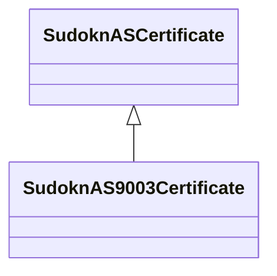

# Class: AS 9003 certificate (sudokn_AS9003Certificate)


URI: [sudokn:AS9003Certificate](http://asu.edu/semantics/SUDOKN/AS9003Certificate)





## Inheritance
* [IoInformationContentEntity](../classes/IoInformationContentEntity.md)
    * [SudoknCertificate](../classes/SudoknCertificate.md)
        * [SudoknQualityCertificate](../classes/SudoknQualityCertificate.md)
            * [SudoknASCertificate](../classes/SudoknASCertificate.md)
                * **SudoknAS9003Certificate**


## Slots

| Name | Cardinality and Range | Description | Inheritance | Occurrences |
| ---  | --- | --- | --- | --- |


## LinkML Source

<!-- TODO: investigate https://stackoverflow.com/questions/37606292/how-to-create-tabbed-code-blocks-in-mkdocs-or-sphinx -->

### Direct

<details>

```yaml
name: sudokn_AS9003Certificate
title: AS 9003 certificate
from_schema: okns:sudokn-kg
rank: 1000
is_a: sudokn_ASCertificate
class_uri: sudokn:AS9003Certificate

```
</details>

### Induced

<details>

```yaml
name: sudokn_AS9003Certificate
title: AS 9003 certificate
from_schema: okns:sudokn-kg
rank: 1000
is_a: sudokn_ASCertificate
class_uri: sudokn:AS9003Certificate

```
</details>