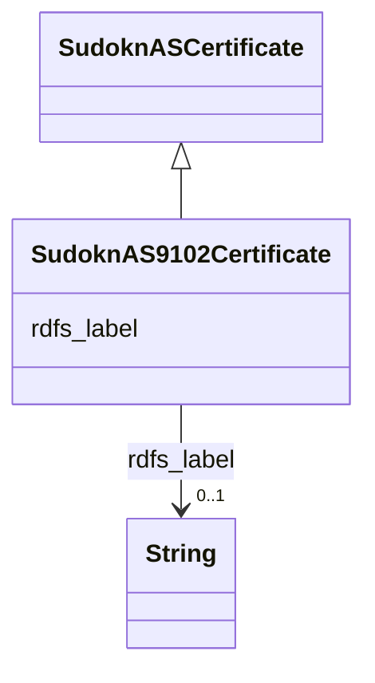

# Class: No class (type) name specified (sudokn_AS9102Certificate)


_No class (type) description specified_


This class occurs 9 times.


URI: [sudokn:AS9102Certificate](http://asu.edu/semantics/SUDOKN/AS9102Certificate)





## Inheritance
* [IoInformationContentEntity](../classes/IoInformationContentEntity.md)
    * [SudoknCertificate](../classes/SudoknCertificate.md)
        * [SudoknQualityCertificate](../classes/SudoknQualityCertificate.md)
            * [SudoknASCertificate](../classes/SudoknASCertificate.md)
                * **SudoknAS9102Certificate**


## Slots

| Name | Cardinality and Range | Description | Inheritance | Occurrences |
| ---  | --- | --- | --- | --- |
| [rdfs_label](../slots/rdfs_label.md) | 0..1 <br/> [xsd:string](http://www.w3.org/2001/XMLSchema#string) | No slot (predicate) description specified <br/>  | direct | 9 |


## Usages

| used by | used in | type | used |
| ---  | --- | --- | --- |
| [IoManufacturer](../classes/IoManufacturer.md) | [sudokn_hasCertificate](../slots/sudokn_hasCertificate.md) | any_of[range] | [SudoknAS9102Certificate](../classes/SudoknAS9102Certificate.md) |
| [OwlNamedIndividual](../classes/OwlNamedIndividual.md) | [sudokn_hasCertificate](../slots/sudokn_hasCertificate.md) | any_of[range] | [SudoknAS9102Certificate](../classes/SudoknAS9102Certificate.md) |


## LinkML Source

<!-- TODO: investigate https://stackoverflow.com/questions/37606292/how-to-create-tabbed-code-blocks-in-mkdocs-or-sphinx -->

### Direct

<details>

```yaml
name: sudokn_AS9102Certificate
conforms_to: No schema conformance document specified
annotations:
  count:
    tag: count
    value: 9
description: No class (type) description specified
title: No class (type) name specified
from_schema: sudokn-kg
rank: 1000
is_a: sudokn_ASCertificate
slots:
- rdfs_label
slot_usage:
  rdfs_label:
    name: rdfs_label
    annotations:
      string:
        tag: string
        value: 9
class_uri: sudokn:AS9102Certificate

```
</details>

### Induced

<details>

```yaml
name: sudokn_AS9102Certificate
conforms_to: No schema conformance document specified
annotations:
  count:
    tag: count
    value: 9
description: No class (type) description specified
title: No class (type) name specified
from_schema: sudokn-kg
rank: 1000
is_a: sudokn_ASCertificate
slot_usage:
  rdfs_label:
    name: rdfs_label
    annotations:
      string:
        tag: string
        value: 9
attributes:
  rdfs_label:
    name: rdfs_label
    annotations:
      string:
        tag: string
        value: 9
    description: No slot (predicate) description specified
    examples:
    - object:
        example_object: (NO CITY)
        example_object_type: string
        example_predicate: rdfs:label
        example_subject: sudokn:(NO%20CITY)-City
        example_subject_type: sudokn_City
    - object:
        example_object: ''
        example_object_type: string
        example_predicate: rdfs:label
        example_subject: sudokn:-Industry
        example_subject_type: sudokn_Industry
    - object:
        example_object: Bronze
        example_object_type: string
        example_predicate: rdfs:label
        example_subject: sudokn:101PIPE-Bronze-inst
        example_subject_type: sudokn_BronzeProcessingCapability
    - object:
        example_object: Glass
        example_object_type: string
        example_predicate: rdfs:label
        example_subject: sudokn:101PIPE-Glass-inst
        example_subject_type: sudokn_GlassProcessingCapability
    - object:
        example_object: Graphite
        example_object_type: string
        example_predicate: rdfs:label
        example_subject: sudokn:101PIPE-Graphite-inst
        example_subject_type: sudokn_GraphiteProcessingCapability
    - object:
        example_object: Iron
        example_object_type: string
        example_predicate: rdfs:label
        example_subject: sudokn:101PIPE-Iron-inst
        example_subject_type: sudokn_IronProcessingCapability
    - object:
        example_object: Rubber
        example_object_type: string
        example_predicate: rdfs:label
        example_subject: sudokn:101PIPE-Rubber-inst
        example_subject_type: sudokn_RubberProcessingCapability
    - object:
        example_object: Stainless Steel
        example_object_type: string
        example_predicate: rdfs:label
        example_subject: sudokn:101PIPE-StainlessSteel-inst
        example_subject_type: sudokn_StainlessSteelProcessingCapability
    - object:
        example_object: Steel
        example_object_type: string
        example_predicate: rdfs:label
        example_subject: sudokn:101PIPE-Steel-inst
        example_subject_type: sudokn_SteelProcessingCapability
    - object:
        example_object: Foam
        example_object_type: string
        example_predicate: rdfs:label
        example_subject: sudokn:149401-US-Foam-inst
        example_subject_type: sudokn_FoamProcessingCapability
    - object:
        example_object: ISO 9001 Certificate
        example_object_type: string
        example_predicate: rdfs:label
        example_subject: sudokn:149401-US-ISO9001Certificate
        example_subject_type: sudokn_ISO9001Certificate
    - object:
        example_object: Plastic
        example_object_type: string
        example_predicate: rdfs:label
        example_subject: sudokn:149401-US-Plastic-inst
        example_subject_type: sudokn_PlasticProcessingCapability
    - object:
        example_object: CNC Machining Capability
        example_object_type: string
        example_predicate: rdfs:label
        example_subject: sudokn:1776FABRICATION-CNCMachiningCapability-inst
        example_subject_type: sudokn_CNCMachiningCapability
    - object:
        example_object: Copper
        example_object_type: string
        example_predicate: rdfs:label
        example_subject: sudokn:1776FABRICATION-Copper-inst
        example_subject_type: sudokn_CopperProcessingCapability
    - object:
        example_object: Fabricating Capability
        example_object_type: string
        example_predicate: rdfs:label
        example_subject: sudokn:1776FABRICATION-FabricatingCapability-inst
        example_subject_type: sudokn_FabricatingCapability
    - object:
        example_object: Finishing Capability
        example_object_type: string
        example_predicate: rdfs:label
        example_subject: sudokn:1776FABRICATION-FinishingCapability-inst
        example_subject_type: sudokn_FinishingCapability
    - object:
        example_object: Forming Capability
        example_object_type: string
        example_predicate: rdfs:label
        example_subject: sudokn:1776FABRICATION-FormingCapability-inst
        example_subject_type: sudokn_FormingCapability
    - object:
        example_object: Machining Capability
        example_object_type: string
        example_predicate: rdfs:label
        example_subject: sudokn:1776FABRICATION-MachiningCapability-inst
        example_subject_type: sudokn_MachiningCapability
    - object:
        example_object: Metal
        example_object_type: string
        example_predicate: rdfs:label
        example_subject: sudokn:1776FABRICATION-Metal-inst
        example_subject_type: sudokn_MetalProcessingCapability
    - object:
        example_object: Wood
        example_object_type: string
        example_predicate: rdfs:label
        example_subject: sudokn:1776FABRICATION-Wood-inst
        example_subject_type: sudokn_WoodProcessingCapability
    - object:
        example_object: Assembly Capability
        example_object_type: string
        example_predicate: rdfs:label
        example_subject: sudokn:1DIETECH-AssemblyCapability-inst
        example_subject_type: sudokn_AssemblyCapability
    - object:
        example_object: Drawing Capability
        example_object_type: string
        example_predicate: rdfs:label
        example_subject: sudokn:1DIETECH-DrawingCapability-inst
        example_subject_type: sudokn_DrawingCapability
    - object:
        example_object: EDM Capability
        example_object_type: string
        example_predicate: rdfs:label
        example_subject: sudokn:1DIETECH-EDMCapability-inst
        example_subject_type: sudokn_EDMCapability
    - object:
        example_object: IATF 16949 Certificate
        example_object_type: string
        example_predicate: rdfs:label
        example_subject: sudokn:1DIETECH-IATF16949Certificate
        example_subject_type: sudokn_IATF16949Certificate
    - object:
        example_object: Laser Cutting Capability
        example_object_type: string
        example_predicate: rdfs:label
        example_subject: sudokn:1DIETECH-LaserCuttingCapability-inst
        example_subject_type: sudokn_LaserCuttingCapability
    - object:
        example_object: Stamping Capability
        example_object_type: string
        example_predicate: rdfs:label
        example_subject: sudokn:1DIETECH-StampingCapability-inst
        example_subject_type: sudokn_StampingCapability
    - object:
        example_object: Welding Capability
        example_object_type: string
        example_predicate: rdfs:label
        example_subject: sudokn:1DIETECH-WeldingCapability-inst
        example_subject_type: sudokn_WeldingCapability
    - object:
        example_object: Wire EDM Capability
        example_object_type: string
        example_predicate: rdfs:label
        example_subject: sudokn:1DIETECH-WireEDMCapability-inst
        example_subject_type: sudokn_WireEDMCapability
    - object:
        example_object: '28054'
        example_object_type: string
        example_predicate: rdfs:label
        example_subject: sudokn:28054-State
        example_subject_type: sudokn_State
    - object:
        example_object: Aluminum
        example_object_type: string
        example_predicate: rdfs:label
        example_subject: sudokn:2RIVERSUPPLY-Aluminum-inst
        example_subject_type: sudokn_AluminumProcessingCapability
    - object:
        example_object: ' Lead'
        example_object_type: string
        example_predicate: rdfs:label
        example_subject: sudokn:2RIVERSUPPLY-Lead-inst
        example_subject_type: sudokn_LeadProcessingCapability
    - object:
        example_object: Urethane
        example_object_type: string
        example_predicate: rdfs:label
        example_subject: sudokn:3-DTECHNICALSERVICES-Urethane-inst
        example_subject_type: sudokn_UrethaneProcessingCapability
    - object:
        example_object: AS 9100 Certificate
        example_object_type: string
        example_predicate: rdfs:label
        example_subject: sudokn:3D-CAM-AS9100Certificate
        example_subject_type: sudokn_AS9100Certificate
    - object:
        example_object: Ceramic
        example_object_type: string
        example_predicate: rdfs:label
        example_subject: sudokn:3D-CAM-Ceramic-inst
        example_subject_type: sudokn_CeramicProcessingCapability
    - object:
        example_object: Delrin
        example_object_type: string
        example_predicate: rdfs:label
        example_subject: sudokn:3D-CAM-Delrin-inst
        example_subject_type: sudokn_DelrinProcessingCapability
    - object:
        example_object: Nylon
        example_object_type: string
        example_predicate: rdfs:label
        example_subject: sudokn:3D-CAM-Nylon-inst
        example_subject_type: sudokn_NylonProcessingCapability
    - object:
        example_object: Polycarbonate
        example_object_type: string
        example_predicate: rdfs:label
        example_subject: sudokn:3D-CAM-Polycarbonate-inst
        example_subject_type: sudokn_PolycarbonateProcessingCapability
    - object:
        example_object: Teflon
        example_object_type: string
        example_predicate: rdfs:label
        example_subject: sudokn:3D-CAM-Teflon-inst
        example_subject_type: sudokn_TeflonProcessingCapability
    - object:
        example_object: Zinc
        example_object_type: string
        example_predicate: rdfs:label
        example_subject: sudokn:3D-CAM-Zinc-inst
        example_subject_type: sudokn_ZincProcessingCapability
    - object:
        example_object: Alloy Steel
        example_object_type: string
        example_predicate: rdfs:label
        example_subject: sudokn:3DIMENSIONAL-AlloySteel-inst
        example_subject_type: sudokn_AlloySteelProcessingCapability
    - object:
        example_object: Bending Capability
        example_object_type: string
        example_predicate: rdfs:label
        example_subject: sudokn:3DIMENSIONAL-BendingCapability-inst
        example_subject_type: sudokn_BendingCapability
    - object:
        example_object: Boring Capability
        example_object_type: string
        example_predicate: rdfs:label
        example_subject: sudokn:3DIMENSIONAL-BoringCapability-inst
        example_subject_type: sudokn_BoringCapability
    - object:
        example_object: Casting Capability
        example_object_type: string
        example_predicate: rdfs:label
        example_subject: sudokn:3DIMENSIONAL-CastingCapability-inst
        example_subject_type: sudokn_CastingCapability
    - object:
        example_object: Electrical Discharge Machining Capability
        example_object_type: string
        example_predicate: rdfs:label
        example_subject: sudokn:3DIMENSIONAL-ElectricalDischargeMachiningCapability-inst
        example_subject_type: sudokn_ElectricalDischargeMachiningCapability
    - object:
        example_object: Milling Capability
        example_object_type: string
        example_predicate: rdfs:label
        example_subject: sudokn:3DIMENSIONAL-MillingCapability-inst
        example_subject_type: sudokn_MillingCapability
    - object:
        example_object: Packing Capability
        example_object_type: string
        example_predicate: rdfs:label
        example_subject: sudokn:3DIMENSIONAL-PackingCapability-inst
        example_subject_type: sudokn_PackingCapability
    - object:
        example_object: Silicone
        example_object_type: string
        example_predicate: rdfs:label
        example_subject: sudokn:3DIMENSIONAL-Silicone-inst
        example_subject_type: sudokn_SiliconeProcessingCapability
    - object:
        example_object: Steel Alloy
        example_object_type: string
        example_predicate: rdfs:label
        example_subject: sudokn:3DIMENSIONAL-SteelAlloy-inst
        example_subject_type: sudokn_SteelAlloyProcessingCapability
    - object:
        example_object: Tubing Capability
        example_object_type: string
        example_predicate: rdfs:label
        example_subject: sudokn:3DIMENSIONAL-TubingCapability-inst
        example_subject_type: sudokn_TubingCapability
    - object:
        example_object: Waterjet Cutting Capability
        example_object_type: string
        example_predicate: rdfs:label
        example_subject: sudokn:3DIMENSIONAL-WaterjetCuttingCapability-inst
        example_subject_type: sudokn_WaterjetCuttingCapability
    - object:
        example_object: Anodizing Capability
        example_object_type: string
        example_predicate: rdfs:label
        example_subject: sudokn:3DMACH-AnodizingCapability-inst
        example_subject_type: sudokn_AnodizingCapability
    - object:
        example_object: CNC Milling Capability
        example_object_type: string
        example_predicate: rdfs:label
        example_subject: sudokn:3DMACH-CNCMillingCapability-inst
        example_subject_type: sudokn_CNCMillingCapability
    - object:
        example_object: Composite
        example_object_type: string
        example_predicate: rdfs:label
        example_subject: sudokn:3DMACH-Composite-inst
        example_subject_type: sudokn_CompositeProcessingCapability
    - object:
        example_object: Drilling Capability
        example_object_type: string
        example_predicate: rdfs:label
        example_subject: sudokn:3DMACH-DrillingCapability-inst
        example_subject_type: sudokn_DrillingCapability
    - object:
        example_object: Electro Plating Capability
        example_object_type: string
        example_predicate: rdfs:label
        example_subject: sudokn:3DMACH-ElectroPlatingCapability-inst
        example_subject_type: sudokn_ElectroPlatingCapability
    - object:
        example_object: Etching Capability
        example_object_type: string
        example_predicate: rdfs:label
        example_subject: sudokn:3DMACH-EtchingCapability-inst
        example_subject_type: sudokn_EtchingCapability
    - object:
        example_object: Grinding Capability
        example_object_type: string
        example_predicate: rdfs:label
        example_subject: sudokn:3DMACH-GrindingCapability-inst
        example_subject_type: sudokn_GrindingCapability
    - object:
        example_object: Platinum
        example_object_type: string
        example_predicate: rdfs:label
        example_subject: sudokn:3DMACH-Platinum-inst
        example_subject_type: sudokn_PlatinumProcessingCapability
    - object:
        example_object: Turning Capability
        example_object_type: string
        example_predicate: rdfs:label
        example_subject: sudokn:3DMACH-TurningCapability-inst
        example_subject_type: sudokn_TurningCapability
    - object:
        example_object: Additive Manufacturing Capability
        example_object_type: string
        example_predicate: rdfs:label
        example_subject: sudokn:3DSYSTEMS-AdditiveManufacturingCapability-inst
        example_subject_type: sudokn_AdditiveManufacturingCapability
    - object:
        example_object: Addtive Manufacturing Capability
        example_object_type: string
        example_predicate: rdfs:label
        example_subject: sudokn:3DSYSTEMS-AddtiveManufacturingCapability-inst
        example_subject_type: sudokn_AddtiveManufacturingCapability
    - object:
        example_object: Chemicals
        example_object_type: string
        example_predicate: rdfs:label
        example_subject: sudokn:3DSYSTEMS-Chemicals-inst
        example_subject_type: sudokn_ChemicalsProcessingCapability
    - object:
        example_object: Cobalt
        example_object_type: string
        example_predicate: rdfs:label
        example_subject: sudokn:3DSYSTEMS-Cobalt-inst
        example_subject_type: sudokn_CobaltProcessingCapability
    - object:
        example_object: Die Casting Capability
        example_object_type: string
        example_predicate: rdfs:label
        example_subject: sudokn:3DSYSTEMS-DieCastingCapability-inst
        example_subject_type: sudokn_DieCastingCapability
    - object:
        example_object: 'Extruding Capability '
        example_object_type: string
        example_predicate: rdfs:label
        example_subject: sudokn:3DSYSTEMS-ExtrudingCapability-inst
        example_subject_type: sudokn_ExtrudingCapability
    - object:
        example_object: ISO 13485 Certificate
        example_object_type: string
        example_predicate: rdfs:label
        example_subject: sudokn:3DSYSTEMS-ISO13485Certificate
        example_subject_type: sudokn_ISO13485Certificate
    - object:
        example_object: Investment Casting Capability
        example_object_type: string
        example_predicate: rdfs:label
        example_subject: sudokn:3DSYSTEMS-InvestmentCastingCapability-inst
        example_subject_type: sudokn_InvestmentCastingCapability
    - object:
        example_object: Nickel
        example_object_type: string
        example_predicate: rdfs:label
        example_subject: sudokn:3DSYSTEMS-Nickel-inst
        example_subject_type: sudokn_NickelProcessingCapability
    - object:
        example_object: Reaming Capability
        example_object_type: string
        example_predicate: rdfs:label
        example_subject: sudokn:3DSYSTEMS-ReamingCapability-inst
        example_subject_type: sudokn_ReamingCapability
    - object:
        example_object: Shaping Capability
        example_object_type: string
        example_predicate: rdfs:label
        example_subject: sudokn:3DSYSTEMS-ShapingCapability-inst
        example_subject_type: sudokn_ShapingCapability
    - object:
        example_object: Sheet Metal Processing Capability
        example_object_type: string
        example_predicate: rdfs:label
        example_subject: sudokn:3DSYSTEMS-SheetMetalProcessingCapability-inst
        example_subject_type: sudokn_SheetMetalProcessingCapability
    - object:
        example_object: Sintering Capability
        example_object_type: string
        example_predicate: rdfs:label
        example_subject: sudokn:3DSYSTEMS-SinteringCapability-inst
        example_subject_type: sudokn_SinteringCapability
    - object:
        example_object: Vacuum Casting Capability
        example_object_type: string
        example_predicate: rdfs:label
        example_subject: sudokn:3DSYSTEMS-VacuumCastingCapability-inst
        example_subject_type: sudokn_VacuumCastingCapability
    - object:
        example_object: Inconel
        example_object_type: string
        example_predicate: rdfs:label
        example_subject: sudokn:3DXINDUSTRIES-Inconel-inst
        example_subject_type: sudokn_InconelProcessingCapability
    - object:
        example_object: Rapid Prototyping Capability
        example_object_type: string
        example_predicate: rdfs:label
        example_subject: sudokn:3DXINDUSTRIES-RapidPrototypingCapability-inst
        example_subject_type: sudokn_RapidPrototypingCapability
    - object:
        example_object: Titanium
        example_object_type: string
        example_predicate: rdfs:label
        example_subject: sudokn:3DXINDUSTRIES-Titanium-inst
        example_subject_type: sudokn_TitaniumProcessingCapability
    - object:
        example_object: Tungsten
        example_object_type: string
        example_predicate: rdfs:label
        example_subject: sudokn:3DXINDUSTRIES-Tungsten-inst
        example_subject_type: sudokn_TungstenProcessingCapability
    - object:
        example_object: Acetal
        example_object_type: string
        example_predicate: rdfs:label
        example_subject: sudokn:3ERP-Acetal-inst
        example_subject_type: sudokn_AcetalProcessingCapability
    - object:
        example_object: Beryllium
        example_object_type: string
        example_predicate: rdfs:label
        example_subject: sudokn:3ERP-Beryllium-inst
        example_subject_type: sudokn_BerylliumProcessingCapability
    - object:
        example_object: Black Oxide Coating Capability
        example_object_type: string
        example_predicate: rdfs:label
        example_subject: sudokn:3ERP-BlackOxideCoatingCapability-inst
        example_subject_type: sudokn_BlackOxideCoatingCapability
    - object:
        example_object: Brass
        example_object_type: string
        example_predicate: rdfs:label
        example_subject: sudokn:3ERP-Brass-inst
        example_subject_type: sudokn_BrassProcessingCapability
    - object:
        example_object: Centrifugal Casting Capability
        example_object_type: string
        example_predicate: rdfs:label
        example_subject: sudokn:3ERP-CentrifugalCastingCapability-inst
        example_subject_type: sudokn_CentrifugalCastingCapability
    - object:
        example_object: Embossing Capability
        example_object_type: string
        example_predicate: rdfs:label
        example_subject: sudokn:3ERP-EmbossingCapability-inst
        example_subject_type: sudokn_EmbossingCapability
    - object:
        example_object: Galvanizing Capability
        example_object_type: string
        example_predicate: rdfs:label
        example_subject: sudokn:3ERP-GalvanizingCapability-inst
        example_subject_type: sudokn_GalvanizingCapability
    - object:
        example_object: Lexan
        example_object_type: string
        example_predicate: rdfs:label
        example_subject: sudokn:3ERP-Lexan-inst
        example_subject_type: sudokn_LexanProcessingCapability
    - object:
        example_object: Molybdenum
        example_object_type: string
        example_predicate: rdfs:label
        example_subject: sudokn:3ERP-Molybdenum-inst
        example_subject_type: sudokn_MolybdenumProcessingCapability
    - object:
        example_object: Permanent Mold Casting Capability
        example_object_type: string
        example_predicate: rdfs:label
        example_subject: sudokn:3ERP-PermanentMoldCastingCapability-inst
        example_subject_type: sudokn_PermanentMoldCastingCapability
    - object:
        example_object: Coating Capability
        example_object_type: string
        example_predicate: rdfs:label
        example_subject: sudokn:3PINDUSTRIES-CoatingCapability-inst
        example_subject_type: sudokn_CoatingCapability
    - object:
        example_object: Powder Coating Capability
        example_object_type: string
        example_predicate: rdfs:label
        example_subject: sudokn:3PINDUSTRIES-PowderCoatingCapability-inst
        example_subject_type: sudokn_PowderCoatingCapability
    - object:
        example_object: Surface Preparation Capability
        example_object_type: string
        example_predicate: rdfs:label
        example_subject: sudokn:3PINDUSTRIES-SurfacePreparationCapability-inst
        example_subject_type: sudokn_SurfacePreparationCapability
    - object:
        example_object: Silver
        example_object_type: string
        example_predicate: rdfs:label
        example_subject: sudokn:4FELDCO-Silver-inst
        example_subject_type: sudokn_SilverProcessingCapability
    - object:
        example_object: Vertical Milling Capability
        example_object_type: string
        example_predicate: rdfs:label
        example_subject: sudokn:4JOMAR-VerticalMillingCapability-inst
        example_subject_type: sudokn_VerticalMillingCapability
    - object:
        example_object: Heat Treating Capability
        example_object_type: string
        example_predicate: rdfs:label
        example_subject: sudokn:4MPROTOTYPE-HeatTreatingCapability-inst
        example_subject_type: sudokn_HeatTreatingCapability
    - object:
        example_object: Carbide
        example_object_type: string
        example_predicate: rdfs:label
        example_subject: sudokn:4PEABODY-Carbide-inst
        example_subject_type: sudokn_CarbideProcessingCapability
    - object:
        example_object: ITAR Certificate
        example_object_type: string
        example_predicate: rdfs:label
        example_subject: sudokn:5HFAB-ITARCertificate
        example_subject_type: sudokn_ITARCertificate
    - object:
        example_object: Gold
        example_object_type: string
        example_predicate: rdfs:label
        example_subject: sudokn:800GOLD-Gold-inst
        example_subject_type: sudokn_GoldProcessingCapability
    - object:
        example_object: Forging Capability
        example_object_type: string
        example_predicate: rdfs:label
        example_subject: sudokn:889GLOBALSOLUTIONS-ForgingCapability-inst
        example_subject_type: sudokn_ForgingCapability
    - object:
        example_object: Molding Capability
        example_object_type: string
        example_predicate: rdfs:label
        example_subject: sudokn:889GLOBALSOLUTIONS-MoldingCapability-inst
        example_subject_type: sudokn_MoldingCapability
    - object:
        example_object: Live Tooling Capability
        example_object_type: string
        example_predicate: rdfs:label
        example_subject: sudokn:A-1PRECISION-LiveToolingCapability-inst
        example_subject_type: sudokn_LiveToolingCapability
    - object:
        example_object: Notching Capability
        example_object_type: string
        example_predicate: rdfs:label
        example_subject: sudokn:A-1SHEETMETAL-NotchingCapability-inst
        example_subject_type: sudokn_NotchingCapability
    - object:
        example_object: Rolling Capability
        example_object_type: string
        example_predicate: rdfs:label
        example_subject: sudokn:A-1SHEETMETAL-RollingCapability-inst
        example_subject_type: sudokn_RollingCapability
    - object:
        example_object: ' Tin'
        example_object_type: string
        example_predicate: rdfs:label
        example_subject: sudokn:A-AMERICANCOMPANIES-Tin-inst
        example_subject_type: sudokn_TinProcessingCapability
    - object:
        example_object: Laser Etching Capability
        example_object_type: string
        example_predicate: rdfs:label
        example_subject: sudokn:A-I-CORP-LaserEtchingCapability-inst
        example_subject_type: sudokn_LaserEtchingCapability
    - object:
        example_object: Fabrication
        example_object_type: string
        example_predicate: rdfs:label
        example_subject: sudokn:A-LineCorporation-Fabrication
        example_subject_type: sudokn_FabricationCapability
    - object:
        example_object: Plasma Cutting Capability
        example_object_type: string
        example_predicate: rdfs:label
        example_subject: sudokn:A-M-W-PlasmaCuttingCapability-inst
        example_subject_type: sudokn_PlasmaCuttingCapability
    - object:
        example_object: Sand Blasting Capability
        example_object_type: string
        example_predicate: rdfs:label
        example_subject: sudokn:A-M-W-SandBlastingCapability-inst
        example_subject_type: sudokn_SandBlastingCapability
    - object:
        example_object: Chromium
        example_object_type: string
        example_predicate: rdfs:label
        example_subject: sudokn:A1JAYS-Chromium-inst
        example_subject_type: sudokn_ChromiumProcessingCapability
    - object:
        example_object: Honing Capability
        example_object_type: string
        example_predicate: rdfs:label
        example_subject: sudokn:A1JAYS-HoningCapability-inst
        example_subject_type: sudokn_HoningCapability
    - object:
        example_object: Invar
        example_object_type: string
        example_predicate: rdfs:label
        example_subject: sudokn:A1JAYS-Invar-inst
        example_subject_type: sudokn_InvarProcessingCapability
    - object:
        example_object: Kovar
        example_object_type: string
        example_predicate: rdfs:label
        example_subject: sudokn:A1JAYS-Kovar-inst
        example_subject_type: sudokn_KovarProcessingCapability
    - object:
        example_object: Magnesium
        example_object_type: string
        example_predicate: rdfs:label
        example_subject: sudokn:A1JAYS-Magnesium-inst
        example_subject_type: sudokn_MagnesiumProcessingCapability
    - object:
        example_object: Sinker EDM Capability
        example_object_type: string
        example_predicate: rdfs:label
        example_subject: sudokn:A1JAYS-SinkerEDMCapability-inst
        example_subject_type: sudokn_SinkerEDMCapability
    - object:
        example_object: Tantalum
        example_object_type: string
        example_predicate: rdfs:label
        example_subject: sudokn:A1JAYS-Tantalum-inst
        example_subject_type: sudokn_TantalumProcessingCapability
    - object:
        example_object: Tapping Capability
        example_object_type: string
        example_predicate: rdfs:label
        example_subject: sudokn:A1JAYS-TappingCapability-inst
        example_subject_type: sudokn_TappingCapability
    - object:
        example_object: Waspaloy
        example_object_type: string
        example_predicate: rdfs:label
        example_subject: sudokn:A1MACHINING-Waspaloy-inst
        example_subject_type: sudokn_WaspaloyProcessingCapability
    - object:
        example_object: Polishing Capability
        example_object_type: string
        example_predicate: rdfs:label
        example_subject: sudokn:A1POLISHING-PolishingCapability-inst
        example_subject_type: sudokn_PolishingCapability
    - object:
        example_object: Knurling Capability
        example_object_type: string
        example_predicate: rdfs:label
        example_subject: sudokn:AAAIND-KnurlingCapability-inst
        example_subject_type: sudokn_KnurlingCapability
    - object:
        example_object: Abrasive Cleaning Capability
        example_object_type: string
        example_predicate: rdfs:label
        example_subject: sudokn:AAAPLATING-AbrasiveCleaningCapability-inst
        example_subject_type: sudokn_AbrasiveCleaningCapability
    - object:
        example_object: Chemical Processing Capability
        example_object_type: string
        example_predicate: rdfs:label
        example_subject: sudokn:AAAPLATING-ChemicalProcessingCapability-inst
        example_subject_type: sudokn_ChemicalProcessingCapability
    - object:
        example_object: Joining Capability
        example_object_type: string
        example_predicate: rdfs:label
        example_subject: sudokn:AAAPLATING-JoiningCapability-inst
        example_subject_type: sudokn_JoiningCapability
    - object:
        example_object: NADCAP Certificate
        example_object_type: string
        example_predicate: rdfs:label
        example_subject: sudokn:AAAPLATING-NADCAPCertificate
        example_subject_type: sudokn_NADCAPCertificate
    - object:
        example_object: Passivation Capability
        example_object_type: string
        example_predicate: rdfs:label
        example_subject: sudokn:AAAPLATING-PassivationCapability-inst
        example_subject_type: sudokn_PassivationCapability
    - object:
        example_object: Surface Finishing Capability
        example_object_type: string
        example_predicate: rdfs:label
        example_subject: sudokn:AAAPLATING-SurfaceFinishingCapability-inst
        example_subject_type: sudokn_SurfaceFinishingCapability
    - object:
        example_object: ISO 14001 Certificate
        example_object_type: string
        example_predicate: rdfs:label
        example_subject: sudokn:AAASE-ISO14001Certificate
        example_subject_type: sudokn_ISO14001Certificate
    - object:
        example_object: ASME Certificate
        example_object_type: string
        example_predicate: rdfs:label
        example_subject: sudokn:AAATECH-ASMECertificate
        example_subject_type: sudokn_ASMECertificate
    - object:
        example_object: Horizontal Milling Capability
        example_object_type: string
        example_predicate: rdfs:label
        example_subject: sudokn:AAE-MFG-HorizontalMillingCapability-inst
        example_subject_type: sudokn_HorizontalMillingCapability
    - object:
        example_object: Polycrystalline Diamond Machining Capability
        example_object_type: string
        example_predicate: rdfs:label
        example_subject: sudokn:AAE-MFG-PolycrystallineDiamondMachiningCapability-inst
        example_subject_type: sudokn_PolycrystallineDiamondMachiningCapability
    - object:
        example_object: Hastelloy
        example_object_type: string
        example_predicate: rdfs:label
        example_subject: sudokn:AAGROUP-Hastelloy-inst
        example_subject_type: sudokn_HastelloyProcessingCapability
    - object:
        example_object: Exotic Material
        example_object_type: string
        example_predicate: rdfs:label
        example_subject: sudokn:AAMACH-ExoticMaterial-inst
        example_subject_type: sudokn_ExoticMaterialProcessingCapability
    - object:
        example_object: Palladium
        example_object_type: string
        example_predicate: rdfs:label
        example_subject: sudokn:AARONMANUFACTURING-Palladium-inst
        example_subject_type: sudokn_PalladiumProcessingCapability
    - object:
        example_object: ISO9000
        example_object_type: string
        example_predicate: rdfs:label
        example_subject: sudokn:AAndGMachining-ISO9000
        example_subject_type: sudokn_ISO9000
    - object:
        example_object: Brazing Capability
        example_object_type: string
        example_predicate: rdfs:label
        example_subject: sudokn:ABBCOINC-BrazingCapability-inst
        example_subject_type: sudokn_BrazingCapability
    - object:
        example_object: RamEDM Capability
        example_object_type: string
        example_predicate: rdfs:label
        example_subject: sudokn:ABBOTT-TOOL-RamEDMCapability-inst
        example_subject_type: sudokn_RamEDMCapability
    - object:
        example_object: Zinc Alloy
        example_object_type: string
        example_predicate: rdfs:label
        example_subject: sudokn:ABC-ALUMINUM-ZincAlloy-inst
        example_subject_type: sudokn_ZincAlloyProcessingCapability
    - object:
        example_object: Hardening Capability
        example_object_type: string
        example_predicate: rdfs:label
        example_subject: sudokn:ABERDEENTECH-HardeningCapability-inst
        example_subject_type: sudokn_HardeningCapability
    - object:
        example_object: Deep Hole Drilling Capability
        example_object_type: string
        example_predicate: rdfs:label
        example_subject: sudokn:ABETECMANUFACTURING-DeepHoleDrillingCapability-inst
        example_subject_type: sudokn_DeepHoleDrillingCapability
    - object:
        example_object: Annealing Capability
        example_object_type: string
        example_predicate: rdfs:label
        example_subject: sudokn:ABIFOUNDRY-AnnealingCapability-inst
        example_subject_type: sudokn_AnnealingCapability
    - object:
        example_object: ISO 14000 Certificate
        example_object_type: string
        example_predicate: rdfs:label
        example_subject: sudokn:ABIFOUNDRY-ISO14000Certificate
        example_subject_type: sudokn_ISO14000Certificate
    - object:
        example_object: Soldering Capability
        example_object_type: string
        example_predicate: rdfs:label
        example_subject: sudokn:ABILITYENGINEERING-SolderingCapability-inst
        example_subject_type: sudokn_SolderingCapability
    - object:
        example_object: Zircon
        example_object_type: string
        example_predicate: rdfs:label
        example_subject: sudokn:ABILITYENGINEERING-Zircon-inst
        example_subject_type: sudokn_ZirconProcessingCapability
    - object:
        example_object: Special Materials
        example_object_type: string
        example_predicate: rdfs:label
        example_subject: sudokn:ABILITYMETAL-SpecialMaterials-inst
        example_subject_type: sudokn_SpecialMaterialsProcessingCapability
    - object:
        example_object: Deburring Capability
        example_object_type: string
        example_predicate: rdfs:label
        example_subject: sudokn:ABLEBAR-DeburringCapability-inst
        example_subject_type: sudokn_DeburringCapability
    - object:
        example_object: Carburizing Capability
        example_object_type: string
        example_predicate: rdfs:label
        example_subject: sudokn:ABLPRODUCTS-CarburizingCapability-inst
        example_subject_type: sudokn_CarburizingCapability
    - object:
        example_object: Creep Feed Grinding Capability
        example_object_type: string
        example_predicate: rdfs:label
        example_subject: sudokn:ABRASIVE-FORM-CreepFeedGrindingCapability-inst
        example_subject_type: sudokn_CreepFeedGrindingCapability
    - object:
        example_object: Low Alloy Steel
        example_object_type: string
        example_predicate: rdfs:label
        example_subject: sudokn:ACADEMYPETROLEUM-LowAlloySteel-inst
        example_subject_type: sudokn_LowAlloySteelProcessingCapability
    - object:
        example_object: Chromate Conversion Coating Capability
        example_object_type: string
        example_predicate: rdfs:label
        example_subject: sudokn:ACCENTMETAL-ChromateConversionCoatingCapability-inst
        example_subject_type: sudokn_ChromateConversionCoatingCapability
    - object:
        example_object: Physical Vapor Deposition Capability
        example_object_type: string
        example_predicate: rdfs:label
        example_subject: sudokn:ACCESSOPTICS-PhysicalVaporDepositionCapability-inst
        example_subject_type: sudokn_PhysicalVaporDepositionCapability
    - object:
        example_object: Cold Rolled Steel
        example_object_type: string
        example_predicate: rdfs:label
        example_subject: sudokn:ACCRAFAB-ColdRolledSteel-inst
        example_subject_type: sudokn_ColdRolledSteelProcessingCapability
    - object:
        example_object: Electroless Nickel Plating Capability
        example_object_type: string
        example_predicate: rdfs:label
        example_subject: sudokn:ACCRAFAB-ElectrolessNickelPlatingCapability-inst
        example_subject_type: sudokn_ElectrolessNickelPlatingCapability
    - object:
        example_object: Nitriding Capability
        example_object_type: string
        example_predicate: rdfs:label
        example_subject: sudokn:ACCURATESTEELTREATING-NitridingCapability-inst
        example_subject_type: sudokn_NitridingCapability
    - object:
        example_object: FDA Certificate
        example_object_type: string
        example_predicate: rdfs:label
        example_subject: sudokn:ACIMEDICAL-FDACertificate
        example_subject_type: sudokn_FDACertificate
    - object:
        example_object: Nomex
        example_object_type: string
        example_predicate: rdfs:label
        example_subject: sudokn:ACMANUFACTURING-Nomex-inst
        example_subject_type: sudokn_NomexProcessingCapability
    - object:
        example_object: Spinning Capability
        example_object_type: string
        example_predicate: rdfs:label
        example_subject: sudokn:ACMEMETALSPINNING-SpinningCapability-inst
        example_subject_type: sudokn_SpinningCapability
    - object:
        example_object: Electropolishing Capability
        example_object_type: string
        example_predicate: rdfs:label
        example_subject: sudokn:ACMESDI-ElectropolishingCapability-inst
        example_subject_type: sudokn_ElectropolishingCapability
    - object:
        example_object: ISO Certificate
        example_object_type: string
        example_predicate: rdfs:label
        example_subject: sudokn:ACRYLICART-ISOCertificate
        example_subject_type: sudokn_ISOCertificate
    - object:
        example_object: Wire Harness Assembly Capability
        example_object_type: string
        example_predicate: rdfs:label
        example_subject: sudokn:ADCURAMFG-WireHarnessAssemblyCapability-inst
        example_subject_type: sudokn_WireHarnessAssemblyCapability
    - object:
        example_object: Vaporized Metal Coating Capability
        example_object_type: string
        example_predicate: rdfs:label
        example_subject: sudokn:ADDITIVEMANUFACTURINGLLC-VaporizedMetalCoatingCapability-inst
        example_subject_type: sudokn_VaporizedMetalCoatingCapability
    - object:
        example_object: AWS Welder Certificate
        example_object_type: string
        example_predicate: rdfs:label
        example_subject: sudokn:ADVANTAINDUSTRIES-AWSWelderCertificate
        example_subject_type: sudokn_AWSWelderCertificate
    - object:
        example_object: AS 9000 Certificate
        example_object_type: string
        example_predicate: rdfs:label
        example_subject: sudokn:AEROSPACECOMPONENTS-AS9000Certificate
        example_subject_type: sudokn_AS9000Certificate
    - object:
        example_object: Difficult To Machine Materials
        example_object_type: string
        example_predicate: rdfs:label
        example_subject: sudokn:AEROSPACECOMPONENTS-DifficultToMachineMaterials-inst
        example_subject_type: sudokn_DifficultToMachineMaterialsProcessingCapability
    - object:
        example_object: A Equipment
        example_object_type: string
        example_predicate: rdfs:label
        example_subject: sudokn:AEquipment-product
        example_subject_type: io_MaterialProduct
    - object:
        example_object: QS 9000 Certificate
        example_object_type: string
        example_predicate: rdfs:label
        example_subject: sudokn:AGMAUTOMATION-QS9000Certificate
        example_subject_type: sudokn_QS9000Certificate
    - object:
        example_object: 'Oxy-Fuel Cutting Capability '
        example_object_type: string
        example_predicate: rdfs:label
        example_subject: sudokn:ALABAMAPLATE-Oxy-FuelCuttingCapability-inst
        example_subject_type: sudokn_Oxy-FuelCuttingCapability
    - object:
        example_object: LaserProcessing
        example_object_type: string
        example_predicate: rdfs:label
        example_subject: sudokn:ALCOMETALFABRICATORS-LaserProcessing
        example_subject_type: sudokn_LaserProcessingCapability
    - object:
        example_object: Kapton
        example_object_type: string
        example_predicate: rdfs:label
        example_subject: sudokn:ALTINC-Kapton-inst
        example_subject_type: sudokn_KaptonProcessingCapability
    - object:
        example_object: High Grade Aluminum
        example_object_type: string
        example_predicate: rdfs:label
        example_subject: sudokn:ALUMA-HighGradeAluminum-inst
        example_subject_type: sudokn_HighGradeAluminumProcessingCapability
    - object:
        example_object: Precious Material
        example_object_type: string
        example_predicate: rdfs:label
        example_subject: sudokn:AMERICANLASERINC-PreciousMaterial-inst
        example_subject_type: sudokn_PreciousMaterialProcessingCapability
    - object:
        example_object: Planing Capability
        example_object_type: string
        example_predicate: rdfs:label
        example_subject: sudokn:APPALACHIANCAST-PlaningCapability-inst
        example_subject_type: sudokn_PlaningCapability
    - object:
        example_object: Plasma Spraying Capability
        example_object_type: string
        example_predicate: rdfs:label
        example_subject: sudokn:APSMATERIALS-PlasmaSprayingCapability-inst
        example_subject_type: sudokn_PlasmaSprayingCapability
    - object:
        example_object: Cutting Capability
        example_object_type: string
        example_predicate: rdfs:label
        example_subject: sudokn:AQUAJETSERVICES-CuttingCapability-inst
        example_subject_type: sudokn_CuttingCapability
    - object:
        example_object: Extremely Hard Material
        example_object_type: string
        example_predicate: rdfs:label
        example_subject: sudokn:ARMORCONTRACT-ExtremelyHardMaterial-inst
        example_subject_type: sudokn_ExtremelyHardMaterialProcessingCapability
    - object:
        example_object: Flame Spraying Capability
        example_object_type: string
        example_predicate: rdfs:label
        example_subject: sudokn:ASTROMECHANICS-FlameSprayingCapability-inst
        example_subject_type: sudokn_FlameSprayingCapability
    - object:
        example_object: CNCTurning
        example_object_type: string
        example_predicate: rdfs:label
        example_subject: sudokn:ATSMachineSafetySolutions-CNCTurning
        example_subject_type: sudokn_CNCTurningCapability
    - object:
        example_object: Electron Beam Welding Capability
        example_object_type: string
        example_predicate: rdfs:label
        example_subject: sudokn:AWS-ElectronBeamWeldingCapability-inst
        example_subject_type: sudokn_ElectronBeamWeldingCapability
    - object:
        example_object: ISO9001
        example_object_type: string
        example_predicate: rdfs:label
        example_subject: sudokn:Accu-Fab-ISO9001
        example_subject_type: sudokn_ISO9001
    - object:
        example_object: ScreenPrinting
        example_object_type: string
        example_predicate: rdfs:label
        example_subject: sudokn:Accu-Fab-ScreenPrinting
        example_subject_type: sudokn_ScreenPrintingCapability
    - object:
        example_object: WetPainting
        example_object_type: string
        example_predicate: rdfs:label
        example_subject: sudokn:Accu-Fab-WetPainting
        example_subject_type: sudokn_WetPaintingCapability
    - object:
        example_object: AS9100
        example_object_type: string
        example_predicate: rdfs:label
        example_subject: sudokn:Accu-Tool-AS9100
        example_subject_type: sudokn_AS9100
    - object:
        example_object: ITARCompliant
        example_object_type: string
        example_predicate: rdfs:label
        example_subject: sudokn:Accu-Tool-ITARCompliant
        example_subject_type: sudokn_ITARCompliant
    - object:
        example_object: Aerospace
        example_object_type: string
        example_predicate: rdfs:label
        example_subject: sudokn:Aerospace-Industry
        example_subject_type: sudokn_AerospaceIndustry
    - object:
        example_object: Agriculture
        example_object_type: string
        example_predicate: rdfs:label
        example_subject: sudokn:Agriculture-Industry
        example_subject_type: sudokn_AgricultureIndustry
    - object:
        example_object: EngineeringDesign
        example_object_type: string
        example_predicate: rdfs:label
        example_subject: sudokn:AirSystemComponentsTitus-EngineeringDesign
        example_subject_type: sudokn_EngineeringDesignCapability
    - object:
        example_object: ElectolessNickelPlating
        example_object_type: string
        example_predicate: rdfs:label
        example_subject: sudokn:AlliedMetalFinishing-ElectolessNickelPlating
        example_subject_type: sudokn_ElectolessNickelPlatingCapability
    - object:
        example_object: NickelPlating
        example_object_type: string
        example_predicate: rdfs:label
        example_subject: sudokn:AlliedMetalFinishing-NickelPlating
        example_subject_type: sudokn_NickelPlatingCapability
    - object:
        example_object: Plating
        example_object_type: string
        example_predicate: rdfs:label
        example_subject: sudokn:AlliedMetalFinishing-Plating
        example_subject_type: sudokn_PlatingCapability
    - object:
        example_object: DieMaking
        example_object_type: string
        example_predicate: rdfs:label
        example_subject: sudokn:AllredMetalStampingWorks-DieMaking
        example_subject_type: sudokn_DieMakingCapability
    - object:
        example_object: MoldMaking
        example_object_type: string
        example_predicate: rdfs:label
        example_subject: sudokn:AllredMetalStampingWorks-MoldMaking
        example_subject_type: sudokn_MoldMakingCapability
    - object:
        example_object: Riveting
        example_object_type: string
        example_predicate: rdfs:label
        example_subject: sudokn:AllredMetalStampingWorks-Riveting
        example_subject_type: sudokn_RivetingCapability
    - object:
        example_object: ToolMaking
        example_object_type: string
        example_predicate: rdfs:label
        example_subject: sudokn:AllredMetalStampingWorks-ToolMaking
        example_subject_type: sudokn_ToolMakingCapability
    - object:
        example_object: PLCProgramming
        example_object_type: string
        example_predicate: rdfs:label
        example_subject: sudokn:Alotech-PLCProgramming
        example_subject_type: sudokn_PLCProgrammingCapability
    - object:
        example_object: ContinuousCasting
        example_object_type: string
        example_predicate: rdfs:label
        example_subject: sudokn:Aludisc-ContinuousCasting
        example_subject_type: sudokn_ContinuousCastingCapability
    - object:
        example_object: Punching
        example_object_type: string
        example_predicate: rdfs:label
        example_subject: sudokn:Aludisc-Punching
        example_subject_type: sudokn_PunchingCapability
    - object:
        example_object: Smelting
        example_object_type: string
        example_predicate: rdfs:label
        example_subject: sudokn:Aludisc-Smelting
        example_subject_type: sudokn_SmeltingCapability
    - object:
        example_object: ASME
        example_object_type: string
        example_predicate: rdfs:label
        example_subject: sudokn:AmericanHammer-ASME
        example_subject_type: sudokn_ASME
    - object:
        example_object: DeepFreezing
        example_object_type: string
        example_predicate: rdfs:label
        example_subject: sudokn:AmericanMetalTreating-DeepFreezing
        example_subject_type: sudokn_DeepFreezingCapability
    - object:
        example_object: VacuumHardening
        example_object_type: string
        example_predicate: rdfs:label
        example_subject: sudokn:AmericanMetalTreating-VacuumHardening
        example_subject_type: sudokn_VacuumHardeningCapability
    - object:
        example_object: ISO14001
        example_object_type: string
        example_predicate: rdfs:label
        example_subject: sudokn:ArcelorMittalPiedmont-ISO14001
        example_subject_type: sudokn_ISO14001
    - object:
        example_object: Shearing
        example_object_type: string
        example_predicate: rdfs:label
        example_subject: sudokn:ArcelorMittalPiedmont-Shearing
        example_subject_type: sudokn_ShearingCapability
    - object:
        example_object: Automotive
        example_object_type: string
        example_predicate: rdfs:label
        example_subject: sudokn:Automotive-Industry
        example_subject_type: sudokn_AutomotiveIndustry
    - object:
        example_object: Prototyping
        example_object_type: string
        example_predicate: rdfs:label
        example_subject: sudokn:B+EManufacturingCo-Prototyping
        example_subject_type: sudokn_PrototypingCapability
    - object:
        example_object: Wood Working Capability
        example_object_type: string
        example_predicate: rdfs:label
        example_subject: sudokn:BCTINT-WoodWorkingCapability-inst
        example_subject_type: sudokn_WoodWorkingCapability
    - object:
        example_object: Natural Fiber
        example_object_type: string
        example_predicate: rdfs:label
        example_subject: sudokn:BDCUSTOMMFG-NaturalFiber-inst
        example_subject_type: sudokn_NaturalFiberProcessingCapability
    - object:
        example_object: Carbonitriding Capability
        example_object_type: string
        example_predicate: rdfs:label
        example_subject: sudokn:BLUEWATERTHERMAL-CarbonitridingCapability-inst
        example_subject_type: sudokn_CarbonitridingCapability
    - object:
        example_object: Shrink Fitting Capability
        example_object_type: string
        example_predicate: rdfs:label
        example_subject: sudokn:BRODEURMACHINE-ShrinkFittingCapability-inst
        example_subject_type: sudokn_ShrinkFittingCapability
    - object:
        example_object: Mechanical Joining Capability
        example_object_type: string
        example_predicate: rdfs:label
        example_subject: sudokn:BROWNINDUSTRIES-MechanicalJoiningCapability-inst
        example_subject_type: sudokn_MechanicalJoiningCapability
    - object:
        example_object: Oil Grooving Capability
        example_object_type: string
        example_predicate: rdfs:label
        example_subject: sudokn:BUSCHPRECISION-OilGroovingCapability-inst
        example_subject_type: sudokn_OilGroovingCapability
    - object:
        example_object: PressBraking
        example_object_type: string
        example_predicate: rdfs:label
        example_subject: sudokn:BarnesMetalCrafters-PressBraking
        example_subject_type: sudokn_PressBrakingCapability
    - object:
        example_object: RoboticWelding
        example_object_type: string
        example_predicate: rdfs:label
        example_subject: sudokn:BarnesMetalCrafters-RoboticWelding
        example_subject_type: sudokn_RoboticWeldingCapability
    - object:
        example_object: GearCutting
        example_object_type: string
        example_predicate: rdfs:label
        example_subject: sudokn:BrintleMachineWorks-GearCutting
        example_subject_type: sudokn_GearCuttingCapability
    - object:
        example_object: MetalFabrication
        example_object_type: string
        example_predicate: rdfs:label
        example_subject: sudokn:BroadsightSystems-MetalFabrication
        example_subject_type: sudokn_MetalFabricationCapability
    - object:
        example_object: Business Equipment
        example_object_type: string
        example_predicate: rdfs:label
        example_subject: sudokn:BusinessEquipment-Industry
        example_subject_type: sudokn_BusinessEquipmentIndustry
    - object:
        example_object: Phos Bronze
        example_object_type: string
        example_predicate: rdfs:label
        example_subject: sudokn:CAR-ENG-PhosBronze-inst
        example_subject_type: sudokn_PhosBronzeProcessingCapability
    - object:
        example_object: Carbon Graphite
        example_object_type: string
        example_predicate: rdfs:label
        example_subject: sudokn:CARBONFIBERGLASS-CarbonGraphite-inst
        example_subject_type: sudokn_CarbonGraphiteProcessingCapability
    - object:
        example_object: CNCmilling
        example_object_type: string
        example_predicate: rdfs:label
        example_subject: sudokn:CAndHTooling-CNCmilling
        example_subject_type: sudokn_CNCmillingCapability
    - object:
        example_object: SheetMetalFabrication
        example_object_type: string
        example_predicate: rdfs:label
        example_subject: sudokn:CMSToolAndDie-SheetMetalFabrication
        example_subject_type: sudokn_SheetMetalFabricationCapability
    - object:
        example_object: HAACP Certificate
        example_object_type: string
        example_predicate: rdfs:label
        example_subject: sudokn:CMTC-HAACPCertificate
        example_subject_type: sudokn_HAACPCertificate
    - object:
        example_object: AS 9102 Certificate
        example_object_type: string
        example_predicate: rdfs:label
        example_subject: sudokn:COINING-AS9102Certificate
        example_subject_type: sudokn_AS9102Certificate
    - object:
        example_object: ManMadeFiber Processing Capability
        example_object_type: string
        example_predicate: rdfs:label
        example_subject: sudokn:CargoControlUSA-ManMadeFiber-cap
        example_subject_type: sudokn_ManMadeFiberProcessingCapability
    - object:
        example_object: Printing
        example_object_type: string
        example_predicate: rdfs:label
        example_subject: sudokn:CargoControlUSA-Printing
        example_subject_type: sudokn_PrintingCapability
    - object:
        example_object: LatheWork
        example_object_type: string
        example_predicate: rdfs:label
        example_subject: sudokn:CarolinaPrecisionMachining-LatheWork
        example_subject_type: sudokn_LatheWorkCapability
    - object:
        example_object: MechanicalAssembly
        example_object_type: string
        example_predicate: rdfs:label
        example_subject: sudokn:CarverMachineWorks-MechanicalAssembly
        example_subject_type: sudokn_MechanicalAssemblyCapability
    - object:
        example_object: BrassBlackening
        example_object_type: string
        example_predicate: rdfs:label
        example_subject: sudokn:ClaroLux-BrassBlackening
        example_subject_type: sudokn_BrassBlackeningCapability
    - object:
        example_object: MetalSpinning
        example_object_type: string
        example_predicate: rdfs:label
        example_subject: sudokn:ClaroLux-MetalSpinning
        example_subject_type: sudokn_MetalSpinningCapability
    - object:
        example_object: Knitting
        example_object_type: string
        example_predicate: rdfs:label
        example_subject: sudokn:CommonPartsGrouping-Knitting
        example_subject_type: sudokn_KnittingCapability
    - object:
        example_object: Communication
        example_object_type: string
        example_predicate: rdfs:label
        example_subject: sudokn:Communication-Industry
        example_subject_type: sudokn_CommunicationIndustry
    - object:
        example_object: Communication and Electronic Power Utilities
        example_object_type: string
        example_predicate: rdfs:label
        example_subject: sudokn:CommunicationandElectronicPowerUtilities-Industry
        example_subject_type: sudokn_CommunicationandElectronicPowerUtilitiesIndustry
    - object:
        example_object: 2-AxisCNCTurning
        example_object_type: string
        example_predicate: rdfs:label
        example_subject: sudokn:ComposiMoFabrication-2-AxisCNCTurning
        example_subject_type: sudokn_2-AxisCNCTurningCapability
    - object:
        example_object: TIGWelding
        example_object_type: string
        example_predicate: rdfs:label
        example_subject: sudokn:ComposiMoFabrication-TIGWelding
        example_subject_type: sudokn_TIGWeldingCapability
    - object:
        example_object: Computers and Electronic Products
        example_object_type: string
        example_predicate: rdfs:label
        example_subject: sudokn:ComputersandElectronicProducts-Industry
        example_subject_type: sudokn_ComputersandElectronicProductsIndustry
    - object:
        example_object: Construction
        example_object_type: string
        example_predicate: rdfs:label
        example_subject: sudokn:Construction-Industry
        example_subject_type: sudokn_ConstructionIndustry
    - object:
        example_object: Consumer Goods
        example_object_type: string
        example_predicate: rdfs:label
        example_subject: sudokn:ConsumerGoods-Industry
        example_subject_type: sudokn_ConsumerGoodsIndustry
    - object:
        example_object: BritishRetailConsortiumAccreditation
        example_object_type: string
        example_predicate: rdfs:label
        example_subject: sudokn:ContainerProductsCorporation-BritishRetailConsortiumAccreditation
        example_subject_type: sudokn_BritishRetailConsortiumAccreditation
    - object:
        example_object: CNCPlasmaCutting
        example_object_type: string
        example_predicate: rdfs:label
        example_subject: sudokn:CovingtonIronWorks-CNCPlasmaCutting
        example_subject_type: sudokn_CNCPlasmaCuttingCapability
    - object:
        example_object: BABA Certificate
        example_object_type: string
        example_predicate: rdfs:label
        example_subject: sudokn:DAYTONSUPERIOR-BABACertificate
        example_subject_type: sudokn_BABACertificate
    - object:
        example_object: Pressing
        example_object_type: string
        example_predicate: rdfs:label
        example_subject: sudokn:DDMManufacturing-Pressing
        example_subject_type: sudokn_PressingCapability
    - object:
        example_object: VacuumForming
        example_object_type: string
        example_predicate: rdfs:label
        example_subject: sudokn:DDMManufacturing-VacuumForming
        example_subject_type: sudokn_VacuumFormingCapability
    - object:
        example_object: Swiss Machining Capability
        example_object_type: string
        example_predicate: rdfs:label
        example_subject: sudokn:DPMACHINING-SwissMachiningCapability-inst
        example_subject_type: sudokn_SwissMachiningCapability
    - object:
        example_object: Thermoforming
        example_object_type: string
        example_predicate: rdfs:label
        example_subject: sudokn:DouglasFabricationandMachine-Thermoforming
        example_subject_type: sudokn_ThermoformingCapability
    - object:
        example_object: ISO13485
        example_object_type: string
        example_predicate: rdfs:label
        example_subject: sudokn:DynamicMachiningxManufacturing-ISO13485
        example_subject_type: sudokn_ISO13485
    - object:
        example_object: Shell Mold Casting Capability
        example_object_type: string
        example_predicate: rdfs:label
        example_subject: sudokn:EAGLEALLOY-ShellMoldCastingCapability-inst
        example_subject_type: sudokn_ShellMoldCastingCapability
    - object:
        example_object: Educational Institutions
        example_object_type: string
        example_predicate: rdfs:label
        example_subject: sudokn:EducationalInstitutions-Industry
        example_subject_type: sudokn_EducationalInstitutionsIndustry
    - object:
        example_object: Electric Vehicles
        example_object_type: string
        example_predicate: rdfs:label
        example_subject: sudokn:ElectricVehicles-Industry
        example_subject_type: sudokn_ElectricVehiclesIndustry
    - object:
        example_object: Installation
        example_object_type: string
        example_predicate: rdfs:label
        example_subject: sudokn:EnvironmentalAirSystems-Installation
        example_subject_type: sudokn_InstallationCapability
    - object:
        example_object: IS-TS16949
        example_object_type: string
        example_predicate: rdfs:label
        example_subject: sudokn:FCCNorthCarolina-IS-TS16949
        example_subject_type: sudokn_IS-TS16949
    - object:
        example_object: ISTS 16949 Certificate
        example_object_type: string
        example_predicate: rdfs:label
        example_subject: sudokn:FEINTOOL-ISTS16949Certificate
        example_subject_type: sudokn_ISTS16949Certificate
    - object:
        example_object: Kitting
        example_object_type: string
        example_predicate: rdfs:label
        example_subject: sudokn:FalconFasteningSolutions-Kitting
        example_subject_type: sudokn_KittingCapability
    - object:
        example_object: CNCPressBrake
        example_object_type: string
        example_predicate: rdfs:label
        example_subject: sudokn:FarrisFabAndMachining-CNCPressBrake
        example_subject_type: sudokn_CNCPressBrakeCapability
    - object:
        example_object: Food
        example_object_type: string
        example_predicate: rdfs:label
        example_subject: sudokn:Food-Industry
        example_subject_type: sudokn_FoodIndustry
    - object:
        example_object: SteelManufacturing
        example_object_type: string
        example_predicate: rdfs:label
        example_subject: sudokn:ForgedCustomMetalFabrication-SteelManufacturing
        example_subject_type: sudokn_SteelManufacturingCapability
    - object:
        example_object: TurretPunching
        example_object_type: string
        example_predicate: rdfs:label
        example_subject: sudokn:Forma-FabMetals-TurretPunching
        example_subject_type: sudokn_TurretPunchingCapability
    - object:
        example_object: Furniture
        example_object_type: string
        example_predicate: rdfs:label
        example_subject: sudokn:Furniture-Industry
        example_subject_type: sudokn_FurnitureIndustry
    - object:
        example_object: Sand Casting Capability
        example_object_type: string
        example_predicate: rdfs:label
        example_subject: sudokn:GENFOUNDRY-SandCastingCapability-inst
        example_subject_type: sudokn_SandCastingCapability
    - object:
        example_object: QS9000
        example_object_type: string
        example_predicate: rdfs:label
        example_subject: sudokn:GammaTechnologies-QS9000
        example_subject_type: sudokn_QS9000
    - object:
        example_object: CenterlessGrinding
        example_object_type: string
        example_predicate: rdfs:label
        example_subject: sudokn:GaryJYountsMachineCo-CenterlessGrinding
        example_subject_type: sudokn_CenterlessGrindingCapability
    - object:
        example_object: Government
        example_object_type: string
        example_predicate: rdfs:label
        example_subject: sudokn:Government-Industry
        example_subject_type: sudokn_GovernmentIndustry
    - object:
        example_object: Painting
        example_object_type: string
        example_predicate: rdfs:label
        example_subject: sudokn:GrowlerManufacturingandEngineering-Painting
        example_subject_type: sudokn_PaintingCapability
    - object:
        example_object: Wiring
        example_object_type: string
        example_predicate: rdfs:label
        example_subject: sudokn:GrowlerManufacturingandEngineering-Wiring
        example_subject_type: sudokn_WiringCapability
    - object:
        example_object: Plaster Mold Casting Capability
        example_object_type: string
        example_predicate: rdfs:label
        example_subject: sudokn:HARMONYCASTINGS-PlasterMoldCastingCapability-inst
        example_subject_type: sudokn_PlasterMoldCastingCapability
    - object:
        example_object: Fastening
        example_object_type: string
        example_predicate: rdfs:label
        example_subject: sudokn:HEICOFASTENERS-Fastening
        example_subject_type: sudokn_FasteningCapability
    - object:
        example_object: Health Care Services
        example_object_type: string
        example_predicate: rdfs:label
        example_subject: sudokn:HealthCareServices-Industry
        example_subject_type: sudokn_HealthCareServicesIndustry
    - object:
        example_object: MetalStamping
        example_object_type: string
        example_predicate: rdfs:label
        example_subject: sudokn:HermanReevesSheetMetal-MetalStamping
        example_subject_type: sudokn_MetalStampingCapability
    - object:
        example_object: SinkerEdm
        example_object_type: string
        example_predicate: rdfs:label
        example_subject: sudokn:HighlandToolandGauge-SinkerEdm
        example_subject_type: sudokn_SinkerEdmCapability
    - object:
        example_object: Filling
        example_object_type: string
        example_predicate: rdfs:label
        example_subject: sudokn:HorizonTool-Filling
        example_subject_type: sudokn_FillingCapability
    - object:
        example_object: Packaging
        example_object_type: string
        example_predicate: rdfs:label
        example_subject: sudokn:HorizonTool-Packaging
        example_subject_type: sudokn_PackagingCapability
    - object:
        example_object: CNCCylindricalGrinding
        example_object_type: string
        example_predicate: rdfs:label
        example_subject: sudokn:IndTool-CNCCylindricalGrinding
        example_subject_type: sudokn_CNCCylindricalGrindingCapability
    - object:
        example_object: EndForming
        example_object_type: string
        example_predicate: rdfs:label
        example_subject: sudokn:IndTool-EndForming
        example_subject_type: sudokn_EndFormingCapability
    - object:
        example_object: Industrial Machinery and Equipment
        example_object_type: string
        example_predicate: rdfs:label
        example_subject: sudokn:IndustrialMachineryandEquipment-Industry
        example_subject_type: sudokn_IndustrialMachineryandEquipmentIndustry
    - object:
        example_object: FDAGMPCompliant
        example_object_type: string
        example_predicate: rdfs:label
        example_subject: sudokn:IntelligentImplantSystems-FDAGMPCompliant
        example_subject_type: sudokn_FDAGMPCompliant
    - object:
        example_object: DigitalPrinting
        example_object_type: string
        example_predicate: rdfs:label
        example_subject: sudokn:JKS-DigitalPrinting
        example_subject_type: sudokn_DigitalPrintingCapability
    - object:
        example_object: SwissTurning
        example_object_type: string
        example_predicate: rdfs:label
        example_subject: sudokn:JMCToolAndMachine-SwissTurning
        example_subject_type: sudokn_SwissTurningCapability
    - object:
        example_object: PipingFabrication
        example_object_type: string
        example_predicate: rdfs:label
        example_subject: sudokn:K-Industries-PipingFabrication
        example_subject_type: sudokn_PipingFabricationCapability
    - object:
        example_object: Harperizing Capability
        example_object_type: string
        example_predicate: rdfs:label
        example_subject: sudokn:KVFCOMPANY-HarperizingCapability-inst
        example_subject_type: sudokn_HarperizingCapability
    - object:
        example_object: Broaching
        example_object_type: string
        example_predicate: rdfs:label
        example_subject: sudokn:Ketchie-Broaching
        example_subject_type: sudokn_BroachingCapability
    - object:
        example_object: WaterJetCutting
        example_object_type: string
        example_predicate: rdfs:label
        example_subject: sudokn:LaserPrecisionCutting-WaterJetCutting
        example_subject_type: sudokn_WaterJetCuttingCapability
    - object:
        example_object: PrototypeManufacturing
        example_object_type: string
        example_predicate: rdfs:label
        example_subject: sudokn:LeonardFabricationandDesign-PrototypeManufacturing
        example_subject_type: sudokn_PrototypeManufacturingCapability
    - object:
        example_object: MIGWeldin
        example_object_type: string
        example_predicate: rdfs:label
        example_subject: sudokn:LiquidProcessSystems-MIGWeldin
        example_subject_type: sudokn_MIGWeldinCapability
    - object:
        example_object: SpotWelding
        example_object_type: string
        example_predicate: rdfs:label
        example_subject: sudokn:LiquidProcessSystems-SpotWelding
        example_subject_type: sudokn_SpotWeldingCapability
    - object:
        example_object: MIGWelding
        example_object_type: string
        example_predicate: rdfs:label
        example_subject: sudokn:LlewellynMetalFabricators-MIGWelding
        example_subject_type: sudokn_MIGWeldingCapability
    - object:
        example_object: CAD
        example_object_type: string
        example_predicate: rdfs:label
        example_subject: sudokn:M2PerformanceSolutions-CAD
        example_subject_type: sudokn_CADCapability
    - object:
        example_object: Phosphor Bronze
        example_object_type: string
        example_predicate: rdfs:label
        example_subject: sudokn:METALKRAFTPM-PhosphorBronze-inst
        example_subject_type: sudokn_PhosphorBronzeProcessingCapability
    - object:
        example_object: LEED Certificate
        example_object_type: string
        example_predicate: rdfs:label
        example_subject: sudokn:MKTFASTENING-LEEDCertificate
        example_subject_type: sudokn_LEEDCertificate
    - object:
        example_object: Ceramic Mold Casting Capability
        example_object_type: string
        example_predicate: rdfs:label
        example_subject: sudokn:MODERNALUMINUM-CeramicMoldCastingCapability-inst
        example_subject_type: sudokn_CeramicMoldCastingCapability
    - object:
        example_object: CNCBending
        example_object_type: string
        example_predicate: rdfs:label
        example_subject: sudokn:MechanicalSpecialty-CNCBending
        example_subject_type: sudokn_CNCBendingCapability
    - object:
        example_object: WaterjetCuttimg
        example_object_type: string
        example_predicate: rdfs:label
        example_subject: sudokn:MechanicalSpecialty-WaterjetCuttimg
        example_subject_type: sudokn_WaterjetCuttimgCapability
    - object:
        example_object: LiquidCoating
        example_object_type: string
        example_predicate: rdfs:label
        example_subject: sudokn:MetalMasters-LiquidCoating
        example_subject_type: sudokn_LiquidCoatingCapability
    - object:
        example_object: Metals Products
        example_object_type: string
        example_predicate: rdfs:label
        example_subject: sudokn:MetalsProducts-Industry
        example_subject_type: sudokn_MetalsProductsIndustry
    - object:
        example_object: Military
        example_object_type: string
        example_predicate: rdfs:label
        example_subject: sudokn:Military-Industry
        example_subject_type: sudokn_MilitaryIndustry
    - object:
        example_object: Mining
        example_object_type: string
        example_predicate: rdfs:label
        example_subject: sudokn:Mining-Industry
        example_subject_type: sudokn_MiningIndustry
    - object:
        example_object: Minority Owned
        example_object_type: string
        example_predicate: rdfs:label
        example_subject: sudokn:MinorityOwned
        example_subject_type: owl_NamedIndividual
    - object:
        example_object: Minority Owned
        example_object_type: string
        example_predicate: rdfs:label
        example_subject: sudokn:MinorityOwned
        example_subject_type: sudokn_OwnershipStatusClassifier
    - object:
        example_object: Vacuum Packaging Capability
        example_object_type: string
        example_predicate: rdfs:label
        example_subject: sudokn:NEWHORIZONMACHINE-VacuumPackagingCapability-inst
        example_subject_type: sudokn_VacuumPackagingCapability
    - object:
        example_object: Chemical Coating Capability
        example_object_type: string
        example_predicate: rdfs:label
        example_subject: sudokn:OXWELL-ChemicalCoatingCapability-inst
        example_subject_type: sudokn_ChemicalCoatingCapability
    - object:
        example_object: Offshore Wind
        example_object_type: string
        example_predicate: rdfs:label
        example_subject: sudokn:OffshoreWind-Industry
        example_subject_type: sudokn_OffshoreWindIndustry
    - object:
        example_object: CNCCutting
        example_object_type: string
        example_predicate: rdfs:label
        example_subject: sudokn:PREMCorp-CNCCutting
        example_subject_type: sudokn_CNCCuttingCapability
    - object:
        example_object: Sewing
        example_object_type: string
        example_predicate: rdfs:label
        example_subject: sudokn:PREMCorp-Sewing
        example_subject_type: sudokn_SewingCapability
    - object:
        example_object: Paper and Paperboard Products
        example_object_type: string
        example_predicate: rdfs:label
        example_subject: sudokn:PaperandPaperboardProducts-Industry
        example_subject_type: sudokn_PaperandPaperboardProductsIndustry
    - object:
        example_object: SheetMetalForming
        example_object_type: string
        example_predicate: rdfs:label
        example_subject: sudokn:ParkerIndustries-SheetMetalForming
        example_subject_type: sudokn_SheetMetalFormingCapability
    - object:
        example_object: CNCForming
        example_object_type: string
        example_predicate: rdfs:label
        example_subject: sudokn:PerformanceMachineAndFab-CNCForming
        example_subject_type: sudokn_CNCFormingCapability
    - object:
        example_object: ProductDesign
        example_object_type: string
        example_predicate: rdfs:label
        example_subject: sudokn:PerformanceMachineAndFab-ProductDesign
        example_subject_type: sudokn_ProductDesignCapability
    - object:
        example_object: Plastics and Rubber Products
        example_object_type: string
        example_predicate: rdfs:label
        example_subject: sudokn:PlasticsandRubberProducts-Industry
        example_subject_type: sudokn_PlasticsandRubberProductsIndustry
    - object:
        example_object: Rivetting
        example_object_type: string
        example_predicate: rdfs:label
        example_subject: sudokn:PrecisionSteelWorks-Rivetting
        example_subject_type: sudokn_RivettingCapability
    - object:
        example_object: Professional Services
        example_object_type: string
        example_predicate: rdfs:label
        example_subject: sudokn:ProfessionalServices-Industry
        example_subject_type: sudokn_ProfessionalServicesIndustry
    - object:
        example_object: SilkScreening
        example_object_type: string
        example_predicate: rdfs:label
        example_subject: sudokn:QMFMetalAndElectronicSolutions-SilkScreening
        example_subject_type: sudokn_SilkScreeningCapability
    - object:
        example_object: Recycling
        example_object_type: string
        example_predicate: rdfs:label
        example_subject: sudokn:Recycling-Industry
        example_subject_type: sudokn_RecyclingIndustry
    - object:
        example_object: CNCWireBending
        example_object_type: string
        example_predicate: rdfs:label
        example_subject: sudokn:RedTailGroup-CNCWireBending
        example_subject_type: sudokn_CNCWireBendingCapability
    - object:
        example_object: WireBending
        example_object_type: string
        example_predicate: rdfs:label
        example_subject: sudokn:RedTailGroup-WireBending
        example_subject_type: sudokn_WireBendingCapability
    - object:
        example_object: WireForming
        example_object_type: string
        example_predicate: rdfs:label
        example_subject: sudokn:RedTailGroup-WireForming
        example_subject_type: sudokn_WireFormingCapability
    - object:
        example_object: Retail Trade
        example_object_type: string
        example_predicate: rdfs:label
        example_subject: sudokn:RetailTrade-Industry
        example_subject_type: sudokn_RetailTradeIndustry
    - object:
        example_object: ReverseEngineering
        example_object_type: string
        example_predicate: rdfs:label
        example_subject: sudokn:ReverseFunctionalPrototypingandManufacturing-ReverseEngineering
        example_subject_type: sudokn_ReverseEngineeringCapability
    - object:
        example_object: FixtureDesign
        example_object_type: string
        example_predicate: rdfs:label
        example_subject: sudokn:RoebuckPrecisionMachine-FixtureDesign
        example_subject_type: sudokn_FixtureDesignCapability
    - object:
        example_object: Fixturing
        example_object_type: string
        example_predicate: rdfs:label
        example_subject: sudokn:RoyalDevelopmentMetalStamping-Fixturing
        example_subject_type: sudokn_FixturingCapability
    - object:
        example_object: PemInsertion
        example_object_type: string
        example_predicate: rdfs:label
        example_subject: sudokn:RoyalDevelopmentMetalStamping-PemInsertion
        example_subject_type: sudokn_PemInsertionCapability
    - object:
        example_object: TI 9000 Certificate
        example_object_type: string
        example_predicate: rdfs:label
        example_subject: sudokn:SANMINA-TI9000Certificate
        example_subject_type: sudokn_TI9000Certificate
    - object:
        example_object: CNCGrinding
        example_object_type: string
        example_predicate: rdfs:label
        example_subject: sudokn:SEITechnologies-CNCGrinding
        example_subject_type: sudokn_CNCGrindingCapability
    - object:
        example_object: Extrusion
        example_object_type: string
        example_predicate: rdfs:label
        example_subject: sudokn:SignandAwningSystems-Extrusion
        example_subject_type: sudokn_ExtrusionCapability
    - object:
        example_object: KOSHERApproved
        example_object_type: string
        example_predicate: rdfs:label
        example_subject: sudokn:SinnovaTek-KOSHERApproved
        example_subject_type: sudokn_KOSHERApproved
    - object:
        example_object: SanitaryWelding
        example_object_type: string
        example_predicate: rdfs:label
        example_subject: sudokn:SinnovaTek-SanitaryWelding
        example_subject_type: sudokn_SanitaryWeldingCapability
    - object:
        example_object: Sports and Leisure
        example_object_type: string
        example_predicate: rdfs:label
        example_subject: sudokn:SportsandLeisure-Industry
        example_subject_type: sudokn_SportsandLeisureIndustry
    - object:
        example_object: CNCHorizontalTurning
        example_object_type: string
        example_predicate: rdfs:label
        example_subject: sudokn:SurryLogistix-CNCHorizontalTurning
        example_subject_type: sudokn_CNCHorizontalTurningCapability
    - object:
        example_object: CNCLaserCutting
        example_object_type: string
        example_predicate: rdfs:label
        example_subject: sudokn:SurryLogistix-CNCLaserCutting
        example_subject_type: sudokn_CNCLaserCuttingCapability
    - object:
        example_object: CNCVerticalMilling
        example_object_type: string
        example_predicate: rdfs:label
        example_subject: sudokn:SurryLogistix-CNCVerticalMilling
        example_subject_type: sudokn_CNCVerticalMillingCapability
    - object:
        example_object: Electroplating
        example_object_type: string
        example_predicate: rdfs:label
        example_subject: sudokn:Surtronics-Electroplating
        example_subject_type: sudokn_ElectroplatingCapability
    - object:
        example_object: NADCAPAC7004
        example_object_type: string
        example_predicate: rdfs:label
        example_subject: sudokn:TEAMAndrews-NADCAPAC7004
        example_subject_type: sudokn_NADCAPAC7004
    - object:
        example_object: TubeBending
        example_object_type: string
        example_predicate: rdfs:label
        example_subject: sudokn:Tampco-TubeBending
        example_subject_type: sudokn_TubeBendingCapability
    - object:
        example_object: MediaBlasting
        example_object_type: string
        example_predicate: rdfs:label
        example_subject: sudokn:TarheelPowderCoating-MediaBlasting
        example_subject_type: sudokn_MediaBlastingCapability
    - object:
        example_object: MigWelding
        example_object_type: string
        example_predicate: rdfs:label
        example_subject: sudokn:Technibilt-MigWelding
        example_subject_type: sudokn_MigWeldingCapability
    - object:
        example_object: ResistanceWelding
        example_object_type: string
        example_predicate: rdfs:label
        example_subject: sudokn:Technibilt-ResistanceWelding
        example_subject_type: sudokn_ResistanceWeldingCapability
    - object:
        example_object: Textiles
        example_object_type: string
        example_predicate: rdfs:label
        example_subject: sudokn:Textiles-Industry
        example_subject_type: sudokn_TextilesIndustry
    - object:
        example_object: InductionHeating
        example_object_type: string
        example_predicate: rdfs:label
        example_subject: sudokn:TheCouncilToolCompany-InductionHeating
        example_subject_type: sudokn_InductionHeatingCapability
    - object:
        example_object: PhosphateCoating
        example_object_type: string
        example_predicate: rdfs:label
        example_subject: sudokn:ThermalMetaltreating-PhosphateCoating
        example_subject_type: sudokn_PhosphateCoatingCapability
    - object:
        example_object: Transportation
        example_object_type: string
        example_predicate: rdfs:label
        example_subject: sudokn:Transportation-Industry
        example_subject_type: sudokn_TransportationIndustry
    - object:
        example_object: CerakoteCoating
        example_object_type: string
        example_predicate: rdfs:label
        example_subject: sudokn:TriangleCoatings-CerakoteCoating
        example_subject_type: sudokn_CerakoteCoatingCapability
    - object:
        example_object: TubeForming
        example_object_type: string
        example_predicate: rdfs:label
        example_subject: sudokn:TubeSpecialtiesCo-TubeForming
        example_subject_type: sudokn_TubeFormingCapability
    - object:
        example_object: SurfaceGrinding
        example_object_type: string
        example_predicate: rdfs:label
        example_subject: sudokn:UnitedMachineAndMetalFab-SurfaceGrinding
        example_subject_type: sudokn_SurfaceGrindingCapability
    - object:
        example_object: CylindricalGrinding
        example_object_type: string
        example_predicate: rdfs:label
        example_subject: sudokn:Voigt-AbernathyUniversalMachineDivision-CylindricalGrinding
        example_subject_type: sudokn_CylindricalGrindingCapability
    - object:
        example_object: PulsedElectrochemicalMachining
        example_object_type: string
        example_predicate: rdfs:label
        example_subject: sudokn:VoxelInnovations-PulsedElectrochemicalMachining
        example_subject_type: sudokn_PulsedElectrochemicalMachiningCapability
    - object:
        example_object: CNCLathe
        example_object_type: string
        example_predicate: rdfs:label
        example_subject: sudokn:WDLeeandCompany-CNCLathe
        example_subject_type: sudokn_CNCLatheCapability
    - object:
        example_object: Water and Sewer Utilities
        example_object_type: string
        example_predicate: rdfs:label
        example_subject: sudokn:WaterandSewerUtilities-Industry
        example_subject_type: sudokn_WaterandSewerUtilitiesIndustry
    - object:
        example_object: FiberOpticLaserCutting
        example_object_type: string
        example_predicate: rdfs:label
        example_subject: sudokn:WatersBrothersContractors-FiberOpticLaserCutting
        example_subject_type: sudokn_FiberOpticLaserCuttingCapability
    - object:
        example_object: ZincArcSpray
        example_object_type: string
        example_predicate: rdfs:label
        example_subject: sudokn:WeathersMfg-ZincArcSpray
        example_subject_type: sudokn_ZincArcSprayCapability
    - object:
        example_object: PlasticMachining
        example_object_type: string
        example_predicate: rdfs:label
        example_subject: sudokn:WestSideIndustries-PlasticMachining
        example_subject_type: sudokn_PlasticMachiningCapability
    - object:
        example_object: MachineBuilding
        example_object_type: string
        example_predicate: rdfs:label
        example_subject: sudokn:WilliamsMachineandTools-MachineBuilding
        example_subject_type: sudokn_MachineBuildingCapability
    - object:
        example_object: ChemicalCleaning
        example_object_type: string
        example_predicate: rdfs:label
        example_subject: sudokn:WilliamsPlatingCompany-ChemicalCleaning
        example_subject_type: sudokn_ChemicalCleaningCapability
    - object:
        example_object: ElectrolessPlating
        example_object_type: string
        example_predicate: rdfs:label
        example_subject: sudokn:WilliamsPlatingCompany-ElectrolessPlating
        example_subject_type: sudokn_ElectrolessPlatingCapability
    - object:
        example_object: HotDipGalvanizing
        example_object_type: string
        example_predicate: rdfs:label
        example_subject: sudokn:Wire-Bond-HotDipGalvanizing
        example_subject_type: sudokn_HotDipGalvanizingCapability
    - object:
        example_object: LaserWelding
        example_object_type: string
        example_predicate: rdfs:label
        example_subject: sudokn:WirtzWireEDM-LaserWelding
        example_subject_type: sudokn_LaserWeldingCapability
    - object:
        example_object: RAMEdm
        example_object_type: string
        example_predicate: rdfs:label
        example_subject: sudokn:WirtzWireEDM-RAMEdm
        example_subject_type: sudokn_RAMEdmCapability
    - object:
        example_object: CustomFoamCutting
        example_object_type: string
        example_predicate: rdfs:label
        example_subject: sudokn:Zarges-CustomFoamCutting
        example_subject_type: sudokn_CustomFoamCuttingCapability
    - object:
        example_object: Apparel Industry
        example_object_type: string
        example_predicate: rdfs:label
        example_subject: sudokn:apparelindustry-inst
        example_subject_type: sudokn_ApparelIndustry
    - object:
        example_object: 3DPrinting
        example_object_type: string
        example_predicate: rdfs:label
        example_subject: sudokn:applerock-3DPrinting
        example_subject_type: sudokn_3DPrintingCapability
    - object:
        example_object: AcrylicFabrication
        example_object_type: string
        example_predicate: rdfs:label
        example_subject: sudokn:applerock-AcrylicFabrication
        example_subject_type: sudokn_AcrylicFabricationCapability
    - object:
        example_object: Metalworking
        example_object_type: string
        example_predicate: rdfs:label
        example_subject: sudokn:applerock-Metalworking
        example_subject_type: sudokn_MetalworkingCapability
    - object:
        example_object: Woodworking
        example_object_type: string
        example_predicate: rdfs:label
        example_subject: sudokn:applerock-Woodworking
        example_subject_type: sudokn_WoodworkingCapability
    - object:
        example_object: Chemical And Petrochemical Industry
        example_object_type: string
        example_predicate: rdfs:label
        example_subject: sudokn:chemicalandpetrochemicalindustry-inst
        example_subject_type: sudokn_ChemicalAndPetrochemicalIndustry
    - object:
        example_object: Consumer Goods
        example_object_type: string
        example_predicate: rdfs:label
        example_subject: sudokn:consumergoods-inst
        example_subject_type: sudokn_ConsumerGoods
    - object:
        example_object: Education Industry
        example_object_type: string
        example_predicate: rdfs:label
        example_subject: sudokn:educationindustry-inst
        example_subject_type: sudokn_EducationIndustry
    - object:
        example_object: Electronic Automotive Inudstry
        example_object_type: string
        example_predicate: rdfs:label
        example_subject: sudokn:electronicautomotiveinudstry-inst
        example_subject_type: sudokn_ElectronicAutomotiveInudstry
    - object:
        example_object: Electronic Product Industry
        example_object_type: string
        example_predicate: rdfs:label
        example_subject: sudokn:electronicproductindustry-inst
        example_subject_type: sudokn_ElectronicProductIndustry
    - object:
        example_object: Goverment Industry
        example_object_type: string
        example_predicate: rdfs:label
        example_subject: sudokn:govermentindustry-inst
        example_subject_type: sudokn_GovermentIndustry
    - object:
        example_object: Healthcare Services Industry
        example_object_type: string
        example_predicate: rdfs:label
        example_subject: sudokn:healthcareservicesindustry-inst
        example_subject_type: sudokn_HealthcareServicesIndustry
    - object:
        example_object: Machinary And Equipment Industry
        example_object_type: string
        example_predicate: rdfs:label
        example_subject: sudokn:machinaryandequipmentindustry-inst
        example_subject_type: sudokn_MachinaryAndEquipmentIndustry
    - object:
        example_object: Metal Production Industry
        example_object_type: string
        example_predicate: rdfs:label
        example_subject: sudokn:metalproductionindustry-inst
        example_subject_type: sudokn_MetalProductionIndustry
    - object:
        example_object: Oil And Gas Industry
        example_object_type: string
        example_predicate: rdfs:label
        example_subject: sudokn:oilandgasindustry-inst
        example_subject_type: sudokn_OilAndGasIndustry
    - object:
        example_object: Paper Industry
        example_object_type: string
        example_predicate: rdfs:label
        example_subject: sudokn:paperindustry-inst
        example_subject_type: sudokn_PaperIndustry
    - object:
        example_object: Plastic And Rubber Industry
        example_object_type: string
        example_predicate: rdfs:label
        example_subject: sudokn:plasticandrubberindustry-inst
        example_subject_type: sudokn_PlasticAndRubberIndustry
    - object:
        example_object: Printing And Information Industry
        example_object_type: string
        example_predicate: rdfs:label
        example_subject: sudokn:printingandinformationindustry-inst
        example_subject_type: sudokn_PrintingAndInformationIndustry
    - object:
        example_object: Retail Industry
        example_object_type: string
        example_predicate: rdfs:label
        example_subject: sudokn:retailindustry-inst
        example_subject_type: sudokn_RetailIndustry
    - object:
        example_object: Sports And Leisure Industry
        example_object_type: string
        example_predicate: rdfs:label
        example_subject: sudokn:sportsandleisureindustry-inst
        example_subject_type: sudokn_SportsAndLeisureIndustry
    - object:
        example_object: Textiles
        example_object_type: string
        example_predicate: rdfs:label
        example_subject: sudokn:textiles-inst
        example_subject_type: sudokn_Textiles
    - object:
        example_object: Utilities Industry
        example_object_type: string
        example_predicate: rdfs:label
        example_subject: sudokn:utilitiesindustry-inst
        example_subject_type: sudokn_UtilitiesIndustry
    - object:
        example_object: Warehousing And Storage Industry
        example_object_type: string
        example_predicate: rdfs:label
        example_subject: sudokn:warehousingandstorageindustry-inst
        example_subject_type: sudokn_WarehousingAndStorageIndustry
    - object:
        example_object: Wood Product Manufacturing Industry
        example_object_type: string
        example_predicate: rdfs:label
        example_subject: sudokn:woodproductmanufacturingindustry-inst
        example_subject_type: sudokn_WoodProductManufacturingIndustry
    - object:
        example_object: 101 VERTICAL FABRICATION, INC.
        example_object_type: string
        example_predicate: rdfs:label
        example_subject: sudokn:101PIPE-company-inst
        example_subject_type: io_Manufacturer
    from_schema: sudokn-kg
    rank: 1000
    slot_uri: rdfs:label
    alias: rdfs_label
    owner: sudokn_AS9102Certificate
    domain_of:
    - io_Manufacturer
    - io_MaterialProduct
    - owl_NamedIndividual
    - sudokn_2-AxisCNCTurningCapability
    - sudokn_3DPrintingCapability
    - sudokn_AS9000Certificate
    - sudokn_AS9100
    - sudokn_AS9100Certificate
    - sudokn_AS9102Certificate
    - sudokn_ASME
    - sudokn_ASMECertificate
    - sudokn_AWSWelderCertificate
    - sudokn_AbrasiveCleaningCapability
    - sudokn_AcetalProcessingCapability
    - sudokn_AcrylicFabricationCapability
    - sudokn_AdditiveManufacturingCapability
    - sudokn_AddtiveManufacturingCapability
    - sudokn_AerospaceIndustry
    - sudokn_AgricultureIndustry
    - sudokn_AlloySteelProcessingCapability
    - sudokn_AluminumProcessingCapability
    - sudokn_AnnealingCapability
    - sudokn_AnodizingCapability
    - sudokn_ApparelIndustry
    - sudokn_AssemblyCapability
    - sudokn_AutomotiveIndustry
    - sudokn_BABACertificate
    - sudokn_BendingCapability
    - sudokn_BerylliumProcessingCapability
    - sudokn_BlackOxideCoatingCapability
    - sudokn_BoringCapability
    - sudokn_BrassBlackeningCapability
    - sudokn_BrassProcessingCapability
    - sudokn_BrazingCapability
    - sudokn_BritishRetailConsortiumAccreditation
    - sudokn_BroachingCapability
    - sudokn_BronzeProcessingCapability
    - sudokn_BusinessEquipmentIndustry
    - sudokn_CADCapability
    - sudokn_CNCBendingCapability
    - sudokn_CNCCuttingCapability
    - sudokn_CNCCylindricalGrindingCapability
    - sudokn_CNCFormingCapability
    - sudokn_CNCGrindingCapability
    - sudokn_CNCHorizontalTurningCapability
    - sudokn_CNCLaserCuttingCapability
    - sudokn_CNCLatheCapability
    - sudokn_CNCMachiningCapability
    - sudokn_CNCMillingCapability
    - sudokn_CNCPlasmaCuttingCapability
    - sudokn_CNCPressBrakeCapability
    - sudokn_CNCTurningCapability
    - sudokn_CNCVerticalMillingCapability
    - sudokn_CNCWireBendingCapability
    - sudokn_CNCmillingCapability
    - sudokn_CarbideProcessingCapability
    - sudokn_CarbonGraphiteProcessingCapability
    - sudokn_CarbonitridingCapability
    - sudokn_CarburizingCapability
    - sudokn_CastingCapability
    - sudokn_CenterlessGrindingCapability
    - sudokn_CentrifugalCastingCapability
    - sudokn_CerakoteCoatingCapability
    - sudokn_CeramicMoldCastingCapability
    - sudokn_CeramicProcessingCapability
    - sudokn_ChemicalAndPetrochemicalIndustry
    - sudokn_ChemicalCleaningCapability
    - sudokn_ChemicalCoatingCapability
    - sudokn_ChemicalProcessingCapability
    - sudokn_ChemicalsProcessingCapability
    - sudokn_ChromateConversionCoatingCapability
    - sudokn_ChromiumProcessingCapability
    - sudokn_City
    - sudokn_CoatingCapability
    - sudokn_CobaltProcessingCapability
    - sudokn_ColdRolledSteelProcessingCapability
    - sudokn_CommunicationIndustry
    - sudokn_CommunicationandElectronicPowerUtilitiesIndustry
    - sudokn_CompositeProcessingCapability
    - sudokn_ComputersandElectronicProductsIndustry
    - sudokn_ConstructionIndustry
    - sudokn_ConsumerGoods
    - sudokn_ConsumerGoodsIndustry
    - sudokn_ContinuousCastingCapability
    - sudokn_CopperProcessingCapability
    - sudokn_CreepFeedGrindingCapability
    - sudokn_CustomFoamCuttingCapability
    - sudokn_CuttingCapability
    - sudokn_CylindricalGrindingCapability
    - sudokn_DeburringCapability
    - sudokn_DeepFreezingCapability
    - sudokn_DeepHoleDrillingCapability
    - sudokn_DelrinProcessingCapability
    - sudokn_DieCastingCapability
    - sudokn_DieMakingCapability
    - sudokn_DifficultToMachineMaterialsProcessingCapability
    - sudokn_DigitalPrintingCapability
    - sudokn_DrawingCapability
    - sudokn_DrillingCapability
    - sudokn_EDMCapability
    - sudokn_EducationIndustry
    - sudokn_EducationalInstitutionsIndustry
    - sudokn_ElectolessNickelPlatingCapability
    - sudokn_ElectricVehiclesIndustry
    - sudokn_ElectricalDischargeMachiningCapability
    - sudokn_ElectroPlatingCapability
    - sudokn_ElectrolessNickelPlatingCapability
    - sudokn_ElectrolessPlatingCapability
    - sudokn_ElectronBeamWeldingCapability
    - sudokn_ElectronicAutomotiveInudstry
    - sudokn_ElectronicProductIndustry
    - sudokn_ElectroplatingCapability
    - sudokn_ElectropolishingCapability
    - sudokn_EmbossingCapability
    - sudokn_EndFormingCapability
    - sudokn_EngineeringDesignCapability
    - sudokn_EtchingCapability
    - sudokn_ExoticMaterialProcessingCapability
    - sudokn_ExtremelyHardMaterialProcessingCapability
    - sudokn_ExtrudingCapability
    - sudokn_ExtrusionCapability
    - sudokn_FDACertificate
    - sudokn_FDAGMPCompliant
    - sudokn_FabricatingCapability
    - sudokn_FabricationCapability
    - sudokn_FasteningCapability
    - sudokn_FiberOpticLaserCuttingCapability
    - sudokn_FillingCapability
    - sudokn_FinishingCapability
    - sudokn_FixtureDesignCapability
    - sudokn_FixturingCapability
    - sudokn_FlameSprayingCapability
    - sudokn_FoamProcessingCapability
    - sudokn_FoodIndustry
    - sudokn_ForgingCapability
    - sudokn_FormingCapability
    - sudokn_FurnitureIndustry
    - sudokn_GalvanizingCapability
    - sudokn_GearCuttingCapability
    - sudokn_GlassProcessingCapability
    - sudokn_GoldProcessingCapability
    - sudokn_GovermentIndustry
    - sudokn_GovernmentIndustry
    - sudokn_GraphiteProcessingCapability
    - sudokn_GrindingCapability
    - sudokn_HAACPCertificate
    - sudokn_HardeningCapability
    - sudokn_HarperizingCapability
    - sudokn_HastelloyProcessingCapability
    - sudokn_HealthCareServicesIndustry
    - sudokn_HealthcareServicesIndustry
    - sudokn_HeatTreatingCapability
    - sudokn_HighGradeAluminumProcessingCapability
    - sudokn_HoningCapability
    - sudokn_HorizontalMillingCapability
    - sudokn_HotDipGalvanizingCapability
    - sudokn_IATF16949Certificate
    - sudokn_IS-TS16949
    - sudokn_ISO13485
    - sudokn_ISO13485Certificate
    - sudokn_ISO14000Certificate
    - sudokn_ISO14001
    - sudokn_ISO14001Certificate
    - sudokn_ISO9000
    - sudokn_ISO9001
    - sudokn_ISO9001Certificate
    - sudokn_ISOCertificate
    - sudokn_ISTS16949Certificate
    - sudokn_ITARCertificate
    - sudokn_ITARCompliant
    - sudokn_InconelProcessingCapability
    - sudokn_InductionHeatingCapability
    - sudokn_IndustrialMachineryandEquipmentIndustry
    - sudokn_Industry
    - sudokn_InstallationCapability
    - sudokn_InvarProcessingCapability
    - sudokn_InvestmentCastingCapability
    - sudokn_IronProcessingCapability
    - sudokn_JoiningCapability
    - sudokn_KOSHERApproved
    - sudokn_KaptonProcessingCapability
    - sudokn_KittingCapability
    - sudokn_KnittingCapability
    - sudokn_KnurlingCapability
    - sudokn_KovarProcessingCapability
    - sudokn_LEEDCertificate
    - sudokn_LaserCuttingCapability
    - sudokn_LaserEtchingCapability
    - sudokn_LaserProcessingCapability
    - sudokn_LaserWeldingCapability
    - sudokn_LatheWorkCapability
    - sudokn_LeadProcessingCapability
    - sudokn_LexanProcessingCapability
    - sudokn_LiquidCoatingCapability
    - sudokn_LiveToolingCapability
    - sudokn_LowAlloySteelProcessingCapability
    - sudokn_MIGWeldinCapability
    - sudokn_MIGWeldingCapability
    - sudokn_MachinaryAndEquipmentIndustry
    - sudokn_MachineBuildingCapability
    - sudokn_MachiningCapability
    - sudokn_MagnesiumProcessingCapability
    - sudokn_ManMadeFiberProcessingCapability
    - sudokn_MechanicalAssemblyCapability
    - sudokn_MechanicalJoiningCapability
    - sudokn_MediaBlastingCapability
    - sudokn_MetalFabricationCapability
    - sudokn_MetalProcessingCapability
    - sudokn_MetalProductionIndustry
    - sudokn_MetalSpinningCapability
    - sudokn_MetalStampingCapability
    - sudokn_MetalsProductsIndustry
    - sudokn_MetalworkingCapability
    - sudokn_MigWeldingCapability
    - sudokn_MilitaryIndustry
    - sudokn_MillingCapability
    - sudokn_MiningIndustry
    - sudokn_MoldMakingCapability
    - sudokn_MoldingCapability
    - sudokn_MolybdenumProcessingCapability
    - sudokn_NADCAPAC7004
    - sudokn_NADCAPCertificate
    - sudokn_NaturalFiberProcessingCapability
    - sudokn_NickelPlatingCapability
    - sudokn_NickelProcessingCapability
    - sudokn_NitridingCapability
    - sudokn_NomexProcessingCapability
    - sudokn_NotchingCapability
    - sudokn_NylonProcessingCapability
    - sudokn_OffshoreWindIndustry
    - sudokn_OilAndGasIndustry
    - sudokn_OilGroovingCapability
    - sudokn_OwnershipStatusClassifier
    - sudokn_Oxy-FuelCuttingCapability
    - sudokn_PLCProgrammingCapability
    - sudokn_PackagingCapability
    - sudokn_PackingCapability
    - sudokn_PaintingCapability
    - sudokn_PalladiumProcessingCapability
    - sudokn_PaperIndustry
    - sudokn_PaperandPaperboardProductsIndustry
    - sudokn_PassivationCapability
    - sudokn_PemInsertionCapability
    - sudokn_PermanentMoldCastingCapability
    - sudokn_PhosBronzeProcessingCapability
    - sudokn_PhosphateCoatingCapability
    - sudokn_PhosphorBronzeProcessingCapability
    - sudokn_PhysicalVaporDepositionCapability
    - sudokn_PipingFabricationCapability
    - sudokn_PlaningCapability
    - sudokn_PlasmaCuttingCapability
    - sudokn_PlasmaSprayingCapability
    - sudokn_PlasterMoldCastingCapability
    - sudokn_PlasticAndRubberIndustry
    - sudokn_PlasticMachiningCapability
    - sudokn_PlasticProcessingCapability
    - sudokn_PlasticsandRubberProductsIndustry
    - sudokn_PlatingCapability
    - sudokn_PlatinumProcessingCapability
    - sudokn_PolishingCapability
    - sudokn_PolycarbonateProcessingCapability
    - sudokn_PolycrystallineDiamondMachiningCapability
    - sudokn_PowderCoatingCapability
    - sudokn_PreciousMaterialProcessingCapability
    - sudokn_PressBrakingCapability
    - sudokn_PressingCapability
    - sudokn_PrintingAndInformationIndustry
    - sudokn_PrintingCapability
    - sudokn_ProductDesignCapability
    - sudokn_ProfessionalServicesIndustry
    - sudokn_PrototypeManufacturingCapability
    - sudokn_PrototypingCapability
    - sudokn_PulsedElectrochemicalMachiningCapability
    - sudokn_PunchingCapability
    - sudokn_QS9000
    - sudokn_QS9000Certificate
    - sudokn_RAMEdmCapability
    - sudokn_RamEDMCapability
    - sudokn_RapidPrototypingCapability
    - sudokn_ReamingCapability
    - sudokn_RecyclingIndustry
    - sudokn_ResistanceWeldingCapability
    - sudokn_RetailIndustry
    - sudokn_RetailTradeIndustry
    - sudokn_ReverseEngineeringCapability
    - sudokn_RivetingCapability
    - sudokn_RivettingCapability
    - sudokn_RoboticWeldingCapability
    - sudokn_RollingCapability
    - sudokn_RubberProcessingCapability
    - sudokn_SandBlastingCapability
    - sudokn_SandCastingCapability
    - sudokn_SanitaryWeldingCapability
    - sudokn_ScreenPrintingCapability
    - sudokn_SewingCapability
    - sudokn_ShapingCapability
    - sudokn_ShearingCapability
    - sudokn_SheetMetalFabricationCapability
    - sudokn_SheetMetalFormingCapability
    - sudokn_SheetMetalProcessingCapability
    - sudokn_ShellMoldCastingCapability
    - sudokn_ShrinkFittingCapability
    - sudokn_SiliconeProcessingCapability
    - sudokn_SilkScreeningCapability
    - sudokn_SilverProcessingCapability
    - sudokn_SinkerEDMCapability
    - sudokn_SinkerEdmCapability
    - sudokn_SinteringCapability
    - sudokn_SmeltingCapability
    - sudokn_SolderingCapability
    - sudokn_SpecialMaterialsProcessingCapability
    - sudokn_SpinningCapability
    - sudokn_SportsAndLeisureIndustry
    - sudokn_SportsandLeisureIndustry
    - sudokn_SpotWeldingCapability
    - sudokn_StainlessSteelProcessingCapability
    - sudokn_StampingCapability
    - sudokn_State
    - sudokn_SteelAlloyProcessingCapability
    - sudokn_SteelManufacturingCapability
    - sudokn_SteelProcessingCapability
    - sudokn_SurfaceFinishingCapability
    - sudokn_SurfaceGrindingCapability
    - sudokn_SurfacePreparationCapability
    - sudokn_SwissMachiningCapability
    - sudokn_SwissTurningCapability
    - sudokn_TI9000Certificate
    - sudokn_TIGWeldingCapability
    - sudokn_TantalumProcessingCapability
    - sudokn_TappingCapability
    - sudokn_TeflonProcessingCapability
    - sudokn_Textiles
    - sudokn_TextilesIndustry
    - sudokn_ThermoformingCapability
    - sudokn_TinProcessingCapability
    - sudokn_TitaniumProcessingCapability
    - sudokn_ToolMakingCapability
    - sudokn_TransportationIndustry
    - sudokn_TubeBendingCapability
    - sudokn_TubeFormingCapability
    - sudokn_TubingCapability
    - sudokn_TungstenProcessingCapability
    - sudokn_TurningCapability
    - sudokn_TurretPunchingCapability
    - sudokn_UrethaneProcessingCapability
    - sudokn_UtilitiesIndustry
    - sudokn_VacuumCastingCapability
    - sudokn_VacuumFormingCapability
    - sudokn_VacuumHardeningCapability
    - sudokn_VacuumPackagingCapability
    - sudokn_VaporizedMetalCoatingCapability
    - sudokn_VerticalMillingCapability
    - sudokn_WarehousingAndStorageIndustry
    - sudokn_WaspaloyProcessingCapability
    - sudokn_WaterJetCuttingCapability
    - sudokn_WaterandSewerUtilitiesIndustry
    - sudokn_WaterjetCuttimgCapability
    - sudokn_WaterjetCuttingCapability
    - sudokn_WeldingCapability
    - sudokn_WetPaintingCapability
    - sudokn_WireBendingCapability
    - sudokn_WireEDMCapability
    - sudokn_WireFormingCapability
    - sudokn_WireHarnessAssemblyCapability
    - sudokn_WiringCapability
    - sudokn_WoodProcessingCapability
    - sudokn_WoodProductManufacturingIndustry
    - sudokn_WoodWorkingCapability
    - sudokn_WoodworkingCapability
    - sudokn_ZincAlloyProcessingCapability
    - sudokn_ZincArcSprayCapability
    - sudokn_ZincProcessingCapability
    - sudokn_ZirconProcessingCapability
    range: string
class_uri: sudokn:AS9102Certificate

```
</details>