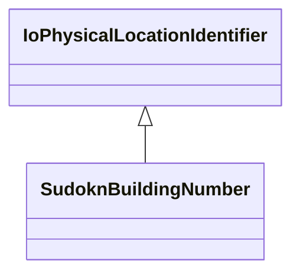

# Class: building number (sudokn_BuildingNumber)


This class occurs 1 times.


URI: [sudokn:BuildingNumber](http://asu.edu/semantics/SUDOKN/BuildingNumber)





## Inheritance
* [IoPhysicalLocationIdentifier](../classes/IoPhysicalLocationIdentifier.md)
    * **SudoknBuildingNumber**


## Slots

| Name | Cardinality and Range | Description | Inheritance | Occurrences |
| ---  | --- | --- | --- | --- |


## LinkML Source

<!-- TODO: investigate https://stackoverflow.com/questions/37606292/how-to-create-tabbed-code-blocks-in-mkdocs-or-sphinx -->

### Direct

<details>

```yaml
name: sudokn_BuildingNumber
title: building number
from_schema: okns:sudokn-kg
rank: 1000
is_a: io_PhysicalLocationIdentifier
class_uri: sudokn:BuildingNumber

```
</details>

### Induced

<details>

```yaml
name: sudokn_BuildingNumber
title: building number
from_schema: okns:sudokn-kg
rank: 1000
is_a: io_PhysicalLocationIdentifier
class_uri: sudokn:BuildingNumber

```
</details>