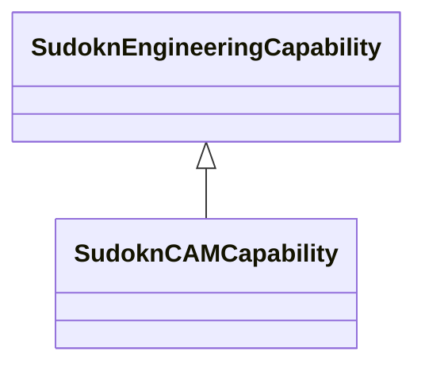

# Class: CAM capability (sudokn_CAMCapability)


URI: [sudokn:CAMCapability](http://asu.edu/semantics/SUDOKN/CAMCapability)





## Inheritance
* [IoscProductionCapability](../classes/IoscProductionCapability.md)
    * [SudoknEngineeringCapability](../classes/SudoknEngineeringCapability.md)
        * **SudoknCAMCapability**


## Slots

| Name | Cardinality and Range | Description | Inheritance | Occurrences |
| ---  | --- | --- | --- | --- |


## LinkML Source

<!-- TODO: investigate https://stackoverflow.com/questions/37606292/how-to-create-tabbed-code-blocks-in-mkdocs-or-sphinx -->

### Direct

<details>

```yaml
name: sudokn_CAMCapability
title: CAM capability
from_schema: okns:sudokn-kg
rank: 1000
is_a: sudokn_EngineeringCapability
class_uri: sudokn:CAMCapability

```
</details>

### Induced

<details>

```yaml
name: sudokn_CAMCapability
title: CAM capability
from_schema: okns:sudokn-kg
rank: 1000
is_a: sudokn_EngineeringCapability
class_uri: sudokn:CAMCapability

```
</details>