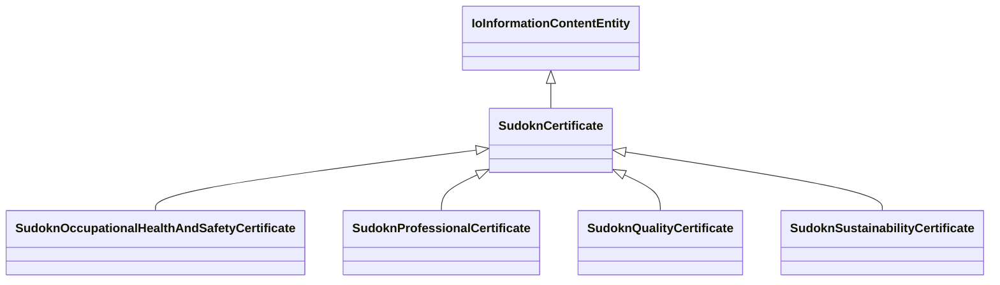

# Class: certificate (sudokn_Certificate)


URI: [sudokn:Certificate](http://asu.edu/semantics/SUDOKN/Certificate)





## Inheritance
* [IoInformationContentEntity](../classes/IoInformationContentEntity.md)
    * **SudoknCertificate**
        * [SudoknOccupationalHealthAndSafetyCertificate](../classes/SudoknOccupationalHealthAndSafetyCertificate.md)
        * [SudoknProfessionalCertificate](../classes/SudoknProfessionalCertificate.md)
        * [SudoknQualityCertificate](../classes/SudoknQualityCertificate.md)
        * [SudoknSustainabilityCertificate](../classes/SudoknSustainabilityCertificate.md)


## Slots

| Name | Cardinality and Range | Description | Inheritance | Occurrences |
| ---  | --- | --- | --- | --- |


## Usages

| used by | used in | type | used |
| ---  | --- | --- | --- |
| [IoManufacturer](../classes/IoManufacturer.md) | [sudokn_hasCertificate](../slots/sudokn_hasCertificate.md) | any_of[range] | [SudoknCertificate](../classes/SudoknCertificate.md) |
| [SudoknAS9100Certificate](../classes/SudoknAS9100Certificate.md) | [sudokn_attestsTo](../slots/sudokn_attestsTo.md) | domain | [SudoknCertificate](../classes/SudoknCertificate.md) |
| [SudoknISO9000Certificate](../classes/SudoknISO9000Certificate.md) | [sudokn_attestsTo](../slots/sudokn_attestsTo.md) | domain | [SudoknCertificate](../classes/SudoknCertificate.md) |


## LinkML Source

<!-- TODO: investigate https://stackoverflow.com/questions/37606292/how-to-create-tabbed-code-blocks-in-mkdocs-or-sphinx -->

### Direct

<details>

```yaml
name: sudokn_Certificate
title: certificate
from_schema: okns:sudokn-kg
rank: 1000
is_a: io_InformationContentEntity
class_uri: sudokn:Certificate

```
</details>

### Induced

<details>

```yaml
name: sudokn_Certificate
title: certificate
from_schema: okns:sudokn-kg
rank: 1000
is_a: io_InformationContentEntity
class_uri: sudokn:Certificate

```
</details>