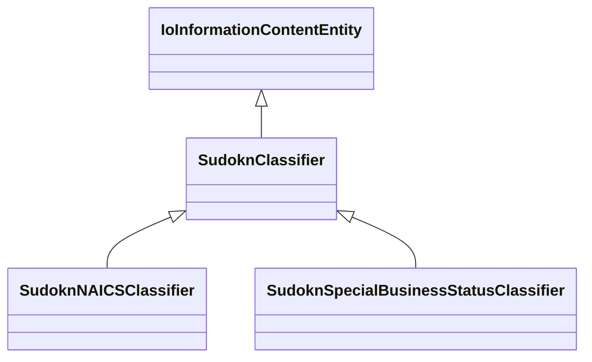

# Class: No class (type) name specified (sudokn_Classifier)


_No class (type) description specified_


This class occurs 0 times.


URI: [sudokn:Classifier](http://asu.edu/semantics/SUDOKN/Classifier)





## Inheritance
* [IoInformationContentEntity](../classes/IoInformationContentEntity.md)
    * **SudoknClassifier**
        * [SudoknNAICSClassifier](../classes/SudoknNAICSClassifier.md)
        * [SudoknSpecialBusinessStatusClassifier](../classes/SudoknSpecialBusinessStatusClassifier.md)


## Slots

| Name | Cardinality and Range | Description | Inheritance | Occurrences |
| ---  | --- | --- | --- | --- |


## LinkML Source

<!-- TODO: investigate https://stackoverflow.com/questions/37606292/how-to-create-tabbed-code-blocks-in-mkdocs-or-sphinx -->

### Direct

<details>

```yaml
name: sudokn_Classifier
conforms_to: No schema conformance document specified
annotations:
  count:
    tag: count
    value: 0
description: No class (type) description specified
title: No class (type) name specified
from_schema: sudokn-kg
rank: 1000
is_a: io_InformationContentEntity
class_uri: sudokn:Classifier

```
</details>

### Induced

<details>

```yaml
name: sudokn_Classifier
conforms_to: No schema conformance document specified
annotations:
  count:
    tag: count
    value: 0
description: No class (type) description specified
title: No class (type) name specified
from_schema: sudokn-kg
rank: 1000
is_a: io_InformationContentEntity
class_uri: sudokn:Classifier

```
</details>