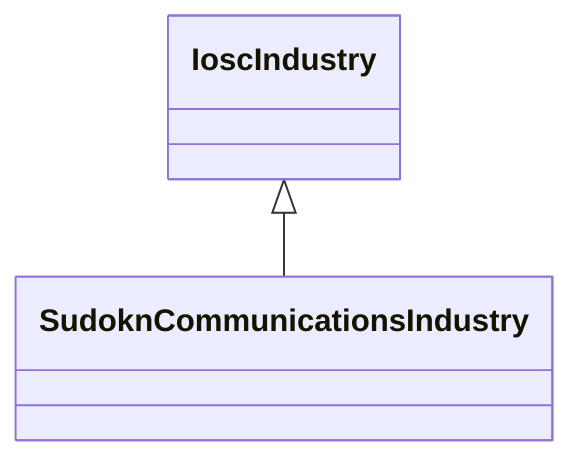

# Class: communication industry (sudokn_CommunicationsIndustry)


URI: [sudokn:CommunicationsIndustry](http://asu.edu/semantics/SUDOKN/CommunicationsIndustry)





## Inheritance
* [IoscIndustry](../classes/IoscIndustry.md)
    * **SudoknCommunicationsIndustry**


## Slots

| Name | Cardinality and Range | Description | Inheritance | Occurrences |
| ---  | --- | --- | --- | --- |


## LinkML Source

<!-- TODO: investigate https://stackoverflow.com/questions/37606292/how-to-create-tabbed-code-blocks-in-mkdocs-or-sphinx -->

### Direct

<details>

```yaml
name: sudokn_CommunicationsIndustry
title: communication industry
from_schema: okns:sudokn-kg
rank: 1000
is_a: iosc_Industry
class_uri: sudokn:CommunicationsIndustry

```
</details>

### Induced

<details>

```yaml
name: sudokn_CommunicationsIndustry
title: communication industry
from_schema: okns:sudokn-kg
rank: 1000
is_a: iosc_Industry
class_uri: sudokn:CommunicationsIndustry

```
</details>