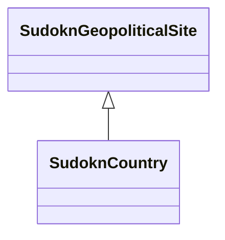

# Class: SudoknCountry


URI: [sudokn:Country](http://asu.edu/semantics/SUDOKN/Country)





## Inheritance
* [OboBFO0000029](../classes/OboBFO0000029.md)
    * [SudoknGeopoliticalSite](../classes/SudoknGeopoliticalSite.md)
        * **SudoknCountry**


## Slots

| Name | Cardinality and Range | Description | Inheritance | Occurrences |
| ---  | --- | --- | --- | --- |


## LinkML Source

<!-- TODO: investigate https://stackoverflow.com/questions/37606292/how-to-create-tabbed-code-blocks-in-mkdocs-or-sphinx -->

### Direct

<details>

```yaml
name: sudokn_Country
from_schema: okns:sudokn-kg
rank: 1000
is_a: sudokn_GeopoliticalSite
class_uri: sudokn:Country

```
</details>

### Induced

<details>

```yaml
name: sudokn_Country
from_schema: okns:sudokn-kg
rank: 1000
is_a: sudokn_GeopoliticalSite
class_uri: sudokn:Country

```
</details>