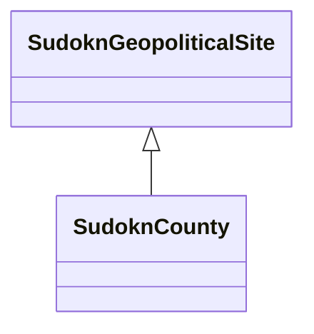

# Class: No class (type) name specified (sudokn_County)


_No class (type) description specified_


This class occurs 0 times.


URI: [sudokn:County](http://asu.edu/semantics/SUDOKN/County)





## Inheritance
* [OboBFO0000029](../classes/OboBFO0000029.md)
    * [SudoknGeopoliticalSite](../classes/SudoknGeopoliticalSite.md)
        * **SudoknCounty**


## Slots

| Name | Cardinality and Range | Description | Inheritance | Occurrences |
| ---  | --- | --- | --- | --- |


## LinkML Source

<!-- TODO: investigate https://stackoverflow.com/questions/37606292/how-to-create-tabbed-code-blocks-in-mkdocs-or-sphinx -->

### Direct

<details>

```yaml
name: sudokn_County
conforms_to: No schema conformance document specified
annotations:
  count:
    tag: count
    value: 0
description: No class (type) description specified
title: No class (type) name specified
from_schema: sudokn-kg
rank: 1000
is_a: sudokn_GeopoliticalSite
class_uri: sudokn:County

```
</details>

### Induced

<details>

```yaml
name: sudokn_County
conforms_to: No schema conformance document specified
annotations:
  count:
    tag: count
    value: 0
description: No class (type) description specified
title: No class (type) name specified
from_schema: sudokn-kg
rank: 1000
is_a: sudokn_GeopoliticalSite
class_uri: sudokn:County

```
</details>