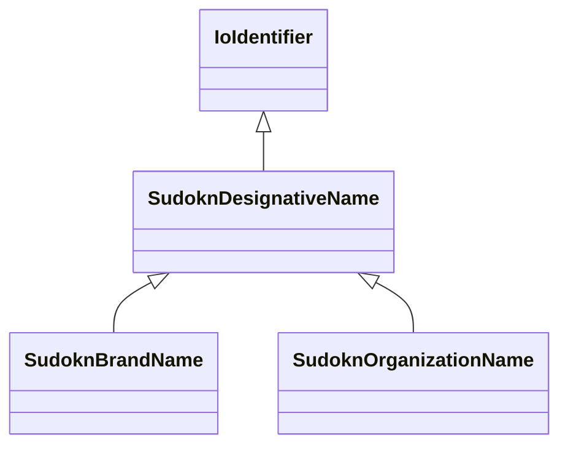

# Class: designative name (sudokn_DesignativeName)


_No type description provided_


URI: [sudokn:DesignativeName](http://asu.edu/semantics/SUDOKN/DesignativeName)





## Inheritance
* [IoIdentifier](../classes/IoIdentifier.md)
    * **SudoknDesignativeName**
        * [SudoknBrandName](../classes/SudoknBrandName.md)
        * [SudoknOrganizationName](../classes/SudoknOrganizationName.md)


## Slots

| Name | Cardinality and Range | Description | Inheritance |
| ---  | --- | --- | --- |


## TODOs

* TODO -- Todos for this class go here
* or you can delete the todos
* if you think the class is perfect.

## Identifier and Mapping Information


### Schema Source


* from schema: sudokn-kg


## Mappings

| Mapping Type | Mapped Value |
| ---  | ---  |
| self | sudokn:DesignativeName |
| native | sudokn-kg/:SudoknDesignativeName |


## LinkML Source

<!-- TODO: investigate https://stackoverflow.com/questions/37606292/how-to-create-tabbed-code-blocks-in-mkdocs-or-sphinx -->

### Direct

<details>
```yaml
name: sudokn_DesignativeName
description: No type description provided
title: designative name
todos:
- TODO -- Todos for this class go here
- or you can delete the todos
- if you think the class is perfect.
notes:
- Class with 0 occurences.
from_schema: sudokn-kg
rank: 1000
is_a: io_Identifier
class_uri: sudokn:DesignativeName

```
</details>

### Induced

<details>
```yaml
name: sudokn_DesignativeName
description: No type description provided
title: designative name
todos:
- TODO -- Todos for this class go here
- or you can delete the todos
- if you think the class is perfect.
notes:
- Class with 0 occurences.
from_schema: sudokn-kg
rank: 1000
is_a: io_Identifier
class_uri: sudokn:DesignativeName

```
</details>