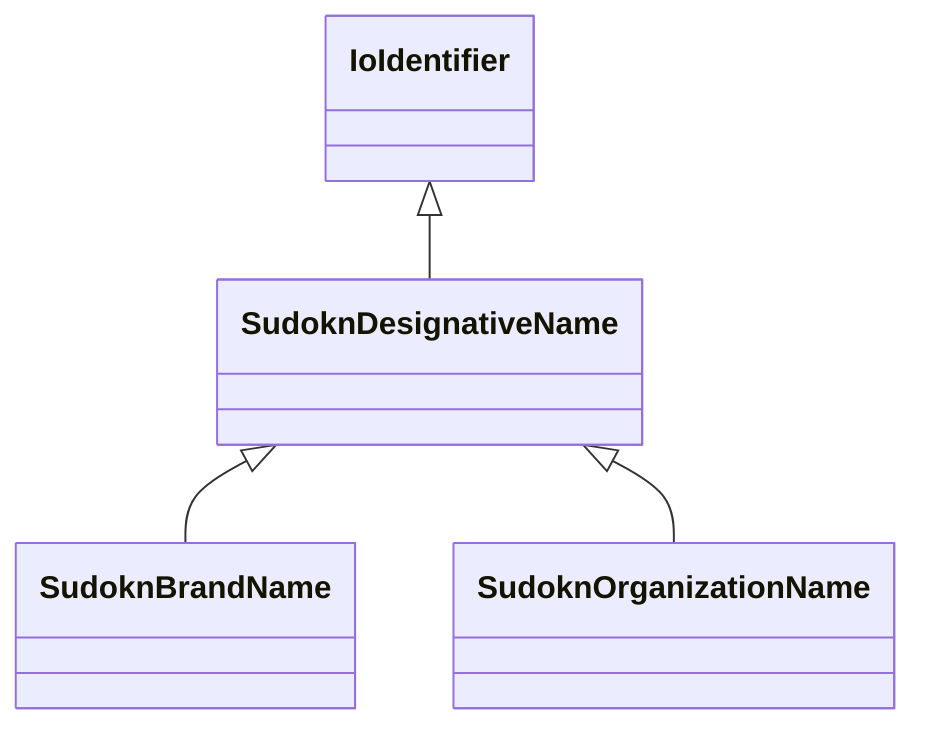

# Class: designative name (sudokn_DesignativeName)


URI: [sudokn:DesignativeName](http://asu.edu/semantics/SUDOKN/DesignativeName)





## Inheritance
* [IoIdentifier](../classes/IoIdentifier.md)
    * **SudoknDesignativeName**
        * [SudoknBrandName](../classes/SudoknBrandName.md)
        * [SudoknOrganizationName](../classes/SudoknOrganizationName.md)


## Slots

| Name | Cardinality and Range | Description | Inheritance | Occurrences |
| ---  | --- | --- | --- | --- |


## LinkML Source

<!-- TODO: investigate https://stackoverflow.com/questions/37606292/how-to-create-tabbed-code-blocks-in-mkdocs-or-sphinx -->

### Direct

<details>

```yaml
name: sudokn_DesignativeName
title: designative name
from_schema: okns:sudokn-kg
rank: 1000
is_a: io_Identifier
class_uri: sudokn:DesignativeName

```
</details>

### Induced

<details>

```yaml
name: sudokn_DesignativeName
title: designative name
from_schema: okns:sudokn-kg
rank: 1000
is_a: io_Identifier
class_uri: sudokn:DesignativeName

```
</details>