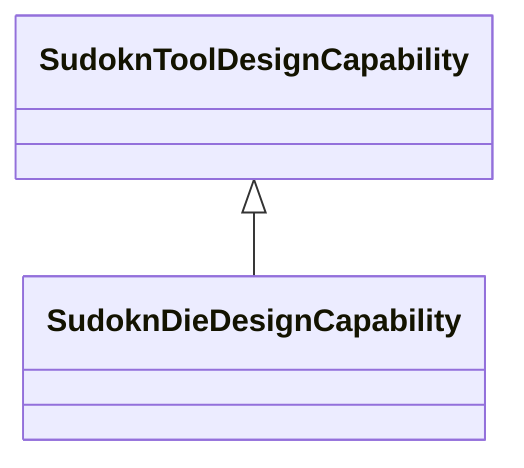

# Class: die design capability (sudokn_DieDesignCapability)


URI: [sudokn:DieDesignCapability](http://asu.edu/semantics/SUDOKN/DieDesignCapability)





## Inheritance
* [IoscProductionCapability](../classes/IoscProductionCapability.md)
    * [SudoknEngineeringCapability](../classes/SudoknEngineeringCapability.md)
        * [SudoknToolDesignCapability](../classes/SudoknToolDesignCapability.md)
            * **SudoknDieDesignCapability**


## Slots

| Name | Cardinality and Range | Description | Inheritance | Occurrences |
| ---  | --- | --- | --- | --- |


## LinkML Source

<!-- TODO: investigate https://stackoverflow.com/questions/37606292/how-to-create-tabbed-code-blocks-in-mkdocs-or-sphinx -->

### Direct

<details>

```yaml
name: sudokn_DieDesignCapability
title: die design capability
from_schema: okns:sudokn-kg
rank: 1000
is_a: sudokn_ToolDesignCapability
class_uri: sudokn:DieDesignCapability

```
</details>

### Induced

<details>

```yaml
name: sudokn_DieDesignCapability
title: die design capability
from_schema: okns:sudokn-kg
rank: 1000
is_a: sudokn_ToolDesignCapability
class_uri: sudokn:DieDesignCapability

```
</details>