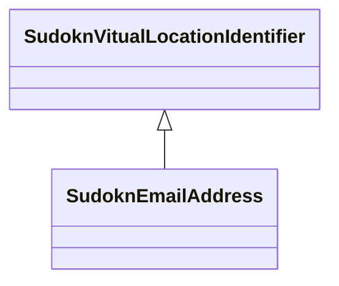

# Class: No class (type) name specified (sudokn_EmailAddress)


_No class (type) description specified_


This class occurs 1 times.


URI: [sudokn:EmailAddress](http://asu.edu/semantics/SUDOKN/EmailAddress)





## Inheritance
* [IoIdentifier](../classes/IoIdentifier.md)
    * [SudoknVitualLocationIdentifier](../classes/SudoknVitualLocationIdentifier.md)
        * **SudoknEmailAddress**


## Slots

| Name | Cardinality and Range | Description | Inheritance | Occurrences |
| ---  | --- | --- | --- | --- |


## Usages

| used by | used in | type | used |
| ---  | --- | --- | --- |
| [IoManufacturer](../classes/IoManufacturer.md) | [sudokn_hasEmailAddress](../slots/sudokn_hasEmailAddress.md) | any_of[range] | [SudoknEmailAddress](../classes/SudoknEmailAddress.md) |
| [OwlNamedIndividual](../classes/OwlNamedIndividual.md) | [sudokn_hasEmailAddress](../slots/sudokn_hasEmailAddress.md) | any_of[range] | [SudoknEmailAddress](../classes/SudoknEmailAddress.md) |


## LinkML Source

<!-- TODO: investigate https://stackoverflow.com/questions/37606292/how-to-create-tabbed-code-blocks-in-mkdocs-or-sphinx -->

### Direct

<details>

```yaml
name: sudokn_EmailAddress
conforms_to: No schema conformance document specified
annotations:
  count:
    tag: count
    value: 1
description: No class (type) description specified
title: No class (type) name specified
from_schema: sudokn-kg
rank: 1000
is_a: sudokn_VitualLocationIdentifier
class_uri: sudokn:EmailAddress

```
</details>

### Induced

<details>

```yaml
name: sudokn_EmailAddress
conforms_to: No schema conformance document specified
annotations:
  count:
    tag: count
    value: 1
description: No class (type) description specified
title: No class (type) name specified
from_schema: sudokn-kg
rank: 1000
is_a: sudokn_VitualLocationIdentifier
class_uri: sudokn:EmailAddress

```
</details>