# Class: engineering capability (sudokn_EngineeringCapability)


URI: [sudokn:EngineeringCapability](http://asu.edu/semantics/SUDOKN/EngineeringCapability)

```mermaid
 classDiagram
    class SudoknEngineeringCapability
    click SudoknEngineeringCapability href "../SudoknEngineeringCapability"
      IoscProductionCapability <|-- SudoknEngineeringCapability
        click IoscProductionCapability href "../IoscProductionCapability"
      

      SudoknEngineeringCapability <|-- SudoknCADCAMCapability
        click SudoknCADCAMCapability href "../SudoknCADCAMCapability"
      SudoknEngineeringCapability <|-- SudoknCADCapability
        click SudoknCADCapability href "../SudoknCADCapability"
      SudoknEngineeringCapability <|-- SudoknCAECapability
        click SudoknCAECapability href "../SudoknCAECapability"
      SudoknEngineeringCapability <|-- SudoknCAMCapability
        click SudoknCAMCapability href "../SudoknCAMCapability"
      SudoknEngineeringCapability <|-- SudoknEngineeringDesignCapability
        click SudoknEngineeringDesignCapability href "../SudoknEngineeringDesignCapability"
      SudoknEngineeringCapability <|-- SudoknPLCProgrammingCapability
        click SudoknPLCProgrammingCapability href "../SudoknPLCProgrammingCapability"
      SudoknEngineeringCapability <|-- SudoknRapidPrototypingCapability
        click SudoknRapidPrototypingCapability href "../SudoknRapidPrototypingCapability"
      SudoknEngineeringCapability <|-- SudoknReverseEngineeringCapability
        click SudoknReverseEngineeringCapability href "../SudoknReverseEngineeringCapability"
      SudoknEngineeringCapability <|-- SudoknToolDesignCapability
        click SudoknToolDesignCapability href "../SudoknToolDesignCapability"
      
      
      
```





## Inheritance
* [IoscProductionCapability](../classes/IoscProductionCapability.md)
    * **SudoknEngineeringCapability**
        * [SudoknCADCAMCapability](../classes/SudoknCADCAMCapability.md)
        * [SudoknCADCapability](../classes/SudoknCADCapability.md)
        * [SudoknCAECapability](../classes/SudoknCAECapability.md)
        * [SudoknCAMCapability](../classes/SudoknCAMCapability.md)
        * [SudoknEngineeringDesignCapability](../classes/SudoknEngineeringDesignCapability.md)
        * [SudoknPLCProgrammingCapability](../classes/SudoknPLCProgrammingCapability.md)
        * [SudoknRapidPrototypingCapability](../classes/SudoknRapidPrototypingCapability.md)
        * [SudoknReverseEngineeringCapability](../classes/SudoknReverseEngineeringCapability.md)
        * [SudoknToolDesignCapability](../classes/SudoknToolDesignCapability.md)


## Slots

| Name | Cardinality and Range | Description | Inheritance | Occurrences |
| ---  | --- | --- | --- | --- |


## LinkML Source

<!-- TODO: investigate https://stackoverflow.com/questions/37606292/how-to-create-tabbed-code-blocks-in-mkdocs-or-sphinx -->

### Direct

<details>

```yaml
name: sudokn_EngineeringCapability
title: engineering capability
from_schema: okns:sudokn-kg
rank: 1000
is_a: iosc_ProductionCapability
class_uri: sudokn:EngineeringCapability

```
</details>

### Induced

<details>

```yaml
name: sudokn_EngineeringCapability
title: engineering capability
from_schema: okns:sudokn-kg
rank: 1000
is_a: iosc_ProductionCapability
class_uri: sudokn:EngineeringCapability

```
</details>