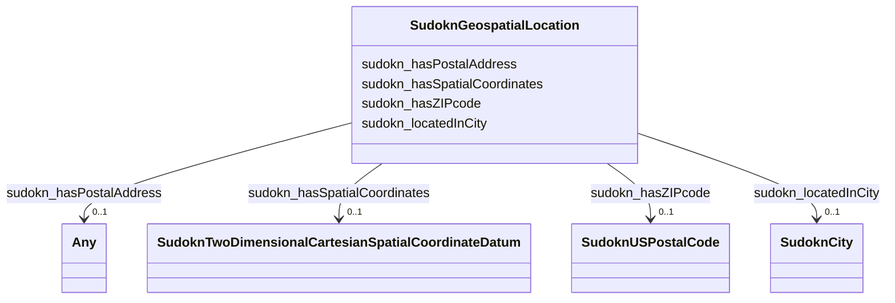

# Class: No class (type) name specified (sudokn_GeospatialLocation)


_No class (type) description specified_


This class occurs 20728 times.


URI: [sudokn:GeospatialLocation](http://asu.edu/semantics/SUDOKN/GeospatialLocation)





<!-- no inheritance hierarchy -->


## Slots

| Name | Cardinality and Range | Description | Inheritance | Occurrences |
| ---  | --- | --- | --- | --- |
| [sudokn_hasZIPcode](../slots/sudokn_hasZIPcode.md) | 0..1 <br/> [SudoknUSPostalCode](../classes/SudoknUSPostalCode.md) | No slot (predicate) description specified <br/>  | direct | 20424 |
| [sudokn_hasSpatialCoordinates](../slots/sudokn_hasSpatialCoordinates.md) | 0..1 <br/> [SudoknTwoDimensionalCartesianSpatialCoordinateDatum](../classes/SudoknTwoDimensionalCartesianSpatialCoordinateDatum.md) | No slot (predicate) description specified <br/>  | direct | 20728 |
| [sudokn_locatedInCity](../slots/sudokn_locatedInCity.md) | 0..1 <br/> [SudoknCity](../classes/SudoknCity.md) | No slot (predicate) description specified <br/>  | direct | 19022 |
| [sudokn_hasPostalAddress](../slots/sudokn_hasPostalAddress.md) | 0..1 <br/> [OwlNamedIndividual](../classes/OwlNamedIndividual.md)&nbsp;or&nbsp;<br />[SudoknPostalAddress](../classes/SudoknPostalAddress.md)&nbsp;or&nbsp;<br />[SudoknUnitedStatesPostalCode](../classes/SudoknUnitedStatesPostalCode.md)&nbsp;or&nbsp;<br />[xsd:anyURI](http://www.w3.org/2001/XMLSchema#anyURI) | No slot (predicate) description specified <br/>  | direct | 9362 |


## Usages

| used by | used in | type | used |
| ---  | --- | --- | --- |
| [IoManufacturer](../classes/IoManufacturer.md) | [sudokn_organizationLocatedIn](../slots/sudokn_organizationLocatedIn.md) | range | [SudoknGeospatialLocation](../classes/SudoknGeospatialLocation.md) |


## LinkML Source

<!-- TODO: investigate https://stackoverflow.com/questions/37606292/how-to-create-tabbed-code-blocks-in-mkdocs-or-sphinx -->

### Direct

<details>

```yaml
name: sudokn_GeospatialLocation
conforms_to: No schema conformance document specified
annotations:
  count:
    tag: count
    value: 20728
description: No class (type) description specified
title: No class (type) name specified
from_schema: sudokn-kg
rank: 1000
slots:
- sudokn_hasZIPcode
- sudokn_hasSpatialCoordinates
- sudokn_locatedInCity
- sudokn_hasPostalAddress
slot_usage:
  sudokn_hasPostalAddress:
    name: sudokn_hasPostalAddress
    annotations:
      sudokn_PostalAddress:
        tag: sudokn_PostalAddress
        value: 6948
      uri:
        tag: uri
        value: 2414
  sudokn_hasSpatialCoordinates:
    name: sudokn_hasSpatialCoordinates
    annotations:
      sudokn_TwoDimensionalCartesianSpatialCoordinateDatum:
        tag: sudokn_TwoDimensionalCartesianSpatialCoordinateDatum
        value: 20728
  sudokn_hasZIPcode:
    name: sudokn_hasZIPcode
    annotations:
      sudokn_USPostalCode:
        tag: sudokn_USPostalCode
        value: 20424
  sudokn_locatedInCity:
    name: sudokn_locatedInCity
    annotations:
      sudokn_City:
        tag: sudokn_City
        value: 19022
class_uri: sudokn:GeospatialLocation

```
</details>

### Induced

<details>

```yaml
name: sudokn_GeospatialLocation
conforms_to: No schema conformance document specified
annotations:
  count:
    tag: count
    value: 20728
description: No class (type) description specified
title: No class (type) name specified
from_schema: sudokn-kg
rank: 1000
slot_usage:
  sudokn_hasPostalAddress:
    name: sudokn_hasPostalAddress
    annotations:
      sudokn_PostalAddress:
        tag: sudokn_PostalAddress
        value: 6948
      uri:
        tag: uri
        value: 2414
  sudokn_hasSpatialCoordinates:
    name: sudokn_hasSpatialCoordinates
    annotations:
      sudokn_TwoDimensionalCartesianSpatialCoordinateDatum:
        tag: sudokn_TwoDimensionalCartesianSpatialCoordinateDatum
        value: 20728
  sudokn_hasZIPcode:
    name: sudokn_hasZIPcode
    annotations:
      sudokn_USPostalCode:
        tag: sudokn_USPostalCode
        value: 20424
  sudokn_locatedInCity:
    name: sudokn_locatedInCity
    annotations:
      sudokn_City:
        tag: sudokn_City
        value: 19022
attributes:
  sudokn_hasZIPcode:
    name: sudokn_hasZIPcode
    annotations:
      sudokn_USPostalCode:
        tag: sudokn_USPostalCode
        value: 20424
    description: No slot (predicate) description specified
    examples:
    - object:
        example_object: sudokn:101PIPE-site-zip
        example_object_type: sudokn_USPostalCode
        example_predicate: sudokn:hasZIPcode
        example_subject: sudokn:101PIPE-site
        example_subject_type: sudokn_GeospatialLocation
    from_schema: sudokn-kg
    rank: 1000
    slot_uri: sudokn:hasZIPcode
    alias: sudokn_hasZIPcode
    owner: sudokn_GeospatialLocation
    domain_of:
    - sudokn_GeospatialLocation
    range: sudokn_USPostalCode
  sudokn_hasSpatialCoordinates:
    name: sudokn_hasSpatialCoordinates
    annotations:
      sudokn_TwoDimensionalCartesianSpatialCoordinateDatum:
        tag: sudokn_TwoDimensionalCartesianSpatialCoordinateDatum
        value: 20728
    description: No slot (predicate) description specified
    title: No slot (predicate) name specified
    examples:
    - object:
        example_object: sudokn:101PIPE-site-coordinates
        example_object_type: sudokn_TwoDimensionalCartesianSpatialCoordinateDatum
        example_predicate: sudokn:hasSpatialCoordinates
        example_subject: sudokn:101PIPE-site
        example_subject_type: sudokn_GeospatialLocation
    from_schema: sudokn-kg
    rank: 1000
    slot_uri: sudokn:hasSpatialCoordinates
    alias: sudokn_hasSpatialCoordinates
    owner: sudokn_GeospatialLocation
    domain_of:
    - sudokn_GeospatialLocation
    range: sudokn_TwoDimensionalCartesianSpatialCoordinateDatum
  sudokn_locatedInCity:
    name: sudokn_locatedInCity
    annotations:
      sudokn_City:
        tag: sudokn_City
        value: 19022
    description: No slot (predicate) description specified
    examples:
    - object:
        example_object: sudokn:FONTANA-City
        example_object_type: sudokn_City
        example_predicate: sudokn:locatedInCity
        example_subject: sudokn:101PIPE-site
        example_subject_type: sudokn_GeospatialLocation
    from_schema: sudokn-kg
    rank: 1000
    slot_uri: sudokn:locatedInCity
    alias: sudokn_locatedInCity
    owner: sudokn_GeospatialLocation
    domain_of:
    - sudokn_GeospatialLocation
    range: sudokn_City
  sudokn_hasPostalAddress:
    name: sudokn_hasPostalAddress
    annotations:
      sudokn_PostalAddress:
        tag: sudokn_PostalAddress
        value: 6948
      uri:
        tag: uri
        value: 2414
    description: No slot (predicate) description specified
    title: No slot (predicate) name specified
    examples:
    - object:
        example_object: sudokn:101PIPE-site-FONTANA-92335-postal-address
        example_object_type: sudokn_PostalAddress
        example_predicate: sudokn:hasPostalAddress
        example_subject: sudokn:101PIPE-site-FONTANA-92335
        example_subject_type: sudokn_GeospatialLocation
    - object:
        example_object: sudokn:4FELDCO-site-DESPLAINES-60018-postal-address
        example_object_type: uri
        example_predicate: sudokn:hasPostalAddress
        example_subject: sudokn:4FELDCO-site-DESPLAINES-60018
        example_subject_type: sudokn_GeospatialLocation
    - object:
        example_object: sudokn:/UnitedStatesPostalCode_1
        example_object_type: owl_NamedIndividual
        example_predicate: sudokn:hasPostalAddress
        example_subject: sudokn:/Manufacturer_1
        example_subject_type: owl_NamedIndividual
    - object:
        example_object: sudokn:/UnitedStatesPostalCode_1
        example_object_type: sudokn_UnitedStatesPostalCode
        example_predicate: sudokn:hasPostalAddress
        example_subject: sudokn:/Manufacturer_1
        example_subject_type: owl_NamedIndividual
    - object:
        example_object: sudokn:/UnitedStatesPostalCode_1
        example_object_type: owl_NamedIndividual
        example_predicate: sudokn:hasPostalAddress
        example_subject: sudokn:/Manufacturer_1
        example_subject_type: io_Manufacturer
    - object:
        example_object: sudokn:/UnitedStatesPostalCode_1
        example_object_type: sudokn_UnitedStatesPostalCode
        example_predicate: sudokn:hasPostalAddress
        example_subject: sudokn:/Manufacturer_1
        example_subject_type: io_Manufacturer
    - object:
        example_object: sudokn:101PIPE-PostalAddress
        example_object_type: sudokn_PostalAddress
        example_predicate: sudokn:hasPostalAddress
        example_subject: sudokn:101PIPE-company-inst
        example_subject_type: io_Manufacturer
    from_schema: sudokn-kg
    rank: 1000
    slot_uri: sudokn:hasPostalAddress
    alias: sudokn_hasPostalAddress
    owner: sudokn_GeospatialLocation
    domain_of:
    - io_Manufacturer
    - owl_NamedIndividual
    - sudokn_GeospatialLocation
    range: Any
    any_of:
    - range: owl_NamedIndividual
    - range: sudokn_PostalAddress
    - range: sudokn_UnitedStatesPostalCode
    - range: uri
class_uri: sudokn:GeospatialLocation

```
</details>