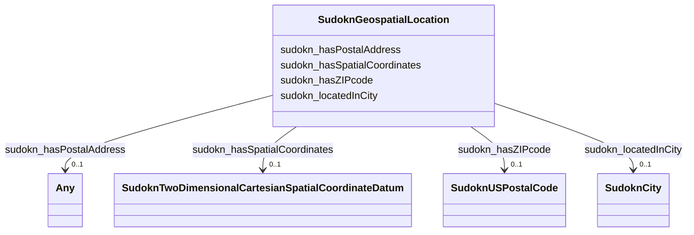

# Class: TODO -- what's a good name for this class (type)? (sudokn_GeospatialLocation)


_No type description provided_


URI: [sudokn:GeospatialLocation](http://asu.edu/semantics/SUDOKN/GeospatialLocation)





<!-- no inheritance hierarchy -->


## Slots

| Name | Cardinality and Range | Description | Inheritance |
| ---  | --- | --- | --- |
| [sudokn_hasZIPcode](../slots/sudokn_hasZIPcode.md) | 0..1 <br/> [SudoknUSPostalCode](../classes/SudoknUSPostalCode.md) | No slot description provided | direct |
| [sudokn_hasPostalAddress](../slots/sudokn_hasPostalAddress.md) | 0..1 <br/> [SudoknPostalAddress](../classes/SudoknPostalAddress.md)&nbsp;or&nbsp;<br />[SudoknUnitedStatesPostalCode](../classes/SudoknUnitedStatesPostalCode.md)&nbsp;or&nbsp;<br />[xsd:anyURI](http://www.w3.org/2001/XMLSchema#anyURI) | No slot description provided | direct |
| [sudokn_hasSpatialCoordinates](../slots/sudokn_hasSpatialCoordinates.md) | 0..1 <br/> [SudoknTwoDimensionalCartesianSpatialCoordinateDatum](../classes/SudoknTwoDimensionalCartesianSpatialCoordinateDatum.md) | No slot description provided | direct |
| [sudokn_locatedInCity](../slots/sudokn_locatedInCity.md) | 0..1 <br/> [SudoknCity](../classes/SudoknCity.md) | No slot description provided | direct |


## Usages

| used by | used in | type | used |
| ---  | --- | --- | --- |
| [IoManufacturer](../classes/IoManufacturer.md) | [sudokn_organizationLocatedIn](../slots/sudokn_organizationLocatedIn.md) | range | [SudoknGeospatialLocation](../classes/SudoknGeospatialLocation.md) |


## TODOs

* TODO -- Todos for this class go here
* or you can delete the todos
* if you think the class is perfect.

## Identifier and Mapping Information


### Schema Source


* from schema: sudokn-kg


## Mappings

| Mapping Type | Mapped Value |
| ---  | ---  |
| self | sudokn:GeospatialLocation |
| native | sudokn-kg/:SudoknGeospatialLocation |


## LinkML Source

<!-- TODO: investigate https://stackoverflow.com/questions/37606292/how-to-create-tabbed-code-blocks-in-mkdocs-or-sphinx -->

### Direct

<details>
```yaml
name: sudokn_GeospatialLocation
description: No type description provided
title: TODO -- what's a good name for this class (type)?
todos:
- TODO -- Todos for this class go here
- or you can delete the todos
- if you think the class is perfect.
notes:
- Class with 20728 occurences.
from_schema: sudokn-kg
rank: 1000
slots:
- sudokn_hasZIPcode
- sudokn_hasPostalAddress
- sudokn_hasSpatialCoordinates
- sudokn_locatedInCity
class_uri: sudokn:GeospatialLocation

```
</details>

### Induced

<details>
```yaml
name: sudokn_GeospatialLocation
description: No type description provided
title: TODO -- what's a good name for this class (type)?
todos:
- TODO -- Todos for this class go here
- or you can delete the todos
- if you think the class is perfect.
notes:
- Class with 20728 occurences.
from_schema: sudokn-kg
rank: 1000
attributes:
  sudokn_hasZIPcode:
    name: sudokn_hasZIPcode
    description: No slot description provided
    todos:
    - TODO -- Todos for this slot go here
    - or you can delete the todos
    - if you think the class is perfect.
    comments:
    - 20424 occurrences with subject type sudokn_GeospatialLocation and object type
      sudokn_USPostalCode.
    examples:
    - value: sudokn:ZYMACHINING-site sudokn:hasZIPcode sudokn:ZYMACHINING-site-zip
    from_schema: sudokn-kg
    rank: 1000
    slot_uri: sudokn:hasZIPcode
    alias: sudokn_hasZIPcode
    owner: sudokn_GeospatialLocation
    domain_of:
    - sudokn_GeospatialLocation
    range: sudokn_USPostalCode
  sudokn_hasPostalAddress:
    name: sudokn_hasPostalAddress
    description: No slot description provided
    title: has postal address
    todos:
    - TODO -- Todos for this slot go here
    - or you can delete the todos
    - if you think the class is perfect.
    comments:
    - 6948 occurrences with subject type sudokn_GeospatialLocation and object type
      sudokn_PostalAddress.
    - 2414 occurrences with subject type sudokn_GeospatialLocation and object type
      uri.
    - 1 occurrences with subject type owl_NamedIndividual and object type sudokn_UnitedStatesPostalCode.
    - 11366 occurrences with subject type io_Manufacturer and object type sudokn_PostalAddress.
    examples:
    - value: sudokn:ZURN-site-SANFORD-27330 sudokn:hasPostalAddress sudokn:ZURN-site-SANFORD-27330-postal-address
    - value: sudokn:4FELDCO-site-DESPLAINES-60018 sudokn:hasPostalAddress sudokn:4FELDCO-site-DESPLAINES-60018-postal-address
    - value: sudokn:/Manufacturer_1 sudokn:hasPostalAddress sudokn:/UnitedStatesPostalCode_1
    - value: sudokn:qualityproducts sudokn:hasPostalAddress sudokn:qualityproducts-PostalAddress
    from_schema: sudokn-kg
    rank: 1000
    slot_uri: sudokn:hasPostalAddress
    alias: sudokn_hasPostalAddress
    owner: sudokn_GeospatialLocation
    domain_of:
    - io_Manufacturer
    - owl_NamedIndividual
    - sudokn_GeospatialLocation
    subproperty_of: io_denotedBy
    range: Any
    any_of:
    - range: sudokn_PostalAddress
    - range: sudokn_UnitedStatesPostalCode
    - range: uri
  sudokn_hasSpatialCoordinates:
    name: sudokn_hasSpatialCoordinates
    description: No slot description provided
    title: has spatial coordinates
    todos:
    - TODO -- Todos for this slot go here
    - or you can delete the todos
    - if you think the class is perfect.
    comments:
    - 20728 occurrences with subject type sudokn_GeospatialLocation and object type
      sudokn_TwoDimensionalCartesianSpatialCoordinateDatum.
    examples:
    - value: sudokn:qualityproducts-Site sudokn:hasSpatialCoordinates sudokn:qualityproducts-Coordinates
    from_schema: sudokn-kg
    rank: 1000
    slot_uri: sudokn:hasSpatialCoordinates
    alias: sudokn_hasSpatialCoordinates
    owner: sudokn_GeospatialLocation
    domain_of:
    - sudokn_GeospatialLocation
    subproperty_of: io_denotedBy
    range: sudokn_TwoDimensionalCartesianSpatialCoordinateDatum
  sudokn_locatedInCity:
    name: sudokn_locatedInCity
    description: No slot description provided
    todos:
    - TODO -- Todos for this slot go here
    - or you can delete the todos
    - if you think the class is perfect.
    comments:
    - 19022 occurrences with subject type sudokn_GeospatialLocation and object type
      sudokn_City.
    examples:
    - value: sudokn:qualityproducts-Site sudokn:locatedInCity sudokn:Salisbury-City
    from_schema: sudokn-kg
    rank: 1000
    slot_uri: sudokn:locatedInCity
    alias: sudokn_locatedInCity
    owner: sudokn_GeospatialLocation
    domain_of:
    - sudokn_GeospatialLocation
    range: sudokn_City
class_uri: sudokn:GeospatialLocation

```
</details>