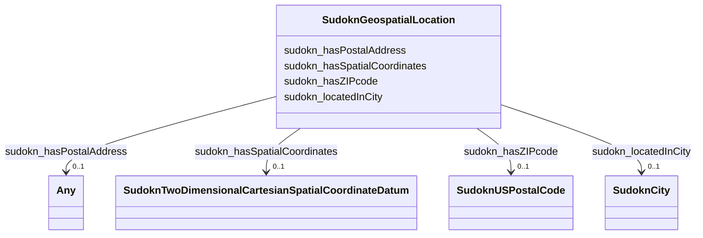

# Class: SudoknGeospatialLocation


This class occurs 20728 times.


URI: [sudokn:GeospatialLocation](http://asu.edu/semantics/SUDOKN/GeospatialLocation)





<!-- no inheritance hierarchy -->


## Slots

| Name | Cardinality and Range | Description | Inheritance | Occurrences |
| ---  | --- | --- | --- | --- |
| [sudokn_locatedInCity](../slots/sudokn_locatedInCity.md) | 0..1 <br/> [SudoknCity](../classes/SudoknCity.md) |  <br/>  | direct | 19022 |
| [sudokn_hasSpatialCoordinates](../slots/sudokn_hasSpatialCoordinates.md) | 0..1 <br/> [SudoknTwoDimensionalCartesianSpatialCoordinateDatum](../classes/SudoknTwoDimensionalCartesianSpatialCoordinateDatum.md) |  <br/>  | direct | 20728 |
| [sudokn_hasZIPcode](../slots/sudokn_hasZIPcode.md) | 0..1 <br/> [SudoknUSPostalCode](../classes/SudoknUSPostalCode.md) |  <br/>  | direct | 20424 |
| [sudokn_hasPostalAddress](../slots/sudokn_hasPostalAddress.md) | 0..1 <br/> [SudoknPostalAddress](../classes/SudoknPostalAddress.md)&nbsp;or&nbsp;<br />[OwlNamedIndividual](../classes/OwlNamedIndividual.md)&nbsp;or&nbsp;<br />[SudoknUSPostalCode](../classes/SudoknUSPostalCode.md)&nbsp;or&nbsp;<br />[xsd:anyURI](http://www.w3.org/2001/XMLSchema#anyURI) |  <br/>  | direct | 9362 |


## Usages

| used by | used in | type | used |
| ---  | --- | --- | --- |
| [IoManufacturer](../classes/IoManufacturer.md) | [sudokn_organizationLocatedIn](../slots/sudokn_organizationLocatedIn.md) | range | [SudoknGeospatialLocation](../classes/SudoknGeospatialLocation.md) |


## LinkML Source

<!-- TODO: investigate https://stackoverflow.com/questions/37606292/how-to-create-tabbed-code-blocks-in-mkdocs-or-sphinx -->

### Direct

<details>

```yaml
name: sudokn_GeospatialLocation
from_schema: okns:sudokn-kg
rank: 1000
slots:
- sudokn_locatedInCity
- sudokn_hasSpatialCoordinates
- sudokn_hasZIPcode
- sudokn_hasPostalAddress
class_uri: sudokn:GeospatialLocation

```
</details>

### Induced

<details>

```yaml
name: sudokn_GeospatialLocation
from_schema: okns:sudokn-kg
rank: 1000
attributes:
  sudokn_locatedInCity:
    name: sudokn_locatedInCity
    title: located in city
    from_schema: okns:sudokn-kg
    rank: 1000
    domain: iosc_GeospatialSite
    slot_uri: sudokn:locatedInCity
    alias: sudokn_locatedInCity
    owner: sudokn_GeospatialLocation
    domain_of:
    - sudokn_GeospatialLocation
    subproperty_of: obo_BFO_0000171
    range: sudokn_City
  sudokn_hasSpatialCoordinates:
    name: sudokn_hasSpatialCoordinates
    title: has spatial coordinates
    from_schema: okns:sudokn-kg
    rank: 1000
    slot_uri: sudokn:hasSpatialCoordinates
    alias: sudokn_hasSpatialCoordinates
    owner: sudokn_GeospatialLocation
    domain_of:
    - sudokn_GeospatialLocation
    subproperty_of: io_denotedBy
    range: sudokn_TwoDimensionalCartesianSpatialCoordinateDatum
  sudokn_hasZIPcode:
    name: sudokn_hasZIPcode
    from_schema: okns:sudokn-kg
    rank: 1000
    slot_uri: sudokn:hasZIPcode
    alias: sudokn_hasZIPcode
    owner: sudokn_GeospatialLocation
    domain_of:
    - sudokn_GeospatialLocation
    range: sudokn_USPostalCode
  sudokn_hasPostalAddress:
    name: sudokn_hasPostalAddress
    title: has postal address
    from_schema: okns:sudokn-kg
    rank: 1000
    slot_uri: sudokn:hasPostalAddress
    alias: sudokn_hasPostalAddress
    owner: sudokn_GeospatialLocation
    domain_of:
    - io_Manufacturer
    - sudokn_GeospatialLocation
    subproperty_of: io_denotedBy
    range: Any
    any_of:
    - range: sudokn_PostalAddress
    - range: owl_NamedIndividual
    - range: sudokn_USPostalCode
    - range: uri
class_uri: sudokn:GeospatialLocation

```
</details>