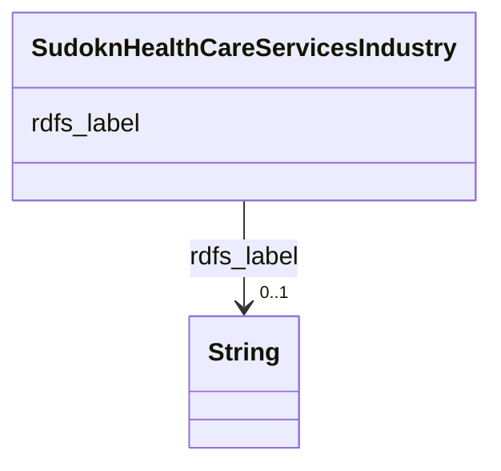

# Class: TODO -- what's a good name for this class (type)? (sudokn_HealthCareServicesIndustry)


_No type description provided_


URI: [sudokn:HealthCareServicesIndustry](http://asu.edu/semantics/SUDOKN/HealthCareServicesIndustry)





<!-- no inheritance hierarchy -->


## Slots

| Name | Cardinality and Range | Description | Inheritance |
| ---  | --- | --- | --- |
| [rdfs_label](../slots/rdfs_label.md) | 0..1 <br/> [xsd:string](http://www.w3.org/2001/XMLSchema#string) | No slot description provided | direct |


## Usages

| used by | used in | type | used |
| ---  | --- | --- | --- |
| [IoManufacturer](../classes/IoManufacturer.md) | [sudokn_suppliesToIndustry](../slots/sudokn_suppliesToIndustry.md) | any_of[range] | [SudoknHealthCareServicesIndustry](../classes/SudoknHealthCareServicesIndustry.md) |
| [OwlNamedIndividual](../classes/OwlNamedIndividual.md) | [sudokn_suppliesToIndustry](../slots/sudokn_suppliesToIndustry.md) | any_of[range] | [SudoknHealthCareServicesIndustry](../classes/SudoknHealthCareServicesIndustry.md) |


## Examples

| Value |
| --- |
| sudokn:HealthCareServices-Industry |

## TODOs

* TODO -- Todos for this class go here
* or you can delete the todos
* if you think the class is perfect.

## Identifier and Mapping Information


### Schema Source


* from schema: sudokn-kg


## Mappings

| Mapping Type | Mapped Value |
| ---  | ---  |
| self | sudokn:HealthCareServicesIndustry |
| native | sudokn-kg/:SudoknHealthCareServicesIndustry |


## LinkML Source

<!-- TODO: investigate https://stackoverflow.com/questions/37606292/how-to-create-tabbed-code-blocks-in-mkdocs-or-sphinx -->

### Direct

<details>
```yaml
name: sudokn_HealthCareServicesIndustry
description: No type description provided
title: TODO -- what's a good name for this class (type)?
todos:
- TODO -- Todos for this class go here
- or you can delete the todos
- if you think the class is perfect.
notes:
- Class with 1 occurences.
examples:
- value: sudokn:HealthCareServices-Industry
from_schema: sudokn-kg
rank: 1000
slots:
- rdfs_label
class_uri: sudokn:HealthCareServicesIndustry

```
</details>

### Induced

<details>
```yaml
name: sudokn_HealthCareServicesIndustry
description: No type description provided
title: TODO -- what's a good name for this class (type)?
todos:
- TODO -- Todos for this class go here
- or you can delete the todos
- if you think the class is perfect.
notes:
- Class with 1 occurences.
examples:
- value: sudokn:HealthCareServices-Industry
from_schema: sudokn-kg
rank: 1000
attributes:
  rdfs_label:
    name: rdfs_label
    description: No slot description provided
    todos:
    - TODO -- Todos for this slot go here
    - or you can delete the todos
    - if you think the class is perfect.
    comments:
    - 2994 occurrences with subject type sudokn_City and object type string.
    - 1 occurrences with subject type sudokn_Industry and object type string.
    - 1754 occurrences with subject type sudokn_BronzeProcessingCapability and object
      type string.
    - 2866 occurrences with subject type sudokn_GlassProcessingCapability and object
      type string.
    - 472 occurrences with subject type sudokn_GraphiteProcessingCapability and object
      type string.
    - 5903 occurrences with subject type sudokn_IronProcessingCapability and object
      type string.
    - 1830 occurrences with subject type sudokn_RubberProcessingCapability and object
      type string.
    - 4795 occurrences with subject type sudokn_StainlessSteelProcessingCapability
      and object type string.
    - 7200 occurrences with subject type sudokn_SteelProcessingCapability and object
      type string.
    - 1065 occurrences with subject type sudokn_FoamProcessingCapability and object
      type string.
    - 3466 occurrences with subject type sudokn_ISO9001Certificate and object type
      string.
    - 4159 occurrences with subject type sudokn_PlasticProcessingCapability and object
      type string.
    - 1427 occurrences with subject type sudokn_CNCMachiningCapability and object
      type string.
    - 2784 occurrences with subject type sudokn_CopperProcessingCapability and object
      type string.
    - 2518 occurrences with subject type sudokn_FabricatingCapability and object type
      string.
    - 1614 occurrences with subject type sudokn_FinishingCapability and object type
      string.
    - 1802 occurrences with subject type sudokn_FormingCapability and object type
      string.
    - 3508 occurrences with subject type sudokn_MachiningCapability and object type
      string.
    - 6560 occurrences with subject type sudokn_MetalProcessingCapability and object
      type string.
    - 2918 occurrences with subject type sudokn_WoodProcessingCapability and object
      type string.
    - 2931 occurrences with subject type sudokn_AssemblyCapability and object type
      string.
    - 1449 occurrences with subject type sudokn_DrawingCapability and object type
      string.
    - 1114 occurrences with subject type sudokn_EDMCapability and object type string.
    - 330 occurrences with subject type sudokn_IATF16949Certificate and object type
      string.
    - 581 occurrences with subject type sudokn_LaserCuttingCapability and object type
      string.
    - 1216 occurrences with subject type sudokn_StampingCapability and object type
      string.
    - 2700 occurrences with subject type sudokn_WeldingCapability and object type
      string.
    - 644 occurrences with subject type sudokn_WireEDMCapability and object type string.
    - 129 occurrences with subject type sudokn_State and object type string.
    - 5646 occurrences with subject type sudokn_AluminumProcessingCapability and object
      type string.
    - 2484 occurrences with subject type sudokn_LeadProcessingCapability and object
      type string.
    - 1039 occurrences with subject type sudokn_UrethaneProcessingCapability and object
      type string.
    - 1219 occurrences with subject type sudokn_AS9100Certificate and object type
      string.
    - 1051 occurrences with subject type sudokn_CeramicProcessingCapability and object
      type string.
    - 289 occurrences with subject type sudokn_DelrinProcessingCapability and object
      type string.
    - 1177 occurrences with subject type sudokn_NylonProcessingCapability and object
      type string.
    - 693 occurrences with subject type sudokn_PolycarbonateProcessingCapability and
      object type string.
    - 538 occurrences with subject type sudokn_TeflonProcessingCapability and object
      type string.
    - 1266 occurrences with subject type sudokn_ZincProcessingCapability and object
      type string.
    - 825 occurrences with subject type sudokn_AlloySteelProcessingCapability and
      object type string.
    - 945 occurrences with subject type sudokn_BendingCapability and object type string.
    - 857 occurrences with subject type sudokn_BoringCapability and object type string.
    - 1195 occurrences with subject type sudokn_CastingCapability and object type
      string.
    - 197 occurrences with subject type sudokn_ElectricalDischargeMachiningCapability
      and object type string.
    - 2311 occurrences with subject type sudokn_MillingCapability and object type
      string.
    - 1765 occurrences with subject type sudokn_PackingCapability and object type
      string.
    - 690 occurrences with subject type sudokn_SiliconeProcessingCapability and object
      type string.
    - 365 occurrences with subject type sudokn_SteelAlloyProcessingCapability and
      object type string.
    - 533 occurrences with subject type sudokn_TubingCapability and object type string.
    - 373 occurrences with subject type sudokn_WaterjetCuttingCapability and object
      type string.
    - 659 occurrences with subject type sudokn_AnodizingCapability and object type
      string.
    - 1105 occurrences with subject type sudokn_CNCMillingCapability and object type
      string.
    - 1196 occurrences with subject type sudokn_CompositeProcessingCapability and
      object type string.
    - 1361 occurrences with subject type sudokn_DrillingCapability and object type
      string.
    - 1339 occurrences with subject type sudokn_ElectroPlatingCapability and object
      type string.
    - 487 occurrences with subject type sudokn_EtchingCapability and object type string.
    - 1654 occurrences with subject type sudokn_GrindingCapability and object type
      string.
    - 225 occurrences with subject type sudokn_PlatinumProcessingCapability and object
      type string.
    - 2077 occurrences with subject type sudokn_TurningCapability and object type
      string.
    - 209 occurrences with subject type sudokn_AdditiveManufacturingCapability and
      object type string.
    - 337 occurrences with subject type sudokn_AddtiveManufacturingCapability and
      object type string.
    - 1344 occurrences with subject type sudokn_ChemicalsProcessingCapability and
      object type string.
    - 303 occurrences with subject type sudokn_CobaltProcessingCapability and object
      type string.
    - 220 occurrences with subject type sudokn_DieCastingCapability and object type
      string.
    - 602 occurrences with subject type sudokn_ExtrudingCapability and object type
      string.
    - 326 occurrences with subject type sudokn_ISO13485Certificate and object type
      string.
    - 83 occurrences with subject type sudokn_InvestmentCastingCapability and object
      type string.
    - 1603 occurrences with subject type sudokn_NickelProcessingCapability and object
      type string.
    - 278 occurrences with subject type sudokn_ReamingCapability and object type string.
    - 504 occurrences with subject type sudokn_ShapingCapability and object type string.
    - 28 occurrences with subject type sudokn_SheetMetalProcessingCapability and object
      type string.
    - 56 occurrences with subject type sudokn_SinteringCapability and object type
      string.
    - 16 occurrences with subject type sudokn_VacuumCastingCapability and object type
      string.
    - 906 occurrences with subject type sudokn_InconelProcessingCapability and object
      type string.
    - 256 occurrences with subject type sudokn_RapidPrototypingCapability and object
      type string.
    - 1349 occurrences with subject type sudokn_TitaniumProcessingCapability and object
      type string.
    - 820 occurrences with subject type sudokn_TungstenProcessingCapability and object
      type string.
    - 362 occurrences with subject type sudokn_AcetalProcessingCapability and object
      type string.
    - 360 occurrences with subject type sudokn_BerylliumProcessingCapability and object
      type string.
    - 228 occurrences with subject type sudokn_BlackOxideCoatingCapability and object
      type string.
    - 2596 occurrences with subject type sudokn_BrassProcessingCapability and object
      type string.
    - 17 occurrences with subject type sudokn_CentrifugalCastingCapability and object
      type string.
    - 69 occurrences with subject type sudokn_EmbossingCapability and object type
      string.
    - 72 occurrences with subject type sudokn_GalvanizingCapability and object type
      string.
    - 461 occurrences with subject type sudokn_LexanProcessingCapability and object
      type string.
    - 382 occurrences with subject type sudokn_MolybdenumProcessingCapability and
      object type string.
    - 10 occurrences with subject type sudokn_PermanentMoldCastingCapability and object
      type string.
    - 1744 occurrences with subject type sudokn_CoatingCapability and object type
      string.
    - 679 occurrences with subject type sudokn_PowderCoatingCapability and object
      type string.
    - 550 occurrences with subject type sudokn_SurfacePreparationCapability and object
      type string.
    - 1251 occurrences with subject type sudokn_SilverProcessingCapability and object
      type string.
    - 437 occurrences with subject type sudokn_VerticalMillingCapability and object
      type string.
    - 923 occurrences with subject type sudokn_HeatTreatingCapability and object type
      string.
    - 786 occurrences with subject type sudokn_CarbideProcessingCapability and object
      type string.
    - 127 occurrences with subject type sudokn_ITARCertificate and object type string.
    - 1302 occurrences with subject type sudokn_GoldProcessingCapability and object
      type string.
    - 609 occurrences with subject type sudokn_ForgingCapability and object type string.
    - 644 occurrences with subject type sudokn_MoldingCapability and object type string.
    - 287 occurrences with subject type sudokn_LiveToolingCapability and object type
      string.
    - 109 occurrences with subject type sudokn_NotchingCapability and object type
      string.
    - 605 occurrences with subject type sudokn_RollingCapability and object type string.
    - 417 occurrences with subject type sudokn_TinProcessingCapability and object
      type string.
    - 81 occurrences with subject type sudokn_LaserEtchingCapability and object type
      string.
    - 121 occurrences with subject type sudokn_FabricationCapability and object type
      string.
    - 235 occurrences with subject type sudokn_PlasmaCuttingCapability and object
      type string.
    - 340 occurrences with subject type sudokn_SandBlastingCapability and object type
      string.
    - 551 occurrences with subject type sudokn_ChromiumProcessingCapability and object
      type string.
    - 460 occurrences with subject type sudokn_HoningCapability and object type string.
    - 219 occurrences with subject type sudokn_InvarProcessingCapability and object
      type string.
    - 197 occurrences with subject type sudokn_KovarProcessingCapability and object
      type string.
    - 419 occurrences with subject type sudokn_MagnesiumProcessingCapability and object
      type string.
    - 148 occurrences with subject type sudokn_SinkerEDMCapability and object type
      string.
    - 234 occurrences with subject type sudokn_TantalumProcessingCapability and object
      type string.
    - 860 occurrences with subject type sudokn_TappingCapability and object type string.
    - 66 occurrences with subject type sudokn_WaspaloyProcessingCapability and object
      type string.
    - 456 occurrences with subject type sudokn_PolishingCapability and object type
      string.
    - 64 occurrences with subject type sudokn_KnurlingCapability and object type string.
    - 9 occurrences with subject type sudokn_AbrasiveCleaningCapability and object
      type string.
    - 194 occurrences with subject type sudokn_ChemicalProcessingCapability and object
      type string.
    - 437 occurrences with subject type sudokn_JoiningCapability and object type string.
    - 467 occurrences with subject type sudokn_NADCAPCertificate and object type string.
    - 280 occurrences with subject type sudokn_PassivationCapability and object type
      string.
    - 76 occurrences with subject type sudokn_SurfaceFinishingCapability and object
      type string.
    - 321 occurrences with subject type sudokn_ISO14001Certificate and object type
      string.
    - 804 occurrences with subject type sudokn_ASMECertificate and object type string.
    - 181 occurrences with subject type sudokn_HorizontalMillingCapability and object
      type string.
    - 70 occurrences with subject type sudokn_PolycrystallineDiamondMachiningCapability
      and object type string.
    - 321 occurrences with subject type sudokn_HastelloyProcessingCapability and object
      type string.
    - 317 occurrences with subject type sudokn_ExoticMaterialProcessingCapability
      and object type string.
    - 78 occurrences with subject type sudokn_PalladiumProcessingCapability and object
      type string.
    - 31 occurrences with subject type sudokn_ISO9000 and object type string.
    - 147 occurrences with subject type sudokn_BrazingCapability and object type string.
    - 28 occurrences with subject type sudokn_RamEDMCapability and object type string.
    - 80 occurrences with subject type sudokn_ZincAlloyProcessingCapability and object
      type string.
    - 269 occurrences with subject type sudokn_HardeningCapability and object type
      string.
    - 81 occurrences with subject type sudokn_DeepHoleDrillingCapability and object
      type string.
    - 99 occurrences with subject type sudokn_AnnealingCapability and object type
      string.
    - 12 occurrences with subject type sudokn_ISO14000Certificate and object type
      string.
    - 271 occurrences with subject type sudokn_SolderingCapability and object type
      string.
    - 240 occurrences with subject type sudokn_ZirconProcessingCapability and object
      type string.
    - 71 occurrences with subject type sudokn_SpecialMaterialsProcessingCapability
      and object type string.
    - 86 occurrences with subject type sudokn_DeburringCapability and object type
      string.
    - 81 occurrences with subject type sudokn_CarburizingCapability and object type
      string.
    - 8 occurrences with subject type sudokn_CreepFeedGrindingCapability and object
      type string.
    - 120 occurrences with subject type sudokn_LowAlloySteelProcessingCapability and
      object type string.
    - 139 occurrences with subject type sudokn_ChromateConversionCoatingCapability
      and object type string.
    - 10 occurrences with subject type sudokn_PhysicalVaporDepositionCapability and
      object type string.
    - 252 occurrences with subject type sudokn_ColdRolledSteelProcessingCapability
      and object type string.
    - 214 occurrences with subject type sudokn_ElectrolessNickelPlatingCapability
      and object type string.
    - 45 occurrences with subject type sudokn_NitridingCapability and object type
      string.
    - 5 occurrences with subject type sudokn_FDACertificate and object type string.
    - 58 occurrences with subject type sudokn_NomexProcessingCapability and object
      type string.
    - 38 occurrences with subject type sudokn_SpinningCapability and object type string.
    - 61 occurrences with subject type sudokn_ElectropolishingCapability and object
      type string.
    - 67 occurrences with subject type sudokn_ISOCertificate and object type string.
    - 23 occurrences with subject type sudokn_WireHarnessAssemblyCapability and object
      type string.
    - 13 occurrences with subject type sudokn_VaporizedMetalCoatingCapability and
      object type string.
    - 48 occurrences with subject type sudokn_AWSWelderCertificate and object type
      string.
    - 5 occurrences with subject type sudokn_AS9000Certificate and object type string.
    - 28 occurrences with subject type sudokn_DifficultToMachineMaterialsProcessingCapability
      and object type string.
    - 44836 occurrences with subject type io_MaterialProduct and object type string.
    - 41 occurrences with subject type sudokn_QS9000Certificate and object type string.
    - 27 occurrences with subject type sudokn_Oxy-FuelCuttingCapability and object
      type string.
    - 1 occurrences with subject type sudokn_LaserProcessingCapability and object
      type string.
    - 32 occurrences with subject type sudokn_KaptonProcessingCapability and object
      type string.
    - 5 occurrences with subject type sudokn_HighGradeAluminumProcessingCapability
      and object type string.
    - 6 occurrences with subject type sudokn_PreciousMaterialProcessingCapability
      and object type string.
    - 17 occurrences with subject type sudokn_PlaningCapability and object type string.
    - 1 occurrences with subject type sudokn_PlasmaSprayingCapability and object type
      string.
    - 19 occurrences with subject type sudokn_CuttingCapability and object type string.
    - 12 occurrences with subject type sudokn_ExtremelyHardMaterialProcessingCapability
      and object type string.
    - 6 occurrences with subject type sudokn_FlameSprayingCapability and object type
      string.
    - 16 occurrences with subject type sudokn_CNCTurningCapability and object type
      string.
    - 6 occurrences with subject type sudokn_ElectronBeamWeldingCapability and object
      type string.
    - 82 occurrences with subject type sudokn_ISO9001 and object type string.
    - 1 occurrences with subject type sudokn_ScreenPrintingCapability and object type
      string.
    - 1 occurrences with subject type sudokn_WetPaintingCapability and object type
      string.
    - 20 occurrences with subject type sudokn_AS9100 and object type string.
    - 8 occurrences with subject type sudokn_ITARCompliant and object type string.
    - 1 occurrences with subject type sudokn_AerospaceIndustry and object type string.
    - 2 occurrences with subject type sudokn_AgricultureIndustry and object type string.
    - 28 occurrences with subject type sudokn_EngineeringDesignCapability and object
      type string.
    - 1 occurrences with subject type sudokn_ElectolessNickelPlatingCapability and
      object type string.
    - 1 occurrences with subject type sudokn_NickelPlatingCapability and object type
      string.
    - 2 occurrences with subject type sudokn_PlatingCapability and object type string.
    - 6 occurrences with subject type sudokn_DieMakingCapability and object type string.
    - 8 occurrences with subject type sudokn_MoldMakingCapability and object type
      string.
    - 2 occurrences with subject type sudokn_RivetingCapability and object type string.
    - 6 occurrences with subject type sudokn_ToolMakingCapability and object type
      string.
    - 1 occurrences with subject type sudokn_PLCProgrammingCapability and object type
      string.
    - 1 occurrences with subject type sudokn_ContinuousCastingCapability and object
      type string.
    - 7 occurrences with subject type sudokn_PunchingCapability and object type string.
    - 1 occurrences with subject type sudokn_SmeltingCapability and object type string.
    - 10 occurrences with subject type sudokn_ASME and object type string.
    - 1 occurrences with subject type sudokn_DeepFreezingCapability and object type
      string.
    - 1 occurrences with subject type sudokn_VacuumHardeningCapability and object
      type string.
    - 7 occurrences with subject type sudokn_ISO14001 and object type string.
    - 13 occurrences with subject type sudokn_ShearingCapability and object type string.
    - 2 occurrences with subject type sudokn_AutomotiveIndustry and object type string.
    - 1 occurrences with subject type sudokn_PrototypingCapability and object type
      string.
    - 12 occurrences with subject type sudokn_WoodWorkingCapability and object type
      string.
    - 15 occurrences with subject type sudokn_NaturalFiberProcessingCapability and
      object type string.
    - 43 occurrences with subject type sudokn_CarbonitridingCapability and object
      type string.
    - 9 occurrences with subject type sudokn_ShrinkFittingCapability and object type
      string.
    - 3 occurrences with subject type sudokn_MechanicalJoiningCapability and object
      type string.
    - 1 occurrences with subject type sudokn_OilGroovingCapability and object type
      string.
    - 1 occurrences with subject type sudokn_PressBrakingCapability and object type
      string.
    - 2 occurrences with subject type sudokn_RoboticWeldingCapability and object type
      string.
    - 2 occurrences with subject type sudokn_GearCuttingCapability and object type
      string.
    - 6 occurrences with subject type sudokn_MetalFabricationCapability and object
      type string.
    - 2 occurrences with subject type sudokn_BusinessEquipmentIndustry and object
      type string.
    - 12 occurrences with subject type sudokn_PhosBronzeProcessingCapability and object
      type string.
    - 13 occurrences with subject type sudokn_CarbonGraphiteProcessingCapability and
      object type string.
    - 1 occurrences with subject type sudokn_CNCmillingCapability and object type
      string.
    - 5 occurrences with subject type sudokn_SheetMetalFabricationCapability and object
      type string.
    - 2 occurrences with subject type sudokn_HAACPCertificate and object type string.
    - 9 occurrences with subject type sudokn_AS9102Certificate and object type string.
    - 2 occurrences with subject type sudokn_ManMadeFiberProcessingCapability and
      object type string.
    - 1 occurrences with subject type sudokn_PrintingCapability and object type string.
    - 1 occurrences with subject type sudokn_LatheWorkCapability and object type string.
    - 1 occurrences with subject type sudokn_MechanicalAssemblyCapability and object
      type string.
    - 1 occurrences with subject type sudokn_BrassBlackeningCapability and object
      type string.
    - 1 occurrences with subject type sudokn_MetalSpinningCapability and object type
      string.
    - 1 occurrences with subject type sudokn_KnittingCapability and object type string.
    - 2 occurrences with subject type sudokn_CommunicationIndustry and object type
      string.
    - 1 occurrences with subject type sudokn_CommunicationandElectronicPowerUtilitiesIndustry
      and object type string.
    - 1 occurrences with subject type sudokn_2-AxisCNCTurningCapability and object
      type string.
    - 3 occurrences with subject type sudokn_TIGWeldingCapability and object type
      string.
    - 1 occurrences with subject type sudokn_ComputersandElectronicProductsIndustry
      and object type string.
    - 2 occurrences with subject type sudokn_ConstructionIndustry and object type
      string.
    - 1 occurrences with subject type sudokn_ConsumerGoodsIndustry and object type
      string.
    - 1 occurrences with subject type sudokn_BritishRetailConsortiumAccreditation
      and object type string.
    - 1 occurrences with subject type sudokn_CNCPlasmaCuttingCapability and object
      type string.
    - 3 occurrences with subject type sudokn_BABACertificate and object type string.
    - 6 occurrences with subject type sudokn_PressingCapability and object type string.
    - 1 occurrences with subject type sudokn_VacuumFormingCapability and object type
      string.
    - 19 occurrences with subject type sudokn_SwissMachiningCapability and object
      type string.
    - 1 occurrences with subject type sudokn_ThermoformingCapability and object type
      string.
    - 1 occurrences with subject type sudokn_ISO13485 and object type string.
    - 2 occurrences with subject type sudokn_ShellMoldCastingCapability and object
      type string.
    - 1 occurrences with subject type sudokn_EducationalInstitutionsIndustry and object
      type string.
    - 1 occurrences with subject type sudokn_ElectricVehiclesIndustry and object type
      string.
    - 2 occurrences with subject type sudokn_InstallationCapability and object type
      string.
    - 6 occurrences with subject type sudokn_IS-TS16949 and object type string.
    - 4 occurrences with subject type sudokn_ISTS16949Certificate and object type
      string.
    - 2 occurrences with subject type sudokn_KittingCapability and object type string.
    - 1 occurrences with subject type sudokn_CNCPressBrakeCapability and object type
      string.
    - 2 occurrences with subject type sudokn_FoodIndustry and object type string.
    - 1 occurrences with subject type sudokn_SteelManufacturingCapability and object
      type string.
    - 1 occurrences with subject type sudokn_TurretPunchingCapability and object type
      string.
    - 2 occurrences with subject type sudokn_FurnitureIndustry and object type string.
    - 4 occurrences with subject type sudokn_SandCastingCapability and object type
      string.
    - 1 occurrences with subject type sudokn_QS9000 and object type string.
    - 1 occurrences with subject type sudokn_CenterlessGrindingCapability and object
      type string.
    - 2 occurrences with subject type sudokn_GovernmentIndustry and object type string.
    - 3 occurrences with subject type sudokn_PaintingCapability and object type string.
    - 1 occurrences with subject type sudokn_WiringCapability and object type string.
    - 1 occurrences with subject type sudokn_PlasterMoldCastingCapability and object
      type string.
    - 1 occurrences with subject type sudokn_FasteningCapability and object type string.
    - 1 occurrences with subject type sudokn_HealthCareServicesIndustry and object
      type string.
    - 2 occurrences with subject type sudokn_MetalStampingCapability and object type
      string.
    - 1 occurrences with subject type sudokn_SinkerEdmCapability and object type string.
    - 1 occurrences with subject type sudokn_FillingCapability and object type string.
    - 3 occurrences with subject type sudokn_PackagingCapability and object type string.
    - 1 occurrences with subject type sudokn_CNCCylindricalGrindingCapability and
      object type string.
    - 1 occurrences with subject type sudokn_EndFormingCapability and object type
      string.
    - 1 occurrences with subject type sudokn_IndustrialMachineryandEquipmentIndustry
      and object type string.
    - 2 occurrences with subject type sudokn_FDAGMPCompliant and object type string.
    - 1 occurrences with subject type sudokn_DigitalPrintingCapability and object
      type string.
    - 1 occurrences with subject type sudokn_SwissTurningCapability and object type
      string.
    - 1 occurrences with subject type sudokn_PipingFabricationCapability and object
      type string.
    - 2 occurrences with subject type sudokn_HarperizingCapability and object type
      string.
    - 1 occurrences with subject type sudokn_BroachingCapability and object type string.
    - 2 occurrences with subject type sudokn_WaterJetCuttingCapability and object
      type string.
    - 1 occurrences with subject type sudokn_PrototypeManufacturingCapability and
      object type string.
    - 1 occurrences with subject type sudokn_MIGWeldinCapability and object type string.
    - 3 occurrences with subject type sudokn_SpotWeldingCapability and object type
      string.
    - 2 occurrences with subject type sudokn_MIGWeldingCapability and object type
      string.
    - 3 occurrences with subject type sudokn_CADCapability and object type string.
    - 1 occurrences with subject type sudokn_PhosphorBronzeProcessingCapability and
      object type string.
    - 1 occurrences with subject type sudokn_LEEDCertificate and object type string.
    - 1 occurrences with subject type sudokn_CeramicMoldCastingCapability and object
      type string.
    - 1 occurrences with subject type sudokn_CNCBendingCapability and object type
      string.
    - 1 occurrences with subject type sudokn_WaterjetCuttimgCapability and object
      type string.
    - 1 occurrences with subject type sudokn_LiquidCoatingCapability and object type
      string.
    - 1 occurrences with subject type sudokn_MetalsProductsIndustry and object type
      string.
    - 2 occurrences with subject type sudokn_MilitaryIndustry and object type string.
    - 2 occurrences with subject type sudokn_MiningIndustry and object type string.
    - 4 occurrences with subject type sudokn_OwnershipStatusClassifier and object
      type string.
    - 2 occurrences with subject type sudokn_VacuumPackagingCapability and object
      type string.
    - 1 occurrences with subject type sudokn_ChemicalCoatingCapability and object
      type string.
    - 3 occurrences with subject type sudokn_OffshoreWindIndustry and object type
      string.
    - 1 occurrences with subject type sudokn_CNCCuttingCapability and object type
      string.
    - 1 occurrences with subject type sudokn_SewingCapability and object type string.
    - 1 occurrences with subject type sudokn_PaperandPaperboardProductsIndustry and
      object type string.
    - 2 occurrences with subject type sudokn_SheetMetalFormingCapability and object
      type string.
    - 1 occurrences with subject type sudokn_CNCFormingCapability and object type
      string.
    - 1 occurrences with subject type sudokn_ProductDesignCapability and object type
      string.
    - 1 occurrences with subject type sudokn_PlasticsandRubberProductsIndustry and
      object type string.
    - 1 occurrences with subject type sudokn_RivettingCapability and object type string.
    - 2 occurrences with subject type sudokn_ProfessionalServicesIndustry and object
      type string.
    - 1 occurrences with subject type sudokn_SilkScreeningCapability and object type
      string.
    - 2 occurrences with subject type sudokn_RecyclingIndustry and object type string.
    - 1 occurrences with subject type sudokn_CNCWireBendingCapability and object type
      string.
    - 3 occurrences with subject type sudokn_WireBendingCapability and object type
      string.
    - 1 occurrences with subject type sudokn_WireFormingCapability and object type
      string.
    - 1 occurrences with subject type sudokn_RetailTradeIndustry and object type string.
    - 2 occurrences with subject type sudokn_ReverseEngineeringCapability and object
      type string.
    - 1 occurrences with subject type sudokn_FixtureDesignCapability and object type
      string.
    - 1 occurrences with subject type sudokn_FixturingCapability and object type string.
    - 1 occurrences with subject type sudokn_PemInsertionCapability and object type
      string.
    - 1 occurrences with subject type sudokn_TI9000Certificate and object type string.
    - 1 occurrences with subject type sudokn_CNCGrindingCapability and object type
      string.
    - 1 occurrences with subject type sudokn_ExtrusionCapability and object type string.
    - 1 occurrences with subject type sudokn_KOSHERApproved and object type string.
    - 1 occurrences with subject type sudokn_SanitaryWeldingCapability and object
      type string.
    - 1 occurrences with subject type sudokn_SportsandLeisureIndustry and object type
      string.
    - 1 occurrences with subject type sudokn_CNCHorizontalTurningCapability and object
      type string.
    - 1 occurrences with subject type sudokn_CNCLaserCuttingCapability and object
      type string.
    - 1 occurrences with subject type sudokn_CNCVerticalMillingCapability and object
      type string.
    - 3 occurrences with subject type sudokn_ElectroplatingCapability and object type
      string.
    - 1 occurrences with subject type sudokn_NADCAPAC7004 and object type string.
    - 1 occurrences with subject type sudokn_TubeBendingCapability and object type
      string.
    - 1 occurrences with subject type sudokn_MediaBlastingCapability and object type
      string.
    - 1 occurrences with subject type sudokn_MigWeldingCapability and object type
      string.
    - 1 occurrences with subject type sudokn_ResistanceWeldingCapability and object
      type string.
    - 2 occurrences with subject type sudokn_TextilesIndustry and object type string.
    - 1 occurrences with subject type sudokn_InductionHeatingCapability and object
      type string.
    - 1 occurrences with subject type sudokn_PhosphateCoatingCapability and object
      type string.
    - 2 occurrences with subject type sudokn_TransportationIndustry and object type
      string.
    - 1 occurrences with subject type sudokn_CerakoteCoatingCapability and object
      type string.
    - 1 occurrences with subject type sudokn_TubeFormingCapability and object type
      string.
    - 2 occurrences with subject type sudokn_SurfaceGrindingCapability and object
      type string.
    - 1 occurrences with subject type sudokn_CylindricalGrindingCapability and object
      type string.
    - 1 occurrences with subject type sudokn_PulsedElectrochemicalMachiningCapability
      and object type string.
    - 1 occurrences with subject type sudokn_CNCLatheCapability and object type string.
    - 1 occurrences with subject type sudokn_WaterandSewerUtilitiesIndustry and object
      type string.
    - 1 occurrences with subject type sudokn_FiberOpticLaserCuttingCapability and
      object type string.
    - 1 occurrences with subject type sudokn_ZincArcSprayCapability and object type
      string.
    - 1 occurrences with subject type sudokn_PlasticMachiningCapability and object
      type string.
    - 1 occurrences with subject type sudokn_MachineBuildingCapability and object
      type string.
    - 1 occurrences with subject type sudokn_ChemicalCleaningCapability and object
      type string.
    - 1 occurrences with subject type sudokn_ElectrolessPlatingCapability and object
      type string.
    - 1 occurrences with subject type sudokn_HotDipGalvanizingCapability and object
      type string.
    - 1 occurrences with subject type sudokn_LaserWeldingCapability and object type
      string.
    - 1 occurrences with subject type sudokn_RAMEdmCapability and object type string.
    - 1 occurrences with subject type sudokn_CustomFoamCuttingCapability and object
      type string.
    - 1 occurrences with subject type sudokn_ApparelIndustry and object type string.
    - 1 occurrences with subject type sudokn_3DPrintingCapability and object type
      string.
    - 1 occurrences with subject type sudokn_AcrylicFabricationCapability and object
      type string.
    - 1 occurrences with subject type sudokn_MetalworkingCapability and object type
      string.
    - 1 occurrences with subject type sudokn_WoodworkingCapability and object type
      string.
    - 1 occurrences with subject type sudokn_ChemicalAndPetrochemicalIndustry and
      object type string.
    - 1 occurrences with subject type sudokn_ConsumerGoods and object type string.
    - 1 occurrences with subject type sudokn_EducationIndustry and object type string.
    - 1 occurrences with subject type sudokn_ElectronicAutomotiveInudstry and object
      type string.
    - 1 occurrences with subject type sudokn_ElectronicProductIndustry and object
      type string.
    - 1 occurrences with subject type sudokn_GovermentIndustry and object type string.
    - 1 occurrences with subject type sudokn_HealthcareServicesIndustry and object
      type string.
    - 1 occurrences with subject type sudokn_MachinaryAndEquipmentIndustry and object
      type string.
    - 1 occurrences with subject type sudokn_MetalProductionIndustry and object type
      string.
    - 1 occurrences with subject type sudokn_OilAndGasIndustry and object type string.
    - 1 occurrences with subject type sudokn_PaperIndustry and object type string.
    - 1 occurrences with subject type sudokn_PlasticAndRubberIndustry and object type
      string.
    - 1 occurrences with subject type sudokn_PrintingAndInformationIndustry and object
      type string.
    - 1 occurrences with subject type sudokn_RetailIndustry and object type string.
    - 1 occurrences with subject type sudokn_SportsAndLeisureIndustry and object type
      string.
    - 1 occurrences with subject type sudokn_Textiles and object type string.
    - 1 occurrences with subject type sudokn_UtilitiesIndustry and object type string.
    - 1 occurrences with subject type sudokn_WarehousingAndStorageIndustry and object
      type string.
    - 1 occurrences with subject type sudokn_WoodProductManufacturingIndustry and
      object type string.
    - 11813 occurrences with subject type io_Manufacturer and object type string.
    examples:
    - value: sudokn:(NO%20CITY)-City rdfs:label (NO CITY)
    - value: 'sudokn:-Industry rdfs:label '
    - value: sudokn:101PIPE-Bronze-inst rdfs:label Bronze
    - value: sudokn:101PIPE-Glass-inst rdfs:label Glass
    - value: sudokn:101PIPE-Graphite-inst rdfs:label Graphite
    - value: sudokn:101PIPE-Iron-inst rdfs:label Iron
    - value: sudokn:101PIPE-Rubber-inst rdfs:label Rubber
    - value: sudokn:101PIPE-StainlessSteel-inst rdfs:label Stainless Steel
    - value: sudokn:101PIPE-Steel-inst rdfs:label Steel
    - value: sudokn:149401-US-Foam-inst rdfs:label Foam
    - value: sudokn:149401-US-ISO9001Certificate rdfs:label ISO 9001 Certificate
    - value: sudokn:149401-US-Plastic-inst rdfs:label Plastic
    - value: sudokn:1776FABRICATION-CNCMachiningCapability-inst rdfs:label CNC Machining
        Capability
    - value: sudokn:1776FABRICATION-Copper-inst rdfs:label Copper
    - value: sudokn:1776FABRICATION-FabricatingCapability-inst rdfs:label Fabricating
        Capability
    - value: sudokn:1776FABRICATION-FinishingCapability-inst rdfs:label Finishing
        Capability
    - value: sudokn:1776FABRICATION-FormingCapability-inst rdfs:label Forming Capability
    - value: sudokn:1776FABRICATION-MachiningCapability-inst rdfs:label Machining
        Capability
    - value: sudokn:1776FABRICATION-Metal-inst rdfs:label Metal
    - value: sudokn:1776FABRICATION-Wood-inst rdfs:label Wood
    - value: sudokn:1DIETECH-AssemblyCapability-inst rdfs:label Assembly Capability
    - value: sudokn:1DIETECH-DrawingCapability-inst rdfs:label Drawing Capability
    - value: sudokn:1DIETECH-EDMCapability-inst rdfs:label EDM Capability
    - value: sudokn:1DIETECH-IATF16949Certificate rdfs:label IATF 16949 Certificate
    - value: sudokn:1DIETECH-LaserCuttingCapability-inst rdfs:label Laser Cutting
        Capability
    - value: sudokn:1DIETECH-StampingCapability-inst rdfs:label Stamping Capability
    - value: sudokn:1DIETECH-WeldingCapability-inst rdfs:label Welding Capability
    - value: sudokn:1DIETECH-WireEDMCapability-inst rdfs:label Wire EDM Capability
    - value: sudokn:28054-State rdfs:label 28054
    - value: sudokn:2RIVERSUPPLY-Aluminum-inst rdfs:label Aluminum
    - value: sudokn:2RIVERSUPPLY-Lead-inst rdfs:label  Lead
    - value: sudokn:3-DTECHNICALSERVICES-Urethane-inst rdfs:label Urethane
    - value: sudokn:3D-CAM-AS9100Certificate rdfs:label AS 9100 Certificate
    - value: sudokn:3D-CAM-Ceramic-inst rdfs:label Ceramic
    - value: sudokn:3D-CAM-Delrin-inst rdfs:label Delrin
    - value: sudokn:3D-CAM-Nylon-inst rdfs:label Nylon
    - value: sudokn:3D-CAM-Polycarbonate-inst rdfs:label Polycarbonate
    - value: sudokn:3D-CAM-Teflon-inst rdfs:label Teflon
    - value: sudokn:3D-CAM-Zinc-inst rdfs:label Zinc
    - value: sudokn:3DIMENSIONAL-AlloySteel-inst rdfs:label Alloy Steel
    - value: sudokn:3DIMENSIONAL-BendingCapability-inst rdfs:label Bending Capability
    - value: sudokn:3DIMENSIONAL-BoringCapability-inst rdfs:label Boring Capability
    - value: sudokn:3DIMENSIONAL-CastingCapability-inst rdfs:label Casting Capability
    - value: sudokn:3DIMENSIONAL-ElectricalDischargeMachiningCapability-inst rdfs:label
        Electrical Discharge Machining Capability
    - value: sudokn:3DIMENSIONAL-MillingCapability-inst rdfs:label Milling Capability
    - value: sudokn:3DIMENSIONAL-PackingCapability-inst rdfs:label Packing Capability
    - value: sudokn:3DIMENSIONAL-Silicone-inst rdfs:label Silicone
    - value: sudokn:3DIMENSIONAL-SteelAlloy-inst rdfs:label Steel Alloy
    - value: sudokn:3DIMENSIONAL-TubingCapability-inst rdfs:label Tubing Capability
    - value: sudokn:3DIMENSIONAL-WaterjetCuttingCapability-inst rdfs:label Waterjet
        Cutting Capability
    - value: sudokn:3DMACH-AnodizingCapability-inst rdfs:label Anodizing Capability
    - value: sudokn:3DMACH-CNCMillingCapability-inst rdfs:label CNC Milling Capability
    - value: sudokn:3DMACH-Composite-inst rdfs:label Composite
    - value: sudokn:3DMACH-DrillingCapability-inst rdfs:label Drilling Capability
    - value: sudokn:3DMACH-ElectroPlatingCapability-inst rdfs:label Electro Plating
        Capability
    - value: sudokn:3DMACH-EtchingCapability-inst rdfs:label Etching Capability
    - value: sudokn:3DMACH-GrindingCapability-inst rdfs:label Grinding Capability
    - value: sudokn:3DMACH-Platinum-inst rdfs:label Platinum
    - value: sudokn:3DMACH-TurningCapability-inst rdfs:label Turning Capability
    - value: sudokn:3DSYSTEMS-AdditiveManufacturingCapability-inst rdfs:label Additive
        Manufacturing Capability
    - value: sudokn:3DSYSTEMS-AddtiveManufacturingCapability-inst rdfs:label Addtive
        Manufacturing Capability
    - value: sudokn:3DSYSTEMS-Chemicals-inst rdfs:label Chemicals
    - value: sudokn:3DSYSTEMS-Cobalt-inst rdfs:label Cobalt
    - value: sudokn:3DSYSTEMS-DieCastingCapability-inst rdfs:label Die Casting Capability
    - value: 'sudokn:3DSYSTEMS-ExtrudingCapability-inst rdfs:label Extruding Capability '
    - value: sudokn:3DSYSTEMS-ISO13485Certificate rdfs:label ISO 13485 Certificate
    - value: sudokn:3DSYSTEMS-InvestmentCastingCapability-inst rdfs:label Investment
        Casting Capability
    - value: sudokn:3DSYSTEMS-Nickel-inst rdfs:label Nickel
    - value: sudokn:3DSYSTEMS-ReamingCapability-inst rdfs:label Reaming Capability
    - value: sudokn:3DSYSTEMS-ShapingCapability-inst rdfs:label Shaping Capability
    - value: sudokn:3DSYSTEMS-SheetMetalProcessingCapability-inst rdfs:label Sheet
        Metal Processing Capability
    - value: sudokn:3DSYSTEMS-SinteringCapability-inst rdfs:label Sintering Capability
    - value: sudokn:3DSYSTEMS-VacuumCastingCapability-inst rdfs:label Vacuum Casting
        Capability
    - value: sudokn:3DXINDUSTRIES-Inconel-inst rdfs:label Inconel
    - value: sudokn:3DXINDUSTRIES-RapidPrototypingCapability-inst rdfs:label Rapid
        Prototyping Capability
    - value: sudokn:3DXINDUSTRIES-Titanium-inst rdfs:label Titanium
    - value: sudokn:3DXINDUSTRIES-Tungsten-inst rdfs:label Tungsten
    - value: sudokn:3ERP-Acetal-inst rdfs:label Acetal
    - value: sudokn:3ERP-Beryllium-inst rdfs:label Beryllium
    - value: sudokn:3ERP-BlackOxideCoatingCapability-inst rdfs:label Black Oxide Coating
        Capability
    - value: sudokn:3ERP-Brass-inst rdfs:label Brass
    - value: sudokn:3ERP-CentrifugalCastingCapability-inst rdfs:label Centrifugal
        Casting Capability
    - value: sudokn:3ERP-EmbossingCapability-inst rdfs:label Embossing Capability
    - value: sudokn:3ERP-GalvanizingCapability-inst rdfs:label Galvanizing Capability
    - value: sudokn:3ERP-Lexan-inst rdfs:label Lexan
    - value: sudokn:3ERP-Molybdenum-inst rdfs:label Molybdenum
    - value: sudokn:3ERP-PermanentMoldCastingCapability-inst rdfs:label Permanent
        Mold Casting Capability
    - value: sudokn:3PINDUSTRIES-CoatingCapability-inst rdfs:label Coating Capability
    - value: sudokn:3PINDUSTRIES-PowderCoatingCapability-inst rdfs:label Powder Coating
        Capability
    - value: sudokn:3PINDUSTRIES-SurfacePreparationCapability-inst rdfs:label Surface
        Preparation Capability
    - value: sudokn:4FELDCO-Silver-inst rdfs:label Silver
    - value: sudokn:4JOMAR-VerticalMillingCapability-inst rdfs:label Vertical Milling
        Capability
    - value: sudokn:4MPROTOTYPE-HeatTreatingCapability-inst rdfs:label Heat Treating
        Capability
    - value: sudokn:4PEABODY-Carbide-inst rdfs:label Carbide
    - value: sudokn:5HFAB-ITARCertificate rdfs:label ITAR Certificate
    - value: sudokn:800GOLD-Gold-inst rdfs:label Gold
    - value: sudokn:889GLOBALSOLUTIONS-ForgingCapability-inst rdfs:label Forging Capability
    - value: sudokn:889GLOBALSOLUTIONS-MoldingCapability-inst rdfs:label Molding Capability
    - value: sudokn:A-1PRECISION-LiveToolingCapability-inst rdfs:label Live Tooling
        Capability
    - value: sudokn:A-1SHEETMETAL-NotchingCapability-inst rdfs:label Notching Capability
    - value: sudokn:A-1SHEETMETAL-RollingCapability-inst rdfs:label Rolling Capability
    - value: sudokn:A-AMERICANCOMPANIES-Tin-inst rdfs:label  Tin
    - value: sudokn:A-I-CORP-LaserEtchingCapability-inst rdfs:label Laser Etching
        Capability
    - value: sudokn:A-LineCorporation-Fabrication rdfs:label Fabrication
    - value: sudokn:A-M-W-PlasmaCuttingCapability-inst rdfs:label Plasma Cutting Capability
    - value: sudokn:A-M-W-SandBlastingCapability-inst rdfs:label Sand Blasting Capability
    - value: sudokn:A1JAYS-Chromium-inst rdfs:label Chromium
    - value: sudokn:A1JAYS-HoningCapability-inst rdfs:label Honing Capability
    - value: sudokn:A1JAYS-Invar-inst rdfs:label Invar
    - value: sudokn:A1JAYS-Kovar-inst rdfs:label Kovar
    - value: sudokn:A1JAYS-Magnesium-inst rdfs:label Magnesium
    - value: sudokn:A1JAYS-SinkerEDMCapability-inst rdfs:label Sinker EDM Capability
    - value: sudokn:A1JAYS-Tantalum-inst rdfs:label Tantalum
    - value: sudokn:A1JAYS-TappingCapability-inst rdfs:label Tapping Capability
    - value: sudokn:A1MACHINING-Waspaloy-inst rdfs:label Waspaloy
    - value: sudokn:A1POLISHING-PolishingCapability-inst rdfs:label Polishing Capability
    - value: sudokn:AAAIND-KnurlingCapability-inst rdfs:label Knurling Capability
    - value: sudokn:AAAPLATING-AbrasiveCleaningCapability-inst rdfs:label Abrasive
        Cleaning Capability
    - value: sudokn:AAAPLATING-ChemicalProcessingCapability-inst rdfs:label Chemical
        Processing Capability
    - value: sudokn:AAAPLATING-JoiningCapability-inst rdfs:label Joining Capability
    - value: sudokn:AAAPLATING-NADCAPCertificate rdfs:label NADCAP Certificate
    - value: sudokn:AAAPLATING-PassivationCapability-inst rdfs:label Passivation Capability
    - value: sudokn:AAAPLATING-SurfaceFinishingCapability-inst rdfs:label Surface
        Finishing Capability
    - value: sudokn:AAASE-ISO14001Certificate rdfs:label ISO 14001 Certificate
    - value: sudokn:AAATECH-ASMECertificate rdfs:label ASME Certificate
    - value: sudokn:AAE-MFG-HorizontalMillingCapability-inst rdfs:label Horizontal
        Milling Capability
    - value: sudokn:AAE-MFG-PolycrystallineDiamondMachiningCapability-inst rdfs:label
        Polycrystalline Diamond Machining Capability
    - value: sudokn:AAGROUP-Hastelloy-inst rdfs:label Hastelloy
    - value: sudokn:AAMACH-ExoticMaterial-inst rdfs:label Exotic Material
    - value: sudokn:AARONMANUFACTURING-Palladium-inst rdfs:label Palladium
    - value: sudokn:AAndGMachining-ISO9000 rdfs:label ISO9000
    - value: sudokn:ABBCOINC-BrazingCapability-inst rdfs:label Brazing Capability
    - value: sudokn:ABBOTT-TOOL-RamEDMCapability-inst rdfs:label RamEDM Capability
    - value: sudokn:ABC-ALUMINUM-ZincAlloy-inst rdfs:label Zinc Alloy
    - value: sudokn:ABERDEENTECH-HardeningCapability-inst rdfs:label Hardening Capability
    - value: sudokn:ABETECMANUFACTURING-DeepHoleDrillingCapability-inst rdfs:label
        Deep Hole Drilling Capability
    - value: sudokn:ABIFOUNDRY-AnnealingCapability-inst rdfs:label Annealing Capability
    - value: sudokn:ABIFOUNDRY-ISO14000Certificate rdfs:label ISO 14000 Certificate
    - value: sudokn:ABILITYENGINEERING-SolderingCapability-inst rdfs:label Soldering
        Capability
    - value: sudokn:ABILITYENGINEERING-Zircon-inst rdfs:label Zircon
    - value: sudokn:ABILITYMETAL-SpecialMaterials-inst rdfs:label Special Materials
    - value: sudokn:ABLEBAR-DeburringCapability-inst rdfs:label Deburring Capability
    - value: sudokn:ABLPRODUCTS-CarburizingCapability-inst rdfs:label Carburizing
        Capability
    - value: sudokn:ABRASIVE-FORM-CreepFeedGrindingCapability-inst rdfs:label Creep
        Feed Grinding Capability
    - value: sudokn:ACADEMYPETROLEUM-LowAlloySteel-inst rdfs:label Low Alloy Steel
    - value: sudokn:ACCENTMETAL-ChromateConversionCoatingCapability-inst rdfs:label
        Chromate Conversion Coating Capability
    - value: sudokn:ACCESSOPTICS-PhysicalVaporDepositionCapability-inst rdfs:label
        Physical Vapor Deposition Capability
    - value: sudokn:ACCRAFAB-ColdRolledSteel-inst rdfs:label Cold Rolled Steel
    - value: sudokn:ACCRAFAB-ElectrolessNickelPlatingCapability-inst rdfs:label Electroless
        Nickel Plating Capability
    - value: sudokn:ACCURATESTEELTREATING-NitridingCapability-inst rdfs:label Nitriding
        Capability
    - value: sudokn:ACIMEDICAL-FDACertificate rdfs:label FDA Certificate
    - value: sudokn:ACMANUFACTURING-Nomex-inst rdfs:label Nomex
    - value: sudokn:ACMEMETALSPINNING-SpinningCapability-inst rdfs:label Spinning
        Capability
    - value: sudokn:ACMESDI-ElectropolishingCapability-inst rdfs:label Electropolishing
        Capability
    - value: sudokn:ACRYLICART-ISOCertificate rdfs:label ISO Certificate
    - value: sudokn:ADCURAMFG-WireHarnessAssemblyCapability-inst rdfs:label Wire Harness
        Assembly Capability
    - value: sudokn:ADDITIVEMANUFACTURINGLLC-VaporizedMetalCoatingCapability-inst
        rdfs:label Vaporized Metal Coating Capability
    - value: sudokn:ADVANTAINDUSTRIES-AWSWelderCertificate rdfs:label AWS Welder Certificate
    - value: sudokn:AEROSPACECOMPONENTS-AS9000Certificate rdfs:label AS 9000 Certificate
    - value: sudokn:AEROSPACECOMPONENTS-DifficultToMachineMaterials-inst rdfs:label
        Difficult To Machine Materials
    - value: sudokn:AEquipment-product rdfs:label A Equipment
    - value: sudokn:AGMAUTOMATION-QS9000Certificate rdfs:label QS 9000 Certificate
    - value: 'sudokn:ALABAMAPLATE-Oxy-FuelCuttingCapability-inst rdfs:label Oxy-Fuel
        Cutting Capability '
    - value: sudokn:ALCOMETALFABRICATORS-LaserProcessing rdfs:label LaserProcessing
    - value: sudokn:ALTINC-Kapton-inst rdfs:label Kapton
    - value: sudokn:ALUMA-HighGradeAluminum-inst rdfs:label High Grade Aluminum
    - value: sudokn:AMERICANLASERINC-PreciousMaterial-inst rdfs:label Precious Material
    - value: sudokn:APPALACHIANCAST-PlaningCapability-inst rdfs:label Planing Capability
    - value: sudokn:APSMATERIALS-PlasmaSprayingCapability-inst rdfs:label Plasma Spraying
        Capability
    - value: sudokn:AQUAJETSERVICES-CuttingCapability-inst rdfs:label Cutting Capability
    - value: sudokn:ARMORCONTRACT-ExtremelyHardMaterial-inst rdfs:label Extremely
        Hard Material
    - value: sudokn:ASTROMECHANICS-FlameSprayingCapability-inst rdfs:label Flame Spraying
        Capability
    - value: sudokn:ATSMachineSafetySolutions-CNCTurning rdfs:label CNCTurning
    - value: sudokn:AWS-ElectronBeamWeldingCapability-inst rdfs:label Electron Beam
        Welding Capability
    - value: sudokn:Accu-Fab-ISO9001 rdfs:label ISO9001
    - value: sudokn:Accu-Fab-ScreenPrinting rdfs:label ScreenPrinting
    - value: sudokn:Accu-Fab-WetPainting rdfs:label WetPainting
    - value: sudokn:Accu-Tool-AS9100 rdfs:label AS9100
    - value: sudokn:Accu-Tool-ITARCompliant rdfs:label ITARCompliant
    - value: sudokn:Aerospace-Industry rdfs:label Aerospace
    - value: sudokn:Agriculture-Industry rdfs:label Agriculture
    - value: sudokn:AirSystemComponentsTitus-EngineeringDesign rdfs:label EngineeringDesign
    - value: sudokn:AlliedMetalFinishing-ElectolessNickelPlating rdfs:label ElectolessNickelPlating
    - value: sudokn:AlliedMetalFinishing-NickelPlating rdfs:label NickelPlating
    - value: sudokn:AlliedMetalFinishing-Plating rdfs:label Plating
    - value: sudokn:AllredMetalStampingWorks-DieMaking rdfs:label DieMaking
    - value: sudokn:AllredMetalStampingWorks-MoldMaking rdfs:label MoldMaking
    - value: sudokn:AllredMetalStampingWorks-Riveting rdfs:label Riveting
    - value: sudokn:AllredMetalStampingWorks-ToolMaking rdfs:label ToolMaking
    - value: sudokn:Alotech-PLCProgramming rdfs:label PLCProgramming
    - value: sudokn:Aludisc-ContinuousCasting rdfs:label ContinuousCasting
    - value: sudokn:Aludisc-Punching rdfs:label Punching
    - value: sudokn:Aludisc-Smelting rdfs:label Smelting
    - value: sudokn:AmericanHammer-ASME rdfs:label ASME
    - value: sudokn:AmericanMetalTreating-DeepFreezing rdfs:label DeepFreezing
    - value: sudokn:AmericanMetalTreating-VacuumHardening rdfs:label VacuumHardening
    - value: sudokn:ArcelorMittalPiedmont-ISO14001 rdfs:label ISO14001
    - value: sudokn:ArcelorMittalPiedmont-Shearing rdfs:label Shearing
    - value: sudokn:Automotive-Industry rdfs:label Automotive
    - value: sudokn:B+EManufacturingCo-Prototyping rdfs:label Prototyping
    - value: sudokn:BCTINT-WoodWorkingCapability-inst rdfs:label Wood Working Capability
    - value: sudokn:BDCUSTOMMFG-NaturalFiber-inst rdfs:label Natural Fiber
    - value: sudokn:BLUEWATERTHERMAL-CarbonitridingCapability-inst rdfs:label Carbonitriding
        Capability
    - value: sudokn:BRODEURMACHINE-ShrinkFittingCapability-inst rdfs:label Shrink
        Fitting Capability
    - value: sudokn:BROWNINDUSTRIES-MechanicalJoiningCapability-inst rdfs:label Mechanical
        Joining Capability
    - value: sudokn:BUSCHPRECISION-OilGroovingCapability-inst rdfs:label Oil Grooving
        Capability
    - value: sudokn:BarnesMetalCrafters-PressBraking rdfs:label PressBraking
    - value: sudokn:BarnesMetalCrafters-RoboticWelding rdfs:label RoboticWelding
    - value: sudokn:BrintleMachineWorks-GearCutting rdfs:label GearCutting
    - value: sudokn:BroadsightSystems-MetalFabrication rdfs:label MetalFabrication
    - value: sudokn:BusinessEquipment-Industry rdfs:label Business Equipment
    - value: sudokn:CAR-ENG-PhosBronze-inst rdfs:label Phos Bronze
    - value: sudokn:CARBONFIBERGLASS-CarbonGraphite-inst rdfs:label Carbon Graphite
    - value: sudokn:CAndHTooling-CNCmilling rdfs:label CNCmilling
    - value: sudokn:CMSToolAndDie-SheetMetalFabrication rdfs:label SheetMetalFabrication
    - value: sudokn:CMTC-HAACPCertificate rdfs:label HAACP Certificate
    - value: sudokn:COINING-AS9102Certificate rdfs:label AS 9102 Certificate
    - value: sudokn:CargoControlUSA-ManMadeFiber-cap rdfs:label ManMadeFiber Processing
        Capability
    - value: sudokn:CargoControlUSA-Printing rdfs:label Printing
    - value: sudokn:CarolinaPrecisionMachining-LatheWork rdfs:label LatheWork
    - value: sudokn:CarverMachineWorks-MechanicalAssembly rdfs:label MechanicalAssembly
    - value: sudokn:ClaroLux-BrassBlackening rdfs:label BrassBlackening
    - value: sudokn:ClaroLux-MetalSpinning rdfs:label MetalSpinning
    - value: sudokn:CommonPartsGrouping-Knitting rdfs:label Knitting
    - value: sudokn:Communication-Industry rdfs:label Communication
    - value: sudokn:CommunicationandElectronicPowerUtilities-Industry rdfs:label Communication
        and Electronic Power Utilities
    - value: sudokn:ComposiMoFabrication-2-AxisCNCTurning rdfs:label 2-AxisCNCTurning
    - value: sudokn:ComposiMoFabrication-TIGWelding rdfs:label TIGWelding
    - value: sudokn:ComputersandElectronicProducts-Industry rdfs:label Computers and
        Electronic Products
    - value: sudokn:Construction-Industry rdfs:label Construction
    - value: sudokn:ConsumerGoods-Industry rdfs:label Consumer Goods
    - value: sudokn:ContainerProductsCorporation-BritishRetailConsortiumAccreditation
        rdfs:label BritishRetailConsortiumAccreditation
    - value: sudokn:CovingtonIronWorks-CNCPlasmaCutting rdfs:label CNCPlasmaCutting
    - value: sudokn:DAYTONSUPERIOR-BABACertificate rdfs:label BABA Certificate
    - value: sudokn:DDMManufacturing-Pressing rdfs:label Pressing
    - value: sudokn:DDMManufacturing-VacuumForming rdfs:label VacuumForming
    - value: sudokn:DPMACHINING-SwissMachiningCapability-inst rdfs:label Swiss Machining
        Capability
    - value: sudokn:DouglasFabricationandMachine-Thermoforming rdfs:label Thermoforming
    - value: sudokn:DynamicMachiningxManufacturing-ISO13485 rdfs:label ISO13485
    - value: sudokn:EAGLEALLOY-ShellMoldCastingCapability-inst rdfs:label Shell Mold
        Casting Capability
    - value: sudokn:EducationalInstitutions-Industry rdfs:label Educational Institutions
    - value: sudokn:ElectricVehicles-Industry rdfs:label Electric Vehicles
    - value: sudokn:EnvironmentalAirSystems-Installation rdfs:label Installation
    - value: sudokn:FCCNorthCarolina-IS-TS16949 rdfs:label IS-TS16949
    - value: sudokn:FEINTOOL-ISTS16949Certificate rdfs:label ISTS 16949 Certificate
    - value: sudokn:FalconFasteningSolutions-Kitting rdfs:label Kitting
    - value: sudokn:FarrisFabAndMachining-CNCPressBrake rdfs:label CNCPressBrake
    - value: sudokn:Food-Industry rdfs:label Food
    - value: sudokn:ForgedCustomMetalFabrication-SteelManufacturing rdfs:label SteelManufacturing
    - value: sudokn:Forma-FabMetals-TurretPunching rdfs:label TurretPunching
    - value: sudokn:Furniture-Industry rdfs:label Furniture
    - value: sudokn:GENFOUNDRY-SandCastingCapability-inst rdfs:label Sand Casting
        Capability
    - value: sudokn:GammaTechnologies-QS9000 rdfs:label QS9000
    - value: sudokn:GaryJYountsMachineCo-CenterlessGrinding rdfs:label CenterlessGrinding
    - value: sudokn:Government-Industry rdfs:label Government
    - value: sudokn:GrowlerManufacturingandEngineering-Painting rdfs:label Painting
    - value: sudokn:GrowlerManufacturingandEngineering-Wiring rdfs:label Wiring
    - value: sudokn:HARMONYCASTINGS-PlasterMoldCastingCapability-inst rdfs:label Plaster
        Mold Casting Capability
    - value: sudokn:HEICOFASTENERS-Fastening rdfs:label Fastening
    - value: sudokn:HealthCareServices-Industry rdfs:label Health Care Services
    - value: sudokn:HermanReevesSheetMetal-MetalStamping rdfs:label MetalStamping
    - value: sudokn:HighlandToolandGauge-SinkerEdm rdfs:label SinkerEdm
    - value: sudokn:HorizonTool-Filling rdfs:label Filling
    - value: sudokn:HorizonTool-Packaging rdfs:label Packaging
    - value: sudokn:IndTool-CNCCylindricalGrinding rdfs:label CNCCylindricalGrinding
    - value: sudokn:IndTool-EndForming rdfs:label EndForming
    - value: sudokn:IndustrialMachineryandEquipment-Industry rdfs:label Industrial
        Machinery and Equipment
    - value: sudokn:IntelligentImplantSystems-FDAGMPCompliant rdfs:label FDAGMPCompliant
    - value: sudokn:JKS-DigitalPrinting rdfs:label DigitalPrinting
    - value: sudokn:JMCToolAndMachine-SwissTurning rdfs:label SwissTurning
    - value: sudokn:K-Industries-PipingFabrication rdfs:label PipingFabrication
    - value: sudokn:KVFCOMPANY-HarperizingCapability-inst rdfs:label Harperizing Capability
    - value: sudokn:Ketchie-Broaching rdfs:label Broaching
    - value: sudokn:LaserPrecisionCutting-WaterJetCutting rdfs:label WaterJetCutting
    - value: sudokn:LeonardFabricationandDesign-PrototypeManufacturing rdfs:label
        PrototypeManufacturing
    - value: sudokn:LiquidProcessSystems-MIGWeldin rdfs:label MIGWeldin
    - value: sudokn:LiquidProcessSystems-SpotWelding rdfs:label SpotWelding
    - value: sudokn:LlewellynMetalFabricators-MIGWelding rdfs:label MIGWelding
    - value: sudokn:M2PerformanceSolutions-CAD rdfs:label CAD
    - value: sudokn:METALKRAFTPM-PhosphorBronze-inst rdfs:label Phosphor Bronze
    - value: sudokn:MKTFASTENING-LEEDCertificate rdfs:label LEED Certificate
    - value: sudokn:MODERNALUMINUM-CeramicMoldCastingCapability-inst rdfs:label Ceramic
        Mold Casting Capability
    - value: sudokn:MechanicalSpecialty-CNCBending rdfs:label CNCBending
    - value: sudokn:MechanicalSpecialty-WaterjetCuttimg rdfs:label WaterjetCuttimg
    - value: sudokn:MetalMasters-LiquidCoating rdfs:label LiquidCoating
    - value: sudokn:MetalsProducts-Industry rdfs:label Metals Products
    - value: sudokn:Military-Industry rdfs:label Military
    - value: sudokn:Mining-Industry rdfs:label Mining
    - value: sudokn:MinorityOwned rdfs:label Minority Owned
    - value: sudokn:NEWHORIZONMACHINE-VacuumPackagingCapability-inst rdfs:label Vacuum
        Packaging Capability
    - value: sudokn:OXWELL-ChemicalCoatingCapability-inst rdfs:label Chemical Coating
        Capability
    - value: sudokn:OffshoreWind-Industry rdfs:label Offshore Wind
    - value: sudokn:PREMCorp-CNCCutting rdfs:label CNCCutting
    - value: sudokn:PREMCorp-Sewing rdfs:label Sewing
    - value: sudokn:PaperandPaperboardProducts-Industry rdfs:label Paper and Paperboard
        Products
    - value: sudokn:ParkerIndustries-SheetMetalForming rdfs:label SheetMetalForming
    - value: sudokn:PerformanceMachineAndFab-CNCForming rdfs:label CNCForming
    - value: sudokn:PerformanceMachineAndFab-ProductDesign rdfs:label ProductDesign
    - value: sudokn:PlasticsandRubberProducts-Industry rdfs:label Plastics and Rubber
        Products
    - value: sudokn:PrecisionSteelWorks-Rivetting rdfs:label Rivetting
    - value: sudokn:ProfessionalServices-Industry rdfs:label Professional Services
    - value: sudokn:QMFMetalAndElectronicSolutions-SilkScreening rdfs:label SilkScreening
    - value: sudokn:Recycling-Industry rdfs:label Recycling
    - value: sudokn:RedTailGroup-CNCWireBending rdfs:label CNCWireBending
    - value: sudokn:RedTailGroup-WireBending rdfs:label WireBending
    - value: sudokn:RedTailGroup-WireForming rdfs:label WireForming
    - value: sudokn:RetailTrade-Industry rdfs:label Retail Trade
    - value: sudokn:ReverseFunctionalPrototypingandManufacturing-ReverseEngineering
        rdfs:label ReverseEngineering
    - value: sudokn:RoebuckPrecisionMachine-FixtureDesign rdfs:label FixtureDesign
    - value: sudokn:RoyalDevelopmentMetalStamping-Fixturing rdfs:label Fixturing
    - value: sudokn:RoyalDevelopmentMetalStamping-PemInsertion rdfs:label PemInsertion
    - value: sudokn:SANMINA-TI9000Certificate rdfs:label TI 9000 Certificate
    - value: sudokn:SEITechnologies-CNCGrinding rdfs:label CNCGrinding
    - value: sudokn:SignandAwningSystems-Extrusion rdfs:label Extrusion
    - value: sudokn:SinnovaTek-KOSHERApproved rdfs:label KOSHERApproved
    - value: sudokn:SinnovaTek-SanitaryWelding rdfs:label SanitaryWelding
    - value: sudokn:SportsandLeisure-Industry rdfs:label Sports and Leisure
    - value: sudokn:SurryLogistix-CNCHorizontalTurning rdfs:label CNCHorizontalTurning
    - value: sudokn:SurryLogistix-CNCLaserCutting rdfs:label CNCLaserCutting
    - value: sudokn:SurryLogistix-CNCVerticalMilling rdfs:label CNCVerticalMilling
    - value: sudokn:Surtronics-Electroplating rdfs:label Electroplating
    - value: sudokn:TEAMAndrews-NADCAPAC7004 rdfs:label NADCAPAC7004
    - value: sudokn:Tampco-TubeBending rdfs:label TubeBending
    - value: sudokn:TarheelPowderCoating-MediaBlasting rdfs:label MediaBlasting
    - value: sudokn:Technibilt-MigWelding rdfs:label MigWelding
    - value: sudokn:Technibilt-ResistanceWelding rdfs:label ResistanceWelding
    - value: sudokn:Textiles-Industry rdfs:label Textiles
    - value: sudokn:TheCouncilToolCompany-InductionHeating rdfs:label InductionHeating
    - value: sudokn:ThermalMetaltreating-PhosphateCoating rdfs:label PhosphateCoating
    - value: sudokn:Transportation-Industry rdfs:label Transportation
    - value: sudokn:TriangleCoatings-CerakoteCoating rdfs:label CerakoteCoating
    - value: sudokn:TubeSpecialtiesCo-TubeForming rdfs:label TubeForming
    - value: sudokn:UnitedMachineAndMetalFab-SurfaceGrinding rdfs:label SurfaceGrinding
    - value: sudokn:Voigt-AbernathyUniversalMachineDivision-CylindricalGrinding rdfs:label
        CylindricalGrinding
    - value: sudokn:VoxelInnovations-PulsedElectrochemicalMachining rdfs:label PulsedElectrochemicalMachining
    - value: sudokn:WDLeeandCompany-CNCLathe rdfs:label CNCLathe
    - value: sudokn:WaterandSewerUtilities-Industry rdfs:label Water and Sewer Utilities
    - value: sudokn:WatersBrothersContractors-FiberOpticLaserCutting rdfs:label FiberOpticLaserCutting
    - value: sudokn:WeathersMfg-ZincArcSpray rdfs:label ZincArcSpray
    - value: sudokn:WestSideIndustries-PlasticMachining rdfs:label PlasticMachining
    - value: sudokn:WilliamsMachineandTools-MachineBuilding rdfs:label MachineBuilding
    - value: sudokn:WilliamsPlatingCompany-ChemicalCleaning rdfs:label ChemicalCleaning
    - value: sudokn:WilliamsPlatingCompany-ElectrolessPlating rdfs:label ElectrolessPlating
    - value: sudokn:Wire-Bond-HotDipGalvanizing rdfs:label HotDipGalvanizing
    - value: sudokn:WirtzWireEDM-LaserWelding rdfs:label LaserWelding
    - value: sudokn:WirtzWireEDM-RAMEdm rdfs:label RAMEdm
    - value: sudokn:Zarges-CustomFoamCutting rdfs:label CustomFoamCutting
    - value: sudokn:apparelindustry-inst rdfs:label Apparel Industry
    - value: sudokn:applerock-3DPrinting rdfs:label 3DPrinting
    - value: sudokn:applerock-AcrylicFabrication rdfs:label AcrylicFabrication
    - value: sudokn:applerock-Metalworking rdfs:label Metalworking
    - value: sudokn:applerock-Woodworking rdfs:label Woodworking
    - value: sudokn:chemicalandpetrochemicalindustry-inst rdfs:label Chemical And
        Petrochemical Industry
    - value: sudokn:consumergoods-inst rdfs:label Consumer Goods
    - value: sudokn:educationindustry-inst rdfs:label Education Industry
    - value: sudokn:electronicautomotiveinudstry-inst rdfs:label Electronic Automotive
        Inudstry
    - value: sudokn:electronicproductindustry-inst rdfs:label Electronic Product Industry
    - value: sudokn:govermentindustry-inst rdfs:label Goverment Industry
    - value: sudokn:healthcareservicesindustry-inst rdfs:label Healthcare Services
        Industry
    - value: sudokn:machinaryandequipmentindustry-inst rdfs:label Machinary And Equipment
        Industry
    - value: sudokn:metalproductionindustry-inst rdfs:label Metal Production Industry
    - value: sudokn:oilandgasindustry-inst rdfs:label Oil And Gas Industry
    - value: sudokn:paperindustry-inst rdfs:label Paper Industry
    - value: sudokn:plasticandrubberindustry-inst rdfs:label Plastic And Rubber Industry
    - value: sudokn:printingandinformationindustry-inst rdfs:label Printing And Information
        Industry
    - value: sudokn:retailindustry-inst rdfs:label Retail Industry
    - value: sudokn:sportsandleisureindustry-inst rdfs:label Sports And Leisure Industry
    - value: sudokn:textiles-inst rdfs:label Textiles
    - value: sudokn:utilitiesindustry-inst rdfs:label Utilities Industry
    - value: sudokn:warehousingandstorageindustry-inst rdfs:label Warehousing And
        Storage Industry
    - value: sudokn:woodproductmanufacturingindustry-inst rdfs:label Wood Product
        Manufacturing Industry
    - value: sudokn:101PIPE-company-inst rdfs:label 101 VERTICAL FABRICATION, INC.
    from_schema: sudokn-kg
    rank: 1000
    slot_uri: rdfs:label
    alias: rdfs_label
    owner: sudokn_HealthCareServicesIndustry
    domain_of:
    - io_Manufacturer
    - io_MaterialProduct
    - sudokn_2-AxisCNCTurningCapability
    - sudokn_3DPrintingCapability
    - sudokn_AS9000Certificate
    - sudokn_AS9100
    - sudokn_AS9100Certificate
    - sudokn_AS9102Certificate
    - sudokn_ASME
    - sudokn_ASMECertificate
    - sudokn_AWSWelderCertificate
    - sudokn_AbrasiveCleaningCapability
    - sudokn_AcetalProcessingCapability
    - sudokn_AcrylicFabricationCapability
    - sudokn_AdditiveManufacturingCapability
    - sudokn_AddtiveManufacturingCapability
    - sudokn_AerospaceIndustry
    - sudokn_AgricultureIndustry
    - sudokn_AlloySteelProcessingCapability
    - sudokn_AluminumProcessingCapability
    - sudokn_AnnealingCapability
    - sudokn_AnodizingCapability
    - sudokn_ApparelIndustry
    - sudokn_AssemblyCapability
    - sudokn_AutomotiveIndustry
    - sudokn_BABACertificate
    - sudokn_BendingCapability
    - sudokn_BerylliumProcessingCapability
    - sudokn_BlackOxideCoatingCapability
    - sudokn_BoringCapability
    - sudokn_BrassBlackeningCapability
    - sudokn_BrassProcessingCapability
    - sudokn_BrazingCapability
    - sudokn_BritishRetailConsortiumAccreditation
    - sudokn_BroachingCapability
    - sudokn_BronzeProcessingCapability
    - sudokn_BusinessEquipmentIndustry
    - sudokn_CADCapability
    - sudokn_CNCBendingCapability
    - sudokn_CNCCuttingCapability
    - sudokn_CNCCylindricalGrindingCapability
    - sudokn_CNCFormingCapability
    - sudokn_CNCGrindingCapability
    - sudokn_CNCHorizontalTurningCapability
    - sudokn_CNCLaserCuttingCapability
    - sudokn_CNCLatheCapability
    - sudokn_CNCMachiningCapability
    - sudokn_CNCMillingCapability
    - sudokn_CNCPlasmaCuttingCapability
    - sudokn_CNCPressBrakeCapability
    - sudokn_CNCTurningCapability
    - sudokn_CNCVerticalMillingCapability
    - sudokn_CNCWireBendingCapability
    - sudokn_CNCmillingCapability
    - sudokn_CarbideProcessingCapability
    - sudokn_CarbonGraphiteProcessingCapability
    - sudokn_CarbonitridingCapability
    - sudokn_CarburizingCapability
    - sudokn_CastingCapability
    - sudokn_CenterlessGrindingCapability
    - sudokn_CentrifugalCastingCapability
    - sudokn_CerakoteCoatingCapability
    - sudokn_CeramicMoldCastingCapability
    - sudokn_CeramicProcessingCapability
    - sudokn_ChemicalAndPetrochemicalIndustry
    - sudokn_ChemicalCleaningCapability
    - sudokn_ChemicalCoatingCapability
    - sudokn_ChemicalProcessingCapability
    - sudokn_ChemicalsProcessingCapability
    - sudokn_ChromateConversionCoatingCapability
    - sudokn_ChromiumProcessingCapability
    - sudokn_City
    - sudokn_CoatingCapability
    - sudokn_CobaltProcessingCapability
    - sudokn_ColdRolledSteelProcessingCapability
    - sudokn_CommunicationIndustry
    - sudokn_CommunicationandElectronicPowerUtilitiesIndustry
    - sudokn_CompositeProcessingCapability
    - sudokn_ComputersandElectronicProductsIndustry
    - sudokn_ConstructionIndustry
    - sudokn_ConsumerGoods
    - sudokn_ConsumerGoodsIndustry
    - sudokn_ContinuousCastingCapability
    - sudokn_CopperProcessingCapability
    - sudokn_CreepFeedGrindingCapability
    - sudokn_CustomFoamCuttingCapability
    - sudokn_CuttingCapability
    - sudokn_CylindricalGrindingCapability
    - sudokn_DeburringCapability
    - sudokn_DeepFreezingCapability
    - sudokn_DeepHoleDrillingCapability
    - sudokn_DelrinProcessingCapability
    - sudokn_DieCastingCapability
    - sudokn_DieMakingCapability
    - sudokn_DifficultToMachineMaterialsProcessingCapability
    - sudokn_DigitalPrintingCapability
    - sudokn_DrawingCapability
    - sudokn_DrillingCapability
    - sudokn_EDMCapability
    - sudokn_EducationIndustry
    - sudokn_EducationalInstitutionsIndustry
    - sudokn_ElectolessNickelPlatingCapability
    - sudokn_ElectricVehiclesIndustry
    - sudokn_ElectricalDischargeMachiningCapability
    - sudokn_ElectroPlatingCapability
    - sudokn_ElectrolessNickelPlatingCapability
    - sudokn_ElectrolessPlatingCapability
    - sudokn_ElectronBeamWeldingCapability
    - sudokn_ElectronicAutomotiveInudstry
    - sudokn_ElectronicProductIndustry
    - sudokn_ElectroplatingCapability
    - sudokn_ElectropolishingCapability
    - sudokn_EmbossingCapability
    - sudokn_EndFormingCapability
    - sudokn_EngineeringDesignCapability
    - sudokn_EtchingCapability
    - sudokn_ExoticMaterialProcessingCapability
    - sudokn_ExtremelyHardMaterialProcessingCapability
    - sudokn_ExtrudingCapability
    - sudokn_ExtrusionCapability
    - sudokn_FDACertificate
    - sudokn_FDAGMPCompliant
    - sudokn_FabricatingCapability
    - sudokn_FabricationCapability
    - sudokn_FasteningCapability
    - sudokn_FiberOpticLaserCuttingCapability
    - sudokn_FillingCapability
    - sudokn_FinishingCapability
    - sudokn_FixtureDesignCapability
    - sudokn_FixturingCapability
    - sudokn_FlameSprayingCapability
    - sudokn_FoamProcessingCapability
    - sudokn_FoodIndustry
    - sudokn_ForgingCapability
    - sudokn_FormingCapability
    - sudokn_FurnitureIndustry
    - sudokn_GalvanizingCapability
    - sudokn_GearCuttingCapability
    - sudokn_GlassProcessingCapability
    - sudokn_GoldProcessingCapability
    - sudokn_GovermentIndustry
    - sudokn_GovernmentIndustry
    - sudokn_GraphiteProcessingCapability
    - sudokn_GrindingCapability
    - sudokn_HAACPCertificate
    - sudokn_HardeningCapability
    - sudokn_HarperizingCapability
    - sudokn_HastelloyProcessingCapability
    - sudokn_HealthCareServicesIndustry
    - sudokn_HealthcareServicesIndustry
    - sudokn_HeatTreatingCapability
    - sudokn_HighGradeAluminumProcessingCapability
    - sudokn_HoningCapability
    - sudokn_HorizontalMillingCapability
    - sudokn_HotDipGalvanizingCapability
    - sudokn_IATF16949Certificate
    - sudokn_IS-TS16949
    - sudokn_ISO13485
    - sudokn_ISO13485Certificate
    - sudokn_ISO14000Certificate
    - sudokn_ISO14001
    - sudokn_ISO14001Certificate
    - sudokn_ISO9000
    - sudokn_ISO9001
    - sudokn_ISO9001Certificate
    - sudokn_ISOCertificate
    - sudokn_ISTS16949Certificate
    - sudokn_ITARCertificate
    - sudokn_ITARCompliant
    - sudokn_InconelProcessingCapability
    - sudokn_InductionHeatingCapability
    - sudokn_IndustrialMachineryandEquipmentIndustry
    - sudokn_Industry
    - sudokn_InstallationCapability
    - sudokn_InvarProcessingCapability
    - sudokn_InvestmentCastingCapability
    - sudokn_IronProcessingCapability
    - sudokn_JoiningCapability
    - sudokn_KOSHERApproved
    - sudokn_KaptonProcessingCapability
    - sudokn_KittingCapability
    - sudokn_KnittingCapability
    - sudokn_KnurlingCapability
    - sudokn_KovarProcessingCapability
    - sudokn_LEEDCertificate
    - sudokn_LaserCuttingCapability
    - sudokn_LaserEtchingCapability
    - sudokn_LaserProcessingCapability
    - sudokn_LaserWeldingCapability
    - sudokn_LatheWorkCapability
    - sudokn_LeadProcessingCapability
    - sudokn_LexanProcessingCapability
    - sudokn_LiquidCoatingCapability
    - sudokn_LiveToolingCapability
    - sudokn_LowAlloySteelProcessingCapability
    - sudokn_MIGWeldinCapability
    - sudokn_MIGWeldingCapability
    - sudokn_MachinaryAndEquipmentIndustry
    - sudokn_MachineBuildingCapability
    - sudokn_MachiningCapability
    - sudokn_MagnesiumProcessingCapability
    - sudokn_ManMadeFiberProcessingCapability
    - sudokn_MechanicalAssemblyCapability
    - sudokn_MechanicalJoiningCapability
    - sudokn_MediaBlastingCapability
    - sudokn_MetalFabricationCapability
    - sudokn_MetalProcessingCapability
    - sudokn_MetalProductionIndustry
    - sudokn_MetalSpinningCapability
    - sudokn_MetalStampingCapability
    - sudokn_MetalsProductsIndustry
    - sudokn_MetalworkingCapability
    - sudokn_MigWeldingCapability
    - sudokn_MilitaryIndustry
    - sudokn_MillingCapability
    - sudokn_MiningIndustry
    - sudokn_MoldMakingCapability
    - sudokn_MoldingCapability
    - sudokn_MolybdenumProcessingCapability
    - sudokn_NADCAPAC7004
    - sudokn_NADCAPCertificate
    - sudokn_NaturalFiberProcessingCapability
    - sudokn_NickelPlatingCapability
    - sudokn_NickelProcessingCapability
    - sudokn_NitridingCapability
    - sudokn_NomexProcessingCapability
    - sudokn_NotchingCapability
    - sudokn_NylonProcessingCapability
    - sudokn_OffshoreWindIndustry
    - sudokn_OilAndGasIndustry
    - sudokn_OilGroovingCapability
    - sudokn_OwnershipStatusClassifier
    - sudokn_Oxy-FuelCuttingCapability
    - sudokn_PLCProgrammingCapability
    - sudokn_PackagingCapability
    - sudokn_PackingCapability
    - sudokn_PaintingCapability
    - sudokn_PalladiumProcessingCapability
    - sudokn_PaperIndustry
    - sudokn_PaperandPaperboardProductsIndustry
    - sudokn_PassivationCapability
    - sudokn_PemInsertionCapability
    - sudokn_PermanentMoldCastingCapability
    - sudokn_PhosBronzeProcessingCapability
    - sudokn_PhosphateCoatingCapability
    - sudokn_PhosphorBronzeProcessingCapability
    - sudokn_PhysicalVaporDepositionCapability
    - sudokn_PipingFabricationCapability
    - sudokn_PlaningCapability
    - sudokn_PlasmaCuttingCapability
    - sudokn_PlasmaSprayingCapability
    - sudokn_PlasterMoldCastingCapability
    - sudokn_PlasticAndRubberIndustry
    - sudokn_PlasticMachiningCapability
    - sudokn_PlasticProcessingCapability
    - sudokn_PlasticsandRubberProductsIndustry
    - sudokn_PlatingCapability
    - sudokn_PlatinumProcessingCapability
    - sudokn_PolishingCapability
    - sudokn_PolycarbonateProcessingCapability
    - sudokn_PolycrystallineDiamondMachiningCapability
    - sudokn_PowderCoatingCapability
    - sudokn_PreciousMaterialProcessingCapability
    - sudokn_PressBrakingCapability
    - sudokn_PressingCapability
    - sudokn_PrintingAndInformationIndustry
    - sudokn_PrintingCapability
    - sudokn_ProductDesignCapability
    - sudokn_ProfessionalServicesIndustry
    - sudokn_PrototypeManufacturingCapability
    - sudokn_PrototypingCapability
    - sudokn_PulsedElectrochemicalMachiningCapability
    - sudokn_PunchingCapability
    - sudokn_QS9000
    - sudokn_QS9000Certificate
    - sudokn_RAMEdmCapability
    - sudokn_RamEDMCapability
    - sudokn_RapidPrototypingCapability
    - sudokn_ReamingCapability
    - sudokn_RecyclingIndustry
    - sudokn_ResistanceWeldingCapability
    - sudokn_RetailIndustry
    - sudokn_RetailTradeIndustry
    - sudokn_ReverseEngineeringCapability
    - sudokn_RivetingCapability
    - sudokn_RivettingCapability
    - sudokn_RoboticWeldingCapability
    - sudokn_RollingCapability
    - sudokn_RubberProcessingCapability
    - sudokn_SandBlastingCapability
    - sudokn_SandCastingCapability
    - sudokn_SanitaryWeldingCapability
    - sudokn_ScreenPrintingCapability
    - sudokn_SewingCapability
    - sudokn_ShapingCapability
    - sudokn_ShearingCapability
    - sudokn_SheetMetalFabricationCapability
    - sudokn_SheetMetalFormingCapability
    - sudokn_SheetMetalProcessingCapability
    - sudokn_ShellMoldCastingCapability
    - sudokn_ShrinkFittingCapability
    - sudokn_SiliconeProcessingCapability
    - sudokn_SilkScreeningCapability
    - sudokn_SilverProcessingCapability
    - sudokn_SinkerEDMCapability
    - sudokn_SinkerEdmCapability
    - sudokn_SinteringCapability
    - sudokn_SmeltingCapability
    - sudokn_SolderingCapability
    - sudokn_SpecialMaterialsProcessingCapability
    - sudokn_SpinningCapability
    - sudokn_SportsAndLeisureIndustry
    - sudokn_SportsandLeisureIndustry
    - sudokn_SpotWeldingCapability
    - sudokn_StainlessSteelProcessingCapability
    - sudokn_StampingCapability
    - sudokn_State
    - sudokn_SteelAlloyProcessingCapability
    - sudokn_SteelManufacturingCapability
    - sudokn_SteelProcessingCapability
    - sudokn_SurfaceFinishingCapability
    - sudokn_SurfaceGrindingCapability
    - sudokn_SurfacePreparationCapability
    - sudokn_SwissMachiningCapability
    - sudokn_SwissTurningCapability
    - sudokn_TI9000Certificate
    - sudokn_TIGWeldingCapability
    - sudokn_TantalumProcessingCapability
    - sudokn_TappingCapability
    - sudokn_TeflonProcessingCapability
    - sudokn_Textiles
    - sudokn_TextilesIndustry
    - sudokn_ThermoformingCapability
    - sudokn_TinProcessingCapability
    - sudokn_TitaniumProcessingCapability
    - sudokn_ToolMakingCapability
    - sudokn_TransportationIndustry
    - sudokn_TubeBendingCapability
    - sudokn_TubeFormingCapability
    - sudokn_TubingCapability
    - sudokn_TungstenProcessingCapability
    - sudokn_TurningCapability
    - sudokn_TurretPunchingCapability
    - sudokn_UrethaneProcessingCapability
    - sudokn_UtilitiesIndustry
    - sudokn_VacuumCastingCapability
    - sudokn_VacuumFormingCapability
    - sudokn_VacuumHardeningCapability
    - sudokn_VacuumPackagingCapability
    - sudokn_VaporizedMetalCoatingCapability
    - sudokn_VerticalMillingCapability
    - sudokn_WarehousingAndStorageIndustry
    - sudokn_WaspaloyProcessingCapability
    - sudokn_WaterJetCuttingCapability
    - sudokn_WaterandSewerUtilitiesIndustry
    - sudokn_WaterjetCuttimgCapability
    - sudokn_WaterjetCuttingCapability
    - sudokn_WeldingCapability
    - sudokn_WetPaintingCapability
    - sudokn_WireBendingCapability
    - sudokn_WireEDMCapability
    - sudokn_WireFormingCapability
    - sudokn_WireHarnessAssemblyCapability
    - sudokn_WiringCapability
    - sudokn_WoodProcessingCapability
    - sudokn_WoodProductManufacturingIndustry
    - sudokn_WoodWorkingCapability
    - sudokn_WoodworkingCapability
    - sudokn_ZincAlloyProcessingCapability
    - sudokn_ZincArcSprayCapability
    - sudokn_ZincProcessingCapability
    - sudokn_ZirconProcessingCapability
    range: string
class_uri: sudokn:HealthCareServicesIndustry

```
</details>