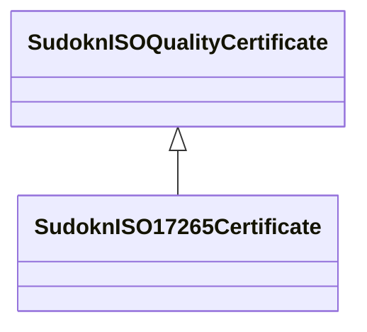

# Class: ISO 17265 certificate (sudokn_ISO17265Certificate)


URI: [sudokn:ISO17265Certificate](http://asu.edu/semantics/SUDOKN/ISO17265Certificate)





## Inheritance
* [IoInformationContentEntity](../classes/IoInformationContentEntity.md)
    * [SudoknCertificate](../classes/SudoknCertificate.md)
        * [SudoknQualityCertificate](../classes/SudoknQualityCertificate.md)
            * [SudoknISOQualityCertificate](../classes/SudoknISOQualityCertificate.md)
                * **SudoknISO17265Certificate**


## Slots

| Name | Cardinality and Range | Description | Inheritance | Occurrences |
| ---  | --- | --- | --- | --- |


## LinkML Source

<!-- TODO: investigate https://stackoverflow.com/questions/37606292/how-to-create-tabbed-code-blocks-in-mkdocs-or-sphinx -->

### Direct

<details>

```yaml
name: sudokn_ISO17265Certificate
title: ISO 17265 certificate
from_schema: okns:sudokn-kg
rank: 1000
is_a: sudokn_ISOQualityCertificate
class_uri: sudokn:ISO17265Certificate

```
</details>

### Induced

<details>

```yaml
name: sudokn_ISO17265Certificate
title: ISO 17265 certificate
from_schema: okns:sudokn-kg
rank: 1000
is_a: sudokn_ISOQualityCertificate
class_uri: sudokn:ISO17265Certificate

```
</details>