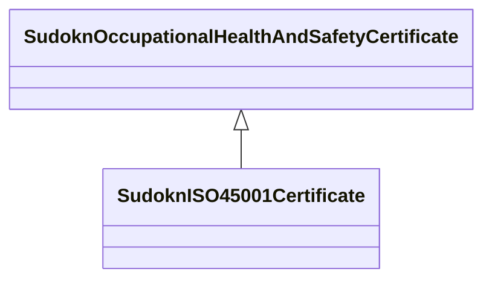

# Class: ISO 45001 certificate (sudokn_ISO45001Certificate)


URI: [sudokn:ISO45001Certificate](http://asu.edu/semantics/SUDOKN/ISO45001Certificate)





## Inheritance
* [IoInformationContentEntity](../classes/IoInformationContentEntity.md)
    * [SudoknCertificate](../classes/SudoknCertificate.md)
        * [SudoknOccupationalHealthAndSafetyCertificate](../classes/SudoknOccupationalHealthAndSafetyCertificate.md)
            * **SudoknISO45001Certificate**


## Slots

| Name | Cardinality and Range | Description | Inheritance | Occurrences |
| ---  | --- | --- | --- | --- |


## LinkML Source

<!-- TODO: investigate https://stackoverflow.com/questions/37606292/how-to-create-tabbed-code-blocks-in-mkdocs-or-sphinx -->

### Direct

<details>

```yaml
name: sudokn_ISO45001Certificate
title: ISO 45001 certificate
from_schema: okns:sudokn-kg
rank: 1000
is_a: sudokn_OccupationalHealthAndSafetyCertificate
class_uri: sudokn:ISO45001Certificate

```
</details>

### Induced

<details>

```yaml
name: sudokn_ISO45001Certificate
title: ISO 45001 certificate
from_schema: okns:sudokn-kg
rank: 1000
is_a: sudokn_OccupationalHealthAndSafetyCertificate
class_uri: sudokn:ISO45001Certificate

```
</details>