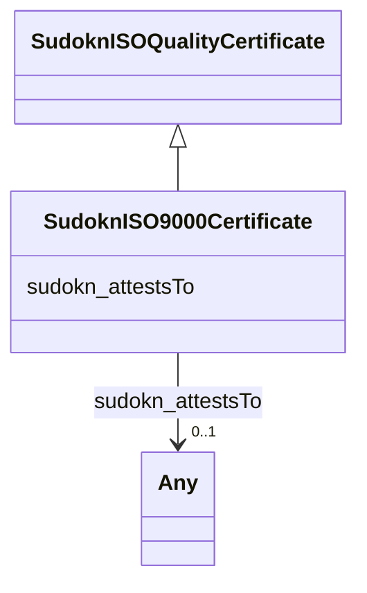

# Class: ISO 9000 certificate (sudokn_ISO9000Certificate)


This class occurs 1 times.


URI: [sudokn:ISO9000Certificate](http://asu.edu/semantics/SUDOKN/ISO9000Certificate)





## Inheritance
* [IoInformationContentEntity](../classes/IoInformationContentEntity.md)
    * [SudoknCertificate](../classes/SudoknCertificate.md)
        * [SudoknQualityCertificate](../classes/SudoknQualityCertificate.md)
            * [SudoknISOQualityCertificate](../classes/SudoknISOQualityCertificate.md)
                * **SudoknISO9000Certificate**


## Slots

| Name | Cardinality and Range | Description | Inheritance | Occurrences |
| ---  | --- | --- | --- | --- |
| [sudokn_attestsTo](../slots/sudokn_attestsTo.md) | 0..1 <br/> [IoCapability](../classes/IoCapability.md)&nbsp;or&nbsp;<br />[OwlNamedIndividual](../classes/OwlNamedIndividual.md)&nbsp;or&nbsp;<br />[SudoknQualityManagementCapability](../classes/SudoknQualityManagementCapability.md) |  <br/>  | direct | 2 |


## Usages

| used by | used in | type | used |
| ---  | --- | --- | --- |
| [IoManufacturer](../classes/IoManufacturer.md) | [sudokn_hasCertificate](../slots/sudokn_hasCertificate.md) | any_of[range] | [SudoknISO9000Certificate](../classes/SudoknISO9000Certificate.md) |


## LinkML Source

<!-- TODO: investigate https://stackoverflow.com/questions/37606292/how-to-create-tabbed-code-blocks-in-mkdocs-or-sphinx -->

### Direct

<details>

```yaml
name: sudokn_ISO9000Certificate
title: ISO 9000 certificate
from_schema: okns:sudokn-kg
rank: 1000
is_a: sudokn_ISOQualityCertificate
slots:
- sudokn_attestsTo
class_uri: sudokn:ISO9000Certificate

```
</details>

### Induced

<details>

```yaml
name: sudokn_ISO9000Certificate
title: ISO 9000 certificate
from_schema: okns:sudokn-kg
rank: 1000
is_a: sudokn_ISOQualityCertificate
attributes:
  sudokn_attestsTo:
    name: sudokn_attestsTo
    title: attests to
    from_schema: okns:sudokn-kg
    rank: 1000
    domain: sudokn_Certificate
    slot_uri: sudokn:attestsTo
    alias: sudokn_attestsTo
    owner: sudokn_ISO9000Certificate
    domain_of:
    - sudokn_AS9100Certificate
    - sudokn_ISO9000Certificate
    range: Any
    any_of:
    - range: io_Capability
    - range: owl_NamedIndividual
    - range: sudokn_QualityManagementCapability
class_uri: sudokn:ISO9000Certificate

```
</details>