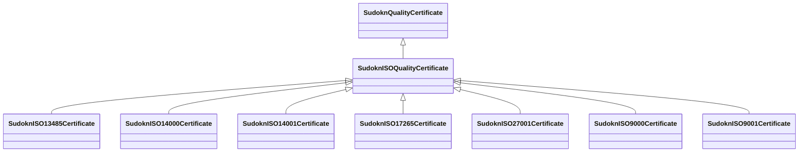

# Class: ISO quality certificate (sudokn_ISOQualityCertificate)


URI: [sudokn:ISOQualityCertificate](http://asu.edu/semantics/SUDOKN/ISOQualityCertificate)





## Inheritance
* [IoInformationContentEntity](../classes/IoInformationContentEntity.md)
    * [SudoknCertificate](../classes/SudoknCertificate.md)
        * [SudoknQualityCertificate](../classes/SudoknQualityCertificate.md)
            * **SudoknISOQualityCertificate**
                * [SudoknISO13485Certificate](../classes/SudoknISO13485Certificate.md)
                * [SudoknISO14000Certificate](../classes/SudoknISO14000Certificate.md)
                * [SudoknISO14001Certificate](../classes/SudoknISO14001Certificate.md)
                * [SudoknISO17265Certificate](../classes/SudoknISO17265Certificate.md)
                * [SudoknISO27001Certificate](../classes/SudoknISO27001Certificate.md)
                * [SudoknISO9000Certificate](../classes/SudoknISO9000Certificate.md)
                * [SudoknISO9001Certificate](../classes/SudoknISO9001Certificate.md)


## Slots

| Name | Cardinality and Range | Description | Inheritance | Occurrences |
| ---  | --- | --- | --- | --- |


## Aliases


* International Organization for Standardization Certificate


## LinkML Source

<!-- TODO: investigate https://stackoverflow.com/questions/37606292/how-to-create-tabbed-code-blocks-in-mkdocs-or-sphinx -->

### Direct

<details>

```yaml
name: sudokn_ISOQualityCertificate
title: ISO quality certificate
from_schema: okns:sudokn-kg
aliases:
- International Organization for Standardization Certificate
rank: 1000
is_a: sudokn_QualityCertificate
class_uri: sudokn:ISOQualityCertificate

```
</details>

### Induced

<details>

```yaml
name: sudokn_ISOQualityCertificate
title: ISO quality certificate
from_schema: okns:sudokn-kg
aliases:
- International Organization for Standardization Certificate
rank: 1000
is_a: sudokn_QualityCertificate
class_uri: sudokn:ISOQualityCertificate

```
</details>