# Class: manufacturing process capability (sudokn_ManufacturingProcessCapability)


_TODO -- tell the world what this class (type) describes._


URI: [sudokn:ManufacturingProcessCapability](http://asu.edu/semantics/SUDOKN/ManufacturingProcessCapability)

```mermaid
 classDiagram
    class SudoknManufacturingProcessCapability
    click SudoknManufacturingProcessCapability href "../SudoknManufacturingProcessCapability"
      IoscProductionCapability <|-- SudoknManufacturingProcessCapability
        click IoscProductionCapability href "../IoscProductionCapability"
      

      SudoknManufacturingProcessCapability <|-- SudoknAssemblyCapibility
        click SudoknAssemblyCapibility href "../SudoknAssemblyCapibility"
      SudoknManufacturingProcessCapability <|-- SudoknCastingCapability
        click SudoknCastingCapability href "../SudoknCastingCapability"
      SudoknManufacturingProcessCapability <|-- SudoknFinishingCapability
        click SudoknFinishingCapability href "../SudoknFinishingCapability"
      SudoknManufacturingProcessCapability <|-- SudoknForgingCapability
        click SudoknForgingCapability href "../SudoknForgingCapability"
      SudoknManufacturingProcessCapability <|-- SudoknFormingCapability
        click SudoknFormingCapability href "../SudoknFormingCapability"
      SudoknManufacturingProcessCapability <|-- SudoknHeatTreatingCapability
        click SudoknHeatTreatingCapability href "../SudoknHeatTreatingCapability"
      SudoknManufacturingProcessCapability <|-- SudoknJoiningCapability
        click SudoknJoiningCapability href "../SudoknJoiningCapability"
      SudoknManufacturingProcessCapability <|-- SudoknMachiningCapability
        click SudoknMachiningCapability href "../SudoknMachiningCapability"
      SudoknManufacturingProcessCapability <|-- SudoknMoldingCapability
        click SudoknMoldingCapability href "../SudoknMoldingCapability"
      SudoknManufacturingProcessCapability <|-- SudoknPackingCapability
        click SudoknPackingCapability href "../SudoknPackingCapability"
      SudoknManufacturingProcessCapability <|-- SudoknSheetMetalProcessingCapability
        click SudoknSheetMetalProcessingCapability href "../SudoknSheetMetalProcessingCapability"
      SudoknManufacturingProcessCapability <|-- SudoknTextileProcessCapability
        click SudoknTextileProcessCapability href "../SudoknTextileProcessCapability"
      SudoknManufacturingProcessCapability <|-- SudoknThermalSubtractionCapability
        click SudoknThermalSubtractionCapability href "../SudoknThermalSubtractionCapability"
      SudoknManufacturingProcessCapability <|-- SudoknToolMakingCapability
        click SudoknToolMakingCapability href "../SudoknToolMakingCapability"
      SudoknManufacturingProcessCapability <|-- SudoknWoodWorkingCapability
        click SudoknWoodWorkingCapability href "../SudoknWoodWorkingCapability"
      
      
      
```





## Inheritance
* [IoscProductionCapability](../classes/IoscProductionCapability.md)
    * **SudoknManufacturingProcessCapability**
        * [SudoknAssemblyCapibility](../classes/SudoknAssemblyCapibility.md)
        * [SudoknCastingCapability](../classes/SudoknCastingCapability.md)
        * [SudoknFinishingCapability](../classes/SudoknFinishingCapability.md)
        * [SudoknForgingCapability](../classes/SudoknForgingCapability.md)
        * [SudoknFormingCapability](../classes/SudoknFormingCapability.md)
        * [SudoknHeatTreatingCapability](../classes/SudoknHeatTreatingCapability.md)
        * [SudoknJoiningCapability](../classes/SudoknJoiningCapability.md)
        * [SudoknMachiningCapability](../classes/SudoknMachiningCapability.md)
        * [SudoknMoldingCapability](../classes/SudoknMoldingCapability.md)
        * [SudoknPackingCapability](../classes/SudoknPackingCapability.md)
        * [SudoknSheetMetalProcessingCapability](../classes/SudoknSheetMetalProcessingCapability.md)
        * [SudoknTextileProcessCapability](../classes/SudoknTextileProcessCapability.md)
        * [SudoknThermalSubtractionCapability](../classes/SudoknThermalSubtractionCapability.md)
        * [SudoknToolMakingCapability](../classes/SudoknToolMakingCapability.md)
        * [SudoknWoodWorkingCapability](../classes/SudoknWoodWorkingCapability.md)


## Slots

| Name | Cardinality and Range | Description | Inheritance |
| ---  | --- | --- | --- |


## TODOs

* TODO -- Todos for this class go here
* or you can delete the todos
* if you think the class is perfect.

## Identifier and Mapping Information


### Schema Source


* from schema: sudokn-kg


## Mappings

| Mapping Type | Mapped Value |
| ---  | ---  |
| self | sudokn:ManufacturingProcessCapability |
| native | sudokn-kg/:SudoknManufacturingProcessCapability |


## LinkML Source

<!-- TODO: investigate https://stackoverflow.com/questions/37606292/how-to-create-tabbed-code-blocks-in-mkdocs-or-sphinx -->

### Direct

<details>
```yaml
name: sudokn_ManufacturingProcessCapability
description: TODO -- tell the world what this class (type) describes.
title: manufacturing process capability
todos:
- TODO -- Todos for this class go here
- or you can delete the todos
- if you think the class is perfect.
notes:
- Class with 0 occurences.
from_schema: sudokn-kg
is_a: iosc_ProductionCapability
class_uri: sudokn:ManufacturingProcessCapability

```
</details>

### Induced

<details>
```yaml
name: sudokn_ManufacturingProcessCapability
description: TODO -- tell the world what this class (type) describes.
title: manufacturing process capability
todos:
- TODO -- Todos for this class go here
- or you can delete the todos
- if you think the class is perfect.
notes:
- Class with 0 occurences.
from_schema: sudokn-kg
is_a: iosc_ProductionCapability
class_uri: sudokn:ManufacturingProcessCapability

```
</details>