# Class: manufacturing process capability (sudokn_ManufacturingProcessCapability)


URI: [sudokn:ManufacturingProcessCapability](http://asu.edu/semantics/SUDOKN/ManufacturingProcessCapability)

```mermaid
 classDiagram
    class SudoknManufacturingProcessCapability
    click SudoknManufacturingProcessCapability href "../SudoknManufacturingProcessCapability"
      IoscProductionCapability <|-- SudoknManufacturingProcessCapability
        click IoscProductionCapability href "../IoscProductionCapability"
      

      SudoknManufacturingProcessCapability <|-- SudoknAdditiveManufacturingCapability
        click SudoknAdditiveManufacturingCapability href "../SudoknAdditiveManufacturingCapability"
      SudoknManufacturingProcessCapability <|-- SudoknAssemblyCapability
        click SudoknAssemblyCapability href "../SudoknAssemblyCapability"
      SudoknManufacturingProcessCapability <|-- SudoknCastingCapability
        click SudoknCastingCapability href "../SudoknCastingCapability"
      SudoknManufacturingProcessCapability <|-- SudoknChemicalProcessingCapability
        click SudoknChemicalProcessingCapability href "../SudoknChemicalProcessingCapability"
      SudoknManufacturingProcessCapability <|-- SudoknForgingCapability
        click SudoknForgingCapability href "../SudoknForgingCapability"
      SudoknManufacturingProcessCapability <|-- SudoknFormingCapability
        click SudoknFormingCapability href "../SudoknFormingCapability"
      SudoknManufacturingProcessCapability <|-- SudoknHeatTreatingCapability
        click SudoknHeatTreatingCapability href "../SudoknHeatTreatingCapability"
      SudoknManufacturingProcessCapability <|-- SudoknJoiningCapability
        click SudoknJoiningCapability href "../SudoknJoiningCapability"
      SudoknManufacturingProcessCapability <|-- SudoknMachiningCapability
        click SudoknMachiningCapability href "../SudoknMachiningCapability"
      SudoknManufacturingProcessCapability <|-- SudoknMoldingCapability
        click SudoknMoldingCapability href "../SudoknMoldingCapability"
      SudoknManufacturingProcessCapability <|-- SudoknPackingCapability
        click SudoknPackingCapability href "../SudoknPackingCapability"
      SudoknManufacturingProcessCapability <|-- SudoknSheetMetalProcessingCapability
        click SudoknSheetMetalProcessingCapability href "../SudoknSheetMetalProcessingCapability"
      SudoknManufacturingProcessCapability <|-- SudoknSurfaceFinishingCapability
        click SudoknSurfaceFinishingCapability href "../SudoknSurfaceFinishingCapability"
      SudoknManufacturingProcessCapability <|-- SudoknTextileProcessCapability
        click SudoknTextileProcessCapability href "../SudoknTextileProcessCapability"
      SudoknManufacturingProcessCapability <|-- SudoknToolMakingCapability
        click SudoknToolMakingCapability href "../SudoknToolMakingCapability"
      SudoknManufacturingProcessCapability <|-- SudoknWoodWorkingCapability
        click SudoknWoodWorkingCapability href "../SudoknWoodWorkingCapability"
      
      
      
```





## Inheritance
* [IoscProductionCapability](../classes/IoscProductionCapability.md)
    * **SudoknManufacturingProcessCapability**
        * [SudoknAdditiveManufacturingCapability](../classes/SudoknAdditiveManufacturingCapability.md)
        * [SudoknAssemblyCapability](../classes/SudoknAssemblyCapability.md)
        * [SudoknCastingCapability](../classes/SudoknCastingCapability.md)
        * [SudoknChemicalProcessingCapability](../classes/SudoknChemicalProcessingCapability.md)
        * [SudoknForgingCapability](../classes/SudoknForgingCapability.md)
        * [SudoknFormingCapability](../classes/SudoknFormingCapability.md)
        * [SudoknHeatTreatingCapability](../classes/SudoknHeatTreatingCapability.md)
        * [SudoknJoiningCapability](../classes/SudoknJoiningCapability.md)
        * [SudoknMachiningCapability](../classes/SudoknMachiningCapability.md)
        * [SudoknMoldingCapability](../classes/SudoknMoldingCapability.md)
        * [SudoknPackingCapability](../classes/SudoknPackingCapability.md)
        * [SudoknSheetMetalProcessingCapability](../classes/SudoknSheetMetalProcessingCapability.md)
        * [SudoknSurfaceFinishingCapability](../classes/SudoknSurfaceFinishingCapability.md)
        * [SudoknTextileProcessCapability](../classes/SudoknTextileProcessCapability.md)
        * [SudoknToolMakingCapability](../classes/SudoknToolMakingCapability.md)
        * [SudoknWoodWorkingCapability](../classes/SudoknWoodWorkingCapability.md)


## Slots

| Name | Cardinality and Range | Description | Inheritance | Occurrences |
| ---  | --- | --- | --- | --- |


## Usages

| used by | used in | type | used |
| ---  | --- | --- | --- |
| [IoManufacturer](../classes/IoManufacturer.md) | [sudokn_hasProcessCapability](../slots/sudokn_hasProcessCapability.md) | any_of[range] | [SudoknManufacturingProcessCapability](../classes/SudoknManufacturingProcessCapability.md) |


## LinkML Source

<!-- TODO: investigate https://stackoverflow.com/questions/37606292/how-to-create-tabbed-code-blocks-in-mkdocs-or-sphinx -->

### Direct

<details>

```yaml
name: sudokn_ManufacturingProcessCapability
title: manufacturing process capability
from_schema: okns:sudokn-kg
rank: 1000
is_a: iosc_ProductionCapability
class_uri: sudokn:ManufacturingProcessCapability

```
</details>

### Induced

<details>

```yaml
name: sudokn_ManufacturingProcessCapability
title: manufacturing process capability
from_schema: okns:sudokn-kg
rank: 1000
is_a: iosc_ProductionCapability
class_uri: sudokn:ManufacturingProcessCapability

```
</details>