# Class: No class (type) name specified (sudokn_MaterialProcessingCapability)


_No class (type) description specified_


This class occurs 0 times.


URI: [sudokn:MaterialProcessingCapability](http://asu.edu/semantics/SUDOKN/MaterialProcessingCapability)

```mermaid
 classDiagram
    class SudoknMaterialProcessingCapability
    click SudoknMaterialProcessingCapability href "../SudoknMaterialProcessingCapability"
      IoscProductionCapability <|-- SudoknMaterialProcessingCapability
        click IoscProductionCapability href "../IoscProductionCapability"
      

      SudoknMaterialProcessingCapability <|-- SudoknCarbonProcessingCapability
        click SudoknCarbonProcessingCapability href "../SudoknCarbonProcessingCapability"
      SudoknMaterialProcessingCapability <|-- SudoknCeramicProcessingCapability
        click SudoknCeramicProcessingCapability href "../SudoknCeramicProcessingCapability"
      SudoknMaterialProcessingCapability <|-- SudoknChemicalsProcessingCapability
        click SudoknChemicalsProcessingCapability href "../SudoknChemicalsProcessingCapability"
      SudoknMaterialProcessingCapability <|-- SudoknCompositeProcessingCapability
        click SudoknCompositeProcessingCapability href "../SudoknCompositeProcessingCapability"
      SudoknMaterialProcessingCapability <|-- SudoknElectronicProcessingCapability
        click SudoknElectronicProcessingCapability href "../SudoknElectronicProcessingCapability"
      SudoknMaterialProcessingCapability <|-- SudoknFiberProcessingCapability
        click SudoknFiberProcessingCapability href "../SudoknFiberProcessingCapability"
      SudoknMaterialProcessingCapability <|-- SudoknFoamProcessingCapability
        click SudoknFoamProcessingCapability href "../SudoknFoamProcessingCapability"
      SudoknMaterialProcessingCapability <|-- SudoknGlassProcessingCapability
        click SudoknGlassProcessingCapability href "../SudoknGlassProcessingCapability"
      SudoknMaterialProcessingCapability <|-- SudoknMetalProcessingCapability
        click SudoknMetalProcessingCapability href "../SudoknMetalProcessingCapability"
      SudoknMaterialProcessingCapability <|-- SudoknPlasticProcessingCapability
        click SudoknPlasticProcessingCapability href "../SudoknPlasticProcessingCapability"
      SudoknMaterialProcessingCapability <|-- SudoknRubberProcessingCapability
        click SudoknRubberProcessingCapability href "../SudoknRubberProcessingCapability"
      SudoknMaterialProcessingCapability <|-- SudoknSiliconeProcessingCapability
        click SudoknSiliconeProcessingCapability href "../SudoknSiliconeProcessingCapability"
      SudoknMaterialProcessingCapability <|-- SudoknUrethaneProcessingCapability
        click SudoknUrethaneProcessingCapability href "../SudoknUrethaneProcessingCapability"
      SudoknMaterialProcessingCapability <|-- SudoknWoodProcessingCapability
        click SudoknWoodProcessingCapability href "../SudoknWoodProcessingCapability"
      
      
      
```





## Inheritance
* [IoscProductionCapability](../classes/IoscProductionCapability.md)
    * **SudoknMaterialProcessingCapability**
        * [SudoknCarbonProcessingCapability](../classes/SudoknCarbonProcessingCapability.md)
        * [SudoknCeramicProcessingCapability](../classes/SudoknCeramicProcessingCapability.md)
        * [SudoknChemicalsProcessingCapability](../classes/SudoknChemicalsProcessingCapability.md)
        * [SudoknCompositeProcessingCapability](../classes/SudoknCompositeProcessingCapability.md)
        * [SudoknElectronicProcessingCapability](../classes/SudoknElectronicProcessingCapability.md)
        * [SudoknFiberProcessingCapability](../classes/SudoknFiberProcessingCapability.md)
        * [SudoknFoamProcessingCapability](../classes/SudoknFoamProcessingCapability.md)
        * [SudoknGlassProcessingCapability](../classes/SudoknGlassProcessingCapability.md)
        * [SudoknMetalProcessingCapability](../classes/SudoknMetalProcessingCapability.md)
        * [SudoknPlasticProcessingCapability](../classes/SudoknPlasticProcessingCapability.md)
        * [SudoknRubberProcessingCapability](../classes/SudoknRubberProcessingCapability.md)
        * [SudoknSiliconeProcessingCapability](../classes/SudoknSiliconeProcessingCapability.md)
        * [SudoknUrethaneProcessingCapability](../classes/SudoknUrethaneProcessingCapability.md)
        * [SudoknWoodProcessingCapability](../classes/SudoknWoodProcessingCapability.md)


## Slots

| Name | Cardinality and Range | Description | Inheritance | Occurrences |
| ---  | --- | --- | --- | --- |


## LinkML Source

<!-- TODO: investigate https://stackoverflow.com/questions/37606292/how-to-create-tabbed-code-blocks-in-mkdocs-or-sphinx -->

### Direct

<details>

```yaml
name: sudokn_MaterialProcessingCapability
conforms_to: No schema conformance document specified
annotations:
  count:
    tag: count
    value: 0
description: No class (type) description specified
title: No class (type) name specified
from_schema: sudokn-kg
rank: 1000
is_a: iosc_ProductionCapability
class_uri: sudokn:MaterialProcessingCapability

```
</details>

### Induced

<details>

```yaml
name: sudokn_MaterialProcessingCapability
conforms_to: No schema conformance document specified
annotations:
  count:
    tag: count
    value: 0
description: No class (type) description specified
title: No class (type) name specified
from_schema: sudokn-kg
rank: 1000
is_a: iosc_ProductionCapability
class_uri: sudokn:MaterialProcessingCapability

```
</details>