# Class: primary metal manufacturing (sudokn_NAICS331)


URI: [sudokn:NAICS331](http://asu.edu/semantics/SUDOKN/NAICS331)

```mermaid
 classDiagram
    class SudoknNAICS331
    click SudoknNAICS331 href "../SudoknNAICS331"
      SudoknNAICS33 <|-- SudoknNAICS331
        click SudoknNAICS33 href "../SudoknNAICS33"
      

      SudoknNAICS331 <|-- SudoknNAICS331110
        click SudoknNAICS331110 href "../SudoknNAICS331110"
      SudoknNAICS331 <|-- SudoknNAICS331210
        click SudoknNAICS331210 href "../SudoknNAICS331210"
      SudoknNAICS331 <|-- SudoknNAICS331221
        click SudoknNAICS331221 href "../SudoknNAICS331221"
      SudoknNAICS331 <|-- SudoknNAICS331222
        click SudoknNAICS331222 href "../SudoknNAICS331222"
      SudoknNAICS331 <|-- SudoknNAICS331313
        click SudoknNAICS331313 href "../SudoknNAICS331313"
      SudoknNAICS331 <|-- SudoknNAICS331314
        click SudoknNAICS331314 href "../SudoknNAICS331314"
      SudoknNAICS331 <|-- SudoknNAICS331315
        click SudoknNAICS331315 href "../SudoknNAICS331315"
      SudoknNAICS331 <|-- SudoknNAICS331318
        click SudoknNAICS331318 href "../SudoknNAICS331318"
      SudoknNAICS331 <|-- SudoknNAICS331410
        click SudoknNAICS331410 href "../SudoknNAICS331410"
      SudoknNAICS331 <|-- SudoknNAICS331420
        click SudoknNAICS331420 href "../SudoknNAICS331420"
      SudoknNAICS331 <|-- SudoknNAICS331491
        click SudoknNAICS331491 href "../SudoknNAICS331491"
      SudoknNAICS331 <|-- SudoknNAICS331492
        click SudoknNAICS331492 href "../SudoknNAICS331492"
      SudoknNAICS331 <|-- SudoknNAICS331511
        click SudoknNAICS331511 href "../SudoknNAICS331511"
      SudoknNAICS331 <|-- SudoknNAICS331512
        click SudoknNAICS331512 href "../SudoknNAICS331512"
      SudoknNAICS331 <|-- SudoknNAICS331513
        click SudoknNAICS331513 href "../SudoknNAICS331513"
      SudoknNAICS331 <|-- SudoknNAICS331523
        click SudoknNAICS331523 href "../SudoknNAICS331523"
      SudoknNAICS331 <|-- SudoknNAICS331524
        click SudoknNAICS331524 href "../SudoknNAICS331524"
      SudoknNAICS331 <|-- SudoknNAICS331529
        click SudoknNAICS331529 href "../SudoknNAICS331529"
      
      
      SudoknNAICS331 : sudokn_hasNAICSCodeValue
        
          
    
    
    SudoknNAICS331 --> "0..1" Integer : sudokn_hasNAICSCodeValue
    click Integer href "../Integer"

        
      SudoknNAICS331 : sudokn_hasNAICSTextValue
        
          
    
    
    SudoknNAICS331 --> "0..1" String : sudokn_hasNAICSTextValue
    click String href "../String"

        
      
```





## Inheritance
* [IoInformationContentEntity](../classes/IoInformationContentEntity.md)
    * [SudoknClassifier](../classes/SudoknClassifier.md)
        * [SudoknNAICSClassifier](../classes/SudoknNAICSClassifier.md)
            * [SudoknNAICS33](../classes/SudoknNAICS33.md)
                * **SudoknNAICS331**
                    * [SudoknNAICS331110](../classes/SudoknNAICS331110.md)
                    * [SudoknNAICS331210](../classes/SudoknNAICS331210.md)
                    * [SudoknNAICS331221](../classes/SudoknNAICS331221.md)
                    * [SudoknNAICS331222](../classes/SudoknNAICS331222.md)
                    * [SudoknNAICS331313](../classes/SudoknNAICS331313.md)
                    * [SudoknNAICS331314](../classes/SudoknNAICS331314.md)
                    * [SudoknNAICS331315](../classes/SudoknNAICS331315.md)
                    * [SudoknNAICS331318](../classes/SudoknNAICS331318.md)
                    * [SudoknNAICS331410](../classes/SudoknNAICS331410.md)
                    * [SudoknNAICS331420](../classes/SudoknNAICS331420.md)
                    * [SudoknNAICS331491](../classes/SudoknNAICS331491.md)
                    * [SudoknNAICS331492](../classes/SudoknNAICS331492.md)
                    * [SudoknNAICS331511](../classes/SudoknNAICS331511.md)
                    * [SudoknNAICS331512](../classes/SudoknNAICS331512.md)
                    * [SudoknNAICS331513](../classes/SudoknNAICS331513.md)
                    * [SudoknNAICS331523](../classes/SudoknNAICS331523.md)
                    * [SudoknNAICS331524](../classes/SudoknNAICS331524.md)
                    * [SudoknNAICS331529](../classes/SudoknNAICS331529.md)


## Slots

| Name | Cardinality and Range | Description | Inheritance | Occurrences |
| ---  | --- | --- | --- | --- |
| [sudokn_hasNAICSTextValue](../slots/sudokn_hasNAICSTextValue.md) | 0..1 <br/> [xsd:string](http://www.w3.org/2001/XMLSchema#string) |  | [SudoknNAICSClassifier](../classes/SudoknNAICSClassifier.md) |  |
| [sudokn_hasNAICSCodeValue](../slots/sudokn_hasNAICSCodeValue.md) | 0..1 <br/> [xsd:integer](http://www.w3.org/2001/XMLSchema#integer) |  | [SudoknNAICSClassifier](../classes/SudoknNAICSClassifier.md) |  |


## LinkML Source

<!-- TODO: investigate https://stackoverflow.com/questions/37606292/how-to-create-tabbed-code-blocks-in-mkdocs-or-sphinx -->

### Direct

<details>

```yaml
name: sudokn_NAICS331
title: primary metal manufacturing
from_schema: okns:sudokn-kg
rank: 1000
is_a: sudokn_NAICS33
class_uri: sudokn:NAICS331

```
</details>

### Induced

<details>

```yaml
name: sudokn_NAICS331
title: primary metal manufacturing
from_schema: okns:sudokn-kg
rank: 1000
is_a: sudokn_NAICS33
attributes:
  sudokn_hasNAICSTextValue:
    name: sudokn_hasNAICSTextValue
    title: has NAICS text value
    from_schema: okns:sudokn-kg
    rank: 1000
    domain: sudokn_NAICSClassifier
    slot_uri: sudokn:hasNAICSTextValue
    alias: sudokn_hasNAICSTextValue
    owner: sudokn_NAICS331
    domain_of:
    - sudokn_NAICS332111
    - sudokn_NAICS332112
    - sudokn_NAICS332114
    - sudokn_NAICS332115
    - sudokn_NAICS332116
    - sudokn_NAICS332117
    - sudokn_NAICS332211
    - sudokn_NAICS332212
    - sudokn_NAICS332213
    - sudokn_NAICS332214
    - sudokn_NAICS332311
    - sudokn_NAICS332312
    - sudokn_NAICS332313
    - sudokn_NAICS332321
    - sudokn_NAICS332322
    - sudokn_NAICS332323
    - sudokn_NAICS332410
    - sudokn_NAICS332420
    - sudokn_NAICS332431
    - sudokn_NAICS332439
    - sudokn_NAICS332510
    - sudokn_NAICS332611
    - sudokn_NAICS332612
    - sudokn_NAICS332618
    - sudokn_NAICS332710
    - sudokn_NAICS332721
    - sudokn_NAICS332722
    - sudokn_NAICS332811
    - sudokn_NAICS332812
    - sudokn_NAICS332813
    - sudokn_NAICS332911
    - sudokn_NAICS332912
    - sudokn_NAICS332913
    - sudokn_NAICS332919
    - sudokn_NAICS332991
    - sudokn_NAICS332992
    - sudokn_NAICS332994
    - sudokn_NAICS332995
    - sudokn_NAICS332996
    - sudokn_NAICS332997
    - sudokn_NAICS332998
    - sudokn_NAICS332999
    - sudokn_NAICSClassifier
    subproperty_of: iosc_hasTextValue
    range: string
  sudokn_hasNAICSCodeValue:
    name: sudokn_hasNAICSCodeValue
    title: has NAICS code value
    from_schema: okns:sudokn-kg
    rank: 1000
    domain: sudokn_NAICSClassifier
    slot_uri: sudokn:hasNAICSCodeValue
    alias: sudokn_hasNAICSCodeValue
    owner: sudokn_NAICS331
    domain_of:
    - sudokn_NAICS332111
    - sudokn_NAICS332112
    - sudokn_NAICS332114
    - sudokn_NAICS332115
    - sudokn_NAICS332116
    - sudokn_NAICS332117
    - sudokn_NAICS332211
    - sudokn_NAICS332212
    - sudokn_NAICS332213
    - sudokn_NAICS332214
    - sudokn_NAICS332311
    - sudokn_NAICS332312
    - sudokn_NAICS332313
    - sudokn_NAICS332321
    - sudokn_NAICS332322
    - sudokn_NAICS332323
    - sudokn_NAICS332410
    - sudokn_NAICS332420
    - sudokn_NAICS332431
    - sudokn_NAICS332439
    - sudokn_NAICS332510
    - sudokn_NAICS332611
    - sudokn_NAICS332612
    - sudokn_NAICS332618
    - sudokn_NAICS332710
    - sudokn_NAICS332721
    - sudokn_NAICS332722
    - sudokn_NAICS332811
    - sudokn_NAICS332812
    - sudokn_NAICS332813
    - sudokn_NAICS332911
    - sudokn_NAICS332912
    - sudokn_NAICS332913
    - sudokn_NAICS332919
    - sudokn_NAICS332991
    - sudokn_NAICS332992
    - sudokn_NAICS332994
    - sudokn_NAICS332995
    - sudokn_NAICS332996
    - sudokn_NAICS332997
    - sudokn_NAICS332998
    - sudokn_NAICS332999
    - sudokn_NAICSClassifier
    range: integer
class_uri: sudokn:NAICS331

```
</details>