# Class: fabricated metal product manufacturing (sudokn_NAICS332)


URI: [sudokn:NAICS332](http://asu.edu/semantics/SUDOKN/NAICS332)

```mermaid
 classDiagram
    class SudoknNAICS332
    click SudoknNAICS332 href "../SudoknNAICS332"
      SudoknNAICS33 <|-- SudoknNAICS332
        click SudoknNAICS33 href "../SudoknNAICS33"
      

      SudoknNAICS332 <|-- SudoknNAICS332111
        click SudoknNAICS332111 href "../SudoknNAICS332111"
      SudoknNAICS332 <|-- SudoknNAICS332112
        click SudoknNAICS332112 href "../SudoknNAICS332112"
      SudoknNAICS332 <|-- SudoknNAICS332114
        click SudoknNAICS332114 href "../SudoknNAICS332114"
      SudoknNAICS332 <|-- SudoknNAICS332117
        click SudoknNAICS332117 href "../SudoknNAICS332117"
      SudoknNAICS332 <|-- SudoknNAICS332119
        click SudoknNAICS332119 href "../SudoknNAICS332119"
      SudoknNAICS332 <|-- SudoknNAICS332215
        click SudoknNAICS332215 href "../SudoknNAICS332215"
      SudoknNAICS332 <|-- SudoknNAICS332216
        click SudoknNAICS332216 href "../SudoknNAICS332216"
      SudoknNAICS332 <|-- SudoknNAICS332311
        click SudoknNAICS332311 href "../SudoknNAICS332311"
      SudoknNAICS332 <|-- SudoknNAICS332312
        click SudoknNAICS332312 href "../SudoknNAICS332312"
      SudoknNAICS332 <|-- SudoknNAICS332313
        click SudoknNAICS332313 href "../SudoknNAICS332313"
      SudoknNAICS332 <|-- SudoknNAICS332321
        click SudoknNAICS332321 href "../SudoknNAICS332321"
      SudoknNAICS332 <|-- SudoknNAICS332322
        click SudoknNAICS332322 href "../SudoknNAICS332322"
      SudoknNAICS332 <|-- SudoknNAICS332323
        click SudoknNAICS332323 href "../SudoknNAICS332323"
      SudoknNAICS332 <|-- SudoknNAICS332410
        click SudoknNAICS332410 href "../SudoknNAICS332410"
      SudoknNAICS332 <|-- SudoknNAICS332420
        click SudoknNAICS332420 href "../SudoknNAICS332420"
      SudoknNAICS332 <|-- SudoknNAICS332431
        click SudoknNAICS332431 href "../SudoknNAICS332431"
      SudoknNAICS332 <|-- SudoknNAICS332439
        click SudoknNAICS332439 href "../SudoknNAICS332439"
      SudoknNAICS332 <|-- SudoknNAICS332510
        click SudoknNAICS332510 href "../SudoknNAICS332510"
      SudoknNAICS332 <|-- SudoknNAICS332613
        click SudoknNAICS332613 href "../SudoknNAICS332613"
      SudoknNAICS332 <|-- SudoknNAICS332618
        click SudoknNAICS332618 href "../SudoknNAICS332618"
      SudoknNAICS332 <|-- SudoknNAICS332710
        click SudoknNAICS332710 href "../SudoknNAICS332710"
      SudoknNAICS332 <|-- SudoknNAICS332721
        click SudoknNAICS332721 href "../SudoknNAICS332721"
      SudoknNAICS332 <|-- SudoknNAICS332722
        click SudoknNAICS332722 href "../SudoknNAICS332722"
      SudoknNAICS332 <|-- SudoknNAICS332811
        click SudoknNAICS332811 href "../SudoknNAICS332811"
      SudoknNAICS332 <|-- SudoknNAICS332812
        click SudoknNAICS332812 href "../SudoknNAICS332812"
      SudoknNAICS332 <|-- SudoknNAICS332813
        click SudoknNAICS332813 href "../SudoknNAICS332813"
      SudoknNAICS332 <|-- SudoknNAICS332911
        click SudoknNAICS332911 href "../SudoknNAICS332911"
      SudoknNAICS332 <|-- SudoknNAICS332912
        click SudoknNAICS332912 href "../SudoknNAICS332912"
      SudoknNAICS332 <|-- SudoknNAICS332913
        click SudoknNAICS332913 href "../SudoknNAICS332913"
      SudoknNAICS332 <|-- SudoknNAICS332919
        click SudoknNAICS332919 href "../SudoknNAICS332919"
      SudoknNAICS332 <|-- SudoknNAICS332991
        click SudoknNAICS332991 href "../SudoknNAICS332991"
      SudoknNAICS332 <|-- SudoknNAICS332992
        click SudoknNAICS332992 href "../SudoknNAICS332992"
      
      
      SudoknNAICS332 : sudokn_hasNAICSCodeValue
        
          
    
    
    SudoknNAICS332 --> "0..1" Integer : sudokn_hasNAICSCodeValue
    click Integer href "../Integer"

        
      SudoknNAICS332 : sudokn_hasNAICSTextValue
        
          
    
    
    SudoknNAICS332 --> "0..1" String : sudokn_hasNAICSTextValue
    click String href "../String"

        
      
```





## Inheritance
* [IoInformationContentEntity](../classes/IoInformationContentEntity.md)
    * [SudoknClassifier](../classes/SudoknClassifier.md)
        * [SudoknNAICSClassifier](../classes/SudoknNAICSClassifier.md)
            * [SudoknNAICS33](../classes/SudoknNAICS33.md)
                * **SudoknNAICS332**
                    * [SudoknNAICS332111](../classes/SudoknNAICS332111.md)
                    * [SudoknNAICS332112](../classes/SudoknNAICS332112.md)
                    * [SudoknNAICS332114](../classes/SudoknNAICS332114.md)
                    * [SudoknNAICS332117](../classes/SudoknNAICS332117.md)
                    * [SudoknNAICS332119](../classes/SudoknNAICS332119.md)
                    * [SudoknNAICS332215](../classes/SudoknNAICS332215.md)
                    * [SudoknNAICS332216](../classes/SudoknNAICS332216.md)
                    * [SudoknNAICS332311](../classes/SudoknNAICS332311.md)
                    * [SudoknNAICS332312](../classes/SudoknNAICS332312.md)
                    * [SudoknNAICS332313](../classes/SudoknNAICS332313.md)
                    * [SudoknNAICS332321](../classes/SudoknNAICS332321.md)
                    * [SudoknNAICS332322](../classes/SudoknNAICS332322.md)
                    * [SudoknNAICS332323](../classes/SudoknNAICS332323.md)
                    * [SudoknNAICS332410](../classes/SudoknNAICS332410.md)
                    * [SudoknNAICS332420](../classes/SudoknNAICS332420.md)
                    * [SudoknNAICS332431](../classes/SudoknNAICS332431.md)
                    * [SudoknNAICS332439](../classes/SudoknNAICS332439.md)
                    * [SudoknNAICS332510](../classes/SudoknNAICS332510.md)
                    * [SudoknNAICS332613](../classes/SudoknNAICS332613.md)
                    * [SudoknNAICS332618](../classes/SudoknNAICS332618.md)
                    * [SudoknNAICS332710](../classes/SudoknNAICS332710.md)
                    * [SudoknNAICS332721](../classes/SudoknNAICS332721.md)
                    * [SudoknNAICS332722](../classes/SudoknNAICS332722.md)
                    * [SudoknNAICS332811](../classes/SudoknNAICS332811.md)
                    * [SudoknNAICS332812](../classes/SudoknNAICS332812.md)
                    * [SudoknNAICS332813](../classes/SudoknNAICS332813.md)
                    * [SudoknNAICS332911](../classes/SudoknNAICS332911.md)
                    * [SudoknNAICS332912](../classes/SudoknNAICS332912.md)
                    * [SudoknNAICS332913](../classes/SudoknNAICS332913.md)
                    * [SudoknNAICS332919](../classes/SudoknNAICS332919.md)
                    * [SudoknNAICS332991](../classes/SudoknNAICS332991.md)
                    * [SudoknNAICS332992](../classes/SudoknNAICS332992.md)


## Slots

| Name | Cardinality and Range | Description | Inheritance | Occurrences |
| ---  | --- | --- | --- | --- |
| [sudokn_hasNAICSTextValue](../slots/sudokn_hasNAICSTextValue.md) | 0..1 <br/> [xsd:string](http://www.w3.org/2001/XMLSchema#string) |  | [SudoknNAICSClassifier](../classes/SudoknNAICSClassifier.md) |  |
| [sudokn_hasNAICSCodeValue](../slots/sudokn_hasNAICSCodeValue.md) | 0..1 <br/> [xsd:integer](http://www.w3.org/2001/XMLSchema#integer) |  | [SudoknNAICSClassifier](../classes/SudoknNAICSClassifier.md) |  |


## LinkML Source

<!-- TODO: investigate https://stackoverflow.com/questions/37606292/how-to-create-tabbed-code-blocks-in-mkdocs-or-sphinx -->

### Direct

<details>

```yaml
name: sudokn_NAICS332
title: fabricated metal product manufacturing
from_schema: okns:sudokn-kg
rank: 1000
is_a: sudokn_NAICS33
class_uri: sudokn:NAICS332

```
</details>

### Induced

<details>

```yaml
name: sudokn_NAICS332
title: fabricated metal product manufacturing
from_schema: okns:sudokn-kg
rank: 1000
is_a: sudokn_NAICS33
attributes:
  sudokn_hasNAICSTextValue:
    name: sudokn_hasNAICSTextValue
    title: has NAICS text value
    from_schema: okns:sudokn-kg
    rank: 1000
    domain: sudokn_NAICSClassifier
    slot_uri: sudokn:hasNAICSTextValue
    alias: sudokn_hasNAICSTextValue
    owner: sudokn_NAICS332
    domain_of:
    - sudokn_NAICS332111
    - sudokn_NAICS332112
    - sudokn_NAICS332114
    - sudokn_NAICS332115
    - sudokn_NAICS332116
    - sudokn_NAICS332117
    - sudokn_NAICS332211
    - sudokn_NAICS332212
    - sudokn_NAICS332213
    - sudokn_NAICS332214
    - sudokn_NAICS332311
    - sudokn_NAICS332312
    - sudokn_NAICS332313
    - sudokn_NAICS332321
    - sudokn_NAICS332322
    - sudokn_NAICS332323
    - sudokn_NAICS332410
    - sudokn_NAICS332420
    - sudokn_NAICS332431
    - sudokn_NAICS332439
    - sudokn_NAICS332510
    - sudokn_NAICS332611
    - sudokn_NAICS332612
    - sudokn_NAICS332618
    - sudokn_NAICS332710
    - sudokn_NAICS332721
    - sudokn_NAICS332722
    - sudokn_NAICS332811
    - sudokn_NAICS332812
    - sudokn_NAICS332813
    - sudokn_NAICS332911
    - sudokn_NAICS332912
    - sudokn_NAICS332913
    - sudokn_NAICS332919
    - sudokn_NAICS332991
    - sudokn_NAICS332992
    - sudokn_NAICS332994
    - sudokn_NAICS332995
    - sudokn_NAICS332996
    - sudokn_NAICS332997
    - sudokn_NAICS332998
    - sudokn_NAICS332999
    - sudokn_NAICSClassifier
    subproperty_of: iosc_hasTextValue
    range: string
  sudokn_hasNAICSCodeValue:
    name: sudokn_hasNAICSCodeValue
    title: has NAICS code value
    from_schema: okns:sudokn-kg
    rank: 1000
    domain: sudokn_NAICSClassifier
    slot_uri: sudokn:hasNAICSCodeValue
    alias: sudokn_hasNAICSCodeValue
    owner: sudokn_NAICS332
    domain_of:
    - sudokn_NAICS332111
    - sudokn_NAICS332112
    - sudokn_NAICS332114
    - sudokn_NAICS332115
    - sudokn_NAICS332116
    - sudokn_NAICS332117
    - sudokn_NAICS332211
    - sudokn_NAICS332212
    - sudokn_NAICS332213
    - sudokn_NAICS332214
    - sudokn_NAICS332311
    - sudokn_NAICS332312
    - sudokn_NAICS332313
    - sudokn_NAICS332321
    - sudokn_NAICS332322
    - sudokn_NAICS332323
    - sudokn_NAICS332410
    - sudokn_NAICS332420
    - sudokn_NAICS332431
    - sudokn_NAICS332439
    - sudokn_NAICS332510
    - sudokn_NAICS332611
    - sudokn_NAICS332612
    - sudokn_NAICS332618
    - sudokn_NAICS332710
    - sudokn_NAICS332721
    - sudokn_NAICS332722
    - sudokn_NAICS332811
    - sudokn_NAICS332812
    - sudokn_NAICS332813
    - sudokn_NAICS332911
    - sudokn_NAICS332912
    - sudokn_NAICS332913
    - sudokn_NAICS332919
    - sudokn_NAICS332991
    - sudokn_NAICS332992
    - sudokn_NAICS332994
    - sudokn_NAICS332995
    - sudokn_NAICS332996
    - sudokn_NAICS332997
    - sudokn_NAICS332998
    - sudokn_NAICS332999
    - sudokn_NAICSClassifier
    range: integer
class_uri: sudokn:NAICS332

```
</details>