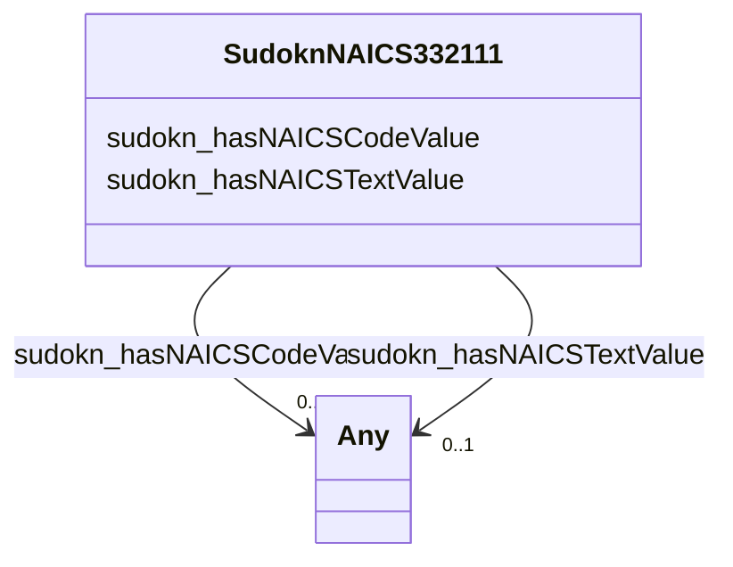

# Class: No class (type) name specified (sudokn_NAICS332111)


_No class (type) description specified_


This class occurs 1 times.


URI: [sudokn:NAICS332111](http://asu.edu/semantics/SUDOKN/NAICS332111)





<!-- no inheritance hierarchy -->


## Slots

| Name | Cardinality and Range | Description | Inheritance | Occurrences |
| ---  | --- | --- | --- | --- |
| [sudokn_hasNAICSCodeValue](../slots/sudokn_hasNAICSCodeValue.md) | 0..1 <br/> [xsd:anyURI](http://www.w3.org/2001/XMLSchema#anyURI)&nbsp;or&nbsp;<br />[xsd:integer](http://www.w3.org/2001/XMLSchema#integer) | No slot (predicate) description specified <br/>  | direct | 1 |
| [sudokn_hasNAICSTextValue](../slots/sudokn_hasNAICSTextValue.md) | 0..1 <br/> [xsd:anyURI](http://www.w3.org/2001/XMLSchema#anyURI)&nbsp;or&nbsp;<br />[xsd:string](http://www.w3.org/2001/XMLSchema#string) | No slot (predicate) description specified <br/>  | direct | 1 |


## Usages

| used by | used in | type | used |
| ---  | --- | --- | --- |
| [IoManufacturer](../classes/IoManufacturer.md) | [sudokn_hasPrimaryNAICSClassifier](../slots/sudokn_hasPrimaryNAICSClassifier.md) | any_of[range] | [SudoknNAICS332111](../classes/SudoknNAICS332111.md) |


## LinkML Source

<!-- TODO: investigate https://stackoverflow.com/questions/37606292/how-to-create-tabbed-code-blocks-in-mkdocs-or-sphinx -->

### Direct

<details>

```yaml
name: sudokn_NAICS332111
conforms_to: No schema conformance document specified
annotations:
  count:
    tag: count
    value: 1
description: No class (type) description specified
title: No class (type) name specified
from_schema: sudokn-kg
rank: 1000
slots:
- sudokn_hasNAICSCodeValue
- sudokn_hasNAICSTextValue
slot_usage:
  sudokn_hasNAICSCodeValue:
    name: sudokn_hasNAICSCodeValue
    annotations:
      integer:
        tag: integer
        value: 1
  sudokn_hasNAICSTextValue:
    name: sudokn_hasNAICSTextValue
    annotations:
      string:
        tag: string
        value: 1
class_uri: sudokn:NAICS332111

```
</details>

### Induced

<details>

```yaml
name: sudokn_NAICS332111
conforms_to: No schema conformance document specified
annotations:
  count:
    tag: count
    value: 1
description: No class (type) description specified
title: No class (type) name specified
from_schema: sudokn-kg
rank: 1000
slot_usage:
  sudokn_hasNAICSCodeValue:
    name: sudokn_hasNAICSCodeValue
    annotations:
      integer:
        tag: integer
        value: 1
  sudokn_hasNAICSTextValue:
    name: sudokn_hasNAICSTextValue
    annotations:
      string:
        tag: string
        value: 1
attributes:
  sudokn_hasNAICSCodeValue:
    name: sudokn_hasNAICSCodeValue
    annotations:
      integer:
        tag: integer
        value: 1
    description: No slot (predicate) description specified
    title: No slot (predicate) name specified
    examples:
    - object:
        example_object: '221'
        example_object_type: integer
        example_predicate: sudokn:hasNAICSCodeValue
        example_subject: sudokn:NAICS-221
        example_subject_type: sudokn_NAICSClassifier
    - object:
        example_object: '332111'
        example_object_type: integer
        example_predicate: sudokn:hasNAICSCodeValue
        example_subject: sudokn:naics-332111-inst
        example_subject_type: sudokn_NAICS332111
    - object:
        example_object: '332112'
        example_object_type: integer
        example_predicate: sudokn:hasNAICSCodeValue
        example_subject: sudokn:naics-332112-inst
        example_subject_type: sudokn_NAICS332112
    - object:
        example_object: '332114'
        example_object_type: integer
        example_predicate: sudokn:hasNAICSCodeValue
        example_subject: sudokn:naics-332114-inst
        example_subject_type: sudokn_NAICS332114
    - object:
        example_object: '332115'
        example_object_type: integer
        example_predicate: sudokn:hasNAICSCodeValue
        example_subject: sudokn:naics-332115-inst
        example_subject_type: sudokn_NAICS332115
    - object:
        example_object: '332116'
        example_object_type: integer
        example_predicate: sudokn:hasNAICSCodeValue
        example_subject: sudokn:naics-332116-inst
        example_subject_type: sudokn_NAICS332116
    - object:
        example_object: '332117'
        example_object_type: integer
        example_predicate: sudokn:hasNAICSCodeValue
        example_subject: sudokn:naics-332117-inst
        example_subject_type: sudokn_NAICS332117
    - object:
        example_object: '332211'
        example_object_type: integer
        example_predicate: sudokn:hasNAICSCodeValue
        example_subject: sudokn:naics-332211-inst
        example_subject_type: sudokn_NAICS332211
    - object:
        example_object: '332212'
        example_object_type: integer
        example_predicate: sudokn:hasNAICSCodeValue
        example_subject: sudokn:naics-332212-inst
        example_subject_type: sudokn_NAICS332212
    - object:
        example_object: '332213'
        example_object_type: integer
        example_predicate: sudokn:hasNAICSCodeValue
        example_subject: sudokn:naics-332213-inst
        example_subject_type: sudokn_NAICS332213
    - object:
        example_object: '332214'
        example_object_type: integer
        example_predicate: sudokn:hasNAICSCodeValue
        example_subject: sudokn:naics-332214-inst
        example_subject_type: sudokn_NAICS332214
    - object:
        example_object: '332311'
        example_object_type: integer
        example_predicate: sudokn:hasNAICSCodeValue
        example_subject: sudokn:naics-332311-inst
        example_subject_type: sudokn_NAICS332311
    - object:
        example_object: '332312'
        example_object_type: integer
        example_predicate: sudokn:hasNAICSCodeValue
        example_subject: sudokn:naics-332312-inst
        example_subject_type: sudokn_NAICS332312
    - object:
        example_object: '332313'
        example_object_type: integer
        example_predicate: sudokn:hasNAICSCodeValue
        example_subject: sudokn:naics-332313-inst
        example_subject_type: sudokn_NAICS332313
    - object:
        example_object: '332321'
        example_object_type: integer
        example_predicate: sudokn:hasNAICSCodeValue
        example_subject: sudokn:naics-332321-inst
        example_subject_type: sudokn_NAICS332321
    - object:
        example_object: '332322'
        example_object_type: integer
        example_predicate: sudokn:hasNAICSCodeValue
        example_subject: sudokn:naics-332322-inst
        example_subject_type: sudokn_NAICS332322
    - object:
        example_object: '332323'
        example_object_type: integer
        example_predicate: sudokn:hasNAICSCodeValue
        example_subject: sudokn:naics-332323-inst
        example_subject_type: sudokn_NAICS332323
    - object:
        example_object: '332410'
        example_object_type: integer
        example_predicate: sudokn:hasNAICSCodeValue
        example_subject: sudokn:naics-332410-inst
        example_subject_type: sudokn_NAICS332410
    - object:
        example_object: '332420'
        example_object_type: integer
        example_predicate: sudokn:hasNAICSCodeValue
        example_subject: sudokn:naics-332420-inst
        example_subject_type: sudokn_NAICS332420
    - object:
        example_object: '332431'
        example_object_type: integer
        example_predicate: sudokn:hasNAICSCodeValue
        example_subject: sudokn:naics-332431-inst
        example_subject_type: sudokn_NAICS332431
    - object:
        example_object: '332439'
        example_object_type: integer
        example_predicate: sudokn:hasNAICSCodeValue
        example_subject: sudokn:naics-332439-inst
        example_subject_type: sudokn_NAICS332439
    - object:
        example_object: '332510'
        example_object_type: integer
        example_predicate: sudokn:hasNAICSCodeValue
        example_subject: sudokn:naics-332510-inst
        example_subject_type: sudokn_NAICS332510
    - object:
        example_object: '332611'
        example_object_type: integer
        example_predicate: sudokn:hasNAICSCodeValue
        example_subject: sudokn:naics-332611-inst
        example_subject_type: sudokn_NAICS332611
    - object:
        example_object: '332612'
        example_object_type: integer
        example_predicate: sudokn:hasNAICSCodeValue
        example_subject: sudokn:naics-332612-inst
        example_subject_type: sudokn_NAICS332612
    - object:
        example_object: '332618'
        example_object_type: integer
        example_predicate: sudokn:hasNAICSCodeValue
        example_subject: sudokn:naics-332618-inst
        example_subject_type: sudokn_NAICS332618
    - object:
        example_object: '332710'
        example_object_type: integer
        example_predicate: sudokn:hasNAICSCodeValue
        example_subject: sudokn:naics-332710-inst
        example_subject_type: sudokn_NAICS332710
    - object:
        example_object: '332721'
        example_object_type: integer
        example_predicate: sudokn:hasNAICSCodeValue
        example_subject: sudokn:naics-332721-inst
        example_subject_type: sudokn_NAICS332721
    - object:
        example_object: '332722'
        example_object_type: integer
        example_predicate: sudokn:hasNAICSCodeValue
        example_subject: sudokn:naics-332722-inst
        example_subject_type: sudokn_NAICS332722
    - object:
        example_object: '332811'
        example_object_type: integer
        example_predicate: sudokn:hasNAICSCodeValue
        example_subject: sudokn:naics-332811-inst
        example_subject_type: sudokn_NAICS332811
    - object:
        example_object: '332812'
        example_object_type: integer
        example_predicate: sudokn:hasNAICSCodeValue
        example_subject: sudokn:naics-332812-inst
        example_subject_type: sudokn_NAICS332812
    - object:
        example_object: '332813'
        example_object_type: integer
        example_predicate: sudokn:hasNAICSCodeValue
        example_subject: sudokn:naics-332813-inst
        example_subject_type: sudokn_NAICS332813
    - object:
        example_object: '332911'
        example_object_type: integer
        example_predicate: sudokn:hasNAICSCodeValue
        example_subject: sudokn:naics-332911-inst
        example_subject_type: sudokn_NAICS332911
    - object:
        example_object: '332912'
        example_object_type: integer
        example_predicate: sudokn:hasNAICSCodeValue
        example_subject: sudokn:naics-332912-inst
        example_subject_type: sudokn_NAICS332912
    - object:
        example_object: '332913'
        example_object_type: integer
        example_predicate: sudokn:hasNAICSCodeValue
        example_subject: sudokn:naics-332913-inst
        example_subject_type: sudokn_NAICS332913
    - object:
        example_object: '332919'
        example_object_type: integer
        example_predicate: sudokn:hasNAICSCodeValue
        example_subject: sudokn:naics-332919-inst
        example_subject_type: sudokn_NAICS332919
    - object:
        example_object: '332991'
        example_object_type: integer
        example_predicate: sudokn:hasNAICSCodeValue
        example_subject: sudokn:naics-332991-inst
        example_subject_type: sudokn_NAICS332991
    - object:
        example_object: '332992'
        example_object_type: integer
        example_predicate: sudokn:hasNAICSCodeValue
        example_subject: sudokn:naics-332992-inst
        example_subject_type: sudokn_NAICS332992
    - object:
        example_object: '332994'
        example_object_type: integer
        example_predicate: sudokn:hasNAICSCodeValue
        example_subject: sudokn:naics-332994-inst
        example_subject_type: sudokn_NAICS332994
    - object:
        example_object: '332995'
        example_object_type: integer
        example_predicate: sudokn:hasNAICSCodeValue
        example_subject: sudokn:naics-332995-inst
        example_subject_type: sudokn_NAICS332995
    - object:
        example_object: '332996'
        example_object_type: integer
        example_predicate: sudokn:hasNAICSCodeValue
        example_subject: sudokn:naics-332996-inst
        example_subject_type: sudokn_NAICS332996
    - object:
        example_object: '332997'
        example_object_type: integer
        example_predicate: sudokn:hasNAICSCodeValue
        example_subject: sudokn:naics-332997-inst
        example_subject_type: sudokn_NAICS332997
    - object:
        example_object: '332998'
        example_object_type: integer
        example_predicate: sudokn:hasNAICSCodeValue
        example_subject: sudokn:naics-332998-inst
        example_subject_type: sudokn_NAICS332998
    - object:
        example_object: '332999'
        example_object_type: integer
        example_predicate: sudokn:hasNAICSCodeValue
        example_subject: sudokn:naics-332999-inst
        example_subject_type: sudokn_NAICS332999
    from_schema: sudokn-kg
    rank: 1000
    domain: sudokn_hasNAICSCodeValue
    slot_uri: sudokn:hasNAICSCodeValue
    alias: sudokn_hasNAICSCodeValue
    owner: sudokn_NAICS332111
    domain_of:
    - sudokn_NAICS332111
    - sudokn_NAICS332112
    - sudokn_NAICS332114
    - sudokn_NAICS332115
    - sudokn_NAICS332116
    - sudokn_NAICS332117
    - sudokn_NAICS332211
    - sudokn_NAICS332212
    - sudokn_NAICS332213
    - sudokn_NAICS332214
    - sudokn_NAICS332311
    - sudokn_NAICS332312
    - sudokn_NAICS332313
    - sudokn_NAICS332321
    - sudokn_NAICS332322
    - sudokn_NAICS332323
    - sudokn_NAICS332410
    - sudokn_NAICS332420
    - sudokn_NAICS332431
    - sudokn_NAICS332439
    - sudokn_NAICS332510
    - sudokn_NAICS332611
    - sudokn_NAICS332612
    - sudokn_NAICS332618
    - sudokn_NAICS332710
    - sudokn_NAICS332721
    - sudokn_NAICS332722
    - sudokn_NAICS332811
    - sudokn_NAICS332812
    - sudokn_NAICS332813
    - sudokn_NAICS332911
    - sudokn_NAICS332912
    - sudokn_NAICS332913
    - sudokn_NAICS332919
    - sudokn_NAICS332991
    - sudokn_NAICS332992
    - sudokn_NAICS332994
    - sudokn_NAICS332995
    - sudokn_NAICS332996
    - sudokn_NAICS332997
    - sudokn_NAICS332998
    - sudokn_NAICS332999
    - sudokn_NAICSClassifier
    range: Any
    any_of:
    - range: uri
    - range: integer
  sudokn_hasNAICSTextValue:
    name: sudokn_hasNAICSTextValue
    annotations:
      string:
        tag: string
        value: 1
    description: No slot (predicate) description specified
    title: No slot (predicate) name specified
    examples:
    - object:
        example_object: Utilities
        example_object_type: string
        example_predicate: sudokn:hasNAICSTextValue
        example_subject: sudokn:NAICS-221
        example_subject_type: sudokn_NAICSClassifier
    - object:
        example_object: IRON AND STEEL FORGING
        example_object_type: string
        example_predicate: sudokn:hasNAICSTextValue
        example_subject: sudokn:naics-332111-inst
        example_subject_type: sudokn_NAICS332111
    - object:
        example_object: NONFERROUS FORGING
        example_object_type: string
        example_predicate: sudokn:hasNAICSTextValue
        example_subject: sudokn:naics-332112-inst
        example_subject_type: sudokn_NAICS332112
    - object:
        example_object: CUSTOM ROLL FORMING
        example_object_type: string
        example_predicate: sudokn:hasNAICSTextValue
        example_subject: sudokn:naics-332114-inst
        example_subject_type: sudokn_NAICS332114
    - object:
        example_object: CROWN AND CLOSURE MANUFACTURING
        example_object_type: string
        example_predicate: sudokn:hasNAICSTextValue
        example_subject: sudokn:naics-332115-inst
        example_subject_type: sudokn_NAICS332115
    - object:
        example_object: METAL STAMPING
        example_object_type: string
        example_predicate: sudokn:hasNAICSTextValue
        example_subject: sudokn:naics-332116-inst
        example_subject_type: sudokn_NAICS332116
    - object:
        example_object: POWDER METALLURGY PART MANUFACTURING
        example_object_type: string
        example_predicate: sudokn:hasNAICSTextValue
        example_subject: sudokn:naics-332117-inst
        example_subject_type: sudokn_NAICS332117
    - object:
        example_object: CUTLERY AND FLATWARE (EXCEPT PRECIOUS) MANUFACTURING
        example_object_type: string
        example_predicate: sudokn:hasNAICSTextValue
        example_subject: sudokn:naics-332211-inst
        example_subject_type: sudokn_NAICS332211
    - object:
        example_object: HAND AND EDGE TOOL MANUFACTURING
        example_object_type: string
        example_predicate: sudokn:hasNAICSTextValue
        example_subject: sudokn:naics-332212-inst
        example_subject_type: sudokn_NAICS332212
    - object:
        example_object: SAW BLADE AND HANDSAW MANUFACTURING
        example_object_type: string
        example_predicate: sudokn:hasNAICSTextValue
        example_subject: sudokn:naics-332213-inst
        example_subject_type: sudokn_NAICS332213
    - object:
        example_object: KITCHEN UTENSIL, POT, AND PAN MANUFACTURING
        example_object_type: string
        example_predicate: sudokn:hasNAICSTextValue
        example_subject: sudokn:naics-332214-inst
        example_subject_type: sudokn_NAICS332214
    - object:
        example_object: PREFABRICATED METAL BUILDING AND COMPONENT MANUFACTURING
        example_object_type: string
        example_predicate: sudokn:hasNAICSTextValue
        example_subject: sudokn:naics-332311-inst
        example_subject_type: sudokn_NAICS332311
    - object:
        example_object: FABRICATED STRUCTURAL METAL MANUFACTURING
        example_object_type: string
        example_predicate: sudokn:hasNAICSTextValue
        example_subject: sudokn:naics-332312-inst
        example_subject_type: sudokn_NAICS332312
    - object:
        example_object: PLATE WORK MANUFACTURING
        example_object_type: string
        example_predicate: sudokn:hasNAICSTextValue
        example_subject: sudokn:naics-332313-inst
        example_subject_type: sudokn_NAICS332313
    - object:
        example_object: METAL WINDOW AND DOOR MANUFACTURING
        example_object_type: string
        example_predicate: sudokn:hasNAICSTextValue
        example_subject: sudokn:naics-332321-inst
        example_subject_type: sudokn_NAICS332321
    - object:
        example_object: SHEET METAL WORK MANUFACTURING
        example_object_type: string
        example_predicate: sudokn:hasNAICSTextValue
        example_subject: sudokn:naics-332322-inst
        example_subject_type: sudokn_NAICS332322
    - object:
        example_object: ORNAMENTAL AND ARCHITECTURAL METAL WORK MANUFACTURING
        example_object_type: string
        example_predicate: sudokn:hasNAICSTextValue
        example_subject: sudokn:naics-332323-inst
        example_subject_type: sudokn_NAICS332323
    - object:
        example_object: POWER BOILER AND HEAT EXCHANGER MANUFACTURING
        example_object_type: string
        example_predicate: sudokn:hasNAICSTextValue
        example_subject: sudokn:naics-332410-inst
        example_subject_type: sudokn_NAICS332410
    - object:
        example_object: METAL TANK (HEAVY GAUGE) MANUFACTURING
        example_object_type: string
        example_predicate: sudokn:hasNAICSTextValue
        example_subject: sudokn:naics-332420-inst
        example_subject_type: sudokn_NAICS332420
    - object:
        example_object: METAL CAN MANUFACTURING
        example_object_type: string
        example_predicate: sudokn:hasNAICSTextValue
        example_subject: sudokn:naics-332431-inst
        example_subject_type: sudokn_NAICS332431
    - object:
        example_object: OTHER METAL CONTAINER MANUFACTURING
        example_object_type: string
        example_predicate: sudokn:hasNAICSTextValue
        example_subject: sudokn:naics-332439-inst
        example_subject_type: sudokn_NAICS332439
    - object:
        example_object: HARDWARE MANUFACTURING
        example_object_type: string
        example_predicate: sudokn:hasNAICSTextValue
        example_subject: sudokn:naics-332510-inst
        example_subject_type: sudokn_NAICS332510
    - object:
        example_object: SPRING (HEAVY GAUGE) MANUFACTURING
        example_object_type: string
        example_predicate: sudokn:hasNAICSTextValue
        example_subject: sudokn:naics-332611-inst
        example_subject_type: sudokn_NAICS332611
    - object:
        example_object: SPRING (LIGHT GAUGE) MANUFACTURING
        example_object_type: string
        example_predicate: sudokn:hasNAICSTextValue
        example_subject: sudokn:naics-332612-inst
        example_subject_type: sudokn_NAICS332612
    - object:
        example_object: OTHER FABRICATED WIRE PRODUCT MANUFACTURING
        example_object_type: string
        example_predicate: sudokn:hasNAICSTextValue
        example_subject: sudokn:naics-332618-inst
        example_subject_type: sudokn_NAICS332618
    - object:
        example_object: MACHINE SHOPS
        example_object_type: string
        example_predicate: sudokn:hasNAICSTextValue
        example_subject: sudokn:naics-332710-inst
        example_subject_type: sudokn_NAICS332710
    - object:
        example_object: PRECISION TURNED PRODUCT MANUFACTURING
        example_object_type: string
        example_predicate: sudokn:hasNAICSTextValue
        example_subject: sudokn:naics-332721-inst
        example_subject_type: sudokn_NAICS332721
    - object:
        example_object: BOLT, NUT, SCREW, RIVET, AND WASHER MANUFACTURING
        example_object_type: string
        example_predicate: sudokn:hasNAICSTextValue
        example_subject: sudokn:naics-332722-inst
        example_subject_type: sudokn_NAICS332722
    - object:
        example_object: METAL HEAT TREATING
        example_object_type: string
        example_predicate: sudokn:hasNAICSTextValue
        example_subject: sudokn:naics-332811-inst
        example_subject_type: sudokn_NAICS332811
    - object:
        example_object: METAL COATING, ENGRAVING (EXCEPT JEWELRY AND SILVERWARE),
          AND ALLIED SERVICES TO MANUFACTURERS
        example_object_type: string
        example_predicate: sudokn:hasNAICSTextValue
        example_subject: sudokn:naics-332812-inst
        example_subject_type: sudokn_NAICS332812
    - object:
        example_object: ELECTROPLATING, PLATING, POLISHING, ANODIZING AND COLORING
        example_object_type: string
        example_predicate: sudokn:hasNAICSTextValue
        example_subject: sudokn:naics-332813-inst
        example_subject_type: sudokn_NAICS332813
    - object:
        example_object: INDUSTRIAL VALVE MANUFACTURING
        example_object_type: string
        example_predicate: sudokn:hasNAICSTextValue
        example_subject: sudokn:naics-332911-inst
        example_subject_type: sudokn_NAICS332911
    - object:
        example_object: FLUID POWER VALVE AND HOSE FITTING MANUFACTURING
        example_object_type: string
        example_predicate: sudokn:hasNAICSTextValue
        example_subject: sudokn:naics-332912-inst
        example_subject_type: sudokn_NAICS332912
    - object:
        example_object: PLUMBING FIXTURE FITTING AND TRIM MANUFACTURING
        example_object_type: string
        example_predicate: sudokn:hasNAICSTextValue
        example_subject: sudokn:naics-332913-inst
        example_subject_type: sudokn_NAICS332913
    - object:
        example_object: OTHER METAL VALVE AND PIPE FITTING MANUFACTURING
        example_object_type: string
        example_predicate: sudokn:hasNAICSTextValue
        example_subject: sudokn:naics-332919-inst
        example_subject_type: sudokn_NAICS332919
    - object:
        example_object: BALL AND ROLLER BEARING MANUFACTURING
        example_object_type: string
        example_predicate: sudokn:hasNAICSTextValue
        example_subject: sudokn:naics-332991-inst
        example_subject_type: sudokn_NAICS332991
    - object:
        example_object: SMALL ARMS AMMUNITION MANUFACTURING
        example_object_type: string
        example_predicate: sudokn:hasNAICSTextValue
        example_subject: sudokn:naics-332992-inst
        example_subject_type: sudokn_NAICS332992
    - object:
        example_object: SMALL ARMS MANUFACTURING
        example_object_type: string
        example_predicate: sudokn:hasNAICSTextValue
        example_subject: sudokn:naics-332994-inst
        example_subject_type: sudokn_NAICS332994
    - object:
        example_object: OTHER ORDNANCE AND ACCESSORIES MANUFACTURING
        example_object_type: string
        example_predicate: sudokn:hasNAICSTextValue
        example_subject: sudokn:naics-332995-inst
        example_subject_type: sudokn_NAICS332995
    - object:
        example_object: FABRICATED PIPE AND PIPE FITTING MANUFACTURING
        example_object_type: string
        example_predicate: sudokn:hasNAICSTextValue
        example_subject: sudokn:naics-332996-inst
        example_subject_type: sudokn_NAICS332996
    - object:
        example_object: INDUSTRIAL PATTERN MANUFACTURING
        example_object_type: string
        example_predicate: sudokn:hasNAICSTextValue
        example_subject: sudokn:naics-332997-inst
        example_subject_type: sudokn_NAICS332997
    - object:
        example_object: ENAMELED IRON AND METAL SANITARY WARE MANUFACTURING
        example_object_type: string
        example_predicate: sudokn:hasNAICSTextValue
        example_subject: sudokn:naics-332998-inst
        example_subject_type: sudokn_NAICS332998
    - object:
        example_object: ALL OTHER MISCELLANEOUS FABRICATED METAL PRODUCT MANUFACTURING
        example_object_type: string
        example_predicate: sudokn:hasNAICSTextValue
        example_subject: sudokn:naics-332999-inst
        example_subject_type: sudokn_NAICS332999
    from_schema: sudokn-kg
    rank: 1000
    domain: sudokn_hasNAICSTextValue
    slot_uri: sudokn:hasNAICSTextValue
    alias: sudokn_hasNAICSTextValue
    owner: sudokn_NAICS332111
    domain_of:
    - sudokn_NAICS332111
    - sudokn_NAICS332112
    - sudokn_NAICS332114
    - sudokn_NAICS332115
    - sudokn_NAICS332116
    - sudokn_NAICS332117
    - sudokn_NAICS332211
    - sudokn_NAICS332212
    - sudokn_NAICS332213
    - sudokn_NAICS332214
    - sudokn_NAICS332311
    - sudokn_NAICS332312
    - sudokn_NAICS332313
    - sudokn_NAICS332321
    - sudokn_NAICS332322
    - sudokn_NAICS332323
    - sudokn_NAICS332410
    - sudokn_NAICS332420
    - sudokn_NAICS332431
    - sudokn_NAICS332439
    - sudokn_NAICS332510
    - sudokn_NAICS332611
    - sudokn_NAICS332612
    - sudokn_NAICS332618
    - sudokn_NAICS332710
    - sudokn_NAICS332721
    - sudokn_NAICS332722
    - sudokn_NAICS332811
    - sudokn_NAICS332812
    - sudokn_NAICS332813
    - sudokn_NAICS332911
    - sudokn_NAICS332912
    - sudokn_NAICS332913
    - sudokn_NAICS332919
    - sudokn_NAICS332991
    - sudokn_NAICS332992
    - sudokn_NAICS332994
    - sudokn_NAICS332995
    - sudokn_NAICS332996
    - sudokn_NAICS332997
    - sudokn_NAICS332998
    - sudokn_NAICS332999
    - sudokn_NAICSClassifier
    range: Any
    any_of:
    - range: uri
    - range: string
class_uri: sudokn:NAICS332111

```
</details>