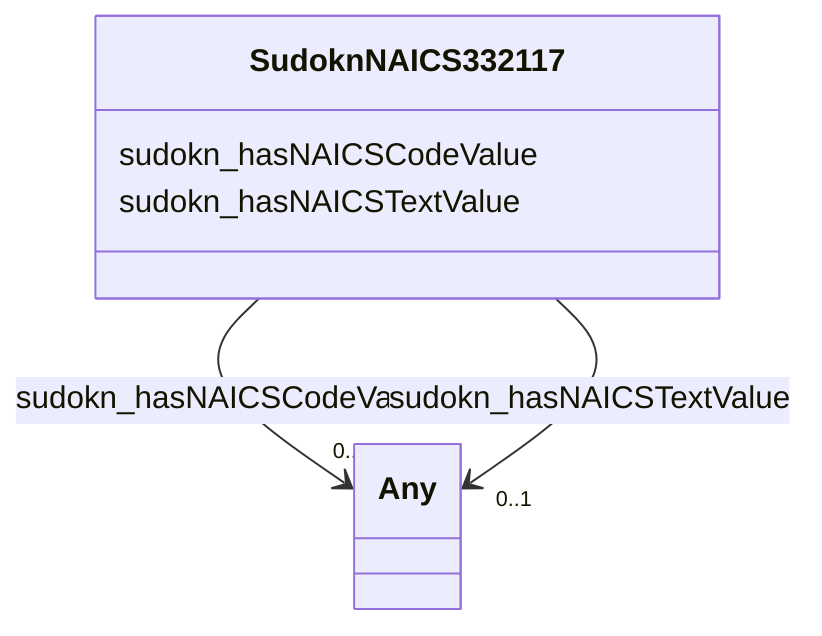

# Class: TODO -- what's a good name for this class (type)? (sudokn_NAICS332117)


_No type description provided_


URI: [sudokn:NAICS332117](http://asu.edu/semantics/SUDOKN/NAICS332117)





<!-- no inheritance hierarchy -->


## Slots

| Name | Cardinality and Range | Description | Inheritance |
| ---  | --- | --- | --- |
| [sudokn_hasNAICSTextValue](../slots/sudokn_hasNAICSTextValue.md) | 0..1 <br/> [xsd:anyURI](http://www.w3.org/2001/XMLSchema#anyURI)&nbsp;or&nbsp;<br />[xsd:string](http://www.w3.org/2001/XMLSchema#string) | No slot description provided | direct |
| [sudokn_hasNAICSCodeValue](../slots/sudokn_hasNAICSCodeValue.md) | 0..1 <br/> [xsd:integer](http://www.w3.org/2001/XMLSchema#integer)&nbsp;or&nbsp;<br />[xsd:anyURI](http://www.w3.org/2001/XMLSchema#anyURI) | No slot description provided | direct |


## Usages

| used by | used in | type | used |
| ---  | --- | --- | --- |
| [IoManufacturer](../classes/IoManufacturer.md) | [sudokn_hasPrimaryNAICSClassifier](../slots/sudokn_hasPrimaryNAICSClassifier.md) | any_of[range] | [SudoknNAICS332117](../classes/SudoknNAICS332117.md) |


## TODOs

* TODO -- Todos for this class go here
* or you can delete the todos
* if you think the class is perfect.

## Identifier and Mapping Information


### Schema Source


* from schema: sudokn-kg


## Mappings

| Mapping Type | Mapped Value |
| ---  | ---  |
| self | sudokn:NAICS332117 |
| native | sudokn-kg/:SudoknNAICS332117 |


## LinkML Source

<!-- TODO: investigate https://stackoverflow.com/questions/37606292/how-to-create-tabbed-code-blocks-in-mkdocs-or-sphinx -->

### Direct

<details>
```yaml
name: sudokn_NAICS332117
description: No type description provided
title: TODO -- what's a good name for this class (type)?
todos:
- TODO -- Todos for this class go here
- or you can delete the todos
- if you think the class is perfect.
notes:
- Class with 1 occurences.
from_schema: sudokn-kg
rank: 1000
slots:
- sudokn_hasNAICSTextValue
- sudokn_hasNAICSCodeValue
class_uri: sudokn:NAICS332117

```
</details>

### Induced

<details>
```yaml
name: sudokn_NAICS332117
description: No type description provided
title: TODO -- what's a good name for this class (type)?
todos:
- TODO -- Todos for this class go here
- or you can delete the todos
- if you think the class is perfect.
notes:
- Class with 1 occurences.
from_schema: sudokn-kg
rank: 1000
attributes:
  sudokn_hasNAICSTextValue:
    name: sudokn_hasNAICSTextValue
    description: No slot description provided
    title: has NAICS text value
    todos:
    - TODO -- Todos for this slot go here
    - or you can delete the todos
    - if you think the class is perfect.
    comments:
    - 23 occurrences with subject type sudokn_NAICSClassifier and object type string.
    - 1 occurrences with subject type sudokn_NAICS332111 and object type string.
    - 1 occurrences with subject type sudokn_NAICS332112 and object type string.
    - 1 occurrences with subject type sudokn_NAICS332114 and object type string.
    - 1 occurrences with subject type sudokn_NAICS332115 and object type string.
    - 1 occurrences with subject type sudokn_NAICS332116 and object type string.
    - 1 occurrences with subject type sudokn_NAICS332117 and object type string.
    - 1 occurrences with subject type sudokn_NAICS332211 and object type string.
    - 1 occurrences with subject type sudokn_NAICS332212 and object type string.
    - 1 occurrences with subject type sudokn_NAICS332213 and object type string.
    - 1 occurrences with subject type sudokn_NAICS332214 and object type string.
    - 1 occurrences with subject type sudokn_NAICS332311 and object type string.
    - 1 occurrences with subject type sudokn_NAICS332312 and object type string.
    - 1 occurrences with subject type sudokn_NAICS332313 and object type string.
    - 1 occurrences with subject type sudokn_NAICS332321 and object type string.
    - 1 occurrences with subject type sudokn_NAICS332322 and object type string.
    - 1 occurrences with subject type sudokn_NAICS332323 and object type string.
    - 1 occurrences with subject type sudokn_NAICS332410 and object type string.
    - 1 occurrences with subject type sudokn_NAICS332420 and object type string.
    - 1 occurrences with subject type sudokn_NAICS332431 and object type string.
    - 1 occurrences with subject type sudokn_NAICS332439 and object type string.
    - 1 occurrences with subject type sudokn_NAICS332510 and object type string.
    - 1 occurrences with subject type sudokn_NAICS332611 and object type string.
    - 1 occurrences with subject type sudokn_NAICS332612 and object type string.
    - 1 occurrences with subject type sudokn_NAICS332618 and object type string.
    - 1 occurrences with subject type sudokn_NAICS332710 and object type string.
    - 1 occurrences with subject type sudokn_NAICS332721 and object type string.
    - 1 occurrences with subject type sudokn_NAICS332722 and object type string.
    - 1 occurrences with subject type sudokn_NAICS332811 and object type string.
    - 1 occurrences with subject type sudokn_NAICS332812 and object type string.
    - 1 occurrences with subject type sudokn_NAICS332813 and object type string.
    - 1 occurrences with subject type sudokn_NAICS332911 and object type string.
    - 1 occurrences with subject type sudokn_NAICS332912 and object type string.
    - 1 occurrences with subject type sudokn_NAICS332913 and object type string.
    - 1 occurrences with subject type sudokn_NAICS332919 and object type string.
    - 1 occurrences with subject type sudokn_NAICS332991 and object type string.
    - 1 occurrences with subject type sudokn_NAICS332992 and object type string.
    - 1 occurrences with subject type sudokn_NAICS332994 and object type string.
    - 1 occurrences with subject type sudokn_NAICS332995 and object type string.
    - 1 occurrences with subject type sudokn_NAICS332996 and object type string.
    - 1 occurrences with subject type sudokn_NAICS332997 and object type string.
    - 1 occurrences with subject type sudokn_NAICS332998 and object type string.
    - 1 occurrences with subject type sudokn_NAICS332999 and object type string.
    examples:
    - value: sudokn:NAICS-221 sudokn:hasNAICSTextValue Utilities
    - value: sudokn:naics-332111-inst sudokn:hasNAICSTextValue IRON AND STEEL FORGING
    - value: sudokn:naics-332112-inst sudokn:hasNAICSTextValue NONFERROUS FORGING
    - value: sudokn:naics-332114-inst sudokn:hasNAICSTextValue CUSTOM ROLL FORMING
    - value: sudokn:naics-332115-inst sudokn:hasNAICSTextValue CROWN AND CLOSURE MANUFACTURING
    - value: sudokn:naics-332116-inst sudokn:hasNAICSTextValue METAL STAMPING
    - value: sudokn:naics-332117-inst sudokn:hasNAICSTextValue POWDER METALLURGY PART
        MANUFACTURING
    - value: sudokn:naics-332211-inst sudokn:hasNAICSTextValue CUTLERY AND FLATWARE
        (EXCEPT PRECIOUS) MANUFACTURING
    - value: sudokn:naics-332212-inst sudokn:hasNAICSTextValue HAND AND EDGE TOOL
        MANUFACTURING
    - value: sudokn:naics-332213-inst sudokn:hasNAICSTextValue SAW BLADE AND HANDSAW
        MANUFACTURING
    - value: sudokn:naics-332214-inst sudokn:hasNAICSTextValue KITCHEN UTENSIL, POT,
        AND PAN MANUFACTURING
    - value: sudokn:naics-332311-inst sudokn:hasNAICSTextValue PREFABRICATED METAL
        BUILDING AND COMPONENT MANUFACTURING
    - value: sudokn:naics-332312-inst sudokn:hasNAICSTextValue FABRICATED STRUCTURAL
        METAL MANUFACTURING
    - value: sudokn:naics-332313-inst sudokn:hasNAICSTextValue PLATE WORK MANUFACTURING
    - value: sudokn:naics-332321-inst sudokn:hasNAICSTextValue METAL WINDOW AND DOOR
        MANUFACTURING
    - value: sudokn:naics-332322-inst sudokn:hasNAICSTextValue SHEET METAL WORK MANUFACTURING
    - value: sudokn:naics-332323-inst sudokn:hasNAICSTextValue ORNAMENTAL AND ARCHITECTURAL
        METAL WORK MANUFACTURING
    - value: sudokn:naics-332410-inst sudokn:hasNAICSTextValue POWER BOILER AND HEAT
        EXCHANGER MANUFACTURING
    - value: sudokn:naics-332420-inst sudokn:hasNAICSTextValue METAL TANK (HEAVY GAUGE)
        MANUFACTURING
    - value: sudokn:naics-332431-inst sudokn:hasNAICSTextValue METAL CAN MANUFACTURING
    - value: sudokn:naics-332439-inst sudokn:hasNAICSTextValue OTHER METAL CONTAINER
        MANUFACTURING
    - value: sudokn:naics-332510-inst sudokn:hasNAICSTextValue HARDWARE MANUFACTURING
    - value: sudokn:naics-332611-inst sudokn:hasNAICSTextValue SPRING (HEAVY GAUGE)
        MANUFACTURING
    - value: sudokn:naics-332612-inst sudokn:hasNAICSTextValue SPRING (LIGHT GAUGE)
        MANUFACTURING
    - value: sudokn:naics-332618-inst sudokn:hasNAICSTextValue OTHER FABRICATED WIRE
        PRODUCT MANUFACTURING
    - value: sudokn:naics-332710-inst sudokn:hasNAICSTextValue MACHINE SHOPS
    - value: sudokn:naics-332721-inst sudokn:hasNAICSTextValue PRECISION TURNED PRODUCT
        MANUFACTURING
    - value: sudokn:naics-332722-inst sudokn:hasNAICSTextValue BOLT, NUT, SCREW, RIVET,
        AND WASHER MANUFACTURING
    - value: sudokn:naics-332811-inst sudokn:hasNAICSTextValue METAL HEAT TREATING
    - value: sudokn:naics-332812-inst sudokn:hasNAICSTextValue METAL COATING, ENGRAVING
        (EXCEPT JEWELRY AND SILVERWARE), AND ALLIED SERVICES TO MANUFACTURERS
    - value: sudokn:naics-332813-inst sudokn:hasNAICSTextValue ELECTROPLATING, PLATING,
        POLISHING, ANODIZING AND COLORING
    - value: sudokn:naics-332911-inst sudokn:hasNAICSTextValue INDUSTRIAL VALVE MANUFACTURING
    - value: sudokn:naics-332912-inst sudokn:hasNAICSTextValue FLUID POWER VALVE AND
        HOSE FITTING MANUFACTURING
    - value: sudokn:naics-332913-inst sudokn:hasNAICSTextValue PLUMBING FIXTURE FITTING
        AND TRIM MANUFACTURING
    - value: sudokn:naics-332919-inst sudokn:hasNAICSTextValue OTHER METAL VALVE AND
        PIPE FITTING MANUFACTURING
    - value: sudokn:naics-332991-inst sudokn:hasNAICSTextValue BALL AND ROLLER BEARING
        MANUFACTURING
    - value: sudokn:naics-332992-inst sudokn:hasNAICSTextValue SMALL ARMS AMMUNITION
        MANUFACTURING
    - value: sudokn:naics-332994-inst sudokn:hasNAICSTextValue SMALL ARMS MANUFACTURING
    - value: sudokn:naics-332995-inst sudokn:hasNAICSTextValue OTHER ORDNANCE AND
        ACCESSORIES MANUFACTURING
    - value: sudokn:naics-332996-inst sudokn:hasNAICSTextValue FABRICATED PIPE AND
        PIPE FITTING MANUFACTURING
    - value: sudokn:naics-332997-inst sudokn:hasNAICSTextValue INDUSTRIAL PATTERN
        MANUFACTURING
    - value: sudokn:naics-332998-inst sudokn:hasNAICSTextValue ENAMELED IRON AND METAL
        SANITARY WARE MANUFACTURING
    - value: sudokn:naics-332999-inst sudokn:hasNAICSTextValue ALL OTHER MISCELLANEOUS
        FABRICATED METAL PRODUCT MANUFACTURING
    from_schema: sudokn-kg
    rank: 1000
    domain: sudokn_NAICSClassifier
    slot_uri: sudokn:hasNAICSTextValue
    alias: sudokn_hasNAICSTextValue
    owner: sudokn_NAICS332117
    domain_of:
    - sudokn_NAICS332111
    - sudokn_NAICS332112
    - sudokn_NAICS332114
    - sudokn_NAICS332115
    - sudokn_NAICS332116
    - sudokn_NAICS332117
    - sudokn_NAICS332211
    - sudokn_NAICS332212
    - sudokn_NAICS332213
    - sudokn_NAICS332214
    - sudokn_NAICS332311
    - sudokn_NAICS332312
    - sudokn_NAICS332313
    - sudokn_NAICS332321
    - sudokn_NAICS332322
    - sudokn_NAICS332323
    - sudokn_NAICS332410
    - sudokn_NAICS332420
    - sudokn_NAICS332431
    - sudokn_NAICS332439
    - sudokn_NAICS332510
    - sudokn_NAICS332611
    - sudokn_NAICS332612
    - sudokn_NAICS332618
    - sudokn_NAICS332710
    - sudokn_NAICS332721
    - sudokn_NAICS332722
    - sudokn_NAICS332811
    - sudokn_NAICS332812
    - sudokn_NAICS332813
    - sudokn_NAICS332911
    - sudokn_NAICS332912
    - sudokn_NAICS332913
    - sudokn_NAICS332919
    - sudokn_NAICS332991
    - sudokn_NAICS332992
    - sudokn_NAICS332994
    - sudokn_NAICS332995
    - sudokn_NAICS332996
    - sudokn_NAICS332997
    - sudokn_NAICS332998
    - sudokn_NAICS332999
    - sudokn_NAICSClassifier
    subproperty_of: iosc_hasTextValue
    range: Any
    any_of:
    - range: uri
    - range: string
  sudokn_hasNAICSCodeValue:
    name: sudokn_hasNAICSCodeValue
    description: No slot description provided
    title: has NAICS code value
    todos:
    - TODO -- Todos for this slot go here
    - or you can delete the todos
    - if you think the class is perfect.
    comments:
    - 22 occurrences with subject type sudokn_NAICSClassifier and object type integer.
    - 1 occurrences with subject type sudokn_NAICS332111 and object type integer.
    - 1 occurrences with subject type sudokn_NAICS332112 and object type integer.
    - 1 occurrences with subject type sudokn_NAICS332114 and object type integer.
    - 1 occurrences with subject type sudokn_NAICS332115 and object type integer.
    - 1 occurrences with subject type sudokn_NAICS332116 and object type integer.
    - 1 occurrences with subject type sudokn_NAICS332117 and object type integer.
    - 1 occurrences with subject type sudokn_NAICS332211 and object type integer.
    - 1 occurrences with subject type sudokn_NAICS332212 and object type integer.
    - 1 occurrences with subject type sudokn_NAICS332213 and object type integer.
    - 1 occurrences with subject type sudokn_NAICS332214 and object type integer.
    - 1 occurrences with subject type sudokn_NAICS332311 and object type integer.
    - 1 occurrences with subject type sudokn_NAICS332312 and object type integer.
    - 1 occurrences with subject type sudokn_NAICS332313 and object type integer.
    - 1 occurrences with subject type sudokn_NAICS332321 and object type integer.
    - 1 occurrences with subject type sudokn_NAICS332322 and object type integer.
    - 1 occurrences with subject type sudokn_NAICS332323 and object type integer.
    - 1 occurrences with subject type sudokn_NAICS332410 and object type integer.
    - 1 occurrences with subject type sudokn_NAICS332420 and object type integer.
    - 1 occurrences with subject type sudokn_NAICS332431 and object type integer.
    - 1 occurrences with subject type sudokn_NAICS332439 and object type integer.
    - 1 occurrences with subject type sudokn_NAICS332510 and object type integer.
    - 1 occurrences with subject type sudokn_NAICS332611 and object type integer.
    - 1 occurrences with subject type sudokn_NAICS332612 and object type integer.
    - 1 occurrences with subject type sudokn_NAICS332618 and object type integer.
    - 1 occurrences with subject type sudokn_NAICS332710 and object type integer.
    - 1 occurrences with subject type sudokn_NAICS332721 and object type integer.
    - 1 occurrences with subject type sudokn_NAICS332722 and object type integer.
    - 1 occurrences with subject type sudokn_NAICS332811 and object type integer.
    - 1 occurrences with subject type sudokn_NAICS332812 and object type integer.
    - 1 occurrences with subject type sudokn_NAICS332813 and object type integer.
    - 1 occurrences with subject type sudokn_NAICS332911 and object type integer.
    - 1 occurrences with subject type sudokn_NAICS332912 and object type integer.
    - 1 occurrences with subject type sudokn_NAICS332913 and object type integer.
    - 1 occurrences with subject type sudokn_NAICS332919 and object type integer.
    - 1 occurrences with subject type sudokn_NAICS332991 and object type integer.
    - 1 occurrences with subject type sudokn_NAICS332992 and object type integer.
    - 1 occurrences with subject type sudokn_NAICS332994 and object type integer.
    - 1 occurrences with subject type sudokn_NAICS332995 and object type integer.
    - 1 occurrences with subject type sudokn_NAICS332996 and object type integer.
    - 1 occurrences with subject type sudokn_NAICS332997 and object type integer.
    - 1 occurrences with subject type sudokn_NAICS332998 and object type integer.
    - 1 occurrences with subject type sudokn_NAICS332999 and object type integer.
    examples:
    - value: sudokn:NAICS-221 sudokn:hasNAICSCodeValue 221
    - value: sudokn:naics-332111-inst sudokn:hasNAICSCodeValue 332111
    - value: sudokn:naics-332112-inst sudokn:hasNAICSCodeValue 332112
    - value: sudokn:naics-332114-inst sudokn:hasNAICSCodeValue 332114
    - value: sudokn:naics-332115-inst sudokn:hasNAICSCodeValue 332115
    - value: sudokn:naics-332116-inst sudokn:hasNAICSCodeValue 332116
    - value: sudokn:naics-332117-inst sudokn:hasNAICSCodeValue 332117
    - value: sudokn:naics-332211-inst sudokn:hasNAICSCodeValue 332211
    - value: sudokn:naics-332212-inst sudokn:hasNAICSCodeValue 332212
    - value: sudokn:naics-332213-inst sudokn:hasNAICSCodeValue 332213
    - value: sudokn:naics-332214-inst sudokn:hasNAICSCodeValue 332214
    - value: sudokn:naics-332311-inst sudokn:hasNAICSCodeValue 332311
    - value: sudokn:naics-332312-inst sudokn:hasNAICSCodeValue 332312
    - value: sudokn:naics-332313-inst sudokn:hasNAICSCodeValue 332313
    - value: sudokn:naics-332321-inst sudokn:hasNAICSCodeValue 332321
    - value: sudokn:naics-332322-inst sudokn:hasNAICSCodeValue 332322
    - value: sudokn:naics-332323-inst sudokn:hasNAICSCodeValue 332323
    - value: sudokn:naics-332410-inst sudokn:hasNAICSCodeValue 332410
    - value: sudokn:naics-332420-inst sudokn:hasNAICSCodeValue 332420
    - value: sudokn:naics-332431-inst sudokn:hasNAICSCodeValue 332431
    - value: sudokn:naics-332439-inst sudokn:hasNAICSCodeValue 332439
    - value: sudokn:naics-332510-inst sudokn:hasNAICSCodeValue 332510
    - value: sudokn:naics-332611-inst sudokn:hasNAICSCodeValue 332611
    - value: sudokn:naics-332612-inst sudokn:hasNAICSCodeValue 332612
    - value: sudokn:naics-332618-inst sudokn:hasNAICSCodeValue 332618
    - value: sudokn:naics-332710-inst sudokn:hasNAICSCodeValue 332710
    - value: sudokn:naics-332721-inst sudokn:hasNAICSCodeValue 332721
    - value: sudokn:naics-332722-inst sudokn:hasNAICSCodeValue 332722
    - value: sudokn:naics-332811-inst sudokn:hasNAICSCodeValue 332811
    - value: sudokn:naics-332812-inst sudokn:hasNAICSCodeValue 332812
    - value: sudokn:naics-332813-inst sudokn:hasNAICSCodeValue 332813
    - value: sudokn:naics-332911-inst sudokn:hasNAICSCodeValue 332911
    - value: sudokn:naics-332912-inst sudokn:hasNAICSCodeValue 332912
    - value: sudokn:naics-332913-inst sudokn:hasNAICSCodeValue 332913
    - value: sudokn:naics-332919-inst sudokn:hasNAICSCodeValue 332919
    - value: sudokn:naics-332991-inst sudokn:hasNAICSCodeValue 332991
    - value: sudokn:naics-332992-inst sudokn:hasNAICSCodeValue 332992
    - value: sudokn:naics-332994-inst sudokn:hasNAICSCodeValue 332994
    - value: sudokn:naics-332995-inst sudokn:hasNAICSCodeValue 332995
    - value: sudokn:naics-332996-inst sudokn:hasNAICSCodeValue 332996
    - value: sudokn:naics-332997-inst sudokn:hasNAICSCodeValue 332997
    - value: sudokn:naics-332998-inst sudokn:hasNAICSCodeValue 332998
    - value: sudokn:naics-332999-inst sudokn:hasNAICSCodeValue 332999
    from_schema: sudokn-kg
    rank: 1000
    domain: sudokn_NAICSClassifier
    slot_uri: sudokn:hasNAICSCodeValue
    alias: sudokn_hasNAICSCodeValue
    owner: sudokn_NAICS332117
    domain_of:
    - sudokn_NAICS332111
    - sudokn_NAICS332112
    - sudokn_NAICS332114
    - sudokn_NAICS332115
    - sudokn_NAICS332116
    - sudokn_NAICS332117
    - sudokn_NAICS332211
    - sudokn_NAICS332212
    - sudokn_NAICS332213
    - sudokn_NAICS332214
    - sudokn_NAICS332311
    - sudokn_NAICS332312
    - sudokn_NAICS332313
    - sudokn_NAICS332321
    - sudokn_NAICS332322
    - sudokn_NAICS332323
    - sudokn_NAICS332410
    - sudokn_NAICS332420
    - sudokn_NAICS332431
    - sudokn_NAICS332439
    - sudokn_NAICS332510
    - sudokn_NAICS332611
    - sudokn_NAICS332612
    - sudokn_NAICS332618
    - sudokn_NAICS332710
    - sudokn_NAICS332721
    - sudokn_NAICS332722
    - sudokn_NAICS332811
    - sudokn_NAICS332812
    - sudokn_NAICS332813
    - sudokn_NAICS332911
    - sudokn_NAICS332912
    - sudokn_NAICS332913
    - sudokn_NAICS332919
    - sudokn_NAICS332991
    - sudokn_NAICS332992
    - sudokn_NAICS332994
    - sudokn_NAICS332995
    - sudokn_NAICS332996
    - sudokn_NAICS332997
    - sudokn_NAICS332998
    - sudokn_NAICS332999
    - sudokn_NAICSClassifier
    range: Any
    any_of:
    - range: integer
    - range: uri
class_uri: sudokn:NAICS332117

```
</details>