# Class: machinery manufacturing (sudokn_NAICS333)


URI: [sudokn:NAICS333](http://asu.edu/semantics/SUDOKN/NAICS333)

```mermaid
 classDiagram
    class SudoknNAICS333
    click SudoknNAICS333 href "../SudoknNAICS333"
      SudoknNAICS33 <|-- SudoknNAICS333
        click SudoknNAICS33 href "../SudoknNAICS33"
      

      SudoknNAICS333 <|-- SudoknNAICS332993
        click SudoknNAICS332993 href "../SudoknNAICS332993"
      SudoknNAICS333 <|-- SudoknNAICS332994
        click SudoknNAICS332994 href "../SudoknNAICS332994"
      SudoknNAICS333 <|-- SudoknNAICS332996
        click SudoknNAICS332996 href "../SudoknNAICS332996"
      SudoknNAICS333 <|-- SudoknNAICS332999
        click SudoknNAICS332999 href "../SudoknNAICS332999"
      SudoknNAICS333 <|-- SudoknNAICS333111
        click SudoknNAICS333111 href "../SudoknNAICS333111"
      SudoknNAICS333 <|-- SudoknNAICS333112
        click SudoknNAICS333112 href "../SudoknNAICS333112"
      SudoknNAICS333 <|-- SudoknNAICS333120
        click SudoknNAICS333120 href "../SudoknNAICS333120"
      SudoknNAICS333 <|-- SudoknNAICS333131
        click SudoknNAICS333131 href "../SudoknNAICS333131"
      SudoknNAICS333 <|-- SudoknNAICS333132
        click SudoknNAICS333132 href "../SudoknNAICS333132"
      SudoknNAICS333 <|-- SudoknNAICS333241
        click SudoknNAICS333241 href "../SudoknNAICS333241"
      SudoknNAICS333 <|-- SudoknNAICS333242
        click SudoknNAICS333242 href "../SudoknNAICS333242"
      SudoknNAICS333 <|-- SudoknNAICS333243
        click SudoknNAICS333243 href "../SudoknNAICS333243"
      SudoknNAICS333 <|-- SudoknNAICS333248
        click SudoknNAICS333248 href "../SudoknNAICS333248"
      SudoknNAICS333 <|-- SudoknNAICS333310
        click SudoknNAICS333310 href "../SudoknNAICS333310"
      SudoknNAICS333 <|-- SudoknNAICS333413
        click SudoknNAICS333413 href "../SudoknNAICS333413"
      SudoknNAICS333 <|-- SudoknNAICS333414
        click SudoknNAICS333414 href "../SudoknNAICS333414"
      SudoknNAICS333 <|-- SudoknNAICS333415
        click SudoknNAICS333415 href "../SudoknNAICS333415"
      SudoknNAICS333 <|-- SudoknNAICS333511
        click SudoknNAICS333511 href "../SudoknNAICS333511"
      SudoknNAICS333 <|-- SudoknNAICS333514
        click SudoknNAICS333514 href "../SudoknNAICS333514"
      SudoknNAICS333 <|-- SudoknNAICS333515
        click SudoknNAICS333515 href "../SudoknNAICS333515"
      SudoknNAICS333 <|-- SudoknNAICS333517
        click SudoknNAICS333517 href "../SudoknNAICS333517"
      SudoknNAICS333 <|-- SudoknNAICS333519
        click SudoknNAICS333519 href "../SudoknNAICS333519"
      SudoknNAICS333 <|-- SudoknNAICS333611
        click SudoknNAICS333611 href "../SudoknNAICS333611"
      SudoknNAICS333 <|-- SudoknNAICS333612
        click SudoknNAICS333612 href "../SudoknNAICS333612"
      SudoknNAICS333 <|-- SudoknNAICS333613
        click SudoknNAICS333613 href "../SudoknNAICS333613"
      SudoknNAICS333 <|-- SudoknNAICS333618
        click SudoknNAICS333618 href "../SudoknNAICS333618"
      SudoknNAICS333 <|-- SudoknNAICS333912
        click SudoknNAICS333912 href "../SudoknNAICS333912"
      SudoknNAICS333 <|-- SudoknNAICS333914
        click SudoknNAICS333914 href "../SudoknNAICS333914"
      SudoknNAICS333 <|-- SudoknNAICS333921
        click SudoknNAICS333921 href "../SudoknNAICS333921"
      SudoknNAICS333 <|-- SudoknNAICS333922
        click SudoknNAICS333922 href "../SudoknNAICS333922"
      SudoknNAICS333 <|-- SudoknNAICS333923
        click SudoknNAICS333923 href "../SudoknNAICS333923"
      SudoknNAICS333 <|-- SudoknNAICS333924
        click SudoknNAICS333924 href "../SudoknNAICS333924"
      SudoknNAICS333 <|-- SudoknNAICS333991
        click SudoknNAICS333991 href "../SudoknNAICS333991"
      SudoknNAICS333 <|-- SudoknNAICS333992
        click SudoknNAICS333992 href "../SudoknNAICS333992"
      SudoknNAICS333 <|-- SudoknNAICS333993
        click SudoknNAICS333993 href "../SudoknNAICS333993"
      SudoknNAICS333 <|-- SudoknNAICS333994
        click SudoknNAICS333994 href "../SudoknNAICS333994"
      SudoknNAICS333 <|-- SudoknNAICS333995
        click SudoknNAICS333995 href "../SudoknNAICS333995"
      SudoknNAICS333 <|-- SudoknNAICS333996
        click SudoknNAICS333996 href "../SudoknNAICS333996"
      SudoknNAICS333 <|-- SudoknNAICS333998
        click SudoknNAICS333998 href "../SudoknNAICS333998"
      
      
      SudoknNAICS333 : sudokn_hasNAICSCodeValue
        
          
    
    
    SudoknNAICS333 --> "0..1" Integer : sudokn_hasNAICSCodeValue
    click Integer href "../Integer"

        
      SudoknNAICS333 : sudokn_hasNAICSTextValue
        
          
    
    
    SudoknNAICS333 --> "0..1" String : sudokn_hasNAICSTextValue
    click String href "../String"

        
      
```





## Inheritance
* [IoInformationContentEntity](../classes/IoInformationContentEntity.md)
    * [SudoknClassifier](../classes/SudoknClassifier.md)
        * [SudoknNAICSClassifier](../classes/SudoknNAICSClassifier.md)
            * [SudoknNAICS33](../classes/SudoknNAICS33.md)
                * **SudoknNAICS333**
                    * [SudoknNAICS332993](../classes/SudoknNAICS332993.md)
                    * [SudoknNAICS332994](../classes/SudoknNAICS332994.md)
                    * [SudoknNAICS332996](../classes/SudoknNAICS332996.md)
                    * [SudoknNAICS332999](../classes/SudoknNAICS332999.md)
                    * [SudoknNAICS333111](../classes/SudoknNAICS333111.md)
                    * [SudoknNAICS333112](../classes/SudoknNAICS333112.md)
                    * [SudoknNAICS333120](../classes/SudoknNAICS333120.md)
                    * [SudoknNAICS333131](../classes/SudoknNAICS333131.md)
                    * [SudoknNAICS333132](../classes/SudoknNAICS333132.md)
                    * [SudoknNAICS333241](../classes/SudoknNAICS333241.md)
                    * [SudoknNAICS333242](../classes/SudoknNAICS333242.md)
                    * [SudoknNAICS333243](../classes/SudoknNAICS333243.md)
                    * [SudoknNAICS333248](../classes/SudoknNAICS333248.md)
                    * [SudoknNAICS333310](../classes/SudoknNAICS333310.md)
                    * [SudoknNAICS333413](../classes/SudoknNAICS333413.md)
                    * [SudoknNAICS333414](../classes/SudoknNAICS333414.md)
                    * [SudoknNAICS333415](../classes/SudoknNAICS333415.md)
                    * [SudoknNAICS333511](../classes/SudoknNAICS333511.md)
                    * [SudoknNAICS333514](../classes/SudoknNAICS333514.md)
                    * [SudoknNAICS333515](../classes/SudoknNAICS333515.md)
                    * [SudoknNAICS333517](../classes/SudoknNAICS333517.md)
                    * [SudoknNAICS333519](../classes/SudoknNAICS333519.md)
                    * [SudoknNAICS333611](../classes/SudoknNAICS333611.md)
                    * [SudoknNAICS333612](../classes/SudoknNAICS333612.md)
                    * [SudoknNAICS333613](../classes/SudoknNAICS333613.md)
                    * [SudoknNAICS333618](../classes/SudoknNAICS333618.md)
                    * [SudoknNAICS333912](../classes/SudoknNAICS333912.md)
                    * [SudoknNAICS333914](../classes/SudoknNAICS333914.md)
                    * [SudoknNAICS333921](../classes/SudoknNAICS333921.md)
                    * [SudoknNAICS333922](../classes/SudoknNAICS333922.md)
                    * [SudoknNAICS333923](../classes/SudoknNAICS333923.md)
                    * [SudoknNAICS333924](../classes/SudoknNAICS333924.md)
                    * [SudoknNAICS333991](../classes/SudoknNAICS333991.md)
                    * [SudoknNAICS333992](../classes/SudoknNAICS333992.md)
                    * [SudoknNAICS333993](../classes/SudoknNAICS333993.md)
                    * [SudoknNAICS333994](../classes/SudoknNAICS333994.md)
                    * [SudoknNAICS333995](../classes/SudoknNAICS333995.md)
                    * [SudoknNAICS333996](../classes/SudoknNAICS333996.md)
                    * [SudoknNAICS333998](../classes/SudoknNAICS333998.md)


## Slots

| Name | Cardinality and Range | Description | Inheritance | Occurrences |
| ---  | --- | --- | --- | --- |
| [sudokn_hasNAICSTextValue](../slots/sudokn_hasNAICSTextValue.md) | 0..1 <br/> [xsd:string](http://www.w3.org/2001/XMLSchema#string) |  | [SudoknNAICSClassifier](../classes/SudoknNAICSClassifier.md) |  |
| [sudokn_hasNAICSCodeValue](../slots/sudokn_hasNAICSCodeValue.md) | 0..1 <br/> [xsd:integer](http://www.w3.org/2001/XMLSchema#integer) |  | [SudoknNAICSClassifier](../classes/SudoknNAICSClassifier.md) |  |


## LinkML Source

<!-- TODO: investigate https://stackoverflow.com/questions/37606292/how-to-create-tabbed-code-blocks-in-mkdocs-or-sphinx -->

### Direct

<details>

```yaml
name: sudokn_NAICS333
title: machinery manufacturing
from_schema: okns:sudokn-kg
rank: 1000
is_a: sudokn_NAICS33
class_uri: sudokn:NAICS333

```
</details>

### Induced

<details>

```yaml
name: sudokn_NAICS333
title: machinery manufacturing
from_schema: okns:sudokn-kg
rank: 1000
is_a: sudokn_NAICS33
attributes:
  sudokn_hasNAICSTextValue:
    name: sudokn_hasNAICSTextValue
    title: has NAICS text value
    from_schema: okns:sudokn-kg
    rank: 1000
    domain: sudokn_NAICSClassifier
    slot_uri: sudokn:hasNAICSTextValue
    alias: sudokn_hasNAICSTextValue
    owner: sudokn_NAICS333
    domain_of:
    - sudokn_NAICS332111
    - sudokn_NAICS332112
    - sudokn_NAICS332114
    - sudokn_NAICS332115
    - sudokn_NAICS332116
    - sudokn_NAICS332117
    - sudokn_NAICS332211
    - sudokn_NAICS332212
    - sudokn_NAICS332213
    - sudokn_NAICS332214
    - sudokn_NAICS332311
    - sudokn_NAICS332312
    - sudokn_NAICS332313
    - sudokn_NAICS332321
    - sudokn_NAICS332322
    - sudokn_NAICS332323
    - sudokn_NAICS332410
    - sudokn_NAICS332420
    - sudokn_NAICS332431
    - sudokn_NAICS332439
    - sudokn_NAICS332510
    - sudokn_NAICS332611
    - sudokn_NAICS332612
    - sudokn_NAICS332618
    - sudokn_NAICS332710
    - sudokn_NAICS332721
    - sudokn_NAICS332722
    - sudokn_NAICS332811
    - sudokn_NAICS332812
    - sudokn_NAICS332813
    - sudokn_NAICS332911
    - sudokn_NAICS332912
    - sudokn_NAICS332913
    - sudokn_NAICS332919
    - sudokn_NAICS332991
    - sudokn_NAICS332992
    - sudokn_NAICS332994
    - sudokn_NAICS332995
    - sudokn_NAICS332996
    - sudokn_NAICS332997
    - sudokn_NAICS332998
    - sudokn_NAICS332999
    - sudokn_NAICSClassifier
    subproperty_of: iosc_hasTextValue
    range: string
  sudokn_hasNAICSCodeValue:
    name: sudokn_hasNAICSCodeValue
    title: has NAICS code value
    from_schema: okns:sudokn-kg
    rank: 1000
    domain: sudokn_NAICSClassifier
    slot_uri: sudokn:hasNAICSCodeValue
    alias: sudokn_hasNAICSCodeValue
    owner: sudokn_NAICS333
    domain_of:
    - sudokn_NAICS332111
    - sudokn_NAICS332112
    - sudokn_NAICS332114
    - sudokn_NAICS332115
    - sudokn_NAICS332116
    - sudokn_NAICS332117
    - sudokn_NAICS332211
    - sudokn_NAICS332212
    - sudokn_NAICS332213
    - sudokn_NAICS332214
    - sudokn_NAICS332311
    - sudokn_NAICS332312
    - sudokn_NAICS332313
    - sudokn_NAICS332321
    - sudokn_NAICS332322
    - sudokn_NAICS332323
    - sudokn_NAICS332410
    - sudokn_NAICS332420
    - sudokn_NAICS332431
    - sudokn_NAICS332439
    - sudokn_NAICS332510
    - sudokn_NAICS332611
    - sudokn_NAICS332612
    - sudokn_NAICS332618
    - sudokn_NAICS332710
    - sudokn_NAICS332721
    - sudokn_NAICS332722
    - sudokn_NAICS332811
    - sudokn_NAICS332812
    - sudokn_NAICS332813
    - sudokn_NAICS332911
    - sudokn_NAICS332912
    - sudokn_NAICS332913
    - sudokn_NAICS332919
    - sudokn_NAICS332991
    - sudokn_NAICS332992
    - sudokn_NAICS332994
    - sudokn_NAICS332995
    - sudokn_NAICS332996
    - sudokn_NAICS332997
    - sudokn_NAICS332998
    - sudokn_NAICS332999
    - sudokn_NAICSClassifier
    range: integer
class_uri: sudokn:NAICS333

```
</details>