# Class: computer and electronic product manufacturing (sudokn_NAICS334)


URI: [sudokn:NAICS334](http://asu.edu/semantics/SUDOKN/NAICS334)

```mermaid
 classDiagram
    class SudoknNAICS334
    click SudoknNAICS334 href "../SudoknNAICS334"
      SudoknNAICS33 <|-- SudoknNAICS334
        click SudoknNAICS33 href "../SudoknNAICS33"
      

      SudoknNAICS334 <|-- SudoknNAICS334111
        click SudoknNAICS334111 href "../SudoknNAICS334111"
      SudoknNAICS334 <|-- SudoknNAICS334112
        click SudoknNAICS334112 href "../SudoknNAICS334112"
      SudoknNAICS334 <|-- SudoknNAICS334118
        click SudoknNAICS334118 href "../SudoknNAICS334118"
      SudoknNAICS334 <|-- SudoknNAICS334210
        click SudoknNAICS334210 href "../SudoknNAICS334210"
      SudoknNAICS334 <|-- SudoknNAICS334220
        click SudoknNAICS334220 href "../SudoknNAICS334220"
      SudoknNAICS334 <|-- SudoknNAICS334290
        click SudoknNAICS334290 href "../SudoknNAICS334290"
      SudoknNAICS334 <|-- SudoknNAICS334310
        click SudoknNAICS334310 href "../SudoknNAICS334310"
      SudoknNAICS334 <|-- SudoknNAICS334412
        click SudoknNAICS334412 href "../SudoknNAICS334412"
      SudoknNAICS334 <|-- SudoknNAICS334413
        click SudoknNAICS334413 href "../SudoknNAICS334413"
      SudoknNAICS334 <|-- SudoknNAICS334416
        click SudoknNAICS334416 href "../SudoknNAICS334416"
      SudoknNAICS334 <|-- SudoknNAICS334417
        click SudoknNAICS334417 href "../SudoknNAICS334417"
      SudoknNAICS334 <|-- SudoknNAICS334418
        click SudoknNAICS334418 href "../SudoknNAICS334418"
      SudoknNAICS334 <|-- SudoknNAICS334419
        click SudoknNAICS334419 href "../SudoknNAICS334419"
      SudoknNAICS334 <|-- SudoknNAICS334510
        click SudoknNAICS334510 href "../SudoknNAICS334510"
      SudoknNAICS334 <|-- SudoknNAICS334511
        click SudoknNAICS334511 href "../SudoknNAICS334511"
      SudoknNAICS334 <|-- SudoknNAICS334512
        click SudoknNAICS334512 href "../SudoknNAICS334512"
      SudoknNAICS334 <|-- SudoknNAICS334513
        click SudoknNAICS334513 href "../SudoknNAICS334513"
      SudoknNAICS334 <|-- SudoknNAICS334514
        click SudoknNAICS334514 href "../SudoknNAICS334514"
      SudoknNAICS334 <|-- SudoknNAICS334515
        click SudoknNAICS334515 href "../SudoknNAICS334515"
      SudoknNAICS334 <|-- SudoknNAICS334516
        click SudoknNAICS334516 href "../SudoknNAICS334516"
      SudoknNAICS334 <|-- SudoknNAICS334517
        click SudoknNAICS334517 href "../SudoknNAICS334517"
      SudoknNAICS334 <|-- SudoknNAICS334519
        click SudoknNAICS334519 href "../SudoknNAICS334519"
      SudoknNAICS334 <|-- SudoknNAICS334610
        click SudoknNAICS334610 href "../SudoknNAICS334610"
      
      
      SudoknNAICS334 : sudokn_hasNAICSCodeValue
        
          
    
    
    SudoknNAICS334 --> "0..1" Integer : sudokn_hasNAICSCodeValue
    click Integer href "../Integer"

        
      SudoknNAICS334 : sudokn_hasNAICSTextValue
        
          
    
    
    SudoknNAICS334 --> "0..1" String : sudokn_hasNAICSTextValue
    click String href "../String"

        
      
```





## Inheritance
* [IoInformationContentEntity](../classes/IoInformationContentEntity.md)
    * [SudoknClassifier](../classes/SudoknClassifier.md)
        * [SudoknNAICSClassifier](../classes/SudoknNAICSClassifier.md)
            * [SudoknNAICS33](../classes/SudoknNAICS33.md)
                * **SudoknNAICS334**
                    * [SudoknNAICS334111](../classes/SudoknNAICS334111.md)
                    * [SudoknNAICS334112](../classes/SudoknNAICS334112.md)
                    * [SudoknNAICS334118](../classes/SudoknNAICS334118.md)
                    * [SudoknNAICS334210](../classes/SudoknNAICS334210.md)
                    * [SudoknNAICS334220](../classes/SudoknNAICS334220.md)
                    * [SudoknNAICS334290](../classes/SudoknNAICS334290.md)
                    * [SudoknNAICS334310](../classes/SudoknNAICS334310.md)
                    * [SudoknNAICS334412](../classes/SudoknNAICS334412.md)
                    * [SudoknNAICS334413](../classes/SudoknNAICS334413.md)
                    * [SudoknNAICS334416](../classes/SudoknNAICS334416.md)
                    * [SudoknNAICS334417](../classes/SudoknNAICS334417.md)
                    * [SudoknNAICS334418](../classes/SudoknNAICS334418.md)
                    * [SudoknNAICS334419](../classes/SudoknNAICS334419.md)
                    * [SudoknNAICS334510](../classes/SudoknNAICS334510.md)
                    * [SudoknNAICS334511](../classes/SudoknNAICS334511.md)
                    * [SudoknNAICS334512](../classes/SudoknNAICS334512.md)
                    * [SudoknNAICS334513](../classes/SudoknNAICS334513.md)
                    * [SudoknNAICS334514](../classes/SudoknNAICS334514.md)
                    * [SudoknNAICS334515](../classes/SudoknNAICS334515.md)
                    * [SudoknNAICS334516](../classes/SudoknNAICS334516.md)
                    * [SudoknNAICS334517](../classes/SudoknNAICS334517.md)
                    * [SudoknNAICS334519](../classes/SudoknNAICS334519.md)
                    * [SudoknNAICS334610](../classes/SudoknNAICS334610.md)


## Slots

| Name | Cardinality and Range | Description | Inheritance | Occurrences |
| ---  | --- | --- | --- | --- |
| [sudokn_hasNAICSTextValue](../slots/sudokn_hasNAICSTextValue.md) | 0..1 <br/> [xsd:string](http://www.w3.org/2001/XMLSchema#string) |  | [SudoknNAICSClassifier](../classes/SudoknNAICSClassifier.md) |  |
| [sudokn_hasNAICSCodeValue](../slots/sudokn_hasNAICSCodeValue.md) | 0..1 <br/> [xsd:integer](http://www.w3.org/2001/XMLSchema#integer) |  | [SudoknNAICSClassifier](../classes/SudoknNAICSClassifier.md) |  |


## LinkML Source

<!-- TODO: investigate https://stackoverflow.com/questions/37606292/how-to-create-tabbed-code-blocks-in-mkdocs-or-sphinx -->

### Direct

<details>

```yaml
name: sudokn_NAICS334
title: computer and electronic product manufacturing
from_schema: okns:sudokn-kg
rank: 1000
is_a: sudokn_NAICS33
class_uri: sudokn:NAICS334

```
</details>

### Induced

<details>

```yaml
name: sudokn_NAICS334
title: computer and electronic product manufacturing
from_schema: okns:sudokn-kg
rank: 1000
is_a: sudokn_NAICS33
attributes:
  sudokn_hasNAICSTextValue:
    name: sudokn_hasNAICSTextValue
    title: has NAICS text value
    from_schema: okns:sudokn-kg
    rank: 1000
    domain: sudokn_NAICSClassifier
    slot_uri: sudokn:hasNAICSTextValue
    alias: sudokn_hasNAICSTextValue
    owner: sudokn_NAICS334
    domain_of:
    - sudokn_NAICS332111
    - sudokn_NAICS332112
    - sudokn_NAICS332114
    - sudokn_NAICS332115
    - sudokn_NAICS332116
    - sudokn_NAICS332117
    - sudokn_NAICS332211
    - sudokn_NAICS332212
    - sudokn_NAICS332213
    - sudokn_NAICS332214
    - sudokn_NAICS332311
    - sudokn_NAICS332312
    - sudokn_NAICS332313
    - sudokn_NAICS332321
    - sudokn_NAICS332322
    - sudokn_NAICS332323
    - sudokn_NAICS332410
    - sudokn_NAICS332420
    - sudokn_NAICS332431
    - sudokn_NAICS332439
    - sudokn_NAICS332510
    - sudokn_NAICS332611
    - sudokn_NAICS332612
    - sudokn_NAICS332618
    - sudokn_NAICS332710
    - sudokn_NAICS332721
    - sudokn_NAICS332722
    - sudokn_NAICS332811
    - sudokn_NAICS332812
    - sudokn_NAICS332813
    - sudokn_NAICS332911
    - sudokn_NAICS332912
    - sudokn_NAICS332913
    - sudokn_NAICS332919
    - sudokn_NAICS332991
    - sudokn_NAICS332992
    - sudokn_NAICS332994
    - sudokn_NAICS332995
    - sudokn_NAICS332996
    - sudokn_NAICS332997
    - sudokn_NAICS332998
    - sudokn_NAICS332999
    - sudokn_NAICSClassifier
    subproperty_of: iosc_hasTextValue
    range: string
  sudokn_hasNAICSCodeValue:
    name: sudokn_hasNAICSCodeValue
    title: has NAICS code value
    from_schema: okns:sudokn-kg
    rank: 1000
    domain: sudokn_NAICSClassifier
    slot_uri: sudokn:hasNAICSCodeValue
    alias: sudokn_hasNAICSCodeValue
    owner: sudokn_NAICS334
    domain_of:
    - sudokn_NAICS332111
    - sudokn_NAICS332112
    - sudokn_NAICS332114
    - sudokn_NAICS332115
    - sudokn_NAICS332116
    - sudokn_NAICS332117
    - sudokn_NAICS332211
    - sudokn_NAICS332212
    - sudokn_NAICS332213
    - sudokn_NAICS332214
    - sudokn_NAICS332311
    - sudokn_NAICS332312
    - sudokn_NAICS332313
    - sudokn_NAICS332321
    - sudokn_NAICS332322
    - sudokn_NAICS332323
    - sudokn_NAICS332410
    - sudokn_NAICS332420
    - sudokn_NAICS332431
    - sudokn_NAICS332439
    - sudokn_NAICS332510
    - sudokn_NAICS332611
    - sudokn_NAICS332612
    - sudokn_NAICS332618
    - sudokn_NAICS332710
    - sudokn_NAICS332721
    - sudokn_NAICS332722
    - sudokn_NAICS332811
    - sudokn_NAICS332812
    - sudokn_NAICS332813
    - sudokn_NAICS332911
    - sudokn_NAICS332912
    - sudokn_NAICS332913
    - sudokn_NAICS332919
    - sudokn_NAICS332991
    - sudokn_NAICS332992
    - sudokn_NAICS332994
    - sudokn_NAICS332995
    - sudokn_NAICS332996
    - sudokn_NAICS332997
    - sudokn_NAICS332998
    - sudokn_NAICS332999
    - sudokn_NAICSClassifier
    range: integer
class_uri: sudokn:NAICS334

```
</details>