# Class: miscellaneous manufacturing (sudokn_NAICS339)


URI: [sudokn:NAICS339](http://asu.edu/semantics/SUDOKN/NAICS339)

```mermaid
 classDiagram
    class SudoknNAICS339
    click SudoknNAICS339 href "../SudoknNAICS339"
      SudoknNAICS33 <|-- SudoknNAICS339
        click SudoknNAICS33 href "../SudoknNAICS33"
      

      SudoknNAICS339 <|-- SudoknNAICS339112
        click SudoknNAICS339112 href "../SudoknNAICS339112"
      SudoknNAICS339 <|-- SudoknNAICS339113
        click SudoknNAICS339113 href "../SudoknNAICS339113"
      SudoknNAICS339 <|-- SudoknNAICS339114
        click SudoknNAICS339114 href "../SudoknNAICS339114"
      SudoknNAICS339 <|-- SudoknNAICS339115
        click SudoknNAICS339115 href "../SudoknNAICS339115"
      SudoknNAICS339 <|-- SudoknNAICS339116
        click SudoknNAICS339116 href "../SudoknNAICS339116"
      SudoknNAICS339 <|-- SudoknNAICS339910
        click SudoknNAICS339910 href "../SudoknNAICS339910"
      SudoknNAICS339 <|-- SudoknNAICS339920
        click SudoknNAICS339920 href "../SudoknNAICS339920"
      SudoknNAICS339 <|-- SudoknNAICS339930
        click SudoknNAICS339930 href "../SudoknNAICS339930"
      SudoknNAICS339 <|-- SudoknNAICS339940
        click SudoknNAICS339940 href "../SudoknNAICS339940"
      SudoknNAICS339 <|-- SudoknNAICS339950
        click SudoknNAICS339950 href "../SudoknNAICS339950"
      SudoknNAICS339 <|-- SudoknNAICS339991
        click SudoknNAICS339991 href "../SudoknNAICS339991"
      SudoknNAICS339 <|-- SudoknNAICS339992
        click SudoknNAICS339992 href "../SudoknNAICS339992"
      SudoknNAICS339 <|-- SudoknNAICS339993
        click SudoknNAICS339993 href "../SudoknNAICS339993"
      SudoknNAICS339 <|-- SudoknNAICS339994
        click SudoknNAICS339994 href "../SudoknNAICS339994"
      SudoknNAICS339 <|-- SudoknNAICS339995
        click SudoknNAICS339995 href "../SudoknNAICS339995"
      SudoknNAICS339 <|-- SudoknNAICS339999
        click SudoknNAICS339999 href "../SudoknNAICS339999"
      
      
      SudoknNAICS339 : sudokn_hasNAICSCodeValue
        
          
    
    
    SudoknNAICS339 --> "0..1" Integer : sudokn_hasNAICSCodeValue
    click Integer href "../Integer"

        
      SudoknNAICS339 : sudokn_hasNAICSTextValue
        
          
    
    
    SudoknNAICS339 --> "0..1" String : sudokn_hasNAICSTextValue
    click String href "../String"

        
      
```





## Inheritance
* [IoInformationContentEntity](../classes/IoInformationContentEntity.md)
    * [SudoknClassifier](../classes/SudoknClassifier.md)
        * [SudoknNAICSClassifier](../classes/SudoknNAICSClassifier.md)
            * [SudoknNAICS33](../classes/SudoknNAICS33.md)
                * **SudoknNAICS339**
                    * [SudoknNAICS339112](../classes/SudoknNAICS339112.md)
                    * [SudoknNAICS339113](../classes/SudoknNAICS339113.md)
                    * [SudoknNAICS339114](../classes/SudoknNAICS339114.md)
                    * [SudoknNAICS339115](../classes/SudoknNAICS339115.md)
                    * [SudoknNAICS339116](../classes/SudoknNAICS339116.md)
                    * [SudoknNAICS339910](../classes/SudoknNAICS339910.md)
                    * [SudoknNAICS339920](../classes/SudoknNAICS339920.md)
                    * [SudoknNAICS339930](../classes/SudoknNAICS339930.md)
                    * [SudoknNAICS339940](../classes/SudoknNAICS339940.md)
                    * [SudoknNAICS339950](../classes/SudoknNAICS339950.md)
                    * [SudoknNAICS339991](../classes/SudoknNAICS339991.md)
                    * [SudoknNAICS339992](../classes/SudoknNAICS339992.md)
                    * [SudoknNAICS339993](../classes/SudoknNAICS339993.md)
                    * [SudoknNAICS339994](../classes/SudoknNAICS339994.md)
                    * [SudoknNAICS339995](../classes/SudoknNAICS339995.md)
                    * [SudoknNAICS339999](../classes/SudoknNAICS339999.md)


## Slots

| Name | Cardinality and Range | Description | Inheritance | Occurrences |
| ---  | --- | --- | --- | --- |
| [sudokn_hasNAICSTextValue](../slots/sudokn_hasNAICSTextValue.md) | 0..1 <br/> [xsd:string](http://www.w3.org/2001/XMLSchema#string) |  | [SudoknNAICSClassifier](../classes/SudoknNAICSClassifier.md) |  |
| [sudokn_hasNAICSCodeValue](../slots/sudokn_hasNAICSCodeValue.md) | 0..1 <br/> [xsd:integer](http://www.w3.org/2001/XMLSchema#integer) |  | [SudoknNAICSClassifier](../classes/SudoknNAICSClassifier.md) |  |


## LinkML Source

<!-- TODO: investigate https://stackoverflow.com/questions/37606292/how-to-create-tabbed-code-blocks-in-mkdocs-or-sphinx -->

### Direct

<details>

```yaml
name: sudokn_NAICS339
title: miscellaneous manufacturing
from_schema: okns:sudokn-kg
rank: 1000
is_a: sudokn_NAICS33
class_uri: sudokn:NAICS339

```
</details>

### Induced

<details>

```yaml
name: sudokn_NAICS339
title: miscellaneous manufacturing
from_schema: okns:sudokn-kg
rank: 1000
is_a: sudokn_NAICS33
attributes:
  sudokn_hasNAICSTextValue:
    name: sudokn_hasNAICSTextValue
    title: has NAICS text value
    from_schema: okns:sudokn-kg
    rank: 1000
    domain: sudokn_NAICSClassifier
    slot_uri: sudokn:hasNAICSTextValue
    alias: sudokn_hasNAICSTextValue
    owner: sudokn_NAICS339
    domain_of:
    - sudokn_NAICS332111
    - sudokn_NAICS332112
    - sudokn_NAICS332114
    - sudokn_NAICS332115
    - sudokn_NAICS332116
    - sudokn_NAICS332117
    - sudokn_NAICS332211
    - sudokn_NAICS332212
    - sudokn_NAICS332213
    - sudokn_NAICS332214
    - sudokn_NAICS332311
    - sudokn_NAICS332312
    - sudokn_NAICS332313
    - sudokn_NAICS332321
    - sudokn_NAICS332322
    - sudokn_NAICS332323
    - sudokn_NAICS332410
    - sudokn_NAICS332420
    - sudokn_NAICS332431
    - sudokn_NAICS332439
    - sudokn_NAICS332510
    - sudokn_NAICS332611
    - sudokn_NAICS332612
    - sudokn_NAICS332618
    - sudokn_NAICS332710
    - sudokn_NAICS332721
    - sudokn_NAICS332722
    - sudokn_NAICS332811
    - sudokn_NAICS332812
    - sudokn_NAICS332813
    - sudokn_NAICS332911
    - sudokn_NAICS332912
    - sudokn_NAICS332913
    - sudokn_NAICS332919
    - sudokn_NAICS332991
    - sudokn_NAICS332992
    - sudokn_NAICS332994
    - sudokn_NAICS332995
    - sudokn_NAICS332996
    - sudokn_NAICS332997
    - sudokn_NAICS332998
    - sudokn_NAICS332999
    - sudokn_NAICSClassifier
    subproperty_of: iosc_hasTextValue
    range: string
  sudokn_hasNAICSCodeValue:
    name: sudokn_hasNAICSCodeValue
    title: has NAICS code value
    from_schema: okns:sudokn-kg
    rank: 1000
    domain: sudokn_NAICSClassifier
    slot_uri: sudokn:hasNAICSCodeValue
    alias: sudokn_hasNAICSCodeValue
    owner: sudokn_NAICS339
    domain_of:
    - sudokn_NAICS332111
    - sudokn_NAICS332112
    - sudokn_NAICS332114
    - sudokn_NAICS332115
    - sudokn_NAICS332116
    - sudokn_NAICS332117
    - sudokn_NAICS332211
    - sudokn_NAICS332212
    - sudokn_NAICS332213
    - sudokn_NAICS332214
    - sudokn_NAICS332311
    - sudokn_NAICS332312
    - sudokn_NAICS332313
    - sudokn_NAICS332321
    - sudokn_NAICS332322
    - sudokn_NAICS332323
    - sudokn_NAICS332410
    - sudokn_NAICS332420
    - sudokn_NAICS332431
    - sudokn_NAICS332439
    - sudokn_NAICS332510
    - sudokn_NAICS332611
    - sudokn_NAICS332612
    - sudokn_NAICS332618
    - sudokn_NAICS332710
    - sudokn_NAICS332721
    - sudokn_NAICS332722
    - sudokn_NAICS332811
    - sudokn_NAICS332812
    - sudokn_NAICS332813
    - sudokn_NAICS332911
    - sudokn_NAICS332912
    - sudokn_NAICS332913
    - sudokn_NAICS332919
    - sudokn_NAICS332991
    - sudokn_NAICS332992
    - sudokn_NAICS332994
    - sudokn_NAICS332995
    - sudokn_NAICS332996
    - sudokn_NAICS332997
    - sudokn_NAICS332998
    - sudokn_NAICS332999
    - sudokn_NAICSClassifier
    range: integer
class_uri: sudokn:NAICS339

```
</details>